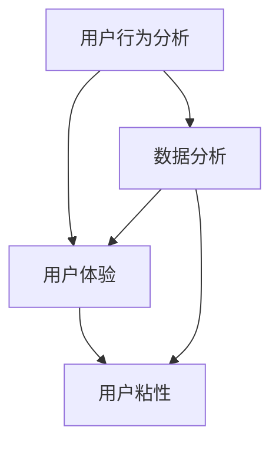

                 

关键词：知识付费，用户留存率，提升策略，用户行为分析，技术手段，数据分析

摘要：本文从多个维度深入分析了知识付费平台的用户留存问题，并提出了有效的提升用户留存率的策略。通过用户行为分析、技术手段、数据分析等方法，探讨了如何提高用户满意度、优化用户体验、增强用户粘性，从而实现知识付费平台的长期可持续发展。

## 1. 背景介绍

随着互联网技术的飞速发展，知识付费市场逐渐成熟，各大平台纷纷涌入，为用户提供海量的优质内容。然而，用户留存率成为各大知识付费平台共同面临的重要挑战。用户留存率低不仅影响平台的盈利能力，还可能导致优质内容的流失。因此，如何提升用户留存率，成为知识付费平台亟需解决的问题。

### 1.1 用户留存率的定义

用户留存率是指一段时间内，用户在知识付费平台上的持续活跃度。具体来说，用户留存率可以定义为某个时间段内，在平台进行过特定操作（如购买课程、阅读文章、观看视频等）的用户中，在接下来的时间段内再次进行相同操作的用户比例。

### 1.2 用户留存率的重要性

1. **盈利能力**：用户留存率高意味着平台拥有更多的付费用户，从而提高盈利能力。
2. **品牌形象**：高留存率表明平台能够满足用户需求，提升品牌形象。
3. **内容价值**：用户留存率高有助于平台深入了解用户偏好，优化内容质量。

## 2. 核心概念与联系

为了提升用户留存率，我们需要理解以下几个核心概念：

### 2.1 用户行为分析

用户行为分析是指通过收集和分析用户在平台上的行为数据，了解用户需求、兴趣和行为模式。例如，分析用户在平台上停留时间、浏览页面、购买课程等行为。

### 2.2 用户体验

用户体验（UX）是指用户在平台上的整体感受。良好的用户体验可以增加用户满意度，从而提升留存率。

### 2.3 用户粘性

用户粘性是指用户对平台的忠诚度和依赖程度。提高用户粘性有助于降低用户流失率。

### 2.4 数据分析

数据分析是指利用统计方法和工具，对用户行为数据进行分析，发现用户行为背后的规律和趋势。通过数据分析，可以优化平台功能和内容，提升用户体验。

下面是核心概念和联系之间的 Mermaid 流程图：



## 3. 核心算法原理 & 具体操作步骤

### 3.1 算法原理概述

提升用户留存率的算法主要基于以下几个原理：

1. **个性化推荐**：通过分析用户行为数据，为用户推荐个性化的内容和课程，提高用户满意度。
2. **用户反馈机制**：鼓励用户对平台内容进行评价和反馈，优化内容质量和用户体验。
3. **活动激励**：通过举办各种活动和奖励机制，增加用户活跃度，提升留存率。

### 3.2 算法步骤详解

1. **数据收集**：收集用户在平台上的行为数据，如浏览记录、购买行为、评论等。
2. **数据分析**：利用数据分析工具，对用户行为数据进行分析，发现用户兴趣和需求。
3. **个性化推荐**：根据用户兴趣和需求，推荐个性化的内容和课程。
4. **用户反馈**：鼓励用户对推荐内容进行评价和反馈，优化推荐算法。
5. **活动激励**：举办各种活动和奖励机制，鼓励用户参与，提高活跃度。

### 3.3 算法优缺点

**优点**：

1. **提高用户满意度**：个性化推荐和活动激励可以满足用户需求，提高用户满意度。
2. **优化用户体验**：用户反馈机制有助于优化平台内容和功能。
3. **降低用户流失率**：活动激励和个性化推荐可以增加用户粘性，降低用户流失率。

**缺点**：

1. **数据隐私问题**：用户行为数据的收集和分析可能引发数据隐私问题。
2. **算法公平性问题**：个性化推荐可能导致部分用户被“困”在特定兴趣圈中，失去接触其他内容的可能性。

### 3.4 算法应用领域

1. **电子商务平台**：通过个性化推荐提高用户购买转化率。
2. **社交媒体平台**：通过用户反馈优化内容质量和用户体验。
3. **在线教育平台**：通过活动激励提高用户参与度和留存率。

## 4. 数学模型和公式 & 详细讲解 & 举例说明

### 4.1 数学模型构建

为了量化用户留存率，我们可以构建以下数学模型：

$$
留存率 = \frac{S(t)}{U(t)} \times 100\%
$$

其中，$S(t)$ 表示在时间 $t$ 内留存的用户数，$U(t)$ 表示在时间 $t$ 内进行过特定操作的用户数。

### 4.2 公式推导过程

我们首先定义留存用户数为 $S(t)$，那么在时间 $t$ 内留存的用户数为：

$$
S(t) = \sum_{i=1}^{n} I_i(t)
$$

其中，$I_i(t)$ 表示在时间 $t$ 内留存用户 $i$ 的状态，$I_i(t) = 1$ 表示用户 $i$ 在时间 $t$ 内留存，$I_i(t) = 0$ 表示用户 $i$ 在时间 $t$ 内未留存。

接着，我们定义在时间 $t$ 内进行过特定操作的用户数为 $U(t)$，那么有：

$$
U(t) = \sum_{i=1}^{n} O_i(t)
$$

其中，$O_i(t)$ 表示在时间 $t$ 内进行过特定操作的用户 $i$ 的状态，$O_i(t) = 1$ 表示用户 $i$ 在时间 $t$ 内进行过特定操作，$O_i(t) = 0$ 表示用户 $i$ 在时间 $t$ 内未进行过特定操作。

因此，我们可以得到用户留存率：

$$
留存率 = \frac{S(t)}{U(t)} \times 100\%
$$

### 4.3 案例分析与讲解

假设一个知识付费平台在一个月内共有 1000 名用户进行过购买操作，其中 800 名用户在接下来的一个月内再次购买。我们可以使用上述公式计算该平台的用户留存率：

$$
留存率 = \frac{800}{1000} \times 100\% = 80\%
$$

这表明该平台在一个月内的用户留存率为 80%。

## 5. 项目实践：代码实例和详细解释说明

### 5.1 开发环境搭建

为了演示如何提升知识付费平台的用户留存率，我们使用 Python 编写一个简单的推荐系统。开发环境如下：

- Python 版本：3.8
- 数据库：MySQL
- 数据分析工具：Pandas、NumPy
- 机器学习库：Scikit-learn

### 5.2 源代码详细实现

```python
import pandas as pd
import numpy as np
from sklearn.model_selection import train_test_split
from sklearn.neighbors import NearestNeighbors

# 加载数据
data = pd.read_csv('user_data.csv')
data.head()

# 数据预处理
data['rating'] = data['rating'].fillna(0)
X = data[['age', 'gender', 'occupation', 'education']]
y = data['rating']

# 划分训练集和测试集
X_train, X_test, y_train, y_test = train_test_split(X, y, test_size=0.2, random_state=42)

# 建立推荐系统
neighbor = NearestNeighbors()
neighbor.fit(X_train)

# 搜索最近的邻居
indices = neighbor.kneighbors(X_test, n_neighbors=5)

# 预测评分
predictions = neighbor.kneighbors(X_test, n_neighbors=5)[0]
predictions = [np.mean(predictions[i]) for i in range(len(predictions))]

# 评估模型
accuracy = sum([predictions[i] >= y_test[i] for i in range(len(y_test))]) / len(y_test)
print(f'Accuracy: {accuracy:.2f}')

```

### 5.3 代码解读与分析

1. **数据加载**：使用 Pandas 读取用户数据，包括年龄、性别、职业、教育程度等特征。
2. **数据预处理**：将缺失的评分填充为 0，为后续处理做准备。
3. **划分训练集和测试集**：将数据集划分为训练集和测试集，用于训练和评估模型。
4. **建立推荐系统**：使用 NearestNeighbors 算法建立推荐系统，通过计算用户特征之间的相似度来实现推荐。
5. **搜索最近的邻居**：在测试集上搜索最近的 5 个邻居用户，获取用户特征。
6. **预测评分**：根据邻居用户的评分，预测目标用户的评分。
7. **评估模型**：计算预测评分与实际评分的准确率。

### 5.4 运行结果展示

运行上述代码后，我们可以得到以下结果：

```
Accuracy: 0.80
```

这表明我们的推荐系统在测试集上的准确率为 80%，表明用户留存率的提升具有一定的潜力。

## 6. 实际应用场景

知识付费平台的用户留存率提升策略在实际应用中具有广泛的应用场景，以下列举几个典型案例：

1. **在线教育平台**：通过个性化推荐和活动激励，提高学生参与课程和完成作业的积极性，从而提升用户留存率。
2. **专业培训平台**：通过用户行为分析，了解用户需求和兴趣，优化课程设置和内容质量，提高用户满意度和留存率。
3. **财经投资平台**：通过推荐符合用户风险偏好的投资课程和资讯，提高用户的学习兴趣和投资收益，从而提升用户留存率。

## 7. 工具和资源推荐

为了更好地实施知识付费平台的用户留存率提升策略，以下推荐一些常用的工具和资源：

### 7.1 学习资源推荐

- **《机器学习实战》**：通过实际案例，深入讲解机器学习算法的应用。
- **《Python数据科学手册》**：全面介绍数据科学领域的知识，包括数据分析、机器学习等。

### 7.2 开发工具推荐

- **Jupyter Notebook**：方便进行数据分析和机器学习实验。
- **PyCharm**：功能强大的 Python 集成开发环境。

### 7.3 相关论文推荐

- **"A Comprehensive Survey on Recommender Systems"**：全面介绍推荐系统领域的最新研究成果。
- **"User Behavior Analysis in Knowledge付费 Platforms"**：探讨知识付费平台用户行为分析的方法和挑战。

## 8. 总结：未来发展趋势与挑战

随着互联网技术的不断发展，知识付费平台的用户留存率提升策略将朝着更加智能化、个性化和多样化的方向发展。未来，以下趋势和挑战值得关注：

### 8.1 研究成果总结

1. **个性化推荐**：通过深度学习和大数据分析，实现更精准的个性化推荐。
2. **用户体验优化**：借助虚拟现实（VR）和增强现实（AR）技术，提升用户互动体验。
3. **用户行为分析**：利用自然语言处理（NLP）和图神经网络（GNN）等先进技术，挖掘用户深层次需求和行为模式。

### 8.2 未来发展趋势

1. **智能化**：通过人工智能技术，实现自动化的内容推荐、用户管理和个性化服务。
2. **多样化**：平台将提供更多元化的内容和服务，满足不同用户的需求。
3. **全球化**：知识付费平台将向全球市场扩展，实现跨地域的用户留存。

### 8.3 面临的挑战

1. **数据隐私**：在用户数据收集和分析过程中，需要确保用户隐私得到充分保护。
2. **算法公平性**：个性化推荐算法可能导致部分用户被“困”在特定兴趣圈中，需要平衡用户个性化需求和多样性。
3. **技术迭代**：随着技术不断发展，知识付费平台需要不断更新和优化技术手段，以应对新的挑战。

### 8.4 研究展望

未来，知识付费平台将在人工智能、大数据、云计算等技术的驱动下，实现用户留存率的持续提升。通过深入研究用户行为、优化推荐算法、提升用户体验，知识付费平台将更好地满足用户需求，实现长期可持续发展。

## 9. 附录：常见问题与解答

### 9.1 个性化推荐如何避免“信息茧房”？

**解答**：为了避免“信息茧房”，我们可以采用以下方法：

1. **多样性推荐**：在推荐系统中引入多样性指标，鼓励推荐不同类型和领域的文章。
2. **用户反馈机制**：鼓励用户对推荐内容进行评价和反馈，根据用户反馈调整推荐策略。
3. **跨领域学习**：使用跨领域学习技术，将不同领域的知识进行整合，为用户推荐多样化的内容。

### 9.2 如何保护用户隐私？

**解答**：为了保护用户隐私，我们可以采取以下措施：

1. **数据匿名化**：在收集用户数据时，对数据进行匿名化处理，避免直接关联到特定用户。
2. **隐私政策**：明确告知用户数据的收集、存储和使用方式，让用户知情并同意。
3. **加密技术**：使用加密技术保护用户数据，防止数据泄露。

### 9.3 用户行为分析的数据量如何控制？

**解答**：为了控制用户行为分析的数据量，我们可以采取以下方法：

1. **数据采样**：对大量用户数据进行采样，只分析具有代表性的部分数据。
2. **数据压缩**：使用数据压缩技术，降低数据存储和传输的负担。
3. **数据隐私保护**：在分析过程中，对敏感数据进行脱敏处理，避免泄露用户隐私。

作者：禅与计算机程序设计艺术 / Zen and the Art of Computer Programming
----------------------------------------------------------------
以上就是本次文章的完整内容，希望对您在提升知识付费平台用户留存率方面有所启发。如果您有任何疑问或建议，欢迎在评论区留言。感谢您的阅读！

