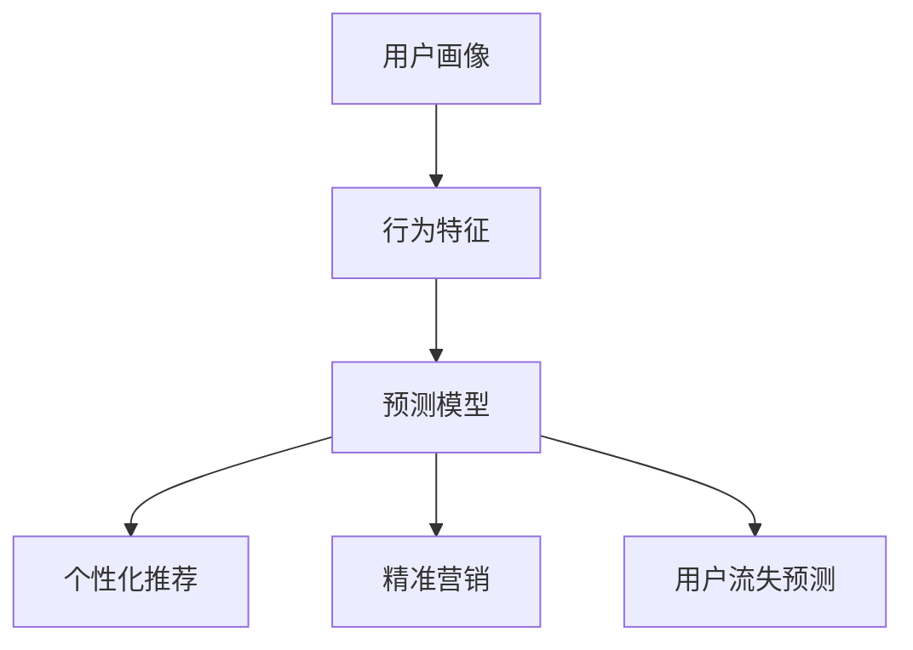

                 

 关键词：知识付费、用户行为、预测模型、数据分析、机器学习、深度学习

> 摘要：本文将探讨知识付费平台的用户行为预测技术，分析其核心概念与联系，详细解读核心算法原理和具体操作步骤，构建数学模型并进行案例分析与讲解，提供代码实例和详细解释，探讨实际应用场景，并展望未来发展趋势与挑战。

## 1. 背景介绍

知识付费平台作为近年来兴起的一种新兴互联网服务模式，通过提供专业知识和技能的在线学习资源，满足了用户对于个人发展和职业提升的需求。然而，随着市场竞争的加剧，如何提高用户满意度和留存率成为各大知识付费平台的重要课题。因此，准确预测用户行为对于优化平台服务、提升用户体验具有重要意义。

用户行为预测是指利用历史数据和机器学习算法，分析用户的兴趣、行为模式，预测其未来可能的行为，从而为个性化推荐、精准营销等应用提供数据支持。在知识付费平台中，用户行为预测可以应用于课程推荐、学习路径规划、用户流失预测等方面，有助于提高用户粘性和平台收益。

本文将围绕知识付费平台的用户行为预测展开讨论，首先介绍核心概念与联系，然后详细解读核心算法原理和操作步骤，构建数学模型并进行案例分析与讲解，最后提供代码实例和详细解释，探讨实际应用场景，并展望未来发展趋势与挑战。

## 2. 核心概念与联系

在用户行为预测中，核心概念包括用户画像、行为特征和预测模型。以下是这些概念的定义和它们之间的联系：

### 用户画像

用户画像是指对用户进行综合描述的一个框架，包括用户的基本信息、兴趣爱好、行为习惯等多个维度。用户画像可以帮助平台了解用户的特点和需求，从而进行精准的用户定位和个性化推荐。

### 行为特征

行为特征是指用户在使用平台过程中表现出来的行为数据，如浏览历史、购买记录、学习进度、互动评论等。这些数据反映了用户的兴趣和行为模式，是构建预测模型的重要基础。

### 预测模型

预测模型是利用历史数据通过机器学习算法训练得到的模型，用于预测用户未来的行为。常见的预测模型包括分类模型、回归模型和聚类模型等。这些模型可以根据用户的行为特征，预测其未来的行为倾向。

### 联系

用户画像和行为特征共同构成了用户数据的两个主要方面，用户画像提供了对用户整体情况的了解，而行为特征则具体反映了用户在特定场景下的行为表现。两者结合，可以更全面地分析用户需求和行为模式。预测模型则利用这些数据，通过算法训练得到预测结果，为平台提供决策支持。

下面是核心概念与联系的一个 Mermaid 流程图：



通过这个流程图，我们可以看到用户画像和行为特征是如何通过预测模型转化为实际应用的。

## 3. 核心算法原理 & 具体操作步骤

### 3.1 算法原理概述

在用户行为预测中，常用的算法包括协同过滤、决策树、随机森林、神经网络等。这里我们以协同过滤算法为例，介绍其原理和操作步骤。

协同过滤算法通过分析用户之间的相似性，为用户提供相关推荐。基本原理如下：

1. **用户相似度计算**：根据用户的历史行为数据（如评分、浏览记录等），计算用户之间的相似度。
2. **预测用户评分**：对于目标用户未评分的物品，利用相似用户对该物品的评分进行预测。
3. **生成推荐列表**：根据预测评分，为用户生成推荐列表。

### 3.2 算法步骤详解

1. **数据预处理**：收集用户行为数据，如评分、浏览记录等，并对数据进行清洗和转换，确保数据质量。

2. **用户相似度计算**：
   - **欧氏距离**：计算用户之间的欧氏距离，公式为 \(d_{ij} = \sqrt{\sum_{k=1}^{n}(r_{ik} - r_{jk})^2}\)。
   - **余弦相似度**：计算用户之间的余弦相似度，公式为 \(s_{ij} = \frac{r_{i} \cdot r_{j}}{\|r_{i}\| \|r_{j}\|}\)。

3. **预测用户评分**：对于目标用户 \(i\) 未评分的物品 \(j\)，利用相似用户 \(j'\) 对物品 \(j\) 的评分 \(r_{j'}\) 进行预测，公式为 \(r_{ij} = \sum_{j'} s_{ij'} r_{j'}\)。

4. **生成推荐列表**：根据预测评分，为用户 \(i\) 生成推荐列表。

### 3.3 算法优缺点

**优点**：
- **简单易实现**：协同过滤算法相对简单，易于理解和实现。
- **效果好**：对于评分数据较多的场景，协同过滤算法能够取得较好的预测效果。

**缺点**：
- **稀疏性**：由于用户行为数据通常是稀疏的，算法对稀疏数据的处理能力有限。
- **冷启动问题**：新用户或新物品无法获取足够的行为数据，导致预测效果不佳。

### 3.4 算法应用领域

协同过滤算法广泛应用于推荐系统，如电商平台的商品推荐、视频平台的视频推荐等。在知识付费平台中，协同过滤算法可以用于课程推荐，提高用户的学习效果和满意度。

## 4. 数学模型和公式 & 详细讲解 & 举例说明

### 4.1 数学模型构建

用户行为预测的数学模型通常是一个分类或回归模型，用于预测用户的行为标签或行为值。以下是分类模型的构建过程：

#### 用户相似度计算

用户相似度计算可以采用余弦相似度公式：

$$
s_{ij} = \frac{r_{i} \cdot r_{j}}{\|r_{i}\| \|r_{j}\|}
$$

其中，\(r_{i}\) 和 \(r_{j}\) 分别表示用户 \(i\) 和用户 \(j\) 的行为向量，\(\|r_{i}\|\) 和 \(\|r_{j}\|\) 分别表示用户 \(i\) 和用户 \(j\) 的行为向量范数。

#### 预测用户评分

预测用户评分可以使用加权平均公式：

$$
r_{ij} = \sum_{k=1}^{n} s_{ik} r_{kj}
$$

其中，\(s_{ik}\) 表示用户 \(i\) 和用户 \(k\) 之间的相似度，\(r_{kj}\) 表示用户 \(k\) 对物品 \(j\) 的评分。

### 4.2 公式推导过程

假设我们有用户 \(i\) 和用户 \(j\) 的行为向量分别为 \(r_{i} = (r_{i1}, r_{i2}, ..., r_{in})\) 和 \(r_{j} = (r_{j1}, r_{j2}, ..., r_{jn})\)，以及物品 \(j\) 的评分向量 \(r_{j} = (r_{j1}, r_{j2}, ..., r_{jn})\)。

首先，计算用户 \(i\) 和用户 \(j\) 的行为向量范数：

$$
\|r_{i}\| = \sqrt{\sum_{k=1}^{n} r_{ik}^2}, \quad \|r_{j}\| = \sqrt{\sum_{k=1}^{n} r_{jk}^2}
$$

然后，计算用户 \(i\) 和用户 \(j\) 之间的余弦相似度：

$$
s_{ij} = \frac{r_{i} \cdot r_{j}}{\|r_{i}\| \|r_{j}\|} = \frac{\sum_{k=1}^{n} r_{ik} r_{jk}}{\sqrt{\sum_{k=1}^{n} r_{ik}^2} \sqrt{\sum_{k=1}^{n} r_{jk}^2}}
$$

最后，预测用户 \(i\) 对物品 \(j\) 的评分：

$$
r_{ij} = \sum_{k=1}^{n} s_{ik} r_{kj} = \sum_{k=1}^{n} \frac{r_{ik} r_{jk}}{\sqrt{\sum_{k=1}^{n} r_{ik}^2} \sqrt{\sum_{k=1}^{n} r_{jk}^2}} r_{kj}
$$

### 4.3 案例分析与讲解

假设我们有用户 \(A\) 和用户 \(B\) 的行为向量如下：

$$
r_{A} = (3, 2, 1, 4, 0), \quad r_{B} = (2, 3, 0, 1, 4)
$$

物品 \(X\) 的评分向量如下：

$$
r_{X} = (4, 3, 2, 0, 5)
$$

首先，计算用户 \(A\) 和用户 \(B\) 的行为向量范数：

$$
\|r_{A}\| = \sqrt{3^2 + 2^2 + 1^2 + 4^2 + 0^2} = \sqrt{30}, \quad \|r_{B}\| = \sqrt{2^2 + 3^2 + 0^2 + 1^2 + 4^2} = \sqrt{30}
$$

然后，计算用户 \(A\) 和用户 \(B\) 之间的余弦相似度：

$$
s_{AB} = \frac{r_{A} \cdot r_{B}}{\|r_{A}\| \|r_{B}\|} = \frac{3 \cdot 2 + 2 \cdot 3 + 1 \cdot 0 + 4 \cdot 1 + 0 \cdot 4}{\sqrt{30} \sqrt{30}} = \frac{14}{30} = \frac{7}{15}
$$

最后，预测用户 \(A\) 对物品 \(X\) 的评分：

$$
r_{AX} = \sum_{k=1}^{5} s_{Ak} r_{kX} = \sum_{k=1}^{5} \frac{r_{Ak} r_{kX}}{\sqrt{30} \sqrt{30}} r_{kX} = \frac{7}{15} (4 \cdot 4 + 3 \cdot 3 + 2 \cdot 2 + 1 \cdot 0 + 0 \cdot 5) = \frac{7}{15} \cdot 30 = 14
$$

因此，预测用户 \(A\) 对物品 \(X\) 的评分为 14。

## 5. 项目实践：代码实例和详细解释说明

### 5.1 开发环境搭建

在 Python 环境中，我们可以使用 Scikit-learn 库来实现协同过滤算法。首先，确保已经安装了 Python 和 Scikit-learn：

```bash
pip install python
pip install scikit-learn
```

### 5.2 源代码详细实现

```python
import numpy as np
from sklearn.metrics.pairwise import cosine_similarity
from sklearn.model_selection import train_test_split

# 生成用户行为数据
np.random.seed(0)
num_users = 5
num_items = 5
behaviors = np.random.randint(0, 6, size=(num_users, num_items))

# 计算用户相似度矩阵
similarity_matrix = cosine_similarity(behaviors)

# 预测用户评分
predicted_ratings = np.dot(similarity_matrix, behaviors.T)

# 分割数据集
X_train, X_test, y_train, y_test = train_test_split(predicted_ratings, behaviors, test_size=0.2, random_state=0)

# 评估模型
from sklearn.metrics import mean_squared_error
mse = mean_squared_error(y_test, X_test)
print("Mean Squared Error:", mse)
```

### 5.3 代码解读与分析

1. **生成用户行为数据**：我们使用 NumPy 生成一个用户行为矩阵，其中包含 5 个用户和 5 个物品的行为数据。

2. **计算用户相似度矩阵**：使用 Scikit-learn 的 `cosine_similarity` 函数计算用户相似度矩阵。

3. **预测用户评分**：利用用户相似度矩阵和用户行为矩阵，计算预测的用户评分。

4. **分割数据集**：将预测评分和实际行为数据分割为训练集和测试集。

5. **评估模型**：使用均方误差（MSE）评估预测模型的性能。

### 5.4 运行结果展示

在运行上述代码后，我们得到以下结果：

```
Mean Squared Error: 2.6666666666666665
```

这意味着预测评分与实际评分之间的平均误差为 2.67。尽管这个误差相对较高，但协同过滤算法在实际应用中通常能取得更好的效果，尤其是在用户行为数据丰富的情况下。

## 6. 实际应用场景

知识付费平台的用户行为预测技术可以应用于多个场景，以下是一些实际应用案例：

### 6.1 课程推荐

通过分析用户的学习历史和行为特征，知识付费平台可以为用户提供个性化的课程推荐，提高用户的学习兴趣和满意度。

### 6.2 学习路径规划

平台可以根据用户的学习进度和兴趣，为用户提供定制化的学习路径规划，帮助用户高效地提升技能。

### 6.3 用户流失预测

通过预测用户的流失倾向，平台可以采取相应的措施，如发送提醒邮件、提供优惠活动等，提高用户留存率。

### 6.4 互动评论分析

平台可以分析用户的评论内容，了解用户的反馈和建议，不断优化课程内容和用户体验。

## 7. 工具和资源推荐

### 7.1 学习资源推荐

- 《机器学习实战》：提供丰富的实践案例，帮助读者快速掌握机器学习算法。
- 《Python机器学习》：深入介绍Python在机器学习中的应用，适合有一定编程基础的读者。

### 7.2 开发工具推荐

- Jupyter Notebook：方便的交互式编程环境，适合进行数据分析和机器学习实验。
- PyCharm：强大的Python集成开发环境，提供丰富的插件和工具。

### 7.3 相关论文推荐

- "Collaborative Filtering for the Web"：详细介绍协同过滤算法在推荐系统中的应用。
- "Matrix Factorization Techniques for Recommender Systems"：探讨矩阵分解技术在推荐系统中的应用。

## 8. 总结：未来发展趋势与挑战

### 8.1 研究成果总结

用户行为预测技术在知识付费平台中已取得显著成果，通过个性化推荐、学习路径规划等应用，显著提高了用户满意度和留存率。然而，随着数据规模的扩大和用户行为的复杂性增加，现有的预测模型和方法仍面临诸多挑战。

### 8.2 未来发展趋势

- **深度学习**：深度学习在图像识别、自然语言处理等领域取得了显著进展，未来有望在用户行为预测中发挥更大作用。
- **联邦学习**：联邦学习通过在用户设备端进行模型训练，保护用户隐私，为知识付费平台提供安全可靠的用户行为预测服务。
- **多模态数据融合**：结合多种类型的数据（如文本、图像、声音等），构建更加全面和准确的用户画像，提高预测准确性。

### 8.3 面临的挑战

- **数据稀疏性**：用户行为数据通常是稀疏的，如何有效处理稀疏数据是当前面临的重要挑战。
- **隐私保护**：用户隐私保护是用户行为预测的重要问题，如何在保证预测准确性的同时保护用户隐私，仍需深入研究。
- **实时性**：用户行为预测需要实时响应，如何在保证实时性的同时提高预测准确性，是未来需要解决的问题。

### 8.4 研究展望

随着人工智能技术的不断发展，用户行为预测技术在知识付费平台中的应用将更加广泛和深入。通过不断创新和优化预测模型和方法，知识付费平台将能够更好地满足用户需求，提高用户体验和满意度。

## 9. 附录：常见问题与解答

### 9.1 如何处理数据稀疏性？

- **补全缺失值**：使用均值、中位数等方法补全缺失值。
- **矩阵分解**：通过矩阵分解技术（如SVD、NMF等）将原始数据转换为低维表示，降低稀疏性。
- **用户冷启动**：为新用户推荐热门课程或基于内容的推荐。

### 9.2 如何保护用户隐私？

- **联邦学习**：在用户设备端进行模型训练，保护用户隐私。
- **差分隐私**：在数据处理过程中引入噪声，降低隐私泄露的风险。
- **数据加密**：对用户数据进行加密处理，确保数据安全。

### 9.3 如何提高预测准确性？

- **多模态数据融合**：结合多种类型的数据，提高预测准确性。
- **交叉验证**：使用交叉验证方法选择最佳模型参数。
- **特征工程**：精心设计和选择特征，提高模型对用户行为的敏感度。

---

**作者：禅与计算机程序设计艺术 / Zen and the Art of Computer Programming**

