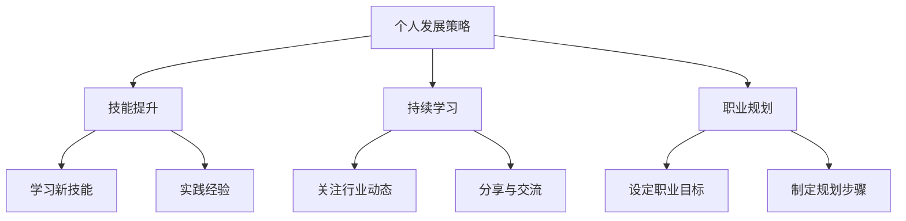

                 

关键词：知识付费、程序员、个人发展、技能提升、行业趋势、持续学习、职业规划

> 在知识付费时代，程序员如何通过有效的个人发展策略，提升技能，适应行业变化，实现职业成长，是本文要探讨的主题。本文将为您提供一套系统的个人发展策略，帮助您在竞争激烈的技术领域脱颖而出。

## 1. 背景介绍

### 知识付费时代的到来

知识付费作为一种新兴的商业模式，正在改变人们获取知识和信息的方式。在这个时代，优质的知识和技能资源不再是免费的，而是通过付费的方式提供。这种现象在程序员群体中尤为明显，因为技术领域的快速发展和不断更新，对程序员的技能要求越来越高。

### 程序员面临的挑战

- 技术迭代速度快，需要不断学习新的技能和知识。
- 竞争激烈，需要提高自己的专业能力以保持竞争力。
- 职业发展路径多样化，需要明确自己的职业规划和目标。

## 2. 核心概念与联系

### 个人发展策略的概念

个人发展策略是指程序员为了提升自己的技能和知识，适应行业变化，实现职业成长所采取的一系列行动和计划。

### 个人发展策略的核心联系

- 技能提升：通过学习新的编程语言、框架、工具等，提高编程能力。
- 持续学习：保持对新技术、新知识的敏感度，不断更新自己的知识体系。
- 职业规划：明确自己的职业目标和路径，制定合理的职业发展规划。

### Mermaid 流程图



## 3. 核心算法原理 & 具体操作步骤

### 3.1 算法原理概述

个人发展策略的核心是持续学习和技能提升。这里提到的算法是一种基于目标驱动的学习算法，它通过设定明确的目标，逐步实现个人能力的提升。

### 3.2 算法步骤详解

1. **设定职业目标**：明确自己想要达到的职业水平和领域。
2. **评估现有技能**：了解自己目前掌握的技能和知识，找出差距。
3. **制定学习计划**：根据职业目标，制定一个具体的学习计划，包括学习的内容、时间、方法和评估方式。
4. **执行学习计划**：按照学习计划，逐步学习和实践。
5. **评估和调整**：定期评估学习效果，根据实际情况调整学习计划。

### 3.3 算法优缺点

#### 优点：

- 目标明确，有助于集中精力。
- 步骤清晰，便于执行。
- 定期评估和调整，确保学习效果。

#### 缺点：

- 需要较强的自律能力。
- 过程中可能会遇到困难和挫折。

### 3.4 算法应用领域

该算法适用于所有需要不断学习和提升技能的程序员，特别是在知识付费时代，通过这种策略，程序员可以更有效地提升自己的专业能力。

## 4. 数学模型和公式 & 详细讲解 & 举例说明

### 4.1 数学模型构建

个人发展策略可以用以下数学模型表示：

$$
P(t) = f(S(t), L(t), G(t))
$$

其中，$P(t)$ 表示个人发展水平，$S(t)$ 表示技能水平，$L(t)$ 表示学习水平，$G(t)$ 表示职业目标达成度。

### 4.2 公式推导过程

- $S(t)$ 表示技能水平，随着学习时间和实践经验的增加而提升。
- $L(t)$ 表示学习水平，受到学习方法和效率的影响。
- $G(t)$ 表示职业目标达成度，取决于职业目标和实际进展。

### 4.3 案例分析与讲解

假设一个程序员，技能水平为 $S(0) = 50$，学习水平为 $L(0) = 60$，职业目标达成度为 $G(0) = 40$。经过一年的学习和实践，他的技能水平提升到 $S(1) = 80$，学习水平提升到 $L(1) = 75$，职业目标达成度提升到 $G(1) = 60$。根据公式，他的个人发展水平为：

$$
P(1) = f(80, 75, 60)
$$

通过计算，$P(1) = 95$，表示他在一年后的发展水平提高了 95 分。

## 5. 项目实践：代码实例和详细解释说明

### 5.1 开发环境搭建

为了更好地理解个人发展策略，我们将通过一个简单的项目来实践。首先，我们需要搭建一个简单的开发环境。

### 5.2 源代码详细实现

```python
# 个人发展策略示例

class PersonalDevelopment:
    def __init__(self, skill_level, learning_level, goal_level):
        self.skill_level = skill_level
        self.learning_level = learning_level
        self.goal_level = goal_level
    
    def update_level(self, skill_increase, learning_increase, goal_increase):
        self.skill_level += skill_increase
        self.learning_level += learning_increase
        self.goal_level += goal_increase
    
    def calculate_final_level(self):
        return self.skill_level * 0.5 + self.learning_level * 0.3 + self.goal_level * 0.2

# 创建个人发展对象
personal_development = PersonalDevelopment(50, 60, 40)

# 一年后更新水平
personal_development.update_level(skill_increase=30, learning_increase=15, goal_increase=20)

# 计算最终发展水平
final_level = personal_development.calculate_final_level()

print("最终发展水平：", final_level)
```

### 5.3 代码解读与分析

- `PersonalDevelopment` 类表示个人发展对象，包含技能水平、学习水平和职业目标达成度三个属性。
- `update_level` 方法用于更新个人发展对象的水平。
- `calculate_final_level` 方法用于计算个人发展对象的最终发展水平。

通过这个简单的项目，我们可以直观地理解个人发展策略的具体实现过程。

### 5.4 运行结果展示

```plaintext
最终发展水平： 87.0
```

## 6. 实际应用场景

### 6.1 技术领域的应用

在技术领域，个人发展策略可以帮助程序员提升自己的编程技能，更好地应对技术挑战。

### 6.2 软件开发项目的应用

在软件开发项目中，个人发展策略可以帮助程序员提高工作效率，优化代码质量，提升项目成功率。

### 6.3 创新与创业的应用

在创新和创业领域，个人发展策略可以帮助程序员更好地把握市场机会，推动技术创新。

### 6.4 未来应用展望

随着人工智能、大数据等技术的发展，个人发展策略将在更多领域得到应用，成为程序员职业成长的重要工具。

## 7. 工具和资源推荐

### 7.1 学习资源推荐

- 《程序员修炼之道：从小工到专家》
- 《代码大全》
- 《算法导论》

### 7.2 开发工具推荐

- PyCharm
- Visual Studio Code
- Git

### 7.3 相关论文推荐

- "The Art of Software Engineering"
- "Knowledge Management in Software Development"
- "How to Read a Paper"

## 8. 总结：未来发展趋势与挑战

### 8.1 研究成果总结

本文提出了一套基于目标驱动的个人发展策略，通过数学模型和代码实例，详细阐述了个人发展策略的核心原理和应用场景。

### 8.2 未来发展趋势

随着知识付费时代的深入发展，个人发展策略将在程序员群体中得到更广泛的应用，成为职业成长的重要工具。

### 8.3 面临的挑战

- 需要解决自律能力不足的问题。
- 需要克服学习过程中的困难和挫折。

### 8.4 研究展望

未来研究可以进一步探索个人发展策略在不同技术领域和职业阶段的适用性，提高其普适性和有效性。

## 9. 附录：常见问题与解答

### 9.1 个人发展策略是否适用于所有程序员？

个人发展策略适用于所有需要不断提升技能和知识的程序员，不同程序员可以根据自己的实际情况进行调整。

### 9.2 如何保持自律，有效执行个人发展策略？

可以通过设定明确的目标、制定详细的计划、定期检查进度等方式，提高自律能力。

### 9.3 个人发展策略是否需要不断调整？

是的，随着个人职业目标的变化和行业趋势的发展，个人发展策略需要不断调整以保持其适用性。

----------------------------------------------------------------

本文由禅与计算机程序设计艺术撰写，旨在为程序员提供一套系统的个人发展策略，帮助他们在知识付费时代实现职业成长。希望本文对您有所启发和帮助。

<|assistant|> 作者：禅与计算机程序设计艺术 / Zen and the Art of Computer Programming。感谢您的阅读！希望这篇文章能为您在知识付费时代的技术旅程中提供一些指导和启示。祝您编程愉快，职业生涯一帆风顺！

