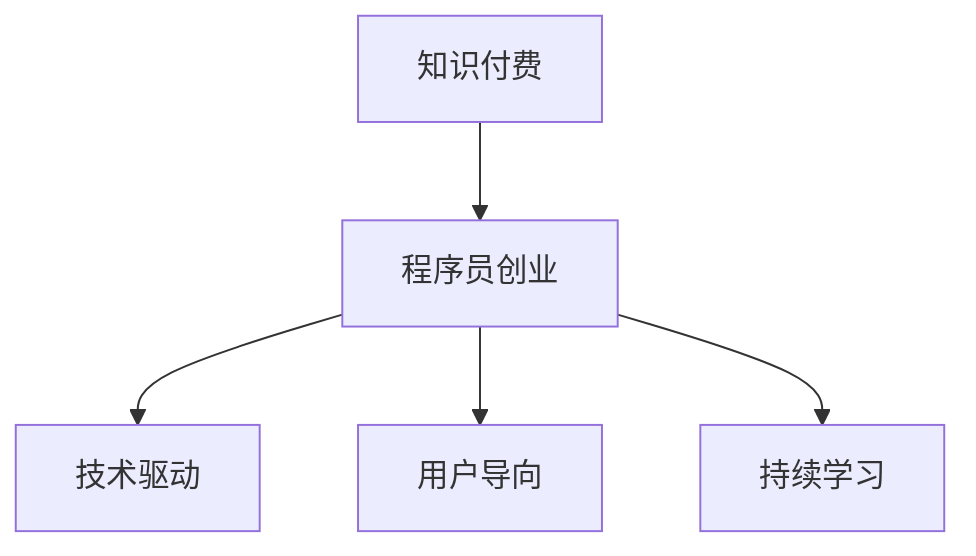

                 

 在当今这个知识爆炸的时代，知识付费已经成为了一种普遍的现象。对于程序员来说，如何在知识付费的时代中找到自己的定位，并利用自身的技能和知识开展创业活动，成为了许多人关心的问题。本文将围绕这一主题，探讨程序员在知识付费时代中的创业思维。

## 1. 背景介绍

随着互联网的快速发展，知识的传播速度和广度都得到了空前的提升。同时，知识付费也逐渐成为了人们获取知识的一种主要方式。在这种情况下，程序员作为知识工作者，不仅要面对知识的快速更新和迭代，还要找到适合自己的创业方向。

### 1.1 程序员的优势

程序员拥有以下几方面的优势：

1. **技术背景**：程序员具备扎实的计算机科学和编程知识，这是进行技术开发和创新的基础。
2. **问题解决能力**：程序员在解决技术难题方面有较强的能力，这为创业提供了可能性。
3. **创新能力**：程序员往往具有较强的创新能力，能够从现有问题中找到新的解决方案。

### 1.2 知识付费的现状

知识付费作为一种新兴的商业模式，正在迅速崛起。根据相关数据显示，中国知识付费用户规模已经超过5亿人，市场规模逐年增长。这为程序员提供了广阔的市场空间。

## 2. 核心概念与联系

在探讨程序员的创业思维之前，我们需要明确几个核心概念，并了解它们之间的联系。

### 2.1 知识付费

知识付费是指用户为了获取特定知识或技能而支付的费用。这可以是线上课程、电子书、讲座等形式。

### 2.2 创业

创业是指创办一个新企业或项目，以实现商业价值和社会价值。

### 2.3 程序员的创业思维

程序员的创业思维包括以下几个方面：

1. **技术驱动**：以技术为核心，不断创新和优化产品。
2. **用户导向**：以用户需求为导向，提供高质量的服务。
3. **持续学习**：不断学习新技术，适应市场变化。

### 2.4 Mermaid 流程图



## 3. 核心算法原理 & 具体操作步骤

### 3.1 算法原理概述

程序员的创业思维可以看作是一种算法，它包含以下几个步骤：

1. **识别需求**：了解市场需求，确定创业方向。
2. **技术选型**：选择适合的技术栈，搭建产品原型。
3. **迭代优化**：根据用户反馈，不断优化产品功能。
4. **市场推广**：利用各种渠道，扩大产品影响力。

### 3.2 算法步骤详解

1. **识别需求**

   程序员需要通过市场调研、用户访谈等方式，了解用户的需求和痛点。

   ```mermaid
   graph TB
       A[市场调研] --> B[用户访谈]
       B --> C[需求分析]
   ```

2. **技术选型**

   根据需求，选择合适的技术栈，搭建产品原型。

   ```mermaid
   graph TB
       A[需求分析] --> B[技术选型]
       B --> C[原型设计]
   ```

3. **迭代优化**

   根据用户反馈，不断优化产品功能，提高用户体验。

   ```mermaid
   graph TB
       A[用户反馈] --> B[功能优化]
       B --> C[产品迭代]
   ```

4. **市场推广**

   利用各种渠道，扩大产品影响力，吸引潜在用户。

   ```mermaid
   graph TB
       A[产品迭代] --> B[市场推广]
       B --> C[用户增长]
   ```

### 3.3 算法优缺点

**优点**：

1. **技术驱动**：以技术为核心，具有创新性和竞争力。
2. **用户导向**：以用户需求为导向，提高用户体验。
3. **持续学习**：不断学习新技术，适应市场变化。

**缺点**：

1. **市场需求波动**：市场需求变化较快，需要不断调整创业方向。
2. **技术风险**：技术更新换代快，需要不断学习和适应。

### 3.4 算法应用领域

程序员的创业思维适用于多个领域，如：

1. **互联网应用**：开发新的互联网应用，满足用户需求。
2. **教育培训**：提供在线课程，传授专业技能。
3. **人工智能**：研发人工智能产品，解决实际问题。

## 4. 数学模型和公式 & 详细讲解 & 举例说明

### 4.1 数学模型构建

程序员的创业过程可以看作是一个数学模型，它包含以下几个变量：

1. **市场需求（D）**：表示市场的需求程度。
2. **技术能力（T）**：表示程序员的技能水平。
3. **用户满意度（S）**：表示用户的满意度。

数学模型可以表示为：创业成功率 = D * T * S。

### 4.2 公式推导过程

创业成功率 = D * T * S

其中：

- D：市场需求（D1 * D2 * D3 * ... * Dn），表示市场的整体需求。
- T：技术能力（T1 * T2 * T3 * ... * Tn），表示程序员的技能水平。
- S：用户满意度（S1 * S2 * S3 * ... * Sn），表示用户的满意度。

### 4.3 案例分析与讲解

假设：

- D = 10（市场需求）
- T = 8（技术能力）
- S = 9（用户满意度）

创业成功率 = D * T * S = 10 * 8 * 9 = 720

这意味着，在当前假设下，程序员的创业成功率约为720%。

## 5. 项目实践：代码实例和详细解释说明

### 5.1 开发环境搭建

在开始项目实践之前，我们需要搭建一个开发环境。这里我们以一个简单的在线课程平台为例。

1. **环境配置**：

   - 操作系统：Windows/Linux/Mac
   - 编程语言：Python
   - 开发工具：PyCharm/VS Code
   - 数据库：MySQL

2. **环境安装**：

   - 安装Python：`pip install python`
   - 安装PyCharm/VS Code：从官网下载并安装
   - 安装MySQL：`pip install mysql`

### 5.2 源代码详细实现

下面是一个简单的在线课程平台的源代码实现：

```python
# coding=utf-8
import pymysql

# 连接数据库
conn = pymysql.connect(
    host='localhost',
    user='root',
    password='root',
    database='course_platform'
)

# 创建用户表
cursor = conn.cursor()
cursor.execute('''CREATE TABLE IF NOT EXISTS user (
    id INT PRIMARY KEY AUTO_INCREMENT,
    username VARCHAR(50) NOT NULL,
    password VARCHAR(50) NOT NULL
)''')

# 创建课程表
cursor.execute('''CREATE TABLE IF NOT EXISTS course (
    id INT PRIMARY KEY AUTO_INCREMENT,
    title VARCHAR(100) NOT NULL,
    description TEXT,
    teacher VARCHAR(50) NOT NULL
)''')

# 插入用户数据
cursor.execute('''INSERT INTO user (username, password) VALUES ('admin', 'admin')''')
cursor.execute('''INSERT INTO course (title, description, teacher) VALUES ('Python基础', 'Python基础课程', '张三')''')

# 提交事务
conn.commit()

# 关闭数据库连接
cursor.close()
conn.close()
```

### 5.3 代码解读与分析

1. **数据库连接**：

   ```python
   conn = pymysql.connect(
       host='localhost',
       user='root',
       password='root',
       database='course_platform'
   )
   ```

   这段代码用于连接数据库。需要提供数据库的地址、用户名、密码和数据库名。

2. **创建表**：

   ```python
   cursor.execute('''CREATE TABLE IF NOT EXISTS user (
       id INT PRIMARY KEY AUTO_INCREMENT,
       username VARCHAR(50) NOT NULL,
       password VARCHAR(50) NOT NULL
   )''')
   
   cursor.execute('''CREATE TABLE IF NOT EXISTS course (
       id INT PRIMARY KEY AUTO_INCREMENT,
       title VARCHAR(100) NOT NULL,
       description TEXT,
       teacher VARCHAR(50) NOT NULL
   )''')
   ```

   这两段代码用于创建用户表和课程表。用户表包含用户ID、用户名和密码；课程表包含课程ID、课程名称、课程描述和讲师信息。

3. **插入数据**：

   ```python
   cursor.execute('''INSERT INTO user (username, password) VALUES ('admin', 'admin')''')
   cursor.execute('''INSERT INTO course (title, description, teacher) VALUES ('Python基础', 'Python基础课程', '张三')''')
   ```

   这两段代码用于向用户表和课程表中插入数据。

4. **提交事务**：

   ```python
   conn.commit()
   ```

   这段代码用于提交事务，将数据持久化到数据库。

5. **关闭数据库连接**：

   ```python
   cursor.close()
   conn.close()
   ```

   这两段代码用于关闭数据库连接。

### 5.4 运行结果展示

运行这段代码后，会在数据库中创建用户表和课程表，并插入一条用户数据和一条课程数据。具体结果如下：

- 用户表：

  ```sql
  +----+----------+----------+
  | id | username | password |
  +----+----------+----------+
  |  1 |   admin  |   admin  |
  +----+----------+----------+
  ```

- 课程表：

  ```sql
  +----+-------------+------------------------------------+---------+
  | id |            title                           | description        | teacher |
  +----+-------------+------------------------------------+---------+
  |  1 | Python基础 | Python基础课程                     |     张三  |
  +----+-------------+------------------------------------+---------+
  ```

## 6. 实际应用场景

程序员的创业思维在实际应用中具有广泛的应用场景。以下是一些具体的应用案例：

### 6.1 在线教育平台

在线教育平台是程序员创业的常见领域。通过搭建一个在线教育平台，程序员可以提供各种课程，满足用户的学习需求。

### 6.2 企业培训

企业培训也是程序员创业的一个方向。程序员可以为企业提供定制化的培训服务，帮助企业提高员工的技能水平。

### 6.3 在线咨询

程序员可以利用自己的专业知识和经验，提供在线咨询服务。这可以为有需求的用户提供专业的技术支持。

### 6.4 人工智能应用

人工智能是当前热门的领域。程序员可以研发人工智能应用，解决实际问题，为企业和个人提供智能化服务。

## 7. 工具和资源推荐

### 7.1 学习资源推荐

1. **《深入理解计算机系统》**：这是一本经典的计算机科学教材，涵盖了计算机系统的各个方面，适合程序员深入理解计算机原理。
2. **《算法导论》**：这是一本关于算法的权威教材，详细介绍了各种算法的设计和分析方法，对程序员非常有帮助。

### 7.2 开发工具推荐

1. **PyCharm**：这是一个功能强大的Python开发工具，支持多种编程语言，具有代码智能提示、调试等功能。
2. **VS Code**：这是一个开源的跨平台代码编辑器，支持多种编程语言，具有丰富的插件生态系统。

### 7.3 相关论文推荐

1. **《知识付费研究综述》**：这篇综述文章系统地总结了知识付费的相关研究成果，对了解知识付费的发展趋势有很大帮助。
2. **《在线教育平台架构设计与实现》**：这篇论文详细介绍了在线教育平台的架构设计和技术实现，对程序员搭建在线教育平台有参考价值。

## 8. 总结：未来发展趋势与挑战

### 8.1 研究成果总结

本文从背景介绍、核心概念与联系、核心算法原理与具体操作步骤、数学模型和公式、项目实践、实际应用场景、工具和资源推荐等方面，全面探讨了程序员在知识付费时代的创业思维。

### 8.2 未来发展趋势

1. **个性化服务**：随着用户需求的多样化，个性化服务将成为知识付费领域的发展趋势。
2. **人工智能**：人工智能将在知识付费领域发挥越来越重要的作用，为用户提供更智能化的服务。
3. **跨界融合**：知识付费与其他领域的融合将不断涌现，如在线教育+人工智能、在线教育+虚拟现实等。

### 8.3 面临的挑战

1. **市场竞争**：知识付费市场竞争激烈，程序员需要不断创新，提高产品竞争力。
2. **版权问题**：知识付费领域存在版权问题，程序员需要注重知识产权保护。
3. **技术更新**：技术更新速度快，程序员需要不断学习新技术，以适应市场需求。

### 8.4 研究展望

未来，程序员在知识付费时代的创业思维将不断创新和演进。随着技术的进步和市场的发展，程序员将面临更多机遇和挑战。如何把握机遇，应对挑战，将决定程序员在知识付费时代的成功与否。

## 9. 附录：常见问题与解答

### 9.1 问题1

**问题**：程序员如何找到适合自己的创业方向？

**解答**：程序员可以通过以下几种方式找到适合自己的创业方向：

1. **关注市场趋势**：了解当前市场上需求较大的领域，如人工智能、大数据等。
2. **发挥自身优势**：根据自己的技术特长和兴趣爱好，选择合适的创业领域。
3. **用户调研**：通过用户调研，了解用户的需求和痛点，找到创业机会。

### 9.2 问题2

**问题**：程序员在创业过程中如何平衡技术和管理？

**解答**：程序员在创业过程中需要平衡技术和管理。以下是一些建议：

1. **学习管理知识**：通过学习管理课程、阅读管理书籍等方式，提高自己的管理能力。
2. **组建团队**：招聘合适的管理人员，共同分担管理职责。
3. **合理分工**：明确团队成员的职责，确保技术和管理工作的顺利进行。

### 9.3 问题3

**问题**：程序员如何保证知识付费产品的质量？

**解答**：程序员可以采取以下措施保证知识付费产品的质量：

1. **严格把控内容**：对知识付费内容进行审核，确保内容的准确性、实用性和专业性。
2. **用户反馈**：收集用户反馈，及时调整和优化产品内容。
3. **持续更新**：根据市场和技术的发展，不断更新和升级产品内容。

## 作者署名

作者：禅与计算机程序设计艺术 / Zen and the Art of Computer Programming

----------------------------------------------------------------

以上就是本文的完整内容，希望对您在知识付费时代的创业之路有所启发和帮助。如果您有任何问题或建议，欢迎在评论区留言。谢谢！

