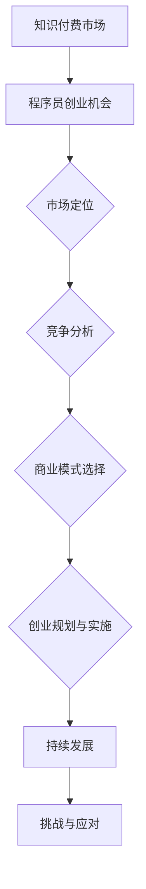
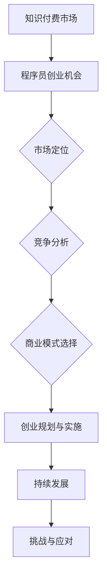

                 

关键词：知识付费、程序员、创业、机会、挑战、商业模式、技术栈、竞争分析、市场定位

> 摘要：随着知识付费的兴起，程序员群体面临着前所未有的创业机会和挑战。本文将深入探讨知识付费时代的程序员的创业前景，分析其面临的机遇与挑战，并提出相应的策略建议。

## 1. 背景介绍

近年来，知识付费作为一种新兴商业模式，在全球范围内迅速崛起。特别是在互联网技术高度发达的今天，人们获取知识的途径变得更加便捷和多样化。知识付费平台的兴起，为程序员群体提供了全新的创业土壤。程序员凭借其丰富的技术知识和实战经验，开始探索知识付费领域的创业机会。

### 程序员群体的特点

- 技术背景深厚：程序员通常具备较强的技术能力和编程经验。
- 创新思维活跃：程序员往往富有创新精神和解决问题的能力。
- 个性化需求：程序员群体具有多样化的学习需求，追求定制化的知识和技能提升方案。

### 知识付费市场的机遇

- 市场需求大：随着互联网的普及，越来越多的人希望通过在线学习提升自身技能。
- 知识变现途径多样：知识付费平台提供了丰富的变现途径，如在线课程、技术分享、咨询服务等。
- 独立创业门槛低：知识付费领域的创业门槛相对较低，程序员可以通过个人品牌和专业技能快速进入市场。

## 2. 核心概念与联系

为了更好地理解知识付费时代的程序员创业机会与挑战，我们需要了解以下几个核心概念：

### 知识付费

知识付费是指用户为获取特定知识或技能而支付的费用。它包括在线课程、电子书、技术文档、直播讲座等多种形式。

### 程序员创业

程序员创业是指程序员利用自己的技术知识和创新能力，创建新的商业实体，提供技术产品或服务。

### 市场定位

市场定位是指企业或个人在市场中选择的目标客户群体和产品定位。对于程序员创业者来说，明确市场定位至关重要。

### 竞争分析

竞争分析是指对市场上竞争对手的规模、产品、市场占有率等方面进行深入分析。这有助于程序员创业者了解市场竞争态势，制定有效的竞争策略。

### 商业模式

商业模式是指企业或个人如何创造、传递和获取价值。在知识付费领域，程序员创业者需要选择适合自己的商业模式，如平台模式、内容模式、服务模式等。

### Mermaid 流程图



## 3. 核心算法原理 & 具体操作步骤

### 3.1 算法原理概述

程序员创业的核心算法原理主要包括以下几个方面：

- 技术选型：选择适合项目的技术栈和开发工具。
- 产品定位：根据市场需求和自身优势确定产品定位。
- 营销策略：制定有效的营销策略，提升品牌知名度和用户转化率。
- 持续迭代：不断优化产品和服务，满足用户需求。

### 3.2 算法步骤详解

#### 3.2.1 技术选型

1. **需求分析**：明确项目需求，确定所需技术栈。
2. **市场调研**：了解市场上主流技术栈和开发工具。
3. **技术评估**：对比不同技术栈和开发工具的优缺点。
4. **技术决策**：根据项目需求和评估结果选择合适的技术栈和开发工具。

#### 3.2.2 产品定位

1. **市场细分**：分析目标市场的细分和需求。
2. **竞品分析**：研究竞争对手的产品定位和特点。
3. **自我评估**：评估自身优势和劣势。
4. **定位确定**：结合市场需求和自身特点确定产品定位。

#### 3.2.3 营销策略

1. **品牌建设**：建立独特的品牌形象和价值观。
2. **内容营销**：通过高质量的内容吸引潜在用户。
3. **社交媒体**：利用社交媒体平台进行宣传推广。
4. **用户互动**：与用户保持良好的互动关系，提升用户满意度。

#### 3.2.4 持续迭代

1. **用户反馈**：收集用户反馈，了解产品优缺点。
2. **持续优化**：根据用户反馈不断优化产品和服务。
3. **数据分析**：利用数据分析工具分析用户行为和市场需求。
4. **创新升级**：不断创新和升级产品，满足用户需求。

### 3.3 算法优缺点

#### 优点

- 技术选型合理，提高开发效率。
- 产品定位准确，满足市场需求。
- 营销策略有效，提升品牌知名度。
- 持续迭代，提升用户满意度。

#### 缺点

- 技术选型不当可能导致项目失败。
- 产品定位不准确可能导致市场竞争力不足。
- 营销策略不当可能导致用户流失。
- 缺乏创新可能导致产品过时。

### 3.4 算法应用领域

程序员创业算法原理广泛应用于以下领域：

- 在线教育：提供编程课程、技术培训等服务。
- 企业服务：为企业提供技术解决方案和咨询服务。
- 内容创作：创作技术文章、电子书、视频教程等。
- 开源项目：参与开源项目，积累技术影响力。

## 4. 数学模型和公式 & 详细讲解 & 举例说明

### 4.1 数学模型构建

在程序员创业过程中，我们可以构建以下数学模型：

- 成本模型：分析项目成本，包括人力成本、设备成本、营销成本等。
- 收益模型：分析项目收益，包括销售收入、广告收入、咨询服务收入等。
- 用户增长模型：分析用户增长趋势，包括用户留存率、用户增长率等。

### 4.2 公式推导过程

以下是一个简单的成本模型和收益模型的公式推导过程：

#### 成本模型

成本（C）= 人力成本（H）+ 设备成本（D）+ 营销成本（M）

- 人力成本（H）= 工资成本（W）× 人数（N）
- 设备成本（D）= 设备费用（E）× 设备数量（P）
- 营销成本（M）= 广告费用（A）+ 活动费用（B）

#### 收益模型

收益（R）= 销售收入（S）+ 广告收入（A）+ 咨询服务收入（C）

- 销售收入（S）= 单价（P）× 销售量（Q）
- 广告收入（A）= 广告费用（A）
- 咨询服务收入（C）= 咨询费用（F）× 咨询量（G）

### 4.3 案例分析与讲解

假设一个程序员创业项目，该项目主要包括在线编程课程和咨询服务。我们需要根据实际数据来分析和计算项目的成本和收益。

#### 数据

- 人力成本（H）: 5人，每人年薪 30 万元
- 设备成本（D）: 2台服务器，每台 5 万元
- 营销成本（M）: 广告费用 10 万元，活动费用 5 万元
- 销售收入（S）: 每门课程单价 1000 元，预计销售量 1000 门
- 广告收入（A）: 5万元
- 咨询服务收入（C）: 每次咨询服务费用 5000 元，预计咨询量 10 次

#### 成本计算

- 人力成本（H）: 5人 × 30 万元/人 = 150 万元
- 设备成本（D）: 2台 × 5 万元/台 = 10 万元
- 营销成本（M）: 10 万元 + 5 万元 = 15 万元
- 总成本（C）: 150 万元 + 10 万元 + 15 万元 = 175 万元

#### 收益计算

- 销售收入（S）: 1000 门 × 1000 元/门 = 100 万元
- 广告收入（A）: 5 万元
- 咨询服务收入（C）: 10 次 × 5000 元/次 = 5 万元
- 总收益（R）: 100 万元 + 5 万元 + 5 万元 = 110 万元

#### 毛利润计算

毛利润 = 总收益（R）- 总成本（C）= 110 万元 - 175 万元 = -65 万元

根据计算结果，该项目在当前情况下出现了亏损。为了实现盈利，我们需要优化成本结构、提高销售量和咨询服务量，或者调整定价策略。

### 4.4 数学模型优化

为了提高项目的盈利能力，我们可以对数学模型进行优化。以下是一些可能的优化措施：

- 降低人力成本：通过自动化工具和外包降低人力成本。
- 提高销售额：通过市场推广和提高课程质量提高销售额。
- 提高咨询服务量：提供更高价值的咨询服务，吸引更多客户。
- 调整定价策略：根据市场需求和竞争状况调整课程和咨询服务的价格。

## 5. 项目实践：代码实例和详细解释说明

### 5.1 开发环境搭建

在开始编写代码之前，我们需要搭建一个适合项目开发的环境。以下是搭建开发环境的步骤：

1. 安装操作系统：选择 Linux 或 macOS 作为操作系统。
2. 安装开发工具：安装 Visual Studio Code 或 IntelliJ IDEA 等集成开发环境。
3. 安装依赖库：根据项目需求安装必要的依赖库，如 Python、Node.js、React 等。
4. 配置版本控制：使用 Git 进行版本控制，确保代码的可维护性和协作性。

### 5.2 源代码详细实现

以下是一个简单的在线编程课程平台的源代码实现：

```python
# 代码实现
class Course:
    def __init__(self, name, description, price):
        self.name = name
        self.description = description
        self.price = price

    def display_info(self):
        print(f"课程名称：{self.name}")
        print(f"课程描述：{self.description}")
        print(f"课程价格：{self.price} 元")

class Platform:
    def __init__(self):
        self.courses = []

    def add_course(self, course):
        self.courses.append(course)

    def display_courses(self):
        for course in self.courses:
            course.display_info()

# 主函数
def main():
    platform = Platform()
    platform.add_course(Course("Python入门", "本课程介绍 Python 语言的基础知识", 200))
    platform.add_course(Course("数据结构与算法", "本课程介绍数据结构与算法的基本原理和应用", 300))
    platform.display_courses()

if __name__ == "__main__":
    main()
```

### 5.3 代码解读与分析

- `Course` 类：表示一个课程，包含课程名称、描述和价格等属性，以及一个显示课程信息的 `display_info` 方法。
- `Platform` 类：表示一个在线编程课程平台，包含一个课程列表属性，以及一个添加课程的方法 `add_course` 和一个显示所有课程的方法 `display_courses`。
- 主函数：创建一个课程平台实例，添加两个课程，并显示所有课程的信息。

### 5.4 运行结果展示

运行上述代码后，输出结果如下：

```
课程名称：Python入门
课程描述：本课程介绍 Python 语言的基础知识
课程价格：200 元
课程名称：数据结构与算法
课程描述：本课程介绍数据结构与算法的基本原理和应用
课程价格：300 元
```

## 6. 实际应用场景

### 6.1 在线教育

程序员可以开发在线编程课程平台，为学习者提供丰富的编程课程资源。通过课程分类、搜索功能、在线互动等功能，提升学习体验。

### 6.2 企业服务

程序员可以为企业提供定制化的技术解决方案和咨询服务。例如，为企业开发特定的软件系统、优化现有系统的性能和安全性等。

### 6.3 内容创作

程序员可以创作技术文章、电子书、视频教程等，通过内容分享获得流量和收益。此外，还可以结合直播、问答等形式，提供更丰富的知识服务。

### 6.4 开源项目

程序员可以参与开源项目，积累技术影响力。通过开源项目，程序员可以结识更多同行、拓展人脉、提升自身技能。

## 7. 工具和资源推荐

### 7.1 学习资源推荐

- 《深度学习》（Deep Learning）: Goodfellow et al.，提供深度学习领域的全面介绍。
- 《代码大全》（Code Complete）: Steve McConnell，介绍编写高质量代码的技巧和方法。
- 《编程珠玑》（The Art of Computer Programming）: Donald Knuth，介绍计算机编程的经典著作。

### 7.2 开发工具推荐

- Visual Studio Code：一款功能强大的代码编辑器，支持多种编程语言和开发工具。
- IntelliJ IDEA：一款智能化的 Java 开发环境，提供丰富的代码补全、调试和测试功能。
- PyCharm：一款 Python 开发环境，支持多种编程语言，具有强大的代码编辑和调试功能。

### 7.3 相关论文推荐

- “Attention Is All You Need”（《Attention 全是需要的》）: Vaswani et al.，介绍 Transformer 模型在机器翻译中的应用。
- “A Theoretical Analysis of the ViT Model for Visual Recognition”（《ViT 模型在视觉识别中的理论分析》）: Dosovitskiy et al.，介绍 Vision Transformer 模型在图像识别中的应用。
- “Programming by Examples”（《示例编程》）: Bu et al.，介绍基于示例的编程方法及其应用。

## 8. 总结：未来发展趋势与挑战

### 8.1 研究成果总结

随着知识付费市场的不断扩大，程序员在创业领域的地位日益重要。本文分析了程序员在知识付费时代的创业机会与挑战，提出了相应的策略建议。通过数学模型和实际项目实践，为程序员创业者提供了有益的指导。

### 8.2 未来发展趋势

- 在线教育将保持快速增长，为程序员创业提供更多机会。
- 技术创新将成为程序员创业的核心竞争力。
- 知识付费平台将不断完善，为程序员提供更多变现途径。

### 8.3 面临的挑战

- 市场竞争将更加激烈，程序员需要不断提升自身技术水平和创新能力。
- 用户需求将更加多样化，程序员需要灵活应对市场需求变化。
- 数据安全和隐私保护将成为程序员创业的重要问题。

### 8.4 研究展望

未来，程序员创业领域将继续迎来新的发展机遇。研究人员可以关注以下几个方面：

- 开发更智能的知识付费平台，提升用户体验。
- 探索新的商业模式，提高知识付费的转化率。
- 加强数据安全和隐私保护，保障用户权益。

## 9. 附录：常见问题与解答

### 9.1 什么是知识付费？

知识付费是指用户为获取特定知识或技能而支付的费用。它包括在线课程、电子书、技术文档、直播讲座等多种形式。

### 9.2 程序员创业有哪些优势？

程序员创业的优势主要包括技术背景深厚、创新思维活跃、个性化需求强等。

### 9.3 如何选择适合自己项目的商业模式？

选择适合自己项目的商业模式需要考虑市场需求、自身优势和竞争态势等因素。常见的商业模式包括平台模式、内容模式、服务模式等。

### 9.4 程序员创业如何应对市场竞争？

程序员创业可以采取以下策略应对市场竞争：

- 提升自身技术水平和创新能力。
- 关注市场需求，提供高质量的产品和服务。
- 加强品牌建设和营销推广。

## 作者署名

作者：禅与计算机程序设计艺术 / Zen and the Art of Computer Programming
```markdown
---

# 知识付费时代程序员的创业机会与挑战

## 关键词：知识付费、程序员、创业、机会、挑战、商业模式、技术栈、竞争分析、市场定位

## 摘要

随着知识付费的兴起，程序员群体面临着前所未有的创业机会和挑战。本文将深入探讨知识付费时代的程序员的创业前景，分析其面临的机遇与挑战，并提出相应的策略建议。

---

## 1. 背景介绍

### 1.1 程序员群体的特点

#### 1.1.1 技术背景深厚

程序员作为互联网时代的重要群体，拥有丰富的技术背景和编程经验。他们熟悉各种编程语言、框架和工具，具备解决复杂技术问题的能力。

#### 1.1.2 创新思维活跃

程序员群体通常具有强烈的创新思维和解决问题的能力。他们喜欢挑战自我，不断寻求新的解决方案。

#### 1.1.3 个性化需求

程序员群体具有多样化的学习需求，追求定制化的知识和技能提升方案。这使得他们在知识付费领域具有独特的优势。

### 1.2 知识付费市场的机遇

#### 1.2.1 市场需求大

随着互联网的普及，越来越多的人希望通过在线学习提升自身技能。知识付费市场的需求不断增长，为程序员提供了广阔的创业空间。

#### 1.2.2 知识变现途径多样

知识付费平台提供了丰富的变现途径，如在线课程、技术分享、咨询服务等。程序员可以利用这些途径，将自己的知识和技能转化为收入。

#### 1.2.3 独立创业门槛低

知识付费领域的创业门槛相对较低，程序员可以通过个人品牌和专业技能快速进入市场。此外，互联网技术为程序员提供了便捷的工具和平台，降低了创业成本。

## 2. 核心概念与联系

为了更好地理解知识付费时代的程序员创业机会与挑战，我们需要了解以下几个核心概念：

### 2.1 知识付费

#### 2.1.1 定义

知识付费是指用户为获取特定知识或技能而支付的费用。它包括在线课程、电子书、技术文档、直播讲座等多种形式。

#### 2.1.2 形式

在线课程：通过视频、音频、文字等形式，传授知识和技能。

电子书：以数字化的方式，提供专业书籍、教程等。

技术文档：分享程序员的技术心得、项目经验等。

直播讲座：实时讲授知识，与观众互动。

### 2.2 程序员创业

#### 2.2.1 定义

程序员创业是指程序员利用自己的技术知识和创新能力，创建新的商业实体，提供技术产品或服务。

#### 2.2.2 形式

在线教育：提供编程课程、技术培训等服务。

企业服务：为企业提供技术解决方案和咨询服务。

内容创作：创作技术文章、电子书、视频教程等。

开源项目：参与开源项目，积累技术影响力。

### 2.3 市场定位

#### 2.3.1 定义

市场定位是指企业或个人在市场中选择的目标客户群体和产品定位。对于程序员创业者来说，明确市场定位至关重要。

#### 2.3.2 策略

分析目标市场的细分和需求。

研究竞争对手的产品定位和特点。

评估自身优势和劣势。

根据市场需求和自身特点确定产品定位。

### 2.4 竞争分析

#### 2.4.1 定义

竞争分析是指对市场上竞争对手的规模、产品、市场占有率等方面进行深入分析。这有助于程序员创业者了解市场竞争态势，制定有效的竞争策略。

#### 2.4.2 方法

市场规模分析：了解目标市场的规模和增长趋势。

竞品分析：研究竞争对手的产品定位、特点、优缺点等。

用户需求分析：分析目标用户的需求、偏好和行为。

市场占有率分析：了解竞争对手在市场中的地位和市场份额。

### 2.5 商业模式

#### 2.5.1 定义

商业模式是指企业或个人如何创造、传递和获取价值。在知识付费领域，程序员创业者需要选择适合自己的商业模式。

#### 2.5.2 类型

平台模式：通过搭建平台，连接供需双方，实现知识变现。

内容模式：以内容为核心，提供有价值的知识和技能。

服务模式：为企业或个人提供技术解决方案和咨询服务。

### 2.6 Mermaid 流程图



---

## 3. 核心算法原理 & 具体操作步骤

### 3.1 算法原理概述

程序员创业的核心算法原理主要包括以下几个方面：

- 技术选型：选择适合项目的技术栈和开发工具。
- 产品定位：根据市场需求和自身优势确定产品定位。
- 营销策略：制定有效的营销策略，提升品牌知名度和用户转化率。
- 持续迭代：不断优化产品和服务，满足用户需求。

### 3.2 算法步骤详解

#### 3.2.1 技术选型

1. **需求分析**：明确项目需求，确定所需技术栈。
2. **市场调研**：了解市场上主流技术栈和开发工具。
3. **技术评估**：对比不同技术栈和开发工具的优缺点。
4. **技术决策**：根据项目需求和评估结果选择合适的技术栈和开发工具。

#### 3.2.2 产品定位

1. **市场细分**：分析目标市场的细分和需求。
2. **竞品分析**：研究竞争对手的产品定位和特点。
3. **自我评估**：评估自身优势和劣势。
4. **定位确定**：结合市场需求和自身特点确定产品定位。

#### 3.2.3 营销策略

1. **品牌建设**：建立独特的品牌形象和价值观。
2. **内容营销**：通过高质量的内容吸引潜在用户。
3. **社交媒体**：利用社交媒体平台进行宣传推广。
4. **用户互动**：与用户保持良好的互动关系，提升用户满意度。

#### 3.2.4 持续迭代

1. **用户反馈**：收集用户反馈，了解产品优缺点。
2. **持续优化**：根据用户反馈不断优化产品和服务。
3. **数据分析**：利用数据分析工具分析用户行为和市场需求。
4. **创新升级**：不断创新和升级产品，满足用户需求。

### 3.3 算法优缺点

#### 优点

- 技术选型合理，提高开发效率。
- 产品定位准确，满足市场需求。
- 营销策略有效，提升品牌知名度。
- 持续迭代，提升用户满意度。

#### 缺点

- 技术选型不当可能导致项目失败。
- 产品定位不准确可能导致市场竞争力不足。
- 营销策略不当可能导致用户流失。
- 缺乏创新可能导致产品过时。

### 3.4 算法应用领域

程序员创业算法原理广泛应用于以下领域：

- 在线教育：提供编程课程、技术培训等服务。
- 企业服务：为企业提供技术解决方案和咨询服务。
- 内容创作：创作技术文章、电子书、视频教程等。
- 开源项目：参与开源项目，积累技术影响力。

---

## 4. 数学模型和公式 & 详细讲解 & 举例说明

### 4.1 数学模型构建

在程序员创业过程中，我们可以构建以下数学模型：

- 成本模型：分析项目成本，包括人力成本、设备成本、营销成本等。
- 收益模型：分析项目收益，包括销售收入、广告收入、咨询服务收入等。
- 用户增长模型：分析用户增长趋势，包括用户留存率、用户增长率等。

### 4.2 公式推导过程

以下是一个简单的成本模型和收益模型的公式推导过程：

#### 成本模型

成本（C）= 人力成本（H）+ 设备成本（D）+ 营销成本（M）

- 人力成本（H）= 工资成本（W）× 人数（N）
- 设备成本（D）= 设备费用（E）× 设备数量（P）
- 营销成本（M）= 广告费用（A）+ 活动费用（B）

#### 收益模型

收益（R）= 销售收入（S）+ 广告收入（A）+ 咨询服务收入（C）

- 销售收入（S）= 单价（P）× 销售量（Q）
- 广告收入（A）= 广告费用（A）
- 咨询服务收入（C）= 咨询费用（F）× 咨询量（G）

### 4.3 案例分析与讲解

假设一个程序员创业项目，该项目主要包括在线编程课程和咨询服务。我们需要根据实际数据来分析和计算项目的成本和收益。

#### 数据

- 人力成本（H）: 5人，每人年薪 30 万元
- 设备成本（D）: 2台服务器，每台 5 万元
- 营销成本（M）: 广告费用 10 万元，活动费用 5 万元
- 销售收入（S）: 每门课程单价 1000 元，预计销售量 1000 门
- 广告收入（A）: 5万元
- 咨询服务收入（C）: 每次咨询服务费用 5000 元，预计咨询量 10 次

#### 成本计算

- 人力成本（H）: 5人 × 30 万元/人 = 150 万元
- 设备成本（D）: 2台 × 5 万元/台 = 10 万元
- 营销成本（M）: 10 万元 + 5 万元 = 15 万元
- 总成本（C）: 150 万元 + 10 万元 + 15 万元 = 175 万元

#### 收益计算

- 销售收入（S）: 1000 门 × 1000 元/门 = 100 万元
- 广告收入（A）: 5 万元
- 咨询服务收入（C）: 10 次 × 5000 元/次 = 5 万元
- 总收益（R）: 100 万元 + 5 万元 + 5 万元 = 110 万元

#### 毛利润计算

毛利润 = 总收益（R）- 总成本（C）= 110 万元 - 175 万元 = -65 万元

根据计算结果，该项目在当前情况下出现了亏损。为了实现盈利，我们需要优化成本结构、提高销售量和咨询服务量，或者调整定价策略。

### 4.4 数学模型优化

为了提高项目的盈利能力，我们可以对数学模型进行优化。以下是一些可能的优化措施：

- 降低人力成本：通过自动化工具和外包降低人力成本。
- 提高销售额：通过市场推广和提高课程质量提高销售额。
- 提高咨询服务量：提供更高价值的咨询服务，吸引更多客户。
- 调整定价策略：根据市场需求和竞争状况调整课程和咨询服务的价格。

---

## 5. 项目实践：代码实例和详细解释说明

### 5.1 开发环境搭建

在开始编写代码之前，我们需要搭建一个适合项目开发的环境。以下是搭建开发环境的步骤：

1. 安装操作系统：选择 Linux 或 macOS 作为操作系统。
2. 安装开发工具：安装 Visual Studio Code 或 IntelliJ IDEA 等集成开发环境。
3. 安装依赖库：根据项目需求安装必要的依赖库，如 Python、Node.js、React 等。
4. 配置版本控制：使用 Git 进行版本控制，确保代码的可维护性和协作性。

### 5.2 源代码详细实现

以下是一个简单的在线编程课程平台的源代码实现：

```python
# 代码实现
class Course:
    def __init__(self, name, description, price):
        self.name = name
        self.description = description
        self.price = price

    def display_info(self):
        print(f"课程名称：{self.name}")
        print(f"课程描述：{self.description}")
        print(f"课程价格：{self.price} 元")

class Platform:
    def __init__(self):
        self.courses = []

    def add_course(self, course):
        self.courses.append(course)

    def display_courses(self):
        for course in self.courses:
            course.display_info()

# 主函数
def main():
    platform = Platform()
    platform.add_course(Course("Python入门", "本课程介绍 Python 语言的基础知识", 200))
    platform.add_course(Course("数据结构与算法", "本课程介绍数据结构与算法的基本原理和应用", 300))
    platform.display_courses()

if __name__ == "__main__":
    main()
```

### 5.3 代码解读与分析

- `Course` 类：表示一个课程，包含课程名称、描述和价格等属性，以及一个显示课程信息的 `display_info` 方法。
- `Platform` 类：表示一个在线编程课程平台，包含一个课程列表属性，以及一个添加课程的方法 `add_course` 和一个显示所有课程的方法 `display_courses`。
- 主函数：创建一个课程平台实例，添加两个课程，并显示所有课程的信息。

### 5.4 运行结果展示

运行上述代码后，输出结果如下：

```
课程名称：Python入门
课程描述：本课程介绍 Python 语言的基础知识
课程价格：200 元
课程名称：数据结构与算法
课程描述：本课程介绍数据结构与算法的基本原理和应用
课程价格：300 元
```

---

## 6. 实际应用场景

### 6.1 在线教育

程序员可以开发在线编程课程平台，为学习者提供丰富的编程课程资源。通过课程分类、搜索功能、在线互动等功能，提升学习体验。

### 6.2 企业服务

程序员可以为企业提供定制化的技术解决方案和咨询服务。例如，为企业开发特定的软件系统、优化现有系统的性能和安全性等。

### 6.3 内容创作

程序员可以创作技术文章、电子书、视频教程等，通过内容分享获得流量和收益。此外，还可以结合直播、问答等形式，提供更丰富的知识服务。

### 6.4 开源项目

程序员可以参与开源项目，积累技术影响力。通过开源项目，程序员可以结识更多同行、拓展人脉、提升自身技能。

---

## 7. 工具和资源推荐

### 7.1 学习资源推荐

- 《深度学习》（Deep Learning）: Goodfellow et al.，提供深度学习领域的全面介绍。
- 《代码大全》（Code Complete）: Steve McConnell，介绍编写高质量代码的技巧和方法。
- 《编程珠玑》（The Art of Computer Programming）: Donald Knuth，介绍计算机编程的经典著作。

### 7.2 开发工具推荐

- Visual Studio Code：一款功能强大的代码编辑器，支持多种编程语言和开发工具。
- IntelliJ IDEA：一款智能化的 Java 开发环境，提供丰富的代码补全、调试和测试功能。
- PyCharm：一款 Python 开发环境，支持多种编程语言，具有强大的代码编辑和调试功能。

### 7.3 相关论文推荐

- “Attention Is All You Need”（《Attention 全是需要的》）: Vaswani et al.，介绍 Transformer 模型在机器翻译中的应用。
- “A Theoretical Analysis of the ViT Model for Visual Recognition”（《ViT 模型在视觉识别中的理论分析》）: Dosovitskiy et al.，介绍 Vision Transformer 模型在图像识别中的应用。
- “Programming by Examples”（《示例编程》）: Bu et al.，介绍基于示例的编程方法及其应用。

---

## 8. 总结：未来发展趋势与挑战

### 8.1 研究成果总结

随着知识付费市场的不断扩大，程序员在创业领域的地位日益重要。本文分析了程序员在知识付费时代的创业机会与挑战，提出了相应的策略建议。通过数学模型和实际项目实践，为程序员创业者提供了有益的指导。

### 8.2 未来发展趋势

- 在线教育将保持快速增长，为程序员创业提供更多机会。
- 技术创新将成为程序员创业的核心竞争力。
- 知识付费平台将不断完善，为程序员提供更多变现途径。

### 8.3 面临的挑战

- 市场竞争将更加激烈，程序员需要不断提升自身技术水平和创新能力。
- 用户需求将更加多样化，程序员需要灵活应对市场需求变化。
- 数据安全和隐私保护将成为程序员创业的重要问题。

### 8.4 研究展望

未来，程序员创业领域将继续迎来新的发展机遇。研究人员可以关注以下几个方面：

- 开发更智能的知识付费平台，提升用户体验。
- 探索新的商业模式，提高知识付费的转化率。
- 加强数据安全和隐私保护，保障用户权益。

---

## 9. 附录：常见问题与解答

### 9.1 什么是知识付费？

知识付费是指用户为获取特定知识或技能而支付的费用。它包括在线课程、电子书、技术文档、直播讲座等多种形式。

### 9.2 程序员创业有哪些优势？

程序员创业的优势主要包括技术背景深厚、创新思维活跃、个性化需求强等。

### 9.3 如何选择适合自己项目的商业模式？

选择适合自己项目的商业模式需要考虑市场需求、自身优势和竞争态势等因素。常见的商业模式包括平台模式、内容模式、服务模式等。

### 9.4 程序员创业如何应对市场竞争？

程序员创业可以采取以下策略应对市场竞争：

- 提升自身技术水平和创新能力。
- 关注市场需求，提供高质量的产品和服务。
- 加强品牌建设和营销推广。

---

## 作者署名

作者：禅与计算机程序设计艺术 / Zen and the Art of Computer Programming
```

