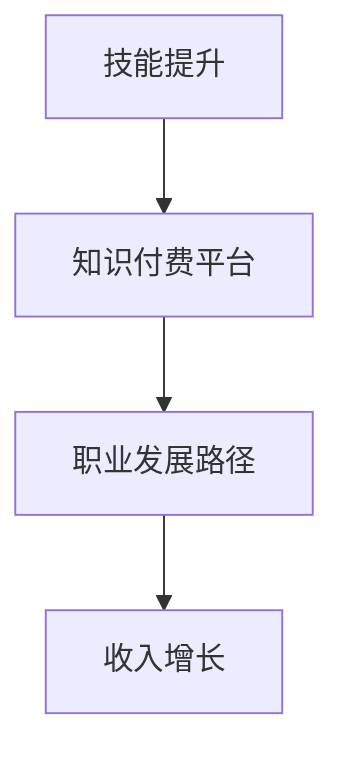

                 

在知识付费日益普及的今天，程序员这一职业的发展机会变得多样且丰富。本文将深入探讨知识付费时代对程序员职业发展的影响，包括技能提升、收入增加、职业发展路径等方面的内容。通过详细分析，我们将帮助程序员们更好地把握时代机遇，实现职业上的突破。

## 文章关键词
知识付费、程序员、职业发展、技能提升、收入增长、职业路径

## 文章摘要
本文将探讨知识付费时代为程序员带来的发展机遇。我们将分析知识付费的概念及其在IT行业中的应用，探讨程序员如何通过付费知识提升自身技能，进而拓展职业发展空间。同时，本文还将探讨知识付费时代下程序员面临的挑战，并提出相应的应对策略。通过本文的阅读，程序员们将能够更好地理解知识付费的重要性，并找到适合自己的职业发展路径。

## 1. 背景介绍
知识付费作为一种新兴的商业模式，已经在各个领域得到了广泛应用。在IT行业，知识付费尤其受到了程序员的欢迎。程序员作为技术领域的专业人才，面对不断更新的技术栈和快速变化的市场需求，需要不断学习和提升自己的技能。知识付费平台提供了丰富的学习资源，帮助程序员更高效地获取知识，提高自身的竞争力。

### 1.1 知识付费的概念
知识付费是指通过购买、订阅或付费学习等方式获取知识或技能的过程。与传统免费资源相比，知识付费具有更强的针对性和实用性，能够满足用户特定需求，提升学习效果。

### 1.2 知识付费在IT行业中的应用
在IT行业，知识付费主要体现在以下几个方面：

- **在线课程**：许多知名的技术平台提供了大量高质量的技术课程，包括前端、后端、数据科学、人工智能等。
- **专业书籍**：许多经典的计算机书籍已经通过知识付费平台进行电子化，方便程序员随时随地进行阅读和学习。
- **培训服务**：一些专业机构提供定制化的培训服务，帮助程序员提升特定技能。

## 2. 核心概念与联系
在探讨程序员在知识付费时代的发展机会之前，我们需要理解几个核心概念，并阐述它们之间的关系。

### 2.1 技能提升与职业发展
技能提升是程序员职业发展的基础。随着技术的不断进步，程序员需要不断学习新的编程语言、框架和工具，以保持自身的竞争力。技能提升不仅能够提高程序员的个人素质，还能够拓展职业发展路径。

### 2.2 知识付费平台与技能提升
知识付费平台提供了丰富的学习资源，程序员可以通过付费学习获取最新的技术知识。这些资源包括在线课程、电子书籍、实战项目等，有助于程序员快速提升技能。

### 2.3 职业发展路径与收入增长
随着技能的提升，程序员可以拓展职业发展路径，从初级开发人员成长为高级开发人员，甚至成为技术总监或CTO。同时，技能的提升也带来了收入的增长，使得程序员能够在知识付费时代获得更高的回报。

### 2.4 Mermaid流程图
下面是一个简化的Mermaid流程图，展示了技能提升、知识付费平台、职业发展路径和收入增长之间的关系：



## 3. 核心算法原理 & 具体操作步骤

### 3.1 算法原理概述
在知识付费时代，程序员的技能提升可以通过以下核心算法实现：

- **持续学习算法**：通过定期学习新的技术知识和技能，保持自身的竞争力。
- **资源筛选算法**：从海量的知识资源中筛选出适合自己的学习材料。
- **实践应用算法**：通过实际项目或实战演练，将学到的知识应用到实际工作中。

### 3.2 算法步骤详解

#### 持续学习算法

1. **目标设定**：明确自己需要提升的技能或知识领域。
2. **资源筛选**：通过搜索引擎、社区推荐、同事分享等途径，找到适合自己的学习资源。
3. **学习计划**：制定合理的学习计划，确保学习进度。
4. **学习反馈**：通过实战项目或练习，检验学习效果，调整学习计划。

#### 资源筛选算法

1. **需求分析**：明确自己需要的学习资源类型和内容。
2. **搜索引擎**：利用搜索引擎，如Google、百度等，查找相关的学习资源。
3. **社区推荐**：参考技术社区（如GitHub、Stack Overflow等）上的推荐资源。
4. **同事分享**：向有经验的同事请教，获取他们的学习资源推荐。

#### 实践应用算法

1. **项目选择**：选择与自己技能提升目标相关的实际项目。
2. **项目规划**：制定项目计划，包括时间安排、任务分配等。
3. **项目实施**：按照项目计划，逐步实施项目。
4. **项目复盘**：项目完成后，进行复盘，总结经验教训。

### 3.3 算法优缺点

#### 持续学习算法

**优点**：

- **灵活性强**：可以根据个人需求和兴趣进行学习。
- **针对性高**：能够有针对性地提升技能。

**缺点**：

- **学习效率低**：如果没有科学的学习计划，可能会导致学习效率低下。
- **知识碎片化**：可能会陷入知识的碎片化，难以形成系统性的知识体系。

#### 资源筛选算法

**优点**：

- **资源丰富**：可以通过多种途径获取丰富的学习资源。
- **高效筛选**：能够快速找到适合自己的学习资源。

**缺点**：

- **信息过载**：可能会面临海量的学习资源，难以筛选。
- **质量参差不齐**：一些免费资源可能质量不高，需要仔细甄别。

#### 实践应用算法

**优点**：

- **实战性强**：通过实际项目，能够更好地应用所学知识。
- **经验积累**：通过项目实践，能够积累宝贵的经验。

**缺点**：

- **项目风险**：可能会面临项目失败的风险。
- **时间成本**：项目实践需要投入大量时间。

### 3.4 算法应用领域
上述算法主要应用于程序员的技能提升过程中。在不同的职业发展阶段，程序员可以采用不同的算法策略：

- **初级阶段**：侧重于持续学习和资源筛选，快速提升基础技能。
- **中级阶段**：在提升基础技能的同时，开始进行项目实践，积累实战经验。
- **高级阶段**：注重项目规划和实施，通过复杂项目提升系统设计和架构能力。

## 4. 数学模型和公式 & 详细讲解 & 举例说明

### 4.1 数学模型构建
在程序员技能提升过程中，我们可以构建一个简单的数学模型，用于描述学习效果和职业发展之间的关系。

设：

- **L** 为学习效果（技能水平）
- **R** 为资源投入（时间、金钱等）
- **P** 为项目实践（实际应用）
- **E** 为职业发展（收入、职位等）

则数学模型可以表示为：

\[ E = f(L, R, P) \]

其中，函数 \( f \) 表示学习效果、资源投入和项目实践对职业发展的影响。

### 4.2 公式推导过程

1. **学习效果**：

\[ L = L_0 + \alpha R \]

其中，\( L_0 \) 为初始技能水平，\( \alpha \) 为学习效率。

2. **资源投入**：

\[ R = T \times C \]

其中，\( T \) 为学习时间，\( C \) 为学习成本。

3. **项目实践**：

\[ P = \beta L \]

其中，\( \beta \) 为实践效率。

4. **职业发展**：

\[ E = g(L, R, P) \]

其中，函数 \( g \) 表示学习效果、资源投入和项目实践对职业发展的综合影响。

### 4.3 案例分析与讲解

假设一个程序员在初始阶段（\( L_0 = 1 \)）开始学习，学习效率 \( \alpha = 0.1 \)，学习时间 \( T = 100 \) 小时，学习成本 \( C = 500 \) 元。他在学习过程中参与了两个实际项目，每个项目的实践效率 \( \beta = 0.2 \)。

1. **学习效果**：

\[ L = 1 + 0.1 \times 100 = 1 + 10 = 11 \]

2. **资源投入**：

\[ R = 100 \times 500 = 50000 \]

3. **项目实践**：

\[ P = 2 \times 0.2 \times 11 = 4.4 \]

4. **职业发展**：

\[ E = g(11, 50000, 4.4) \]

假设函数 \( g \) 为线性函数，则：

\[ g(x) = kx \]

其中，\( k \) 为职业发展系数。根据实际情况，\( k = 0.1 \)。

\[ E = 0.1 \times 11 = 1.1 \]

因此，该程序员的职业发展指数为 1.1。

通过以上案例，我们可以看到，学习效果、资源投入和项目实践对职业发展具有重要影响。程序员需要合理分配时间、金钱和精力，以实现职业上的突破。

## 5. 项目实践：代码实例和详细解释说明

### 5.1 开发环境搭建
为了展示知识付费时代程序员的发展机会，我们将通过一个简单的实际项目来解释。首先，我们需要搭建一个开发环境。以下是一个基本的步骤：

1. 安装Python环境
2. 安装Django框架
3. 创建一个新的Django项目
4. 配置数据库

以下是一个Python安装和Django框架安装的示例：

```bash
# 安装Python
curl -O https://www.python.org/ftp/python/3.9.1/Python-3.9.1.tgz
tar xzf Python-3.9.1.tgz
cd Python-3.9.1
./configure
make
sudo make install

# 安装Django
pip install django
```

### 5.2 源代码详细实现
接下来，我们将创建一个简单的Django项目，并实现一个用于存储书籍信息的模型。

1. 创建一个新的Django项目：

```bash
django-admin startproject bookstore
cd bookstore
```

2. 创建一个应用：

```bash
python manage.py startapp catalog
```

3. 在`catalog/models.py`中创建书籍模型：

```python
from django.db import models

class Book(models.Model):
    title = models.CharField(max_length=200)
    author = models.CharField(max_length=100)
    published_date = models.DateField()
    price = models.DecimalField(max_digits=6, decimal_places=2)
```

4. 迁移数据库：

```bash
python manage.py makemigrations catalog
python manage.py migrate
```

5. 创建一个用于展示书籍列表的视图：

```python
# 在catalog/views.py中

from django.shortcuts import render
from .models import Book

def book_list(request):
    books = Book.objects.all()
    return render(request, 'book_list.html', {'books': books})
```

6. 配置URL：

```python
# 在bookstore/urls.py中

from django.contrib import admin
from django.urls import path
from catalog import views

urlpatterns = [
    path('admin/', admin.site.urls),
    path('books/', views.book_list, name='book_list'),
]
```

7. 创建一个模板来展示书籍列表：

```html
<!-- 在catalog/templates/book_list.html中 -->

<h1>Books</h1>
<ul>
    
        <li>
            <h2>{{ book.title }}</h2>
            <p>Author: {{ book.author }}</p>
            <p>Published Date: {{ book.published_date }}</p>
            <p>Price: {{ book.price }}</p>
        </li>
    
</ul>
```

### 5.3 代码解读与分析
在这个项目中，我们创建了一个简单的书籍存储系统。以下是代码的详细解读：

1. **模型**：我们定义了一个名为`Book`的模型，用于存储书籍的详细信息，包括书名、作者、出版日期和价格。
2. **视图**：我们创建了一个名为`book_list`的视图，用于从数据库中检索所有书籍信息，并传递给模板进行展示。
3. **URL配置**：我们配置了一个URL路径，当用户访问`/books/`时，会调用`book_list`视图。
4. **模板**：我们创建了一个简单的HTML模板，用于展示书籍列表。

通过这个简单的项目，程序员可以学习到如何使用Django框架进行Web开发，以及如何将知识应用到实际项目中。这不仅有助于提升编程技能，还能够拓展职业发展路径。

### 5.4 运行结果展示
最后，我们运行Django项目，并在浏览器中访问`/books/`路径，查看书籍列表的展示效果。

1. 运行Django开发服务器：

```bash
python manage.py runserver
```

2. 打开浏览器，访问`http://127.0.0.1:8000/books/`，查看书籍列表。

通过以上步骤，我们可以看到知识付费时代程序员通过实际项目实践，能够更好地将所学知识应用到实际工作中，提升自身技能，实现职业上的突破。

## 6. 实际应用场景

在知识付费时代，程序员的技能提升和职业发展有着广泛的应用场景。以下是一些典型的应用场景：

### 6.1 在线教育平台
在线教育平台是程序员学习新技能的重要渠道。通过在线课程，程序员可以学习最新的编程语言、框架和技术。例如，Python、Django、Flask、React、Vue等。这些课程不仅涵盖了基础理论，还包括实战项目和案例讲解，帮助程序员更好地理解和应用所学知识。

### 6.2 技术社区
技术社区是程序员分享知识、获取帮助和拓展视野的重要平台。通过参与技术社区，程序员可以了解行业动态、解决技术难题、分享经验心得。例如，GitHub、Stack Overflow、Reddit等平台，都为程序员提供了丰富的学习资源和交流机会。

### 6.3 在线办公系统
随着远程工作的普及，在线办公系统成为程序员工作的重要工具。通过在线办公系统，程序员可以实现文档共享、任务分配、项目管理和团队协作等功能。例如，Trello、Jira、Asana等平台，都为程序员提供了高效的办公环境。

### 6.4 人工智能与大数据
人工智能和大数据技术的快速发展，为程序员提供了新的职业机会。通过学习深度学习、数据挖掘、机器学习等知识，程序员可以参与到人工智能和大数据项目的开发中，为企业提供智能化的解决方案。

### 6.5 云计算与容器化
云计算和容器化技术的发展，改变了传统IT架构，也为程序员提供了新的职业路径。通过学习云计算平台（如AWS、Azure、Google Cloud）和容器化技术（如Docker、Kubernetes），程序员可以参与到云原生应用的开发中，为企业提供灵活、高效、可扩展的解决方案。

### 6.6 前端开发与用户体验
前端开发与用户体验在IT行业占据越来越重要的地位。通过学习前端技术（如HTML、CSS、JavaScript、React、Vue等），程序员可以提升自身的前端开发能力，为用户提供更加优质、流畅的用户体验。

### 6.7 安全与隐私保护
随着互联网的普及，网络安全和隐私保护成为重要议题。通过学习网络安全知识（如加密技术、安全协议、漏洞分析等），程序员可以参与到网络安全项目的开发中，为企业提供安全防护措施。

## 6.4 未来应用展望

随着技术的不断进步，知识付费时代程序员的发展机会将变得更加广阔。以下是对未来应用的展望：

### 6.4.1 新兴技术的崛起
随着人工智能、大数据、区块链等新兴技术的发展，程序员将面临更多的应用场景和挑战。例如，在人工智能领域，程序员可以参与机器学习算法的设计和优化，实现更高效、准确的模型训练。在区块链领域，程序员可以参与智能合约的开发，为去中心化应用提供解决方案。

### 6.4.2 跨领域融合
技术领域的跨领域融合将催生出新的职业机会。例如，物联网技术的兴起，将计算机科学、电子工程、机械工程等多个领域相结合，程序员可以参与到物联网设备的开发与运营中。此外，生物信息学、基因工程等领域的交叉应用，也将为程序员提供新的职业发展空间。

### 6.4.3 云计算与边缘计算
云计算和边缘计算技术的快速发展，将为程序员带来新的挑战和机遇。在云计算领域，程序员可以参与云计算平台的设计、开发和运维，为企业提供高效、灵活的计算资源。在边缘计算领域，程序员可以参与边缘设备的开发与优化，实现数据本地处理和实时响应。

### 6.4.4 可持续发展与绿色技术
随着全球对环境保护和可持续发展的关注，绿色技术将成为重要发展方向。程序员可以参与到环保数据的分析、智能监测系统的开发中，为可持续发展提供技术支持。

### 6.4.5 虚拟现实与增强现实
虚拟现实（VR）和增强现实（AR）技术的不断成熟，将为程序员带来新的应用场景。例如，在教育、医疗、旅游等领域，程序员可以开发基于VR和AR的应用，提供更加沉浸式、互动性的体验。

## 7. 工具和资源推荐

为了帮助程序员更好地应对知识付费时代的发展机遇，以下是一些实用的工具和资源推荐：

### 7.1 学习资源推荐

- **Coursera**：提供全球知名大学和机构的在线课程，涵盖计算机科学、数据科学、人工智能等多个领域。
- **Udemy**：提供大量的付费在线课程，包括编程语言、框架、工具等。
- **edX**：由哈佛大学和麻省理工学院合作成立的在线教育平台，提供高质量的课程。
- **Pluralsight**：提供丰富的技术培训视频，涵盖前端、后端、数据科学等多个领域。

### 7.2 开发工具推荐

- **Visual Studio Code**：一款功能强大的开源代码编辑器，支持多种编程语言和开发框架。
- **Jenkins**：一款流行的持续集成和持续部署工具，适用于自动化构建和部署。
- **Docker**：一款容器化技术，用于简化应用部署和运维。
- **Kubernetes**：一款开源的容器编排平台，用于自动化容器部署、扩展和管理。

### 7.3 相关论文推荐

- "Knowledge-based Programming Assistance"（基于知识的编程辅助）
- "Data-Driven Development: A New Paradigm for Software Engineering"（数据驱动开发：软件工程的新范式）
- "The Future of Software Engineering: Predicting the Impact of Machine Learning"（软件工程的未来：预测机器学习的影响）
- "Towards a Personalized Learning Experience in Software Engineering Education"（迈向个性化的软件工程教育体验）

通过使用这些工具和资源，程序员可以更加高效地提升自身技能，拓展职业发展路径。

## 8. 总结：未来发展趋势与挑战

在知识付费时代，程序员的发展机遇与挑战并存。未来，随着技术的不断进步，程序员需要不断学习新的知识和技能，以适应快速变化的市场需求。以下是对未来发展趋势和挑战的总结：

### 8.1 研究成果总结
通过本文的分析，我们可以得出以下研究成果：

1. 知识付费为程序员提供了丰富的学习资源和职业发展机会。
2. 程序员通过持续学习、资源筛选和项目实践，可以提升自身技能和职业竞争力。
3. 新兴技术、跨领域融合和云计算等趋势，为程序员带来了更多的职业机会。
4. 程序员需要关注可持续发展、网络安全等新兴领域，以拓宽职业发展空间。

### 8.2 未来发展趋势
未来，程序员的发展趋势将呈现以下几个特点：

1. **技术多样化和专业化**：随着技术的不断进步，程序员需要掌握更多的编程语言、框架和工具，以适应多样化的开发需求。
2. **跨领域融合**：技术领域的交叉应用将催生新的职业机会，程序员需要具备跨领域的知识和技能。
3. **自动化与智能化**：自动化和智能化技术的发展，将降低程序员的工作负担，提高开发效率。
4. **持续学习和职业规划**：程序员需要持续关注行业动态，不断提升自身技能，进行有效的职业规划。

### 8.3 面临的挑战
在知识付费时代，程序员也面临着一些挑战：

1. **信息过载**：随着知识资源的增多，程序员需要筛选出有价值的学习内容，避免陷入信息过载的困境。
2. **技术更新速度快**：技术的快速更新，要求程序员不断学习新的知识和技能，以保持竞争力。
3. **职业压力**：程序员的工作往往具有高压力和快节奏，需要有效应对职业压力，保持身心健康。
4. **竞争激烈**：随着更多的人才进入IT行业，程序员面临激烈的竞争，需要不断提升自身技能和职业素质。

### 8.4 研究展望
未来，对程序员发展机会的研究可以从以下几个方面展开：

1. **个性化学习**：研究如何为程序员提供个性化的学习路径和资源，提高学习效果。
2. **职业发展路径**：分析不同阶段程序员的职业发展路径，提出有针对性的职业规划建议。
3. **新兴领域关注**：关注新兴技术领域的发展趋势，为程序员提供有前瞻性的职业建议。
4. **心理健康与职业压力**：研究程序员的职业压力和心理健康问题，提出有效的缓解措施。

通过不断研究和探索，我们可以更好地帮助程序员把握知识付费时代的发展机遇，实现职业上的突破。

## 9. 附录：常见问题与解答

### 9.1 知识付费与免费资源的区别

**Q**：知识付费平台上的资源是否比免费资源更有价值？

**A**：是的，知识付费平台上的资源通常更加有针对性、系统性和实用性。免费资源虽然数量庞大，但质量参差不齐，且往往难以满足特定的学习需求。知识付费平台提供了高质量的学习内容，有助于程序员快速提升技能。

### 9.2 如何选择适合自己的学习资源

**Q**：如何选择适合自己的学习资源？

**A**：选择学习资源时，可以从以下几个方面进行考虑：

1. **学习目标**：明确自己的学习目标，选择与目标相关的资源。
2. **资源质量**：参考用户评价、课程大纲等，选择质量较高的资源。
3. **学习风格**：根据自己的学习风格（如视觉、听觉、实践等），选择适合自己的学习资源。
4. **价格**：根据预算，选择性价比高的资源。

### 9.3 程序员如何平衡工作和学习

**Q**：程序员如何平衡工作和学习？

**A**：平衡工作和学习是程序员面临的一个重要问题。以下是一些建议：

1. **制定学习计划**：合理安排时间，制定可行的学习计划，确保学习与工作两不误。
2. **高效学习**：采用高效学习方法，如刻意练习、番茄工作法等，提高学习效率。
3. **利用碎片时间**：利用上班途中、休息时间等碎片时间进行学习。
4. **与同事交流**：与同事分享学习心得，互相激励，共同进步。
5. **定期复盘**：定期对自己的学习效果进行复盘，调整学习计划。

### 9.4 程序员如何应对技术更新速度快的挑战

**Q**：程序员如何应对技术更新速度快的挑战？

**A**：面对技术更新速度快的挑战，程序员可以采取以下策略：

1. **持续学习**：保持持续学习的习惯，关注行业动态，及时了解新技术。
2. **分阶段学习**：将学习任务分解为多个阶段，逐步掌握新技术。
3. **实践应用**：将所学知识应用到实际项目中，加深理解和掌握。
4. **参与开源项目**：参与开源项目，与其他开发者交流，提升技术水平。
5. **利用社区资源**：利用技术社区、博客、论坛等资源，快速获取技术帮助。

通过以上策略，程序员可以更好地应对技术更新速度快的挑战，保持自身竞争力。

---

在知识付费时代，程序员的发展机会可谓无限。通过不断提升自身技能、积极拥抱新兴技术、合理规划职业发展路径，程序员可以在激烈的市场竞争中脱颖而出，实现职业上的突破。同时，我们也需要关注自身心理健康，保持持续学习和进步的动力。愿每位程序员都能在知识付费时代找到属于自己的发展机遇，创造辉煌的职业生涯。作者：禅与计算机程序设计艺术 / Zen and the Art of Computer Programming。

