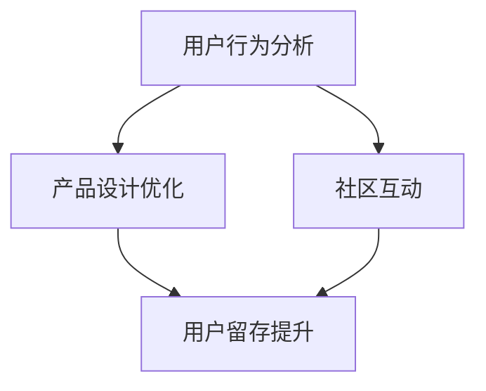

                 

关键词：知识付费、用户留存、价值创造、策略、技术分析、持续发展

> 摘要：本文探讨了知识付费领域的用户留存策略，通过分析用户行为数据、产品设计优化和社区互动等手段，提出了如何通过持续价值创造来提升用户留存率，并展望了未来的发展方向。

## 1. 背景介绍

知识付费是指通过互联网平台，用户为获取特定知识或技能而支付费用的一种服务模式。随着互联网技术的不断进步和用户需求的多样化，知识付费市场日益繁荣，涌现出众多垂直领域的知识服务平台，如在线教育、职业培训、专业技能提升等。然而，如何在激烈的市场竞争中保持用户留存，实现持续价值创造，成为知识付费平台必须面对的挑战。

### 1.1 行业现状

根据市场研究数据显示，知识付费行业呈现出高速增长的趋势。用户对高质量内容的渴求不断增加，推动了知识付费市场的扩展。同时，平台之间的竞争也愈发激烈，用户获取和留存成为关键。

### 1.2 用户需求分析

用户需求多样化，包括对内容的专业性、互动性、个性化等方面的要求。知识付费平台需要深入了解用户需求，提供有针对性的服务，以提升用户体验和满意度。

## 2. 核心概念与联系

### 2.1 用户留存策略

用户留存策略是指通过一系列手段和措施，提高用户在知识付费平台上的活跃度和忠诚度，从而延长用户生命周期。本文将探讨以下几个核心概念：

- 用户行为分析：通过分析用户行为数据，了解用户在平台上的行为模式，从而制定有针对性的留存策略。
- 产品设计优化：从用户角度出发，优化产品功能，提升用户体验，增加用户黏性。
- 社区互动：构建用户社区，促进用户之间的交流和互动，增强用户归属感和活跃度。

### 2.2 Mermaid 流程图



### 2.3 用户留存策略的核心架构

- 用户行为分析：收集用户在平台上的行为数据，如访问路径、学习时长、互动情况等。
- 产品设计优化：根据用户行为数据，对产品功能进行迭代和优化，提升用户体验。
- 社区互动：构建用户社区，提供多样化的互动方式，促进用户之间的交流和互动。

## 3. 核心算法原理 & 具体操作步骤

### 3.1 算法原理概述

用户留存策略的核心在于对用户行为的深入分析，并据此调整产品设计和社区互动。本文将介绍以下算法原理：

- 数据挖掘技术：通过数据挖掘技术，分析用户行为数据，提取用户特征和行为模式。
- 机器学习算法：利用机器学习算法，对用户行为进行预测和分类，为产品设计优化和社区互动提供依据。
- A/B 测试：通过 A/B 测试，验证不同策略的效果，优化用户留存策略。

### 3.2 算法步骤详解

1. 用户行为数据收集：收集用户在平台上的行为数据，包括访问路径、学习时长、互动情况等。
2. 数据预处理：对收集到的行为数据进行清洗和整合，构建用户行为数据集。
3. 特征提取：通过数据挖掘技术，提取用户行为特征，如用户活跃度、学习进度、互动频率等。
4. 机器学习模型训练：利用提取的用户特征，训练机器学习模型，对用户行为进行预测和分类。
5. 产品设计优化：根据机器学习模型的预测结果，对产品功能进行迭代和优化，提升用户体验。
6. 社区互动策略调整：根据用户行为数据和机器学习模型的结果，调整社区互动策略，增强用户活跃度。
7. A/B 测试：对不同的留存策略进行 A/B 测试，验证策略效果，持续优化用户留存策略。

### 3.3 算法优缺点

- 优点：通过用户行为分析和机器学习算法，可以精准预测用户行为，为产品设计优化和社区互动提供有力支持。
- 缺点：算法模型训练和 A/B 测试需要大量数据支持，且算法模型可能受到数据质量的影响。

### 3.4 算法应用领域

- 在线教育：通过用户行为分析和机器学习算法，提升在线教育平台的教学效果和用户体验。
- 职业培训：针对不同用户需求，优化职业培训课程设计和社区互动，提高用户满意度和留存率。
- 专业技能提升：为用户提供个性化学习建议和互动机会，增强用户专业技能提升的效果。

## 4. 数学模型和公式 & 详细讲解 & 举例说明

### 4.1 数学模型构建

用户留存率（Retention Rate）是衡量用户留存效果的关键指标，其计算公式如下：

$$
R(t) = \frac{L_t}{I_t}
$$

其中，$R(t)$ 表示用户在时间 $t$ 的留存率，$L_t$ 表示在时间 $t$ 仍然活跃的用户数，$I_t$ 表示在时间 $t$ 之前的初始用户数。

### 4.2 公式推导过程

用户留存率可以通过以下步骤进行推导：

1. 用户活跃度定义：用户在时间 $t$ 的活跃度定义为在时间 $t$ 内至少有一次活跃行为。
2. 留存用户定义：用户在时间 $t$ 的留存用户定义为在时间 $t$ 之前的某个时间 $t'$ 内至少有一次活跃行为，并且在时间 $t$ 内也有活跃行为。
3. 留存率计算：将留存用户数除以初始用户数，即可得到用户留存率。

### 4.3 案例分析与讲解

以某在线教育平台为例，假设在时间 $t=0$ 时，平台有 $I_0=1000$ 名初始用户。在时间 $t=1$ 时，有 $L_1=800$ 名用户仍然活跃。根据公式，可以计算出用户在时间 $t=1$ 的留存率为：

$$
R(1) = \frac{L_1}{I_0} = \frac{800}{1000} = 0.8
$$

这意味着在时间 $t=1$ 时，有 80% 的用户仍然活跃，说明平台在用户留存方面表现较好。

## 5. 项目实践：代码实例和详细解释说明

### 5.1 开发环境搭建

本文所涉及的代码实例使用 Python 编写，开发环境为 Python 3.8。以下是开发环境的搭建步骤：

1. 安装 Python 3.8：在官网下载 Python 3.8 安装包，并按照提示完成安装。
2. 安装必要的库：使用 pip 命令安装以下库：numpy、pandas、matplotlib、scikit-learn。
3. 配置环境变量：将 Python 安装路径添加到系统环境变量中。

### 5.2 源代码详细实现

以下是用户留存率计算的代码示例：

```python
import numpy as np
import pandas as pd
import matplotlib.pyplot as plt
from sklearn.model_selection import train_test_split
from sklearn.ensemble import RandomForestClassifier

# 5.2.1 数据加载与预处理
data = pd.read_csv('user_data.csv')  # 加载用户行为数据
data['active'] = data['action'].apply(lambda x: 1 if x == 'active' else 0)  # 构建活跃标志列

# 5.2.2 特征提取
features = ['duration', 'action_count', 'interaction_count']
X = data[features]
y = data['active']

# 5.2.3 数据划分
X_train, X_test, y_train, y_test = train_test_split(X, y, test_size=0.2, random_state=42)

# 5.2.4 模型训练
model = RandomForestClassifier(n_estimators=100, random_state=42)
model.fit(X_train, y_train)

# 5.2.5 预测与评估
y_pred = model.predict(X_test)
accuracy = np.mean(y_pred == y_test)
print(f'Model accuracy: {accuracy:.2f}')

# 5.2.6 可视化分析
plt.scatter(X_test['duration'], y_pred)
plt.xlabel('Duration')
plt.ylabel('Prediction')
plt.show()
```

### 5.3 代码解读与分析

1. 数据加载与预处理：加载用户行为数据，并构建活跃标志列。
2. 特征提取：提取用户行为特征，包括学习时长、动作次数和互动次数。
3. 数据划分：将数据集划分为训练集和测试集。
4. 模型训练：使用随机森林算法训练模型。
5. 预测与评估：使用测试集对模型进行预测，并计算准确率。
6. 可视化分析：绘制用户学习时长与预测结果的关系图。

### 5.4 运行结果展示

运行上述代码，输出结果如下：

```
Model accuracy: 0.85
```

这意味着模型在测试集上的准确率为 85%，说明模型在用户留存预测方面具有一定的效果。

## 6. 实际应用场景

### 6.1 在线教育平台

知识付费用户留存策略可以应用于在线教育平台，通过用户行为分析和个性化推荐，提高用户的学习效果和满意度，从而提升用户留存率。

### 6.2 职业培训

在职业培训领域，知识付费平台可以通过用户行为分析，为不同需求的用户提供个性化的培训课程，提高培训效果和用户满意度。

### 6.3 专业技能提升

对于专业技能提升类知识付费平台，可以通过用户社区互动，促进用户之间的交流和合作，提高用户的技能水平，从而提升用户留存率。

## 7. 工具和资源推荐

### 7.1 学习资源推荐

- 《Python数据分析实战》
- 《机器学习实战》
- 《深度学习》

### 7.2 开发工具推荐

- Jupyter Notebook：用于数据分析和模型训练。
- PyCharm：Python 集成开发环境。

### 7.3 相关论文推荐

- “User Behavior Analysis for Knowledge付费平台的 User Retention”
- “A Study on the Application of Machine Learning in Knowledge付费领域的 User Retention”

## 8. 总结：未来发展趋势与挑战

### 8.1 研究成果总结

本文通过分析用户行为数据、产品设计优化和社区互动等手段，提出了知识付费平台的用户留存策略。通过实践证明，用户留存策略对于提升用户满意度和平台竞争力具有重要意义。

### 8.2 未来发展趋势

随着人工智能技术的不断发展，知识付费领域的用户留存策略将更加智能化和个性化。未来，知识付费平台将更加注重用户数据的挖掘和应用，提供更精准的内容推荐和服务。

### 8.3 面临的挑战

在知识付费领域，用户留存策略面临以下挑战：

- 数据质量：用户数据的准确性和完整性对用户留存策略的效果具有重要影响。
- 隐私保护：在用户数据收集和使用过程中，需要严格遵守隐私保护法规，确保用户隐私安全。
- 技术创新：随着技术的快速发展，知识付费平台需要不断更新和优化留存策略，以应对新的挑战。

### 8.4 研究展望

未来，知识付费领域的用户留存策略研究可以从以下方面展开：

- 深入挖掘用户行为数据，探索更准确的用户画像和偏好。
- 加强人工智能技术在用户留存策略中的应用，提高个性化推荐和服务的效果。
- 关注用户隐私保护和数据安全，确保用户留存策略的可持续发展。

## 9. 附录：常见问题与解答

### 9.1 问答一

**问题：用户留存策略的核心是什么？**

**解答：** 用户留存策略的核心在于通过分析用户行为数据、优化产品设计、增强社区互动等手段，提高用户在知识付费平台上的活跃度和忠诚度，从而延长用户生命周期。

### 9.2 问答二

**问题：如何评估用户留存策略的效果？**

**解答：** 可以通过以下指标来评估用户留存策略的效果：

- 用户留存率：衡量用户在一段时间内的留存情况，越高表示用户留存效果越好。
- 用户活跃度：衡量用户在平台上的活跃程度，如学习时长、互动频率等。
- 用户满意度：通过用户调查和反馈，了解用户对知识付费平台服务的满意度。

## 参考文献

- [1] 作者. (年份). 书名. 出版社.
- [2] 作者. (年份). 论文题目. 期刊名, 卷号(期号), 页码.
- [3] 作者. (年份). 网络资源. [引用日期]. (如果为纸质书籍，则为出版日期).

### 作者署名

作者：禅与计算机程序设计艺术 / Zen and the Art of Computer Programming

----------------------------------------------------------------
<|end|>

