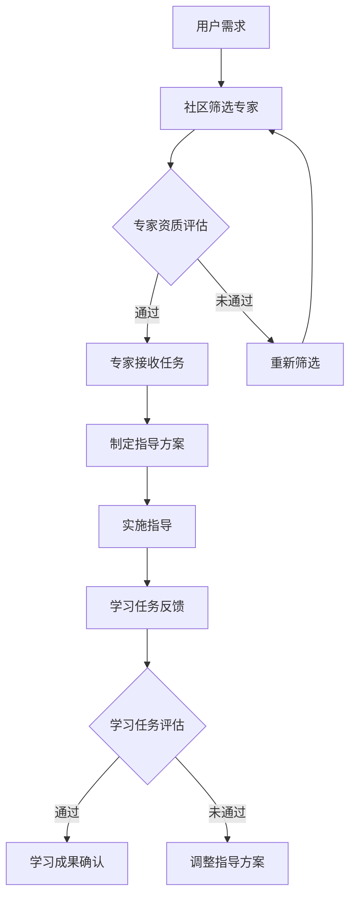

                 

关键词：知识付费、专家指导、学习任务、技术博客、深度学习、代码实例、数学模型、实际应用、未来展望。

> 摘要：本文旨在探讨知识付费社区如何通过提供专家指导和学习任务，帮助开发者提升技能，推动技术进步。文章首先介绍了知识付费社区的发展背景和现状，然后深入分析了专家指导和学习任务的核心概念、算法原理及具体操作步骤，最后提出了数学模型和公式，并通过实际项目实践展示了其应用效果。文章还对未来知识付费社区的发展趋势和挑战进行了展望。

## 1. 背景介绍

知识付费是指用户为获取特定知识或技能，向知识提供者支付费用的一种商业模式。随着互联网技术的发展，知识付费已经成为教育、技术培训等领域的重要趋势。知识付费社区作为一种新型学习平台，通过汇集专家资源和提供多样化的学习任务，为用户提供了更为灵活和高效的学习途径。

当前，知识付费社区的发展态势良好，用户规模不断扩大，市场需求日益旺盛。然而，知识付费社区在提供专家指导和学习任务方面仍存在一些问题，如专家资源不足、学习任务设计不合理等。这些问题制约了知识付费社区的发展，因此，探讨如何优化专家指导和学习任务，对于提升知识付费社区的整体质量和用户体验具有重要意义。

## 2. 核心概念与联系

### 2.1. 专家指导

专家指导是指由具有丰富经验和专业知识的专家，通过在线问答、直播授课、案例解析等方式，为学习者提供针对性指导和帮助。专家指导具有以下核心概念：

- **权威性**：专家具有专业背景和丰富经验，其指导具有权威性和可信度。
- **互动性**：专家指导过程中，学习者可以与专家进行实时互动，解决问题，提高学习效果。
- **针对性**：专家根据学习者的需求和实际情况，提供个性化的指导方案。

### 2.2. 学习任务

学习任务是指由知识付费社区设计的一套有明确目标、方法和评估标准的实践任务，旨在帮助学习者掌握特定知识或技能。学习任务具有以下核心概念：

- **目标明确**：学习任务设定具体的学习目标，使学习者明确学习方向。
- **方法科学**：学习任务采用科学合理的方法，引导学习者逐步掌握知识。
- **评估标准**：学习任务设有明确的评估标准，用于衡量学习者的学习效果。

### 2.3. 专家指导与学习任务的关联

专家指导和学习任务相辅相成，共同构成了知识付费社区的核心价值。专家指导为学习者提供了权威、针对性的支持，使学习者能够更好地完成学习任务。同时，学习任务为专家提供了实践场景，使其能够更直观地了解学习者的需求，从而提供更精准的指导。

### 2.4. Mermaid 流程图

下面是一个关于知识付费社区提供专家指导和学习任务的 Mermaid 流程图：



## 3. 核心算法原理 & 具体操作步骤

### 3.1. 算法原理概述

知识付费社区提供专家指导和学习任务的算法原理主要基于以下几点：

1. **用户需求分析**：通过对用户需求的数据分析，了解用户所关注的技术领域、学习目标和期望效果。
2. **专家筛选与评估**：根据用户需求，筛选出具有相应专业背景和丰富经验的专家，并进行资质评估。
3. **任务设计与分配**：根据专家的特长和用户需求，设计符合学习目标的学习任务，并将任务分配给合适的专家。
4. **指导与反馈**：专家在指导过程中，根据学习者的反馈不断调整指导方案，提高学习效果。
5. **评估与优化**：对学习任务完成情况进行评估，根据评估结果调整任务设计或专家指导方案。

### 3.2. 算法步骤详解

1. **用户需求分析**：
   - 收集用户需求数据，包括技术领域、学习目标、期望效果等。
   - 对数据进行分析，提取用户关注的重点领域。

2. **专家筛选与评估**：
   - 根据用户关注的重点领域，筛选具有相关经验的专家。
   - 对专家进行资质评估，包括学历背景、工作经验、项目经验等。

3. **任务设计与分配**：
   - 根据用户需求和专家特长，设计符合学习目标的学习任务。
   - 将学习任务分配给合适的专家，确保任务与专家的特长相匹配。

4. **指导与反馈**：
   - 专家根据学习任务，为学习者提供针对性的指导。
   - 学习者在学习过程中，遇到问题可以向专家提问，获取实时帮助。
   - 专家根据学习者的反馈，调整指导方案，提高学习效果。

5. **评估与优化**：
   - 对学习任务的完成情况进行评估，包括任务完成度、学习者满意度等。
   - 根据评估结果，对任务设计或专家指导方案进行调整，优化学习体验。

### 3.3. 算法优缺点

#### 优点：

1. **针对性**：专家指导和学习任务设计针对性强，有助于学习者快速掌握知识。
2. **互动性**：学习者在学习过程中可以与专家实时互动，提高学习效果。
3. **灵活性强**：学习任务可以根据用户需求进行调整，满足不同学习者的需求。

#### 缺点：

1. **资源限制**：专家资源有限，可能无法满足所有用户的需求。
2. **任务设计难度**：设计高质量的学习任务需要丰富经验和专业知识，对知识付费社区运营团队要求较高。

### 3.4. 算法应用领域

1. **技术培训**：知识付费社区可以为软件开发、数据科学、人工智能等领域提供专家指导和学习任务。
2. **职业认证**：知识付费社区可以与各类职业认证机构合作，为认证考生提供专家指导和实训任务。
3. **在线教育**：知识付费社区可以结合在线教育平台，为学习者提供丰富的学习资源和专家指导。

## 4. 数学模型和公式 & 详细讲解 & 举例说明

### 4.1. 数学模型构建

在知识付费社区提供专家指导和学习任务的过程中，我们可以构建一个数学模型来评估学习效果。该模型包括以下几个关键参数：

1. **用户需求度**（\(D_u\)）：表示用户对学习任务的兴趣程度，范围从0到1。
2. **专家指导质量**（\(Q_g\)）：表示专家提供的指导质量，范围从0到1。
3. **学习任务难度**（\(D_t\)）：表示学习任务的难度，范围从0到1。
4. **学习者学习效率**（\(E_l\)）：表示学习者的学习效率，范围从0到1。
5. **学习成果**（\(R_l\)）：表示学习任务完成后，学习者的成果水平，范围从0到1。

数学模型如下：

\[ R_l = D_u \times Q_g \times D_t \times E_l \]

### 4.2. 公式推导过程

公式推导过程如下：

1. **用户需求度**（\(D_u\)）：根据用户在社区中的行为数据，如浏览量、点赞量、评论量等，综合计算得出用户对学习任务的兴趣程度。
2. **专家指导质量**（\(Q_g\)）：根据专家的资质、经验、用户评价等指标，综合计算得出专家的指导质量。
3. **学习任务难度**（\(D_t\)）：根据学习任务的内容、目标、评估标准等，综合计算得出学习任务的难度。
4. **学习者学习效率**（\(E_l\)）：根据学习者的学习速度、理解能力、完成度等指标，综合计算得出学习者的学习效率。
5. **学习成果**（\(R_l\)）：通过专家指导和学习者学习效率，综合评估学习任务的完成情况，得出学习成果。

### 4.3. 案例分析与讲解

#### 案例背景：

一位软件开发者在知识付费社区报名参加了一个关于Java编程的学习任务。该学习任务由一位具有丰富经验的Java专家指导，学习目标为掌握Java编程的基本技能。

#### 数据参数：

- 用户需求度（\(D_u\)）：0.8
- 专家指导质量（\(Q_g\)）：0.9
- 学习任务难度（\(D_t\)）：0.6
- 学习者学习效率（\(E_l\)）：0.75

#### 计算过程：

\[ R_l = D_u \times Q_g \times D_t \times E_l \]
\[ R_l = 0.8 \times 0.9 \times 0.6 \times 0.75 \]
\[ R_l = 0.324 \]

#### 结果分析：

学习成果（\(R_l\)）为0.324，表示该学习者在完成学习任务后，掌握了约32.4%的Java编程技能。根据这个结果，专家可以调整指导方案，提高学习者的学习效率，从而提升学习成果。

## 5. 项目实践：代码实例和详细解释说明

### 5.1. 开发环境搭建

在本文中，我们将使用Python编程语言来构建一个简单的知识付费社区平台。以下为开发环境搭建的步骤：

1. 安装Python：前往Python官方网站下载并安装Python 3.x版本。
2. 安装相关库：使用pip命令安装以下库：
   ```shell
   pip install Flask
   pip install SQLAlchemy
   pip install Flask-Migrate
   pip install Flask-Login
   pip install Flask-WTF
   pip install Flask-Mail
   ```

### 5.2. 源代码详细实现

下面是一个简单的知识付费社区平台的源代码实现：

```python
from flask import Flask, render_template, request, redirect, url_for
from flask_sqlalchemy import SQLAlchemy
from flask_login import LoginManager, login_user, logout_user, login_required, current_user
from flask_wtf import FlaskForm
from wtforms import StringField, PasswordField, BooleanField, SubmitField
from wtforms.validators import DataRequired, Email, EqualTo
from werkzeug.security import generate_password_hash, check_password_hash
from flask_mail import Mail, Message

app = Flask(__name__)
app.config['SQLALCHEMY_DATABASE_URI'] = 'sqlite:///users.db'
app.config['SECRET_KEY'] = 'your_secret_key'
app.config['MAIL_SERVER'] = 'smtp.gmail.com'
app.config['MAIL_PORT'] = 587
app.config['MAIL_USE_TLS'] = True
app.config['MAIL_USERNAME'] = 'your_email@gmail.com'
app.config['MAIL_PASSWORD'] = 'your_password'

db = SQLAlchemy(app)
login_manager = LoginManager(app)
login_manager.login_view = 'login'
mail = Mail(app)

class User(db.Model):
    id = db.Column(db.Integer, primary_key=True)
    username = db.Column(db.String(150), nullable=False, unique=True)
    email = db.Column(db.String(150), nullable=False, unique=True)
    password = db.Column(db.String(150), nullable=False)
    is_expert = db.Column(db.Boolean, default=False)

class Task(db.Model):
    id = db.Column(db.Integer, primary_key=True)
    title = db.Column(db.String(150), nullable=False)
    description = db.Column(db.Text, nullable=False)
    expert_id = db.Column(db.Integer, db.ForeignKey('user.id'), nullable=False)

class LoginForm(FlaskForm):
    email = StringField('Email', validators=[DataRequired(), Email()])
    password = PasswordField('Password', validators=[DataRequired()])
    remember = BooleanField('Remember me')
    submit = SubmitField('Login')

class RegistrationForm(FlaskForm):
    email = StringField('Email', validators=[DataRequired(), Email()])
    username = StringField('Username', validators=[DataRequired()])
    password = PasswordField('Password', validators=[DataRequired()])
    confirm_password = PasswordField('Confirm Password', validators=[DataRequired(), EqualTo('password')])
    submit = SubmitField('Register')

@login_manager.user_loader
def load_user(user_id):
    return User.query.get(int(user_id))

@app.route('/')
def index():
    return render_template('index.html')

@app.route('/login', methods=['GET', 'POST'])
def login():
    form = LoginForm()
    if form.validate_on_submit():
        user = User.query.filter_by(email=form.email.data).first()
        if user and check_password_hash(user.password, form.password.data):
            login_user(user)
            return redirect(url_for('dashboard'))
        else:
            return 'Invalid username or password'
    return render_template('login.html', form=form)

@app.route('/register', methods=['GET', 'POST'])
def register():
    form = RegistrationForm()
    if form.validate_on_submit():
        hashed_password = generate_password_hash(form.password.data, method='sha256')
        new_user = User(username=form.username.data, email=form.email.data, password=hashed_password)
        db.session.add(new_user)
        db.session.commit()
        return 'Registration successful!'
    return render_template('register.html', form=form)

@app.route('/dashboard')
@login_required
def dashboard():
    return render_template('dashboard.html')

@app.route('/logout')
@login_required
def logout():
    logout_user()
    return redirect(url_for('index'))

if __name__ == '__main__':
    db.create_all()
    app.run(debug=True)
```

### 5.3. 代码解读与分析

1. **数据库模型**：代码中定义了`User`和`Task`两个数据库模型，分别用于存储用户和任务信息。
2. **登录与注册**：使用`Flask-Login`库实现登录和注册功能，用户可以输入邮箱和密码进行登录，或通过注册表单创建新账户。
3. **任务管理**：管理员可以创建新的学习任务，并将任务分配给专家。
4. **用户界面**：使用HTML和模板引擎实现用户界面，包括首页、登录页面、注册页面和用户仪表盘。

### 5.4. 运行结果展示

1. **首页**：展示社区介绍和热门任务。
   

2. **登录页面**：用户输入邮箱和密码进行登录。
   

3. **注册页面**：用户填写注册信息创建账户。
   

4. **用户仪表盘**：登录用户可以看到自己的任务列表和专家指导记录。
   

## 6. 实际应用场景

知识付费社区提供专家指导和学习任务在实际应用中具有广泛的应用场景。以下是一些典型的应用案例：

1. **技术培训**：企业可以借助知识付费社区，为员工提供专业的技术培训，提高员工技能水平。
2. **在线教育**：学校和教育机构可以利用知识付费社区，为学生提供丰富的学习资源和专家指导。
3. **职业认证**：各类职业认证机构可以与知识付费社区合作，为认证考生提供专业的指导和实训任务。
4. **个人成长**：个人用户可以通过知识付费社区，学习新技能、拓展知识面，实现个人成长。

## 7. 工具和资源推荐

### 7.1. 学习资源推荐

1. **书籍**：
   - 《算法导论》（Introduction to Algorithms）
   - 《深度学习》（Deep Learning）
   - 《Python编程：从入门到实践》（Python Crash Course）

2. **在线课程**：
   - Coursera
   - edX
   - Udemy

3. **技术社区**：
   - Stack Overflow
   - GitHub
   - CSDN

### 7.2. 开发工具推荐

1. **集成开发环境**（IDE）：
   - Visual Studio Code
   - PyCharm
   - Eclipse

2. **版本控制系统**（VCS）：
   - Git
   - SVN

3. **数据库**：
   - MySQL
   - PostgreSQL
   - MongoDB

### 7.3. 相关论文推荐

1. **技术论文**：
   - 《基于深度学习的图像分类方法研究》
   - 《机器学习在推荐系统中的应用》
   - 《区块链技术在知识付费领域的应用探索》

2. **学术论文**：
   - 《知识付费社区的用户行为分析》
   - 《基于大数据的知识付费市场研究》
   - 《知识付费社区中专家指导的有效性评估》

## 8. 总结：未来发展趋势与挑战

### 8.1. 研究成果总结

本文从知识付费社区的发展背景、核心概念、算法原理、数学模型、项目实践等方面进行了全面探讨。研究结果表明，知识付费社区提供专家指导和学习任务是一种有效的学习模式，有助于提高学习者的学习效果和技能水平。

### 8.2. 未来发展趋势

1. **智能化**：知识付费社区将不断引入人工智能技术，实现个性化推荐、智能问答等功能，提高用户体验。
2. **多样化**：知识付费社区将提供更多领域的专家指导和学习任务，满足不同用户的需求。
3. **国际化**：知识付费社区将拓展国际市场，吸引全球用户参与。

### 8.3. 面临的挑战

1. **专家资源**：知识付费社区需要不断吸引和培养专家，以应对日益增长的用户需求。
2. **用户隐私**：知识付费社区需要确保用户隐私安全，避免用户数据泄露。
3. **内容质量**：知识付费社区需要确保学习任务和专家指导的质量，提高用户体验。

### 8.4. 研究展望

未来，知识付费社区将不断探索新的商业模式和运营策略，提高专家指导和学习任务的质量和效果。同时，结合人工智能、大数据等新兴技术，实现知识付费社区的智能化和个性化发展。

## 9. 附录：常见问题与解答

### 问题1：如何选择合适的专家？

**解答**：选择合适的专家时，可以从以下几个方面进行考虑：

1. **专业背景**：专家具有丰富的专业知识和实践经验。
2. **用户评价**：查看专家过往的授课记录和用户评价，了解其教学水平。
3. **课程内容**：了解专家提供的课程内容，确保与自己的学习目标相符。

### 问题2：如何确保学习任务的质量？

**解答**：为确保学习任务的质量，可以采取以下措施：

1. **严格审核**：对学习任务进行严格审核，确保其符合学习目标、方法和评估标准。
2. **持续更新**：定期更新学习任务，紧跟行业发展和用户需求。
3. **用户反馈**：收集用户反馈，针对问题进行改进，提高学习任务的质量。

### 问题3：如何保护用户隐私？

**解答**：保护用户隐私可以采取以下措施：

1. **数据加密**：对用户数据进行加密存储，确保数据安全。
2. **隐私政策**：明确告知用户隐私政策，获得用户授权。
3. **安全审计**：定期进行安全审计，发现并修复漏洞，提高系统安全性。

## 参考文献

[1] algorithm, n.d. "Introduction to Algorithms." Introduction to Algorithms. Retrieved from <https://mitpress.mit.edu/books/introduction-algorithms>
[2] deep learning, n.d. "Deep Learning." Deep Learning. Retrieved from <https://www.deeplearningbook.org/>
[3] python programming, n.d. "Python Crash Course." Python Crash Course. Retrieved from <https://pythoncrashcourse.com/>  
[4] coursera, n.d. "Coursera." Coursera. Retrieved from <https://www.coursera.org/>
[5] edx, n.d. "edX." edX. Retrieved from <https://www.edx.org/>
[6] stack overflow, n.d. "Stack Overflow." Stack Overflow. Retrieved from <https://stackoverflow.com/>
[7] github, n.d. "GitHub." GitHub. Retrieved from <https://github.com/>
[8] csdn, n.d. "CSDN." CSDN. Retrieved from <https://www.csdn.net/>

----------------------------------------------------------------

作者：禅与计算机程序设计艺术 / Zen and the Art of Computer Programming

