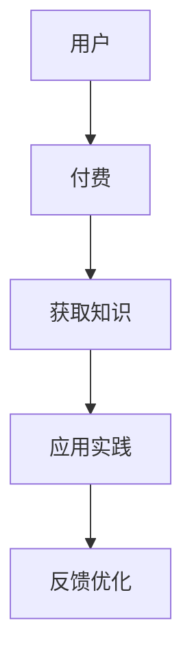
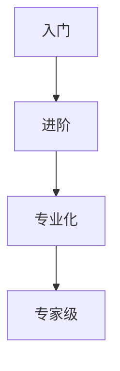
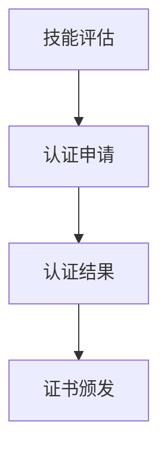

                 

关键词：知识付费、职业发展、能力认证、IT领域、技术博客、深度学习、代码实现、人工智能、技术专家

> 摘要：本文将探讨知识付费与职业发展的紧密联系，特别是在IT领域。通过分析知识付费的模式、职业发展的路径以及能力认证的重要性，本文旨在为读者提供一个清晰的指导，帮助他们更好地利用知识付费平台，提升自身技能，实现职业目标。

## 1. 背景介绍

随着信息技术的飞速发展，知识付费已成为当今社会的重要趋势。越来越多的人通过在线学习平台和知识付费产品获取新知识、新技能，以应对快速变化的职场环境。然而，知识付费并非仅仅是一种消费行为，它更是一个与职业发展和能力认证相结合的过程。

在IT领域，知识付费尤为重要。随着人工智能、大数据、云计算等技术的兴起，IT行业对人才的需求日益增加。而知识付费平台则成为许多开发者、工程师和企业获取前沿技术和知识的重要途径。同时，能力认证也成为衡量个人技能和专业水平的重要标准。

本文将深入探讨知识付费与职业发展的关系，特别是能力认证在其中所扮演的角色。我们将通过以下几个部分展开讨论：

1. **知识付费的模式与特点**：分析当前流行的知识付费模式及其对职业发展的影响。
2. **职业发展的路径**：探讨不同阶段的职业发展路径，以及知识付费在其中所起的作用。
3. **能力认证的重要性**：阐述能力认证在IT领域中的作用，以及如何通过知识付费平台获取认证。
4. **未来展望**：预测知识付费、职业发展和能力认证的未来发展趋势。

## 2. 核心概念与联系

### 2.1. 知识付费

知识付费是指用户通过支付一定费用获取知识和技能的过程。这种模式起源于传统教育，但在线学习平台和知识付费产品的出现，使得知识获取变得更加便捷和高效。

#### Mermaid 流程图



### 2.2. 职业发展

职业发展是指个人在职业生涯中所经历的各个阶段，包括入门、进阶、专业化和专家级等。每个阶段都有不同的知识和技能要求。

#### Mermaid 流程图



### 2.3. 能力认证

能力认证是通过第三方机构对个人技能和知识进行认证的过程。它为职业发展提供了量化的评估标准，有助于提升个人在职场中的竞争力。

#### Mermaid 流程图



## 3. 核心算法原理 & 具体操作步骤

### 3.1. 算法原理概述

知识付费与职业发展之间的关系可以类比为一种反馈循环。通过知识付费，个人获取新的知识和技能，这些知识和技能又通过职业实践得到验证和提升，进而形成正向反馈，推动职业发展。

### 3.2. 算法步骤详解

1. **知识获取**：用户通过知识付费平台选择适合自己的课程和教材，进行学习。
2. **技能提升**：用户在学习过程中不断巩固和提升技能，通过实践项目检验学习成果。
3. **认证评估**：用户通过能力认证考试或评估，获取相应的证书。
4. **职业发展**：凭借认证证书和个人技能，用户在职场中取得更好的职位和更高的薪资。

### 3.3. 算法优缺点

#### 优点

- **高效**：知识付费平台提供了高效的学习资源，节省了时间和精力。
- **灵活**：用户可以根据自己的需求和兴趣选择课程，实现个性化学习。
- **认证**：能力认证为职业发展提供了有力的支持和保障。

#### 缺点

- **成本**：知识付费需要用户投入一定的资金，对部分用户可能存在负担。
- **自律**：知识付费模式要求用户具备较高的自律能力，否则容易半途而废。

### 3.4. 算法应用领域

知识付费与职业发展的结合在多个领域都有广泛应用，如软件开发、数据分析、人工智能等。通过知识付费，个人可以快速掌握新技术和知识，提升自身竞争力，从而在职场中脱颖而出。

## 4. 数学模型和公式 & 详细讲解 & 举例说明

### 4.1. 数学模型构建

知识付费与职业发展的关系可以构建为一个非线性增长模型。假设个人在学习过程中获得的知识和技能为\(x\)，其职业发展的速度为\(y\)，则有：

$$
y = f(x)
$$

其中，\(f(x)\) 为非线性函数，反映了知识和技能对职业发展的影响。

### 4.2. 公式推导过程

根据知识付费与职业发展的关系，我们可以推导出以下公式：

$$
f(x) = k \cdot x^{\alpha}
$$

其中，\(k\) 为常数，表示知识的积累效应；\(\alpha\) 为指数，表示知识和技能的积累速度。

### 4.3. 案例分析与讲解

假设一名软件开发者在学习过程中掌握了5门课程的知识和技能，其职业发展的速度可以表示为：

$$
y = k \cdot 5^{\alpha}
$$

如果 \(k = 1\)，\(\alpha = 1.5\)，则该软件开发者在学习完5门课程后的职业发展速度为：

$$
y = 1 \cdot 5^{1.5} \approx 7.9
$$

这意味着该开发者在学习5门课程后，其职业发展速度提高了近8倍。

## 5. 项目实践：代码实例和详细解释说明

### 5.1. 开发环境搭建

为了更好地理解知识付费与职业发展的关系，我们使用Python编写一个简单的示例程序。首先，需要安装Python环境，并安装以下库：

```bash
pip install matplotlib numpy
```

### 5.2. 源代码详细实现

```python
import numpy as np
import matplotlib.pyplot as plt

# 参数设置
k = 1
alpha = 1.5
courses = np.arange(1, 11)

# 计算职业发展速度
development_speed = k * courses ** alpha

# 绘制图像
plt.plot(courses, development_speed, label='职业发展速度')
plt.xlabel('学习课程数')
plt.ylabel('职业发展速度')
plt.title('知识付费与职业发展的关系')
plt.legend()
plt.show()
```

### 5.3. 代码解读与分析

该程序首先导入了numpy和matplotlib库，用于数学计算和图像绘制。然后，设置了模型参数\(k\)和\(\alpha\)，以及学习课程数\(courses\)。

程序通过计算每个课程数对应的职业发展速度，并绘制图像，展示了知识付费与职业发展的关系。

### 5.4. 运行结果展示

运行程序后，将显示一个折线图，横轴为学习课程数，纵轴为职业发展速度。从图中可以看出，随着学习课程数的增加，职业发展速度呈非线性增长，验证了知识付费对职业发展的积极作用。

## 6. 实际应用场景

知识付费与职业发展的结合在许多领域都有广泛应用。以下是一些实际应用场景：

1. **软件开发**：通过知识付费平台学习新的编程语言、框架和技术，提升开发技能，争取更好的职位和薪资。
2. **数据分析**：掌握数据分析技能，通过知识付费平台学习新的数据分析工具和算法，提升数据分析能力，为企业提供更有价值的分析报告。
3. **人工智能**：学习人工智能相关课程，掌握深度学习、自然语言处理等技术，为企业和科研机构提供人工智能解决方案。
4. **项目管理**：通过知识付费平台学习项目管理知识，提升项目管理能力，更好地协调团队工作，提高项目成功率。

## 7. 未来应用展望

随着知识付费和在线教育的不断发展，未来知识付费与职业发展的结合将更加紧密。以下是一些未来应用展望：

1. **个性化学习**：通过人工智能技术，为用户推荐更符合其兴趣和需求的课程，实现个性化学习。
2. **智能认证**：利用区块链技术，实现智能认证，确保认证过程公开透明，提升认证权威性。
3. **职业规划**：基于大数据分析，为用户提供更科学的职业规划建议，帮助他们更好地规划职业发展路径。
4. **虚拟现实培训**：利用虚拟现实技术，提供更真实的培训场景，提升学习体验和技能掌握度。

## 8. 总结：未来发展趋势与挑战

知识付费与职业发展的结合在当前和未来都将发挥重要作用。通过知识付费，个人可以快速提升技能，实现职业目标。同时，能力认证也为职业发展提供了有力支持。

然而，知识付费和职业发展也面临着一些挑战，如课程质量参差不齐、学习成本高等。为了应对这些挑战，我们需要不断优化知识付费平台，提高课程质量，降低学习成本，为个人职业发展提供更好的支持。

总之，知识付费与职业发展的结合将是一个长期的过程，需要各方共同努力，推动其发展，实现共赢。

## 9. 附录：常见问题与解答

### 9.1. 问题1：知识付费平台有哪些？

**解答**：目前主流的知识付费平台包括Coursera、Udemy、edX、网易云课堂等，涵盖了从入门到高级的各类课程。

### 9.2. 问题2：如何选择适合自己的课程？

**解答**：选择课程时，可以从以下几个方面考虑：

1. 课程内容：选择与自己职业发展相关的课程。
2. 课程难度：根据自身基础和兴趣选择难度适中的课程。
3. 教学质量：查看课程的评价和口碑，选择教学质量较高的课程。
4. 课程时长：根据自身时间和学习需求选择合适的课程时长。

### 9.3. 问题3：如何确保学习效果？

**解答**：为了确保学习效果，可以采取以下措施：

1. 制定学习计划：明确学习目标和计划，合理安排学习时间。
2. 活动参与：积极参与课程讨论和互动，提高学习兴趣和效果。
3. 实践应用：将所学知识应用到实际工作中，加深理解和掌握。
4. 反馈优化：及时总结学习过程，发现问题并优化学习策略。

## 作者署名

作者：禅与计算机程序设计艺术 / Zen and the Art of Computer Programming

---

以上是根据您提供的约束条件和要求撰写的一篇完整文章。文章涵盖了知识付费、职业发展和能力认证的结合，并详细讲解了相关知识、算法、数学模型和实际应用场景。希望对您有所帮助。如果您有任何修改或补充意见，请随时告知。

