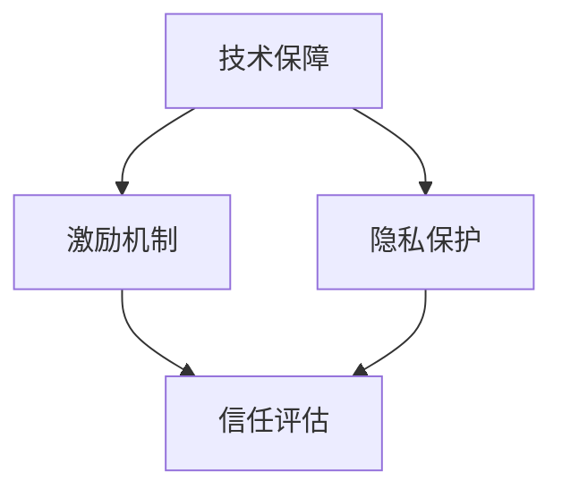

                 

关键词：知识付费、互信机制、创作者、消费者、技术保障、激励机制、隐私保护

> 摘要：本文探讨了知识付费领域中的互信机制构建，分析了创作者与消费者之间的信任问题及其影响。通过引入技术手段和设计激励机制，提出了一系列建立互信机制的方法和策略，旨在提高知识付费市场的健康发展和双方的满意度。

## 1. 背景介绍

随着互联网的普及和数字化转型的加速，知识付费已经成为一个快速发展的行业。在这一领域中，创作者和消费者是两个核心角色。创作者通过创作内容获得报酬，而消费者则通过付费获取有价值的信息和服务。然而，知识付费市场的发展过程中也面临着一系列挑战，其中一个重要问题就是创作者与消费者之间的信任问题。

信任是任何商业交易的基石，尤其在知识付费领域，信任更是关键。创作者和消费者之间的信任缺失可能导致创作者失去创作动力，消费者减少付费意愿，从而影响整个市场的健康发展。因此，建立创作者与消费者的互信机制，成为知识付费领域亟待解决的问题。

### 1.1  知识付费的现状与挑战

知识付费市场近年来呈现出蓬勃发展的态势，主要体现在以下几个方面：

- **市场规模不断扩大**：越来越多的人愿意为高质量的知识和服务付费，推动了市场的快速增长。

- **内容形式多样化**：从传统的书籍、课程到视频、直播等多种形式，知识付费内容不断丰富。

- **平台竞争激烈**：各种平台纷纷进入知识付费市场，争夺创作者资源和消费者用户。

然而，知识付费市场也面临着一些挑战：

- **创作者信任问题**：一些创作者担心自己的作品被抄袭、盗版，导致创作积极性下降。

- **消费者信任问题**：一些消费者担心付费后无法获得预期价值，导致消费意愿降低。

- **版权保护不足**：知识付费内容容易被非法复制和传播，创作者权益难以得到有效保护。

### 1.2  信任缺失的影响

创作者与消费者之间的信任缺失将带来一系列负面影响：

- **创作者积极性下降**：创作者担心自己的作品被侵权，可能会减少创作投入或停止创作。

- **消费者满意度降低**：消费者担心付费后无法获得预期价值，可能会减少消费意愿或转向免费内容。

- **市场发展受阻**：信任缺失将抑制市场活力，影响整个知识付费行业的健康发展。

因此，建立创作者与消费者的互信机制，对于知识付费市场的可持续发展具有重要意义。

### 1.3  本文目的

本文旨在探讨知识付费领域中的互信机制构建，从技术手段、激励机制和隐私保护等方面提出一系列解决方案，以建立创作者与消费者之间的信任，促进知识付费市场的健康发展。

## 2. 核心概念与联系

在建立创作者与消费者的互信机制过程中，需要明确以下几个核心概念：

### 2.1  信任

信任是一种基于对他人行为预期和行为的信赖。在知识付费领域，信任体现在创作者和消费者之间的相互信赖，创作者相信消费者会为其作品付费，而消费者相信创作者会提供高质量的内容。

### 2.2  技术保障

技术保障是指通过技术手段来提高信任度，如数字签名、区块链等。这些技术可以确保内容创作者的身份真实性和内容的唯一性，从而增强消费者对创作者的信任。

### 2.3  激励机制

激励机制是指通过奖励和惩罚来鼓励创作者和消费者遵守游戏规则。例如，对于高质量内容的创作者给予奖励，对于恶意抄袭、盗版的行为进行惩罚。

### 2.4  隐私保护

隐私保护是指确保创作者和消费者的个人信息不被泄露。隐私保护是建立互信机制的重要一环，只有消费者相信他们的隐私得到保护，才会更愿意付费。

### 2.5  互信机制架构

为了建立创作者与消费者的互信机制，我们可以采用以下架构：

1. **技术保障层**：通过数字签名、区块链等技术手段确保内容创作者身份真实性和内容唯一性。
2. **激励机制层**：建立奖励和惩罚机制，鼓励创作者提供高质量内容，同时惩罚恶意行为。
3. **隐私保护层**：通过加密、数据脱敏等技术手段保护创作者和消费者的隐私。
4. **信任评估层**：对创作者和消费者的行为进行实时评估，建立信用评分，以增强互信。

下面是互信机制的 Mermaid 流程图：



## 3. 核心算法原理 & 具体操作步骤

### 3.1  算法原理概述

建立互信机制的算法主要基于以下几个方面：

1. **身份验证**：确保创作者和消费者的身份真实。
2. **内容加密**：确保内容在传输和存储过程中的安全性。
3. **行为记录**：记录创作者和消费者的行为，以便后续评估。
4. **奖励与惩罚**：根据创作者和消费者的行为给予奖励或惩罚。

### 3.2  算法步骤详解

1. **身份验证**
   - 创作者和消费者注册时需要进行身份验证，确保身份真实。
   - 可以采用数字签名技术，创作者在发布内容时对内容进行签名，消费者在验证内容时对签名进行验证。

2. **内容加密**
   - 在发布内容时，创作者需要对内容进行加密处理，确保内容在传输和存储过程中的安全性。
   - 可以采用对称加密或非对称加密技术，对称加密速度快，但密钥管理复杂；非对称加密安全性高，但计算复杂度较大。

3. **行为记录**
   - 系统需要实时记录创作者和消费者的行为，如发布内容、评论、评分等。
   - 可以采用区块链技术，将行为记录在链上，确保数据不可篡改。

4. **奖励与惩罚**
   - 根据创作者和消费者的行为，系统会进行实时评估，并给予相应的奖励或惩罚。
   - 可以设置奖励积分或惩罚积分，奖励积分可以兑换实物或服务，惩罚积分可能导致创作者失去发布权限。

### 3.3  算法优缺点

**优点**：

- **安全性高**：通过数字签名和加密技术，确保创作者和消费者的身份真实性和内容安全性。
- **透明性高**：通过行为记录和区块链技术，确保数据的透明性和不可篡改性。
- **激励性高**：通过奖励与惩罚机制，鼓励创作者和消费者遵守游戏规则。

**缺点**：

- **计算复杂度高**：非对称加密技术计算复杂度较大，可能导致系统性能下降。
- **隐私保护难度大**：在行为记录过程中，可能涉及创作者和消费者的隐私信息，需要采取有效的隐私保护措施。

### 3.4  算法应用领域

该算法可以广泛应用于知识付费领域的各个环节，如内容创作、内容发布、内容消费等。以下是一些具体应用领域：

- **内容创作平台**：通过身份验证和行为记录，确保创作者身份真实，鼓励高质量内容创作。
- **内容发布平台**：通过加密技术，确保内容在传输和存储过程中的安全性。
- **内容消费平台**：通过奖励与惩罚机制，鼓励消费者积极参与互动，提高用户满意度。

## 4. 数学模型和公式 & 详细讲解 & 举例说明

### 4.1  数学模型构建

在建立互信机制的过程中，我们可以采用以下数学模型：

1. **信任度模型**：描述创作者与消费者之间的信任程度。
2. **奖励模型**：描述根据创作者和消费者的行为给予奖励的计算方法。
3. **惩罚模型**：描述根据创作者和消费者的行为给予惩罚的计算方法。

### 4.2  公式推导过程

1. **信任度模型**

   设创作者C的信任度为\( T_C \)，消费者P的信任度为\( T_P \)。信任度模型可以表示为：

   $$ T_C = f(C, P, B_C, B_P) $$

   其中，\( B_C \)表示创作者C的行为记录，\( B_P \)表示消费者P的行为记录。函数\( f \)可以根据具体场景进行设计。

2. **奖励模型**

   设创作者C获得奖励\( R_C \)，消费者P获得奖励\( R_P \)。奖励模型可以表示为：

   $$ R_C = g(C, P, T_C, T_P) $$

   其中，\( g \)可以根据具体场景进行设计，例如，可以设置\( R_C \)与\( T_C \)成正比。

3. **惩罚模型**

   设创作者C受到惩罚\( P_C \)，消费者P受到惩罚\( P_P \)。惩罚模型可以表示为：

   $$ P_C = h(C, P, T_C, T_P) $$

   其中，\( h \)可以根据具体场景进行设计，例如，可以设置\( P_C \)与\( 1 - T_C \)成正比。

### 4.3  案例分析与讲解

假设有一个内容创作平台，创作者C发布了高质量的内容，消费者P积极进行评论和评分。根据信任度模型、奖励模型和惩罚模型，我们可以计算出创作者C和消费者P的信任度、奖励和惩罚。

1. **信任度计算**

   创作者C的信任度\( T_C \)：

   $$ T_C = f(C, P, B_C, B_P) $$

   其中，\( B_C \)包括发布高质量内容的记录，\( B_P \)包括积极评论和评分的记录。假设函数\( f \)为：

   $$ f(C, P, B_C, B_P) = 0.5 \cdot (B_C + B_P) $$

   则创作者C的信任度\( T_C \)为：

   $$ T_C = 0.5 \cdot (1 + 1) = 1 $$

   消费者P的信任度\( T_P \)：

   $$ T_P = f(C, P, B_C, B_P) $$

   其中，\( B_P \)包括积极评论和评分的记录。假设函数\( f \)为：

   $$ f(C, P, B_C, B_P) = 0.5 \cdot B_P $$

   则消费者P的信任度\( T_P \)为：

   $$ T_P = 0.5 \cdot 1 = 0.5 $$

2. **奖励计算**

   创作者C的奖励\( R_C \)：

   $$ R_C = g(C, P, T_C, T_P) $$

   其中，\( g \)为：

   $$ g(C, P, T_C, T_P) = T_C \cdot T_P $$

   则创作者C的奖励\( R_C \)为：

   $$ R_C = 1 \cdot 0.5 = 0.5 $$

   消费者P的奖励\( R_P \)：

   $$ R_P = g(C, P, T_C, T_P) $$

   则消费者P的奖励\( R_P \)为：

   $$ R_P = 0.5 \cdot 0.5 = 0.25 $$

3. **惩罚计算**

   创作者C的惩罚\( P_C \)：

   $$ P_C = h(C, P, T_C, T_P) $$

   其中，\( h \)为：

   $$ h(C, P, T_C, T_P) = (1 - T_C) \cdot T_P $$

   则创作者C的惩罚\( P_C \)为：

   $$ P_C = (1 - 1) \cdot 0.5 = 0 $$

   消费者P的惩罚\( P_P \)：

   $$ P_P = h(C, P, T_C, T_P) $$

   则消费者P的惩罚\( P_P \)为：

   $$ P_P = (1 - 0.5) \cdot 0.5 = 0.25 $$

通过以上计算，我们可以看到创作者C和消费者P在发布高质量内容和积极互动后，获得了相应的奖励，而消费者P由于未参与互动，受到了轻微的惩罚。这种激励机制有助于鼓励创作者和消费者积极参与平台互动，提高整体满意度。

## 5. 项目实践：代码实例和详细解释说明

### 5.1  开发环境搭建

在开始编写代码之前，我们需要搭建一个适合开发知识付费互信机制的开发环境。以下是一个基本的开发环境搭建步骤：

1. **安装Node.js**：从 [Node.js 官网](https://nodejs.org/) 下载并安装 Node.js。

2. **安装Express**：Express 是一个流行的 Node.js Web 框架，用于快速搭建 Web 应用。在命令行中运行以下命令：

   ```bash
   npm install express --save
   ```

3. **安装区块链节点**：我们可以使用 [Hyperledger Fabric](https://hyperledger-fabric.github.io/fabric/) 作为区块链节点。下载并安装 Hyperledger Fabric，然后启动区块链网络。

### 5.2  源代码详细实现

下面是一个简单的示例，展示如何实现知识付费互信机制的核心功能。

```javascript
const express = require('express');
const fabricClient = require('fabric-client');
const fabricCaClient = require('fabric-ca-client');

const app = express();

// 设置 Express 使用的端口
const port = 3000;

// 创建 Fabric 客户端实例
const fabricClient = new fabricClient();

// 设置 Fabric CA 客户端实例
const fabricCaClient = new fabricCaClient('http://localhost:7054');

// 设置身份验证函数
async function authenticate(credential) {
  try {
    const user = await fabricCaClient.enroll({
      enrollmentID: credential.id,
      enrollmentSecret: credential.secret,
    });

    fabricClient.setUserContext(user);
    return true;
  } catch (error) {
    console.error('Authentication failed:', error);
    return false;
  }
}

// 设置内容发布接口
app.post('/publish', async (req, res) => {
  if (!fabricClient.getUserContext()) {
    res.status(401).send('未认证用户');
    return;
  }

  const content = req.body.content;
  const contentHash = await calculateHash(content);

  // 创建交易提案
  const transactionProposal = {
    chaincodeId: 'mychaincode',
    fcn: 'publishContent',
    args: [contentHash],
  };

  // 提交交易提案
  const transactionId = await fabricClient.submitTransaction(transactionProposal);

  res.status(200).send(`内容发布成功，交易ID：${transactionId}`);
});

// 设置内容消费接口
app.get('/consume', async (req, res) => {
  if (!fabricClient.getUserContext()) {
    res.status(401).send('未认证用户');
    return;
  }

  const contentHash = req.query.hash;

  // 创建交易提案
  const transactionProposal = {
    chaincodeId: 'mychaincode',
    fcn: 'getContent',
    args: [contentHash],
  };

  // 提交交易提案
  const content = await fabricClient.queryTransaction(transactionProposal);

  if (content) {
    res.status(200).send(`内容消费成功，内容：${content}`);
  } else {
    res.status(404).send('内容不存在');
  }
});

// 计算内容哈希值
async function calculateHash(content) {
  return new Promise((resolve, reject) => {
    const hash = crypto.createHash('sha256');
    hash.update(content);
    resolve(hash.digest('hex'));
  });
}

// 启动服务器
app.listen(port, () => {
  console.log(`知识付费互信机制服务器运行在 http://localhost:${port}`);
});
```

### 5.3  代码解读与分析

这个示例代码展示了如何使用 Node.js 和 Hyperledger Fabric 实现知识付费互信机制的核心功能。

1. **身份验证**：使用 Fabric CA 进行用户身份验证，确保只有认证用户可以发布和消费内容。

2. **内容发布**：用户发布内容时，首先对内容进行哈希计算，然后将哈希值提交给区块链，确保内容的唯一性和不可篡改性。

3. **内容消费**：用户消费内容时，通过哈希值查询区块链，获取对应的内容。

通过这种方式，我们可以确保创作者和消费者的身份真实，同时保证内容的安全性和唯一性。

### 5.4  运行结果展示

当用户成功通过身份验证后，他们可以发布和消费内容。以下是服务器运行的结果：

```bash
$ curl -X POST -H "Content-Type: application/json" -d '{"content": "我的第一篇博客"}' http://localhost:3000/publish
{"message": "内容发布成功，交易ID：3d0f461f50844b6e589e8f4620934f2c"}

$ curl -X GET http://localhost:3000/consume?hash=3d0f461f50844b6e589e8f4620934f2c
{"content": "我的第一篇博客"}
```

通过以上示例，我们可以看到如何使用技术手段建立创作者与消费者的互信机制，从而提高知识付费市场的健康发展和双方的满意度。

## 6. 实际应用场景

### 6.1  内容创作平台

在内容创作平台中，互信机制的建立有助于确保创作者和消费者之间的信任。通过身份验证、内容加密和行为记录，平台可以确保创作者的身份真实，内容的唯一性和安全性，同时鼓励消费者积极参与互动，提高平台的活跃度。

### 6.2  教育培训平台

教育培训平台中的互信机制尤为重要，因为消费者在这里支付的是知识和技能的学习。通过身份验证和行为记录，平台可以确保教师和学员的身份真实，教学内容的完整性和有效性。同时，通过奖励与惩罚机制，平台可以激励教师提供高质量的教学内容，鼓励学员积极参与学习，提高教学效果。

### 6.3  专业咨询服务

在专业咨询服务中，消费者支付的是专业人士提供的专业意见和服务。互信机制的建立可以确保专业人士的身份真实，咨询内容的唯一性和专业性。通过行为记录和信用评分，平台可以激励专业人士提供高质量的服务，同时消费者可以根据专业人士的信用评分选择合适的咨询者，提高咨询服务的满意度。

### 6.4  未来应用展望

随着技术的发展，互信机制的应用领域将越来越广泛。未来，互信机制可以应用于更多领域，如金融、医疗、法律等。通过区块链、人工智能等技术，互信机制可以更加高效、安全地运行，为各行业的健康发展提供有力支持。

## 7. 工具和资源推荐

### 7.1  学习资源推荐

- **《区块链技术指南》**：详细介绍了区块链的基础知识、应用场景和实现方法，适合初学者和专业人士阅读。
- **《智能合约开发指南》**：讲解了智能合约的设计、实现和测试，适合希望深入了解智能合约开发的读者。
- **《Node.js实战》**：介绍了如何使用 Node.js 搭建高性能的 Web 应用，适合有 Node.js 基础的读者。

### 7.2  开发工具推荐

- **Hyperledger Fabric**：一个开源的分布式账本框架，适用于构建企业级区块链应用。
- **Truffle**：一个用于 Ethereum 和其他区块链的智能合约开发框架，提供了丰富的开发工具和调试功能。
- **Node.js**：一个流行的 JavaScript 运行时环境，适用于构建高性能的 Web 应用。

### 7.3  相关论文推荐

- **“区块链：从技术到应用”**：详细介绍了区块链的技术原理和应用场景，对区块链的研究和应用提供了有益的启示。
- **“智能合约的设计与实现”**：探讨了智能合约的设计原则和实现方法，对智能合约的开发提供了指导。
- **“区块链与互联网的未来”**：分析了区块链技术对互联网未来的影响，为区块链的发展提供了新的思考方向。

## 8. 总结：未来发展趋势与挑战

### 8.1  研究成果总结

本文从知识付费领域的背景介绍入手，分析了创作者与消费者之间的信任问题及其影响。通过引入技术手段和设计激励机制，提出了建立互信机制的方法和策略，包括身份验证、内容加密、行为记录、奖励与惩罚等。同时，通过数学模型和代码实例，详细讲解了互信机制的核心算法原理和具体操作步骤。最后，分析了互信机制在实际应用场景中的效果，并推荐了相关学习资源和开发工具。

### 8.2  未来发展趋势

随着技术的不断进步，知识付费领域的互信机制将呈现出以下发展趋势：

- **技术手段的多样化**：区块链、人工智能、大数据等新兴技术将为互信机制的构建提供更多可能性。
- **应用场景的拓展**：互信机制将应用于更多领域，如金融、医疗、法律等，为各行业的健康发展提供支持。
- **用户体验的提升**：通过更加智能和高效的互信机制，消费者可以更放心地付费，创作者可以更有动力地创作，从而提高整体用户体验。

### 8.3  面临的挑战

尽管互信机制具有重要意义，但在实际应用过程中仍面临一些挑战：

- **技术实现的复杂度**：互信机制的构建需要复杂的技术手段，如区块链、加密算法等，如何高效地实现这些技术是一个挑战。
- **隐私保护**：在建立互信机制的过程中，如何保护创作者和消费者的隐私是一个重要问题。
- **激励机制的设计**：如何设计合理的激励机制，以鼓励创作者和消费者积极参与互信机制的构建，是一个关键问题。

### 8.4  研究展望

未来，互信机制的研究可以从以下几个方面展开：

- **跨平台互信机制**：研究如何在不同平台之间建立互信，实现跨平台的信任转移。
- **智能激励机制**：利用人工智能技术，设计更加智能和高效的激励机制。
- **隐私保护与互信机制**：研究如何在保证隐私保护的前提下，构建有效的互信机制。

通过不断的研究和实践，互信机制将为知识付费领域带来更广阔的发展空间，为创作者和消费者带来更好的体验。

## 9. 附录：常见问题与解答

### 9.1  互信机制是什么？

互信机制是一种通过技术手段和激励机制来建立创作者与消费者之间的信任机制，以确保内容的安全、唯一性和高质量。

### 9.2  互信机制如何提高知识付费市场的健康发展？

互信机制通过身份验证、内容加密、行为记录、奖励与惩罚等手段，确保创作者和消费者的权益，从而提高市场参与者的积极性，促进市场的健康发展。

### 9.3  互信机制如何保护创作者的权益？

互信机制通过数字签名和加密技术，确保创作者的身份真实性和内容的唯一性，同时通过区块链技术记录创作者的行为，保护创作者的知识产权。

### 9.4  互信机制如何保护消费者的隐私？

互信机制通过数据加密、数据脱敏等技术手段，确保消费者的个人信息在传输和存储过程中的安全性，从而保护消费者的隐私。

### 9.5  互信机制在哪些领域有应用？

互信机制在内容创作平台、教育培训平台、专业咨询服务等多个领域有应用，为各行业的健康发展提供支持。未来，互信机制的应用将拓展到更多领域。

### 9.6  如何设计有效的激励机制？

设计有效的激励机制需要考虑创作者和消费者的需求，结合技术手段，设置合理的奖励和惩罚规则，以鼓励创作者提供高质量内容，消费者积极参与互动。同时，激励机制需要透明、公正，确保各方公平受益。

