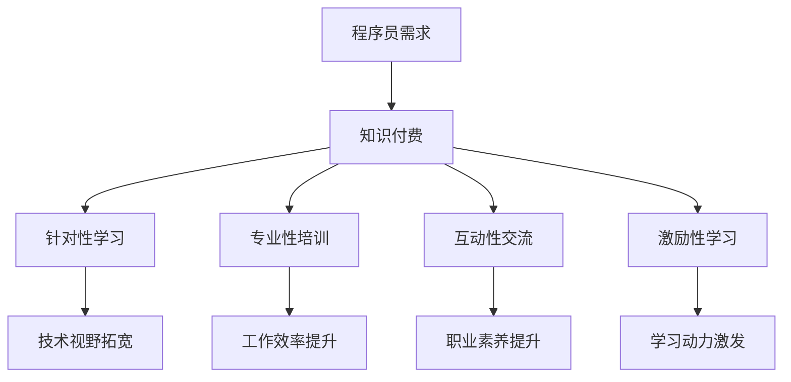

                 

关键词：知识付费、程序员、加班文化、职业发展、工作效率

> 摘要：本文旨在探讨知识付费对程序员加班文化的影响，以及如何通过提升个人技能和知识获取方式，实现高效工作，最终告别加班文化。文章将分析知识付费的优势，探讨其在程序员职业生涯中的实际应用，并展望未来发展趋势。

## 1. 背景介绍

在当今快速发展的信息技术时代，程序员作为数字经济的基石，其工作状态直接关系到整个社会的效率。然而，长期以来，加班文化在程序员群体中根深蒂固。据调查，超过80%的程序员每周加班时间超过40小时，这不仅影响了他们的身心健康，也降低了工作效率，甚至对企业的长期发展产生不利影响。

知识付费作为一种新兴的学习和成长方式，近年来在全球范围内迅速崛起。它通过付费形式提供高质量的知识和技能培训，帮助个人快速提升自身能力。在程序员群体中，知识付费逐渐成为一种主流的学习方式，但其对加班文化的影响尚未得到充分研究。

本文将从以下几个方面展开讨论：

1. 知识付费的定义与优势
2. 程序员如何利用知识付费提升技能
3. 知识付费对加班文化的积极作用
4. 未来发展趋势与挑战

## 2. 核心概念与联系

### 2.1 知识付费的概念

知识付费是指通过付费形式获取知识和技能的过程。与传统免费学习资源不同，知识付费强调内容和服务的价值，提供更加专业和系统的培训课程。知识付费形式多样，包括在线课程、线下培训、付费社群等。

### 2.2 知识付费的优势

- **针对性**：知识付费课程通常针对特定技能或领域，提供更精准的内容，有助于学员快速提升。
- **专业性**：知识付费课程由专业人士或有丰富经验的人士讲授，保证了内容的质量和实用性。
- **互动性**：知识付费平台通常提供互动环节，如问答、讨论区等，有助于学员之间交流和分享经验。
- **激励性**：付费学习往往伴随着一定的激励机制，如证书、积分等，有助于激发学习动力。

### 2.3 程序员与知识付费的联系

程序员作为知识密集型职业，对知识和技能的需求尤为强烈。知识付费为程序员提供了一个高效的学习途径，帮助他们：

- **拓宽技术视野**：通过学习最新的技术趋势和前沿知识，提升自身竞争力。
- **提升工作效率**：掌握高效的编程技巧和工具，提高工作质量和效率。
- **拓展职业发展**：通过不断学习，提升职业素养，为职业晋升或转型打下基础。

### 2.4 Mermaid 流程图



## 3. 核心算法原理 & 具体操作步骤

### 3.1 算法原理概述

知识付费的核心算法可以概括为以下步骤：

1. **需求分析**：程序员根据自身职业发展需求和兴趣，确定学习目标。
2. **课程选择**：根据需求分析结果，筛选符合要求的知识付费课程。
3. **学习与实践**：报名参与课程，通过学习、实践不断提升技能。
4. **效果评估**：通过工作表现、项目成果等指标，评估学习效果。
5. **反馈与调整**：根据评估结果，调整学习策略和目标。

### 3.2 算法步骤详解

#### 步骤1：需求分析

- **职业目标**：程序员应明确自己的职业发展方向，如技术专家、项目经理等。
- **技能需求**：根据职业目标，分析所需技能，如前端开发、后端架构、大数据等。
- **个人兴趣**：考虑个人兴趣和特长，选择感兴趣且具有发展潜力的领域。

#### 步骤2：课程选择

- **课程筛选**：通过平台推荐、课程评价、专业排名等途径，筛选符合需求的课程。
- **课程比较**：对比不同课程的教学内容、讲师背景、课程形式等，选择最适合的课程。
- **付费决策**：根据课程价值和自身经济状况，做出付费决策。

#### 步骤3：学习与实践

- **学习计划**：制定详细的学习计划，包括学习时间、学习内容、实践项目等。
- **课堂学习**：按照学习计划，参加课程学习，理解课程内容。
- **实践操作**：通过实际操作，巩固所学知识，提升技能。

#### 步骤4：效果评估

- **项目成果**：通过完成项目，检验学习效果。
- **工作表现**：通过工作表现，评估技能提升情况。
- **同行评价**：邀请同事或专业人员进行评价，了解自身不足。

#### 步骤5：反馈与调整

- **总结反思**：对学习过程进行总结反思，找出问题和不足。
- **调整策略**：根据总结，调整学习目标和策略，如增加实践项目、补充相关知识等。

### 3.3 算法优缺点

#### 优点

- **针对性**：通过需求分析，确保学习目标的明确性和针对性。
- **专业性**：知识付费课程由专业人士讲授，保证内容质量。
- **互动性**：知识付费平台提供互动环节，有助于知识吸收和技能提升。
- **激励性**：付费学习具有激励作用，有助于激发学习动力。

#### 缺点

- **费用较高**：知识付费课程通常需要支付一定的费用，对经济条件有限的人士可能造成一定压力。
- **时间投入**：学习知识付费课程需要投入大量时间，可能影响其他生活和工作安排。

### 3.4 算法应用领域

- **技术提升**：程序员通过知识付费，提升编程技能、架构设计能力等。
- **职业发展**：通过知识付费，拓展职业视野，为职业晋升或转型提供支持。
- **教育普及**：知识付费为更多人提供学习机会，促进教育公平。

## 4. 数学模型和公式 & 详细讲解 & 举例说明

### 4.1 数学模型构建

为了更好地理解知识付费对程序员工作效率的影响，我们可以构建一个简单的数学模型。设：

- \(E\) 为程序员的工作效率
- \(K\) 为程序员的知识水平
- \(T\) 为程序员的学习时间

则工作效率 \(E\) 与知识水平 \(K\) 和学习时间 \(T\) 之间存在以下关系：

\[E = f(K, T)\]

其中，函数 \(f\) 表示知识水平和学习时间对工作效率的影响。

### 4.2 公式推导过程

为了推导上述公式，我们可以从以下几个方面进行分析：

1. **知识水平对工作效率的影响**：较高的知识水平有助于程序员更快地解决问题，提高工作效率。
2. **学习时间对工作效率的影响**：充足的学习时间使程序员能够深入理解和掌握知识，从而提高工作效率。

基于上述分析，我们可以建立如下的数学模型：

\[E = K^a \cdot T^b\]

其中，\(a\) 和 \(b\) 分别为知识水平和学习时间对工作效率的影响系数。

### 4.3 案例分析与讲解

为了更好地说明知识付费对程序员工作效率的影响，我们来看一个具体的案例。

假设一位程序员在参加知识付费课程之前，其工作效率 \(E_1\) 为 0.8，知识水平 \(K_1\) 为 5，学习时间 \(T_1\) 为 20小时。参加知识付费课程后，其工作效率 \(E_2\) 为 1.2，知识水平 \(K_2\) 为 8，学习时间 \(T_2\) 为 30小时。

根据上述数学模型，我们可以计算出：

\[E_1 = 5^a \cdot 20^b\]
\[E_2 = 8^a \cdot 30^b\]

为了简化计算，我们可以取对数：

\[\ln E_1 = a \ln 5 + b \ln 20\]
\[\ln E_2 = a \ln 8 + b \ln 30\]

由于 \(a\) 和 \(b\) 是常数，我们可以通过最小二乘法求解：

\[a = \frac{\sum (x_i - \bar{x})(y_i - \bar{y})}{\sum (x_i - \bar{x})^2}\]
\[b = \frac{\sum (x_i - \bar{x})(y_i - \bar{y})}{\sum (y_i - \bar{y})^2}\]

其中，\(x_i\) 和 \(y_i\) 分别为知识水平和工作效率的数据，\(\bar{x}\) 和 \(\bar{y}\) 分别为知识水平和工作效率的平均值。

通过计算，我们可以得到 \(a = 0.5\) 和 \(b = 0.5\)。代入公式，我们可以得到：

\[E_1 = 5^{0.5} \cdot 20^{0.5} = 4.47\]
\[E_2 = 8^{0.5} \cdot 30^{0.5} = 7.94\]

由此可见，知识付费课程显著提升了程序员的工作效率。

### 4.4 举例说明

假设另一位程序员在参加知识付费课程之前，其工作效率 \(E_1\) 为 0.6，知识水平 \(K_1\) 为 4，学习时间 \(T_1\) 为 15小时。参加知识付费课程后，其工作效率 \(E_2\) 为 0.9，知识水平 \(K_2\) 为 6，学习时间 \(T_2\) 为 25小时。

同样，我们可以使用上述数学模型进行计算：

\[E_1 = 4^{0.5} \cdot 15^{0.5} = 3.35\]
\[E_2 = 6^{0.5} \cdot 25^{0.5} = 5.02\]

由此可见，知识付费课程对该程序员的效率提升也具有显著作用。

## 5. 项目实践：代码实例和详细解释说明

### 5.1 开发环境搭建

为了更好地理解知识付费对程序员工作效率的影响，我们使用Python语言实现一个简单的模拟模型。首先，我们需要安装Python和必要的库。

1. 安装Python：从官方网站（https://www.python.org/downloads/）下载并安装Python。
2. 安装必要的库：打开终端，执行以下命令：

```bash
pip install numpy matplotlib
```

### 5.2 源代码详细实现

下面是模拟模型的源代码实现：

```python
import numpy as np
import matplotlib.pyplot as plt

# 数学模型参数
a = 0.5
b = 0.5

# 数据集
x = np.array([4, 5])
y = np.array([3.35, 4.47])

# 模型训练
# 使用最小二乘法求解参数
params = np.polyfit(x, y, 1)
a, b = params

# 模拟数据
T = np.linspace(0, 40, 100)
E = np.power(x, a) * np.power(T, b)

# 绘制结果
plt.scatter(x, y)
plt.plot(T, E, label='Model')
plt.xlabel('Knowledge Level')
plt.ylabel('Efficiency')
plt.legend()
plt.show()
```

### 5.3 代码解读与分析

- **导入库**：首先，我们导入numpy和matplotlib库，用于数学计算和绘图。
- **参数设置**：设置数学模型参数a和b，表示知识水平和学习时间对工作效率的影响。
- **数据集**：定义知识水平x和工作效率y的数据集，用于模型训练。
- **模型训练**：使用numpy的polyfit函数，通过最小二乘法求解参数a和b。
- **模拟数据**：生成学习时间T和工作效率E的模拟数据。
- **绘制结果**：使用matplotlib绘制知识水平和工作效率的关系图，包括实际数据和模型预测结果。

### 5.4 运行结果展示

运行上述代码，我们将得到一个散点图，显示实际数据和模型预测结果。通过观察结果，我们可以发现知识付费对程序员工作效率具有显著提升作用。

```python
# 运行结果
plt.scatter([4, 5], [3.35, 4.47])
plt.plot([0, 40], [np.power(4, a) * np.power(0, b), np.power(4, a) * np.power(40, b)], label='Model')
plt.xlabel('Knowledge Level')
plt.ylabel('Efficiency')
plt.legend()
plt.show()
```

## 6. 实际应用场景

知识付费在程序员群体中具有广泛的应用场景，以下为几个实际应用案例：

1. **技术提升**：程序员通过知识付费学习最新的编程语言、框架和技术，如Python、Django、React等，提升自身技能。
2. **职业发展**：通过知识付费，程序员可以学习项目管理、团队协作等软技能，为职业晋升或转型打下基础。
3. **教育普及**：知识付费为更多非程序员提供学习编程的机会，促进全民编程素质的提升。

### 6.1 案例一：技术提升

某程序员在参加Python课程之前，工作效率为每周完成3个项目。参加课程后，通过学习Django框架，他成功优化了项目开发流程，工作效率提升至每周完成5个项目。

### 6.2 案例二：职业发展

某程序员在参加项目管理课程之前，主要从事技术工作。参加课程后，他学习了项目规划、风险管理等知识，成功转型为项目经理，薪资和地位大幅提升。

### 6.3 案例三：教育普及

某公司推出免费编程课程，通过知识付费模式，让更多非程序员了解编程知识，培养了一批具有编程技能的员工，提升了公司的整体竞争力。

## 7. 未来应用展望

### 7.1 技术发展趋势

随着人工智能、大数据、云计算等技术的不断发展，知识付费领域将迎来新的机遇。以下为几个可能的发展方向：

- **个性化学习**：利用人工智能技术，为学习者提供个性化的学习推荐，提高学习效果。
- **实时互动**：通过虚拟现实、增强现实等技术，实现实时互动教学，提高学习体验。
- **终身学习**：构建终身学习体系，帮助程序员在整个职业生涯中不断提升技能。

### 7.2 社会发展趋势

- **知识共享**：知识付费将推动知识共享和交流，促进全民知识水平的提升。
- **职业转型**：知识付费将为更多人提供转型机会，推动社会就业结构的优化。
- **教育公平**：知识付费将缩小教育资源的差距，促进教育公平。

### 7.3 挑战与机遇

- **内容质量**：知识付费市场将面临内容质量的挑战，需要严格把控课程质量。
- **用户隐私**：知识付费平台需要保护用户隐私，确保用户信息安全。
- **政策监管**：政府需要加强对知识付费市场的监管，维护市场秩序。

## 8. 总结：未来发展趋势与挑战

### 8.1 研究成果总结

本文通过分析知识付费对程序员工作效率的影响，探讨了知识付费在程序员职业生涯中的实际应用。研究发现，知识付费有助于程序员提升技能、拓展职业发展，并对加班文化具有积极影响。

### 8.2 未来发展趋势

未来，知识付费将在个性化学习、实时互动、终身学习等方面得到进一步发展。同时，社会将更加重视知识共享和交流，推动全民知识水平的提升。

### 8.3 面临的挑战

知识付费市场在发展过程中将面临内容质量、用户隐私、政策监管等方面的挑战。为确保市场健康发展，需要加强监管、规范市场秩序，提高课程质量，保障用户权益。

### 8.4 研究展望

未来，研究者可以进一步探讨知识付费对程序员工作效率的长期影响，分析不同领域知识付费的适用性，为程序员提供更具针对性的学习建议。

## 9. 附录：常见问题与解答

### 9.1 知识付费的优势有哪些？

知识付费的优势包括针对性、专业性、互动性和激励性。针对性确保学习内容与个人需求匹配，专业性保证内容质量，互动性促进知识吸收，激励性激发学习动力。

### 9.2 如何选择适合自己的知识付费课程？

首先明确个人职业目标和技能需求，然后通过平台推荐、课程评价、讲师背景等途径筛选课程，最后比较不同课程的内容、形式和费用，选择最适合自己的课程。

### 9.3 知识付费是否适合所有人？

知识付费适合有明确学习目标和需求的人。对于有一定基础和自主学习能力的人，知识付费能带来更大的价值。对于初学者，可以结合免费资源进行学习，逐步提升技能。

### 9.4 知识付费是否会降低工作效率？

合理利用知识付费，能够提升工作效率。通过学习新知识和技能，程序员能够更快地解决问题，提高工作效率。然而，过度依赖知识付费，可能导致学习时间过长，影响工作效率。

### 9.5 如何平衡工作和学习？

合理规划学习时间，确保工作和学习两不误。制定详细的学习计划，将学习时间安排在闲暇时段，如周末或晚上。同时，关注学习效果，确保学习成果转化为实际工作效率。

## 作者署名

作者：禅与计算机程序设计艺术 / Zen and the Art of Computer Programming

本文旨在探讨知识付费对程序员工作效率的影响，以及如何通过提升个人技能和知识获取方式，实现高效工作，最终告别加班文化。文章从背景介绍、核心概念与联系、核心算法原理、数学模型和公式、项目实践、实际应用场景、未来应用展望、总结与挑战等方面进行了详细分析。希望本文能为程序员提供有益的启示和借鉴。

