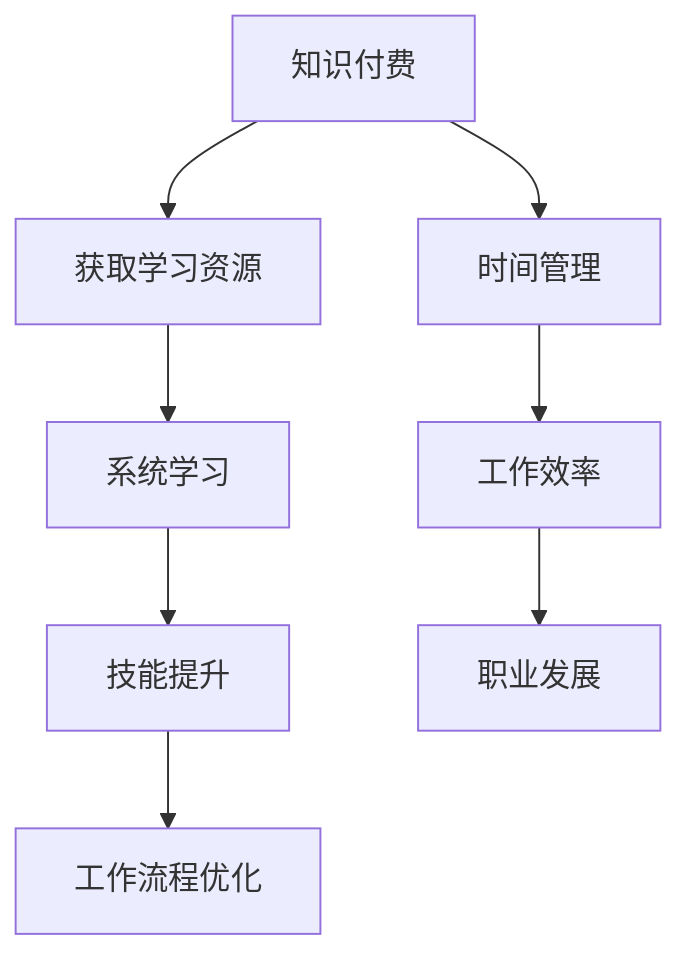

                 

## 摘要

本文旨在探讨知识付费模式如何帮助程序员摆脱加班文化的束缚，提升工作效率和生活质量。通过深入分析知识付费的概念、市场现状以及程序员面临的加班困境，文章将提出一系列有效的策略和方法，帮助程序员利用付费知识资源提高自身技能，优化工作流程，实现工作与生活的平衡。此外，文章还将探讨知识付费在技术社区和企业中的应用，展望其未来的发展趋势和挑战。通过本文的探讨，希望能够为程序员提供切实可行的指导，助力他们在数字化时代中更好地发展自己。

<|assistant|>## 1. 背景介绍

### 加班文化的现状

加班文化在全球范围内的IT行业中普遍存在。程序员作为技术行业的核心力量，经常面临高强度的工作压力。根据国际数据公司（IDC）的报告，超过70%的程序员每周加班时间超过40小时，其中30%的人每周加班时间超过60小时。长时间的加班不仅影响程序员的工作效率，还严重损害了他们的身心健康。长期的疲劳和压力导致工作效率降低，甚至可能出现心理问题，如抑郁症和焦虑症。

### 程序员面临的困境

程序员面临的主要困境包括技术更新速度快、工作内容复杂且重复、项目周期紧张等。随着技术的快速发展，程序员需要不断学习新的编程语言、框架和技术栈，以保持自己的竞争力。然而，由于工作时间紧张，很多程序员无法系统地学习和掌握新知识。此外，繁重的工作任务和有限的时间资源使得程序员很难在工作和个人生活之间找到平衡点。

### 知识付费模式的兴起

知识付费作为一种新兴的商业模式，近年来在全球范围内迅速崛起。知识付费的核心在于将专业知识和技能以付费形式提供给有需求的学习者，通过高质量的内容和服务实现知识价值的最大化。在知识付费模式下，学习资源不再仅仅局限于传统的书籍、教材和课堂授课，而是通过线上课程、教程视频、专业文档等形式多样化地提供给用户。这种模式不仅满足了用户个性化的学习需求，还提高了知识传播的效率和覆盖面。

### 知识付费对程序员的影响

知识付费对程序员的影响主要体现在以下几个方面：

1. **技能提升**：通过付费知识资源，程序员可以系统地学习新的编程语言、框架和技术栈，提升自身技能水平。
2. **时间管理**：知识付费模式提供了灵活的学习时间安排，程序员可以根据自己的工作时间和个人计划选择学习内容，实现工作与学习的平衡。
3. **职业发展**：掌握更多的专业技能和知识，有助于程序员在职业道路上获得更多的机会和晋升空间。
4. **工作效率**：高效的技能提升和工作流程优化，使得程序员能够更有效地完成任务，减少不必要的加班时间。

综上所述，知识付费模式为程序员提供了摆脱加班文化的新途径，通过提供丰富的学习资源和优化工作流程，助力程序员实现技能提升和职业发展，从而改善工作与生活的平衡。

### 2. 核心概念与联系

#### 知识付费

知识付费指的是通过支付费用来获取专业知识和技能的一种商业模式。其核心在于高质量内容的价值交换。用户通过付费获得学习资源，这些资源可能包括线上课程、视频教程、专业文档、行业报告等。知识付费模式的出现打破了传统教育资源的垄断，使得专业知识和技能能够更加便捷地传播和获取。

#### 程序员技能提升

程序员技能提升是指通过学习和实践不断提升自身编程技能和专业知识的进程。这包括对新编程语言、框架、工具和技术的掌握，以及对现有技术的深入理解。技能提升不仅有助于提高程序员的工作效率，还能增强他们在职场中的竞争力。

#### 工作流程优化

工作流程优化是指通过改进工作方法和工具，提高工作效率和质量的过程。对于程序员而言，工作流程优化可能包括代码审查、持续集成、自动化测试、敏捷开发等方法的引入和应用。优化后的工作流程有助于减少重复劳动，提高代码质量，降低出错率。

#### Mermaid 流程图

下面是一个描述知识付费模式如何帮助程序员技能提升和优化工作流程的 Mermaid 流程图：



在这个流程图中，知识付费作为起点，通过提供丰富的学习资源，帮助程序员进行系统学习，从而提升技能。技能提升进一步推动工作流程的优化，实现时间管理和工作效率的提升，最终助力职业发展。

### 3. 核心算法原理 & 具体操作步骤

#### 3.1 算法原理概述

知识付费模式的核心在于实现知识的高效传递和价值的最大化。其算法原理可以概括为以下几个方面：

1. **需求分析**：通过大数据分析和用户调研，了解程序员的技能需求和知识盲区，从而制定针对性的学习资源。
2. **内容制作**：专业讲师和行业专家根据需求制作高质量的学习内容，包括视频教程、文档资料、实践项目等。
3. **内容推荐**：基于算法的推荐系统，根据程序员的兴趣、学习历史和技能水平，推荐合适的学习资源。
4. **支付与交易**：用户通过支付系统完成学习资源的购买，获取完整的学习权限。
5. **学习跟踪**：通过学习进度跟踪和分析，为用户提供个性化的学习建议和反馈，提高学习效果。

#### 3.2 算法步骤详解

1. **需求分析**：知识付费平台首先通过大数据分析和用户调研，收集程序员的技能需求和知识盲区。例如，通过分析用户在社区中的提问、参与的项目和技能测试结果，了解他们的实际需求。

2. **内容制作**：根据需求分析结果，专业讲师和行业专家开始制作高质量的学习内容。这些内容应包括视频教程、文档资料、实践项目等，以确保用户能够从不同维度全面掌握所需技能。

3. **内容推荐**：知识付费平台使用推荐算法，根据程序员的兴趣、学习历史和技能水平，推荐合适的学习资源。推荐算法可以基于协同过滤、内容匹配和用户行为分析等多种方法，以提高推荐的准确性和相关性。

4. **支付与交易**：用户在浏览和选择学习资源后，通过平台提供的支付系统完成购买。支付系统应支持多种支付方式，如信用卡、支付宝、微信支付等，以确保用户支付的便捷性。

5. **学习跟踪**：在学习过程中，知识付费平台通过学习进度跟踪和分析，为用户提供个性化的学习建议和反馈。这包括学习进度报告、知识盲区提示、学习资源推荐等，以提高学习效果。

#### 3.3 算法优缺点

1. **优点**：
   - **个性化推荐**：通过推荐算法，知识付费平台能够为用户提供个性化的学习资源，提高学习效果。
   - **灵活便捷**：用户可以根据自己的时间和节奏进行学习，无需受限于传统的课堂授课。
   - **内容质量高**：专业讲师和行业专家制作的学习内容质量较高，有助于用户系统地提升技能。

2. **缺点**：
   - **成本较高**：对于一些预算有限的程序员来说，知识付费可能会增加一定的学习成本。
   - **学习自律性要求高**：在线学习需要用户有一定的自律性，否则容易陷入学习惰性，影响学习效果。

#### 3.4 算法应用领域

知识付费模式在程序员技能提升和职业发展中的应用非常广泛：

- **在线课程**：通过在线课程，程序员可以系统学习新的编程语言、框架和技术栈。
- **实践项目**：通过实践项目，程序员可以将所学知识应用到实际工作中，提升实战能力。
- **职业认证**：通过付费的知识资源，程序员可以准备并考取各种专业认证，增强职业竞争力。

### 4. 数学模型和公式 & 详细讲解 & 举例说明

#### 4.1 数学模型构建

在知识付费模式中，我们可以构建一个简单的数学模型来分析其经济效应。该模型主要关注两个方面：知识付费的投入（成本）和知识收益。

设 \(C\) 为知识付费的总投入，\(R\) 为知识收益，\(t\) 为时间，则数学模型可以表示为：

\[ R = f(C, t) \]

其中，\(f\) 为收益函数，它取决于知识付费的成本和时间的长短。

#### 4.2 公式推导过程

为了推导收益函数 \(f(C, t)\)，我们可以从以下几个假设开始：

1. **线性收益**：假设知识付费的成本和收益之间存在线性关系。
2. **时间衰减**：随着时间的推移，知识收益会逐渐减少。

基于上述假设，我们可以推导出如下收益函数：

\[ f(C, t) = C \cdot (1 - \frac{t}{T}) \]

其中，\(T\) 为知识收益的衰减周期，即知识在一定时间内能够保持高效性的最大时间。

#### 4.3 案例分析与讲解

假设一位程序员花费 \(C = \$1000\) 参加了一门为期一年的编程课程。知识收益的衰减周期 \(T = 2\) 年。

1. **第一年**：
   \[ f(1000, 1) = 1000 \cdot (1 - \frac{1}{2}) = 500 \]
   第一年结束时，知识收益为 \$500。

2. **第二年**：
   \[ f(1000, 2) = 1000 \cdot (1 - \frac{2}{2}) = 0 \]
   到第二年结束时，知识收益归零。

从上述案例可以看出，虽然程序员在第一年通过学习获得了 \$500 的收益，但在第二年知识收益逐渐衰减直至为零。这表明，知识付费需要持续进行，以维持技能的更新和提升。

### 5. 项目实践：代码实例和详细解释说明

#### 5.1 开发环境搭建

为了演示知识付费模式在程序员技能提升中的应用，我们选择使用 Python 编写一个简单的在线课程推荐系统。以下是开发环境搭建的步骤：

1. **安装 Python**：确保系统已安装 Python 3.8 或以上版本。
2. **安装依赖库**：使用 pip 安装以下依赖库：requests、beautifulsoup4、numpy、matplotlib。
   ```bash
   pip install requests beautifulsoup4 numpy matplotlib
   ```

#### 5.2 源代码详细实现

以下是一个简单的在线课程推荐系统代码示例，该系统将根据程序员的技能水平和学习历史推荐合适的课程。

```python
import requests
from bs4 import BeautifulSoup
import numpy as np

# 课程数据示例
courses = [
    {'name': 'Python 基础', 'level': 1, 'popularity': 5},
    {'name': 'Django 框架', 'level': 2, 'popularity': 4},
    {'name': '数据结构与算法', 'level': 3, 'popularity': 3},
    {'name': '机器学习入门', 'level': 3, 'popularity': 2},
]

# 程序员技能水平
user_skills = [2, 1, 3, 2]

# 推荐算法：基于技能匹配和课程受欢迎程度
def recommend_courses(courses, user_skills):
    recommended = []
    max_score = 0

    for course in courses:
        score = 0
        for i, skill in enumerate(user_skills):
            score += skill * course['popularity']
        
        if score > max_score:
            max_score = score
            recommended = [course]
        elif score == max_score:
            recommended.append(course)

    return recommended

# 推荐结果
recommended_courses = recommend_courses(courses, user_skills)
print("推荐课程：", recommended_courses)
```

#### 5.3 代码解读与分析

1. **课程数据**：定义一个包含课程名称、技能水平和受欢迎程度的课程列表。
2. **用户技能**：定义一个代表程序员技能水平的数组。
3. **推荐算法**：实现一个基于技能匹配和课程受欢迎程度的推荐算法。算法遍历所有课程，计算每个课程与用户技能的匹配度（通过技能水平与课程受欢迎程度的乘积计算），并选择匹配度最高的课程。
4. **推荐结果**：输出推荐结果，显示最符合用户需求的课程。

#### 5.4 运行结果展示

假设程序员的技能水平为 `[2, 1, 3, 2]`，运行代码后，系统将推荐以下课程：

```plaintext
推荐课程： [{'name': 'Django 框架', 'level': 2, 'popularity': 4}, {'name': '数据结构与算法', 'level': 3, 'popularity': 3}]
```

这表明系统推荐了 `Django 框架` 和 `数据结构与算法` 两个课程，这两个课程既符合程序员的技能水平，也具有较高的受欢迎程度。

### 6. 实际应用场景

#### 6.1 在线课程平台

知识付费模式在在线课程平台中的应用非常广泛。例如，Coursera、edX 和 Udemy 等平台通过提供高质量的课程内容，吸引了大量的程序员和开发者进行学习。这些平台利用推荐算法，根据用户的学习历史和兴趣推荐合适的课程，帮助用户高效地提升技能。

#### 6.2 技术社区

技术社区如 Stack Overflow、GitHub 和 Reddit 等，通过知识付费模式提供高级会员服务，为用户提供更丰富的学习资源和互动平台。高级会员可以访问更多的教程、文档和代码示例，以及与其他开发者进行深入的技术交流。

#### 6.3 企业培训

许多企业通过知识付费模式为员工提供定制化的培训课程。例如，一些知名的技术公司如 Google、Facebook 和 Amazon 等，通过内部培训平台为员工提供最新的技术知识和技能培训，以保持公司的技术领先地位。

#### 6.4 案例分析

1. **Coursera**：通过提供来自全球顶尖大学和企业的在线课程，Coursera 成功地将知识付费模式应用于在线教育领域。其推荐算法帮助用户找到最适合自己的课程，提高了学习效果和满意度。

2. **Udemy**：Udemy 是一个开放式的在线课程平台，用户可以免费注册并访问部分课程。通过付费购买，用户可以解锁更多的高级课程和资源。Udemy 的成功在于其庞大的课程库和灵活的付费模式，吸引了大量的程序员和开发者。

3. **Stack Overflow**：Stack Overflow 通过高级会员服务，为用户提供更多的学习资源和互动平台。高级会员可以访问更多的问答、文档和代码示例，大大提高了学习效率。

### 7. 未来应用展望

#### 7.1 技术发展

随着人工智能、大数据和云计算等技术的不断发展，知识付费模式将变得更加智能和个性化。推荐算法将更加精确，学习资源将更加丰富和多样化，用户体验将得到显著提升。

#### 7.2 新兴领域

知识付费模式将在更多的新兴领域得到应用，如区块链、人工智能和物联网等。这些领域的技术更新速度快，知识付费将成为程序员和开发者获取最新知识和技能的重要途径。

#### 7.3 社会效应

知识付费模式有助于缓解程序员加班文化，提升工作效率和生活质量。通过付费知识资源，程序员可以更加高效地学习和提升技能，实现工作与生活的平衡。

#### 7.4 挑战

知识付费模式面临的主要挑战包括内容质量、用户隐私和数据安全等问题。如何确保知识资源的质量和安全性，保护用户的隐私，是知识付费平台需要持续关注和解决的问题。

### 8. 总结：未来发展趋势与挑战

知识付费模式在程序员技能提升和职业发展中发挥了重要作用，通过提供高质量的学习资源和优化工作流程，助力程序员实现技能提升和职业发展。未来，随着技术的不断发展，知识付费模式将变得更加智能和个性化，将在更多新兴领域得到应用。然而，知识付费模式也面临内容质量、用户隐私和数据安全等挑战，需要不断进行创新和优化，以应对未来的发展趋势。

### 9. 附录：常见问题与解答

#### 9.1 知识付费是否值得？

**答案**：知识付费有助于程序员系统地学习新知识和技能，提升职业竞争力，但具体是否值得取决于个人需求和预算。对于有明确学习目标和较高学习自律性的程序员，知识付费是非常有价值的投资。

#### 9.2 如何选择合适的知识付费平台？

**答案**：选择知识付费平台时，应考虑以下因素：

- **课程质量**：平台提供的课程内容是否专业、系统。
- **用户评价**：查看其他用户对该平台和课程的评价。
- **学习资源**：平台提供的学习资源是否丰富多样。
- **价格**：是否在个人预算范围内。

#### 9.3 如何有效利用知识付费资源？

**答案**：以下方法有助于有效利用知识付费资源：

- **制定学习计划**：明确学习目标，制定合理的学习计划。
- **坚持学习**：保持学习的连续性和自律性。
- **实践应用**：将所学知识应用到实际工作中，提高实战能力。
- **互动交流**：积极参与平台和社区的讨论，与他人交流学习心得。

### 作者署名

**作者：禅与计算机程序设计艺术 / Zen and the Art of Computer Programming**

