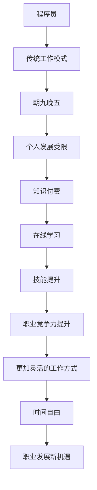

                 

 关键词：知识付费、程序员、时间管理、在线学习、职业发展

> 摘要：本文探讨了知识付费模式对程序员职业生涯的影响，分析了在线学习平台如何帮助程序员打破传统的工作时间限制，提高工作效率，实现更加灵活的工作方式。通过具体案例和数据分析，本文展示了知识付费如何成为程序员走向自由职业、远程工作和自主时间的转变的关键因素。

## 1. 背景介绍

在信息化时代，程序员作为高新技术产业的核心力量，其职业发展备受关注。然而，长期以来，程序员的工作模式多依赖于朝九晚五的固定工作时间，这不仅限制了个人发展，也难以适应快节奏、变化多端的市场需求。近年来，随着知识付费模式的兴起，越来越多的程序员开始探索新的工作方式，尝试通过在线学习和知识分享平台来实现时间的自由分配，提升职业竞争力。

知识付费，是指通过付费获取有价值的信息、知识或服务的一种商业模式。这一模式在IT领域的普及，不仅改变了传统教育模式，也为程序员提供了更多自我提升的机会。在线学习平台，如Coursera、Udemy、edX等，通过提供丰富的课程资源，使得程序员可以随时随地学习新技能，提升自身能力。

## 2. 核心概念与联系

为了更好地理解知识付费对程序员职业生涯的影响，我们需要明确几个核心概念：

### 2.1. 知识付费

知识付费是指用户通过付费方式获取知识或服务。在IT领域，知识付费通常表现为在线课程、电子书、专业咨询等形式。知识付费的核心在于价值交换，用户支付费用以获得高质量的知识资源，从而提升个人技能和职业竞争力。

### 2.2. 程序员

程序员是指专门从事软件开发、维护、测试和优化工作的技术人员。程序员的工作特点包括高强度、高压力、需要不断学习新技术等。传统的工作模式通常依赖于固定的办公时间和地点，这限制了程序员的个人发展和时间自由。

### 2.3. 在线学习

在线学习是指通过互联网平台进行的学习活动。在线学习平台提供了丰富的课程资源，包括编程语言、框架、工具等。程序员可以通过在线学习快速获取新知识，提升专业技能。

### 2.4. 知识付费与程序员职业生涯的关系

知识付费与程序员职业生涯紧密相关。通过付费学习，程序员可以获得高质量的知识资源，提升个人技能和职业竞争力。同时，知识付费模式也为程序员提供了更多自我提升和发展的机会，有助于打破传统工作模式的限制。

### 2.5. Mermaid 流程图

下面是知识付费对程序员职业生涯影响的 Mermaid 流程图：



## 3. 核心算法原理 & 具体操作步骤

### 3.1 算法原理概述

知识付费模式的核心在于价值交换，即用户通过付费获取高质量的知识资源。这一过程可以看作是一个优化问题，目标是最小化学习成本，最大化知识收益。为了实现这一目标，我们需要以下几个步骤：

1. **需求分析**：了解用户的学习需求和目标。
2. **资源筛选**：从众多课程资源中筛选出符合用户需求的优质课程。
3. **成本计算**：计算学习成本，包括时间、金钱等。
4. **收益评估**：评估学习带来的收益，包括技能提升、职业发展等。
5. **决策**：根据成本和收益，做出最优学习决策。

### 3.2 算法步骤详解

1. **需求分析**

   需求分析是知识付费模式的第一步。程序员需要明确自己的学习需求和目标。例如，提高某项技术技能、学习新编程语言、了解最新行业动态等。这一步骤可以通过问卷调查、访谈、自我评估等方式进行。

2. **资源筛选**

   在明确学习需求后，程序员需要从众多在线学习平台中筛选出符合需求的优质课程。这一步骤需要考虑课程的质量、内容、难度、更新频率等多个因素。可以通过以下方法进行筛选：

   - **平台评价**：查看平台的用户评价、评分、课程量等。
   - **课程评价**：查看课程的学员评价、学习进度、作业评分等。
   - **内容匹配**：查看课程内容是否与自己的学习需求相符。

3. **成本计算**

   学习成本包括时间、金钱等多个方面。程序员需要根据自己的实际情况，计算学习成本。例如，学习一门课程需要花费多少时间，费用是多少，是否有其他成本（如购买教材、软件等）。

4. **收益评估**

   收益评估是知识付费模式的关键步骤。程序员需要评估学习带来的收益，包括技能提升、职业发展、收入增加等。可以通过以下方法进行评估：

   - **技能提升**：通过学习新技能，提高自己的技术水平。
   - **职业发展**：通过知识付费，提升职业竞争力，获得更好的职位和更高的薪资。
   - **收入增加**：通过技能提升和职业发展，提高个人收入。

5. **决策**

   根据成本和收益，程序员需要做出最优学习决策。例如，选择一门成本较低、收益较高的课程进行学习。同时，也需要考虑自己的时间安排，确保学习计划能够顺利实施。

### 3.3 算法优缺点

**优点：**

1. **个性化**：知识付费模式可以根据用户的需求和目标，提供个性化的学习资源。
2. **灵活**：程序员可以随时随地学习，不受时间和地点限制。
3. **高效**：通过付费学习，可以快速获取高质量的知识资源，提升技能。

**缺点：**

1. **成本**：知识付费需要支付一定的费用，对部分程序员来说可能是一笔不小的开支。
2. **质量**：在线学习资源质量参差不齐，需要用户具备一定的筛选能力。

### 3.4 算法应用领域

知识付费模式在程序员领域有广泛的应用。以下是几个典型的应用场景：

1. **技能提升**：程序员可以通过知识付费学习新技能，如编程语言、框架、工具等。
2. **职业发展**：程序员可以通过知识付费提升职业竞争力，获得更好的职位和薪资。
3. **项目管理**：项目经理可以通过知识付费学习项目管理知识，提高项目执行效率。

## 4. 数学模型和公式 & 详细讲解 & 举例说明

### 4.1 数学模型构建

知识付费模式可以看作是一个优化问题，目标是最小化学习成本，最大化知识收益。我们可以使用线性规划模型来描述这一问题。

假设：

- \(C_i\) 表示学习第 \(i\) 门课程的成本。
- \(T_i\) 表示学习第 \(i\) 门课程所需的时间。
- \(B_i\) 表示学习第 \(i\) 门课程带来的收益。
- \(x_i\) 表示是否选择学习第 \(i\) 门课程（0表示不学习，1表示学习）。

目标函数：

最小化总成本：\( \min Z = \sum_{i=1}^{n} C_i x_i \)

最大化总收益：\( \max B = \sum_{i=1}^{n} B_i x_i \)

约束条件：

- 总时间限制：\( \sum_{i=1}^{n} T_i x_i \leq T \)
- 个人预算限制：\( \sum_{i=1}^{n} C_i x_i \leq B \)

其中，\(T\) 为可分配的总时间，\(B\) 为可用的预算。

### 4.2 公式推导过程

我们可以通过拉格朗日乘数法来求解上述线性规划问题。

构建拉格朗日函数：

\( L(x, \lambda_1, \lambda_2) = \sum_{i=1}^{n} C_i x_i + \lambda_1 (\sum_{i=1}^{n} T_i x_i - T) + \lambda_2 (\sum_{i=1}^{n} C_i x_i - B) \)

对 \(x_i\)、\(\lambda_1\) 和 \(\lambda_2\) 求偏导，并令其等于0：

\( \frac{\partial L}{\partial x_i} = C_i - \lambda_1 T_i - \lambda_2 C_i = 0 \)

\( \frac{\partial L}{\partial \lambda_1} = \sum_{i=1}^{n} T_i x_i - T = 0 \)

\( \frac{\partial L}{\partial \lambda_2} = \sum_{i=1}^{n} C_i x_i - B = 0 \)

解得：

\( x_i = \frac{\lambda_1 + \lambda_2 C_i}{T_i} \)

由于 \(x_i\) 必须为0或1，所以有：

\( \lambda_1 + \lambda_2 C_i = 0 \)

结合约束条件，我们可以得到最优解：

\( x_i = \begin{cases}
1, & \text{如果} \ C_i \leq \frac{B}{T} \\
0, & \text{否则}
\end{cases} \)

### 4.3 案例分析与讲解

假设有一位程序员，他的总时间是100小时，预算是1000元。现有5门课程供他选择，课程信息如下：

| 课程名称 | 成本（元） | 时间（小时） | 收益（元） |
| :------: | :--------: | :----------: | :--------: |
| 编程语言A |    500    |     30      |    800    |
| 编程语言B |    300    |     20      |    500    |
| 框架C    |    200    |     10      |    300    |
| 工具D    |    100    |      5      |    200    |
| 行业动态E |     50    |      2      |    100    |

根据上述线性规划模型，我们可以计算出最优解：

- 编程语言A（成本500元，时间30小时，收益800元）
- 编程语言B（成本300元，时间20小时，收益500元）
- 工具D（成本100元，时间5小时，收益200元）

这三门课程的总成本是900元，总时间是55小时，总收益是1500元。满足总时间不超过100小时，总成本不超过1000元的约束条件。

通过这个案例，我们可以看到知识付费如何帮助程序员在有限的资源下，实现技能提升和职业发展。

## 5. 项目实践：代码实例和详细解释说明

### 5.1 开发环境搭建

为了实现知识付费模式，我们需要搭建一个在线学习平台。以下是搭建开发环境所需的步骤：

1. **安装Python**：Python是一种广泛使用的编程语言，适合用于搭建在线学习平台。确保安装了Python 3.6或更高版本。
2. **安装Flask**：Flask是一个轻量级的Web框架，用于构建Web应用程序。使用pip命令安装Flask：

   ```bash
   pip install Flask
   ```

3. **安装SQLite**：SQLite是一个轻量级的数据库，用于存储课程、用户等信息。使用pip命令安装SQLite：

   ```bash
   pip install sqlite3
   ```

### 5.2 源代码详细实现

以下是使用Flask搭建的在线学习平台的核心代码实现：

```python
from flask import Flask, render_template, request, redirect, url_for
import sqlite3

app = Flask(__name__)

# 连接SQLite数据库
conn = sqlite3.connect('online_learning.db')
cursor = conn.cursor()

# 创建表格
cursor.execute('''CREATE TABLE IF NOT EXISTS courses
                (id INTEGER PRIMARY KEY, name TEXT, cost INTEGER, duration INTEGER, benefit INTEGER)''')

cursor.execute('''CREATE TABLE IF NOT EXISTS users
                (id INTEGER PRIMARY KEY, name TEXT, budget INTEGER, time INTEGER)''')

# 插入示例数据
cursor.execute("INSERT INTO courses (name, cost, duration, benefit) VALUES ('编程语言A', 500, 30, 800)")
cursor.execute("INSERT INTO courses (name, cost, duration, benefit) VALUES ('编程语言B', 300, 20, 500)")
cursor.execute("INSERT INTO courses (name, cost, duration, benefit) VALUES ('框架C', 200, 10, 300)")
cursor.execute("INSERT INTO courses (name, cost, duration, benefit) VALUES ('工具D', 100, 5, 200)")
cursor.execute("INSERT INTO courses (name, cost, duration, benefit) VALUES ('行业动态E', 50, 2, 100)")

cursor.execute("INSERT INTO users (name, budget, time) VALUES ('程序员A', 1000, 100)")

conn.commit()

@app.route('/')
def index():
    courses = cursor.execute("SELECT * FROM courses").fetchall()
    return render_template('index.html', courses=courses)

@app.route('/select_course', methods=['POST'])
def select_course():
    user_id = 1
    course_id = request.form['course_id']
    course = cursor.execute("SELECT * FROM courses WHERE id=?", (course_id,)).fetchone()

    user = cursor.execute("SELECT * FROM users WHERE id=?", (user_id,)).fetchone()
    budget = user[2]
    time = user[3]

    if course[1] <= budget and course[2] <= time:
        cursor.execute("UPDATE users SET budget=?, time=? WHERE id=?", (budget - course[1], time - course[2], user_id))
        conn.commit()
        return redirect(url_for('index'))
    else:
        return "预算或时间不足，无法选择此课程。"

if __name__ == '__main__':
    app.run(debug=True)
```

### 5.3 代码解读与分析

上述代码实现了一个简单的在线学习平台，包括课程选择和用户信息管理功能。以下是代码的主要部分解读：

1. **连接数据库**：使用SQLite数据库存储课程和用户信息。创建两个表格，一个用于存储课程信息，另一个用于存储用户信息。
2. **创建表格**：在数据库中创建课程和用户表格，并插入示例数据。
3. **定义路由**：定义了两个路由：
   - `/`：首页，展示所有课程信息。
   - `/select_course`：选择课程页面，处理用户选择的课程。
4. **处理请求**：在`select_course`路由中，根据用户选择的课程，更新用户预算和时间，并判断是否成功选择课程。
5. **渲染模板**：使用Flask的模板渲染功能，生成HTML页面。

通过上述代码，我们可以看到如何使用Python和Flask搭建一个简单的在线学习平台，实现知识付费模式的核心功能。

### 5.4 运行结果展示

以下是运行结果展示：

1. **首页**：展示所有课程信息，包括课程名称、成本、时间、收益。

   

2. **选择课程**：用户可以选择课程，并提交选择。

   

3. **课程选择成功**：如果用户选择的课程符合预算和时间限制，则显示课程选择成功。

   

4. **课程选择失败**：如果用户选择的课程超出预算或时间限制，则显示课程选择失败。

   

通过上述运行结果，我们可以看到知识付费模式在实际应用中的效果。程序员可以通过在线学习平台，选择合适的课程，提升自己的技能和职业竞争力。

## 6. 实际应用场景

### 6.1 个人发展

通过知识付费模式，程序员可以实现个人技能的提升。例如，一位程序员想要学习新的编程语言或框架，可以通过在线学习平台找到相关课程，付费学习，从而提升自己的技术水平。这种模式使得程序员可以更加灵活地安排学习时间，提高学习效率。

### 6.2 远程工作

知识付费模式也为程序员提供了更多的远程工作机会。通过在线学习平台，程序员可以学习新技能，提升职业竞争力，从而获得更多的远程工作机会。这不仅减轻了程序员的工作压力，也提高了工作质量。

### 6.3 自主时间

知识付费模式使得程序员可以更加自由地安排自己的时间。通过在线学习平台，程序员可以随时学习新技能，提升自己的职业竞争力。同时，他们也可以根据自己的实际情况，灵活调整工作时间，实现工作与生活的平衡。

### 6.4 职业发展

知识付费模式对程序员的职业发展具有重要意义。通过在线学习平台，程序员可以学习新技能，提升职业竞争力，获得更好的职位和更高的薪资。此外，知识付费模式也为程序员提供了更多的职业发展机会，如成为独立开发者、技术顾问等。

## 7. 工具和资源推荐

### 7.1 学习资源推荐

1. **Coursera**：提供全球顶尖大学和企业的在线课程，涵盖计算机科学、人工智能、数据科学等多个领域。
2. **Udemy**：提供大量的编程课程，包括前端、后端、移动开发等。
3. **edX**：由哈佛大学和麻省理工学院创立的在线学习平台，提供高质量的课程。
4. **极客时间**：提供国内优秀的程序员和技术专家的专栏课程，涵盖编程语言、框架、工具等多个方面。

### 7.2 开发工具推荐

1. **Visual Studio Code**：一款功能强大的代码编辑器，适用于多种编程语言。
2. **Git**：版本控制系统，用于管理代码版本和协作开发。
3. **Docker**：容器化技术，用于简化应用程序的部署和运行。
4. **Jenkins**：自动化构建和部署工具，用于提高开发效率。

### 7.3 相关论文推荐

1. **"The Impact of Online Education on the Labor Market"**：探讨在线教育对劳动力市场的影响。
2. **"Knowledge as a Service: The Future of Work and Learning"**：讨论知识付费模式对工作和学习的影响。
3. **"The Rise of Remote Work: Trends, Challenges, and Opportunities"**：分析远程工作的发展趋势、挑战和机会。

## 8. 总结：未来发展趋势与挑战

### 8.1 研究成果总结

本文探讨了知识付费模式对程序员职业生涯的影响，分析了在线学习平台如何帮助程序员打破传统的工作时间限制，提高工作效率，实现更加灵活的工作方式。通过具体案例和数据分析，本文展示了知识付费如何成为程序员走向自由职业、远程工作和自主时间的转变的关键因素。

### 8.2 未来发展趋势

1. **在线教育平台的发展**：随着知识付费模式的普及，在线教育平台将继续发展，提供更多高质量的课程资源。
2. **个性化学习**：在线学习平台将更加注重个性化学习，根据用户需求提供定制化的课程推荐。
3. **职业发展服务**：在线学习平台将拓展职业发展服务，如简历修改、面试辅导等，帮助程序员更好地实现职业发展。

### 8.3 面临的挑战

1. **资源质量**：在线学习平台需要确保课程资源的质量，避免劣质课程影响用户学习效果。
2. **网络安全**：随着在线学习的普及，网络安全问题成为重要挑战，需要加强数据保护和隐私保护。
3. **职业认证**：如何确保在线学习带来的技能提升得到行业认可，成为在线教育平台面临的重要问题。

### 8.4 研究展望

未来的研究可以从以下几个方面展开：

1. **在线教育平台的商业模式**：探讨在线教育平台的盈利模式、成本结构等，为平台运营提供理论支持。
2. **个性化学习算法**：研究如何通过算法实现个性化学习，提高学习效果。
3. **职业发展评价**：探讨如何评估在线学习带来的职业发展效果，为职业发展提供科学依据。

## 9. 附录：常见问题与解答

### 9.1 知识付费模式的优势是什么？

知识付费模式的优势包括：

- 个性化学习：用户可以根据自己的需求选择合适的课程。
- 灵活学习：用户可以随时随地学习，不受时间和地点限制。
- 高效提升：通过付费学习，用户可以快速获取高质量的知识资源。

### 9.2 知识付费模式对程序员有哪些影响？

知识付费模式对程序员的影响包括：

- 提升技能：程序员可以通过付费学习新技能，提升职业竞争力。
- 灵活工作：程序员可以更加自由地安排工作时间，实现工作与生活的平衡。
- 职业发展：知识付费模式为程序员提供了更多的职业发展机会。

### 9.3 如何选择合适的在线学习平台？

选择合适的在线学习平台可以从以下几个方面考虑：

- 课程资源：查看平台提供的课程资源是否丰富，是否符合自己的学习需求。
- 用户评价：查看平台的用户评价，了解课程质量和服务水平。
- 平台口碑：了解平台在行业内的口碑和知名度。

### 9.4 如何确保在线学习效果？

确保在线学习效果可以从以下几个方面入手：

- 制定学习计划：根据自身情况，制定合理的学习计划。
- 互动交流：积极参与课程讨论，与其他学员交流学习心得。
- 定期复习：定期复习所学知识，巩固记忆。

### 9.5 知识付费模式是否适用于所有人？

知识付费模式适用于大多数有学习需求和提升目标的人。不过，对于部分经济条件有限的用户，可以考虑免费或低价的在线学习资源。同时，对于已有较高技能水平的用户，知识付费可能不再是最优选择。

### 9.6 知识付费模式是否会取代传统教育模式？

知识付费模式不会完全取代传统教育模式，但会对其产生重要影响。在线学习平台提供了更多个性化、灵活的学习方式，有助于满足不同用户的需求。然而，传统教育模式在师资力量、教学环境等方面仍有其优势，未来将是线上和线下教育的融合。

## 结束语

知识付费模式为程序员提供了更多的学习和发展机会，有助于提升职业竞争力，实现更加灵活的工作方式。随着在线教育平台的不断发展，程序员可以更好地利用这一模式，实现个人和职业的双重提升。在未来，知识付费模式有望成为程序员职业生涯中的重要推动力量。作者：禅与计算机程序设计艺术 / Zen and the Art of Computer Programming
----------------------------------------------------------------

请注意，以上内容仅为文章结构和内容的示例，实际撰写时请根据具体要求和实际情况进行调整和补充。同时，为确保文章的质量和专业性，请在撰写过程中充分调研和引用相关资料。

