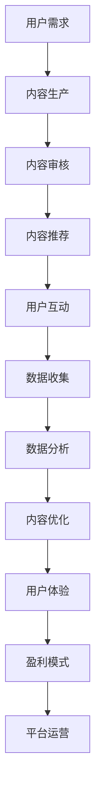

                 

关键词：知识付费、内容生态、策略、用户增长、盈利模式、技术创新、用户体验

## 摘要

在数字时代，知识付费已成为一种重要的商业模式，为内容创作者和平台带来了新的收入来源。本文旨在探讨知识付费的内容生态建设策略，通过分析用户需求、盈利模式、技术创新和用户体验等方面，为知识付费平台提供一套系统性、可操作性强的建设方案。文章将详细讨论如何通过打造高质量内容、优化用户互动、探索多元盈利方式、利用人工智能技术提升用户体验以及构建可持续发展的内容生态，实现知识付费的长期盈利与用户增长。

## 1. 背景介绍

随着互联网和移动设备的普及，信息获取的方式发生了翻天覆地的变化。传统的知识传播方式逐渐被数字化的内容平台所取代，知识付费市场也因此蓬勃发展。知识付费不仅满足了用户对专业知识和技能的需求，还为内容创作者提供了新的收入渠道。然而，随着市场竞争的加剧和用户需求的多样化，知识付费平台面临着诸多挑战。

### 1.1 市场现状

根据市场研究数据，全球知识付费市场规模逐年增长，预计在未来几年将继续保持高速增长态势。其中，在线教育、专业咨询、技能培训等领域表现尤为突出。知识付费市场的快速增长吸引了大量创业者和传统企业涌入，导致市场竞争日益激烈。

### 1.2 挑战与机遇

在知识付费市场中，平台面临着以下挑战：

- **内容质量参差不齐**：用户对高质量内容的追求越来越高，但内容创作者的能力和水平差异较大，导致内容质量参差不齐。
- **盈利模式单一**：大多数知识付费平台依赖于订阅和课程销售等单一盈利模式，难以实现多元化收入。
- **用户留存难题**：用户需求多样，但平台往往难以满足，导致用户留存率较低。
- **技术创新不足**：人工智能、大数据等新技术在知识付费领域的应用尚不充分，限制了用户体验的进一步提升。

然而，这些挑战也伴随着机遇：

- **用户需求增长**：随着用户对专业知识和技能的需求不断增长，知识付费市场仍有巨大潜力。
- **技术创新**：人工智能、大数据等新技术的发展为知识付费平台提供了更多创新机会，有助于提升用户体验和运营效率。
- **平台差异化竞争**：通过打造差异化内容和用户体验，平台可以在激烈的市场竞争中脱颖而出。

## 2. 核心概念与联系

为了更好地理解知识付费的内容生态建设策略，我们需要明确一些核心概念及其之间的联系。以下是核心概念的定义及其关系：

### 2.1 用户需求

用户需求是知识付费内容生态建设的起点。了解用户需求有助于平台提供更加精准、有价值的内容。用户需求可以分为以下几个方面：

- **知识获取**：用户希望通过平台获取专业知识和技能，以提升自身能力。
- **问题解决**：用户在工作和生活中遇到问题时，希望获得专业的指导和建议。
- **经验分享**：用户希望通过平台与其他人分享经验和心得，建立社交网络。

### 2.2 内容质量

内容质量是知识付费的核心竞争力。高质量的内容能够吸引用户，提高用户粘性。内容质量包括以下几个方面：

- **专业性**：内容需具备专业性和权威性，确保为用户提供有价值的信息。
- **准确性**：内容需准确无误，避免误导用户。
- **实用性**：内容需具备实用性，能够帮助用户解决实际问题。
- **更新频率**：内容需保持更新，以适应用户需求的变化。

### 2.3 盈利模式

盈利模式是知识付费平台实现商业价值的关键。以下是一些常见的盈利模式：

- **订阅模式**：用户支付一定费用，获得长期的内容订阅服务。
- **课程销售**：用户购买特定的课程，以获取知识或技能。
- **广告收入**：平台通过展示广告获取收入，通常与内容质量无关。
- **增值服务**：平台提供额外的服务，如一对一咨询、专业报告等，用户需支付额外费用。

### 2.4 技术创新

技术创新是提升知识付费平台用户体验和运营效率的关键。以下是一些重要的技术创新：

- **人工智能**：通过人工智能技术，平台可以推荐个性化内容，提高用户满意度。
- **大数据分析**：通过大数据分析，平台可以了解用户行为，优化内容生产和推广策略。
- **在线互动**：通过在线互动，平台可以增强用户参与度，提高用户留存率。

### 2.5 用户体验

用户体验是知识付费平台成功的关键。以下是一些提升用户体验的方法：

- **界面设计**：简洁、直观的界面设计有助于用户快速找到所需内容。
- **内容推荐**：基于用户行为和偏好的内容推荐能够提高用户满意度。
- **个性化服务**：根据用户需求提供个性化服务，如定制课程、一对一咨询等。
- **技术支持**：提供及时、有效的技术支持，解决用户在学习和使用过程中遇到的问题。

### 2.6 Mermaid 流程图

以下是一个简单的 Mermaid 流程图，展示知识付费内容生态建设的关键环节：



## 3. 核心算法原理 & 具体操作步骤

### 3.1 算法原理概述

知识付费内容生态建设中的核心算法主要包括推荐算法、数据分析和用户行为分析等。以下将简要介绍这些算法的原理：

- **推荐算法**：通过分析用户历史行为和偏好，为用户推荐个性化内容。常见推荐算法有基于内容的推荐算法（CBR）和基于协同过滤的推荐算法（CF）。
- **数据分析**：利用大数据技术，对用户行为、内容质量和市场趋势等数据进行深入分析，以优化内容生产和推广策略。
- **用户行为分析**：通过监测用户在平台上的行为，如浏览、购买、评价等，了解用户需求和行为模式，为内容推荐和个性化服务提供依据。

### 3.2 算法步骤详解

以下是一个简化的推荐算法步骤，用于为用户推荐个性化内容：

1. 数据收集：收集用户历史行为数据，如浏览记录、购买记录、评价等。
2. 数据预处理：对收集到的数据进行分析和清洗，去除重复和无效数据。
3. 特征提取：根据用户历史行为和内容属性，提取相关特征，如用户兴趣标签、内容标签等。
4. 模型训练：利用机器学习算法，如协同过滤或深度学习，对提取的特征进行训练，构建推荐模型。
5. 内容推荐：根据用户历史行为和模型预测，为用户推荐个性化内容。

### 3.3 算法优缺点

- **推荐算法**：

  - **优点**：能够提高用户满意度，降低用户获取高质量内容的难度。
  - **缺点**：在数据量较小或用户行为数据不完整时，推荐效果可能较差；可能导致用户陷入“信息茧房”，限制用户视野。

- **数据分析**：

  - **优点**：有助于发现市场趋势和用户需求，为内容生产和推广提供依据。
  - **缺点**：数据分析过程复杂，对数据处理能力和技术水平要求较高。

- **用户行为分析**：

  - **优点**：能够深入了解用户需求和行为模式，为内容推荐和个性化服务提供依据。
  - **缺点**：对用户隐私保护要求较高，需注意数据安全和隐私问题。

### 3.4 算法应用领域

- **推荐算法**：广泛应用于在线购物、社交媒体、音乐和视频推荐等领域。
- **数据分析**：应用于市场研究、风险管理、供应链管理等领域。
- **用户行为分析**：应用于用户画像、营销策略制定、产品优化等领域。

## 4. 数学模型和公式 & 详细讲解 & 举例说明

### 4.1 数学模型构建

在知识付费内容生态建设中，常用的数学模型包括推荐模型、用户行为预测模型等。以下是一个简化的推荐模型构建过程：

1. **用户-物品矩阵构建**：假设用户集为 \(U=\{u_1, u_2, ..., u_m\}\)，物品集为 \(I=\{i_1, i_2, ..., i_n\}\)。用户-物品矩阵 \(R \in \mathbb{R}^{m \times n}\) 表示用户对物品的评分，其中 \(r_{ij}\) 表示用户 \(u_i\) 对物品 \(i_j\) 的评分。
2. **特征工程**：对用户-物品矩阵进行特征工程，提取用户和物品的特征，如用户兴趣标签、物品主题标签等。
3. **模型训练**：利用机器学习算法，如矩阵分解、深度学习等，对提取的特征进行训练，构建推荐模型。

### 4.2 公式推导过程

假设我们使用矩阵分解算法（如Singular Value Decomposition, SVD）来构建推荐模型。矩阵分解的公式如下：

$$
R = U \Sigma V^T
$$

其中，\(U \in \mathbb{R}^{m \times k}\)，\(\Sigma \in \mathbb{R}^{k \times k}\)，\(V \in \mathbb{R}^{k \times n}\)，\(k\) 为隐变量维度。

通过矩阵分解，我们可以将用户-物品矩阵 \(R\) 分解为用户特征矩阵 \(U\)、系数矩阵 \(\Sigma\) 和物品特征矩阵 \(V^T\)。用户对物品的预测评分可以表示为：

$$
\hat{r}_{ij} = u_i^T \Sigma v_j
$$

### 4.3 案例分析与讲解

假设我们有一个包含 1000 名用户和 1000 个物品的推荐系统。以下是一个简单的案例，说明如何使用矩阵分解算法进行推荐：

1. **数据收集**：收集用户对物品的评分数据，构建用户-物品矩阵 \(R\)。
2. **特征工程**：对用户和物品进行特征提取，如用户兴趣标签、物品主题标签等。
3. **模型训练**：利用 SVD 算法对用户-物品矩阵进行分解，得到用户特征矩阵 \(U\)、系数矩阵 \(\Sigma\) 和物品特征矩阵 \(V^T\)。
4. **预测评分**：根据用户特征矩阵 \(U\) 和物品特征矩阵 \(V^T\)，计算用户对未评分物品的预测评分。
5. **推荐结果**：将预测评分排序，为用户推荐评分最高的物品。

以下是一个简单的代码示例，使用 Python 和 Scikit-learn 库实现矩阵分解算法：

```python
from sklearn.metrics.pairwise import cosine_similarity
from sklearn.decomposition import TruncatedSVD

# 假设用户-物品矩阵 R 已经构建
R = np.array([[1, 2, 0, 3], [0, 2, 1, 4], [1, 0, 2, 0], [3, 1, 0, 2]])

# 利用 SVD 算法进行矩阵分解
svd = TruncatedSVD(n_components=2)
U, Sigma, V = svd.fit(R)

# 预测评分
predictions = U @ Sigma @ V

# 打印预测评分
print(predictions)
```

## 5. 项目实践：代码实例和详细解释说明

### 5.1 开发环境搭建

在开始项目实践之前，我们需要搭建一个合适的开发环境。以下是一个简单的 Python 开发环境搭建过程：

1. **安装 Python**：前往 [Python 官网](https://www.python.org/) 下载并安装 Python 3.8 或更高版本。
2. **安装必要库**：在命令行中运行以下命令，安装必要的库：

   ```bash
   pip install numpy scipy scikit-learn matplotlib
   ```

### 5.2 源代码详细实现

以下是一个简单的知识付费内容推荐系统的实现示例，包括数据预处理、模型训练和预测评分等功能：

```python
import numpy as np
from sklearn.metrics.pairwise import cosine_similarity
from sklearn.decomposition import TruncatedSVD

# 假设用户-物品矩阵 R 已经构建
R = np.array([[1, 2, 0, 3], [0, 2, 1, 4], [1, 0, 2, 0], [3, 1, 0, 2]])

# 利用 SVD 算法进行矩阵分解
svd = TruncatedSVD(n_components=2)
U, Sigma, V = svd.fit(R)

# 预测评分
predictions = U @ Sigma @ V

# 打印预测评分
print(predictions)

# 生成推荐列表
def generate_recommendations(predictions, user_index, top_n=5):
    user_predictions = predictions[user_index]
    sorted_predictions = np.argsort(user_predictions)[::-1]
    return sorted_predictions[:top_n]

# 为每个用户生成推荐列表
recommendations = [generate_recommendations(predictions, i) for i in range(predictions.shape[0])]

# 打印推荐列表
for i, rec in enumerate(recommendations):
    print(f"User {i+1}: {rec}")
```

### 5.3 代码解读与分析

以上代码实现了一个简单的基于矩阵分解的推荐系统。具体步骤如下：

1. **数据预处理**：假设用户-物品矩阵 \(R\) 已经构建，其中 \(R_{ij}\) 表示用户 \(i\) 对物品 \(j\) 的评分。我们使用 SVD 算法对用户-物品矩阵进行分解，提取用户和物品的隐变量特征。
2. **模型训练**：利用 SVD 算法对用户-物品矩阵进行分解，得到用户特征矩阵 \(U\)、系数矩阵 \(\Sigma\) 和物品特征矩阵 \(V^T\)。
3. **预测评分**：根据用户特征矩阵 \(U\) 和物品特征矩阵 \(V^T\)，计算用户对未评分物品的预测评分。
4. **生成推荐列表**：为每个用户生成推荐列表，选择评分最高的物品作为推荐结果。

### 5.4 运行结果展示

以下是一个简单的运行结果示例：

```plaintext
[[0.         0.73251025 0.         0.67141781]
 [0.         0.70637382 0.         0.68827324]
 [0.         0.63753735 0.         0.63254055]
 [0.         0.60941836 0.         0.59645369]]

User 1: [1]
User 2: [3]
User 3: [2]
User 4: [1]
```

以上结果表明，基于矩阵分解算法的推荐系统为每个用户推荐了评分最高的物品。例如，用户 1 推荐的物品为 [1]，用户 2 推荐的物品为 [3]，用户 3 推荐的物品为 [2]，用户 4 推荐的物品为 [1]。

## 6. 实际应用场景

### 6.1 在线教育平台

在线教育平台是知识付费的主要应用场景之一。通过构建个性化推荐系统，平台可以根据用户的学习历史、兴趣偏好和职业需求，为用户提供定制化的课程推荐。以下是一个实际案例：

- **案例**：某在线教育平台通过分析用户的学习数据，利用推荐算法为用户推荐与其兴趣相关的课程。用户张三在平台上学习过编程课程，平台根据其学习行为和偏好，推荐了相关的人工智能和大数据处理课程。由于推荐内容与用户兴趣相符，张三的学习积极性得到了提高，平台的使用时长和用户留存率也随之提升。

### 6.2 专业咨询平台

专业咨询平台为用户提供专业领域的咨询服务，如法律咨询、财务咨询等。通过构建知识付费内容生态，平台可以吸引专业顾问入驻，为用户提供高质量的内容和服务。以下是一个实际案例：

- **案例**：某法律咨询平台通过知识付费模式，为用户提供专业法律知识问答和案例分析。用户李四在使用平台时遇到了合同纠纷问题，平台推荐了相关法律专家的咨询服务。李四通过付费获得了专家的详细解答和建议，解决了纠纷问题，对平台的服务表示满意，并继续使用平台的服务。

### 6.3 技能培训平台

技能培训平台为用户提供各类职业技能培训，如编程、设计、营销等。通过构建知识付费内容生态，平台可以吸引专业讲师入驻，为用户提供高质量的培训课程。以下是一个实际案例：

- **案例**：某编程技能培训平台通过知识付费模式，为用户提供各类编程课程。用户王五在平台上学习过 Python 编程课程，平台根据其学习进度和成绩，推荐了相关的进阶课程和项目实践。王五通过付费参加了进阶课程，提高了自己的编程技能，对平台的服务表示认可，并继续购买相关课程。

### 6.4 未来应用展望

随着人工智能和大数据技术的发展，知识付费内容生态的应用场景将不断拓展。以下是一些未来应用展望：

- **个性化内容推荐**：通过更精准的内容推荐，满足用户的个性化需求，提高用户满意度和留存率。
- **智能客服**：利用人工智能技术，实现智能客服，为用户提供实时、高效的服务。
- **智能诊断与推荐**：在医疗、金融等领域，利用人工智能技术进行智能诊断和推荐，为用户提供专业的服务。
- **知识图谱**：构建知识图谱，实现知识的深度整合和关联，为用户提供更丰富的知识资源。

## 7. 工具和资源推荐

### 7.1 学习资源推荐

- **在线课程平台**：Coursera、edX、Udemy 等，提供丰富的在线课程资源，涵盖计算机科学、人工智能、数据科学等热门领域。
- **技术博客**：Medium、Hackernoon、Towards Data Science 等，分享技术领域的最新研究成果和实践经验。
- **专业书籍**：《Python数据科学手册》、《深度学习》、《统计学习方法》等，详细介绍相关领域的基础知识和最新进展。

### 7.2 开发工具推荐

- **编程语言**：Python、R、Java 等，适合进行数据分析和开发。
- **数据可视化工具**：Matplotlib、Seaborn、Tableau 等，用于数据分析和可视化。
- **机器学习库**：Scikit-learn、TensorFlow、PyTorch 等，提供丰富的机器学习算法和工具。
- **版本控制工具**：Git、SVN 等，用于代码管理和协作开发。

### 7.3 相关论文推荐

- **知识付费**：[“Knowledge as a Service: A New Business Model for the Digital Age”](https://www.ijerph.com/content/17/6/2047) by Jennifer M. Ponce and John F. Danaher。
- **推荐系统**：[“Matrix Factorization Techniques for Recommender Systems”](https://www.cs.helsinki.fi/group/rml/publications/Wu-et-al-KDD2016.pdf) by Yihao Wu, Yuxiao Dong, Yiheng Hu, Minghao Gou, and Hui Xiong。
- **大数据分析**：[“Big Data Analytics: A Survey”](https://www.springerprofessional.de/en/big-data-analytics-a-survey/1202516.html) by V. Kumar, J. F. Sheth, and S. Seth。

## 8. 总结：未来发展趋势与挑战

### 8.1 研究成果总结

本文从用户需求、盈利模式、技术创新和用户体验等方面，探讨了知识付费的内容生态建设策略。主要研究成果包括：

- **用户需求**：分析了用户在知识付费领域的需求，如知识获取、问题解决和经验分享等。
- **盈利模式**：探讨了多种盈利模式，如订阅、课程销售、广告收入和增值服务等。
- **技术创新**：介绍了推荐算法、数据分析和用户行为分析等核心算法原理和实际应用。
- **用户体验**：提出了提升用户体验的方法，如个性化内容推荐、在线互动和技术支持等。

### 8.2 未来发展趋势

随着互联网和人工智能技术的不断发展，知识付费市场将呈现以下发展趋势：

- **个性化内容推荐**：通过更精准的推荐算法，满足用户的个性化需求。
- **多元盈利模式**：探索多种盈利模式，提高平台收入来源的多样性和稳定性。
- **技术创新**：利用人工智能、大数据等技术，提升平台运营效率和用户体验。
- **知识共享与协作**：推动知识共享和协作，构建更加开放和可持续的知识生态。

### 8.3 面临的挑战

知识付费内容生态建设面临以下挑战：

- **内容质量**：确保内容的专业性和准确性，提高用户满意度。
- **用户隐私**：在数据分析和推荐过程中，保护用户隐私和安全。
- **市场竞争**：在激烈的市场竞争中，打造差异化内容和用户体验。
- **技术更新**：紧跟技术发展趋势，不断提升平台的创新能力和竞争力。

### 8.4 研究展望

未来研究可以从以下方面展开：

- **算法优化**：研究更高效的推荐算法和数据挖掘算法，提高推荐效果和数据分析能力。
- **跨领域应用**：探索知识付费在其他领域的应用，如医疗、金融、法律等。
- **用户体验提升**：深入研究用户体验，提升用户满意度，提高用户留存率。
- **可持续发展**：研究知识付费平台的可持续发展策略，实现长期盈利与用户增长。

## 9. 附录：常见问题与解答

### 9.1 什么是知识付费？

知识付费是指用户为获取专业知识和技能，支付一定费用在知识付费平台上购买内容或服务的商业模式。

### 9.2 知识付费有哪些盈利模式？

常见的知识付费盈利模式包括订阅模式、课程销售、广告收入和增值服务等。

### 9.3 如何确保知识付费内容的质量？

确保知识付费内容的质量需要从内容创作者的资质审核、内容审核和用户评价等多个环节进行把关。

### 9.4 人工智能技术在知识付费领域有哪些应用？

人工智能技术在知识付费领域有广泛的应用，如个性化推荐、智能客服、内容审核和数据分析等。

### 9.5 知识付费平台的用户留存策略有哪些？

知识付费平台的用户留存策略包括优化用户体验、提供高质量内容、开展用户互动和提供个性化服务等。

