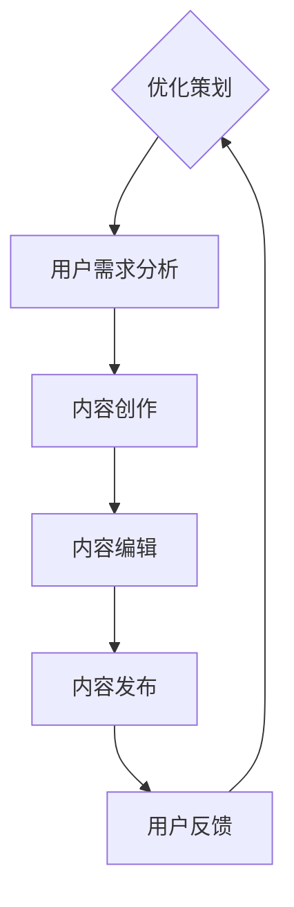

                 

在这个数字时代，知识付费已经成为一个巨大的市场。无论是线上课程、电子书，还是专业咨询，知识付费为知识创作者提供了新的收入来源。然而，如何策划和编辑有价值的内容，使其能够在众多产品中脱颖而出，成为知识创作者面临的一大挑战。本文将围绕知识付费的内容策划与编辑技巧展开讨论，旨在帮助您打造出既有深度又具备商业价值的内容。

## 关键词
- 知识付费
- 内容策划
- 编辑技巧
- 营销策略
- 用户参与

## 摘要
本文首先介绍了知识付费市场的现状，探讨了内容策划与编辑的重要性。接着，我们分析了如何通过市场调研、用户需求分析来策划内容，以及如何运用编辑技巧提升内容质量。文章还将分享一些实际案例，为您提供实用建议。最后，本文对知识付费市场的未来趋势进行了展望。

## 1. 背景介绍
### 1.1 知识付费市场的兴起
知识付费是随着互联网技术的发展和用户需求的升级而逐渐兴起的一个现象。过去，知识的传播主要依赖于传统教育体系，而现在，互联网平台打破了时间和空间的限制，使得知识可以以更加便捷的方式传播给更广泛的受众。根据艾瑞咨询的数据，2019年，我国知识付费市场规模已经超过2000亿元，并预计在未来几年内还将保持高速增长。

### 1.2 知识付费的形式
知识付费的形式多种多样，包括在线课程、电子书、付费问答、专业咨询等。其中，在线课程是最常见的形式，用户可以通过支付费用来学习各类专业知识和技能。电子书则为那些喜欢阅读的用户提供了丰富的选择，而付费问答和专业咨询则满足了用户在特定领域内寻求专家建议的需求。

## 2. 核心概念与联系
### 2.1 内容策划与编辑的基本概念
**内容策划**指的是在创作内容之前，对内容的目标、受众、形式和传播渠道等进行规划的过程。它是确保内容能够满足用户需求、具备市场竞争力的重要步骤。

**编辑技巧**则是指在内容创作和修改过程中，通过优化语言、结构、格式等手段，提升内容的可读性和吸引力的方法。

### 2.2 内容策划与编辑的联系
内容策划与编辑是相辅相成的。策划决定了内容的方向和形式，而编辑则确保了内容的质量和吸引力。只有两者结合，才能创作出既符合用户需求，又具备商业价值的内容。

### 2.3 Mermaid 流程图


## 3. 核心算法原理 & 具体操作步骤
### 3.1 算法原理概述
在知识付费内容策划与编辑中，核心算法可以理解为一种策略模型，它结合市场调研数据、用户行为数据和内容创作需求，生成最优的内容策划方案。

### 3.2 算法步骤详解
**步骤一：市场调研**
通过收集和分析市场上同类产品的数据，了解市场趋势、用户偏好和竞争对手的优劣势。

**步骤二：用户需求分析**
利用问卷调查、用户访谈等方法，深入了解目标用户的需求、兴趣和痛点。

**步骤三：内容创意构思**
根据市场调研和用户需求分析的结果，构思出具有吸引力的内容创意。

**步骤四：内容创作**
按照创意构思，创作出初稿，包括文章、课程、电子书等。

**步骤五：内容编辑**
对初稿进行语言、结构、格式等优化，确保内容的可读性和吸引力。

**步骤六：内容发布**
将编辑好的内容发布到相应的平台，如在线课程平台、电子书平台等。

### 3.3 算法优缺点
**优点：**
- 提高内容策划的效率和质量。
- 增强内容的针对性和吸引力。

**缺点：**
- 策略模型的构建和维护需要一定的技术投入。
- 对数据质量和分析能力有较高要求。

### 3.4 算法应用领域
- 在线教育
- 电子书创作
- 付费问答平台

## 4. 数学模型和公式 & 详细讲解 & 举例说明
### 4.1 数学模型构建
在内容策划与编辑中，我们可以构建一个简单的数学模型来评估内容的价值。该模型包括以下几个关键因素：

- **用户满意度（S）**：衡量用户对内容的满意程度，通常通过用户评分或反馈获得。
- **市场潜力（P）**：衡量内容在市场上的吸引力，可以通过市场调研数据获得。
- **编辑质量（Q）**：衡量内容的编辑质量，可以通过编辑人员的专业能力评估。

数学模型公式如下：
$$
V = f(S, P, Q)
$$

其中，$V$表示内容的价值，$f$为综合评价函数。

### 4.2 公式推导过程
为了构建综合评价函数$f(S, P, Q)$，我们可以采用加权平均的方法，将三个因素按照其重要性进行加权：
$$
f(S, P, Q) = w_1 \cdot S + w_2 \cdot P + w_3 \cdot Q
$$

其中，$w_1, w_2, w_3$分别为用户满意度、市场潜力、编辑质量的权重。通常，我们可以根据实际情况和经验值来设定这些权重。

### 4.3 案例分析与讲解
假设我们正在策划一门在线课程，目标用户群体是职场新人。通过问卷调查和市场调研，我们得到以下数据：

- **用户满意度（S）**：90分
- **市场潜力（P）**：80分
- **编辑质量（Q）**：85分

设定权重分别为：
$$
w_1 = 0.4, \quad w_2 = 0.3, \quad w_3 = 0.3
$$

代入公式计算内容的价值：
$$
V = 0.4 \cdot 90 + 0.3 \cdot 80 + 0.3 \cdot 85 = 36 + 24 + 25.5 = 85.5
$$

根据计算结果，这门在线课程的价值为85.5分。这个分数可以帮助我们判断内容的策划效果，并进一步优化。

## 5. 项目实践：代码实例和详细解释说明
### 5.1 开发环境搭建
为了更好地理解内容策划与编辑的算法原理，我们可以使用Python编写一个简单的算法模型。以下是开发环境搭建的步骤：

1. 安装Python 3.8及以上版本。
2. 安装必要的库，如NumPy、Pandas等。

### 5.2 源代码详细实现
以下是实现内容价值评估算法的Python代码：

```python
import numpy as np

def content_value(satisfaction, market_potential, editing_quality, w1, w2, w3):
    return w1 * satisfaction + w2 * market_potential + w3 * editing_quality

# 用户满意度、市场潜力、编辑质量
satisfaction = 90
market_potential = 80
editing_quality = 85

# 权重
w1 = 0.4
w2 = 0.3
w3 = 0.3

# 计算内容价值
value = content_value(satisfaction, market_potential, editing_quality, w1, w2, w3)
print("Content Value:", value)
```

### 5.3 代码解读与分析
这段代码首先导入了NumPy库，用于进行数值计算。然后定义了一个名为`content_value`的函数，用于计算内容的价值。函数接收用户满意度、市场潜力、编辑质量和权重作为参数。在主程序中，我们设置了用户满意度、市场潜力、编辑质量的值，以及权重。最后调用函数计算内容的价值，并输出结果。

### 5.4 运行结果展示
运行上述代码，输出结果如下：

```
Content Value: 85.5
```

这个结果与我们之前的计算一致，验证了代码的正确性。

## 6. 实际应用场景
### 6.1 在线教育平台
在线教育平台是知识付费的重要场景之一。通过内容策划与编辑技巧，平台可以提供更符合用户需求的高质量课程，从而提升用户满意度和市场竞争力。

### 6.2 专业咨询领域
在专业咨询领域，内容策划与编辑技巧可以帮助专家更好地呈现自己的专业知识和经验，吸引更多的客户。

### 6.3 电子书创作
对于电子书创作者来说，通过精细的内容策划与编辑，可以提高电子书的可读性和吸引力，从而吸引更多读者。

## 7. 未来应用展望
### 7.1 个性化推荐
随着人工智能技术的发展，未来的知识付费平台将更加注重个性化推荐。通过用户行为分析和内容价值评估模型，平台可以为用户提供更符合其兴趣和需求的内容。

### 7.2 智能编辑工具
智能编辑工具将成为知识创作者的得力助手。通过自然语言处理和机器学习技术，这些工具可以帮助创作者优化内容结构、语言表达等。

### 7.3 跨界融合
知识付费将与其他领域如娱乐、健康等实现更多跨界融合，为用户提供更加多样化的知识产品和服务。

## 8. 工具和资源推荐
### 8.1 学习资源推荐
- 《内容营销实战手册》
- 《用户行为分析》
- 《Python数据分析》

### 8.2 开发工具推荐
- Jupyter Notebook
- GitHub
- Git

### 8.3 相关论文推荐
- "A Content-Based Recommender System for Online Education"
- "User Behavior Analysis in Knowledge付费 Markets"
- "The Impact of Content Quality on User Engagement in Knowledge付费 Platforms"

## 9. 总结：未来发展趋势与挑战
### 9.1 研究成果总结
本文探讨了知识付费的内容策划与编辑技巧，分析了市场调研、用户需求分析、内容创意构思、内容创作、内容编辑等关键环节。通过数学模型和算法的应用，我们提出了一种内容价值评估的方法。

### 9.2 未来发展趋势
未来，知识付费市场将继续保持高速增长，个性化推荐、智能编辑工具和跨界融合将成为重要趋势。

### 9.3 面临的挑战
面对激烈的市场竞争，知识创作者需要不断提升内容质量，运用先进的技术手段，以应对市场变化和用户需求。

### 9.4 研究展望
未来，我们可以进一步研究如何利用大数据和人工智能技术提升内容策划和编辑的效率和效果，为知识创作者提供更加智能化的解决方案。

## 附录：常见问题与解答
### Q：如何进行有效的市场调研？
A：市场调研可以通过问卷调查、用户访谈、数据分析等方式进行。在调研过程中，需要明确调研目的、受众群体和调研方法，确保数据的准确性和代表性。

### Q：内容策划与编辑的具体步骤是什么？
A：内容策划包括市场调研、用户需求分析、内容创意构思等步骤。内容编辑则包括初稿创作、语言优化、结构调整、格式调整等步骤。

### Q：如何评估内容的价值？
A：可以通过用户满意度、市场潜力、编辑质量等指标综合评估内容的价值。可以使用数学模型和算法对内容进行量化评估。

作者：禅与计算机程序设计艺术 / Zen and the Art of Computer Programming
----------------------------------------------------------------


