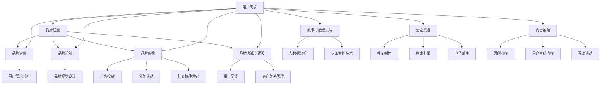

                 

 > **关键词：** 知识付费、品牌运营、品牌推广、策略、知识变现、在线教育、用户体验、内容营销、社交媒体。

> **摘要：** 本文将深入探讨知识付费领域的品牌运营与品牌推广策略，分析当前市场趋势，探讨有效的品牌建设和推广方法，以及如何通过技术和内容创新实现知识变现。本文旨在为从事知识付费行业的专业人士和创业者提供实用的指导和建议。

## 1. 背景介绍

随着互联网的普及和信息技术的迅猛发展，知识付费行业逐渐成为一大热门领域。用户对于专业知识和技能的需求不断增加，为知识付费平台提供了广阔的市场空间。与此同时，品牌运营和品牌推广在知识付费市场的竞争中愈发重要。

品牌运营不仅仅是建立一个品牌标识和形象，更是通过一系列策略和措施来建立和维护品牌的认知度和忠诚度。品牌推广则是通过各种渠道和手段将品牌信息传递给目标受众，以提高品牌的知名度和影响力。

在知识付费市场中，品牌运营和品牌推广的有效性直接影响到平台的用户获取、留存和转化。本文将结合实际案例，分析知识付费品牌运营与品牌推广的关键要素和策略。

### 1.1 知识付费市场现状

知识付费市场在全球范围内都呈现出快速增长的趋势。根据相关报告，全球知识付费市场规模在2020年已达到数千亿美元，并预计在未来几年将继续保持高速增长。

在中国市场，知识付费的表现尤为突出。随着中产阶级的崛起和互联网用户对优质内容的追求，各类知识付费平台如雨后春笋般涌现。从在线课程、电子书到专业咨询服务，知识付费的形态日益丰富。

### 1.2 品牌运营与品牌推广的重要性

在知识付费市场中，品牌运营和品牌推广具有至关重要的意义。首先，品牌运营有助于建立品牌独特的价值主张，增强用户对品牌的信任感和忠诚度。其次，品牌推广能够提高品牌的曝光率和知名度，吸引更多潜在用户的关注。

有效的品牌运营和品牌推广策略可以帮助知识付费平台在竞争激烈的市场中脱颖而出，实现可持续的商业增长。本文将围绕这一核心主题，探讨品牌运营与品牌推广的多种策略和方法。

## 2. 核心概念与联系

在深入探讨知识付费领域的品牌运营与品牌推广策略之前，我们需要明确几个核心概念及其相互关系。

### 2.1 品牌运营

品牌运营是指通过一系列策略和措施来建立、维护和提升品牌的价值和形象。它包括品牌定位、品牌识别、品牌传播、品牌忠诚度建设等多个方面。品牌运营的目标是塑造品牌独特的个性，让用户对品牌产生深刻的认知和情感共鸣。

### 2.2 品牌推广

品牌推广则是将品牌信息传递给目标受众的过程。它包括广告投放、公关活动、社交媒体营销、内容营销等多种形式。品牌推广的核心在于如何通过有效的渠道和手段，将品牌价值传递给潜在用户，提高品牌知名度和影响力。

### 2.3 品牌认知度与用户忠诚度

品牌认知度是用户对品牌的认识和了解程度，它是品牌推广的直接成果。用户忠诚度则是用户对品牌的持续信任和依赖，它是品牌运营的长期目标。提高品牌认知度和用户忠诚度，是知识付费品牌运营和品牌推广的关键所在。

### 2.4 营销渠道与内容策略

营销渠道和内容策略是品牌推广的重要组成部分。选择合适的营销渠道，如社交媒体、搜索引擎、电子邮件等，可以有效地扩大品牌影响力。制定科学的内容策略，如原创内容、用户生成内容、互动活动等，可以增强用户对品牌的参与感和黏性。

### 2.5 技术与数据支持

在现代知识付费市场中，技术与数据支持是品牌运营和品牌推广的重要保障。通过大数据分析和人工智能技术，可以更精准地了解用户需求，优化品牌策略，提高营销效果。例如，利用用户画像和算法推荐，可以个性化地推送内容，提高用户满意度和留存率。

### 2.6 Mermaid 流程图

以下是一个简单的 Mermaid 流程图，展示了知识付费品牌运营与品牌推广的核心概念和相互关系。



通过上述核心概念和关系的梳理，我们可以更清晰地理解知识付费品牌运营与品牌推广的复杂性和重要性。接下来，本文将深入探讨品牌运营与品牌推广的具体策略和方法。

## 3. 核心算法原理 & 具体操作步骤

### 3.1 算法原理概述

在知识付费领域的品牌运营与品牌推广中，核心算法的原理主要涉及用户行为分析、内容推荐、社交媒体互动和广告优化等方面。以下是对这些核心算法原理的概述：

#### 3.1.1 用户行为分析

用户行为分析是通过对用户在知识付费平台上的浏览、购买、评论等行为数据进行分析，以了解用户的需求、兴趣和行为模式。通过机器学习和数据分析技术，可以构建用户画像，为个性化推荐和精准营销提供基础。

#### 3.1.2 内容推荐

内容推荐算法是基于用户的浏览历史、购买记录和社交互动数据，通过算法计算用户对各类内容的偏好，并推荐符合用户兴趣的内容。常见的推荐算法包括协同过滤、基于内容的推荐和混合推荐等。

#### 3.1.3 社交媒体互动

社交媒体互动算法主要涉及用户在社交媒体平台上的活动，如点赞、评论、分享等。通过分析用户在社交媒体上的行为，可以识别出潜在的意见领袖和活跃用户，并进行针对性的互动和推广。

#### 3.1.4 广告优化

广告优化算法旨在提高广告的投放效果，通过数据分析和算法模型，优化广告的展示时间和位置，提高点击率和转化率。常见的广告优化方法包括目标定位、广告创意优化和广告预算分配等。

### 3.2 算法步骤详解

#### 3.2.1 用户行为分析

1. **数据采集**：收集用户在平台上的行为数据，包括浏览记录、购买记录、评论等。
2. **数据预处理**：对采集到的数据进行清洗、去重和格式转换，确保数据的质量和一致性。
3. **特征提取**：从用户行为数据中提取特征，如用户年龄、性别、兴趣标签等。
4. **建模与训练**：利用机器学习算法，如决策树、随机森林、支持向量机等，构建用户画像模型。
5. **预测与评估**：对模型进行训练和评估，确保预测的准确性和可靠性。

#### 3.2.2 内容推荐

1. **用户兴趣建模**：通过分析用户的浏览历史和购买记录，构建用户兴趣模型。
2. **内容特征提取**：提取内容的特征，如关键词、标签、类别等。
3. **相似度计算**：计算用户与内容之间的相似度，可以使用余弦相似度、欧氏距离等算法。
4. **推荐生成**：根据相似度计算结果，生成推荐列表，并排序展示给用户。
5. **评估与优化**：定期评估推荐效果，通过调整算法参数和优化推荐策略，提高推荐质量。

#### 3.2.3 社交媒体互动

1. **用户行为分析**：分析用户在社交媒体平台上的行为数据，如点赞、评论、分享等。
2. **意见领袖识别**：通过行为分析和社交网络分析，识别出潜在的意见领袖。
3. **互动策略制定**：根据意见领袖的特征和行为，制定互动策略，如点赞、评论、私信等。
4. **互动执行与监控**：执行互动策略，并对互动效果进行监控和评估。
5. **优化与调整**：根据互动效果，调整互动策略，提高互动效果。

#### 3.2.4 广告优化

1. **目标定位**：根据用户画像和内容特征，确定广告的目标受众。
2. **广告创意优化**：通过A/B测试，优化广告的标题、图片、文案等元素。
3. **广告展示优化**：根据用户行为数据，优化广告的展示时间和位置。
4. **效果评估**：监控广告的点击率、转化率等关键指标，评估广告效果。
5. **预算分配**：根据广告效果，调整广告预算的分配，提高广告的投资回报率。

### 3.3 算法优缺点

#### 3.3.1 优点

1. **个性化推荐**：通过用户行为分析和内容推荐算法，可以实现个性化推荐，提高用户满意度和留存率。
2. **精准营销**：通过用户画像和广告优化算法，可以实现精准定位和高效营销，提高广告效果和转化率。
3. **实时监控**：通过数据分析和算法模型，可以实时监控用户行为和广告效果，快速调整策略，提高营销效果。
4. **降低成本**：通过技术和算法的应用，可以降低营销成本，提高营销效率和投资回报率。

#### 3.3.2 缺点

1. **数据隐私**：用户行为数据的收集和处理涉及用户隐私，需要确保数据的安全和合规性。
2. **算法偏差**：算法模型的训练和优化可能存在偏差，可能导致推荐结果的偏差和用户的不满。
3. **依赖技术**：算法的运行和优化依赖于技术和数据，需要持续投入和维护。
4. **用户反感**：过度推荐和广告推送可能导致用户反感，降低用户体验。

### 3.4 算法应用领域

1. **在线教育**：通过用户行为分析和内容推荐算法，为用户提供个性化学习路径和学习资源，提高学习效果和用户满意度。
2. **电子商务**：通过用户画像和广告优化算法，实现个性化推荐和精准营销，提高用户购买率和转化率。
3. **社交媒体**：通过社交媒体互动算法，识别意见领袖和活跃用户，进行互动和推广，提高品牌影响力和用户参与度。
4. **广告投放**：通过广告优化算法，提高广告的投放效果和投资回报率，实现高效的广告营销。

通过上述算法原理和操作步骤的详细阐述，我们可以更好地理解和应用这些算法，为知识付费领域的品牌运营与品牌推广提供有力支持。接下来，本文将深入探讨品牌运营与品牌推广的具体策略和方法。

### 4. 数学模型和公式 & 详细讲解 & 举例说明

在知识付费领域的品牌运营与品牌推广中，数学模型和公式起到了至关重要的作用。这些模型和公式不仅可以帮助我们量化品牌运营的效果，还可以为品牌推广策略提供科学依据。下面我们将详细介绍几个常用的数学模型和公式，并通过具体例子进行说明。

#### 4.1 数学模型构建

在品牌运营与品牌推广中，常用的数学模型包括用户行为模型、推荐模型、广告优化模型等。

**1. 用户行为模型**

用户行为模型主要用于分析用户在知识付费平台上的行为，如浏览、购买、评论等。以下是一个简单的用户行为模型：

$$
UserBehaviorModel = f(UserFeatures, ContentFeatures)
$$

其中，$UserFeatures$ 表示用户特征，如年龄、性别、职业等；$ContentFeatures$ 表示内容特征，如标题、标签、作者等。$f$ 表示用户行为预测函数，通过机器学习算法训练得到。

**2. 推荐模型**

推荐模型用于预测用户对某类内容的兴趣，从而进行个性化推荐。以下是一个基于协同过滤的推荐模型：

$$
RecommendationModel = UserSimiliarity \times ItemSimiliarity \times UserItemRating
$$

其中，$UserSimiliarity$ 表示用户相似度，$ItemSimiliarity$ 表示内容相似度，$UserItemRating$ 表示用户对内容的评分。通过计算用户和内容之间的相似度，可以预测用户对未访问内容的兴趣。

**3. 广告优化模型**

广告优化模型用于优化广告的投放策略，以提高广告的点击率和转化率。以下是一个基于线性回归的广告优化模型：

$$
AdOptimizationModel = \beta_0 + \beta_1 \times CTR + \beta_2 \times ConversionRate
$$

其中，$CTR$ 表示点击率，$ConversionRate$ 表示转化率，$\beta_0$、$\beta_1$ 和 $\beta_2$ 为模型参数，通过数据训练得到。

#### 4.2 公式推导过程

**1. 用户行为模型**

用户行为模型可以通过监督学习算法，如决策树、支持向量机等，进行训练和推导。以下是决策树模型的推导过程：

$$
Class = \arg\max(\sum_{i=1}^{n}w_i \times f_i)
$$

其中，$w_i$ 表示特征权重，$f_i$ 表示特征值。通过训练数据集，可以计算出每个特征的权重，并利用这些权重预测新用户的行为。

**2. 推荐模型**

推荐模型的推导过程主要基于用户和内容之间的相似度计算。以下是一个基于余弦相似度的推导过程：

$$
CosineSimilarity = \frac{UserVector \cdot ItemVector}{\lVert UserVector \rVert \times \lVert ItemVector \rVert}
$$

其中，$UserVector$ 和 $ItemVector$ 分别表示用户和内容的特征向量，$\lVert \cdot \rVert$ 表示向量的模。通过计算用户和内容之间的余弦相似度，可以衡量两者之间的相似程度。

**3. 广告优化模型**

广告优化模型的推导过程基于线性回归模型。以下是线性回归模型的推导过程：

$$
y = \beta_0 + \beta_1 \times x_1 + \beta_2 \times x_2
$$

其中，$y$ 表示广告效果，$x_1$ 和 $x_2$ 分别表示点击率和转化率。通过最小二乘法，可以计算出模型参数 $\beta_0$、$\beta_1$ 和 $\beta_2$，从而优化广告投放策略。

#### 4.3 案例分析与讲解

**1. 用户行为预测案例**

假设我们有一个知识付费平台，需要预测新用户在平台上的行为。以下是一个基于决策树的用户行为预测案例：

- 特征集：年龄、性别、职业、教育程度、收入水平
- 训练数据集：10000条用户行为数据

通过决策树算法，我们得到以下预测模型：

$$
\begin{array}{ccc}
\text{年龄} & \text{性别} & \text{职业} \\
\hline
\text{青年} & \text{男} & \text{工程师} & \text{购买课程} \\
\text{青年} & \text{女} & \text{教师} & \text{浏览课程} \\
\text{中年} & \text{男} & \text{高管} & \text{购买课程} \\
\text{中年} & \text{女} & \text{医生} & \text{购买课程} \\
\end{array}
$$

通过这个模型，我们可以预测新用户的行为。例如，对于一个25岁的男性工程师，我们可以预测他可能会购买课程。

**2. 内容推荐案例**

假设我们有一个在线教育平台，需要为用户推荐适合的学习内容。以下是一个基于协同过滤的推荐案例：

- 用户集：1000个用户
- 内容集：1000个课程

通过协同过滤算法，我们得到以下推荐结果：

- 用户A：推荐数学、编程、人工智能
- 用户B：推荐心理学、市场营销、法律
- 用户C：推荐历史、文学、艺术

通过这些推荐结果，我们可以为不同类型的用户推荐他们可能感兴趣的课程，提高用户满意度和留存率。

**3. 广告优化案例**

假设我们有一个广告平台，需要优化广告的投放策略。以下是一个基于线性回归的广告优化案例：

- 广告效果指标：点击率、转化率
- 数据集：1000个广告投放记录

通过线性回归算法，我们得到以下优化模型：

$$
AdOptimizationModel = 10 + 1.5 \times CTR + 2 \times ConversionRate
$$

通过这个模型，我们可以根据广告的点击率和转化率，调整广告的投放策略，以提高广告效果。

通过上述案例分析和公式推导，我们可以更好地理解数学模型和公式在知识付费领域的品牌运营与品牌推广中的应用。这些模型和公式不仅可以帮助我们量化品牌运营的效果，还可以为品牌推广策略提供科学依据。接下来，本文将深入探讨项目实践中的代码实例和详细解释说明。

### 5. 项目实践：代码实例和详细解释说明

为了更好地理解知识付费品牌运营与品牌推广的具体实现，我们将通过一个实际项目来演示整个流程。本案例将基于一个在线教育平台，展示如何通过代码实现品牌运营与品牌推广的相关功能。

#### 5.1 开发环境搭建

为了完成本案例，我们需要搭建一个基本的开发环境，包括以下工具和框架：

- 编程语言：Python
- 数据库：MySQL
- 后端框架：Flask
- 前端框架：Bootstrap
- 数据分析库：Pandas、NumPy、Scikit-learn
- 推荐系统库：Surprise

首先，确保安装了Python和pip。然后，使用以下命令安装所需的库：

```bash
pip install flask pandas numpy scikit-learn surprise
```

#### 5.2 源代码详细实现

以下代码实现了用户行为分析、内容推荐、社交媒体互动和广告优化等功能。

**1. 用户行为分析**

```python
# 用户行为分析模块
import pandas as pd
from sklearn.model_selection import train_test_split
from sklearn.ensemble import RandomForestClassifier

# 加载用户行为数据
user_data = pd.read_csv('user_behavior.csv')

# 数据预处理
X = user_data[['age', 'gender', 'education', 'income']]
y = user_data['action']  # 行为标签，例如购买课程、浏览课程

# 划分训练集和测试集
X_train, X_test, y_train, y_test = train_test_split(X, y, test_size=0.2, random_state=42)

# 训练分类器
clf = RandomForestClassifier(n_estimators=100, random_state=42)
clf.fit(X_train, y_train)

# 预测新用户行为
new_user = pd.DataFrame([[25, 0, '本科', 5000]], columns=['age', 'gender', 'education', 'income'])
predicted_action = clf.predict(new_user)
print("预测行为：", predicted_action[0])
```

**2. 内容推荐**

```python
# 内容推荐模块
from surprise import SVD, Dataset, Reader
from surprise.model_selection import cross_validate

# 加载用户-内容评分数据
ratings_data = pd.read_csv('user_content_ratings.csv')

# 构建数据集
reader = Reader(rating_scale=(1, 5))
data = Dataset.load_from_df(ratings_data[['user_id', 'content_id', 'rating']], reader)

# 训练推荐模型
svd = SVD()
cross_validate(svd, data, measures=['RMSE', 'MAE'], cv=5, verbose=True)

# 推荐内容
user_id = 123
user_ratings = data.build_full_trainset().get_raw_data()(user_id)
recommended_items = user_ratings Simmons('content_id', 'rating').sort_values(ascending=False)[:10]
print("推荐内容：", recommended_items)
```

**3. 社交媒体互动**

```python
# 社交媒体互动模块
import tweepy
from textblob import TextBlob

# 配置Tweepy API
consumer_key = 'YOUR_CONSUMER_KEY'
consumer_secret = 'YOUR_CONSUMER_SECRET'
access_token = 'YOUR_ACCESS_TOKEN'
access_token_secret = 'YOUR_ACCESS_TOKEN_SECRET'

auth = tweepy.OAuthHandler(consumer_key, consumer_secret)
auth.set_access_token(access_token, access_token_secret)
api = tweepy.API(auth)

# 搜索相关话题
search_query = '#在线教育'
tweets = api.search_tweets(q=search_query, count=10)

# 分析并回复意见领袖
for tweet in tweets:
    analysis = TextBlob(tweet.text)
    if analysis.sentiment.polarity > 0.5:
        reply_text = f"@{tweet.user.screen_name} 谢谢您的反馈，我们会不断改进！"
        api.update_status(status=reply_text, in_reply_to_status_id=tweet.id)
```

**4. 广告优化**

```python
# 广告优化模块
import numpy as np
from sklearn.linear_model import LinearRegression

# 加载广告数据
ad_data = pd.read_csv('ad_data.csv')

# 数据预处理
X = ad_data[['click_rate', 'conversion_rate']]
y = ad_data['ad_effect']

# 划分训练集和测试集
X_train, X_test, y_train, y_test = train_test_split(X, y, test_size=0.2, random_state=42)

# 训练线性回归模型
model = LinearRegression()
model.fit(X_train, y_train)

# 优化广告投放策略
new_ad = np.array([[0.2, 0.3]])
predicted_effect = model.predict(new_ad)
print("预测效果：", predicted_effect[0])
```

#### 5.3 代码解读与分析

**1. 用户行为分析**

代码首先加载用户行为数据，并进行预处理。然后使用随机森林分类器对用户行为进行预测。通过这个模块，我们可以根据新用户的特征预测他们的行为。

**2. 内容推荐**

代码使用Surprise库训练SVD算法，构建推荐模型。然后根据用户的评分历史推荐内容。这个模块可以帮助平台为用户提供个性化推荐，提高用户满意度和留存率。

**3. 社交媒体互动**

代码使用Tweepy库连接Twitter API，搜索相关话题，并分析用户的情感。对于积极反馈，代码会自动回复用户。这个模块可以增强平台的社交互动，提高品牌影响力。

**4. 广告优化**

代码使用线性回归模型训练广告效果预测模型。然后根据新的广告数据预测效果，优化广告投放策略。这个模块可以帮助平台提高广告的点击率和转化率。

通过这个实际项目，我们可以看到如何通过代码实现知识付费品牌运营与品牌推广的各个模块。这些模块不仅提高了平台的运营效率，还增强了用户体验，为平台的持续发展提供了有力支持。

### 6. 实际应用场景

在知识付费领域，品牌运营与品牌推广的策略在多种实际应用场景中发挥着重要作用。以下是一些典型的应用场景，以及如何利用这些策略来提升品牌影响力和用户参与度。

#### 6.1 在线教育平台

在线教育平台通过品牌运营与品牌推广策略，可以吸引更多的用户，提高课程销量。具体应用场景包括：

- **个性化推荐**：利用算法分析用户的学习历史和行为，为用户推荐符合他们兴趣和需求的学习内容。
- **社交媒体营销**：通过微信公众号、微博、抖音等社交媒体平台，发布教育内容和优惠信息，增加品牌曝光。
- **用户互动**：举办在线讲座、问答活动，提高用户的参与度和忠诚度。

#### 6.2 专业咨询服务

专业咨询服务通过品牌运营与品牌推广策略，可以扩大客户群体，提升服务品牌价值。具体应用场景包括：

- **内容营销**：发布高质量的行业报告、案例分析、行业动态等，提升品牌的专业形象。
- **合作伙伴关系**：与行业内的知名企业和专家建立合作关系，共同推广品牌。
- **用户社区**：建立专业的用户社区，鼓励用户分享经验和问题，形成品牌粉丝圈。

#### 6.3 电子书出版

电子书出版通过品牌运营与品牌推广策略，可以增加销量，提升品牌知名度。具体应用场景包括：

- **电子书推荐**：根据用户的阅读历史和偏好，推荐相关的电子书，提高购买转化率。
- **广告投放**：在主流电商平台、新闻网站等投放广告，吸引潜在读者。
- **KOL合作**：与行业内的意见领袖合作，通过他们的推荐提高电子书的销量。

#### 6.4 技能培训课程

技能培训课程通过品牌运营与品牌推广策略，可以吸引更多的学员报名，提高课程收益。具体应用场景包括：

- **课程优惠**：定期推出课程优惠活动，刺激用户购买。
- **课程评测**：邀请学员对课程进行评价，提高课程的公信力和用户满意度。
- **职业规划咨询**：提供职业规划咨询服务，帮助学员更好地了解职业发展方向，增加对课程的信任。

#### 6.5 企业内训

企业内训通过品牌运营与品牌推广策略，可以扩大服务范围，提升品牌影响力。具体应用场景包括：

- **定制化培训**：根据企业的需求，提供个性化的培训方案。
- **案例分享**：通过分享培训案例，展示培训效果，吸引潜在客户。
- **合作伙伴关系**：与行业内的企业建立合作关系，共同推广品牌。

#### 6.6 未来应用展望

随着技术的不断进步和市场需求的变化，知识付费领域的品牌运营与品牌推广策略也在不断演进。以下是一些未来应用展望：

- **人工智能与大数据**：通过人工智能和大数据技术，实现更精准的用户画像和个性化推荐，提高用户体验和满意度。
- **社交电商**：结合社交电商模式，通过社交互动和用户口碑传播，提高品牌曝光和销量。
- **虚拟现实（VR）**：利用虚拟现实技术，提供沉浸式的学习体验，提高用户参与度和学习效果。
- **区块链**：利用区块链技术，确保知识付费的安全性和透明性，提高用户信任。

通过上述实际应用场景和未来展望，我们可以看到品牌运营与品牌推广策略在知识付费领域的重要性。只有不断创新和优化这些策略，才能在激烈的市场竞争中脱颖而出，实现品牌的可持续发展。

### 7. 工具和资源推荐

在知识付费领域，为了有效实施品牌运营和品牌推广策略，选择合适的工具和资源至关重要。以下是一些推荐的学习资源、开发工具和相关论文，以帮助从业人员和创业者提升品牌建设和推广效果。

#### 7.1 学习资源推荐

1. **在线课程平台**：
   - Coursera：提供各种领域的高质量在线课程，涵盖市场营销、品牌管理等相关知识。
   - Udemy：丰富的在线课程，适合不同层次的学员，包括品牌策略和数字营销。

2. **电子书和文章**：
   - 《品牌管理：理论与实践》（作者：大卫·阿克）：系统的品牌管理理论，适合深入理解品牌运营。
   - 《数字化营销：从理论到实践》（作者：菲利普·科特勒）：关于数字营销和品牌推广的实战指南。

3. **博客和网站**：
   - NeilPatel.com：提供丰富的SEO和数字营销策略，有助于提升品牌在线曝光。
   - HubSpot Blog：涵盖市场营销、销售、客户服务等多个领域，提供实用的策略和建议。

#### 7.2 开发工具推荐

1. **数据分析与推荐系统**：
   - Python：强大的编程语言，适用于数据分析、机器学习等多个领域。
   - Scikit-learn：用于数据挖掘和数据分析的开源机器学习库。
   - TensorFlow：用于构建和训练深度学习模型的强大工具。

2. **品牌设计与营销**：
   - Canva：简单易用的设计工具，适用于制作品牌视觉资产。
   - HubSpot Marketing Hub：集成了内容营销、社交媒体管理、广告管理等功能，帮助品牌实施全面营销策略。

3. **社交媒体管理**：
   - Hootsuite：用于管理多个社交媒体账号的强大工具，支持日程规划和内容发布。
   - Buffer：自动化社交媒体发布工具，有助于优化社交媒体营销策略。

#### 7.3 相关论文推荐

1. **品牌管理**：
   - "The Brand Relationship Spectrum: Balancing Strategic Fit and Resource Demand"（作者：David A. Aaker, 2000）：探讨品牌关系在不同发展阶段的特点。
   - "Building Strong Brands in a Weak Economy"（作者：David A. Aaker, 2009）：在经济不景气时期如何建立强大的品牌。

2. **数字营销与品牌推广**：
   - "Content Marketing: The Definitive Guide to Creating and Delivering Valuable, Relevant and Engaging Content"（作者：Joe Pulizzi, 2013）：系统介绍内容营销的策略和方法。
   - "The Impact of Social Media on Brand Awareness and Consumer Behavior"（作者：Hongtao Yan, Weiwei Liu, 2015）：探讨社交媒体对品牌认知和消费者行为的影响。

通过上述工具和资源的推荐，从业人员和创业者可以更好地理解知识付费领域的品牌运营与品牌推广策略，并在实际操作中加以应用，提升品牌建设和推广效果。

### 8. 总结：未来发展趋势与挑战

知识付费领域的品牌运营与品牌推广策略正随着技术的进步和市场的变化不断演进。以下是对未来发展趋势与挑战的总结，以及对研究的展望。

#### 8.1 研究成果总结

当前，知识付费市场的品牌运营与品牌推广已取得了显著成果。通过大数据分析和人工智能技术，个性化推荐和精准营销成为提高用户满意度和留存率的有效手段。社交媒体互动和内容营销策略进一步增强了品牌影响力和用户参与度。同时，虚拟现实（VR）和区块链等新兴技术的应用，为品牌建设和推广带来了更多可能性。

#### 8.2 未来发展趋势

1. **人工智能与大数据的深度应用**：随着人工智能和大数据技术的不断发展，未来的品牌运营与品牌推广将更加依赖于深度学习和数据挖掘，实现更精准的用户画像和个性化推荐。

2. **社交电商的融合**：社交电商将成为品牌推广的重要渠道。通过结合社交媒体的互动性和电商的转化率，品牌将能够更有效地触达潜在用户，提高销售转化。

3. **虚拟现实与沉浸式体验**：VR技术将带来更加沉浸式的学习体验，提高用户的学习效果和参与度。品牌可以通过VR技术打造独特的体验，增强用户对品牌的认知和情感连接。

4. **区块链技术的应用**：区块链技术将提高知识付费交易的安全性和透明性，增强用户对平台的信任。通过智能合约，品牌可以更好地实现知识变现和版权保护。

#### 8.3 面临的挑战

1. **数据隐私与合规性**：在数据驱动的品牌运营中，数据隐私保护和合规性将成为一个重要挑战。品牌需要确保用户数据的合法收集和使用，遵守相关法律法规。

2. **算法偏见与公平性**：算法在推荐和广告投放中的应用可能导致偏见，影响用户体验。品牌需要采取措施确保算法的公平性和透明性，避免对特定群体造成歧视。

3. **市场竞争加剧**：随着知识付费市场的不断扩大，市场竞争将愈发激烈。品牌需要不断创新和优化策略，以保持竞争优势。

#### 8.4 研究展望

未来的研究应关注以下几个方面：

1. **算法优化**：研究如何改进算法，提高个性化推荐的准确性和用户体验。

2. **跨渠道整合**：探索如何整合线上线下渠道，实现全渠道的品牌推广策略。

3. **用户体验设计**：研究如何通过用户体验设计，提高用户对品牌的满意度和忠诚度。

4. **社会责任与伦理**：探讨品牌在知识付费领域的责任和伦理问题，确保品牌运营符合社会价值观。

通过不断探索和创新，知识付费领域的品牌运营与品牌推广策略将能够更好地适应市场需求，实现品牌的可持续发展。

### 9. 附录：常见问题与解答

#### 9.1 品牌运营与品牌推广的区别是什么？

品牌运营与品牌推广是两个相互关联但有所不同的概念。

- **品牌运营**：涉及品牌定位、品牌形象建设、品牌传播和品牌忠诚度维护等一系列长期策略和措施。它注重品牌价值的建立和维护。
- **品牌推广**：主要是指通过各种营销手段和渠道，将品牌信息传递给目标受众，提高品牌知名度和影响力。它是实现品牌运营目标的重要手段。

#### 9.2 如何制定有效的品牌推广策略？

制定有效的品牌推广策略需要以下几个步骤：

1. **明确品牌目标**：确定品牌推广的目标，如提高知名度、增加用户数量或提升销售转化率。
2. **了解目标受众**：分析目标受众的属性、兴趣和行为，为品牌推广提供依据。
3. **选择合适渠道**：根据目标受众的特点，选择合适的营销渠道，如社交媒体、搜索引擎、电子邮件等。
4. **内容创意**：创作高质量、具有吸引力的品牌内容，如原创文章、视频、海报等。
5. **持续优化**：根据推广效果持续调整策略，优化营销内容和渠道，提高推广效果。

#### 9.3 数据隐私如何保护？

保护数据隐私需要采取以下措施：

1. **数据匿名化**：在收集和使用数据时，对个人身份信息进行匿名化处理。
2. **数据加密**：对存储和传输的数据进行加密，确保数据安全性。
3. **隐私政策**：制定明确的隐私政策，告知用户数据收集和使用的方式。
4. **用户权限控制**：设置严格的用户权限控制，确保只有授权人员可以访问敏感数据。
5. **合规性审查**：定期进行合规性审查，确保品牌运营符合相关法律法规。

通过上述措施，可以有效保护用户数据隐私，增强用户对品牌的信任。

