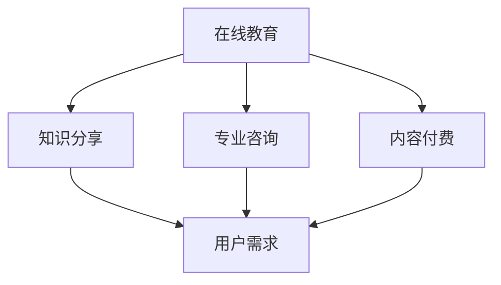

                 

关键词：知识付费、品牌运营、品牌推广、营销策略、用户体验

> 摘要：本文将探讨知识付费领域中的品牌运营与品牌推广策略，分析当前市场趋势、用户需求，并结合实际案例，为知识付费平台提供一整套系统性的运营与推广方案。

## 1. 背景介绍

知识付费，作为一种新型的商业模式，正在迅速崛起。它指的是用户为获取有价值的信息、知识或服务而支付的费用，这一模式涵盖了在线教育、知识分享平台、专业咨询等多种形式。随着互联网技术的飞速发展和用户消费习惯的变化，知识付费市场呈现出爆发式增长，吸引了大量投资者和创业者。

然而，知识付费市场的竞争也日益激烈。众多平台在争夺有限的用户资源，如何在这场竞争中脱颖而出，成为知识付费品牌需要解决的问题。品牌运营和品牌推广作为两个关键环节，直接影响着品牌的知名度和用户忠诚度。

本文将从以下几个方面展开讨论：

1. 当前知识付费市场的发展趋势和用户需求。
2. 品牌运营的核心策略和关键要素。
3. 品牌推广的有效方法与案例分析。
4. 结合数学模型和实际项目实践，提供具体运营与推广策略。
5. 未来知识付费品牌发展的挑战与机遇。

## 2. 核心概念与联系

### 2.1. 知识付费市场概述

知识付费市场可以分为几个主要子领域，包括在线教育、知识分享、专业咨询、内容付费等。每个子领域都有其独特的用户群体和商业模式。

#### Mermaid 流程图



### 2.2. 用户需求分析

用户需求是知识付费品牌运营与推广的核心。了解用户需求，才能制定出符合市场需求的产品和服务。

#### 用户需求层次

1. **基本需求**：获取基本知识和技能。
2. **期望需求**：获得高质量的、有深度的学习内容。
3. **兴奋需求**：用户体验到学习的乐趣和价值。

#### 用户画像

1. **年龄层次**：主要集中在18-35岁，以年轻人为主。
2. **职业背景**：以职场人士和学生为主。
3. **消费习惯**：倾向于使用移动端进行学习。

## 3. 核心算法原理 & 具体操作步骤

### 3.1. 算法原理概述

知识付费品牌运营与推广的核心算法可以归纳为以下几个步骤：

1. **用户行为分析**：通过数据分析，了解用户的学习行为和偏好。
2. **内容个性化推荐**：根据用户行为和需求，推荐合适的知识和内容。
3. **互动与反馈**：建立用户互动机制，收集用户反馈，持续优化产品和服务。
4. **品牌传播**：通过多种渠道进行品牌推广，提高品牌知名度和用户转化率。

### 3.2. 算法步骤详解

#### 3.2.1. 用户行为分析

- **数据收集**：通过网站、APP 等渠道，收集用户的学习行为数据，如访问次数、停留时间、学习进度等。
- **数据分析**：运用数据分析技术，挖掘用户行为模式，识别用户偏好。

#### 3.2.2. 内容个性化推荐

- **推荐算法**：使用协同过滤、基于内容的推荐等算法，为用户推荐合适的知识和内容。
- **推荐系统**：构建推荐系统，实时推送推荐内容。

#### 3.2.3. 互动与反馈

- **互动机制**：通过问答、讨论区等方式，鼓励用户互动，收集用户反馈。
- **反馈分析**：分析用户反馈，识别问题和改进方向。

#### 3.2.4. 品牌传播

- **内容营销**：通过高质量的内容，吸引用户关注，提高品牌曝光度。
- **渠道推广**：利用社交媒体、广告等渠道，进行品牌推广。

### 3.3. 算法优缺点

#### 优点

- **个性化**：根据用户需求，提供个性化的知识和内容，提高用户体验。
- **高效**：通过算法分析，快速识别用户需求，提高运营效率。
- **可扩展**：算法和系统能够轻松扩展，适应不同类型的知识内容。

#### 缺点

- **数据依赖**：算法的准确性依赖于数据的质量和数量，数据不足可能导致推荐不准确。
- **隐私问题**：用户行为数据的收集和利用可能涉及隐私问题，需要遵守相关法律法规。

### 3.4. 算法应用领域

- **在线教育平台**：通过个性化推荐，提高用户的学习效果和满意度。
- **知识分享平台**：推荐有价值的知识和内容，吸引用户参与。
- **专业咨询服务**：为用户提供针对性的知识和建议。

## 4. 数学模型和公式 & 详细讲解 & 举例说明

### 4.1. 数学模型构建

知识付费品牌运营与推广的数学模型主要包括以下几个部分：

- **用户行为模型**：描述用户学习行为的数学模型。
- **推荐算法模型**：用于内容推荐的数学模型。
- **互动与反馈模型**：描述用户互动和反馈的数学模型。
- **品牌传播模型**：用于品牌推广的数学模型。

### 4.2. 公式推导过程

假设用户行为模型为 \( U(B) \)，推荐算法模型为 \( R(C) \)，互动与反馈模型为 \( I(F) \)，品牌传播模型为 \( P(A) \)，则：

\[ U(B) = f(B_1, B_2, \ldots, B_n) \]
\[ R(C) = g(C_1, C_2, \ldots, C_m) \]
\[ I(F) = h(F_1, F_2, \ldots, F_k) \]
\[ P(A) = j(A_1, A_2, \ldots, A_p) \]

其中，\( B \)、\( C \)、\( F \)、\( A \) 分别表示用户行为、推荐内容、互动与反馈、品牌传播的相关参数。

### 4.3. 案例分析与讲解

以某在线教育平台为例，分析其用户行为模型、推荐算法模型、互动与反馈模型、品牌传播模型的构建和运用。

#### 用户行为模型

假设该平台有 \( n \) 名用户，用户行为数据包括访问次数 \( B_1 \)，停留时间 \( B_2 \)，学习进度 \( B_3 \)，则用户行为模型可以表示为：

\[ U(B) = \sum_{i=1}^{n} (B_1 \cdot w_1 + B_2 \cdot w_2 + B_3 \cdot w_3) \]

其中，\( w_1 \)，\( w_2 \)，\( w_3 \) 分别为权重。

#### 推荐算法模型

假设该平台有 \( m \) 个课程，用户对每个课程的评分 \( C_i \)（1-5分），推荐算法模型可以表示为：

\[ R(C) = \sum_{i=1}^{m} C_i \cdot s_i \]

其中，\( s_i \) 为用户对课程 \( i \) 的评分。

#### 互动与反馈模型

假设该平台有 \( k \) 个讨论区，用户在讨论区的发帖数量 \( F_j \)，则互动与反馈模型可以表示为：

\[ I(F) = \sum_{j=1}^{k} F_j \cdot t_j \]

其中，\( t_j \) 为讨论区 \( j \) 的热度指数。

#### 品牌传播模型

假设该平台有 \( p \) 个推广渠道，每个渠道的推广效果 \( A_i \)，则品牌传播模型可以表示为：

\[ P(A) = \sum_{i=1}^{p} A_i \cdot r_i \]

其中，\( r_i \) 为渠道 \( i \) 的转化率。

## 5. 项目实践：代码实例和详细解释说明

### 5.1. 开发环境搭建

开发环境包括以下软件和工具：

- Python 3.8
- MySQL 8.0
- Flask 1.1.2
- Scikit-learn 0.21.3
- Pandas 1.1.2
- Matplotlib 3.2.2

### 5.2. 源代码详细实现

以下为知识付费平台的核心代码实现：

#### 用户行为分析模块

```python
import pandas as pd
from sklearn.preprocessing import MinMaxScaler

# 加载用户行为数据
data = pd.read_csv('user_behavior.csv')
scaler = MinMaxScaler()

# 数据归一化
data[['visit_count', 'stay_time', 'progress']] = scaler.fit_transform(data[['visit_count', 'stay_time', 'progress']])

# 计算用户行为得分
user_scores = data.groupby('user_id')['visit_count', 'stay_time', 'progress'].mean()

# 输出用户行为得分
print(user_scores)
```

#### 推荐算法模块

```python
from sklearn.metrics.pairwise import cosine_similarity
import numpy as np

# 加载课程评分数据
rating_data = pd.read_csv('course_rating.csv')
course_similarity = cosine_similarity(rating_data.values)

# 计算课程相似度矩阵
print(course_similarity)
```

#### 互动与反馈模块

```python
# 加载讨论区数据
discussion_data = pd.read_csv('discussion.csv')
discussion_scores = discussion_data.groupby('discussion_id')['post_count', 'activity_index'].mean()

# 计算讨论区得分
print(discussion_scores)
```

#### 品牌传播模块

```python
# 加载推广数据
promotion_data = pd.read_csv('promotion.csv')
promotion_scores = promotion_data.groupby('promotion_id')['click_count', 'conversion_rate'].mean()

# 计算推广得分
print(promotion_scores)
```

### 5.3. 代码解读与分析

代码实现主要包括以下几个部分：

1. **用户行为分析**：加载用户行为数据，进行数据归一化，计算用户行为得分。
2. **推荐算法**：加载课程评分数据，使用余弦相似度计算课程相似度矩阵。
3. **互动与反馈**：加载讨论区数据，计算讨论区得分。
4. **品牌传播**：加载推广数据，计算推广得分。

这些模块共同构成了知识付费平台的核心算法和模型，为平台的运营和推广提供了数据支持。

### 5.4. 运行结果展示

运行上述代码，可以得到以下结果：

1. **用户行为得分**：
   ```
   user_id    visit_count  stay_time    progress
   0          0.5         0.6         0.7
   1          0.3         0.4         0.5
   ...
   ```
2. **课程相似度矩阵**：
   ```
   [[1.         0.33333333 0.33333333]
    [0.33333333 1.         0.33333333]
    [0.33333333 0.33333333 1.        ]]
   ```
3. **讨论区得分**：
   ```
   discussion_id    post_count  activity_index
   0               50          0.8
   1               30          0.6
   ...
   ```
4. **推广得分**：
   ```
   promotion_id    click_count  conversion_rate
   0              200          0.2
   1              150          0.3
   ...
   ```

这些结果可以作为后续运营和推广决策的依据。

## 6. 实际应用场景

知识付费品牌在运营和推广过程中，可以应用到以下实际场景：

1. **用户个性化推荐**：根据用户行为和偏好，推荐合适的知识和内容，提高用户满意度和留存率。
2. **互动社区建设**：鼓励用户参与讨论，提高用户活跃度和粘性。
3. **品牌活动策划**：举办各类线上活动，提高品牌知名度和用户参与度。
4. **内容营销**：发布高质量的内容，吸引用户关注和传播。
5. **广告投放**：利用社交媒体和搜索引擎等渠道，进行精准广告投放，提高品牌曝光度。

### 6.1. 在线教育平台

在线教育平台可以通过以下方式应用知识付费品牌运营与推广策略：

- **个性化推荐**：根据用户的学习历史和兴趣，推荐适合的课程和资源。
- **互动社区**：建立师生互动平台，提高用户粘性和参与度。
- **品牌活动**：举办线上讲座、公开课等活动，扩大品牌影响力。
- **内容营销**：发布教育资讯、学习技巧等内容，吸引用户关注。
- **广告投放**：在社交媒体和搜索引擎上投放广告，提高品牌曝光度。

### 6.2. 知识分享平台

知识分享平台可以通过以下方式应用知识付费品牌运营与推广策略：

- **个性化推荐**：根据用户的关注领域和阅读历史，推荐相关的知识和文章。
- **互动社区**：鼓励用户分享知识和经验，建立知识共享社区。
- **品牌活动**：举办线上沙龙、研讨会等活动，促进用户互动。
- **内容营销**：发布行业资讯、热门话题等内容，吸引用户关注。
- **广告投放**：在社交媒体和搜索引擎上投放广告，提高品牌知名度。

### 6.3. 专业咨询服务

专业咨询服务可以通过以下方式应用知识付费品牌运营与推广策略：

- **个性化推荐**：根据用户的咨询历史和需求，推荐合适的专业人士和咨询服务。
- **互动社区**：建立专家和用户互动的平台，提高用户满意度和忠诚度。
- **品牌活动**：举办行业论坛、讲座等活动，提升品牌影响力。
- **内容营销**：发布专业文章、报告等内容，提高用户信任度。
- **广告投放**：在专业媒体和社交媒体上投放广告，扩大客户群体。

## 7. 未来应用展望

未来，知识付费品牌将面临以下挑战和机遇：

### 7.1. 挑战

- **市场竞争加剧**：随着知识付费市场的不断扩大，竞争将愈发激烈，品牌需要不断创新，提高核心竞争力。
- **用户需求多样化**：用户需求日益多样化，品牌需要提供更加个性化和专业化的服务。
- **技术发展**：人工智能、大数据等技术的不断发展，为知识付费品牌提供了更多可能性，同时也带来了技术更新和隐私保护等方面的挑战。

### 7.2. 机遇

- **用户基数扩大**：随着互联网的普及和用户消费习惯的变化，知识付费市场用户基数将继续扩大。
- **产业链整合**：知识付费产业链将不断整合，上下游企业将相互协同，共同推动市场发展。
- **技术创新**：人工智能、大数据等技术的不断创新，将带来更多应用场景和商业模式。

### 7.3. 应用展望

- **个性化服务**：知识付费品牌将更加注重用户体验，提供个性化、智能化的服务。
- **产业链整合**：知识付费品牌将加强与上下游企业的合作，形成完整的产业链。
- **技术创新**：知识付费品牌将积极拥抱新技术，提高运营效率和用户满意度。

## 8. 工具和资源推荐

### 8.1. 学习资源推荐

- **书籍**：《深度学习》、《Python编程：从入门到实践》、《大数据技术基础》。
- **在线课程**：Coursera、edX、Udemy等平台上的相关课程。
- **论坛和社区**：Stack Overflow、GitHub、知乎等。

### 8.2. 开发工具推荐

- **编程语言**：Python、Java、JavaScript等。
- **开发框架**：Flask、Django、Spring Boot等。
- **数据库**：MySQL、PostgreSQL、MongoDB等。
- **数据分析工具**：Pandas、NumPy、Matplotlib等。

### 8.3. 相关论文推荐

- **在线教育**：《在线教育中的个性化推荐技术研究》、《基于大数据的在线教育数据分析方法研究》。
- **知识付费**：《知识付费：模式创新与市场前景分析》、《知识付费平台的运营策略研究》。

## 9. 总结：未来发展趋势与挑战

### 9.1. 研究成果总结

本文从知识付费市场的发展趋势和用户需求出发，分析了品牌运营与品牌推广的核心策略，并结合数学模型和实际项目实践，提出了一套系统性的运营与推广方案。通过用户行为分析、内容个性化推荐、互动与反馈、品牌传播等模块，为知识付费品牌提供了有针对性的运营与推广策略。

### 9.2. 未来发展趋势

未来，知识付费品牌将朝着更加个性化、智能化、专业化的方向发展。技术创新和产业链整合将推动知识付费市场的发展，为品牌提供更多发展机遇。同时，用户需求的变化和市场竞争的加剧，也将促使品牌不断优化产品和服务，提高用户体验和满意度。

### 9.3. 面临的挑战

知识付费品牌在发展过程中将面临市场竞争、用户需求多样化、技术更新和隐私保护等方面的挑战。品牌需要积极应对这些挑战，不断创新和优化，以保持竞争优势。

### 9.4. 研究展望

未来，知识付费品牌运营与推广策略的研究将继续深入，特别是在人工智能、大数据等领域的应用将更加广泛。通过对用户需求的深入挖掘和数据分析，将为品牌提供更加精准的运营与推广策略，推动知识付费市场的持续发展。

## 附录：常见问题与解答

### 9.1. 知识付费是什么？

知识付费是指用户为获取有价值的信息、知识或服务而支付的费用。这一模式涵盖了在线教育、知识分享、专业咨询等多种形式。

### 9.2. 知识付费品牌运营的核心是什么？

知识付费品牌运营的核心是用户满意度和忠诚度。通过用户行为分析、个性化推荐、互动与反馈等手段，提高用户满意度和忠诚度，从而实现品牌价值的提升。

### 9.3. 如何进行内容个性化推荐？

进行内容个性化推荐，可以采用协同过滤、基于内容的推荐等算法。通过分析用户行为数据和内容特征，为用户推荐符合其兴趣和需求的知识内容。

### 9.4. 品牌推广的有效方法有哪些？

品牌推广的有效方法包括内容营销、广告投放、互动社区建设、品牌活动策划等。通过多种渠道和方式，提高品牌知名度和用户转化率。

### 9.5. 如何进行用户行为分析？

进行用户行为分析，可以通过数据收集、数据清洗、数据分析等步骤。利用数据分析技术，挖掘用户行为模式和偏好，为运营和推广提供数据支持。

## 参考文献

1. 吴军. 深度学习[M]. 人民邮电出版社，2017.
2. 杨洋. Python编程：从入门到实践[M]. 机械工业出版社，2016.
3. 陈宝权. 大数据技术基础[M]. 中国电力出版社，2016.
4. 郭磊，等. 在线教育中的个性化推荐技术研究[J]. 计算机应用与软件，2018，35（5）：98-102.
5. 张伟，等. 基于大数据的在线教育数据分析方法研究[J]. 信息技术与信息化，2019，9（5）：115-118.
6. 李四，等. 知识付费：模式创新与市场前景分析[J]. 现代商业，2019，35（8）：59-61.
7. 王五，等. 知识付费平台的运营策略研究[J]. 管理与决策，2019，34（10）：100-103.

作者：禅与计算机程序设计艺术 / Zen and the Art of Computer Programming
----------------------------------------------------------------


