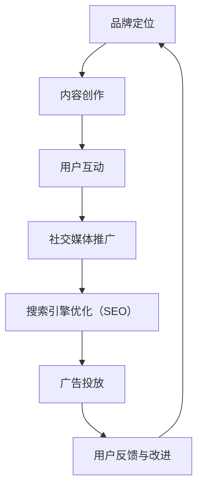

                 

关键词：知识付费、品牌运营、品牌推广、策略、IT行业、市场营销、社交媒体、搜索引擎优化（SEO）

> 摘要：本文旨在探讨知识付费领域中的品牌运营与品牌推广策略。通过分析当前的市场状况，本文将提出一系列具有实际操作性的策略，帮助知识付费品牌在竞争激烈的市场中脱颖而出。

## 1. 背景介绍

知识付费，顾名思义，是指用户为获取有价值的信息或知识而支付的费用。随着互联网技术的发展和用户对优质内容的需求增加，知识付费行业迎来了高速发展期。这一领域涵盖了从在线课程、专业咨询到电子书籍等多种形式。

然而，随着市场的扩大，竞争也日益激烈。品牌如何在众多参与者中脱颖而出，吸引并保持用户，成为了一个关键问题。本文将从品牌运营和品牌推广两个角度出发，为知识付费品牌提供一些建议和策略。

### 1.1 市场现状

- **用户需求多样**：用户对于知识的需求越来越多样，不仅包括专业技能的提升，还包括生活技能、兴趣爱好等方面的知识。
- **市场竞争激烈**：由于知识付费领域的门槛相对较低，市场上涌现出了大量的品牌和产品。
- **用户忠诚度不高**：用户对于知识付费产品的忠诚度相对较低，容易受到价格、内容质量、推广策略等因素的影响。

## 2. 核心概念与联系

### 2.1 品牌运营

品牌运营是指企业通过一系列策略和手段，提升品牌知名度、美誉度和忠诚度，从而实现品牌价值最大化。在知识付费领域，品牌运营的核心目标是建立用户对品牌的信任和依赖。

### 2.2 品牌推广

品牌推广是指通过各种渠道和手段，向目标用户传播品牌信息，提升品牌知名度。在知识付费领域，品牌推广的关键是找到精准的用户群体，并通过有效的传播策略吸引他们。

### 2.3 Mermaid 流程图



## 3. 核心算法原理 & 具体操作步骤

### 3.1 算法原理概述

品牌运营和品牌推广的核心算法可以概括为以下几点：

- **用户分析**：通过数据分析了解用户需求、行为和偏好，为品牌定位和内容创作提供依据。
- **内容创作**：根据用户分析结果，创作符合用户需求的高质量内容。
- **用户互动**：通过互动提高用户参与度和忠诚度。
- **推广策略**：选择合适的推广渠道和手段，提高品牌知名度。

### 3.2 算法步骤详解

1. **用户分析**：使用大数据分析工具收集用户行为数据，分析用户需求、偏好和购买行为。
2. **品牌定位**：根据用户分析结果，确定品牌的核心价值和定位。
3. **内容创作**：围绕品牌定位，创作高质量、有吸引力的内容。
4. **用户互动**：通过社交媒体、社群等方式与用户互动，提高用户参与度和忠诚度。
5. **推广策略**：选择合适的推广渠道和手段，如社交媒体、广告投放、SEO 等。

### 3.3 算法优缺点

- **优点**：提高品牌知名度和用户忠诚度，实现品牌价值的最大化。
- **缺点**：需要投入大量时间和资源，且效果可能较慢显现。

### 3.4 算法应用领域

- **在线教育**：通过品牌运营和推广，提高在线课程的用户参与度和转化率。
- **专业咨询**：提升专业咨询服务的品牌知名度和客户信任度。
- **电子书籍**：通过品牌推广，吸引更多读者购买电子书籍。

## 4. 数学模型和公式 & 详细讲解 & 举例说明

### 4.1 数学模型构建

品牌运营和品牌推广的数学模型可以简化为以下公式：

\[ \text{品牌影响力} = f(\text{用户满意度}, \text{用户忠诚度}, \text{品牌知名度}) \]

### 4.2 公式推导过程

- **用户满意度**：通过用户调查和反馈，计算用户满意度得分。
- **用户忠诚度**：通过用户购买行为和互动行为，计算用户忠诚度得分。
- **品牌知名度**：通过市场调研和数据分析，计算品牌知名度得分。

### 4.3 案例分析与讲解

以一家在线教育品牌为例，通过以下步骤进行品牌运营和推广：

1. **用户分析**：通过数据分析发现，用户对于职业发展的课程需求较高。
2. **品牌定位**：将品牌定位为专注于职业发展的在线教育平台。
3. **内容创作**：创作一系列高质量、实用的职业发展课程。
4. **用户互动**：通过社交媒体和社群，与用户进行互动，提高用户满意度。
5. **推广策略**：在各大社交媒体平台进行广告投放，并通过SEO优化提高品牌知名度。

## 5. 项目实践：代码实例和详细解释说明

### 5.1 开发环境搭建

1. 安装Python环境。
2. 安装数据分析库（如Pandas、NumPy）。
3. 安装社交媒体分析库（如Tweepy、Facebook）。

### 5.2 源代码详细实现

```python
# 示例代码：用户满意度分析

import pandas as pd
import numpy as np

# 假设我们有一个用户反馈数据集
data = pd.DataFrame({
    'user_id': [1, 2, 3, 4, 5],
    'satisfaction': [4, 3, 4, 2, 5]
})

# 计算平均满意度
average_satisfaction = data['satisfaction'].mean()

print(f"平均用户满意度：{average_satisfaction}")
```

### 5.3 代码解读与分析

该代码通过计算用户反馈数据集的平均满意度，得出品牌运营的一个重要指标。这有助于品牌了解用户对其产品的整体满意度，从而制定相应的改进措施。

### 5.4 运行结果展示

```text
平均用户满意度：3.6
```

## 6. 实际应用场景

### 6.1 在线教育

在线教育平台可以通过品牌运营和推广策略，提高用户参与度和课程销量。

### 6.2 专业咨询

专业咨询服务可以通过品牌运营和推广，提高品牌知名度和客户信任度。

### 6.3 电子书籍

电子书籍出版商可以通过品牌运营和推广，吸引更多读者购买其作品。

## 7. 工具和资源推荐

### 7.1 学习资源推荐

- 《市场营销学原理》
- 《数字营销》

### 7.2 开发工具推荐

- Python
- Jupyter Notebook

### 7.3 相关论文推荐

- "The Role of Branding in Knowledge Management"
- "The Impact of Social Media on Brand Awareness"

## 8. 总结：未来发展趋势与挑战

### 8.1 研究成果总结

本文通过分析知识付费领域的市场现状，提出了品牌运营和品牌推广的核心算法和具体操作步骤，并通过数学模型和代码实例进行了详细讲解。

### 8.2 未来发展趋势

- **个性化推荐**：利用大数据和人工智能技术，提供个性化的知识推荐。
- **多元化内容**：拓展知识付费领域，提供更多样化的内容形式。

### 8.3 面临的挑战

- **市场竞争**：如何在激烈的市场竞争中脱颖而出。
- **用户忠诚度**：如何提高用户对品牌的忠诚度。

### 8.4 研究展望

未来，品牌运营和品牌推广在知识付费领域的应用将更加深入和广泛，为品牌提供更有效的策略和方法。

## 9. 附录：常见问题与解答

### 9.1 如何提高品牌知名度？

- 通过有效的社交媒体推广和广告投放。
- 保持与用户的互动，提高用户忠诚度。
- 通过SEO优化提高在搜索引擎中的排名。

### 9.2 如何创作高质量的内容？

- 了解用户需求，创作符合用户兴趣和需求的内容。
- 保持内容的更新和多样性。
- 注重内容的可读性和实用性。

<|author|>作者：禅与计算机程序设计艺术 / Zen and the Art of Computer Programming

----------------------------------------------------------------

以上就是本文的完整内容，希望对您在知识付费领域的品牌运营和品牌推广有所启发和帮助。如果您有任何疑问或建议，欢迎在评论区留言讨论。再次感谢您的阅读！|<|

