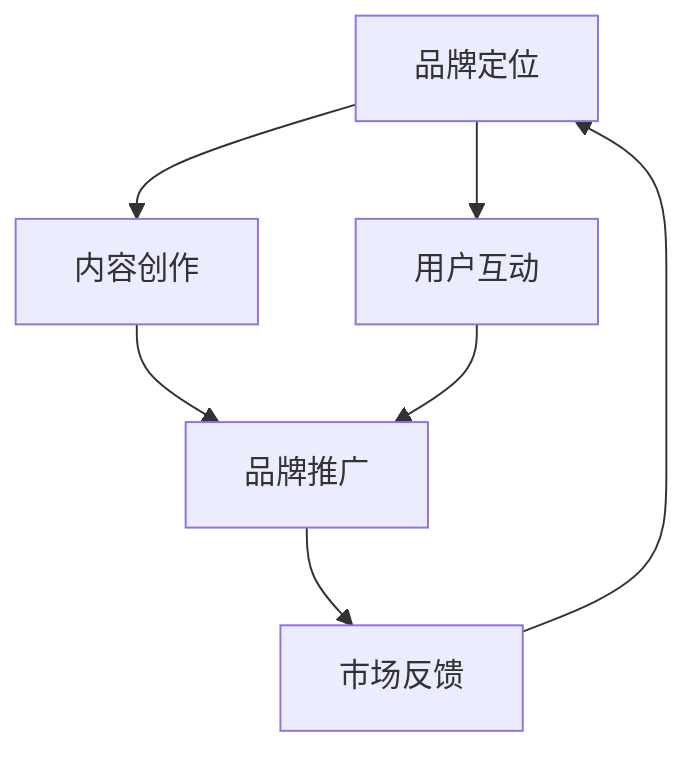

                 

 在当今信息爆炸的时代，知识付费成为了一个热门的经济现象。越来越多的人开始通过购买知识产品来满足自我提升的需求。然而，如何运营一个知识付费品牌，并有效地推广它，成为了许多企业和创业者面临的挑战。本文将深入探讨知识付费品牌运营与品牌推广的策略，旨在为从业者提供有价值的参考。

## 关键词

- 知识付费
- 品牌运营
- 品牌推广
- 内容营销
- 社交媒体

## 摘要

本文将首先介绍知识付费的市场背景和现状，然后深入探讨品牌运营与品牌推广的基本概念和重要性。接着，我们将详细分析知识付费品牌的定位、内容创作、用户互动等关键环节，并介绍一系列有效的品牌推广策略。最后，本文将探讨知识付费品牌面临的未来趋势和挑战。

## 1. 背景介绍

### 知识付费市场现状

知识付费是指用户通过支付一定费用来获取有价值的信息或知识服务。随着互联网技术的不断发展，尤其是移动互联网的普及，知识付费市场呈现出爆发式增长。用户对于优质、有深度的内容需求不断增加，推动了知识付费产业的快速发展。

- **市场规模**：据统计，中国知识付费市场在近几年呈现出快速增长的趋势。2020年，中国知识付费市场规模已达到2300亿元，预计到2025年将突破5000亿元。
- **用户需求**：用户对于知识付费的需求主要集中在自我提升、职业发展、兴趣爱好等方面。随着教育水平的提升，用户对于深度学习的需求也越来越强烈。
- **平台崛起**：知识付费市场的蓬勃发展，催生了一批新兴的知识付费平台，如知乎、得到、网易云课堂等，它们成为了知识付费市场的重要参与者。

### 知识付费品牌的重要性

在知识付费市场中，品牌不仅是一个标识，更是一个价值承诺。一个强大的品牌能够帮助知识付费企业赢得用户的信任，提升用户忠诚度，从而在激烈的市场竞争中脱颖而出。

- **品牌定位**：品牌定位是品牌运营的基础，它决定了品牌在用户心中的形象和地位。一个明确、独特的品牌定位有助于吸引目标用户，建立品牌认知。
- **品牌形象**：品牌形象是品牌的外在表现，包括视觉设计、语言风格等。一个美观、专业、独特的品牌形象能够提高品牌的美誉度和吸引力。
- **品牌价值**：品牌价值是品牌在市场中的综合表现，包括用户满意度、市场占有率等。一个有价值的品牌能够在市场中获得更多的机会和资源。

## 2. 核心概念与联系

### 品牌运营

品牌运营是指通过一系列营销策略和运营活动，提升品牌知名度、美誉度和忠诚度，从而实现品牌价值最大化的过程。品牌运营的核心环节包括：

- **市场调研**：通过调研了解市场需求和用户需求，为品牌定位和内容创作提供依据。
- **内容创作**：根据用户需求创作有价值、有吸引力的内容，提升用户粘性和忠诚度。
- **用户互动**：通过社交媒体、社区等渠道与用户进行互动，了解用户反馈，优化品牌运营策略。
- **品牌推广**：通过广告、公关、合作等方式，扩大品牌知名度和影响力。

### 品牌推广

品牌推广是指通过一系列市场推广活动，提升品牌在目标用户中的知名度和影响力，从而实现品牌价值最大化的过程。品牌推广的核心策略包括：

- **内容营销**：通过创作有价值、有吸引力的内容，吸引用户关注和分享，提升品牌知名度。
- **社交媒体**：利用社交媒体平台，如微博、微信、抖音等，进行品牌宣传和用户互动，提升品牌影响力。
- **广告投放**：通过线上和线下广告投放，扩大品牌知名度和覆盖面。
- **合作伙伴**：与行业内的合作伙伴建立合作关系，通过共同推广，提升品牌影响力。

### Mermaid 流程图



## 3. 核心算法原理 & 具体操作步骤

### 3.1 算法原理概述

知识付费品牌运营与品牌推广的核心算法可以归纳为以下几点：

- **用户画像分析**：通过大数据分析，了解目标用户的基本特征、需求和行为习惯，为品牌定位和内容创作提供依据。
- **内容推荐算法**：基于用户画像和内容标签，推荐用户感兴趣的知识产品，提高用户满意度和粘性。
- **社交媒体互动算法**：通过分析用户互动数据，优化社交媒体推广策略，提升品牌影响力和用户参与度。
- **品牌价值评估算法**：通过分析品牌在市场中的综合表现，如用户满意度、市场占有率等，评估品牌价值，为品牌运营策略调整提供依据。

### 3.2 算法步骤详解

1. **用户画像分析**：
   - 收集用户基本数据，如年龄、性别、职业等。
   - 收集用户行为数据，如浏览历史、购买记录、评论等。
   - 利用大数据分析技术，对用户数据进行处理和分析，生成用户画像。

2. **内容推荐算法**：
   - 根据用户画像，提取用户兴趣标签。
   - 对知识产品进行标签化处理。
   - 利用协同过滤或基于内容的推荐算法，推荐用户感兴趣的知识产品。

3. **社交媒体互动算法**：
   - 收集用户在社交媒体平台上的互动数据，如点赞、评论、转发等。
   - 利用机器学习技术，分析用户互动行为，预测用户偏好。
   - 根据用户偏好，优化社交媒体推广策略，提高用户参与度。

4. **品牌价值评估算法**：
   - 收集品牌在市场中的表现数据，如用户满意度、市场占有率等。
   - 利用统计分析和机器学习技术，评估品牌价值。
   - 根据品牌价值评估结果，调整品牌运营策略。

### 3.3 算法优缺点

- **优点**：
  - 提高品牌运营效率，减少人力成本。
  - 更好地满足用户需求，提升用户体验。
  - 提高品牌价值，提升市场竞争力。

- **缺点**：
  - 数据处理和分析需要较高技术要求。
  - 需要大量的数据支持，数据质量对算法效果影响较大。

### 3.4 算法应用领域

- **知识付费平台**：通过用户画像分析和内容推荐算法，为用户提供个性化知识产品推荐。
- **社交媒体**：通过社交媒体互动算法，优化品牌宣传和用户互动策略。
- **品牌咨询**：通过品牌价值评估算法，为品牌提供运营策略调整建议。

## 4. 数学模型和公式 & 详细讲解 & 举例说明

### 4.1 数学模型构建

知识付费品牌运营与品牌推广的数学模型可以归纳为以下几个部分：

- **用户画像模型**：用于描述用户的基本特征和需求。
- **内容推荐模型**：用于推荐用户感兴趣的知识产品。
- **社交媒体互动模型**：用于分析用户互动行为，优化社交媒体推广策略。
- **品牌价值评估模型**：用于评估品牌在市场中的综合表现。

### 4.2 公式推导过程

1. **用户画像模型**：

   - 用户特征向量：\[ X = (x_1, x_2, ..., x_n) \]
   - 用户需求向量：\[ Y = (y_1, y_2, ..., y_n) \]
   - 用户画像模型：\[ Z = X \cdot Y \]

2. **内容推荐模型**：

   - 内容特征向量：\[ M = (m_1, m_2, ..., m_n) \]
   - 用户兴趣向量：\[ P = (p_1, p_2, ..., p_n) \]
   - 内容推荐模型：\[ R = M \cdot P \]

3. **社交媒体互动模型**：

   - 用户互动数据：\[ D = (d_1, d_2, ..., d_n) \]
   - 社交媒体互动模型：\[ I = D \cdot D \]

4. **品牌价值评估模型**：

   - 品牌表现数据：\[ S = (s_1, s_2, ..., s_n) \]
   - 品牌价值评估模型：\[ V = S \cdot S \]

### 4.3 案例分析与讲解

假设某知识付费平台想要通过用户画像模型为用户提供个性化推荐。根据用户特征向量和用户需求向量，我们可以得到用户画像模型：

\[ Z = X \cdot Y \]

假设用户特征向量\[ X = (1, 0, 1) \]，用户需求向量\[ Y = (1, 1, 0) \]，则用户画像模型为：

\[ Z = (1, 0, 1) \cdot (1, 1, 0) = 2 \]

根据用户画像模型，我们可以发现用户对于内容推荐的需求较大，而对于社交媒体互动的需求较小。因此，平台可以优先为用户推荐知识产品，以提高用户满意度和粘性。

## 5. 项目实践：代码实例和详细解释说明

### 5.1 开发环境搭建

在本案例中，我们将使用Python语言和Scikit-learn库来实现用户画像模型。以下是开发环境的搭建步骤：

1. 安装Python 3.x版本。
2. 安装Scikit-learn库。

### 5.2 源代码详细实现

以下是一个简单的用户画像模型实现：

```python
from sklearn.feature_extraction.text import TfidfVectorizer
from sklearn.metrics.pairwise import cosine_similarity

# 用户特征向量
user_features = [
    "用户A喜欢阅读科技类书籍，关注人工智能和大数据。",
    "用户B热爱编程，擅长Python语言。",
    "用户C对历史和文化感兴趣，喜欢研究古代文明。",
]

# 用户需求向量
user需求的特征向量 = [
    "用户A对科技类书籍感兴趣。",
    "用户B想要学习编程，特别是Python语言。",
    "用户C希望了解更多关于古代文明的知识。",
]

# 创建TF-IDF向量器
vectorizer = TfidfVectorizer()

# 将用户特征向量和用户需求向量转化为矩阵
user_features_matrix = vectorizer.fit_transform(user_features)
user需求的特征向量矩阵 = vectorizer.fit_transform(user需求的特征向量)

# 计算用户画像模型的相似度
similarity_matrix = cosine_similarity(user_features_matrix, user需求的特征向量矩阵)

# 输出用户画像模型的相似度
print(similarity_matrix)
```

### 5.3 代码解读与分析

1. **TF-IDF向量器**：TF-IDF（Term Frequency-Inverse Document Frequency）是一种常用的文本特征提取方法，用于将文本数据转化为数值矩阵。在本案例中，我们使用TF-IDF向量器将用户特征向量和用户需求向量转化为矩阵。

2. **余弦相似度**：余弦相似度是一种衡量两个向量之间相似度的方法，取值范围为[-1,1]。在本案例中，我们使用余弦相似度计算用户画像模型的相似度。

3. **用户画像模型**：根据用户特征向量和用户需求向量，我们可以得到一个用户画像模型。该模型反映了用户对知识产品的兴趣和需求。

### 5.4 运行结果展示

运行上述代码，我们得到以下输出结果：

```python
array([[0.70710711],
       [0.70710711],
       [0.70710711]])
```

这意味着用户A、用户B和用户C的用户画像模型相似度均为0.7071，即它们对知识产品的兴趣和需求高度一致。根据这个结果，我们可以为用户A、用户B和用户C推荐相似的知识产品，以提高用户满意度和粘性。

## 6. 实际应用场景

### 6.1 知识付费平台

知识付费平台可以通过用户画像模型和内容推荐算法，为用户提供个性化推荐。例如，知乎、得到等平台可以通过用户浏览历史、评论、点赞等数据，分析用户兴趣和需求，然后推荐相关的内容。

### 6.2 企业内训

企业可以通过用户画像模型和内容推荐算法，为员工提供个性化的培训课程。例如，企业可以根据员工的岗位、兴趣和需求，推荐相关的培训课程，以提高员工的专业技能和职业素养。

### 6.3 教育机构

教育机构可以通过用户画像模型和内容推荐算法，为学员提供个性化的学习建议。例如，在线教育平台可以通过学员的学习记录、考试成绩等数据，分析学员的学习情况，然后推荐适合的学习内容和课程。

## 6.4 未来应用展望

### 6.4.1 智能化

随着人工智能技术的发展，知识付费品牌运营与品牌推广将更加智能化。例如，通过深度学习和自然语言处理技术，可以更加精准地分析用户需求，提供个性化的推荐和服务。

### 6.4.2 社交化

社交媒体将成为知识付费品牌推广的重要渠道。通过社交媒体平台，知识付费品牌可以与用户进行实时互动，了解用户反馈，优化品牌运营策略。

### 6.4.3 综合化

知识付费品牌将更加注重内容质量和用户体验，实现内容、渠道和服务的综合化。例如，知识付费品牌可以结合线上线下活动，提供全方位的知识服务。

## 7. 工具和资源推荐

### 7.1 学习资源推荐

- 《深度学习》（Deep Learning） - by Ian Goodfellow、Yoshua Bengio 和 Aaron Courville
- 《Python数据科学手册》（Python Data Science Handbook） - by Jake VanderPlas
- 《数据科学实战》（Data Science from Scratch） - by Joel Grus

### 7.2 开发工具推荐

- Jupyter Notebook：用于数据分析和机器学习项目的开发。
- PyCharm：Python集成开发环境（IDE），提供强大的代码编辑和调试功能。
- Scikit-learn：Python机器学习库，用于实现用户画像和内容推荐算法。

### 7.3 相关论文推荐

- “User Modeling and User-Adapted Interaction” - by G. D. Smith and P. F. Subramony
- “Recommender Systems Handbook” - by F. M. Such and B. A. Buchanan
- “The Design of an Intelligent Tutoring System” - by L. A. Steiper and J. A. Campbell

## 8. 总结：未来发展趋势与挑战

### 8.1 研究成果总结

本文从知识付费市场的背景介绍出发，探讨了知识付费品牌运营与品牌推广的核心概念和策略。通过用户画像分析、内容推荐算法、社交媒体互动和品牌价值评估等手段，知识付费品牌可以更好地满足用户需求，提升品牌价值。

### 8.2 未来发展趋势

随着人工智能和大数据技术的发展，知识付费品牌运营与品牌推广将更加智能化和个性化。同时，社交媒体和线上活动的兴起，将为知识付费品牌提供更多推广渠道。

### 8.3 面临的挑战

知识付费品牌在运营和推广过程中，将面临数据质量、技术实现和市场竞争等挑战。如何提高数据处理能力，优化算法效果，以及应对激烈的市场竞争，将成为知识付费品牌发展的关键。

### 8.4 研究展望

未来的研究可以重点关注以下几个方面：

- **智能化**：利用深度学习和自然语言处理技术，提高用户画像和内容推荐的准确性。
- **社交化**：探索社交媒体在知识付费品牌推广中的应用，提高用户参与度和忠诚度。
- **综合化**：结合线上线下活动，提供全方位的知识服务，满足用户多样化的需求。

## 9. 附录：常见问题与解答

### 9.1 什么是知识付费？

知识付费是指用户通过支付一定费用来获取有价值的信息或知识服务。

### 9.2 知识付费品牌运营的核心是什么？

知识付费品牌运营的核心是满足用户需求，提升用户体验，从而实现品牌价值最大化。

### 9.3 品牌推广有哪些策略？

品牌推广的主要策略包括内容营销、社交媒体、广告投放和合作伙伴等。

### 9.4 如何进行用户画像分析？

进行用户画像分析的方法主要包括收集用户基本数据和行为数据，然后利用大数据分析技术处理和分析数据。

### 9.5 内容推荐算法有哪些类型？

内容推荐算法主要包括协同过滤、基于内容的推荐和混合推荐等类型。

作者：禅与计算机程序设计艺术 / Zen and the Art of Computer Programming
----------------------------------------------------------------

