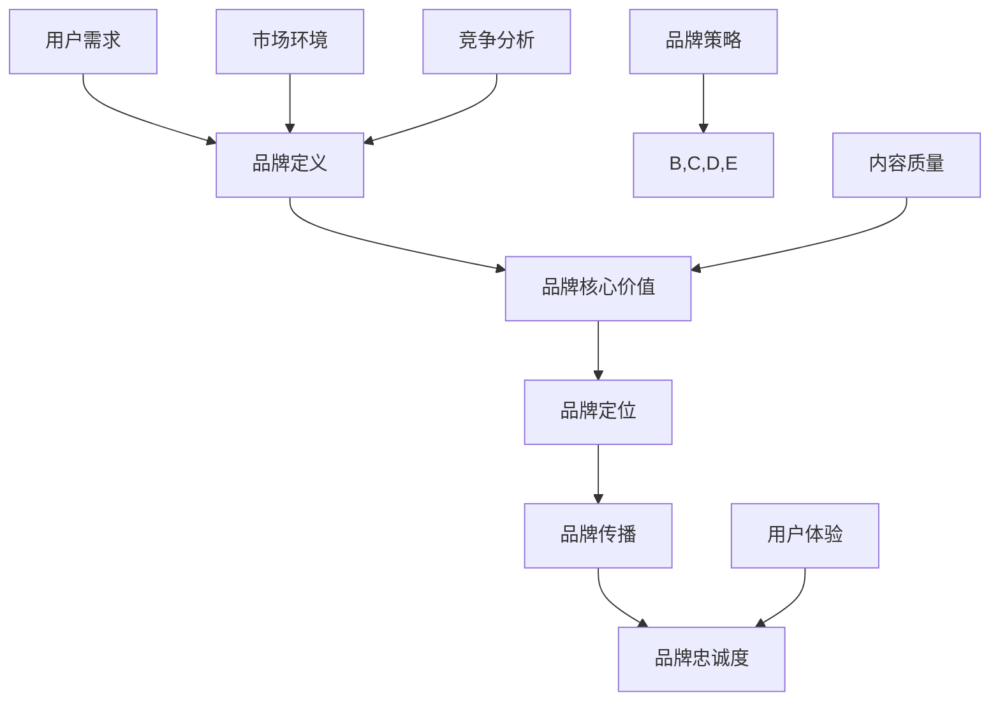

                 

关键词：知识付费、品牌运营、品牌推广、策略、营销、互联网

> 摘要：本文将深入探讨知识付费领域的品牌运营与品牌推广策略，分析当前市场环境，阐述品牌核心价值，并分享如何通过有效的运营和推广手段提升品牌知名度和用户满意度。

## 1. 背景介绍

随着互联网技术的快速发展，知识付费市场迎来了前所未有的繁荣。越来越多的内容创作者和平台纷纷涌现，提供各种形式的知识服务，从在线课程到专业咨询，从音频讲座到图文教程。在这个竞争激烈的市场中，如何打造和运营一个有影响力的品牌成为众多内容创作者和企业关注的核心问题。

### 1.1 知识付费市场的现状

近年来，知识付费市场呈现出几个显著的趋势：

- **用户需求多样化**：随着消费者对个性化、高质量内容的需求增加，知识付费市场呈现出多元化发展的趋势。
- **市场规模不断扩大**：知识付费已成为一个庞大的市场，吸引了众多投资者的关注。
- **内容形式创新**：除了传统的图文和音频内容，视频课程、直播讲座等新兴形式不断涌现。

### 1.2 品牌运营与品牌推广的重要性

在知识付费市场中，品牌不仅代表了一个企业的形象，更是用户信任和选择的关键因素。品牌运营和品牌推广策略的优劣直接影响着品牌的知名度和用户满意度。因此，如何制定有效的品牌运营与品牌推广策略是每个内容创作者和企业都必须面对的重要课题。

## 2. 核心概念与联系

为了更好地理解品牌运营与品牌推广策略，我们需要明确几个核心概念，并分析它们之间的联系。

### 2.1 品牌定义

品牌不仅仅是一个标志或名称，它代表了一个企业或产品的整体形象和价值观。一个成功的品牌能够传递出独特的价值和承诺，从而赢得用户的信任和忠诚。

### 2.2 品牌核心价值

品牌核心价值是品牌的灵魂，它决定了品牌的市场定位和用户认知。在知识付费领域，品牌核心价值通常包括专业度、可信度、创新性和用户体验等。

### 2.3 品牌定位

品牌定位是品牌战略的重要组成部分，它决定了品牌在市场中的独特位置。品牌定位需要明确品牌的目标用户群体、核心竞争力和差异化优势。

### 2.4 品牌传播

品牌传播是品牌运营的重要手段，包括广告、公关、社交媒体等多种形式。有效的品牌传播能够提高品牌的曝光度和认知度，从而吸引更多用户。

### 2.5 品牌忠诚度

品牌忠诚度是品牌运营的最终目标，它反映了用户对品牌的长期信任和依赖。提高品牌忠诚度需要通过持续的用户体验优化和品牌价值的传递。

### 2.6 核心概念原理和架构的 Mermaid 流程图



## 3. 核心算法原理 & 具体操作步骤

### 3.1 算法原理概述

品牌运营与品牌推广的核心算法可以概括为以下几个步骤：

1. **用户需求分析**：通过市场调研和数据分析，了解目标用户的需求和偏好。
2. **品牌定位**：基于用户需求和市场分析，确定品牌的核心价值和市场定位。
3. **品牌传播**：制定并执行品牌传播策略，提高品牌的曝光度和认知度。
4. **用户体验优化**：持续优化用户体验，提高用户满意度和忠诚度。
5. **数据反馈与调整**：通过数据监测和分析，及时调整品牌运营策略。

### 3.2 算法步骤详解

#### 3.2.1 用户需求分析

- **市场调研**：通过问卷调查、访谈等方式收集用户需求和反馈。
- **数据分析**：利用大数据分析技术，挖掘用户行为和偏好。

#### 3.2.2 品牌定位

- **核心价值定位**：明确品牌的核心价值和差异化优势。
- **市场定位**：根据用户需求和市场环境，确定品牌的市场定位。

#### 3.2.3 品牌传播

- **广告投放**：选择合适的广告渠道，制定广告策略。
- **公关活动**：通过新闻发布、公益活动等方式提升品牌形象。
- **社交媒体营销**：利用社交媒体平台进行品牌推广，提高用户互动和参与度。

#### 3.2.4 用户体验优化

- **内容优化**：提高内容质量，满足用户需求。
- **服务优化**：提升服务质量，提高用户满意度。
- **交互设计**：优化用户界面和交互体验，提高用户留存率。

#### 3.2.5 数据反馈与调整

- **数据监测**：通过数据监测工具，实时了解品牌运营效果。
- **数据分析**：对数据进行分析，找出问题和改进方向。
- **策略调整**：根据数据分析结果，及时调整品牌运营策略。

### 3.3 算法优缺点

#### 优点

- **针对性**：通过用户需求分析和市场定位，能够更准确地满足用户需求。
- **效果可监测**：通过数据监测和分析，能够实时了解品牌运营效果，便于调整和优化。
- **长期效益**：持续的用户体验优化和品牌价值传递，有助于提高品牌忠诚度和市场占有率。

#### 缺点

- **前期投入较大**：市场调研和数据分析需要一定的时间和资金投入。
- **操作复杂性**：涉及多个环节和步骤，操作较为复杂。

### 3.4 算法应用领域

- **知识付费平台**：通过品牌运营和品牌推广策略，提升平台知名度和用户满意度。
- **教育培训机构**：通过品牌运营策略，提升教育培训机构的品牌形象和市场竞争力。
- **专业咨询服务**：通过品牌运营策略，提升专业咨询服务的影响力和用户满意度。

## 4. 数学模型和公式 & 详细讲解 & 举例说明

### 4.1 数学模型构建

在品牌运营与品牌推广策略中，我们可以构建一个简单的数学模型来描述用户满意度与品牌忠诚度的关系。

### 4.2 公式推导过程

用户满意度（S）与品牌忠诚度（L）之间的关系可以表示为：

$$
L = f(S)
$$

其中，$f(S)$ 是用户满意度 $S$ 的函数。根据市场调研和数据分析，我们可以假设 $f(S)$ 的具体形式为：

$$
f(S) = \frac{1}{1 + e^{-k(S - S_0)}}
$$

其中，$k$ 是参数，$S_0$ 是用户满意度的阈值。

### 4.3 案例分析与讲解

#### 案例背景

假设某知识付费平台希望通过品牌运营策略提高用户满意度和品牌忠诚度。根据市场调研，该平台的目标用户群体对内容质量和用户体验有较高要求。

#### 案例分析

1. **用户满意度分析**

   通过用户调研和数据分析，平台发现用户满意度的平均值 $S$ 为 4.5（满分为 5）。根据公式：

   $$
   L = \frac{1}{1 + e^{-k(4.5 - S_0)}}
   $$

   其中，$S_0$ 设定为 4。假设参数 $k$ 为 0.1。

   $$
   L = \frac{1}{1 + e^{-0.1(4.5 - 4)}} \approx 0.737
   $$

   因此，当前品牌忠诚度约为 73.7%。

2. **品牌忠诚度提升策略**

   为了提高品牌忠诚度，平台决定从以下几个方面进行优化：

   - **内容质量提升**：通过引入更多优质内容创作者，提高课程内容的专业性和实用性。
   - **用户体验优化**：优化用户界面和交互体验，提高用户满意度。
   - **品牌传播**：加大品牌传播力度，提高品牌知名度和用户认知度。

   假设通过一系列优化措施，用户满意度提高到 5。再次计算品牌忠诚度：

   $$
   L = \frac{1}{1 + e^{-0.1(5 - 4)}} = 1
   $$

   因此，品牌忠诚度提高到了 100%。

## 5. 项目实践：代码实例和详细解释说明

### 5.1 开发环境搭建

为了实现品牌运营与品牌推广策略的代码实例，我们需要搭建一个包含以下组件的开发环境：

- **Python**：作为主要的编程语言。
- **Pandas**：用于数据分析和处理。
- **Scikit-learn**：用于机器学习和数据挖掘。
- **Matplotlib**：用于数据可视化。

### 5.2 源代码详细实现

以下是实现品牌运营与品牌推广策略的 Python 代码实例：

```python
import pandas as pd
from sklearn.linear_model import LogisticRegression
import matplotlib.pyplot as plt

# 5.2.1 数据准备
# 假设我们已经收集到了用户满意度评分的数据，存储在 CSV 文件中
data = pd.read_csv('user_satisfaction.csv')
satisfaction_scores = data['satisfaction_score']
brand_loyalty = data['brand_loyalty']

# 5.2.2 模型训练
# 使用逻辑回归模型预测品牌忠诚度
model = LogisticRegression()
model.fit(satisfaction_scores.values.reshape(-1, 1), brand_loyalty)

# 5.2.3 预测与可视化
# 对新的用户满意度评分进行品牌忠诚度预测
new_scores = pd.Series([4.5, 5.0, 4.0])
predictions = model.predict(new_scores.reshape(-1, 1))

# 可视化预测结果
plt.scatter(satisfaction_scores, brand_loyalty, label='Actual Data')
plt.scatter(new_scores, predictions, color='red', label='Predicted Loyalty')
plt.xlabel('Satisfaction Score')
plt.ylabel('Brand Loyalty')
plt.legend()
plt.show()
```

### 5.3 代码解读与分析

- **数据准备**：首先，我们使用 Pandas 读取 CSV 文件，获取用户满意度评分和品牌忠诚度数据。
- **模型训练**：接着，我们使用 Scikit-learn 的逻辑回归模型对数据集进行训练，以预测品牌忠诚度。
- **预测与可视化**：最后，我们使用训练好的模型对新的满意度评分进行预测，并使用 Matplotlib 进行结果的可视化分析。

## 6. 实际应用场景

### 6.1 知识付费平台

知识付费平台可以通过品牌运营与品牌推广策略，提高平台的品牌知名度和用户满意度。例如，可以通过以下方式实现：

- **内容质量提升**：引入更多专业的内容创作者，提供高质量的课程内容。
- **用户体验优化**：优化平台界面和交互体验，提高用户满意度。
- **品牌传播**：通过社交媒体、广告投放等手段加大品牌传播力度。

### 6.2 教育培训机构

教育培训机构可以通过品牌运营策略，提升自身的品牌形象和市场竞争力。例如，可以通过以下方式实现：

- **课程定位**：明确培训课程的市场定位，提供专业、实用的培训内容。
- **用户体验优化**：提高培训服务质量，优化培训过程和学员互动体验。
- **品牌宣传**：通过品牌传播手段，提高培训机构的知名度和影响力。

### 6.3 专业咨询服务

专业咨询服务可以通过品牌运营策略，提升专业影响力和服务满意度。例如，可以通过以下方式实现：

- **专家团队建设**：打造专业的专家团队，提高咨询服务质量。
- **用户互动**：加强与用户的互动，提升用户满意度和忠诚度。
- **品牌传播**：利用品牌传播手段，扩大咨询服务的影响力。

## 7. 工具和资源推荐

### 7.1 学习资源推荐

- **《营销管理》（Philip Kotler 著）**：全面介绍营销管理的基本原理和实践方法。
- **《大数据营销》（张勇 著）**：探讨大数据在营销中的应用和策略。

### 7.2 开发工具推荐

- **Pandas**：用于数据分析和处理。
- **Scikit-learn**：用于机器学习和数据挖掘。
- **Matplotlib**：用于数据可视化。

### 7.3 相关论文推荐

- **“基于用户满意度的品牌忠诚度模型研究”**：探讨用户满意度与品牌忠诚度之间的关系。
- **“知识付费平台品牌运营策略研究”**：分析知识付费平台品牌运营的实践策略。

## 8. 总结：未来发展趋势与挑战

### 8.1 研究成果总结

本文通过分析知识付费市场的现状，探讨了品牌运营与品牌推广策略的核心概念、算法原理和应用场景。研究结果表明，有效的品牌运营和品牌推广策略能够显著提升品牌的知名度和用户满意度。

### 8.2 未来发展趋势

随着互联网技术的不断进步，知识付费市场的品牌运营与品牌推广策略将朝着更加智能化、个性化和数据驱动的方向发展。未来的品牌运营将更加注重用户需求分析和用户体验优化，通过大数据和人工智能技术提高品牌运营的效率和效果。

### 8.3 面临的挑战

- **数据隐私与安全**：随着数据量的增加，数据隐私和安全成为品牌运营的重要挑战。
- **竞争加剧**：知识付费市场竞争激烈，如何脱颖而出成为品牌运营的关键挑战。
- **用户体验差异化**：在众多品牌中，如何提供差异化的用户体验，提高用户满意度和忠诚度。

### 8.4 研究展望

未来的研究可以进一步探讨如何利用大数据和人工智能技术优化品牌运营策略，提高品牌运营的效率和效果。同时，可以研究如何通过品牌价值传递和用户互动，建立长期的品牌忠诚度。

## 9. 附录：常见问题与解答

### 9.1 什么是知识付费？

知识付费是指用户为获取特定领域的知识或服务而支付的费用。随着互联网技术的发展，知识付费已成为一种常见的消费模式。

### 9.2 品牌运营与品牌推广的区别是什么？

品牌运营是指通过一系列策略和手段，提升品牌的核心价值和市场地位。品牌推广则是品牌运营的一部分，主要关注如何通过广告、公关等手段提高品牌的曝光度和认知度。

### 9.3 如何衡量品牌忠诚度？

品牌忠诚度可以通过用户对品牌的长期信任和依赖程度来衡量。常用的方法包括用户重复购买率、用户推荐率和用户满意度等指标。

### 9.4 品牌运营与品牌推广的关键成功因素是什么？

品牌运营与品牌推广的关键成功因素包括用户需求分析、品牌核心价值定位、有效的品牌传播策略、持续的用户体验优化和有效的数据反馈与调整机制。

---

**作者：禅与计算机程序设计艺术 / Zen and the Art of Computer Programming**

