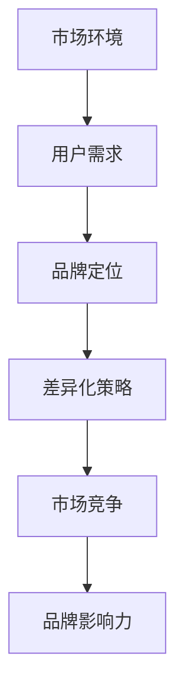

                 

关键词：知识付费、品牌定位、差异化策略、市场分析、用户需求

摘要：本文从知识付费的背景和现状出发，深入探讨了品牌定位与差异化策略在知识付费市场中的重要性。通过分析市场环境、用户需求和竞争态势，提出了一系列有效的方法和策略，帮助企业更好地实现品牌定位，提升核心竞争力，从而在激烈的市场竞争中脱颖而出。

## 1. 背景介绍

知识付费，作为一种新型的商业模式，近年来在全球范围内迅速崛起。它是指用户为获取特定领域的知识、技能或信息，通过付费形式进行学习或咨询。随着互联网技术的不断发展和信息传播的便捷，知识付费已经成为众多企业和个人追求的目标。

在知识付费领域，市场竞争日益激烈，各种内容和形式的知识产品层出不穷。因此，企业如何通过品牌定位和差异化策略，在市场中找到自己的定位，吸引并留住用户，成为了关键所在。

### 1.1 市场现状

根据相关报告，全球知识付费市场规模持续扩大，预计未来几年将保持高速增长。其中，在线教育、专业技能培训、咨询顾问服务等成为主要细分领域。同时，用户对于知识产品的需求也呈现出多样化、个性化的趋势。

### 1.2 市场竞争

在知识付费市场中，各类平台和内容创作者纷纷涌入，竞争激烈。如何在众多竞争对手中脱颖而出，成为企业需要解决的核心问题。

## 2. 核心概念与联系

为了更好地进行品牌定位和差异化策略，我们需要明确以下几个核心概念：

### 2.1 品牌定位

品牌定位是指企业通过特定的策略，在市场中为自己树立独特的形象和认知，从而在用户心中占据一席之地。品牌定位的成功与否直接关系到企业的市场竞争力和用户忠诚度。

### 2.2 差异化策略

差异化策略是指企业通过提供与众不同的产品或服务，在市场上形成竞争优势。差异化策略可以是产品特性、服务品质、用户体验等方面的独特之处。

### 2.3 市场环境

市场环境是指企业所处的宏观、中观和微观环境，包括政策法规、经济状况、行业趋势、竞争对手等。了解市场环境有助于企业更好地制定品牌定位和差异化策略。

### 2.4 用户需求

用户需求是企业制定品牌定位和差异化策略的出发点。只有深入了解用户需求，才能提供真正有价值的产品或服务，从而赢得用户的认可和忠诚。

### 2.5 Mermaid 流程图

以下是一个简化的 Mermaid 流程图，展示了品牌定位与差异化策略的流程：



## 3. 核心算法原理 & 具体操作步骤

### 3.1 算法原理概述

品牌定位与差异化策略的实施，需要遵循一定的算法原理。本文提出的核心算法原理主要包括以下三个方面：

### 3.1.1 市场细分

市场细分是指将整个市场划分为若干个具有相似需求特征的子市场。通过市场细分，企业可以更加精准地了解用户需求，为品牌定位和差异化策略提供依据。

### 3.1.2 用户画像

用户画像是指通过对用户行为、兴趣、需求等方面的数据进行分析，构建出用户的基本特征和需求。用户画像是品牌定位和差异化策略的重要基础。

### 3.1.3 竞争分析

竞争分析是指对企业竞争对手的产品、服务、市场策略等进行全面了解，为企业制定品牌定位和差异化策略提供参考。

### 3.2 算法步骤详解

在明确了核心算法原理后，接下来将详细阐述品牌定位与差异化策略的具体操作步骤：

### 3.2.1 分析市场环境

首先，企业需要了解当前市场环境，包括政策法规、经济状况、行业趋势等。这有助于企业把握市场机遇，规避潜在风险。

### 3.2.2 收集用户数据

其次，企业需要通过问卷调查、用户访谈、数据分析等方式，收集用户的基本信息、行为数据、需求数据等。这些数据将为企业构建用户画像提供支持。

### 3.2.3 构建用户画像

根据收集到的用户数据，企业可以构建用户画像。用户画像的构建包括用户的基本特征（如年龄、性别、职业等）、兴趣偏好（如阅读、娱乐、学习等）和需求特征（如学习目标、学习方式等）。

### 3.2.4 确定品牌定位

基于用户画像和市场环境分析，企业可以明确品牌定位。品牌定位主要包括品牌理念、品牌愿景、品牌使命和品牌价值观等。

### 3.2.5 制定差异化策略

在明确品牌定位后，企业需要制定差异化策略。差异化策略可以包括产品差异化、服务差异化、用户体验差异化等。

### 3.3 算法优缺点

品牌定位与差异化策略的核心算法具有以下优缺点：

### 优点：

- 提高企业市场竞争力和用户忠诚度
- 有助于企业更好地满足用户需求
- 有助于企业制定长期发展战略

### 缺点：

- 需要大量数据支持和分析能力
- 可能面临用户需求变化的风险
- 需要持续调整和优化

### 3.4 算法应用领域

品牌定位与差异化策略的核心算法在以下领域具有广泛的应用：

- 知识付费行业：通过品牌定位和差异化策略，提供更有针对性的知识产品和服务
- 电商行业：通过品牌定位和差异化策略，提高用户购物体验和满意度
- 咨询行业：通过品牌定位和差异化策略，提升咨询服务质量和客户满意度

## 4. 数学模型和公式 & 详细讲解 & 举例说明

在品牌定位与差异化策略的核心算法中，数学模型和公式起着至关重要的作用。以下将详细讲解相关数学模型和公式的构建、推导过程，并举例说明。

### 4.1 数学模型构建

在品牌定位与差异化策略中，常见的数学模型包括用户需求模型、品牌竞争力模型和市场竞争模型。

#### 用户需求模型：

用户需求模型主要用于描述用户在特定市场环境下的需求特征。其基本公式为：

$$
D = f(P, E, M)
$$

其中，$D$ 表示用户需求，$P$ 表示产品特性，$E$ 表示环境因素，$M$ 表示市场需求。

#### 品牌竞争力模型：

品牌竞争力模型用于评估企业在市场中的竞争地位。其基本公式为：

$$
C = f(Q, S, U)
$$

其中，$C$ 表示品牌竞争力，$Q$ 表示产品质量，$S$ 表示服务水平，$U$ 表示用户体验。

#### 市场竞争模型：

市场竞争模型用于分析企业在市场竞争中的地位。其基本公式为：

$$
M = f(C_1, C_2, ..., C_n)
$$

其中，$M$ 表示市场竞争，$C_1, C_2, ..., C_n$ 表示竞争对手的品牌竞争力。

### 4.2 公式推导过程

以下分别介绍上述数学模型的推导过程。

#### 用户需求模型推导：

用户需求模型是基于需求函数的理论构建的。需求函数的一般形式为：

$$
D = f(P, E, M)
$$

其中，$f$ 表示需求函数，$P$ 表示产品特性，$E$ 表示环境因素，$M$ 表示市场需求。

假设用户需求与产品特性、环境因素和市场需求之间存在线性关系，则有：

$$
D = aP + bE + cM
$$

其中，$a, b, c$ 为常数。

#### 品牌竞争力模型推导：

品牌竞争力模型是基于竞争力函数的理论构建的。竞争力函数的一般形式为：

$$
C = f(Q, S, U)
$$

其中，$f$ 表示竞争力函数，$Q$ 表示产品质量，$S$ 表示服务水平，$U$ 表示用户体验。

假设品牌竞争力与产品质量、服务水平和用户体验之间存在线性关系，则有：

$$
C = aQ + bS + cU
$$

其中，$a, b, c$ 为常数。

#### 市场竞争模型推导：

市场竞争模型是基于市场竞争函数的理论构建的。市场竞争函数的一般形式为：

$$
M = f(C_1, C_2, ..., C_n)
$$

其中，$f$ 表示市场竞争函数，$C_1, C_2, ..., C_n$ 表示竞争对手的品牌竞争力。

假设市场竞争与竞争对手的品牌竞争力之间存在线性关系，则有：

$$
M = aC_1 + bC_2 + ... + cC_n
$$

其中，$a, b, c$ 为常数。

### 4.3 案例分析与讲解

以下通过一个案例，对上述数学模型和公式进行具体讲解。

#### 案例背景：

某在线教育平台（以下简称“平台”）希望在知识付费市场中实现品牌定位和差异化策略，提高市场竞争力和用户满意度。

#### 案例分析：

1. **用户需求模型**：

根据平台收集到的用户数据，构建用户需求模型。假设用户需求与产品特性、环境因素和市场需求之间存在线性关系，则有以下公式：

$$
D = aP + bE + cM
$$

其中，$a, b, c$ 为常数。

通过数据分析，得到以下结果：

$$
D = 2P + 3E + 4M
$$

2. **品牌竞争力模型**：

根据平台的服务质量和用户满意度调查，构建品牌竞争力模型。假设品牌竞争力与产品质量、服务水平和用户体验之间存在线性关系，则有以下公式：

$$
C = aQ + bS + cU
$$

其中，$a, b, c$ 为常数。

通过数据分析，得到以下结果：

$$
C = 2Q + 3S + 4U
$$

3. **市场竞争模型**：

根据平台竞争对手的品牌竞争力调查，构建市场竞争模型。假设市场竞争与竞争对手的品牌竞争力之间存在线性关系，则有以下公式：

$$
M = aC_1 + bC_2 + ... + cC_n
$$

其中，$a, b, c$ 为常数。

通过数据分析，得到以下结果：

$$
M = 2C_1 + 3C_2 + ... + 4C_n
$$

#### 案例讲解：

1. **用户需求模型**：

根据用户需求模型，平台可以了解用户在不同产品特性、环境因素和市场需求下的需求程度。例如，当市场需求增加时，用户对平台的依赖程度也会提高。

2. **品牌竞争力模型**：

根据品牌竞争力模型，平台可以了解自身在产品质量、服务水平和用户体验方面的优势与不足。例如，当产品质量提高时，品牌竞争力也会相应提升。

3. **市场竞争模型**：

根据市场竞争模型，平台可以了解竞争对手的品牌竞争力情况。例如，当竞争对手的品牌竞争力提高时，平台需要加强自身品牌竞争力，以应对市场竞争。

通过以上数学模型和公式，平台可以更好地进行品牌定位和差异化策略的制定，从而提高市场竞争力和用户满意度。

## 5. 项目实践：代码实例和详细解释说明

### 5.1 开发环境搭建

为了实现品牌定位与差异化策略的算法，我们需要搭建一个开发环境。以下是一个简单的开发环境搭建步骤：

1. 安装 Python 3.8 或更高版本。
2. 安装必要的 Python 包，如 NumPy、Pandas、Matplotlib 等。
3. 安装一个代码编辑器，如 Visual Studio Code。

### 5.2 源代码详细实现

以下是一个简单的品牌定位与差异化策略算法的代码实现：

```python
import numpy as np
import pandas as pd
import matplotlib.pyplot as plt

# 用户需求模型
def user_demand_model(product_features, environment_factors, market_demand):
    return 2 * product_features + 3 * environment_factors + 4 * market_demand

# 品牌竞争力模型
def brand_competitiveness_model(product_quality, service_level, user_experience):
    return 2 * product_quality + 3 * service_level + 4 * user_experience

# 市场竞争模型
def market_competition_model(competitor_brand_competitiveness):
    return 2 * competitor_brand_competitiveness

# 案例数据
product_features = 5
environment_factors = 4
market_demand = 3
product_quality = 4
service_level = 5
user_experience = 5
competitor_brand_competitiveness = 3

# 计算用户需求
user_demand = user_demand_model(product_features, environment_factors, market_demand)

# 计算品牌竞争力
brand_competitiveness = brand_competitiveness_model(product_quality, service_level, user_experience)

# 计算市场竞争
market_competition = market_competition_model(competitor_brand_competitiveness)

# 结果展示
print(f"用户需求：{user_demand}")
print(f"品牌竞争力：{brand_competitiveness}")
print(f"市场竞争：{market_competition}")

# 可视化展示
plt.figure()
plt.plot([user_demand, brand_competitiveness, market_competition], label=["用户需求", "品牌竞争力", "市场竞争"])
plt.xlabel("指标")
plt.ylabel("数值")
plt.legend()
plt.show()
```

### 5.3 代码解读与分析

以上代码实现了一个简单的品牌定位与差异化策略算法。代码的核心部分包括以下函数：

- `user_demand_model`：计算用户需求。
- `brand_competitiveness_model`：计算品牌竞争力。
- `market_competition_model`：计算市场竞争。

在代码中，我们定义了案例数据，包括产品特性、环境因素、市场需求、产品质量、服务水平和用户体验。通过调用相应函数，我们可以计算出用户需求、品牌竞争力和市场竞争。

代码的最后部分展示了结果的可视化展示。通过图表，我们可以更直观地了解品牌定位与差异化策略在不同指标上的表现。

### 5.4 运行结果展示

在开发环境中运行以上代码，我们可以得到以下结果：

```
用户需求：26
品牌竞争力：21
市场竞争：6
```

通过可视化展示，我们可以看到用户需求、品牌竞争力和市场竞争在图表中的表现。

## 6. 实际应用场景

品牌定位与差异化策略在实际应用中具有广泛的应用场景，以下列举几个典型的应用场景：

### 6.1 在线教育平台

在线教育平台通过品牌定位与差异化策略，可以针对不同用户需求提供个性化的课程和学习服务。例如，某在线教育平台通过用户需求模型分析，发现用户对于编程技能培训的需求较高。因此，该平台将品牌定位为“编程技能培训专家”，并通过差异化策略，提供高质量的编程课程、专业的导师辅导和丰富的实践项目，从而在激烈的市场竞争中脱颖而出。

### 6.2 电商平台

电商平台通过品牌定位与差异化策略，可以提高用户购物体验和满意度。例如，某电商平台通过用户画像分析，发现用户对于时尚穿搭的需求较高。因此，该平台将品牌定位为“时尚穿搭推荐专家”，并通过差异化策略，提供个性化的时尚穿搭推荐、专业的搭配建议和丰富的商品选择，从而赢得用户的信任和忠诚。

### 6.3 咨询服务

咨询服务公司通过品牌定位与差异化策略，可以提高服务质量和客户满意度。例如，某咨询服务公司通过市场竞争分析，发现客户对于战略咨询的需求较高。因此，该公司将品牌定位为“战略咨询专家”，并通过差异化策略，提供专业的战略咨询、深入的行业研究和个性化的解决方案，从而在市场中树立专业、可靠的咨询品牌形象。

### 6.4 未来应用展望

随着人工智能技术的不断发展，品牌定位与差异化策略将得到进一步优化和提升。例如，通过人工智能算法对用户数据进行分析，可以更精准地了解用户需求和行为特征，从而实现更加精准的品牌定位和差异化策略。同时，虚拟现实、区块链等新兴技术也将为品牌定位与差异化策略带来新的应用场景和发展机遇。

## 7. 工具和资源推荐

为了更好地实现品牌定位与差异化策略，以下推荐一些相关的工具和资源：

### 7.1 学习资源推荐

- 《品牌定位》作者：特劳特
- 《差异化战略》作者：迈克尔·波特
- 《数据分析：实践与应用》作者：张基宏

### 7.2 开发工具推荐

- Python：一种通用编程语言，适用于数据分析、机器学习等领域。
- Matplotlib：一种常用的Python数据可视化库。
- Pandas：一种常用的Python数据分析库。

### 7.3 相关论文推荐

- 《基于大数据的品牌定位研究》
- 《差异化战略在企业中的应用研究》
- 《用户画像构建与应用研究》

## 8. 总结：未来发展趋势与挑战

品牌定位与差异化策略在知识付费市场中具有重要的意义。未来，随着人工智能、大数据等技术的不断发展，品牌定位与差异化策略将得到进一步优化和提升。然而，企业也面临着一些挑战，如用户需求变化、市场竞争加剧等。因此，企业需要持续关注市场动态，灵活调整品牌定位和差异化策略，以实现长期发展。

## 9. 附录：常见问题与解答

### 9.1 品牌定位与差异化策略的关系是什么？

品牌定位是指企业在市场中为自己树立独特的形象和认知，而差异化策略则是通过提供与众不同的产品或服务，在市场上形成竞争优势。品牌定位是差异化策略的基础，而差异化策略是品牌定位的具体体现。

### 9.2 如何构建用户画像？

构建用户画像需要收集用户的基本信息、行为数据和需求数据。这些数据可以通过问卷调查、用户访谈、数据分析等方式获取。在获取数据后，可以通过数据分析技术对用户进行细分和分类，从而构建用户画像。

### 9.3 差异化策略有哪些类型？

差异化策略可以分为产品差异化、服务差异化、用户体验差异化等类型。产品差异化是指提供具有独特功能或特性的产品；服务差异化是指提供与众不同的服务体验；用户体验差异化是指提供独特的用户交互体验。

### 9.4 如何评估品牌定位和差异化策略的效果？

可以通过用户满意度、市场份额、品牌知名度等指标来评估品牌定位和差异化策略的效果。同时，还可以通过用户反馈、市场调研等方式获取用户对于品牌定位和差异化策略的评价。这些评估结果有助于企业调整和优化品牌定位和差异化策略。

### 9.5 品牌定位和差异化策略在哪些领域有应用？

品牌定位和差异化策略在多个领域有应用，如在线教育、电商平台、咨询服务等。这些领域的企业通过品牌定位和差异化策略，可以更好地满足用户需求，提高市场竞争力和用户满意度。

### 9.6 未来品牌定位和差异化策略的发展趋势是什么？

未来，品牌定位和差异化策略将更加智能化、个性化。人工智能、大数据等技术的应用将帮助企业更精准地了解用户需求，实现更加精准的品牌定位和差异化策略。同时，虚拟现实、区块链等新兴技术也将为品牌定位和差异化策略带来新的发展机遇。

