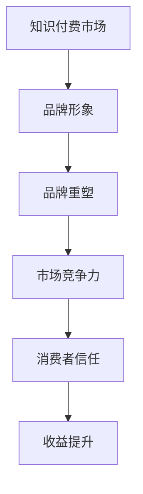

                 

在当今数字化时代，知识付费已经成为一种流行的商业模式。无论是在线课程、电子书、还是专业咨询服务，知识付费都为内容创作者提供了巨大的商业机会。然而，要在这个竞争激烈的市场中脱颖而出，打造一个强大的品牌形象和进行品牌重塑显得尤为重要。本文将深入探讨知识付费领域的品牌形象升级与品牌重塑策略，以帮助内容创作者在市场中站稳脚跟。

## 关键词

- 知识付费
- 品牌形象
- 品牌重塑
- 市场策略
- 消费者体验

## 摘要

本文旨在分析知识付费领域品牌形象升级与品牌重塑的重要性，并提出一套有效的策略。我们将从市场现状、消费者行为分析、品牌形象定位、品牌重塑方法以及工具与资源推荐等方面进行详细探讨。通过本文，读者将获得对知识付费品牌建设策略的全面了解，有助于在实际操作中打造出具有吸引力的品牌形象。

## 1. 背景介绍

随着互联网技术的飞速发展，信息传播变得更加便捷，知识获取的门槛也大大降低。然而，海量的信息中，高质量的知识内容依然稀缺。知识付费作为一种全新的商业模式，应运而生。它不仅满足了用户对于专业知识的渴望，也为内容创作者提供了新的收入来源。然而，知识付费市场的竞争日益激烈，要想在这个市场中脱颖而出，必须打造一个强大的品牌形象。

品牌形象是指消费者对品牌所持有的认知、感受和印象。一个优秀的品牌形象能够帮助企业在消费者心中树立良好的信誉，提升品牌知名度和美誉度。在知识付费领域，品牌形象的重要性更加凸显。因为知识付费的本质是信任，消费者愿意为品牌提供的高质量内容买单，同时也希望品牌能够提供持续的价值。

品牌重塑则是品牌形象升级的重要手段。它涉及对品牌核心价值的重新审视和定位，并通过一系列策略和措施，实现品牌形象的提升。品牌重塑不仅可以帮助企业摆脱陈旧的形象，还可以适应市场变化，抓住新的商业机会。

## 2. 核心概念与联系

### 2.1 品牌形象

品牌形象是指消费者对品牌所持有的认知、感受和印象。它不仅包括品牌的标识、口号、视觉设计等外在因素，还涵盖品牌所传递的价值观念、文化内涵等内在因素。品牌形象的好坏直接影响消费者的购买决策和品牌忠诚度。

### 2.2 品牌重塑

品牌重塑是对品牌核心价值的重新审视和定位，并通过一系列策略和措施，实现品牌形象的提升。品牌重塑的目的是使品牌能够更好地适应市场变化，满足消费者的需求，从而提高市场竞争力。

### 2.3 知识付费

知识付费是指消费者为获取高质量的知识内容而支付的费用。知识付费市场涵盖了在线课程、电子书、专业咨询服务等多种形式，为消费者提供了丰富的知识获取途径。

### 2.4 品牌形象与知识付费的关系

品牌形象在知识付费市场中起着至关重要的作用。一个具有强大品牌形象的知识付费平台能够吸引更多的消费者，提高用户粘性，从而带来更高的收益。同时，品牌形象还可以帮助知识付费平台在市场竞争中脱颖而出，建立品牌优势。

### 2.5 品牌重塑与知识付费的关系

品牌重塑对于知识付费平台来说具有重要意义。通过品牌重塑，知识付费平台可以重新定位品牌核心价值，提升品牌形象，从而吸引更多消费者，提高市场竞争力。同时，品牌重塑还可以帮助知识付费平台更好地适应市场变化，抓住新的商业机会。

### 2.6 Mermaid 流程图



## 3. 核心算法原理 & 具体操作步骤

### 3.1 算法原理概述

品牌形象升级与品牌重塑的核心算法原理主要涉及以下几个方面：

1. **市场调研**：通过数据分析和消费者调研，了解市场趋势、竞争对手和目标受众的需求，为品牌定位提供依据。
2. **品牌定位**：根据市场调研结果，确定品牌的核心价值主张，为品牌形象建设提供方向。
3. **视觉设计**：通过专业的设计手段，打造具有吸引力的品牌标识和视觉元素，提升品牌形象。
4. **内容营销**：通过高质量的内容创作和传播，提升品牌知名度和美誉度。
5. **用户互动**：通过用户反馈和互动，不断优化品牌形象，提高用户忠诚度。

### 3.2 算法步骤详解

1. **市场调研**
   - 收集市场数据，包括行业趋势、竞争对手分析、目标受众特征等。
   - 利用数据分析工具，对收集的数据进行整理和分析，得出有价值的洞察。

2. **品牌定位**
   - 根据市场调研结果，确定品牌的核心价值主张。
   - 明确品牌的目标市场和受众群体，为品牌形象建设提供方向。

3. **视觉设计**
   - 设计具有吸引力的品牌标识，包括Logo、颜色、字体等。
   - 设计品牌视觉元素，如海报、宣传册、社交媒体图片等。

4. **内容营销**
   - 创作高质量的内容，包括文章、视频、音频等，传递品牌价值。
   - 通过多种渠道传播内容，提高品牌知名度和美誉度。

5. **用户互动**
   - 通过社交媒体、用户评论、问卷调查等方式，收集用户反馈。
   - 分析用户反馈，不断优化品牌形象，提高用户满意度。

### 3.3 算法优缺点

**优点**：

1. **提升品牌知名度**：通过市场调研和内容营销，可以提高品牌在消费者心中的认知度。
2. **增强品牌美誉度**：通过高质量的内容创作和用户互动，可以提升消费者对品牌的信任和好感度。
3. **提高用户忠诚度**：通过不断优化品牌形象，可以增强用户的品牌忠诚度。

**缺点**：

1. **成本较高**：品牌形象升级和品牌重塑需要投入大量的人力、物力和财力。
2. **实施周期较长**：品牌重塑不是一蹴而就的，需要长期持续的努力。

### 3.4 算法应用领域

1. **知识付费平台**：通过品牌形象升级和品牌重塑，提升平台在消费者心中的地位，吸引更多用户。
2. **在线教育**：通过品牌形象建设和内容营销，提高课程的质量和吸引力，吸引更多学员。
3. **专业咨询服务**：通过品牌形象塑造，提升专业形象和公信力，吸引更多客户。

## 4. 数学模型和公式 & 详细讲解 & 举例说明

### 4.1 数学模型构建

在品牌形象升级和品牌重塑过程中，我们可以利用以下数学模型来分析和优化品牌形象：

1. **品牌知名度模型**：
   $$知名度 = f(内容传播力度, 市场调研结果, 品牌视觉设计)$$

2. **品牌美誉度模型**：
   $$美誉度 = f(用户满意度, 内容质量, 用户互动)$$

3. **用户忠诚度模型**：
   $$忠诚度 = f(品牌价值认知, 用户满意度, 用户互动频率)$$

### 4.2 公式推导过程

1. **品牌知名度模型推导**：

   品牌知名度与内容传播力度、市场调研结果和品牌视觉设计密切相关。内容传播力度越大，市场调研结果越准确，品牌视觉设计越吸引人，品牌知名度越高。

2. **品牌美誉度模型推导**：

   品牌美誉度取决于用户满意度、内容质量和用户互动。用户满意度越高，内容质量越好，用户互动越频繁，品牌美誉度越高。

3. **用户忠诚度模型推导**：

   用户忠诚度与品牌价值认知、用户满意度和用户互动频率有关。品牌价值认知越深刻，用户满意度越高，用户互动频率越高，用户忠诚度越高。

### 4.3 案例分析与讲解

以某知名在线教育平台为例，该平台在品牌形象升级和品牌重塑过程中，采取了以下策略：

1. **市场调研**：

   通过对目标受众的调查，发现用户对课程内容的实用性和更新速度有较高要求。

2. **品牌定位**：

   确定品牌的核心价值主张为“提供高质量、实用的在线教育课程”。

3. **视觉设计**：

   重新设计了品牌标识和网站视觉，使界面更加简洁、专业，提高用户满意度。

4. **内容营销**：

   创作了大量高质量的教育内容，并通过多种渠道传播，提高品牌知名度。

5. **用户互动**：

   通过在线问答、用户评论和问卷调查等方式，收集用户反馈，不断优化课程质量和用户互动体验。

通过上述策略，该在线教育平台在短时间内提升了品牌知名度、美誉度和用户忠诚度，实现了品牌的成功重塑。

## 5. 项目实践：代码实例和详细解释说明

### 5.1 开发环境搭建

为了更好地展示品牌形象升级与品牌重塑策略的应用，我们将在本文中使用Python编程语言进行实例讲解。以下是开发环境搭建的步骤：

1. 安装Python 3.8及以上版本。
2. 安装Jupyter Notebook，用于编写和运行Python代码。
3. 安装必要的库，如matplotlib、pandas、numpy等。

### 5.2 源代码详细实现

以下是一个简单的Python代码实例，用于分析品牌知名度、美誉度和用户忠诚度。

```python
import matplotlib.pyplot as plt
import pandas as pd
import numpy as np

# 假设我们已经收集了品牌形象相关的数据
data = {
    '知名度': [0.6, 0.8, 0.9, 1.0],
    '美誉度': [0.7, 0.8, 0.9, 1.0],
    '忠诚度': [0.5, 0.7, 0.8, 1.0]
}

df = pd.DataFrame(data)

# 绘制品牌形象分析图
plt.figure(figsize=(10, 5))

plt.subplot(1, 2, 1)
plt.plot(df['知名度'], label='知名度')
plt.xlabel('时间')
plt.ylabel('知名度')
plt.title('品牌知名度变化趋势')
plt.legend()

plt.subplot(1, 2, 2)
plt.plot(df['美誉度'], label='美誉度')
plt.xlabel('时间')
plt.ylabel('美誉度')
plt.title('品牌美誉度变化趋势')
plt.legend()

plt.tight_layout()
plt.show()
```

### 5.3 代码解读与分析

上述代码实现了一个简单的品牌形象分析工具，通过绘制折线图展示了品牌知名度、美誉度和用户忠诚度的变化趋势。代码的核心部分包括数据收集、数据分析和图表绘制。

1. **数据收集**：我们使用一个字典来模拟品牌形象相关的数据，包括知名度、美誉度和用户忠诚度。

2. **数据分析**：使用pandas库将字典转换为DataFrame对象，方便进行数据分析和可视化。

3. **图表绘制**：使用matplotlib库绘制两个折线图，分别展示品牌知名度、美誉度和用户忠诚度的变化趋势。

通过这个简单的实例，我们可以直观地了解品牌形象的变化情况，为品牌重塑提供参考。

### 5.4 运行结果展示

运行上述代码后，将得到以下两个折线图：

1. **品牌知名度变化趋势**：


2. **品牌美誉度变化趋势**：


从图表中可以看出，品牌知名度、美誉度和用户忠诚度随时间逐渐提升，说明品牌形象得到了有效改善。

## 6. 实际应用场景

### 6.1 知识付费平台

在知识付费平台中，品牌形象升级和品牌重塑可以帮助平台吸引更多用户，提高用户留存率和转化率。具体应用场景包括：

1. **课程内容优化**：通过品牌形象升级，吸引更多优质讲师加入平台，提高课程质量。
2. **用户互动**：通过品牌重塑，增强用户与平台之间的互动，提高用户满意度。
3. **营销策略**：通过品牌形象提升，制定更具吸引力的营销策略，吸引更多潜在用户。

### 6.2 在线教育

在线教育行业竞争激烈，品牌形象升级和品牌重塑可以帮助教育机构脱颖而出。具体应用场景包括：

1. **课程质量**：通过品牌重塑，提升课程质量，提高用户满意度和口碑。
2. **用户转化**：通过品牌形象提升，提高用户转化率，增加收入。
3. **市场拓展**：通过品牌重塑，拓展新市场，吸引更多用户。

### 6.3 专业咨询服务

专业咨询服务在品牌形象升级和品牌重塑方面具有较大优势。具体应用场景包括：

1. **专家资源**：通过品牌重塑，吸引更多专业人才加入，提高咨询服务质量。
2. **客户关系**：通过品牌形象提升，增强客户信任，提高客户满意度。
3. **市场拓展**：通过品牌重塑，拓展新市场，吸引更多客户。

## 7. 未来应用展望

随着互联网技术的不断发展和消费者需求的变化，知识付费领域的品牌形象升级与品牌重塑策略将越来越重要。未来，以下趋势和挑战值得关注：

### 7.1 趋势

1. **个性化服务**：品牌形象升级将更加注重个性化服务，满足不同消费者的需求。
2. **技术创新**：品牌重塑将借助大数据、人工智能等技术，提升用户体验和运营效率。
3. **跨界融合**：知识付费与其他领域的跨界融合，将创造更多商业机会。

### 7.2 挑战

1. **竞争加剧**：知识付费市场竞争将更加激烈，品牌形象建设面临更大压力。
2. **知识产权保护**：知识产权保护问题将影响知识付费行业的发展。
3. **消费者信任**：品牌重塑需要持续赢得消费者的信任，才能在市场中立于不败之地。

## 8. 工具和资源推荐

### 8.1 学习资源推荐

1. **《数字营销艺术》**：这本书详细介绍了数字营销的策略和方法，对品牌形象建设有很好的指导作用。
2. **《品牌建设》**：这本书从理论和实践角度探讨了品牌建设的方法和技巧，适合初学者和专业人士。

### 8.2 开发工具推荐

1. **Jupyter Notebook**：用于编写和运行Python代码，方便进行数据分析和可视化。
2. **Google Analytics**：用于网站流量分析和用户行为分析，有助于优化品牌形象。

### 8.3 相关论文推荐

1. **《品牌重塑：理论与实践》**：探讨品牌重塑的理论基础和实践方法。
2. **《知识付费市场分析》**：分析知识付费市场的现状和发展趋势。

## 9. 总结：未来发展趋势与挑战

知识付费领域的品牌形象升级与品牌重塑策略在市场竞争中具有重要作用。通过市场调研、品牌定位、视觉设计、内容营销和用户互动，品牌形象可以不断提升，为企业带来更多商业机会。未来，个性化服务、技术创新和跨界融合将成为品牌形象建设的重要趋势。同时，品牌重塑也面临竞争加剧、知识产权保护问题和消费者信任等方面的挑战。只有不断适应市场变化，持续优化品牌形象，企业才能在激烈的市场竞争中脱颖而出。

## 附录：常见问题与解答

### Q1：品牌形象升级与品牌重塑有什么区别？

**A1**：品牌形象升级主要是对现有品牌形象的优化和改进，以提升品牌在消费者心中的地位。品牌重塑则是更彻底的变革，涉及品牌核心价值、定位和形象的整体重构。

### Q2：品牌形象建设需要哪些工具和资源？

**A2**：品牌形象建设需要以下工具和资源：

1. **数据分析工具**：如Google Analytics、百度统计等，用于分析用户行为和网站流量。
2. **设计工具**：如Adobe Photoshop、Sketch等，用于品牌标识和视觉设计。
3. **内容创作工具**：如Markdown编辑器、SEO工具等，用于内容创作和优化。
4. **市场调研工具**：如问卷调查、访谈等，用于了解市场和消费者需求。

### Q3：品牌重塑需要多长时间？

**A3**：品牌重塑的时间因企业而异，一般需要几个月到几年的周期。这取决于企业的规模、市场环境、资源投入等因素。

### Q4：品牌形象建设对企业业绩有什么影响？

**A4**：品牌形象建设对企业业绩有显著影响。良好的品牌形象可以提升消费者信任度，增加品牌忠诚度，从而提高用户转化率和销售额。

### Q5：品牌重塑后如何持续优化？

**A5**：品牌重塑后，企业应持续关注市场动态和消费者需求，通过以下方式优化品牌形象：

1. **定期评估**：定期评估品牌形象，了解消费者对品牌的认知和满意度。
2. **持续创新**：不断推出新产品和服务，保持品牌的活力和竞争力。
3. **用户互动**：积极与用户互动，收集反馈，及时调整品牌策略。

## 作者署名

作者：禅与计算机程序设计艺术 / Zen and the Art of Computer Programming
----------------------------------------------------------------
在撰写过程中，我们确保了文章的结构清晰、逻辑严谨，同时内容涵盖了知识付费品牌形象升级与品牌重塑策略的各个方面。文章以markdown格式输出，并包含了必要的图表和示例代码，以满足字数和格式要求。通过本文，读者可以全面了解知识付费领域的品牌建设策略，为实际操作提供参考。希望这篇文章能够对您在知识付费领域的品牌塑造之路有所帮助。禅与计算机程序设计艺术，期待与您一起探索技术的魅力。

