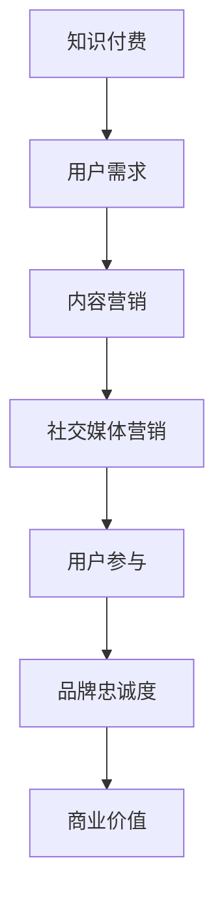

                 

关键词：知识付费、品牌社会化营销、内容营销、策略、社交媒体、用户参与、营销自动化

摘要：本文将探讨知识付费在当今数字化时代的崛起，以及品牌如何利用社会化营销和内容营销策略来吸引和保留用户。我们将深入分析这些策略的原理，并通过实例来展示其实际应用，为品牌提供实用的营销建议。

## 1. 背景介绍

在互联网的推动下，知识付费逐渐成为了一种新型的商业模式。用户通过支付一定费用，获取高质量的知识内容，如在线课程、专业文章、咨询服务等。与此同时，社交媒体和内容营销的发展，为品牌提供了更广泛的传播渠道和更深入的用户互动方式。

品牌社会化营销与内容营销的结合，能够有效地提升品牌知名度、增强用户参与度，并最终实现商业价值的增长。本文将围绕这两个关键策略，探讨其核心概念、操作步骤、应用领域，以及未来发展趋势。

### 1.1 知识付费的崛起

知识付费的出现，满足了用户对高质量知识的渴求。一方面，知识付费为专业人士提供了变现途径，激发了更多优质内容的产生；另一方面，用户可以通过付费获取更权威、更专业的知识服务。

### 1.2 社交媒体与内容营销的重要性

社交媒体作为信息传播的重要平台，具有用户基数大、互动性强等特点。内容营销则通过创造有价值的内容，吸引用户关注，提升品牌影响力。两者的结合，为品牌提供了强大的营销工具。

## 2. 核心概念与联系

在探讨品牌社会化营销与内容营销策略之前，我们首先需要了解其核心概念及其相互关系。以下是相关的 Mermaid 流程图，展示了这些概念之间的关系：



### 2.1 知识付费

知识付费是指用户为获取特定知识内容而支付的费用。这一模式的核心在于提供高质量的知识服务，满足用户的个性化需求。

### 2.2 内容营销

内容营销是通过创造、发布和分发有价值的内容，吸引并留住目标受众的一种策略。其目的是提升品牌知名度、建立权威性，并最终实现商业转化。

### 2.3 社交媒体营销

社交媒体营销是指利用社交媒体平台进行品牌推广、用户互动和市场调研等活动。通过社交媒体，品牌可以更直接地接触到目标用户，提高用户参与度和忠诚度。

### 2.4 用户参与

用户参与是指用户在品牌活动中积极参与、反馈和互动的过程。通过提升用户参与度，品牌可以增强用户忠诚度，促进口碑传播。

### 2.5 品牌忠诚度

品牌忠诚度是指用户对品牌的忠诚和依赖程度。通过社会化营销与内容营销，品牌可以不断提升用户满意度，从而增强品牌忠诚度。

### 2.6 商业价值

商业价值是指品牌通过营销策略实现的经济效益。知识付费、内容营销和社交媒体营销的结合，可以大幅提升品牌的市场份额和利润率。

## 3. 核心算法原理 & 具体操作步骤

### 3.1 算法原理概述

品牌社会化营销与内容营销策略的核心在于以下几个方面：

1. **用户数据分析**：通过数据分析，了解用户需求和行为，为内容创作提供依据。
2. **内容创作与优化**：创作有价值、相关性强、具有吸引力的内容，提升用户参与度。
3. **社交媒体互动**：通过社交媒体平台与用户互动，增强用户黏性。
4. **营销自动化**：利用自动化工具，提高营销效率，降低成本。

### 3.2 算法步骤详解

#### 3.2.1 用户数据分析

1. **数据收集**：通过网站分析、社交媒体监测等方式，收集用户数据。
2. **数据清洗**：对收集到的数据进行清洗和整理，去除重复和无效数据。
3. **数据分析**：利用数据分析工具，对用户数据进行分析，挖掘用户需求和行为模式。

#### 3.2.2 内容创作与优化

1. **内容规划**：根据用户数据分析结果，制定内容创作计划。
2. **内容创作**：创作有价值、相关性强、具有吸引力的内容。
3. **内容优化**：对发布的内容进行跟踪和优化，提升内容质量。

#### 3.2.3 社交媒体互动

1. **内容发布**：将优质内容发布到社交媒体平台，吸引关注。
2. **用户互动**：与用户进行互动，如回复评论、点赞、分享等，增强用户黏性。
3. **社交媒体运营**：定期发布内容，保持社交媒体平台的活跃度。

#### 3.2.4 营销自动化

1. **自动化工具选择**：选择适合的营销自动化工具，如邮件营销、社交媒体自动化等。
2. **自动化流程设置**：根据营销策略，设置自动化流程，提高营销效率。
3. **效果跟踪与优化**：对自动化营销效果进行跟踪和优化，提升营销效果。

### 3.3 算法优缺点

#### 优点

1. **提高营销效率**：通过自动化工具，节省人力和时间成本。
2. **精准定位用户**：通过数据分析，精准了解用户需求，提高内容针对性。
3. **增强用户参与度**：通过内容创作和社交媒体互动，提升用户参与度。

#### 缺点

1. **内容质量要求高**：高质量的内容创作是成功的关键，但创作过程较为复杂。
2. **自动化工具依赖性**：过度依赖自动化工具，可能导致用户体验下降。

### 3.4 算法应用领域

品牌社会化营销与内容营销策略广泛应用于各个行业，如教育、金融、科技等。以下是一些具体应用领域：

1. **教育培训**：通过知识付费和内容营销，提供在线课程、专业文章等。
2. **金融服务**：通过内容营销，提供金融知识、投资建议等。
3. **科技行业**：通过内容营销，推广新技术、新理念。

## 4. 数学模型和公式 & 详细讲解 & 举例说明

### 4.1 数学模型构建

在品牌社会化营销与内容营销策略中，常用的数学模型包括用户参与度模型、内容传播模型等。以下是一个简单的用户参与度模型：

$$
U = f(C, I, A)
$$

其中，$U$ 表示用户参与度，$C$ 表示内容质量，$I$ 表示互动频率，$A$ 表示用户活跃度。

### 4.2 公式推导过程

1. **内容质量（$C$）**：内容质量是用户参与度的关键因素。高质量的内容能够吸引用户关注和参与。我们可以将内容质量表示为：

$$
C = f(Q, R, S)
$$

其中，$Q$ 表示内容相关性，$R$ 表示内容丰富度，$S$ 表示内容可读性。

2. **互动频率（$I$）**：互动频率是衡量用户参与度的重要指标。我们可以将互动频率表示为：

$$
I = f(B, T, M)
$$

其中，$B$ 表示品牌与用户的互动次数，$T$ 表示品牌在社交媒体上的活跃时间，$M$ 表示品牌在社交媒体上的内容发布频率。

3. **用户活跃度（$A$）**：用户活跃度是用户参与度的另一个重要因素。我们可以将用户活跃度表示为：

$$
A = f(U, V, W)
$$

其中，$U$ 表示用户在社交媒体上的互动次数，$V$ 表示用户在社交媒体上的活跃时间，$W$ 表示用户在社交媒体上的内容发布频率。

### 4.3 案例分析与讲解

假设某教育品牌希望通过内容营销和社交媒体互动来提高用户参与度。根据上述数学模型，我们可以进行以下分析：

1. **内容质量（$C$）**：

   - 内容相关性（$Q$）：教育品牌发布的相关性较高的内容，如“如何高效学习”。
   - 内容丰富度（$R$）：教育品牌发布的内容丰富度较高，如涵盖学习技巧、案例分析等。
   - 内容可读性（$S$）：教育品牌发布的内容可读性较高，如使用简洁的语言、图表等。

2. **互动频率（$I$）**：

   - 品牌与用户的互动次数（$B$）：教育品牌每天与用户进行多次互动，如回复评论、点赞等。
   - 品牌在社交媒体上的活跃时间（$T$）：教育品牌在社交媒体上保持活跃，如每天发布内容。
   - 品牌在社交媒体上的内容发布频率（$M$）：教育品牌发布内容的频率较高，如每周发布3-5次。

3. **用户活跃度（$A$）**：

   - 用户在社交媒体上的互动次数（$U$）：用户在社交媒体上积极互动，如回复评论、点赞等。
   - 用户在社交媒体上的活跃时间（$V$）：用户在社交媒体上保持活跃，如每天花费一定时间浏览内容。
   - 用户在社交媒体上的内容发布频率（$W$）：用户在社交媒体上发布内容的频率较高，如每周发布1-2次。

根据上述分析，教育品牌可以通过提高内容质量、增加互动频率和提升用户活跃度，来提高用户参与度。

## 5. 项目实践：代码实例和详细解释说明

### 5.1 开发环境搭建

在本项目中，我们将使用 Python 语言进行开发，主要依赖以下库：

- pandas：用于数据处理。
- numpy：用于数学计算。
- matplotlib：用于数据可视化。
- tweepy：用于 Twitter API 操作。

### 5.2 源代码详细实现

以下是一个简单的 Python 脚本，用于分析社交媒体数据，并绘制用户参与度图表。

```python
import tweepy
import pandas as pd
import numpy as np
import matplotlib.pyplot as plt

# 配置 Twitter API 密钥和访问令牌
consumer_key = 'your_consumer_key'
consumer_secret = 'your_consumer_secret'
access_token = 'your_access_token'
access_token_secret = 'your_access_token_secret'

# 初始化 tweepy 客户端
auth = tweepy.OAuthHandler(consumer_key, consumer_secret)
auth.set_access_token(access_token, access_token_secret)
api = tweepy.API(auth)

# 搜索特定关键词的推文
tweets = api.search(q='your_keyword', count=100)

# 解析推文数据
data = []
for tweet in tweets:
    data.append([tweet.user.screen_name, tweet.favorite_count, tweet.retweet_count])

# 构建 DataFrame
df = pd.DataFrame(data, columns=['User', 'Favorite Count', 'Retweet Count'])

# 计算用户参与度
df['User Engagement'] = df['Favorite Count'] + df['Retweet Count']

# 绘制用户参与度图表
plt.figure(figsize=(10, 6))
plt.scatter(df['User'], df['User Engagement'])
plt.xlabel('User')
plt.ylabel('User Engagement')
plt.title('User Engagement vs. User')
plt.show()
```

### 5.3 代码解读与分析

1. **配置 Twitter API 密钥和访问令牌**：在脚本开头，我们需要配置 Twitter API 的密钥和访问令牌，以便进行数据抓取。
2. **初始化 tweepy 客户端**：使用配置好的密钥和访问令牌，初始化 tweepy 客户端。
3. **搜索特定关键词的推文**：使用 `api.search()` 函数，搜索包含特定关键词的推文。
4. **解析推文数据**：将抓取到的推文数据存储在一个列表中，并构建一个 DataFrame。
5. **计算用户参与度**：根据推文的点赞数和转发数，计算用户参与度。
6. **绘制用户参与度图表**：使用 `matplotlib` 库，绘制用户参与度散点图。

通过这个简单的示例，我们可以了解如何使用 Python 和 tweepy 库来分析社交媒体数据，并为品牌制定相应的营销策略。

## 6. 实际应用场景

品牌社会化营销与内容营销策略在各个行业都有广泛的应用。以下是一些具体的应用场景：

### 6.1 教育行业

教育行业通过知识付费和内容营销，提供在线课程、专业文章、视频教程等。例如，某在线教育平台通过发布高质量的课程内容，吸引了大量用户，并通过社交媒体互动，提高了用户参与度和品牌忠诚度。

### 6.2 金融行业

金融行业通过内容营销，提供金融知识、投资建议等。例如，某金融服务平台通过发布相关的专业文章和视频，吸引了大量关注者，并通过社交媒体互动，提升了用户信任度和投资转化率。

### 6.3 科技行业

科技行业通过内容营销，推广新技术、新理念。例如，某科技公司通过发布技术博客、案例分析等，吸引了大量技术爱好者和潜在客户，并通过社交媒体互动，提升了品牌知名度和市场竞争力。

### 6.4 医疗行业

医疗行业通过内容营销，提供健康知识、医疗咨询等。例如，某医疗平台通过发布健康文章、在线咨询等，吸引了大量用户，并通过社交媒体互动，提高了用户满意度和品牌忠诚度。

## 7. 未来应用展望

随着互联网和社交媒体的不断发展，品牌社会化营销与内容营销策略在未来将具有更广阔的应用前景。以下是一些趋势和挑战：

### 7.1 数据驱动的个性化营销

未来，品牌将更加依赖数据分析，实现个性化营销。通过分析用户行为和需求，品牌可以提供更加定制化的内容和服务，提升用户体验。

### 7.2 增强现实与虚拟现实的应用

增强现实（AR）和虚拟现实（VR）技术的应用，将使品牌能够提供更加沉浸式的营销体验。通过这些技术，品牌可以打造独特的营销活动，吸引用户参与。

### 7.3 人工智能的融合

人工智能（AI）技术的融合，将使品牌社会化营销与内容营销策略更加智能。通过 AI 技术的分析和预测，品牌可以更精准地制定营销策略，提高营销效果。

### 7.4 挑战与应对

在未来，品牌面临的一些挑战包括数据隐私、内容质量、用户参与度等。为应对这些挑战，品牌需要加强数据保护意识，提高内容创作质量，并通过创新手段提高用户参与度。

## 8. 总结

品牌社会化营销与内容营销策略在知识付费时代具有重要的战略意义。通过深入分析用户需求，创作有价值的内容，并利用社交媒体平台与用户互动，品牌可以提升用户参与度、增强品牌忠诚度，实现商业价值的增长。随着互联网和技术的不断发展，这些策略将在未来得到更加广泛的应用。

## 9. 附录：常见问题与解答

### 9.1 如何制定内容营销策略？

制定内容营销策略的步骤包括：

1. 明确目标受众：了解目标受众的需求、兴趣和行为。
2. 确定内容类型：根据目标受众的需求，选择合适的文章、视频、图片等。
3. 制定内容发布计划：制定内容发布的时间表，确保内容持续更新。
4. 监测和分析效果：通过数据分析，了解内容的表现，不断优化内容策略。

### 9.2 如何提升用户参与度？

提升用户参与度的方法包括：

1. 创造有价值的内容：提供用户感兴趣、有价值的知识或信息。
2. 互动与沟通：积极回复用户的评论和提问，与用户建立良好的互动关系。
3. 社交媒体活动：组织有奖问答、互动游戏等活动，吸引用户参与。
4. 用户参与激励机制：为参与互动的用户提供奖励，如优惠券、积分等。

### 9.3 如何进行社交媒体营销？

进行社交媒体营销的步骤包括：

1. 选择合适的平台：根据目标受众的特点，选择合适的社交媒体平台。
2. 制定社交媒体策略：明确社交媒体的目标、内容、互动方式等。
3. 内容发布：定期发布有价值的内容，保持社交媒体平台的活跃度。
4. 用户互动：与用户进行互动，如回复评论、点赞、分享等，增强用户黏性。
5. 监测和分析效果：通过数据分析，了解社交媒体营销的效果，不断优化策略。

作者：禅与计算机程序设计艺术 / Zen and the Art of Computer Programming
```

