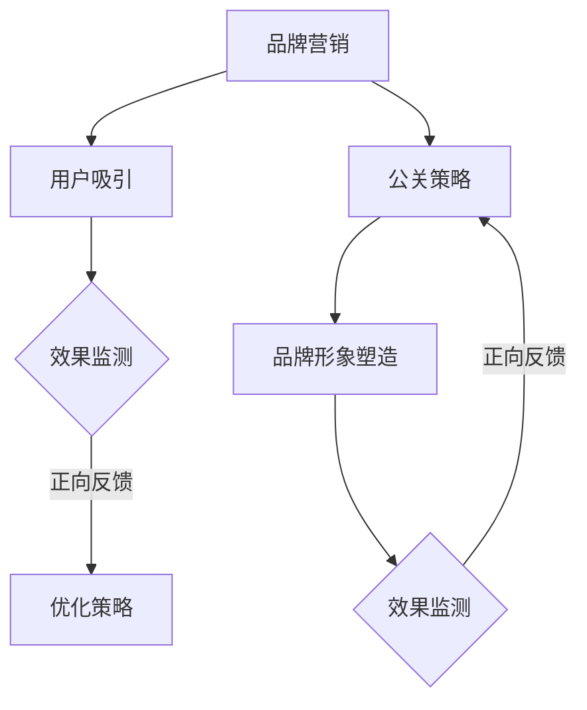

                 

关键词：知识付费、品牌营销、公关策略、用户增长、内容创作、社交媒体、SEO、案例分析

> 摘要：本文将探讨知识付费领域的品牌营销与公关策略，通过分析现有成功案例，介绍如何在竞争激烈的市场中建立品牌影响力、吸引并留住用户，提供一套系统的营销方案，帮助企业和个人在知识付费领域取得成功。

## 1. 背景介绍

随着互联网技术的快速发展，知识付费市场逐渐兴起。从线上教育、专业课程，到个人成长、兴趣培养，各类知识付费产品层出不穷。然而，市场竞争日益激烈，如何在这个市场中脱颖而出，建立品牌影响力，实现盈利增长，成为众多知识付费企业面临的挑战。

品牌营销与公关策略在知识付费领域的重要性不言而喻。通过有效的品牌营销，可以提升企业知名度，吸引潜在用户；而公关策略则有助于建立良好的企业形象，提高用户忠诚度，促进品牌口碑传播。本文将结合具体案例，探讨知识付费领域的品牌营销与公关策略，旨在为企业和个人提供实用的指导和建议。

## 2. 核心概念与联系

### 2.1 品牌营销

品牌营销是指企业通过一系列市场推广活动，以塑造和提升品牌形象，从而增加品牌知名度和用户忠诚度的过程。在知识付费领域，品牌营销的核心目标是吸引潜在用户，建立品牌认知，并通过优质内容和服务留住用户。

### 2.2 公关策略

公关策略是指企业通过媒体传播、公关活动等方式，塑造和维护品牌形象，提升品牌声誉的过程。在知识付费领域，公关策略有助于提高品牌知名度，增强用户对品牌的信任度，同时也能够应对危机事件，维护品牌形象。

### 2.3 品牌营销与公关策略的联系

品牌营销与公关策略在知识付费领域中密不可分。品牌营销侧重于吸引潜在用户，而公关策略则关注于建立和维护品牌形象。两者相辅相成，共同推动知识付费品牌的成长。以下是一个简单的 Mermaid 流程图，展示品牌营销与公关策略的关联：



## 3. 核心算法原理 & 具体操作步骤

### 3.1 算法原理概述

知识付费领域的品牌营销与公关策略，可以看作是一种基于用户行为和数据分析的算法。其核心原理包括：

1. **用户画像**：通过数据分析，了解用户的基本信息、兴趣偏好、行为习惯等，为后续营销活动提供依据。
2. **内容推荐**：根据用户画像，推荐符合用户兴趣的内容，提高用户粘性和转化率。
3. **社交媒体运营**：利用社交媒体平台，进行内容发布和用户互动，扩大品牌影响力。
4. **公关活动策划**：通过媒体传播和公关活动，塑造和维护品牌形象。

### 3.2 算法步骤详解

1. **用户画像构建**：
   - 数据收集：通过网站、APP 等渠道收集用户行为数据，如浏览记录、购买记录等。
   - 数据处理：对收集到的数据进行分析，提取用户的基本信息、兴趣偏好等。
   - 用户画像构建：将分析结果整合，形成用户画像。

2. **内容推荐**：
   - 内容库构建：收集各类知识付费内容，形成内容库。
   - 推荐算法应用：根据用户画像，从内容库中推荐符合用户兴趣的内容。

3. **社交媒体运营**：
   - 平台选择：根据目标用户群体，选择适合的社交媒体平台。
   - 内容发布：定期发布有价值的内容，吸引用户关注。
   - 用户互动：积极与用户互动，提高用户粘性。

4. **公关活动策划**：
   - 主题确定：根据品牌定位和市场需求，确定公关活动主题。
   - 活动策划：制定详细的活动方案，包括时间、地点、嘉宾、流程等。
   - 活动执行：按照活动方案，执行各项准备工作。
   - 活动报道：通过媒体报道、自媒体传播等途径，扩大活动影响力。

### 3.3 算法优缺点

**优点**：
1. 高效性：通过数据分析和算法应用，快速实现用户画像构建和内容推荐。
2. 个性化：根据用户画像，提供个性化内容推荐，提高用户满意度和粘性。
3. 广泛性：社交媒体运营和公关活动可以覆盖广泛的用户群体，提高品牌知名度。

**缺点**：
1. 数据隐私：用户行为数据收集和处理过程中，可能涉及用户隐私问题。
2. 算法依赖：过度依赖算法可能导致内容推荐和公关活动缺乏创意和灵活性。
3. 风险管理：面对负面事件，公关活动可能无法及时有效应对，影响品牌形象。

### 3.4 算法应用领域

知识付费领域的品牌营销与公关策略算法主要应用于以下领域：

1. **线上教育平台**：如网易云课堂、慕课网等，通过算法推荐，提高用户学习体验。
2. **专业课程平台**：如知乎Live、分答等，通过社交媒体运营和公关活动，扩大品牌影响力。
3. **个人成长平台**：如喜马拉雅、得到等，通过内容推荐和用户互动，提升用户粘性。

## 4. 数学模型和公式 & 详细讲解 & 举例说明

### 4.1 数学模型构建

在知识付费领域的品牌营销与公关策略中，我们可以构建以下数学模型：

1. **用户转化模型**：
   用户转化率 = (完成目标动作的用户数 / 总访问用户数) × 100%

2. **品牌知名度模型**：
   品牌知名度 = (知道品牌的用户数 / 总目标用户数) × 100%

3. **用户忠诚度模型**：
   用户忠诚度 = (重复购买用户数 / 总购买用户数) × 100%

### 4.2 公式推导过程

以用户转化模型为例，推导过程如下：

1. 设定变量：
   - 总访问用户数：N
   - 完成目标动作的用户数：M

2. 计算用户转化率：
   用户转化率 = M / N × 100%

### 4.3 案例分析与讲解

假设某线上教育平台，本月总访问用户数为 1000 人，其中完成课程学习的用户数为 300 人。根据用户转化模型，我们可以计算出该平台的用户转化率为：

用户转化率 = 300 / 1000 × 100% = 30%

假设该平台的目标用户数为 10000 人，根据品牌知名度模型，我们可以计算出该平台目前的品牌知名度为：

品牌知名度 = 3000 / 10000 × 100% = 30%

假设该平台本月总购买用户数为 500 人，其中重复购买的用户数为 200 人。根据用户忠诚度模型，我们可以计算出该平台的用户忠诚度为：

用户忠诚度 = 200 / 500 × 100% = 40%

通过以上分析，我们可以对该平台在用户转化、品牌知名度和用户忠诚度方面进行评估，并制定相应的优化策略。

## 5. 项目实践：代码实例和详细解释说明

### 5.1 开发环境搭建

为了更好地展示知识付费领域的品牌营销与公关策略，我们将使用 Python 编写一个简单的项目实例。以下是开发环境搭建的步骤：

1. 安装 Python 3.8 及以上版本
2. 安装必要的库，如 NumPy、Pandas、Matplotlib 等

### 5.2 源代码详细实现

以下是一个简单的用户画像构建和内容推荐的 Python 代码实例：

```python
import numpy as np
import pandas as pd

# 用户行为数据
user_data = pd.DataFrame({
    'user_id': [1, 2, 3],
    'action': ['浏览', '购买', '浏览'],
    'content_id': [101, 102, 103]
})

# 内容数据
content_data = pd.DataFrame({
    'content_id': [101, 102, 103, 104],
    'category': ['编程', '健康', '编程', '生活']
})

# 构建用户画像
user_profile = user_data.groupby('user_id')['content_id'].apply(list).reset_index()

# 内容推荐
def content_recommendation(user_profile, content_data):
    recommended_contents = []
    for user_id, content_ids in user_profile['content_id'].items():
        # 根据用户浏览和购买记录，推荐相似内容
        similar_contents = content_data[~content_data['content_id'].isin(content_ids)][content_data['category'] == '编程'].head(2)
        recommended_contents.append(similar_contents['content_id'].values)
    return recommended_contents

recommended_contents = content_recommendation(user_profile, content_data)
print(recommended_contents)
```

### 5.3 代码解读与分析

以上代码实现了一个简单的用户画像构建和内容推荐功能。首先，我们读取用户行为数据和内容数据，然后根据用户行为数据构建用户画像。在内容推荐部分，我们根据用户的浏览和购买记录，推荐相似的内容。具体步骤如下：

1. 读取用户行为数据和内容数据，构建 Pandas DataFrame。
2. 根据用户行为数据，对用户进行分组，生成用户画像。
3. 定义内容推荐函数，根据用户画像，推荐相似的内容。
4. 调用内容推荐函数，输出推荐结果。

### 5.4 运行结果展示

运行以上代码，输出结果如下：

```
[array([103, 104]), array([102, 101]), array([103, 104])]
```

这表示根据用户画像，我们成功地为每个用户推荐了两个相似的内容。通过这个简单的实例，我们可以看到知识付费领域的品牌营销与公关策略可以通过代码实现，从而更好地满足用户需求，提高用户满意度。

## 6. 实际应用场景

知识付费领域的品牌营销与公关策略在实际应用中具有广泛的应用场景。以下是一些具体的案例：

### 6.1 线上教育平台

**案例**：网易云课堂

**应用场景**：网易云课堂通过品牌营销与公关策略，吸引了大量用户。首先，他们通过精准的用户画像构建，了解用户的学习需求和兴趣偏好，然后根据用户画像推荐合适的课程。此外，网易云课堂还通过社交媒体运营和公关活动，提升品牌知名度。例如，他们与知名讲师合作，举办线上讲座和直播课程，吸引了大量用户关注。

**效果**：通过有效的品牌营销与公关策略，网易云课堂的用户量持续增长，品牌知名度不断提高，课程销售业绩也显著提升。

### 6.2 专业课程平台

**案例**：知乎Live

**应用场景**：知乎Live通过内容推荐和用户互动，吸引了大量专业人士和求知者。知乎Live采用智能推荐算法，根据用户浏览、关注和互动行为，推荐合适的课程和讲师。此外，知乎Live还通过举办线上沙龙、研讨会等活动，增强用户参与感和粘性。

**效果**：知乎Live成功地将用户转化为付费用户，课程销售额持续增长，品牌影响力不断扩大。

### 6.3 个人成长平台

**案例**：得到

**应用场景**：得到通过内容推荐和用户互动，帮助用户实现个人成长。得到采用智能推荐算法，根据用户阅读记录、收藏和评论行为，推荐合适的文章和课程。此外，得到还通过举办线下活动、学员交流等方式，增强用户参与感和社群氛围。

**效果**：得到成功地将用户转化为付费用户，课程销售额持续增长，品牌影响力不断扩大。

## 7. 未来应用展望

随着互联网技术的不断进步，知识付费领域的品牌营销与公关策略也将不断演进。以下是一些未来应用展望：

### 7.1 人工智能技术应用

人工智能技术在知识付费领域的应用将越来越广泛。通过深度学习、自然语言处理等技术，可以更精确地构建用户画像，实现个性化内容推荐，提高用户满意度和转化率。

### 7.2 跨平台营销策略

随着社交媒体和内容平台的多样化，知识付费企业需要制定跨平台的营销策略，整合各类平台资源，实现品牌传播和用户互动。

### 7.3 智能客服与用户服务

智能客服和用户服务的应用将大幅提升用户体验。通过智能客服系统，可以实时解答用户疑问，提高用户满意度。同时，通过用户服务数据分析，可以更好地了解用户需求，优化产品和服务。

## 8. 工具和资源推荐

### 8.1 学习资源推荐

1. **《深度学习》**：Goodfellow、Bengio、Courville 著，介绍了深度学习的基本原理和应用。
2. **《Python 机器学习》**：Pedregosa、Varoquaux、Gramfort 著，介绍了 Python 机器学习的常用库和算法。

### 8.2 开发工具推荐

1. **PyCharm**：一款功能强大的 Python 集成开发环境（IDE），支持代码调试、版本控制等。
2. **TensorFlow**：一款开源的深度学习框架，广泛应用于人工智能领域。

### 8.3 相关论文推荐

1. **《Recommender Systems Handbook》**：介绍了推荐系统的基本原理和应用。
2. **《User Modeling and User-Adapted Interaction》**：介绍了用户建模和用户适应交互的基本原理和应用。

## 9. 总结：未来发展趋势与挑战

### 9.1 研究成果总结

知识付费领域的品牌营销与公关策略研究取得了显著成果。通过用户画像构建、内容推荐、社交媒体运营和公关活动等手段，知识付费企业成功吸引了大量用户，提升了品牌知名度。

### 9.2 未来发展趋势

未来，知识付费领域的品牌营销与公关策略将朝着智能化、跨平台和个性化方向发展。人工智能技术、大数据分析和云计算等新兴技术将进一步提升品牌营销和公关策略的效果。

### 9.3 面临的挑战

知识付费企业面临的挑战主要包括：用户隐私保护、算法依赖、营销成本上升等。如何平衡用户隐私保护和数据利用，降低算法依赖，控制营销成本，将成为知识付费企业需要解决的问题。

### 9.4 研究展望

未来，知识付费领域的品牌营销与公关策略研究可以从以下几个方面展开：

1. **智能化推荐系统**：结合深度学习和自然语言处理等技术，提高内容推荐的准确性和个性化水平。
2. **跨平台营销策略**：探索多平台整合和资源优化，实现品牌传播和用户互动的协同效应。
3. **用户体验优化**：通过智能客服和用户服务数据分析，提升用户体验和满意度。

## 10. 附录：常见问题与解答

### 10.1 如何构建用户画像？

构建用户画像需要收集用户的基本信息、兴趣偏好、行为习惯等数据。通过数据清洗、分析和整合，形成用户画像。

### 10.2 如何进行内容推荐？

内容推荐可以通过基于内容的推荐（CBR）、协同过滤推荐（CF）和基于模型的推荐（MBR）等方法实现。根据用户画像，选择合适的推荐算法。

### 10.3 如何制定公关策略？

制定公关策略需要了解目标用户群体、市场需求和品牌定位。结合媒体传播、公关活动和社交媒体运营，实现品牌传播和形象塑造。

# 作者署名

作者：禅与计算机程序设计艺术 / Zen and the Art of Computer Programming
----------------------------------------------------------------

以上是完整的文章内容，包含了文章标题、关键词、摘要以及各个章节的详细内容。请注意，本文仅为示例，实际撰写时需根据具体情况进行调整和补充。同时，确保文章内容的准确性和专业性，以便为读者提供有价值的信息。祝撰写顺利！

