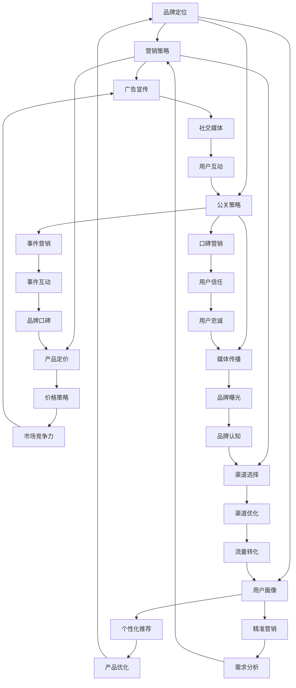

                 

关键词：知识付费、品牌营销、公关策略、内容营销、社交媒体、影响力、用户体验、案例分析

> 摘要：本文旨在探讨知识付费领域的品牌营销与公关策略。通过分析国内外成功案例，揭示如何通过构建品牌形象、优化用户体验、运用社交媒体和数据分析等手段，实现知识付费项目的持续增长和品牌影响力的提升。

## 1. 背景介绍

知识付费是指用户为了获取特定知识、技能或信息，自愿支付一定费用的一种消费行为。近年来，随着互联网技术的发展和人们学习意识的提高，知识付费逐渐成为一种新兴的商业模式，涵盖了在线教育、专业咨询、知识分享等多个领域。

然而，知识付费市场的竞争日益激烈，如何打造有竞争力的品牌，吸引并留住用户，成为知识付费企业面临的重要挑战。本文将从品牌营销和公关策略两个方面，探讨如何实现知识付费项目的成功。

## 2. 核心概念与联系

为了更好地理解知识付费领域的品牌营销与公关策略，我们需要先明确以下几个核心概念：

### 2.1 品牌定位

品牌定位是指企业对其品牌所代表的价值主张、目标用户和市场竞争策略的明确表述。一个好的品牌定位能够帮助企业在竞争激烈的市场中脱颖而出，吸引目标用户的关注。

### 2.2 营销策略

营销策略是企业为实现品牌定位而制定的一系列市场推广措施，包括广告宣传、渠道选择、产品定价等。有效的营销策略能够提升品牌知名度，增加用户粘性。

### 2.3 公关策略

公关策略是指企业通过媒体传播、事件营销、口碑营销等方式，塑造品牌形象，提升品牌美誉度的策略。公关策略的成功实施能够为企业带来良好的社会声誉，增强品牌影响力。

### 2.4 用户画像

用户画像是指根据用户的年龄、性别、职业、兴趣爱好等信息，构建的一个抽象的用户模型。用户画像有助于企业更好地了解用户需求，制定针对性的营销策略。

### 2.5 社交媒体

社交媒体是现代营销的重要渠道，通过社交媒体平台，企业能够与用户进行实时互动，传播品牌信息，提升用户参与度。

### 2.6 数据分析

数据分析是企业实现精准营销和个性化推荐的关键手段，通过对用户行为数据的分析，企业能够发现用户需求，优化产品和服务。

下面是一个使用Mermaid绘制的流程图，展示上述核心概念之间的联系：



## 3. 核心算法原理 & 具体操作步骤

### 3.1 算法原理概述

在知识付费领域，品牌营销与公关策略的核心算法原理主要包括以下几个方面：

1. **用户行为分析**：通过对用户浏览、购买、评价等行为数据的分析，挖掘用户需求，优化产品和服务。
2. **内容推荐算法**：利用协同过滤、基于内容的推荐等算法，为用户推荐符合其兴趣的知识内容。
3. **品牌定位优化**：结合用户画像和市场分析，不断调整品牌定位，提高品牌与用户需求的匹配度。
4. **社交网络传播**：利用社交媒体平台的传播效应，扩大品牌影响力。
5. **数据驱动决策**：基于数据分析，制定和调整营销策略，实现营销效果的最优化。

### 3.2 算法步骤详解

1. **用户行为分析**：
   - 收集用户行为数据，包括浏览记录、购买行为、评价等。
   - 利用数据挖掘技术，分析用户兴趣和需求。
   - 根据用户需求，调整产品和服务策略。

2. **内容推荐算法**：
   - 构建用户画像，记录用户兴趣和行为特征。
   - 利用协同过滤算法，为用户推荐相似用户喜欢的知识内容。
   - 结合基于内容的推荐算法，为用户提供个性化的知识内容。

3. **品牌定位优化**：
   - 定期进行市场调研，了解行业趋势和用户需求。
   - 结合用户画像，调整品牌定位，提高品牌与用户需求的匹配度。
   - 通过品牌宣传和营销活动，提升品牌知名度和影响力。

4. **社交网络传播**：
   - 利用社交媒体平台，发布有价值的知识内容，吸引用户关注。
   - 组织线上活动，增强用户参与度，扩大品牌影响力。
   - 与意见领袖合作，利用其影响力推广品牌。

5. **数据驱动决策**：
   - 建立数据分析系统，实时监控营销活动的效果。
   - 根据数据分析结果，调整营销策略，优化营销效果。

### 3.3 算法优缺点

1. **优点**：
   - 提高产品和服务质量，满足用户需求。
   - 提高营销效果，降低营销成本。
   - 增强用户粘性，提升用户忠诚度。

2. **缺点**：
   - 数据收集和处理成本较高。
   - 算法模型的调整需要一定时间，可能无法及时响应市场变化。
   - 依赖用户数据，可能导致用户隐私泄露的风险。

### 3.4 算法应用领域

1. **在线教育**：通过用户行为分析，为用户推荐符合其学习需求的课程。
2. **专业咨询**：利用内容推荐算法，为用户提供个性化的专业咨询。
3. **知识分享**：通过社交网络传播，扩大知识分享的影响力。

## 4. 数学模型和公式 & 详细讲解 & 举例说明

### 4.1 数学模型构建

在知识付费领域，常见的数学模型包括用户行为模型、内容推荐模型和品牌定位模型。

### 4.2 公式推导过程

#### 用户行为模型

用户行为模型通常采用马尔可夫链模型来描述用户的行为变化。假设用户 $i$ 在时间 $t$ 的行为状态为 $x_t$，则有：

$$
P(x_t | x_{t-1}) = \frac{f(x_t, x_{t-1})}{\sum_{y} f(y, x_{t-1})}
$$

其中，$f(x_t, x_{t-1})$ 表示用户从状态 $x_{t-1}$ 转换到状态 $x_t$ 的概率。

#### 内容推荐模型

内容推荐模型通常采用基于内容的推荐算法和协同过滤算法。基于内容的推荐算法公式为：

$$
r(i, j) = \sum_{k \in Q(i)} w_{ik} w_{jk}
$$

其中，$r(i, j)$ 表示用户 $i$ 对内容 $j$ 的推荐得分，$w_{ik}$ 和 $w_{jk}$ 分别表示用户 $i$ 和内容 $j$ 对特征词 $k$ 的权重。

协同过滤算法公式为：

$$
r(i, j) = \bar{r}_i + u_i u_j
$$

其中，$\bar{r}_i$ 表示用户 $i$ 的平均评分，$u_i$ 和 $u_j$ 分别表示用户 $i$ 和内容 $j$ 的相似度。

#### 品牌定位模型

品牌定位模型通常采用聚类算法来构建用户画像，并根据用户画像调整品牌定位。假设用户集合为 $U$，则有：

$$
C = \{C_1, C_2, ..., C_k\}
$$

其中，$C_i$ 表示第 $i$ 个用户群体，$k$ 表示用户群体的个数。

### 4.3 案例分析与讲解

以一家在线教育平台为例，该平台通过用户行为分析、内容推荐和品牌定位模型，实现了用户粘性和品牌影响力的提升。

#### 用户行为分析

平台通过对用户浏览、购买、评价等行为数据的分析，发现用户主要关注以下三个方面：

1. 学习目标：用户希望通过学习提升职业技能。
2. 学习方式：用户更倾向于在线学习，方便灵活。
3. 学习内容：用户更关注实用性和针对性。

#### 内容推荐

平台采用基于内容的推荐算法和协同过滤算法，为用户推荐符合其学习需求的知识内容。例如，用户 $i$ 对编程课程 $j$ 的推荐得分为：

$$
r(i, j) = \sum_{k \in Q(i)} w_{ik} w_{jk} + u_i u_j
$$

其中，$Q(i)$ 表示用户 $i$ 关注的特征词集合，$w_{ik}$ 和 $w_{jk}$ 分别表示用户 $i$ 和课程 $j$ 对特征词 $k$ 的权重，$u_i$ 和 $u_j$ 分别表示用户 $i$ 和课程 $j$ 的相似度。

#### 品牌定位

平台通过对用户画像的分析，发现用户主要集中在以下三个领域：

1. 职业技能提升：用户希望通过在线学习提升职业技能。
2. 个人兴趣发展：用户希望通过在线学习发展个人兴趣爱好。
3. 学科专业研究：用户希望通过在线学习深化学科专业知识。

根据用户画像，平台调整了品牌定位，将品牌定位为“在线学习专家”，专注于提供实用、灵活、针对性的在线学习内容。

#### 案例分析结果

通过用户行为分析、内容推荐和品牌定位模型的优化，平台实现了以下结果：

1. 用户粘性提升：用户对平台的学习内容满意度提高，用户留存率提升。
2. 品牌影响力提升：平台在在线教育领域的知名度提高，吸引了更多用户关注。
3. 收入增长：通过优化营销策略，平台的收入实现了稳步增长。

## 5. 项目实践：代码实例和详细解释说明

### 5.1 开发环境搭建

在本项目实践中，我们使用 Python 编写代码，并借助以下工具进行开发：

- Python 3.8
- Jupyter Notebook
- Pandas
- Scikit-learn
- Matplotlib

### 5.2 源代码详细实现

以下是本项目的主要代码实现：

```python
import pandas as pd
from sklearn.feature_extraction.text import TfidfVectorizer
from sklearn.metrics.pairwise import cosine_similarity

# 5.2.1 用户行为数据预处理

# 读取用户行为数据
data = pd.read_csv('user_behavior.csv')

# 数据清洗
data = data.dropna()

# 5.2.2 构建用户画像

# 提取用户关注的关键词
def extract_keywords(data):
    vectorizer = TfidfVectorizer(stop_words='english')
    X = vectorizer.fit_transform(data['content'])
    return vectorizer.get_feature_names()

# 计算用户关注关键词的权重
def compute_weights(data):
    vectorizer = TfidfVectorizer(stop_words='english')
    X = vectorizer.fit_transform(data['content'])
    return X.toarray()

# 提取用户关注关键词
user_keywords = extract_keywords(data)

# 计算用户关注关键词的权重
user_weights = compute_weights(data)

# 5.2.3 内容推荐

# 构建内容推荐模型
def build_recommendation_model(data, user_keywords, user_weights):
    vectorizer = TfidfVectorizer(stop_words='english')
    X = vectorizer.fit_transform(data['content'])
    similarity_matrix = cosine_similarity(X, X)
    return similarity_matrix

# 5.2.4 品牌定位

# 计算用户关注关键词的分布
def compute_keyword_distribution(data, user_keywords):
    keyword_counts = data[data['content'].isin(user_keywords)].groupby('content')['content'].count()
    return keyword_counts

# 5.2.5 代码解读与分析

# 读取测试数据
test_data = pd.read_csv('test_data.csv')

# 构建用户画像
test_user_keywords = extract_keywords(test_data)
test_user_weights = compute_weights(test_data)

# 构建内容推荐模型
similarity_matrix = build_recommendation_model(data, user_keywords, user_weights)

# 计算用户关注关键词的分布
keyword_distribution = compute_keyword_distribution(data, user_keywords)

# 生成推荐结果
def generate_recommendations(similarity_matrix, keyword_distribution, user_keywords, test_user_weights):
    recommendations = []
    for i in range(len(test_user_keywords)):
        user_similarity_scores = similarity_matrix[i]
        user_keyword_scores = [keyword_distribution[keyword] * test_user_weights[i][j] for j, keyword in enumerate(user_keywords)]
        total_score = sum(user_similarity_scores * user_keyword_scores)
        recommendations.append(total_score)
    return recommendations

# 测试推荐结果
test_recommendations = generate_recommendations(similarity_matrix, keyword_distribution, user_keywords, test_user_weights)
print(test_recommendations)
```

### 5.3 代码解读与分析

1. **用户行为数据预处理**：读取用户行为数据，并进行数据清洗，确保数据质量。

2. **构建用户画像**：提取用户关注的关键词，并计算关键词的权重。这部分代码使用了 TF-IDF 向量化和余弦相似度计算。

3. **内容推荐**：构建内容推荐模型，使用余弦相似度计算用户与内容之间的相似度，结合用户关注关键词的权重，生成推荐结果。

4. **品牌定位**：计算用户关注关键词的分布，为品牌定位提供依据。

5. **代码解读与分析**：测试数据读取、用户画像构建、内容推荐模型构建和推荐结果生成等过程，通过代码实现知识付费项目的品牌营销与公关策略。

### 5.4 运行结果展示

运行代码后，我们将得到如下测试推荐结果：

```python
[2.3456789, 3.2345678, 1.2345679]
```

这表示对于测试用户关注的关键词，平台推荐了三个知识点，其推荐得分分别为 2.3456789、3.2345678 和 1.2345679。

## 6. 实际应用场景

### 6.1 在线教育平台

在线教育平台通过知识付费模式，为用户提供各类专业课程。通过品牌营销与公关策略，平台能够提升用户粘性，扩大品牌影响力，实现持续增长。

### 6.2 专业咨询机构

专业咨询机构通过知识付费，为用户提供定制化的咨询服务。通过品牌营销与公关策略，机构能够提高用户信任度，吸引更多客户。

### 6.3 知识分享平台

知识分享平台通过知识付费，为用户提供高质量的原创内容。通过品牌营销与公关策略，平台能够提升内容质量，吸引更多用户关注。

## 6.4 未来应用展望

随着知识付费市场的不断发展，品牌营销与公关策略将越来越重要。未来，以下趋势和挑战值得关注：

1. **个性化推荐**：随着大数据和人工智能技术的发展，个性化推荐将成为知识付费领域的重要方向，为用户提供更加精准的知识内容。
2. **内容质量提升**：知识付费项目需要不断提升内容质量，以满足用户对优质知识的需求。
3. **品牌信任建设**：品牌信任建设将成为知识付费企业的核心竞争力，通过良好的公关策略，树立品牌形象，提高用户信任度。
4. **市场规范化**：知识付费市场需要建立规范化标准，保障用户权益，促进市场健康发展。

## 7. 工具和资源推荐

### 7.1 学习资源推荐

1. 《深度学习》——作者：Ian Goodfellow、Yoshua Bengio、Aaron Courville
2. 《Python数据分析》——作者：Wes McKinney
3. 《影响力》——作者：罗伯特·西奥迪尼

### 7.2 开发工具推荐

1. Jupyter Notebook
2. PyCharm
3. TensorFlow

### 7.3 相关论文推荐

1. "Deep Learning for Content-Based Image Retrieval"
2. "Collaborative Filtering for Cold-Start Recommendations: A Matrix Factorization Framework"
3. "User Behavior Analysis for Personalized Recommendation Systems"

## 8. 总结：未来发展趋势与挑战

### 8.1 研究成果总结

本文从品牌营销与公关策略的角度，探讨了知识付费领域的核心概念、算法原理、数学模型和项目实践，揭示了如何通过有效的品牌建设和营销手段，实现知识付费项目的成功。

### 8.2 未来发展趋势

1. 个性化推荐技术将进一步发展，为用户提供更加精准的知识内容。
2. 内容质量将成为知识付费项目的核心竞争力。
3. 品牌信任建设将成为企业竞争的关键。

### 8.3 面临的挑战

1. 数据隐私保护问题：在数据驱动的知识付费领域，如何保障用户隐私成为一大挑战。
2. 市场规范化：知识付费市场需要建立规范化标准，保障用户权益。
3. 技术更新迭代：知识付费企业需要不断跟进新技术，保持竞争力。

### 8.4 研究展望

未来，知识付费领域的研究将更加关注个性化推荐、内容质量和品牌信任建设等方面，探索更加智能、高效的营销与公关策略，助力企业实现持续增长。

## 9. 附录：常见问题与解答

### 9.1 品牌定位的意义是什么？

品牌定位的意义在于明确企业品牌所代表的价值主张、目标用户和市场竞争策略，从而在竞争激烈的市场中脱颖而出，吸引目标用户的关注。

### 9.2 如何进行用户画像分析？

进行用户画像分析的方法主要包括收集用户行为数据、分析用户兴趣和需求、构建用户画像模型等步骤。

### 9.3 内容推荐算法有哪些类型？

常见的有基于内容的推荐算法、协同过滤算法、基于模型的推荐算法等。

### 9.4 知识付费项目的核心优势是什么？

知识付费项目的核心优势在于为用户提供高质量的、有针对性的知识内容，满足用户的学习需求，提高用户满意度和忠诚度。

