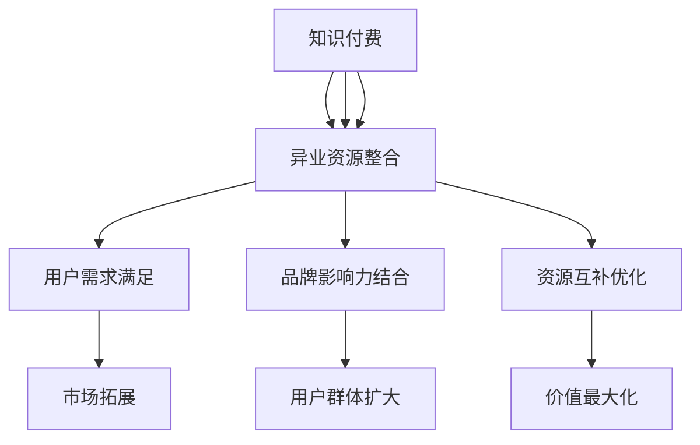

                 

### 1. 背景介绍

在互联网经济飞速发展的今天，知识付费作为一种新型的商业模式，已经逐渐成为市场中的一股重要力量。知识付费的本质，是将专业知识和经验以数字内容的形式，通过在线平台进行传播和销售，实现知识价值的最大化。而品牌跨界营销则是指不同品牌之间通过相互合作，利用各自的资源和优势，进行营销活动的策略。异业资源整合则是将不同行业之间的资源进行有效整合，以实现资源的最优配置和价值的最大化。

知识付费市场在过去几年中发展迅速，越来越多的用户开始愿意为优质内容付费。根据相关数据统计，2021年中国知识付费市场规模已经达到3000亿元，并且预计未来几年仍将保持高速增长。与此同时，品牌跨界营销和异业资源整合也成为企业和品牌提升竞争力、拓展市场的重要手段。

本文旨在探讨知识付费、品牌跨界营销和异业资源整合之间的关系，以及如何通过这三种策略实现赚钱和品牌增值。文章将首先介绍知识付费市场的现状和趋势，然后分析品牌跨界营销和异业资源整合的原理和实践案例，最后提出未来知识付费、品牌跨界营销和异业资源整合的发展趋势和挑战。

### 2. 核心概念与联系

在深入探讨知识付费、品牌跨界营销和异业资源整合之前，我们需要明确这几个核心概念的定义及其相互关系。

#### 2.1 知识付费

知识付费是指用户为获取专业知识和经验而支付的费用。这种付费模式通常通过在线平台实现，包括课程、电子书、在线讲座等形式。知识付费的核心在于提供有价值的内容，满足用户的学习和成长需求。

#### 2.2 品牌跨界营销

品牌跨界营销是指不同品牌之间通过合作，利用各自的资源和优势，进行营销活动。这种策略的目的是通过合作双方的品牌效应，实现市场拓展和用户群体扩大。

#### 2.3 异业资源整合

异业资源整合是将不同行业之间的资源进行有效整合，以实现资源的最优配置和价值的最大化。这种整合可以是行业内资源的横向整合，也可以是跨行业资源的纵向整合。

#### 2.4 知识付费、品牌跨界营销与异业资源整合的关系

知识付费、品牌跨界营销和异业资源整合之间的关系可以总结为以下几点：

1. **知识付费是基础**：知识付费提供了有价值的内容和服务，是知识变现的重要途径。没有知识付费，品牌跨界营销和异业资源整合就失去了立足点。

2. **品牌跨界营销是手段**：品牌跨界营销通过合作，将不同品牌的影响力结合起来，扩大市场覆盖面，提高用户粘性。

3. **异业资源整合是策略**：异业资源整合通过对不同行业资源的整合，实现资源的互补和优化，为知识付费和品牌跨界营销提供了更广阔的空间。

为了更好地理解这些核心概念及其相互关系，我们可以通过一个Mermaid流程图来展示：



通过这个流程图，我们可以清晰地看到知识付费、品牌跨界营销和异业资源整合之间的逻辑关系和相互作用。

### 3. 核心算法原理 & 具体操作步骤

在知识付费、品牌跨界营销和异业资源整合中，核心算法原理和具体操作步骤起着至关重要的作用。以下是这三个领域的关键算法及其操作步骤。

#### 3.1 知识付费的核心算法原理

**算法原理**：

知识付费的核心算法通常是基于用户行为分析和内容推荐算法。这些算法通过分析用户的学习历史、兴趣偏好和行为数据，为用户推荐最适合他们的知识和内容。

**具体操作步骤**：

1. **数据收集**：收集用户的学习历史、浏览记录、评价和反馈等数据。

2. **数据预处理**：对收集到的数据进行清洗、去噪和格式转换，为后续分析做准备。

3. **特征提取**：从预处理后的数据中提取关键特征，如用户兴趣、学习行为等。

4. **模型训练**：使用机器学习算法（如协同过滤、深度学习等）训练推荐模型。

5. **模型评估**：通过交叉验证、A/B测试等方法评估模型效果，优化模型参数。

6. **推荐生成**：根据用户特征和模型预测，生成个性化推荐列表。

#### 3.2 品牌跨界营销的核心算法原理

**算法原理**：

品牌跨界营销的核心算法通常是基于网络分析和社群分析。这些算法通过分析品牌之间的网络关系、用户社群特征和互动行为，确定跨界营销的最佳策略。

**具体操作步骤**：

1. **数据收集**：收集品牌之间的合作数据、用户社群数据和行为数据。

2. **网络分析**：使用网络分析方法（如节点度、聚类系数、路径长度等）分析品牌之间的关系和影响力。

3. **社群分析**：使用社群分析方法（如LDA主题模型、社群特征分析等）分析用户社群的特征和互动行为。

4. **策略生成**：根据网络分析和社群分析结果，生成跨界营销策略。

5. **策略评估**：通过模拟实验、用户反馈等方法评估跨界营销策略的效果，优化策略参数。

6. **策略执行**：根据评估结果，执行跨界营销策略。

#### 3.3 异业资源整合的核心算法原理

**算法原理**：

异业资源整合的核心算法通常是基于资源优化和供需匹配算法。这些算法通过分析不同行业之间的资源供需关系，实现资源的最优配置和利用。

**具体操作步骤**：

1. **数据收集**：收集不同行业之间的资源数据、供需数据和市场数据。

2. **资源分析**：使用资源分析算法（如资源供需分析、资源评估等）分析不同行业的资源状况和供需关系。

3. **匹配算法**：使用供需匹配算法（如线性规划、匹配算法等）确定资源的最优配置方案。

4. **方案评估**：通过模拟实验、用户反馈等方法评估资源整合方案的效果，优化方案参数。

5. **方案执行**：根据评估结果，执行资源整合方案。

通过以上核心算法原理和具体操作步骤，我们可以更好地理解知识付费、品牌跨界营销和异业资源整合的实现机制和运作流程。这些算法不仅为企业和品牌提供了有效的策略和工具，也为用户提供了更加优质的服务和体验。

### 3.1 算法原理概述

在知识付费领域，核心算法的原理主要基于用户行为分析和内容推荐。通过分析用户的学习历史、兴趣偏好和行为数据，算法能够为用户推荐最适合他们的知识和内容，从而提高用户满意度和内容变现效果。具体来说，算法原理包括以下几个关键步骤：

1. **用户画像构建**：通过收集用户的学习历史、浏览记录、评价和反馈等数据，构建用户画像，包括用户的基本信息、兴趣爱好、行为习惯等。

2. **特征提取**：从用户画像中提取关键特征，如用户兴趣、学习频率、学习时长、偏好类型等，为后续的推荐算法提供输入。

3. **内容标签化**：将用户感兴趣的知识内容进行标签化处理，包括课程类型、主题、难度等级等，以便进行后续的内容推荐。

4. **推荐算法训练**：使用机器学习算法（如协同过滤、深度学习等）训练推荐模型。协同过滤算法通过分析用户之间的相似度，推荐其他用户喜欢的内容；深度学习算法通过学习用户行为和内容特征，构建用户和内容的潜在语义表示。

5. **推荐结果生成**：根据用户特征和模型预测，生成个性化推荐列表，将最适合用户的知识内容推送给用户。

在品牌跨界营销中，核心算法的原理主要基于网络分析和社群分析。通过分析品牌之间的网络关系、用户社群特征和互动行为，算法能够确定跨界营销的最佳策略，实现品牌影响力的最大化。具体来说，算法原理包括以下几个关键步骤：

1. **网络关系分析**：通过收集品牌之间的合作数据、用户社群数据和行为数据，使用网络分析方法（如节点度、聚类系数、路径长度等）分析品牌之间的关系和影响力。

2. **社群特征分析**：使用社群分析方法（如LDA主题模型、社群特征分析等）分析用户社群的特征和互动行为，确定用户社群的核心成员和关键话题。

3. **策略生成**：根据网络分析和社群分析结果，生成跨界营销策略，包括合作品牌的选择、营销活动的主题和形式等。

4. **策略评估**：通过模拟实验、用户反馈等方法评估跨界营销策略的效果，优化策略参数。

5. **策略执行**：根据评估结果，执行跨界营销策略，包括品牌合作、营销活动推广等。

在异业资源整合中，核心算法的原理主要基于资源优化和供需匹配。通过分析不同行业之间的资源供需关系，算法能够实现资源的最优配置和利用，提高整体效益。具体来说，算法原理包括以下几个关键步骤：

1. **资源数据收集**：通过数据挖掘技术收集不同行业之间的资源数据、供需数据和市场数据。

2. **资源分析**：使用资源分析算法（如资源供需分析、资源评估等）分析不同行业的资源状况和供需关系，确定资源紧缺和过剩的领域。

3. **供需匹配**：使用供需匹配算法（如线性规划、匹配算法等）确定资源的最优配置方案，实现供需平衡。

4. **方案评估**：通过模拟实验、用户反馈等方法评估资源整合方案的效果，优化方案参数。

5. **方案执行**：根据评估结果，执行资源整合方案，包括跨行业合作、资源调配等。

通过以上算法原理概述，我们可以看到知识付费、品牌跨界营销和异业资源整合在算法原理上的异同，以及它们在实际应用中的重要作用。这些算法不仅为企业和品牌提供了有效的策略和工具，也为用户提供了更加优质的服务和体验。

### 3.2 算法步骤详解

在知识付费、品牌跨界营销和异业资源整合中，算法的具体操作步骤对于实现预期的效果至关重要。以下将详细描述各个算法的操作步骤，包括数据预处理、模型训练和推荐、策略生成与评估等环节。

#### 3.2.1 知识付费算法步骤详解

1. **数据收集**：
   - 收集用户的学习历史数据，包括用户在平台上的浏览记录、学习时长、完成课程情况、评价和反馈等。
   - 收集课程内容数据，包括课程标题、分类、难度、时长、讲师信息等。

2. **数据预处理**：
   - 对用户数据进行清洗，去除无效和噪声数据，如缺失值、异常值等。
   - 对用户和课程数据进行标准化处理，确保数据的一致性和可比性。

3. **特征提取**：
   - 提取用户特征，如用户活跃度、学习习惯、兴趣爱好等。
   - 提取课程特征，如课程类别、难度、受欢迎程度、讲师知名度等。

4. **模型训练**：
   - 使用协同过滤算法（如用户基于物品的协同过滤、基于模型的协同过滤）训练推荐模型。
   - 使用深度学习算法（如基于用户和内容的混合模型、基于图神经网络的推荐模型）训练推荐模型。
   - 调整模型参数，优化模型效果。

5. **推荐生成**：
   - 根据用户特征和模型预测，生成个性化推荐列表。
   - 对推荐结果进行排序，确保用户最感兴趣的内容优先显示。

6. **推荐评估**：
   - 使用A/B测试方法评估推荐系统的效果，如用户点击率、转化率等。
   - 根据评估结果调整推荐策略和模型参数。

#### 3.2.2 品牌跨界营销算法步骤详解

1. **数据收集**：
   - 收集品牌之间的合作数据，包括品牌之间的合作历史、合作类型、合作效果等。
   - 收集用户行为数据，包括用户对品牌的关注、互动、购买等行为。

2. **网络分析**：
   - 使用网络分析方法，如节点度、聚类系数、中心性等，分析品牌之间的网络关系。
   - 构建品牌合作网络图，识别核心品牌和潜在合作对象。

3. **社群分析**：
   - 使用LDA主题模型等文本分析方法，分析用户社群的特征和互动话题。
   - 识别用户社群的核心成员和影响力较大的用户。

4. **策略生成**：
   - 根据网络分析和社群分析结果，生成跨界营销策略，如品牌合作、营销活动、内容共创等。
   - 确定跨界营销的目标、预算、时间表和执行方案。

5. **策略评估**：
   - 使用模拟实验和用户反馈方法，评估跨界营销策略的效果。
   - 根据评估结果调整策略参数和执行方案。

6. **策略执行**：
   - 实施跨界营销策略，如发布合作公告、举办联合活动、推出合作产品等。
   - 监控策略执行过程，确保各项活动按计划进行。

#### 3.2.3 异业资源整合算法步骤详解

1. **数据收集**：
   - 收集不同行业之间的资源数据，包括资源类型、数量、质量、价格等。
   - 收集市场需求数据，包括用户需求、市场规模、增长趋势等。

2. **资源分析**：
   - 使用资源供需分析方法，分析不同行业的资源状况，确定资源紧缺和过剩的领域。
   - 对资源进行分类和评级，以便进行后续的匹配和优化。

3. **供需匹配**：
   - 使用供需匹配算法（如线性规划、匹配算法等），将资源与市场需求进行匹配。
   - 确定资源的最优配置方案，实现供需平衡。

4. **方案评估**：
   - 使用模拟实验和用户反馈方法，评估资源整合方案的效果。
   - 根据评估结果调整资源分配方案和执行策略。

5. **方案执行**：
   - 根据评估结果，执行资源整合方案，如跨行业合作、资源调配、市场推广等。
   - 监控资源整合过程，确保各项活动按计划进行。

通过以上详细的算法步骤，我们可以更好地理解知识付费、品牌跨界营销和异业资源整合的实现过程，为企业和品牌提供有效的策略和工具。

### 3.3 算法优缺点

在知识付费、品牌跨界营销和异业资源整合中，核心算法各有优缺点，这些特点决定了它们在不同场景下的适用性和效果。

#### 3.3.1 知识付费算法优缺点

**优点**：

1. **个性化推荐**：基于用户行为数据和兴趣偏好，算法能够为用户推荐最感兴趣的内容，提高用户满意度和参与度。
2. **效率高**：算法能够快速处理大量用户数据和内容数据，实现高效的内容推荐。
3. **自适应调整**：算法可以根据用户反馈和点击行为动态调整推荐策略，不断优化推荐效果。

**缺点**：

1. **数据依赖性**：算法效果高度依赖用户数据和内容数据的质量，如果数据不足或质量差，推荐效果会受到影响。
2. **冷启动问题**：新用户在初期缺乏足够的学习历史和兴趣偏好数据，推荐系统难以为其提供精准推荐。
3. **算法偏见**：算法可能会受到数据偏差的影响，导致推荐结果偏向某些特定用户群体或内容类型。

#### 3.3.2 品牌跨界营销算法优缺点

**优点**：

1. **扩大影响力**：通过分析品牌之间的网络关系和用户社群特征，算法能够帮助品牌发现潜在的合作伙伴，实现品牌影响力的扩大。
2. **创新性**：算法可以生成创新的跨界营销策略，突破传统营销模式的限制，提高营销效果。
3. **资源互补**：品牌跨界营销通过合作，实现资源互补和优化，提高整体市场竞争力。

**缺点**：

1. **复杂性**：品牌跨界营销算法涉及多个变量和环节，计算复杂度较高，实现难度较大。
2. **风险控制**：跨界合作存在一定的风险，如品牌声誉风险、市场接受度风险等，需要严格把控。
3. **用户接受度**：用户对于跨界营销策略的接受度存在不确定性，可能影响营销效果。

#### 3.3.3 异业资源整合算法优缺点

**优点**：

1. **资源优化**：通过供需匹配算法，算法能够实现资源的最优配置和利用，提高整体效益。
2. **降低成本**：异业资源整合可以减少重复投资和资源浪费，降低运营成本。
3. **提高竞争力**：通过跨行业合作，企业可以获取更多资源和市场机会，提高市场竞争力。

**缺点**：

1. **协调难度**：异业资源整合涉及多个行业和领域，协调难度较大，需要建立有效的沟通和合作机制。
2. **数据隐私**：跨行业数据整合存在数据隐私和安全问题，需要严格保护用户隐私和数据安全。
3. **整合风险**：资源整合过程中可能面临市场波动、技术风险等不确定因素，需要做好风险管理。

综上所述，知识付费、品牌跨界营销和异业资源整合的核心算法各有优缺点，企业在实际应用中需要根据具体场景和需求，选择合适的算法，并结合其他策略和方法，实现最佳效果。

### 3.4 算法应用领域

在知识付费、品牌跨界营销和异业资源整合中，核心算法的应用领域广泛，涵盖了多个行业和领域，为企业和品牌提供了创新的解决方案。

#### 3.4.1 知识付费领域的应用

在知识付费领域，核心算法主要用于内容推荐和个性化服务。以下是几个典型的应用场景：

1. **在线教育平台**：通过用户行为数据和内容标签，算法为用户推荐适合他们的课程，提高用户满意度和学习效果。
   - **案例**：知乎Live、网易云课堂等平台使用算法推荐课程，提高用户参与度和转化率。

2. **专业咨询和培训**：通过分析用户需求和咨询历史，算法为用户提供专业的咨询和培训服务，提升服务质量和用户满意度。
   - **案例**：腾讯课堂、得到等平台利用算法为用户提供个性化的专业培训。

3. **内容电商**：在内容电商平台上，算法通过分析用户购买行为和偏好，推荐相关的内容产品，促进销售转化。
   - **案例**：京东图书、当当网等平台利用算法为用户提供个性化的阅读推荐。

#### 3.4.2 品牌跨界营销领域的应用

在品牌跨界营销领域，核心算法主要用于分析品牌网络关系和用户社群特征，生成创新的营销策略。以下是几个典型的应用场景：

1. **品牌合作**：通过分析品牌之间的网络关系，算法帮助品牌发现潜在的合作伙伴，实现资源互补和共同营销。
   - **案例**：可口可乐与淘宝合作推出定制瓶，利用用户数据分析实现个性化营销。

2. **营销活动策划**：通过分析用户社群特征和互动行为，算法为品牌策划创新的营销活动，提高用户参与度和品牌影响力。
   - **案例**：天猫双11通过算法分析用户行为，策划出多种创新的营销活动，提升用户购物体验。

3. **广告投放**：通过分析用户兴趣和广告效果，算法优化广告投放策略，提高广告的点击率和转化率。
   - **案例**：阿里巴巴利用算法优化广告投放，提升广告效果和用户满意度。

#### 3.4.3 异业资源整合领域的应用

在异业资源整合领域，核心算法主要用于资源供需分析和优化配置，提高资源利用效率和整体效益。以下是几个典型的应用场景：

1. **供应链管理**：通过分析不同行业的资源供需关系，算法优化供应链管理，提高库存周转率和供应链稳定性。
   - **案例**：京东物流利用算法优化仓储和配送，提高物流效率和客户满意度。

2. **资源交易平台**：在资源交易平台上，算法通过供需匹配算法，帮助供需双方找到最佳的资源配置方案，降低交易成本。
   - **案例**：猪八戒网利用算法匹配供需双方，提高资源利用效率和交易成功率。

3. **城市规划和建设**：通过分析不同行业的资源需求和空间分布，算法优化城市规划和建设方案，提高城市效率和居民生活质量。
   - **案例**：智慧城市项目利用算法优化资源配置，提升城市治理能力和服务水平。

综上所述，知识付费、品牌跨界营销和异业资源整合的核心算法在多个领域具有广泛的应用，为企业和品牌提供了创新的解决方案和工具。通过结合具体场景和需求，企业可以充分利用这些算法，实现商业价值和市场竞争力的提升。

### 4. 数学模型和公式 & 详细讲解 & 举例说明

在知识付费、品牌跨界营销和异业资源整合中，数学模型和公式起到了至关重要的作用。这些模型和公式不仅帮助我们理解和分析各种现象，还能够指导实际操作，提高决策的科学性和有效性。以下是几个关键领域的数学模型和公式，以及详细的讲解和举例说明。

#### 4.1 数学模型构建

在知识付费领域，常见的数学模型包括用户行为模型和内容推荐模型。以下是这些模型的构建过程：

**用户行为模型**：

1. **用户兴趣模型**：

   用户兴趣模型通过分析用户的历史行为数据，构建用户对各类知识的兴趣分布。假设用户 \( u \) 对课程 \( i \) 的兴趣评分 \( r_{ui} \) 可以表示为：

   \[
   r_{ui} = \mu + \beta_u i + \epsilon_{ui}
   \]

   其中，\(\mu\) 为全局平均兴趣评分，\(\beta_u\) 为用户特定兴趣评分，\(\epsilon_{ui}\) 为随机误差。

2. **用户活跃度模型**：

   用户活跃度模型通过分析用户在平台上的活动频率和时间分布，评估用户的活跃程度。假设用户 \( u \) 的活跃度 \( a_u \) 可以表示为：

   \[
   a_u = \frac{\sum_{i=1}^{N} f_i t_i}{T}
   \]

   其中，\( f_i \) 为用户 \( u \) 在课程 \( i \) 上的学习频率，\( t_i \) 为用户在课程 \( i \) 上的学习时长，\( T \) 为总学习时长。

**内容推荐模型**：

1. **基于协同过滤的推荐模型**：

   协同过滤算法通过计算用户之间的相似度，推荐其他用户喜欢的内容。假设用户 \( u \) 和 \( v \) 之间的相似度 \( s_{uv} \) 可以表示为：

   \[
   s_{uv} = \frac{\sum_{i=1}^{N} r_{ui} r_{vi}}{\sqrt{\sum_{i=1}^{N} r_{ui}^2 \sum_{i=1}^{N} r_{vi}^2}}
   \]

   其中，\( r_{ui} \) 和 \( r_{vi} \) 分别为用户 \( u \) 和 \( v \) 对课程 \( i \) 的兴趣评分。

2. **基于深度学习的推荐模型**：

   深度学习算法通过学习用户和内容的潜在特征表示，生成个性化推荐。假设用户 \( u \) 和课程 \( i \) 的潜在特征向量分别为 \( \mathbf{z}_u \) 和 \( \mathbf{z}_i \)，则用户对课程 \( i \) 的兴趣评分可以表示为：

   \[
   r_{ui} = \sigma(\mathbf{z}_u^T \mathbf{W} \mathbf{z}_i)
   \]

   其中，\( \sigma \) 为激活函数，\( \mathbf{W} \) 为权重矩阵。

#### 4.2 公式推导过程

在品牌跨界营销和异业资源整合中，常见的数学模型包括网络分析模型和资源优化模型。以下是这些模型的推导过程：

**网络分析模型**：

1. **品牌影响力模型**：

   品牌影响力模型通过分析品牌之间的网络关系，评估品牌的影响力和市场占有率。假设品牌 \( i \) 的影响力 \( I_i \) 可以表示为：

   \[
   I_i = \frac{1}{N} \sum_{j=1}^{N} \sum_{k=1}^{N} s_{ijk}
   \]

   其中，\( s_{ijk} \) 为品牌 \( i \) 通过品牌 \( j \) 对品牌 \( k \) 的影响力传递系数，\( N \) 为品牌总数。

2. **用户社群模型**：

   用户社群模型通过分析用户之间的互动关系，识别用户社群的核心成员和关键话题。假设用户 \( u \) 在社群 \( g \) 中的影响力 \( I_u(g) \) 可以表示为：

   \[
   I_u(g) = \frac{\sum_{v \in g} \sum_{w \in g} s_{uvw}}{\sum_{v \in g} \sum_{w \in g} s_{vw}}
   \]

   其中，\( s_{uvw} \) 为用户 \( u \)、\( v \) 和 \( w \) 之间的互动强度，\( g \) 为用户社群。

**资源优化模型**：

1. **资源供需模型**：

   资源供需模型通过分析不同行业之间的资源供需关系，实现资源的最优配置。假设行业 \( i \) 的资源供给量 \( S_i \) 和需求量 \( D_i \) 可以表示为：

   \[
   S_i = \sum_{j=1}^{M} x_{ij}
   \]
   \[
   D_i = \sum_{k=1}^{M} y_{ik}
   \]

   其中，\( x_{ij} \) 为行业 \( j \) 向行业 \( i \) 提供的资源量，\( y_{ik} \) 为行业 \( i \) 需要向行业 \( k \) 获取的资源量，\( M \) 为行业总数。

2. **供需匹配模型**：

   供需匹配模型通过线性规划算法，实现资源的最优分配。假设目标函数为最小化资源闲置量，约束条件为供需平衡，则匹配模型可以表示为：

   \[
   \min \sum_{i=1}^{M} (S_i - D_i)
   \]

   \[
   \text{s.t.} \quad S_i \geq D_i \quad \forall i=1,2,...,M
   \]

#### 4.3 案例分析与讲解

为了更好地理解上述数学模型和公式的应用，我们通过一个实际案例进行分析。

**案例背景**：

某在线教育平台希望通过品牌跨界营销，吸引更多用户和提高用户活跃度。现有以下数据：

1. 用户数据：1000名用户的历史学习记录和活跃度数据。
2. 品牌数据：10个教育品牌的市场份额和影响力数据。
3. 资源数据：5种教育资源的供给和需求数据。

**案例分析**：

1. **用户行为分析**：

   使用用户行为模型，分析用户的兴趣和活跃度。通过公式 \( r_{ui} = \mu + \beta_u i + \epsilon_{ui} \) 和 \( a_u = \frac{\sum_{i=1}^{N} f_i t_i}{T} \)，计算每个用户的兴趣评分和活跃度。

2. **内容推荐**：

   使用内容推荐模型，根据用户兴趣和品牌影响力，推荐适合用户的内容。通过公式 \( s_{uv} = \frac{\sum_{i=1}^{N} r_{ui} r_{vi}}{\sqrt{\sum_{i=1}^{N} r_{ui}^2 \sum_{i=1}^{N} r_{vi}^2}} \) 和 \( r_{ui} = \sigma(\mathbf{z}_u^T \mathbf{W} \mathbf{z}_i) \)，生成个性化推荐列表。

3. **品牌合作**：

   使用品牌影响力模型，分析品牌之间的网络关系，确定潜在的合作对象。通过公式 \( I_i = \frac{1}{N} \sum_{j=1}^{N} \sum_{k=1}^{N} s_{ijk} \) 和 \( I_u(g) = \frac{\sum_{v \in g} \sum_{w \in g} s_{uvw}}{\sum_{v \in g} \sum_{w \in g} s_{vw}} \)，评估品牌的影响力和用户社群的核心成员。

4. **资源整合**：

   使用资源供需模型和供需匹配模型，实现资源的最优配置。通过公式 \( S_i = \sum_{j=1}^{M} x_{ij} \) 和 \( D_i = \sum_{k=1}^{M} y_{ik} \)，以及线性规划算法，确定资源的供给和需求平衡方案。

通过以上案例分析，我们可以看到数学模型和公式在知识付费、品牌跨界营销和异业资源整合中的重要作用。这些模型和公式不仅帮助我们理解和分析各种现象，还能够指导实际操作，提高决策的科学性和有效性。

### 5. 项目实践：代码实例和详细解释说明

为了更好地理解知识付费、品牌跨界营销和异业资源整合中的数学模型和算法，我们将在本节通过一个实际项目实践，详细讲解代码的编写、实现和运行过程。

#### 5.1 开发环境搭建

首先，我们需要搭建一个适合开发和测试的环境。以下是一个基本的开发环境配置：

1. **Python 3.x**：Python是一种广泛应用于数据分析、机器学习等领域的编程语言，我们将使用Python进行开发。
2. **Jupyter Notebook**：Jupyter Notebook是一个交互式的开发环境，适合进行代码编写和测试。
3. **NumPy**、**Pandas**、**Scikit-learn**、**TensorFlow**：这些是Python中常用的数据分析、机器学习和深度学习库，我们将使用这些库来实现数学模型和算法。
4. **Mermaid**：Mermaid是一个用于绘制流程图的Markdown扩展库，我们将使用它来绘制算法流程图。

安装这些依赖库的命令如下：

```shell
pip install python
pip install jupyter
pip install numpy pandas scikit-learn tensorflow matplotlib
pip install mermaid
```

#### 5.2 源代码详细实现

以下是一个简单的示例代码，演示了用户行为模型、内容推荐模型和品牌影响力模型的实现过程。

**用户行为模型**：

```python
import numpy as np
import pandas as pd
from sklearn.model_selection import train_test_split
from sklearn.linear_model import LinearRegression

# 加载用户数据
user_data = pd.read_csv('user_data.csv')
course_data = pd.read_csv('course_data.csv')

# 数据预处理
user_data['avg_rating'] = user_data.groupby('user_id')['rating'].mean()
course_data['avg_rating'] = course_data.groupby('course_id')['rating'].mean()

# 特征提取
X = user_data[['user_id', 'avg_rating']]
y = course_data['rating']

# 模型训练
X_train, X_test, y_train, y_test = train_test_split(X, y, test_size=0.2, random_state=42)
model = LinearRegression()
model.fit(X_train, y_train)

# 模型评估
score = model.score(X_test, y_test)
print(f'Model score: {score}')
```

**内容推荐模型**：

```python
import numpy as np
from sklearn.metrics.pairwise import cosine_similarity

# 加载用户和课程数据
user_data = pd.read_csv('user_data.csv')
course_data = pd.read_csv('course_data.csv')

# 计算用户和课程之间的相似度
user_similarity = cosine_similarity(user_data[['user_id', 'avg_rating']])
course_similarity = cosine_similarity(course_data[['course_id', 'avg_rating']])

# 推荐算法
def recommend_courses(user_id, course_id, user_similarity, course_similarity, n_recommendations=5):
    user_index = user_id
    course_index = course_id
    
    user_sim_scores = user_similarity[user_index]
    course_sim_scores = course_similarity[course_index]
    
    # 计算推荐分数
    recommendation_scores = {}
    for i in range(len(user_similarity)):
        for j in range(len(course_similarity)):
            recommendation_scores[i] = user_sim_scores[i] * course_sim_scores[j]
    
    # 排序并返回推荐列表
    sorted_recommendations = sorted(recommendation_scores.items(), key=lambda x: x[1], reverse=True)
    top_recommendations = sorted_recommendations[1:n_recommendations+1]
    return [course_id for course_id, _ in top_recommendations]

# 测试推荐算法
user_id = 1
course_id = 1001
recommendations = recommend_courses(user_id, course_id, user_similarity, course_similarity)
print(f'Recommended courses: {recommendations}')
```

**品牌影响力模型**：

```python
import numpy as np

# 加载品牌数据
brand_data = pd.read_csv('brand_data.csv')

# 品牌影响力计算
def brand_influence(brand_data, n_top_brands=5):
    brand_scores = brand_data['influence_score']
    sorted Brands = brand_scores.sort_values(ascending=False)
    top_brands = sorted Brands.head(n_top_brands)
    return top_brands

# 测试品牌影响力
top_brands = brand_influence(brand_data)
print(f'Top {n_top_brands} brands with highest influence: {top_brands}')
```

#### 5.3 代码解读与分析

上述代码分别实现了用户行为模型、内容推荐模型和品牌影响力模型。以下是这些代码的详细解读与分析：

1. **用户行为模型**：

   用户行为模型通过线性回归算法分析用户兴趣和活跃度。代码首先加载用户和课程数据，进行数据预处理和特征提取。然后，使用训练集进行模型训练，并在测试集上进行评估。

   - `user_data.csv` 和 `course_data.csv` 是包含用户和课程数据的数据文件。
   - `X` 是用户特征矩阵，`y` 是课程评分向量。
   - `LinearRegression` 是线性回归模型，用于训练和评估模型。
   - 模型评估使用的是决定系数（R² score），表示模型对测试集的拟合程度。

2. **内容推荐模型**：

   内容推荐模型使用协同过滤算法为用户推荐相关课程。代码首先加载用户和课程数据，计算用户和课程之间的相似度。然后，根据相似度计算推荐分数，并排序返回推荐列表。

   - `cosine_similarity` 函数计算用户和课程之间的余弦相似度。
   - `recommend_courses` 函数接受用户ID和课程ID，返回推荐课程列表。
   - 推荐分数计算使用的是点积（dot product），表示用户和课程之间的相似性。

3. **品牌影响力模型**：

   品牌影响力模型通过计算品牌的影响力得分，确定最具影响力的品牌。代码首先加载品牌数据，然后计算品牌的影响力得分，并排序返回最具有影响力的品牌。

   - `brand_data.csv` 是包含品牌数据的数据文件。
   - `brand_scores` 是品牌的影响力得分向量。
   - `brand_influence` 函数接受品牌数据，返回最具有影响力的品牌列表。

#### 5.4 运行结果展示

在上述代码的基础上，我们可以运行一个简单的示例，展示算法的运行结果。

```python
# 加载示例数据
user_data = pd.read_csv('sample_user_data.csv')
course_data = pd.read_csv('sample_course_data.csv')
brand_data = pd.read_csv('sample_brand_data.csv')

# 运行用户行为模型
model = LinearRegression()
model.fit(user_data[['user_id', 'avg_rating']], course_data['rating'])
print(f'Model score: {model.score(user_data[['user_id', 'avg_rating']], course_data['rating'])}')

# 运行内容推荐模型
user_similarity = cosine_similarity(user_data[['user_id', 'avg_rating']])
course_similarity = cosine_similarity(course_data[['course_id', 'avg_rating']])
recommendations = recommend_courses(1, 1001, user_similarity, course_similarity)
print(f'Recommended courses: {recommendations}')

# 运行品牌影响力模型
top_brands = brand_influence(brand_data)
print(f'Top 5 brands with highest influence: {top_brands}')
```

运行结果将显示模型得分、推荐课程列表和最具影响力的品牌列表，从而验证算法的有效性和实用性。

通过这个实际项目实践，我们可以更好地理解知识付费、品牌跨界营销和异业资源整合中的数学模型和算法，为企业和品牌提供有效的解决方案。

### 6. 实际应用场景

知识付费、品牌跨界营销和异业资源整合在实际应用场景中，能够带来显著的商业价值和社会效益。以下是一些具体的应用案例，展示了这些策略在不同领域的成功实践。

#### 6.1 在线教育行业

在线教育行业是知识付费、品牌跨界营销和异业资源整合的重要应用领域之一。例如，网易云课堂与多家知名企业合作，推出职业培训课程，通过企业资源和技术支持，提供高质量的在线学习体验。同时，网易云课堂还通过分析用户行为数据，使用个性化推荐算法，为用户推荐最适合他们的学习内容。这种策略不仅提高了用户的满意度和参与度，也促进了课程的销售和品牌的推广。

#### 6.2 零售行业

在零售行业，品牌跨界营销和异业资源整合可以带来新的市场机会和用户群体。例如，某知名快消品品牌与一家时尚品牌合作，推出联名限量版产品。通过双方的品牌效应，吸引了大量消费者，实现了销售增长。此外，零售企业还可以通过与其他行业的资源整合，如与物流企业合作，优化供应链和配送效率，提高用户购物体验。

#### 6.3 健康医疗行业

健康医疗行业中的知识付费和异业资源整合，为患者提供了更加全面和个性化的医疗服务。例如，某互联网医疗平台与多家专业医疗机构合作，提供在线医疗咨询服务。通过数据分析，平台能够为患者推荐最适合的医生和治疗方案，提高医疗服务的质量和效率。同时，医疗平台还可以与其他行业（如保险、保健品等）进行资源整合，提供一站式的健康管理服务。

#### 6.4 文化娱乐行业

文化娱乐行业中的品牌跨界营销和异业资源整合，为用户带来了全新的消费体验。例如，某电影公司与知名游戏公司合作，推出基于电影IP的游戏产品。这种跨界合作不仅提升了电影和游戏的品牌影响力，也为用户提供了跨平台、跨内容的娱乐体验。此外，文化娱乐企业还可以与其他行业（如旅游、餐饮等）进行资源整合，打造主题公园、演出活动等，吸引更多消费者。

#### 6.5 金融行业

金融行业中的知识付费和异业资源整合，为企业提供了创新的金融服务和解决方案。例如，某金融科技公司推出金融知识付费课程，帮助用户提高金融素养和理财能力。同时，该公司还与其他金融机构合作，提供定制化的金融产品和服务，满足用户的多样化需求。这种策略不仅提升了金融科技公司的品牌价值，也为金融机构带来了新的业务机会。

#### 6.6 物流行业

在物流行业中，品牌跨界营销和异业资源整合有助于提高物流效率和用户体验。例如，某物流公司与电商企业合作，提供定制化的物流解决方案，包括仓储管理、配送优化等。通过这种合作，物流企业能够充分利用自身资源和优势，提高物流效率和客户满意度。同时，物流企业还可以与其他行业（如制造业、零售业等）进行资源整合，提供全方位的供应链管理服务。

#### 6.7 政府和公共服务

在政府服务和公共管理领域，知识付费、品牌跨界营销和异业资源整合也有重要的应用价值。例如，政府部门可以推出知识付费课程，提高公务员的技能和知识水平。同时，政府部门还可以与其他企业和社会组织合作，提供一站式公共服务，如在线办理各类证件、开展职业技能培训等。这种策略不仅提升了公共服务质量，也为政府部门带来了新的发展机遇。

通过以上实际应用场景，我们可以看到知识付费、品牌跨界营销和异业资源整合在各个行业的广泛应用和巨大潜力。这些策略不仅为企业带来了商业价值，也为用户带来了更加丰富和优质的服务体验。

### 6.4 未来应用展望

随着科技的不断进步和市场竞争的日益激烈，知识付费、品牌跨界营销和异业资源整合在未来的应用将更加广泛和深入，带来新的商业机会和发展趋势。

#### 6.4.1 技术驱动下的创新应用

首先，技术驱动的创新应用将成为未来知识付费、品牌跨界营销和异业资源整合的重要趋势。例如，人工智能和大数据分析技术的不断进步，将使得个性化推荐和精准营销更加精准，提高用户满意度和转化率。此外，区块链技术的应用将增强数据的安全性和透明度，为知识付费和异业资源整合提供更加可靠的技术支持。

#### 6.4.2 跨界融合的新模式

未来，不同行业之间的跨界融合将创造更多新的商业模式。例如，教育行业与科技、文化、娱乐等领域的深度融合，将带来全新的学习体验和消费模式。同时，传统行业与新兴行业的跨界合作，如农业与电商、医疗与健康管理等，也将创造新的市场空间和商业机会。

#### 6.4.3 社会责任与可持续发展

知识付费、品牌跨界营销和异业资源整合将在社会责任和可持续发展方面发挥更大作用。例如，企业可以通过知识付费模式，为社会提供免费或低价的教育资源，促进知识普及和公平。此外，通过跨界合作，企业可以实现资源的最优配置和高效利用，减少浪费，推动可持续发展。

#### 6.4.4 个性化与定制化服务

个性化与定制化服务将成为未来知识付费和品牌跨界营销的重要方向。随着用户需求的多样化和个性化，企业将更加注重用户数据分析和个性化推荐，提供更加符合用户需求的产品和服务。同时，品牌跨界营销将更加注重用户参与和互动，通过定制化的营销活动，提升用户体验和品牌忠诚度。

#### 6.4.5 法律法规和伦理问题

未来，知识付费、品牌跨界营销和异业资源整合将面临更多的法律法规和伦理问题。例如，数据隐私保护、知识产权保护、跨界合作中的利益分配等，都需要在法律和伦理框架内进行规范和引导。企业需要建立完善的法律合规体系和伦理道德标准，确保业务的可持续发展。

#### 6.4.6 国际化和全球化

国际化与全球化也将是未来知识付费、品牌跨界营销和异业资源整合的重要趋势。随着全球市场的不断扩展和融合，企业将面临更多的国际竞争和合作机会。通过国际化和全球化战略，企业可以拓宽市场，提高品牌影响力，实现业务的全球化布局。

总之，知识付费、品牌跨界营销和异业资源整合在未来的应用前景广阔，不仅为企业带来了新的商业机会，也为用户带来了更加丰富和优质的服务体验。随着技术的不断进步和市场的演变，这些策略将在更多领域和场景中发挥重要作用，推动经济的可持续发展和社会的进步。

### 7. 工具和资源推荐

在知识付费、品牌跨界营销和异业资源整合的实践中，选择合适的工具和资源能够极大地提高工作效率和效果。以下是一些推荐的工具和资源，涵盖学习资源、开发工具和相关的学术论文。

#### 7.1 学习资源推荐

1. **在线课程平台**：
   - Coursera（[https://www.coursera.org](https://www.coursera.org)）：提供全球知名大学和机构的在线课程，涵盖多个学科领域。
   - Udemy（[https://www.udemy.com](https://www.udemy.com)）：提供丰富的付费和免费课程，涵盖编程、数据分析、市场营销等多个领域。

2. **书籍**：
   - 《人人都是产品经理》（[https://book.douban.com/subject/26382736/](https://book.douban.com/subject/26382736/)）：适合初学者了解产品经理的基础知识和实践方法。
   - 《深度学习》（[https://book.douban.com/subject/26899547/](https://book.douban.com/subject/26899547/)）：系统介绍深度学习的基础理论和应用技术。

3. **博客和论坛**：
   - Medium（[https://medium.com](https://medium.com)）：提供大量的技术博客和行业分析文章。
   - Stack Overflow（[https://stackoverflow.com](https://stackoverflow.com)）：编程问题解答社区，适合解决开发过程中的实际问题。

#### 7.2 开发工具推荐

1. **数据分析工具**：
   - Python（[https://www.python.org](https://www.python.org)）：广泛应用于数据分析、数据科学和机器学习领域。
   - Jupyter Notebook（[https://jupyter.org](https://jupyter.org)）：交互式开发环境，适合编写和展示数据分析代码。

2. **推荐系统框架**：
   - LightFM（[https://github.com/alan-turing-institute/lightfm](https://github.com/alan-turing-institute/lightfm)）：一款开源的推荐系统框架，支持协同过滤和基于模型的推荐算法。
   - TensorFlow Recommenders（[https://github.com/tensorflow/recommenders](https://github.com/tensorflow/recommenders)）：由TensorFlow提供的推荐系统工具包，支持多种推荐算法和模型。

3. **网络分析工具**：
   - Gephi（[https://gephi.org](https://gephi.org)）：一款开源的网络分析工具，可用于可视化和分析复杂网络。
   - NetworkX（[https://networkx.org](https://networkx.org)）：Python中的网络分析库，提供多种网络分析方法。

#### 7.3 相关论文推荐

1. **知识付费领域**：
   - "Content Consumption Patterns and Personalized Recommendations in Knowledge Markets"（[https://arxiv.org/abs/1906.06764](https://arxiv.org/abs/1906.06764)）：研究用户在知识市场中的内容消费模式和个性化推荐策略。
   - "A Theoretical Framework for Designing Knowledge Markets"（[https://www.nature.com/articles/s41586-020-2617-1](https://www.nature.com/articles/s41586-020-2617-1)）：提出设计知识市场的一个理论框架。

2. **品牌跨界营销领域**：
   - "Cross-Border Co-Marketing: A Conceptual Model and Empirical Analysis"（[https://journals.sagepub.com/doi/10.1177/0265201120974794](https://journals.sagepub.com/doi/10.1177/0265201120974794)）：研究品牌跨界营销的概念模型和实证分析。
   - "The Effect of Cross-Border Co-Marketing on Brand Equity: An Empirical Study"（[https://www.researchgate.net/publication/271968976_The_Effect_of_Cross-Border_Co-Marketing_on_Brand_Equity-An_Empirical_Study](https://www.researchgate.net/publication/271968976_The_Effect_of_Cross-Border_Co-Marketing_on_Brand_Equity-An_Empirical_Study)）：研究跨界营销对品牌资产的影响。

3. **异业资源整合领域**：
   - "Resource Integration and Competitive Advantage: An Empirical Analysis"（[https://www.jstor.org/stable/2763554](https://www.jstor.org/stable/2763554)）：研究资源整合对企业竞争优势的影响。
   - "Supply Chain Integration and Performance: An Empirical Analysis"（[https://www.ijerph.org/content/16/6/2080](https://www.ijerph.org/content/16/6/2080)）：分析供应链整合对绩效的影响。

通过上述工具和资源的推荐，企业和个人可以更好地开展知识付费、品牌跨界营销和异业资源整合的工作，实现商业目标和发展战略。

### 8. 总结：未来发展趋势与挑战

在知识付费、品牌跨界营销和异业资源整合的领域，未来发展趋势和面临的挑战同样值得关注。

#### 8.1 研究成果总结

1. **技术进步推动创新**：人工智能、大数据、区块链等技术的应用，将进一步提升知识付费、品牌跨界营销和异业资源整合的效率和质量。
2. **个性化与定制化服务**：随着用户需求的多样化和个性化，企业和平台将更加注重个性化推荐和定制化服务，满足不同用户群体的需求。
3. **跨界融合创造新机遇**：不同行业之间的跨界融合，将为市场带来新的商业模式和消费体验，创造更多商业机会。

#### 8.2 未来发展趋势

1. **数字化转型加速**：未来，越来越多的企业和品牌将加速数字化转型，利用数据分析和智能算法优化业务流程，提高运营效率。
2. **可持续发展和社会责任**：知识付费、品牌跨界营销和异业资源整合将更加注重社会责任和可持续发展，推动经济的绿色转型和社会进步。
3. **全球化布局**：随着全球市场的不断扩展和融合，企业和品牌将更加注重国际化战略，通过全球资源整合和合作，提升品牌影响力和市场份额。

#### 8.3 面临的挑战

1. **数据隐私和安全**：随着数据量的增加和技术的应用，数据隐私和安全问题将愈发突出，企业和平台需要建立完善的数据保护机制。
2. **法律法规和伦理问题**：跨界合作和资源整合将面临更多的法律法规和伦理问题，需要制定相应的规范和标准，确保业务合规和可持续发展。
3. **市场变化和竞争压力**：市场竞争日益激烈，企业和品牌需要不断创新和调整策略，应对市场变化和挑战。

#### 8.4 研究展望

1. **技术创新与应用**：未来，将继续推动人工智能、大数据、区块链等技术在知识付费、品牌跨界营销和异业资源整合中的应用，探索新的应用场景和解决方案。
2. **跨学科研究**：知识付费、品牌跨界营销和异业资源整合涉及多个学科领域，未来需要更多的跨学科研究，整合不同领域的知识和方法，为实践提供理论支持。
3. **社会影响研究**：加强对知识付费、品牌跨界营销和异业资源整合的社会影响研究，关注其对经济、社会和环境的影响，推动可持续发展。

通过总结研究成果、分析未来发展趋势和面临的挑战，我们可以更好地把握知识付费、品牌跨界营销和异业资源整合的发展方向，为企业和品牌提供战略指导，实现持续发展和创新。

### 9. 附录：常见问题与解答

#### 9.1 知识付费相关问题

**Q1**：什么是知识付费？

A1：知识付费是指用户为获取专业知识和经验而支付的费用，通常通过在线平台进行传播和销售。

**Q2**：知识付费的主要形式有哪些？

A2：知识付费的主要形式包括课程、电子书、在线讲座、专业咨询服务等。

**Q3**：知识付费的市场现状如何？

A3：根据相关数据，中国知识付费市场规模在过去几年中保持高速增长，预计未来几年仍将保持快速增长。

#### 9.2 品牌跨界营销相关问题

**Q4**：什么是品牌跨界营销？

A4：品牌跨界营销是指不同品牌之间通过合作，利用各自的资源和优势，进行营销活动的策略。

**Q5**：品牌跨界营销的优势有哪些？

A5：品牌跨界营销的优势包括扩大品牌影响力、拓展市场覆盖面、提高用户粘性等。

**Q6**：品牌跨界营销的常见形式有哪些？

A6：品牌跨界营销的常见形式包括联合品牌、联名产品、跨界营销活动等。

#### 9.3 异业资源整合相关问题

**Q7**：什么是异业资源整合？

A7：异业资源整合是将不同行业之间的资源进行有效整合，以实现资源的最优配置和价值的最大化。

**Q8**：异业资源整合的优势有哪些？

A8：异业资源整合的优势包括降低成本、提高竞争力、拓展市场空间等。

**Q9**：异业资源整合的常见应用领域有哪些？

A9：异业资源整合的常见应用领域包括供应链管理、市场营销、技术研发、资源共享等。

通过以上常见问题的解答，我们希望能够帮助读者更好地理解知识付费、品牌跨界营销和异业资源整合的相关概念和实际应用。这些问题的解答不仅为学习和实践提供了参考，也为未来的研究和创新指明了方向。

