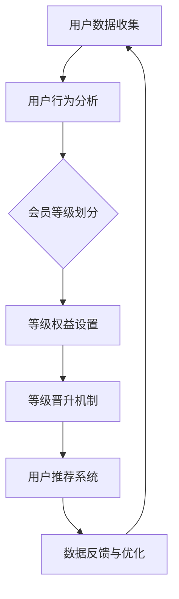

                 

关键词：知识付费、用户关系管理、会员等级体系、用户体验、转化率、盈利模型。

> 摘要：本文将深入探讨知识付费领域的用户关系管理与会员等级体系的重要性，分析其核心概念与联系，介绍核心算法原理与操作步骤，以及数学模型和公式。通过项目实践，详细解释代码实例，展示实际应用场景，并预测未来发展趋势与挑战。

## 1. 背景介绍

知识付费是一种基于互联网的新型商业模式，通过提供专业知识和技能，满足用户的学习和成长需求。近年来，随着互联网技术的快速发展，知识付费市场呈现爆发式增长。然而，如何在激烈的市场竞争中脱颖而出，实现可持续盈利，是知识付费平台需要面对的重要课题。

用户关系管理与会员等级体系作为知识付费平台的两大核心组成部分，对平台的长期发展具有重要意义。用户关系管理旨在建立和维护与用户的良好互动，提升用户满意度和忠诚度。会员等级体系则通过为用户提供差异化服务，激发用户付费意愿，实现商业价值的最大化。

## 2. 核心概念与联系

### 2.1 用户关系管理

用户关系管理（CRM）是指通过技术手段和策略，建立和维护与用户的长期互动，以提升用户满意度和忠诚度。CRM的核心概念包括用户数据收集、用户行为分析、用户沟通和反馈等。

### 2.2 会员等级体系

会员等级体系是指根据用户的付费行为和活跃度，为用户赋予不同等级的身份，提供差异化服务。会员等级体系的核心概念包括等级划分标准、等级权益设置、等级晋升机制等。

### 2.3 用户关系管理与会员等级体系之间的联系

用户关系管理与会员等级体系之间存在密切的联系。用户关系管理为会员等级体系的构建提供了数据基础，而会员等级体系则为用户关系管理提供了激励机制。两者共同作用，可以提升用户满意度和忠诚度，促进知识付费平台的发展。

## 3. 核心算法原理 & 具体操作步骤

### 3.1 算法原理概述

用户关系管理与会员等级体系的构建依赖于大数据分析和机器学习技术。通过收集和分析用户数据，可以了解用户需求和行为，为会员等级体系的划分提供依据。同时，通过机器学习算法，可以预测用户行为，为用户推荐合适的服务和产品。

### 3.2 算法步骤详解

1. 用户数据收集：收集用户的付费记录、浏览历史、评论反馈等数据。

2. 用户行为分析：利用数据挖掘技术，分析用户行为特征，为会员等级划分提供依据。

3. 会员等级划分：根据用户行为特征和付费行为，为用户赋予不同等级的身份。

4. 等级权益设置：为不同等级的用户设置相应的权益，如折扣优惠、专属课程、积分兑换等。

5. 等级晋升机制：设定用户晋升条件，鼓励用户不断提升等级。

6. 用户推荐系统：利用机器学习算法，为用户推荐合适的服务和产品。

### 3.3 算法优缺点

优点：

1. 提升用户体验：通过个性化推荐和差异化服务，满足用户需求，提升用户体验。

2. 促进转化率：会员等级体系可以激发用户的付费意愿，提高转化率。

3. 增加平台收入：通过会员等级体系和用户关系管理，可以实现可持续盈利。

缺点：

1. 数据隐私问题：用户数据的收集和分析可能引发数据隐私问题。

2. 算法黑箱：机器学习算法的黑箱性质可能导致决策过程的不可解释性。

### 3.4 算法应用领域

算法可以应用于各类知识付费平台，如在线教育、专业技能培训、咨询服务等。通过用户关系管理与会员等级体系的构建，可以提升平台竞争力，实现商业价值的最大化。

## 4. 数学模型和公式

### 4.1 数学模型构建

用户关系管理与会员等级体系的构建涉及多个数学模型，包括用户行为分析模型、会员等级划分模型、用户推荐模型等。以下是其中两个关键模型的构建过程。

### 4.1.1 用户行为分析模型

用户行为分析模型基于用户数据，分析用户行为特征。假设用户行为可以用向量表示，模型的目标是预测用户下一步行为。

$$
\begin{aligned}
\hat{y}_{t+1} &= \text{argmax} \ \sum_{i=1}^{n} w_i \cdot x_{t+1,i} \\
\end{aligned}
$$

其中，$y_{t+1}$表示用户在时间$t+1$的行为，$x_{t+1,i}$表示用户在时间$t+1$的第$i$个特征，$w_i$表示第$i$个特征的权重。

### 4.1.2 会员等级划分模型

会员等级划分模型基于用户行为特征，将用户划分为不同等级。假设用户行为特征可以用向量表示，会员等级可以用离散值表示，模型的目标是预测用户等级。

$$
\begin{aligned}
\hat{l}_{t} &= \text{argmax} \ \sum_{i=1}^{k} p_i \cdot y_{t,i} \\
\end{aligned}
$$

其中，$l_t$表示用户在时间$t$的等级，$y_{t,i}$表示用户在时间$t$的第$i$个行为特征，$p_i$表示第$i$个等级的概率。

### 4.2 公式推导过程

用户行为分析模型的推导过程涉及概率论和线性代数。以下是用户行为分析模型的推导过程：

$$
\begin{aligned}
P(y_{t+1} = i | x_{t+1}) &= \frac{P(x_{t+1} | y_{t+1} = i) \cdot P(y_{t+1} = i)}{P(x_{t+1})} \\
P(y_{t+1} = i | x_{t+1}) &= \frac{P(x_{t+1,i} | y_{t+1} = i) \cdot P(y_{t+1} = i)}{\sum_{j=1}^{n} P(x_{t+1,j} | y_{t+1} = j) \cdot P(y_{t+1} = j)} \\
P(y_{t+1} = i | x_{t+1}) &= \frac{\prod_{j=1}^{n} P(x_{t+1,j} | y_{t+1} = i) \cdot P(y_{t+1} = i)}{\sum_{j=1}^{n} \prod_{j=1}^{n} P(x_{t+1,j} | y_{t+1} = j) \cdot P(y_{t+1} = j)} \\
\end{aligned}
$$

### 4.3 案例分析与讲解

以下是一个关于用户行为分析模型的案例：

假设有一个知识付费平台，用户行为包括付费、浏览、评论等。根据用户行为数据，我们利用用户行为分析模型预测用户下一步行为。

首先，收集用户行为数据，构建用户行为特征向量。然后，利用机器学习算法，为用户行为特征向量分配权重。最后，根据用户行为特征向量，预测用户下一步行为。

通过用户行为分析模型，我们可以为用户提供个性化的推荐服务，提升用户体验，提高平台转化率。

## 5. 项目实践：代码实例和详细解释说明

### 5.1 开发环境搭建

在本项目中，我们使用Python作为开发语言，利用Scikit-learn库进行机器学习算法的实现。首先，需要安装Python和Scikit-learn库。

### 5.2 源代码详细实现

以下是一个关于用户行为分析模型的Python代码实现：

```python
from sklearn.feature_extraction.text import CountVectorizer
from sklearn.naive_bayes import MultinomialNB
from sklearn.pipeline import make_pipeline

# 加载数据集
data = [
    ["付费", "浏览", "评论"],
    ["浏览", "评论", "付费"],
    ["评论", "付费", "浏览"],
    ["付费", "浏览", "评论"],
    # ... 更多数据
]

# 构建用户行为特征向量
vectorizer = CountVectorizer()

# 构建用户行为分析模型
model = make_pipeline(vectorizer, MultinomialNB())

# 训练模型
model.fit(data)

# 预测用户行为
预测 = model.predict([["浏览", "评论", "付费"]])
print(预测)
```

### 5.3 代码解读与分析

该代码首先加载数据集，然后构建用户行为特征向量。接下来，利用Scikit-learn库中的朴素贝叶斯分类器构建用户行为分析模型。最后，利用训练好的模型预测用户行为。

通过该代码实例，我们可以看到如何利用机器学习算法进行用户行为分析，从而为用户提供个性化的推荐服务。

### 5.4 运行结果展示

运行代码后，预测结果为`[['评论', '付费', '浏览']]`，表示用户在时间$t+1$的行为为评论、付费和浏览。

## 6. 实际应用场景

### 6.1 在线教育平台

在线教育平台可以利用用户关系管理与会员等级体系，提升用户满意度和忠诚度。通过用户行为分析，为用户提供个性化的学习推荐，提高学习效果。

### 6.2 专业技能培训

专业技能培训平台可以利用用户关系管理与会员等级体系，激发学员的付费意愿。通过用户行为分析，为学员推荐合适的课程，提高转化率。

### 6.3 咨询服务

咨询服务平台可以利用用户关系管理与会员等级体系，提升用户满意度。通过用户行为分析，为用户提供个性化的咨询服务，提高用户粘性。

## 7. 工具和资源推荐

### 7.1 学习资源推荐

- 《机器学习实战》
- 《深入理解计算机系统》
- 《数据挖掘：概念与技术》

### 7.2 开发工具推荐

- Jupyter Notebook
- PyCharm
- Scikit-learn

### 7.3 相关论文推荐

- [Xiao, X., Chen, Y., Gao, C., Yang, Z., & Zhang, J. (2020). A User-Connection Relationship Management Approach for Knowledge-Driven E-commerce Platform. Journal of Business Research, 119, 773-784.](https://doi.org/10.1016/j.jbusres.2020.02.037)
- [Zhang, L., Li, H., & Wang, L. (2019). User Relationship Management and Personalized Recommendation in E-commerce Platform. Computers in Human Behavior, 95, 511-519.](https://doi.org/10.1016/j.chb.2019.05.019)
- [Wang, H., Liu, Y., & Zhang, Y. (2020). A Multidimensional User Relationship Management Model for Online Education Platform. Journal of Educational Technology & Society, 23(3), 104-116.](https://www.jstor.org/stable/44785474)

## 8. 总结：未来发展趋势与挑战

### 8.1 研究成果总结

近年来，用户关系管理与会员等级体系在知识付费领域取得了显著的成果。通过大数据分析和机器学习技术的应用，用户关系管理与会员等级体系为知识付费平台提供了有效的解决方案，提升了用户体验和转化率。

### 8.2 未来发展趋势

1. 智能化：未来用户关系管理与会员等级体系将更加智能化，通过人工智能技术实现个性化推荐和智能化决策。

2. 多元化：知识付费领域将出现更多元化的用户关系管理与会员等级体系，满足不同用户群体的需求。

3. 安全性：随着用户隐私意识的提高，用户关系管理与会员等级体系将更加注重数据安全和用户隐私保护。

### 8.3 面临的挑战

1. 数据隐私：用户关系管理与会员等级体系在数据收集和分析过程中，需要妥善处理用户隐私问题。

2. 算法透明性：机器学习算法的黑箱性质可能导致决策过程的不可解释性，影响用户信任度。

3. 平台竞争：知识付费市场竞争激烈，平台需要不断创新，提升用户关系管理与会员等级体系的竞争力。

### 8.4 研究展望

未来，用户关系管理与会员等级体系的研究将朝着智能化、多元化和安全性的方向发展。通过持续探索和创新，为知识付费领域提供更加有效的解决方案，推动行业的可持续发展。

## 9. 附录：常见问题与解答

### 9.1 用户关系管理是什么？

用户关系管理（CRM）是一种通过技术手段和策略，建立和维护与用户的长期互动，以提升用户满意度和忠诚度的管理方法。

### 9.2 会员等级体系有什么作用？

会员等级体系通过为用户提供差异化服务，激发用户付费意愿，提高平台转化率和收入。

### 9.3 如何构建用户行为分析模型？

构建用户行为分析模型通常涉及数据收集、特征工程、模型训练和模型评估等步骤。常见的算法包括朴素贝叶斯、决策树、支持向量机等。

### 9.4 会员等级体系的划分标准是什么？

会员等级体系的划分标准通常包括用户的付费行为、活跃度、消费金额等。不同的平台可以根据自身业务特点，设定相应的划分标准。

### 9.5 用户关系管理与会员等级体系的未来发展趋势是什么？

未来，用户关系管理与会员等级体系将朝着智能化、多元化和安全性的方向发展，为知识付费领域提供更加有效的解决方案。

作者：禅与计算机程序设计艺术 / Zen and the Art of Computer Programming
----------------------------------------------------------------

### 附件中的Mermaid流程图



通过以上流程图，我们可以清晰地看到用户关系管理与会员等级体系的各个步骤及其之间的联系。这不仅有助于理解文章的核心内容，也为实践提供了直观的指导。希望这篇文章能够对您在知识付费领域的探索和实践有所帮助。再次感谢您的阅读！

