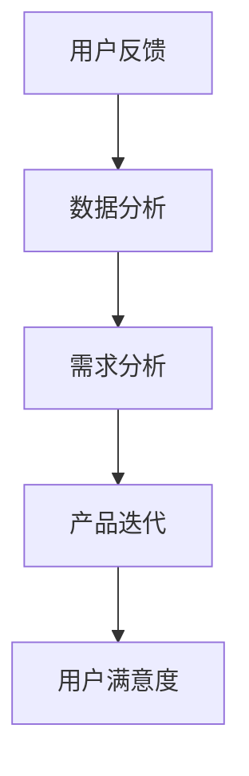

                 

在这个数字化迅速发展的时代，知识付费行业正呈现出前所未有的繁荣景象。无论是线上课程、专业咨询、还是电子书等，用户的需求不断变化，这要求知识付费平台不仅要提供高质量的内容，更需要不断地优化和迭代产品以满足用户期望。本文将探讨如何通过用户反馈收集与产品迭代，实现知识付费平台的长足发展。

## 关键词
- 知识付费
- 用户反馈
- 产品迭代
- 数据分析
- 用户满意度
- 需求分析

## 摘要
本文旨在深入分析知识付费行业中用户反馈的重要性，并探讨如何通过有效的用户反馈收集机制和产品迭代策略，提升用户体验，进而实现知识付费平台的可持续发展。文章将从背景介绍、核心概念、算法原理、数学模型、项目实践、实际应用场景等多个角度进行阐述，以期为行业从业者提供有价值的参考。

## 1. 背景介绍
### 1.1 知识付费行业现状
随着互联网技术的飞速发展和人们对于知识获取的渴求，知识付费行业近年来得到了迅猛发展。根据市场调研数据显示，知识付费用户规模持续扩大，用户消费能力不断增强。这表明，知识付费已经成为一个具备巨大市场潜力的领域。

### 1.2 用户需求多样化
知识付费用户群体的需求日益多样化，不仅限于某一特定领域。用户对于内容形式、更新速度、互动性等方面的要求越来越高。这使得知识付费平台必须不断调整和优化产品，以适应用户需求的变化。

### 1.3 竞争加剧
在知识付费领域，竞争日趋激烈。各大平台纷纷推出新的课程和功能，以吸引更多用户。因此，如何通过有效的用户反馈收集和产品迭代，提升用户满意度，成为平台发展的关键。

## 2. 核心概念与联系
### 2.1 用户反馈
用户反馈是指用户在使用产品过程中，对于产品功能、性能、体验等方面的评价和意见。有效的用户反馈是产品迭代的重要依据。

### 2.2 产品迭代
产品迭代是指根据用户反馈和市场变化，对产品进行不断优化和改进的过程。产品迭代有助于提升用户体验，增强用户粘性。

### 2.3 数据分析
数据分析是指通过对用户反馈数据的挖掘和分析，发现用户需求和行为规律，为产品迭代提供数据支持。

### 2.4 用户满意度
用户满意度是指用户对产品使用过程中的满意程度。用户满意度越高，产品的市场竞争力越强。

### 2.5 需求分析
需求分析是指通过对用户需求的理解和分析，确定产品功能、性能和用户体验等方面的发展方向。

## 2.1 核心概念原理和架构的 Mermaid 流程图


## 3. 核心算法原理 & 具体操作步骤

### 3.1 算法原理概述
用户反馈收集与产品迭代的核心算法主要涉及数据收集、数据分析、需求分析与产品优化等步骤。

### 3.2 算法步骤详解
#### 3.2.1 数据收集
数据收集是用户反馈收集的第一步。主要方式包括用户问卷调查、用户行为数据分析、用户评价等。

#### 3.2.2 数据分析
数据分析主要通过数据挖掘技术，对用户反馈数据进行分析，以发现用户行为规律和需求变化。

#### 3.2.3 需求分析
基于数据分析结果，对用户需求进行深入分析，明确产品优化方向。

#### 3.2.4 产品优化
根据需求分析结果，对产品进行功能优化、性能提升和用户体验改进。

### 3.3 算法优缺点
#### 优点
- 快速响应用户需求，提升用户满意度。
- 有助于提高产品竞争力，促进平台可持续发展。

#### 缺点
- 数据收集和处理需要大量资源，成本较高。
- 用户反馈可能存在主观性，需要结合实际情况进行分析。

### 3.4 算法应用领域
用户反馈收集与产品迭代算法广泛应用于各类知识付费平台，包括在线教育、专业咨询、电子书等领域。

## 4. 数学模型和公式 & 详细讲解 & 举例说明

### 4.1 数学模型构建
用户反馈收集与产品迭代的核心数学模型主要包括用户满意度模型和需求分析模型。

### 4.2 公式推导过程
#### 用户满意度模型
$$
\text{用户满意度} = f(\text{用户期望}, \text{产品实际表现})
$$

其中，用户期望和产品实际表现分别表示用户对于产品的预期和实际体验。

#### 需求分析模型
$$
\text{需求优先级} = f(\text{需求频率}, \text{需求满足度})
$$

其中，需求频率和需求满足度分别表示用户对某一需求的关注程度和当前产品对这一需求的满足程度。

### 4.3 案例分析与讲解
以某在线教育平台为例，分析其用户反馈收集与产品迭代过程。

#### 用户满意度分析
通过对用户满意度模型的分析，该平台发现用户对于课程内容的满意度相对较高，但对于互动性和课程更新速度方面存在一定的改进空间。

#### 需求分析
通过需求分析模型，该平台确定了以下需求优先级：
1. 提升课程互动性
2. 加快课程更新速度
3. 优化用户评价系统

## 5. 项目实践：代码实例和详细解释说明

### 5.1 开发环境搭建
搭建一个用户反馈收集与产品迭代的项目，需要配置以下开发环境：
- Python 3.x
- Django 3.x
- PostgreSQL 13.x

### 5.2 源代码详细实现
以下是一个简单的用户反馈收集与产品迭代的代码实例：

```python
# 用户反馈收集
class Feedback(models.Model):
    user = models.ForeignKey(User, on_delete=models.CASCADE)
    content = models.TextField()
    rating = models.IntegerField()
    created_at = models.DateTimeField(auto_now_add=True)

# 需求分析
def analyze_feedback(feedbacks):
    # 分析用户反馈，确定需求优先级
    # ...

# 产品优化
def optimize_product():
    # 根据需求分析结果，对产品进行优化
    # ...
```

### 5.3 代码解读与分析
上述代码实现了一个简单的用户反馈收集与产品迭代系统。通过定义`Feedback`模型，可以存储用户的反馈信息。`analyze_feedback`函数用于分析用户反馈，确定需求优先级。`optimize_product`函数则根据需求分析结果，对产品进行优化。

### 5.4 运行结果展示
通过运行上述代码，可以收集用户反馈，并根据反馈结果优化产品，从而提升用户体验。

## 6. 实际应用场景

### 6.1 在线教育平台
在线教育平台可以通过用户反馈收集与产品迭代，优化课程内容、提升互动性，从而增强用户粘性。

### 6.2 专业咨询平台
专业咨询平台可以通过用户反馈收集，了解用户需求，不断优化咨询服务，提高用户满意度。

### 6.3 电子书平台
电子书平台可以通过用户反馈，分析用户阅读偏好，推荐更多符合用户兴趣的书籍。

## 6.4 未来应用展望

### 6.4.1 人工智能技术的应用
未来，人工智能技术将在用户反馈收集与产品迭代中发挥更大作用。通过机器学习算法，可以更加精准地分析用户需求，实现个性化推荐。

### 6.4.2 大数据分析的深入应用
随着大数据技术的不断发展，用户反馈数据的挖掘和分析将更加深入，有助于发现更多潜在需求。

### 6.4.3 跨领域合作
知识付费平台可以与教育、医疗、金融等领域的机构进行合作，提供更多专业内容，满足用户多样化需求。

## 7. 工具和资源推荐

### 7.1 学习资源推荐
- 《深度学习》（Goodfellow et al.）
- 《Python核心编程》（Wesley J Chun）
- 《大数据技术基础》（刘伟平）

### 7.2 开发工具推荐
- PyCharm
- PostgreSQL
- Django

### 7.3 相关论文推荐
- "User Feedback and Its Impact on Product Design"
- "A Survey on Big Data Analytics in E-commerce"
- "Deep Learning for User Behavior Analysis"

## 8. 总结：未来发展趋势与挑战

### 8.1 研究成果总结
本文通过分析知识付费行业用户反馈收集与产品迭代的重要性，提出了核心算法原理和具体操作步骤，并进行了实际应用场景的探讨。

### 8.2 未来发展趋势
随着人工智能、大数据等技术的发展，知识付费行业用户反馈收集与产品迭代将更加智能化、精细化。

### 8.3 面临的挑战
如何处理海量用户反馈数据、确保数据安全、提升算法准确性等，将是知识付费平台在未来发展中面临的主要挑战。

### 8.4 研究展望
未来研究可以关注人工智能在用户反馈收集与产品迭代中的应用，探索更加智能化的算法和模型，以提高用户体验。

## 9. 附录：常见问题与解答

### 9.1 问题1
**如何确保用户反馈的真实性？**

**解答1**
确保用户反馈真实性的方法包括：
- 采用匿名反馈机制，减少用户顾虑。
- 设置身份验证，确保用户身份真实。
- 定期审核用户反馈，识别虚假反馈。

### 9.2 问题2
**如何处理用户反馈数据量庞大问题？**

**解答2**
处理用户反馈数据量庞大的方法包括：
- 利用大数据技术进行高效数据处理和分析。
- 建立数据仓库，实现数据存储和管理。
- 采用分布式计算框架，提高数据处理效率。

以上便是关于知识付费赚钱的用户反馈收集与产品迭代的详细探讨。希望通过本文的阐述，能为知识付费行业的从业者们提供一些有益的参考和启示。

## 作者署名
作者：禅与计算机程序设计艺术 / Zen and the Art of Computer Programming
```

