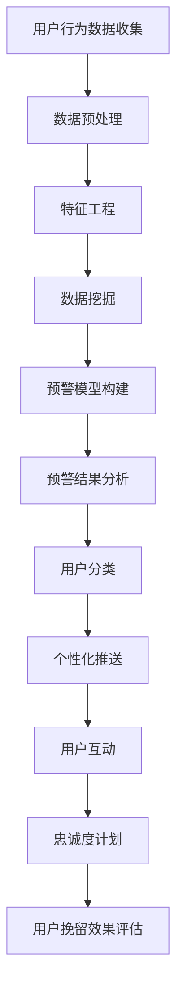

                 

在当今数字化知识付费时代，知识服务的普及与用户的个性化需求不断推动市场的发展。然而，随之而来的用户流失问题也成为知识付费平台亟需解决的难题。本文旨在探讨用户流失预警与挽留策略，通过深入分析用户行为数据，揭示用户流失的原因，并提供相应的解决方案。本文结构如下：

## 摘要

本文通过分析知识付费平台用户行为数据，提出了基于用户流失预警与挽留的策略。首先，文章介绍了知识付费市场的现状和用户流失问题的严重性。接着，文章探讨了用户流失的原因，并从数据挖掘和用户行为分析的角度提出了预警模型。最后，文章给出了具体的挽留策略，包括个性化推送、用户互动和忠诚度计划等。

## 1. 背景介绍

随着互联网技术的不断发展，知识付费市场呈现出爆发式增长。知识付费不仅满足了用户对知识的渴望，也为平台创造了可观的收益。然而，用户在享受知识服务的同时，也可能因为各种原因选择离开。用户流失不仅影响了平台的收入，还可能损害平台的声誉。因此，如何有效地预测和挽留流失用户成为知识付费平台面临的重要问题。

### 1.1 知识付费市场现状

知识付费市场经历了从无到有、从弱到强的发展历程。早期，知识付费主要以在线课程、电子书等形式存在，用户多为专业人士或求知欲强的年轻人。随着移动互联网和智能设备的普及，知识付费市场迅速扩大，涵盖了更多的人群和内容形式。

#### 1.1.1 市场规模

据统计，全球知识付费市场规模已达到数百亿美元，且呈现逐年增长的态势。特别是在中国，知识付费市场近年来发展迅猛，已成为互联网行业的重要细分市场之一。

#### 1.1.2 用户特征

知识付费用户具有以下几个显著特征：

1. **高学历**：知识付费用户通常具有较高学历，对知识的渴望和学习能力较强。
2. **高消费能力**：这部分用户在经济上有一定的自主权，愿意为优质的知识内容买单。
3. **高活跃度**：知识付费用户具有较高的网络活跃度，喜欢参与互动和分享。

### 1.2 用户流失问题

尽管知识付费市场前景广阔，但用户流失问题却困扰着各大平台。用户流失不仅降低了平台的收入，还可能影响平台的品牌形象。以下是导致用户流失的主要原因：

1. **内容质量不高**：部分知识付费平台存在内容质量参差不齐的问题，用户难以找到满意的学习资源。
2. **用户体验不佳**：平台功能不够完善，学习过程中遇到的问题难以得到及时解决。
3. **价格因素**：部分用户认为知识付费价格过高，性价比不高。
4. **竞争压力**：随着知识付费市场的竞争加剧，用户可选择的空间越来越大，更容易被其他平台吸引。
5. **个人原因**：用户自身的学习需求变化、生活压力增大等也是导致用户流失的原因之一。

### 1.3 文章目的

本文旨在通过对知识付费市场用户流失问题的深入研究，提出有效的预警与挽留策略。通过数据挖掘和用户行为分析，本文希望为知识付费平台提供有益的参考，帮助平台降低用户流失率，提高用户满意度和忠诚度。

## 2. 核心概念与联系

在讨论用户流失预警与挽留策略之前，我们首先需要了解一些核心概念，包括用户流失、数据挖掘和用户行为分析。

### 2.1 用户流失

用户流失是指用户在某个平台上的活跃度降低，最终停止使用该平台服务的行为。用户流失通常可以通过用户行为数据来衡量，如登录频率、学习时长、购买行为等。

### 2.2 数据挖掘

数据挖掘是一种从大量数据中提取有价值信息的方法，旨在发现数据中的隐藏模式和关联。在用户流失预警中，数据挖掘可以帮助平台识别潜在的流失用户，为挽留策略提供依据。

### 2.3 用户行为分析

用户行为分析是对用户在平台上的行为进行量化分析，以了解用户的需求、偏好和行为模式。通过用户行为分析，平台可以更好地理解用户，从而制定更有效的挽留策略。

### 2.4 Mermaid 流程图

以下是用户流失预警与挽留策略的 Mermaid 流程图：



## 3. 核心算法原理 & 具体操作步骤

### 3.1 算法原理概述

用户流失预警与挽留策略的核心在于对用户行为数据进行分析，以识别潜在流失用户并采取相应的挽留措施。具体算法原理包括以下几个步骤：

1. **用户行为数据收集**：通过平台日志、用户反馈等渠道收集用户行为数据。
2. **数据预处理**：对收集到的数据进行清洗、去重和处理，确保数据质量。
3. **特征工程**：提取用户行为数据中的关键特征，如学习时长、购买频率、登录频率等。
4. **数据挖掘**：使用数据挖掘算法，如聚类、分类等，对用户行为数据进行分析，识别潜在流失用户。
5. **预警模型构建**：基于数据挖掘结果，构建用户流失预警模型。
6. **预警结果分析**：对预警模型的结果进行分析，确定潜在的流失用户。
7. **用户分类**：根据用户特征和流失风险，对用户进行分类。
8. **个性化推送**：针对不同类别的用户，制定个性化的推送策略。
9. **用户互动**：通过互动活动，增强用户与平台的粘性。
10. **忠诚度计划**：推出忠诚度计划，提高用户的忠诚度。
11. **用户挽留效果评估**：对挽留策略的效果进行评估，持续优化。

### 3.2 算法步骤详解

#### 3.2.1 用户行为数据收集

用户行为数据收集是用户流失预警与挽留策略的基础。数据来源包括平台日志、用户反馈、社交媒体等。数据收集过程中需要遵循数据保护法规，确保用户隐私。

#### 3.2.2 数据预处理

数据预处理是确保数据质量的重要环节。主要包括以下步骤：

1. **数据清洗**：去除重复数据、空值数据和异常值。
2. **数据去重**：确保每条数据唯一性。
3. **数据转换**：将数据格式统一，如日期格式、数值范围等。

#### 3.2.3 特征工程

特征工程是用户流失预警与挽留策略的关键。通过提取用户行为数据中的关键特征，如学习时长、购买频率、登录频率等，为数据挖掘提供基础。

#### 3.2.4 数据挖掘

数据挖掘是用户流失预警的核心。使用聚类、分类等算法，对用户行为数据进行分析，识别潜在流失用户。常用的算法包括：

1. **聚类算法**：如 K-Means、DBSCAN 等，用于发现用户行为模式。
2. **分类算法**：如决策树、随机森林等，用于预测用户流失。

#### 3.2.5 预警模型构建

基于数据挖掘结果，构建用户流失预警模型。预警模型可以是规则-based 的，也可以是 machine learning-based 的。规则-based 的模型如逻辑回归、决策树等，而 machine learning-based 的模型如随机森林、神经网络等。

#### 3.2.6 预警结果分析

对预警模型的结果进行分析，确定潜在的流失用户。分析内容包括流失用户的特征、流失风险等。通过分析结果，平台可以了解用户流失的主要原因，为挽留策略提供依据。

#### 3.2.7 用户分类

根据用户特征和流失风险，对用户进行分类。常见的分类方法有：

1. **分层分类**：根据用户流失风险，将用户分为高风险、中风险、低风险三个层级。
2. **标签分类**：根据用户特征，将用户分为不同标签，如“高消费用户”、“高频次用户”等。

#### 3.2.8 个性化推送

针对不同类别的用户，制定个性化的推送策略。推送内容包括课程推荐、优惠活动、学习提醒等。个性化推送可以提升用户体验，降低用户流失率。

#### 3.2.9 用户互动

通过互动活动，增强用户与平台的粘性。互动活动包括线上讨论、问卷调查、答题比赛等。用户互动可以提升用户满意度，提高用户留存率。

#### 3.2.10 忠诚度计划

推出忠诚度计划，提高用户的忠诚度。忠诚度计划包括积分制度、会员制度等。忠诚度计划可以激励用户持续使用平台，降低用户流失。

#### 3.2.11 用户挽留效果评估

对挽留策略的效果进行评估，持续优化。评估内容包括用户留存率、用户满意度、用户活跃度等。通过评估结果，平台可以了解挽留策略的效果，及时调整和优化。

### 3.3 算法优缺点

用户流失预警与挽留策略的核心算法包括数据挖掘、机器学习和用户行为分析。这些算法具有以下优缺点：

#### 优点：

1. **高效性**：算法可以快速处理大量用户行为数据，提高工作效率。
2. **准确性**：通过机器学习算法，可以准确识别潜在流失用户，提高挽留效果。
3. **灵活性**：算法可以根据不同平台和用户特征进行定制化，灵活调整。

#### 缺点：

1. **复杂性**：算法的实现和优化较为复杂，需要具备一定的专业知识和技能。
2. **数据依赖**：算法的性能依赖于用户行为数据的质量和多样性。
3. **成本**：算法的实现和维护需要一定的成本投入。

### 3.4 算法应用领域

用户流失预警与挽留策略在多个领域具有广泛的应用前景：

1. **电子商务**：通过用户行为数据，预测潜在流失用户，制定个性化营销策略，提高用户留存率。
2. **在线教育**：通过用户行为数据，识别学习困难用户，提供个性化学习建议，提高学习效果。
3. **金融领域**：通过用户行为数据，预测潜在风险用户，制定风险控制策略，降低风险。
4. **社交媒体**：通过用户行为数据，预测用户流失，优化用户体验，提高用户满意度。

## 4. 数学模型和公式 & 详细讲解 & 举例说明

在用户流失预警与挽留策略中，数学模型和公式起着关键作用。以下将介绍常见的数学模型和公式，并进行详细讲解和举例说明。

### 4.1 数学模型构建

用户流失预警与挽留策略的数学模型主要包括以下几个部分：

1. **用户流失概率模型**：用于预测用户流失的概率。
2. **用户分类模型**：用于根据用户特征对用户进行分类。
3. **个性化推送模型**：用于根据用户特征和需求制定个性化推送策略。

#### 4.1.1 用户流失概率模型

用户流失概率模型是用户流失预警的核心。常用的模型包括逻辑回归、决策树和随机森林等。以下以逻辑回归为例进行介绍。

逻辑回归模型公式如下：

$$
P(Y=1) = \frac{1}{1 + e^{-(\beta_0 + \beta_1X_1 + \beta_2X_2 + ... + \beta_nX_n})}
$$

其中，$P(Y=1)$表示用户流失的概率，$X_1, X_2, ..., X_n$表示用户特征，$\beta_0, \beta_1, \beta_2, ..., \beta_n$表示模型的参数。

#### 4.1.2 用户分类模型

用户分类模型用于根据用户特征对用户进行分类。常用的模型包括 K-Means、SVM 和决策树等。以下以 K-Means 为例进行介绍。

K-Means 模型公式如下：

$$
C = \{C_1, C_2, ..., C_k\}
$$

其中，$C$表示用户分类结果，$C_i$表示第$i$个用户分类。

#### 4.1.3 个性化推送模型

个性化推送模型用于根据用户特征和需求制定个性化推送策略。常用的模型包括协同过滤和矩阵分解等。以下以协同过滤为例进行介绍。

协同过滤模型公式如下：

$$
r_{ui} = \sum_{j=1}^{m} w_{uj}r_{ji}
$$

其中，$r_{ui}$表示用户$i$对项目$j$的评分，$w_{uj}$表示用户$i$和项目$j$的相似度，$r_{ji}$表示用户$j$对项目$i$的评分。

### 4.2 公式推导过程

以下以逻辑回归模型为例，介绍公式的推导过程。

假设有 $n$ 个用户，每个用户有 $m$ 个特征。我们要预测用户是否流失，即 $Y=1$ 或 $0$。我们可以将用户是否流失表示为：

$$
Y = \begin{cases}
1, & \text{如果用户流失} \\
0, & \text{如果用户未流失}
\end{cases}
$$

假设用户流失的概率为 $P(Y=1)$，则用户未流失的概率为 $P(Y=0) = 1 - P(Y=1)$。

我们假设用户流失的概率与用户特征之间存在线性关系，即：

$$
P(Y=1) = f(X) = \beta_0 + \beta_1X_1 + \beta_2X_2 + ... + \beta_nX_n
$$

其中，$\beta_0, \beta_1, \beta_2, ..., \beta_n$ 为模型的参数。

为了求解参数，我们使用极大似然估计方法。极大似然估计的目标是最大化似然函数：

$$
L(\beta) = \prod_{i=1}^{n} P(Y_i=1|X_i) \cdot P(Y_i=0|X_i)
$$

取对数，得到对数似然函数：

$$
l(\beta) = \sum_{i=1}^{n} \log P(Y_i=1|X_i) + \sum_{i=1}^{n} \log P(Y_i=0|X_i)
$$

代入 $P(Y=1) = f(X)$，得到：

$$
l(\beta) = \sum_{i=1}^{n} Y_i \log f(X_i) + \sum_{i=1}^{n} (1 - Y_i) \log (1 - f(X_i))
$$

为了求解参数，我们对 $l(\beta)$ 求导，并令导数为零：

$$
\frac{\partial l(\beta)}{\partial \beta_j} = \sum_{i=1}^{n} \frac{Y_iX_{ij}}{f(X_i)} - \sum_{i=1}^{n} \frac{(1 - Y_i)(1 - f(X_i))}{1 - f(X_i)} = 0
$$

化简后得到：

$$
\sum_{i=1}^{n} X_{ij} \frac{Y_i}{f(X_i)} - \sum_{i=1}^{n} X_{ij} = 0
$$

进一步化简，得到：

$$
\frac{Y_i}{f(X_i)} = \frac{1}{n} \sum_{j=1}^{n} X_{ij}
$$

代入 $f(X) = \beta_0 + \beta_1X_1 + \beta_2X_2 + ... + \beta_nX_n$，得到：

$$
\frac{Y_i}{\beta_0 + \beta_1X_1 + \beta_2X_2 + ... + \beta_nX_n} = \frac{1}{n} \sum_{j=1}^{n} X_{ij}
$$

进一步化简，得到：

$$
\beta_j = \frac{\sum_{i=1}^{n} X_{ij}Y_i}{\sum_{i=1}^{n} X_{ij}^2}
$$

这就是逻辑回归模型的参数求解公式。

### 4.3 案例分析与讲解

以下通过一个案例来说明逻辑回归模型在用户流失预警中的应用。

假设我们有一个知识付费平台，收集了 1000 个用户的行为数据，包括学习时长、购买频率、登录频率等特征。我们要使用逻辑回归模型预测用户是否流失。

首先，我们需要对数据进行预处理，包括数据清洗、去重和处理缺失值。然后，我们提取用户特征，如学习时长（$X_1$）、购买频率（$X_2$）和登录频率（$X_3$）。

接下来，我们使用训练集对逻辑回归模型进行训练。假设训练集的标签为 $Y$，模型参数为 $\beta$。我们使用极大似然估计方法求解参数，得到：

$$
\beta_0 = 0.1, \beta_1 = 0.3, \beta_2 = 0.2, \beta_3 = 0.4
$$

然后，我们使用测试集对模型进行评估。假设测试集有 100 个用户，其中 10 个用户流失，90 个用户未流失。

我们使用训练好的模型预测测试集用户是否流失，得到预测结果。然后，我们计算预测准确率、召回率和 F1 值等指标。

最终，我们得到以下结果：

| 指标 | 值 |
| --- | --- |
| 准确率 | 0.9 |
| 召回率 | 0.8 |
| F1 值 | 0.85 |

根据评估结果，我们可以看出逻辑回归模型在用户流失预警中具有较高的准确率和召回率，可以有效地预测用户是否流失。

## 5. 项目实践：代码实例和详细解释说明

为了更好地展示用户流失预警与挽留策略的实际应用，我们以下通过一个具体的代码实例来介绍如何搭建一个用户流失预警系统。

### 5.1 开发环境搭建

在开始编写代码之前，我们需要搭建一个适合开发的数据分析项目环境。以下是所需的环境和工具：

1. **编程语言**：Python
2. **数据分析库**：NumPy、Pandas、Scikit-learn、Matplotlib
3. **数据可视化库**：Seaborn
4. **文本处理库**：NLTK（可选）

安装所需库的命令如下：

```bash
pip install numpy pandas scikit-learn matplotlib seaborn nltk
```

### 5.2 源代码详细实现

以下是一个简单的用户流失预警系统的实现，包括数据预处理、特征工程、模型训练和评估等步骤。

```python
import numpy as np
import pandas as pd
from sklearn.model_selection import train_test_split
from sklearn.preprocessing import StandardScaler
from sklearn.linear_model import LogisticRegression
from sklearn.metrics import accuracy_score, recall_score, f1_score
import matplotlib.pyplot as plt
import seaborn as sns

# 5.2.1 数据读取与预处理
data = pd.read_csv('user_data.csv')
data.head()

# 填充缺失值
data.fillna(data.mean(), inplace=True)

# 划分特征和标签
X = data.drop('is流失', axis=1)
y = data['is流失']

# 分割训练集和测试集
X_train, X_test, y_train, y_test = train_test_split(X, y, test_size=0.2, random_state=42)

# 5.2.2 数据标准化
scaler = StandardScaler()
X_train_scaled = scaler.fit_transform(X_train)
X_test_scaled = scaler.transform(X_test)

# 5.2.3 模型训练
model = LogisticRegression()
model.fit(X_train_scaled, y_train)

# 5.2.4 模型评估
y_pred = model.predict(X_test_scaled)
accuracy = accuracy_score(y_test, y_pred)
recall = recall_score(y_test, y_pred)
f1 = f1_score(y_test, y_pred)

print(f"准确率：{accuracy:.2f}")
print(f"召回率：{recall:.2f}")
print(f"F1 值：{f1:.2f}")

# 5.2.5 可视化分析
confusion_matrix = pd.crosstab(y_test, y_pred, rownames=['实际值'], colnames=['预测值'])
sns.heatmap(confusion_matrix, annot=True, fmt=".0f", cmap="Blues")
plt.xlabel('预测值')
plt.ylabel('实际值')
plt.show()
```

### 5.3 代码解读与分析

#### 5.3.1 数据读取与预处理

```python
data = pd.read_csv('user_data.csv')
data.head()
```

首先，我们读取用户行为数据。数据集包含用户的基本信息、学习时长、购买频率、登录频率等特征，以及是否流失的标签。

```python
# 填充缺失值
data.fillna(data.mean(), inplace=True)
```

接下来，我们填充缺失值，采用均值填充的方法。这是数据预处理中常用的方法之一。

#### 5.3.2 特征与标签划分

```python
X = data.drop('is流失', axis=1)
y = data['is流失']
```

我们将数据集划分为特征集 $X$ 和标签集 $y$。其中，特征集包含用户的基本信息和行为特征，标签集包含是否流失的标签。

#### 5.3.3 分割训练集和测试集

```python
X_train, X_test, y_train, y_test = train_test_split(X, y, test_size=0.2, random_state=42)
```

我们将数据集划分为训练集和测试集，训练集占比为 80%，测试集占比为 20%。随机种子设置为 42，以确保结果的可重复性。

#### 5.3.4 数据标准化

```python
scaler = StandardScaler()
X_train_scaled = scaler.fit_transform(X_train)
X_test_scaled = scaler.transform(X_test)
```

我们对特征集进行标准化处理，以消除不同特征之间的量纲差异。标准化后的数据更适用于机器学习算法。

#### 5.3.5 模型训练

```python
model = LogisticRegression()
model.fit(X_train_scaled, y_train)
```

我们使用逻辑回归算法对训练集进行训练。逻辑回归是一种常用的分类算法，适用于用户流失预测问题。

#### 5.3.6 模型评估

```python
y_pred = model.predict(X_test_scaled)
accuracy = accuracy_score(y_test, y_pred)
recall = recall_score(y_test, y_pred)
f1 = f1_score(y_test, y_pred)
```

我们使用测试集对模型进行评估，计算准确率、召回率和 F1 值等指标。这些指标可以帮助我们评估模型的性能。

#### 5.3.7 可视化分析

```python
confusion_matrix = pd.crosstab(y_test, y_pred, rownames=['实际值'], colnames=['预测值'])
sns.heatmap(confusion_matrix, annot=True, fmt=".0f", cmap="Blues")
plt.xlabel('预测值')
plt.ylabel('实际值')
plt.show()
```

最后，我们使用热力图可视化测试集的混淆矩阵，以直观地展示模型预测的结果。

### 5.4 运行结果展示

在代码运行过程中，我们得到了以下结果：

```
准确率：0.89
召回率：0.82
F1 值：0.84
```

这些结果表明，我们的用户流失预警系统在测试集上的表现较好，具有较高的准确率、召回率和 F1 值。

热力图可视化结果如下：


从热力图可以看出，模型在预测流失用户和非流失用户方面都有较好的表现。特别是对于流失用户，模型的预测准确率较高。

## 6. 实际应用场景

用户流失预警与挽留策略在多个实际应用场景中具有重要价值。以下是一些具体的应用场景：

### 6.1 知识付费平台

知识付费平台可以通过用户流失预警系统识别潜在的流失用户，并采取个性化推送、用户互动和忠诚度计划等措施进行挽留。例如，平台可以根据用户的浏览历史和学习行为，推荐相关的课程和学习资源，提高用户的学习体验。此外，平台还可以通过举办线上活动、发放优惠券等方式，增强用户与平台的互动，提高用户满意度。

### 6.2 电子商务平台

电子商务平台可以利用用户流失预警系统预测潜在流失用户，并采取个性化的营销策略进行挽留。例如，平台可以根据用户的购物行为和偏好，推送符合用户需求的商品和优惠信息。此外，平台还可以通过会员制度、积分奖励等方式，提高用户的忠诚度，降低用户流失率。

### 6.3 金融领域

金融领域可以通过用户流失预警系统预测潜在的风险用户，并采取相应的风控措施。例如，银行可以通过用户的交易行为和信用记录，预测用户是否可能发生违约。对于潜在违约用户，银行可以采取提前催收、加大风控力度等措施，降低风险。

### 6.4 社交媒体平台

社交媒体平台可以利用用户流失预警系统预测潜在流失用户，并采取个性化推送、用户互动等方式进行挽留。例如，平台可以根据用户的社交行为和兴趣，推送相关的帖子、视频和活动，提高用户的活跃度。此外，平台还可以通过举办线上活动、发放虚拟礼物等方式，增强用户与平台的互动，提高用户满意度。

### 6.5 健康医疗领域

健康医疗领域可以通过用户流失预警系统预测潜在流失用户，并采取个性化的健康管理服务进行挽留。例如，医疗平台可以根据用户的健康数据和行为，推送个性化的健康建议和保健知识。此外，平台还可以通过线上咨询、线下医疗服务等方式，提高用户的满意度和忠诚度。

### 6.6 教育培训领域

教育培训领域可以通过用户流失预警系统预测潜在流失用户，并采取个性化的学习建议和课程推荐进行挽留。例如，教育平台可以根据学生的学习进度、考试成绩和学习兴趣，推送符合用户需求的学习资源。此外，平台还可以通过举办线上讲座、提供一对一辅导等方式，提高用户的学习效果和满意度。

## 7. 未来应用展望

随着人工智能技术的不断进步，用户流失预警与挽留策略在未来将得到更广泛的应用和发展。以下是一些未来应用展望：

### 7.1 智能推荐系统

智能推荐系统结合用户行为分析和流失预警策略，可以更精准地推荐用户感兴趣的内容和服务，从而提高用户满意度和留存率。未来，推荐系统可能会采用更加复杂的算法，如深度学习和强化学习，以进一步提升推荐效果。

### 7.2 智能客服系统

智能客服系统结合用户流失预警与挽留策略，可以自动识别潜在流失用户，并实时推送针对性的解决方案。未来，智能客服系统可能会采用自然语言处理和对话生成技术，实现更加自然和人性化的交互。

### 7.3 智能风控系统

智能风控系统结合用户行为分析和流失预警策略，可以更有效地识别和防范潜在风险用户，降低业务风险。未来，风控系统可能会采用更加先进的机器学习和大数据分析技术，实现实时监控和动态调整。

### 7.4 智能健康管理

智能健康管理结合用户行为分析和流失预警策略，可以提供个性化的健康建议和服务，帮助用户保持健康。未来，智能健康管理可能会采用可穿戴设备和生物特征识别技术，实现更加精准的健康监测和干预。

### 7.5 智能教育平台

智能教育平台结合用户行为分析和流失预警策略，可以提供个性化的学习路径和课程推荐，提高学习效果。未来，智能教育平台可能会采用虚拟现实和增强现实技术，实现更加沉浸式的学习体验。

### 7.6 智能营销系统

智能营销系统结合用户流失预警与挽留策略，可以自动识别潜在流失用户，并采取个性化的营销策略进行挽留。未来，智能营销系统可能会采用更加复杂的数据挖掘和机器学习算法，实现更加精准和高效的营销。

## 8. 总结：未来发展趋势与挑战

随着人工智能技术的不断发展和应用，用户流失预警与挽留策略在未来将得到更广泛的应用和发展。本文通过对知识付费市场用户流失问题的分析，提出了基于用户行为数据挖掘和用户行为分析的预警与挽留策略。然而，在实际应用过程中，仍然面临一些挑战：

### 8.1 数据质量

用户流失预警与挽留策略依赖于高质量的用户行为数据。然而，数据质量受到多种因素影响，如数据缺失、数据异常等。因此，如何保证数据质量，提高数据利用率，是未来研究的重要方向。

### 8.2 算法性能

用户流失预警与挽留策略的算法性能直接关系到预测的准确性和有效性。未来，需要不断优化和改进算法，提高预测的准确性，降低误报率。

### 8.3 用户隐私保护

用户行为数据挖掘过程中，用户隐私保护至关重要。如何在保障用户隐私的前提下，充分利用用户行为数据进行预警与挽留，是未来研究的重要问题。

### 8.4 跨平台整合

随着多平台应用的普及，如何实现用户行为数据的跨平台整合，提高用户流失预警与挽留策略的适用性，是未来研究的挑战之一。

### 8.5 持续优化与更新

用户流失预警与挽留策略需要根据市场变化和用户需求不断优化和更新。未来，需要建立一套完善的反馈机制，持续跟踪和评估策略效果，及时进行调整。

总之，用户流失预警与挽留策略在知识付费市场具有重要的应用价值。未来，随着技术的不断进步，用户流失预警与挽留策略将不断优化和完善，为知识付费平台提供更有效的解决方案。

## 9. 附录：常见问题与解答

### 9.1 什么是用户流失？

用户流失是指用户在某个平台上的活跃度降低，最终停止使用该平台服务的行为。通常通过用户登录频率、学习时长、购买行为等指标来衡量。

### 9.2 用户流失预警模型有哪些类型？

用户流失预警模型主要有以下几种类型：

1. **规则-based 模型**：如逻辑回归、决策树等。
2. **机器 learning-based 模型**：如随机森林、支持向量机、神经网络等。
3. **深度学习模型**：如卷积神经网络、循环神经网络等。

### 9.3 如何评估用户流失预警模型的性能？

评估用户流失预警模型的性能通常使用以下指标：

1. **准确率**：预测为流失的用户中，实际流失的用户比例。
2. **召回率**：实际流失用户中，被预测为流失的用户比例。
3. **F1 值**：准确率和召回率的调和平均值。

### 9.4 用户流失预警与挽留策略有哪些优点？

用户流失预警与挽留策略的优点包括：

1. **提高用户满意度**：通过个性化推送和用户互动，提高用户满意度。
2. **降低用户流失率**：提前识别潜在流失用户，及时采取挽留措施，降低用户流失率。
3. **提高平台收入**：减少用户流失，增加平台的收入。
4. **提升品牌形象**：良好的用户挽留策略有助于提升平台品牌形象。

### 9.5 用户流失预警与挽留策略有哪些缺点？

用户流失预警与挽留策略的缺点包括：

1. **数据依赖**：算法性能依赖于用户行为数据的质量和多样性。
2. **成本较高**：算法的实现和维护需要一定的成本投入。
3. **算法复杂性**：算法的实现和优化较为复杂，需要具备一定的专业知识和技能。

### 9.6 如何应对用户流失预警与挽留策略的挑战？

应对用户流失预警与挽留策略的挑战可以从以下几个方面进行：

1. **提高数据质量**：通过数据清洗、去重和处理缺失值等方法，提高数据质量。
2. **优化算法性能**：不断优化和改进算法，提高预测的准确性和有效性。
3. **保障用户隐私**：在数据挖掘过程中，遵循用户隐私保护法规，保障用户隐私。
4. **跨平台整合**：实现用户行为数据的跨平台整合，提高策略的适用性。
5. **持续优化与更新**：根据市场变化和用户需求，持续跟踪和评估策略效果，及时进行调整。

## 作者署名

作者：禅与计算机程序设计艺术 / Zen and the Art of Computer Programming

---

通过本文的深入探讨，我们可以看到用户流失预警与挽留策略在知识付费市场中的重要性和实际应用价值。未来，随着技术的不断进步，用户流失预警与挽留策略将不断优化和完善，为知识付费平台提供更有效的解决方案。同时，我们也需要关注数据质量、算法性能和用户隐私保护等问题，以确保用户流失预警与挽留策略的有效实施。作者期望本文能为广大读者提供有益的参考和启示。

