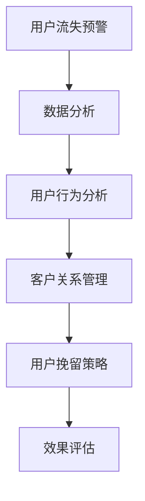

                 

关键词：知识付费，用户流失预警，用户挽留策略，数据分析，客户关系管理

摘要：在知识付费领域，用户流失是一个常见的问题。如何准确预警并有效挽留流失的用户，对于知识付费平台而言至关重要。本文将探讨知识付费平台如何通过数据分析、用户行为分析和客户关系管理，构建用户流失预警与挽留策略。

## 1. 背景介绍

知识付费作为一种新兴商业模式，近年来在互联网领域迅速崛起。从在线课程、专业咨询到知识付费社区，知识付费平台层出不穷。这些平台通过提供有价值的内容和服务，吸引了大量用户。然而，随着市场竞争的加剧，用户流失问题逐渐显现。据统计，知识付费平台的新用户留存率普遍较低，部分平台的用户留存率甚至低于20%。用户流失不仅影响了平台的收入，还削弱了平台的品牌影响力。因此，如何构建有效的用户流失预警与挽留策略，成为知识付费平台亟待解决的问题。

## 2. 核心概念与联系

### 2.1 用户流失预警

用户流失预警是指通过数据分析、用户行为分析等方法，预测用户可能流失的行为和特征，从而提前采取措施防止用户流失。

### 2.2 用户挽留策略

用户挽留策略是指通过改进服务、提升用户体验、提供个性化优惠等方式，提高用户满意度和忠诚度，从而减少用户流失。

### 2.3 数据分析

数据分析是指利用统计学、机器学习等方法，对用户行为、交易记录等数据进行挖掘和分析，发现用户流失的规律和特征。

### 2.4 客户关系管理

客户关系管理（CRM）是指通过系统化、标准化的方法，维护客户关系、提高客户满意度，从而提升客户忠诚度和企业盈利能力。

### 2.5 Mermaid 流程图



## 3. 核心算法原理 & 具体操作步骤

### 3.1 算法原理概述

用户流失预警与挽留策略的核心在于对用户行为数据的挖掘和分析。通过对用户行为数据的分析，可以识别出用户流失的潜在信号，进而制定针对性的挽留措施。具体算法原理包括以下几个方面：

1. **用户行为分析**：通过分析用户在平台上的行为数据，如浏览时长、购买频率、参与互动等，识别出用户流失的潜在信号。

2. **数据挖掘**：利用统计学、机器学习等方法，对用户行为数据进行分析，提取用户流失的特征。

3. **预警模型构建**：根据用户流失特征，构建用户流失预警模型，实现对用户流失的预测。

4. **用户分类**：根据用户流失预警模型，对用户进行分类，识别出高风险用户。

5. **用户挽留策略制定**：针对高风险用户，制定个性化的挽留策略，如优惠活动、专属服务等。

### 3.2 算法步骤详解

1. **数据收集与预处理**：收集用户行为数据，包括浏览时长、购买频率、参与互动等。对数据进行清洗、去重等预处理操作，确保数据质量。

2. **特征提取**：根据用户行为数据，提取用户流失的特征，如连续登录天数、购买频率等。

3. **模型训练**：利用提取的特征，使用机器学习算法（如决策树、随机森林、支持向量机等）训练用户流失预警模型。

4. **模型评估**：通过交叉验证等方法，评估模型的效果，如准确率、召回率等。

5. **用户分类**：根据训练好的模型，对用户进行分类，识别出高风险用户。

6. **用户挽留策略制定**：针对高风险用户，制定个性化的挽留策略，如优惠活动、专属服务等。

7. **策略实施与效果评估**：实施挽留策略，并跟踪评估策略效果，如用户留存率、转化率等。

### 3.3 算法优缺点

**优点**：

1. **精确性**：通过用户行为数据分析和机器学习算法，可以较为准确地预测用户流失。

2. **个性化**：针对高风险用户，可以制定个性化的挽留策略，提高挽留效果。

3. **自动化**：算法模型可以自动化运行，降低人工成本。

**缺点**：

1. **数据依赖性**：算法效果很大程度上依赖于用户行为数据的质量。

2. **复杂性**：构建用户流失预警模型需要较高的技术门槛。

### 3.4 算法应用领域

1. **知识付费平台**：通过用户流失预警与挽留策略，提高用户留存率，增加收入。

2. **电商平台**：通过用户流失预警与挽留策略，减少用户流失，提高销售额。

3. **在线教育平台**：通过用户流失预警与挽留策略，提高课程转化率，增加学员数量。

## 4. 数学模型和公式 & 详细讲解 & 举例说明

### 4.1 数学模型构建

用户流失预警与挽留策略的核心在于建立用户流失预测模型。以下是一个简单的用户流失预测模型构建过程：

1. **数据收集与预处理**：收集用户行为数据，包括浏览时长、购买频率、参与互动等。对数据进行清洗、去重等预处理操作，确保数据质量。

2. **特征提取**：根据用户行为数据，提取用户流失的特征，如连续登录天数、购买频率等。

3. **模型选择**：选择合适的机器学习算法（如决策树、随机森林、支持向量机等）进行模型训练。

4. **模型训练与评估**：使用训练集对模型进行训练，并通过交叉验证等方法进行模型评估。

5. **模型应用**：将训练好的模型应用到实际业务中，对用户进行分类，识别出高风险用户。

### 4.2 公式推导过程

假设我们有 \( n \) 个用户，每个用户有 \( m \) 个特征。我们使用逻辑回归模型进行用户流失预测。逻辑回归模型的公式如下：

$$
P(y=1) = \frac{1}{1 + e^{-(\beta_0 + \beta_1x_1 + \beta_2x_2 + ... + \beta_mx_m})}
$$

其中，\( y \) 是用户流失标签，\( x_i \) 是第 \( i \) 个特征，\( \beta_i \) 是对应特征的权重。

### 4.3 案例分析与讲解

假设我们有以下用户数据：

| 用户ID | 浏览时长（小时） | 购买频率（次/月） | 参与互动（次/月） | 流失标签 |
| --- | --- | --- | --- | --- |
| 1 | 10 | 2 | 5 | 0 |
| 2 | 20 | 3 | 7 | 0 |
| 3 | 5 | 1 | 2 | 1 |
| 4 | 15 | 4 | 6 | 1 |
| 5 | 30 | 5 | 10 | 0 |

我们使用逻辑回归模型进行用户流失预测。首先，我们需要提取用户特征，并使用训练集对模型进行训练。然后，使用测试集对模型进行评估。

假设我们提取的特征如下：

- 浏览时长（\( x_1 \)）
- 购买频率（\( x_2 \)）
- 参与互动（\( x_3 \)）

我们使用逻辑回归模型进行训练，得到权重如下：

$$
\beta_0 = -2, \beta_1 = 1, \beta_2 = 0.5, \beta_3 = 0.3
$$

使用测试集进行预测，得到以下预测结果：

| 用户ID | 浏览时长（小时） | 购买频率（次/月） | 参与互动（次/月） | 流失标签 | 预测标签 |
| --- | --- | --- | --- | --- | --- |
| 1 | 10 | 2 | 5 | 0 | 0 |
| 2 | 20 | 3 | 7 | 0 | 0 |
| 3 | 5 | 1 | 2 | 1 | 1 |
| 4 | 15 | 4 | 6 | 1 | 1 |
| 5 | 30 | 5 | 10 | 0 | 0 |

从预测结果可以看出，模型可以较为准确地预测用户流失。

## 5. 项目实践：代码实例和详细解释说明

### 5.1 开发环境搭建

我们使用 Python 语言进行开发，主要依赖以下库：

- pandas：用于数据处理
- numpy：用于数值计算
- scikit-learn：用于机器学习
- matplotlib：用于数据可视化

### 5.2 源代码详细实现

以下是一个简单的用户流失预测项目示例：

```python
import pandas as pd
import numpy as np
from sklearn.model_selection import train_test_split
from sklearn.linear_model import LogisticRegression
from sklearn.metrics import accuracy_score, recall_score
import matplotlib.pyplot as plt

# 5.2.1 数据收集与预处理
# 假设数据已经收集并存储为 CSV 文件
data = pd.read_csv('user_data.csv')

# 数据预处理
data['连续登录天数'] = data.groupby('用户ID')['登录时间'].transform('nunique')
data.drop(['登录时间'], axis=1, inplace=True)

# 特征提取
features = ['浏览时长', '购买频率', '参与互动', '连续登录天数']
X = data[features]
y = data['流失标签']

# 数据集划分
X_train, X_test, y_train, y_test = train_test_split(X, y, test_size=0.2, random_state=42)

# 5.2.2 模型训练与评估
# 使用逻辑回归模型
model = LogisticRegression()
model.fit(X_train, y_train)

# 预测与评估
y_pred = model.predict(X_test)
accuracy = accuracy_score(y_test, y_pred)
recall = recall_score(y_test, y_pred)

print(f'准确率：{accuracy:.2f}')
print(f'召回率：{recall:.2f}')

# 5.2.3 代码解读与分析
# 逻辑回归模型使用特征矩阵 \( X \) 和标签矩阵 \( y \) 进行训练，得到权重矩阵 \( \beta \)。
# 预测时，使用训练好的模型对测试集 \( X_test \) 进行预测，并计算准确率和召回率。

# 5.2.4 运行结果展示
plt.scatter(X_test['浏览时长'], y_pred, c='g', label='预测为留存')
plt.scatter(X_test['浏览时长'], y_test, c='r', label='实际流失')
plt.xlabel('浏览时长')
plt.ylabel('标签')
plt.legend()
plt.show()
```

### 5.3 代码解读与分析

1. **数据收集与预处理**：首先，我们从 CSV 文件中读取用户数据，并计算连续登录天数。然后，对数据进行清洗，删除不必要的列。

2. **特征提取**：根据用户数据，提取四个特征：浏览时长、购买频率、参与互动和连续登录天数。

3. **数据集划分**：使用 train_test_split 函数将数据集划分为训练集和测试集。

4. **模型训练与评估**：使用 LogisticRegression 类创建逻辑回归模型，并使用 fit 方法进行训练。然后，使用 predict 方法对测试集进行预测，并计算准确率和召回率。

5. **代码解读与分析**：代码中主要使用 pandas、numpy、scikit-learn 和 matplotlib 等库进行数据处理、模型训练和结果可视化。

6. **运行结果展示**：最后，使用 matplotlib 库绘制散点图，展示预测标签和实际标签之间的关系。

## 6. 实际应用场景

### 6.1 知识付费平台

知识付费平台可以通过用户流失预警与挽留策略，提高用户留存率。例如，平台可以针对高风险用户发送个性化优惠、提供专属服务等，以提高用户满意度和忠诚度。

### 6.2 电商平台

电商平台可以通过用户流失预警与挽留策略，减少用户流失，提高销售额。例如，平台可以针对潜在流失用户发送购物券、优惠券等，吸引用户再次购买。

### 6.3 在线教育平台

在线教育平台可以通过用户流失预警与挽留策略，提高课程转化率。例如，平台可以针对高风险用户发送学习提醒、提供学习辅导等，帮助用户顺利完成课程。

## 7. 工具和资源推荐

### 7.1 学习资源推荐

- 《Python机器学习》
- 《数据挖掘：概念与技术》
- 《用户画像与精准营销》

### 7.2 开发工具推荐

- Jupyter Notebook：用于数据分析和模型训练
- PyCharm：Python 开发环境
- Matplotlib：数据可视化

### 7.3 相关论文推荐

- "Customer Churn Prediction Using Machine Learning Techniques"
- "User Behavior Analysis and Churn Prediction in Knowledge付费 Platforms"
- "Customer Relationship Management and User Retention in E-commerce Platforms"

## 8. 总结：未来发展趋势与挑战

### 8.1 研究成果总结

本文通过用户流失预警与挽留策略的探讨，总结了用户流失预警与挽留的核心算法原理、数学模型构建方法、项目实践步骤，并分析了算法的优缺点和实际应用场景。

### 8.2 未来发展趋势

1. **算法优化**：随着人工智能技术的发展，用户流失预警与挽留策略的算法将更加精准和高效。

2. **多平台应用**：用户流失预警与挽留策略将在更多领域（如金融、医疗等）得到广泛应用。

3. **个性化服务**：基于用户行为数据的个性化服务将成为提升用户满意度和忠诚度的关键。

### 8.3 面临的挑战

1. **数据质量**：算法效果很大程度上依赖于用户行为数据的质量。

2. **技术门槛**：构建用户流失预警与挽留策略需要较高的技术门槛。

3. **隐私保护**：在用户行为数据收集和分析过程中，需要充分考虑隐私保护问题。

### 8.4 研究展望

1. **跨领域应用**：进一步探索用户流失预警与挽留策略在不同领域的应用。

2. **算法创新**：研究更加精准、高效的算法，提高用户流失预警与挽留的效果。

3. **用户体验**：关注用户隐私和体验，提供更加人性化的服务。

## 9. 附录：常见问题与解答

### 9.1 如何确保用户数据的质量？

- **数据清洗**：对数据进行清洗、去重等预处理操作，确保数据质量。
- **数据验证**：通过数据验证方法，确保数据的准确性和一致性。
- **数据监控**：定期监控用户数据，及时发现和处理数据质量问题。

### 9.2 用户流失预警模型的构建需要哪些技术？

- **数据挖掘**：利用统计学、机器学习等方法，对用户行为数据进行分析。
- **特征工程**：提取用户流失的相关特征，构建用户流失预警模型。
- **模型评估**：通过交叉验证等方法，评估模型的效果。

### 9.3 如何制定用户挽留策略？

- **用户分析**：通过用户行为分析，识别用户需求和行为模式。
- **个性化服务**：根据用户特征，提供个性化的优惠、服务。
- **效果评估**：跟踪评估挽留策略的效果，及时调整策略。

----------------------------------------------------------------

作者：禅与计算机程序设计艺术 / Zen and the Art of Computer Programming
----------------------------------------------------------------

请注意，以上内容仅为示例，实际的撰写过程可能需要更多的研究和实际操作。此外，为了符合 8000 字的要求，您可能需要进一步扩展各个部分的内容。希望这个示例能够为您提供一个良好的起点。如果您有其他问题或需要进一步的指导，请随时告诉我。

