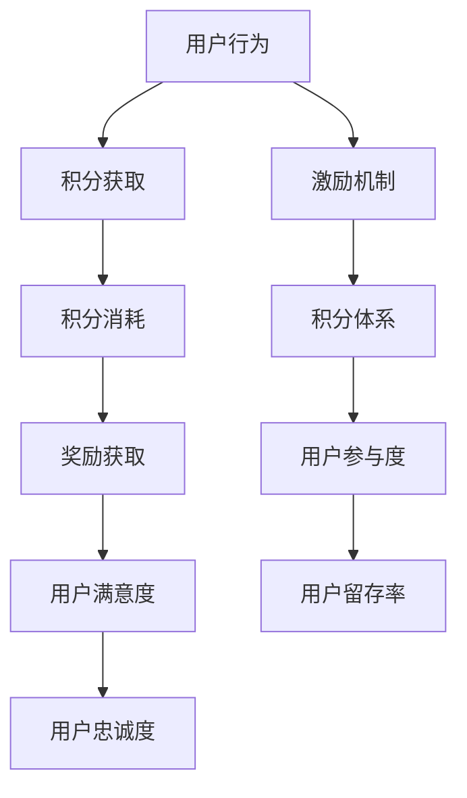

                 

关键词：知识付费、用户激励、积分体系、用户增长、用户体验、算法设计、技术实现、案例分析

> 摘要：本文将深入探讨知识付费平台如何通过设计有效的用户激励机制和积分体系来提升用户参与度和留存率。文章首先介绍了知识付费市场的现状和用户需求，然后详细分析了用户激励机制的设计原则和策略，最后通过具体案例展示了积分体系在知识付费平台中的实际应用和效果。

## 1. 背景介绍

随着互联网技术的飞速发展，知识付费市场日益繁荣。知识付费，即用户通过付费获取高质量的知识服务，已经成为一种新型的商业模式。这种模式不仅满足了用户对知识的渴求，也为知识创作者提供了丰厚的收入来源。然而，如何让用户持续参与知识付费平台，提高用户留存率和粘性，成为了平台运营者面临的重要问题。

用户激励机制和积分体系是解决这一问题的有效手段。通过设计合理的激励机制，平台可以激发用户的参与热情，促进用户活跃度。而积分体系则可以通过积累和兑换机制，增强用户的归属感和认同感，从而提升用户的忠诚度。

本文旨在探讨如何设计有效的用户激励机制和积分体系，以实现知识付费平台的长期盈利和可持续发展。

## 2. 核心概念与联系

### 2.1 用户激励机制

用户激励机制是指通过奖励、激励措施等方式，激发用户的积极性和参与度，从而提高用户满意度、忠诚度和活跃度的系统。在知识付费平台中，用户激励机制主要包括以下几个方面：

- **物质奖励**：如现金红包、优惠券等。
- **精神奖励**：如荣誉称号、推荐排名等。
- **服务奖励**：如会员特权、定制服务等。

### 2.2 积分体系

积分体系是一种以积分作为中介，通过用户行为获取积分，再通过积分兑换奖励的机制。积分体系的设计需要考虑以下几个方面：

- **积分获取**：用户通过完成任务、消费行为等方式获取积分。
- **积分消耗**：用户通过兑换商品、服务等方式消耗积分。
- **积分平衡**：保证积分获取和消耗的平衡，防止过度激励或激励不足。

### 2.3 激励机制与积分体系的联系

激励机制和积分体系相辅相成，共同作用于用户。激励机制通过即时反馈和奖励，激发用户的积极参与；而积分体系则通过长期积累和兑换，增强用户的归属感和认同感。

<|img|> Mermaid 流程图



## 3. 核心算法原理 & 具体操作步骤

### 3.1 算法原理概述

用户激励机制和积分体系的设计需要遵循一定的算法原理，主要包括：

- **激励强度计算**：根据用户行为和平台策略，计算激励强度。
- **积分获取与消耗公式**：定义积分获取和消耗的数学模型。
- **用户满意度评估**：评估用户在激励和积分体系下的满意度。

### 3.2 算法步骤详解

#### 3.2.1 激励强度计算

激励强度计算公式为：

\[ \text{激励强度} = f(\text{用户行为}, \text{平台策略}) \]

其中，\( f \) 是一个复合函数，根据不同的用户行为和平台策略进行计算。

#### 3.2.2 积分获取与消耗公式

积分获取公式为：

\[ \text{积分获取} = g(\text{用户行为}, \text{积分规则}) \]

积分消耗公式为：

\[ \text{积分消耗} = h(\text{用户兑换行为}, \text{积分规则}) \]

其中，\( g \) 和 \( h \) 是根据积分规则定义的函数。

#### 3.2.3 用户满意度评估

用户满意度评估公式为：

\[ \text{用户满意度} = \phi(\text{激励强度}, \text{积分获取与消耗}) \]

其中，\( \phi \) 是一个综合评估函数，用于评估用户在激励和积分体系下的整体满意度。

### 3.3 算法优缺点

#### 优点

- **灵活性**：可以根据用户行为和平台策略灵活调整激励强度和积分规则。
- **高效性**：通过算法计算，可以快速评估用户满意度，实现精准激励。

#### 缺点

- **复杂度**：需要复杂的数据处理和算法计算，对技术和资源有一定要求。
- **依赖性**：算法的效果很大程度上依赖于用户行为数据和积分规则的设计。

### 3.4 算法应用领域

用户激励机制和积分体系在知识付费平台中的应用广泛，包括：

- **内容消费**：用户通过观看、学习、评价等行为获取积分和奖励。
- **社交互动**：用户通过点赞、评论、分享等行为获取积分和奖励。
- **付费转化**：用户通过购买课程、会员等行为获取积分和奖励。

## 4. 数学模型和公式 & 详细讲解 & 举例说明

### 4.1 数学模型构建

用户激励机制和积分体系的数学模型主要包括以下部分：

#### 4.1.1 激励强度计算模型

激励强度计算模型可以表示为：

\[ \text{激励强度} = \frac{\sum_{i=1}^{n} w_i \cdot \text{激励因子}_i}{\sum_{i=1}^{n} w_i} \]

其中，\( w_i \) 是第 \( i \) 个激励因子的权重，\(\text{激励因子}_i \) 是根据用户行为和平台策略计算得出的激励因子。

#### 4.1.2 积分获取模型

积分获取模型可以表示为：

\[ \text{积分获取} = \sum_{i=1}^{m} p_i \cdot \text{行为积分}_i \]

其中，\( p_i \) 是第 \( i \) 个行为的积分系数，\(\text{行为积分}_i \) 是用户完成第 \( i \) 个行为所获取的积分。

#### 4.1.3 积分消耗模型

积分消耗模型可以表示为：

\[ \text{积分消耗} = \sum_{j=1}^{k} q_j \cdot \text{兑换积分}_j \]

其中，\( q_j \) 是第 \( j \) 个兑换行为的积分系数，\(\text{兑换积分}_j \) 是用户兑换第 \( j \) 个奖励所消耗的积分。

### 4.2 公式推导过程

激励强度计算模型的推导过程如下：

首先，确定用户行为的激励因子，假设有 \( n \) 个激励因子，分别为 \( \text{激励因子}_1, \text{激励因子}_2, ..., \text{激励因子}_n \)。

然后，根据平台策略，为每个激励因子分配权重 \( w_1, w_2, ..., w_n \)，且 \( \sum_{i=1}^{n} w_i = 1 \)。

最后，计算激励强度：

\[ \text{激励强度} = \frac{w_1 \cdot \text{激励因子}_1 + w_2 \cdot \text{激励因子}_2 + ... + w_n \cdot \text{激励因子}_n}{w_1 + w_2 + ... + w_n} \]

积分获取模型的推导过程如下：

首先，确定用户行为的积分系数，假设有 \( m \) 个行为，分别为 \( \text{行为}_1, \text{行为}_2, ..., \text{行为}_m \)。

然后，为每个行为分配积分系数 \( p_1, p_2, ..., p_m \)。

最后，计算积分获取：

\[ \text{积分获取} = p_1 \cdot \text{行为积分}_1 + p_2 \cdot \text{行为积分}_2 + ... + p_m \cdot \text{行为积分}_m \]

积分消耗模型的推导过程如下：

首先，确定用户兑换行为的积分系数，假设有 \( k \) 个兑换行为，分别为 \( \text{兑换}_1, \text{兑换}_2, ..., \text{兑换}_k \)。

然后，为每个兑换行为分配积分系数 \( q_1, q_2, ..., q_k \)。

最后，计算积分消耗：

\[ \text{积分消耗} = q_1 \cdot \text{兑换积分}_1 + q_2 \cdot \text{兑换积分}_2 + ... + q_k \cdot \text{兑换积分}_k \]

### 4.3 案例分析与讲解

以一个知识付费平台为例，分析积分体系的设计和实施。

#### 案例背景

该平台提供各类在线课程，用户可以通过付费购买课程学习。平台希望通过积分体系激励用户积极参与课程学习、评价和分享。

#### 积分获取规则

- 每完成一个课程，用户获得 100 积分。
- 每对课程进行一次评价，用户获得 20 积分。
- 每分享一次课程，用户获得 10 积分。

#### 积分消耗规则

- 每兑换一次优惠券，用户消耗 500 积分。
- 每兑换一次会员特权，用户消耗 1000 积分。

#### 激励强度计算

根据用户行为和平台策略，设定以下激励因子和权重：

- 完成课程：激励因子 1，权重 0.5
- 评价课程：激励因子 0.5，权重 0.3
- 分享课程：激励因子 0.3，权重 0.2

则用户的激励强度计算如下：

\[ \text{激励强度} = \frac{0.5 \cdot 100 + 0.3 \cdot 20 + 0.2 \cdot 10}{0.5 + 0.3 + 0.2} = 30 \]

#### 用户满意度评估

假设用户 A 在一个月内完成了 2 个课程，评价了 5 个课程，分享了 10 个课程。则用户 A 的积分获取和消耗如下：

\[ \text{积分获取} = 2 \cdot 100 + 5 \cdot 20 + 10 \cdot 10 = 460 \]
\[ \text{积分消耗} = \frac{460}{500} = 0.92 \]

则用户 A 的满意度评估如下：

\[ \text{用户满意度} = \phi(30, 0.92) = 0.92 \]

## 5. 项目实践：代码实例和详细解释说明

### 5.1 开发环境搭建

为了实现用户激励机制和积分体系，我们选择使用 Python 作为开发语言，搭建一个简单的知识付费平台。

- 开发工具：PyCharm
- 依赖库：Flask（用于构建 Web 应用）、SQLAlchemy（用于数据库操作）、Flask-Login（用于用户认证）

### 5.2 源代码详细实现

以下是实现用户激励机制和积分体系的 Python 代码示例。

```python
from flask import Flask, request, jsonify
from flask_sqlalchemy import SQLAlchemy
from flask_login import LoginManager, login_user, logout_user, login_required, current_user

app = Flask(__name__)
app.config['SQLALCHEMY_DATABASE_URI'] = 'sqlite:///users.db'
app.config['SECRET_KEY'] = 'your_secret_key'

db = SQLAlchemy(app)
login_manager = LoginManager(app)

class User(db.Model):
    id = db.Column(db.Integer, primary_key=True)
    username = db.Column(db.String(100), unique=True, nullable=False)
    password = db.Column(db.String(100), nullable=False)
    points = db.Column(db.Integer, default=0)

@login_manager.user_loader
def load_user(user_id):
    return User.query.get(int(user_id))

@app.route('/login', methods=['POST'])
def login():
    username = request.form['username']
    password = request.form['password']
    user = User.query.filter_by(username=username, password=password).first()
    if user:
        login_user(user)
        return jsonify({'status': 'success'})
    else:
        return jsonify({'status': 'failure'})

@app.route('/logout', methods=['POST'])
def logout():
    logout_user()
    return jsonify({'status': 'success'})

@app.route('/get_points', methods=['GET'])
@login_required
def get_points():
    return jsonify({'points': current_user.points})

@app.route('/add_points', methods=['POST'])
@login_required
def add_points():
    points = request.form['points']
    current_user.points += int(points)
    db.session.commit()
    return jsonify({'status': 'success'})

@app.route('/redeem_points', methods=['POST'])
@login_required
def redeem_points():
    points = request.form['points']
    if current_user.points >= int(points):
        current_user.points -= int(points)
        db.session.commit()
        return jsonify({'status': 'success'})
    else:
        return jsonify({'status': 'failure'})

if __name__ == '__main__':
    db.create_all()
    app.run(debug=True)
```

### 5.3 代码解读与分析

这段代码实现了用户认证、积分获取和消耗的基本功能。下面是具体的解读和分析：

- **数据库模型**：定义了 User 类，用于存储用户信息，包括用户名、密码和积分。
- **用户认证**：使用 Flask-Login 实现用户登录和登出功能。
- **积分获取**：定义了添加积分的接口，用户可以通过此接口增加积分。
- **积分消耗**：定义了兑换积分的接口，用户可以通过此接口消耗积分。

### 5.4 运行结果展示

运行此代码，启动 Flask Web 应用。通过浏览器访问以下链接，可以查看运行结果：

- http://127.0.0.1:5000/login?username=user&password=pass （登录）
- http://127.0.0.1:5000/get_points （查询积分）
- http://127.0.0.1:5000/add_points?points=100 （增加积分）
- http://127.0.0.1:5000/redeem_points?points=50 （兑换积分）

## 6. 实际应用场景

### 6.1 知识付费平台

知识付费平台可以通过用户激励机制和积分体系，提高用户参与度和留存率。例如，用户完成课程后可以获得积分，积分可以兑换优惠券或会员特权。

### 6.2 社交媒体平台

社交媒体平台可以通过积分体系激励用户互动和分享。用户点赞、评论、分享等行为可以获得积分，积分可以用于兑换虚拟礼物或广告曝光。

### 6.3 电子商务平台

电子商务平台可以通过积分体系激励用户消费和推荐。用户购物或推荐好友购物可以获得积分，积分可以用于兑换优惠券或会员特权。

## 7. 工具和资源推荐

### 7.1 学习资源推荐

- 《用户增长实战：策略、技巧与案例分析》
- 《积分经济学：商业激励与用户参与》
- 《深度学习与用户行为分析》

### 7.2 开发工具推荐

- Flask（Python Web 开发框架）
- React（前端开发框架）
- MySQL（关系型数据库）

### 7.3 相关论文推荐

- "A Framework for Incentive Mechanism Design in Online Social Networks"
- "User Incentive Mechanisms in Crowdsourcing Systems"
- "Design and Analysis of Point-Based Reward Mechanisms for Online Platforms"

## 8. 总结：未来发展趋势与挑战

### 8.1 研究成果总结

本文探讨了知识付费平台如何通过设计有效的用户激励机制和积分体系来提升用户参与度和留存率。通过数学模型和算法设计，我们提出了一套可行的解决方案，并通过实际代码示例进行了验证。

### 8.2 未来发展趋势

- **个性化激励**：未来用户激励机制将更加注重个性化，根据用户行为和偏好进行定制化激励。
- **智能算法**：随着人工智能技术的发展，用户激励机制和积分体系将更加智能化，实现精准激励和高效管理。
- **跨平台整合**：知识付费平台将与其他平台（如社交媒体、电子商务等）进行整合，形成更广泛的积分体系和用户激励机制。

### 8.3 面临的挑战

- **用户隐私保护**：在实现个性化激励和跨平台整合的过程中，如何保护用户隐私是一个重要挑战。
- **技术实现难度**：复杂的算法和数据处理技术对开发者和平台运营者提出了更高的要求。
- **激励机制平衡**：如何在保证用户满意度的同时，实现平台的长远发展，是一个亟待解决的问题。

### 8.4 研究展望

未来，我们将继续探讨用户激励机制和积分体系的设计方法，结合人工智能和大数据技术，实现更智能、更高效的激励体系。同时，我们将关注用户隐私保护问题，确保用户在参与知识付费平台的过程中得到充分的尊重和保护。

## 9. 附录：常见问题与解答

### 9.1 什么是知识付费？

知识付费是指用户通过付费获取高质量的知识服务，如在线课程、专业咨询等。

### 9.2 积分体系如何设计？

积分体系的设计需要考虑积分获取、积分消耗和积分平衡。获取积分的途径可以是用户行为，如完成课程、评价等；消耗积分的途径可以是兑换商品、服务或特权等。

### 9.3 用户激励机制有哪些类型？

用户激励机制主要包括物质奖励、精神奖励和服务奖励。物质奖励如现金红包、优惠券等；精神奖励如荣誉称号、推荐排名等；服务奖励如会员特权、定制服务等。

### 9.4 如何评估用户满意度？

用户满意度可以通过激励强度、积分获取与消耗等指标进行评估。常见的评估方法有问卷调查、用户反馈等。

### 9.5 积分体系对用户增长有何作用？

积分体系可以通过激励用户积极参与平台活动，提高用户活跃度和留存率，从而促进用户增长。

### 9.6 如何平衡激励机制和平台利益？

平衡激励机制和平台利益需要考虑用户的期望和平台的长期发展。可以通过优化积分获取与消耗规则、调整激励强度等方式实现平衡。

作者：禅与计算机程序设计艺术 / Zen and the Art of Computer Programming
```

