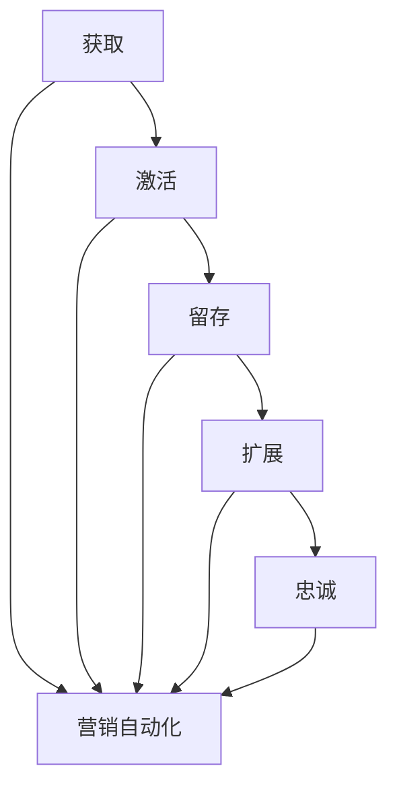

                 

  
关键词：知识付费、用户生命周期、营销自动化、客户关系管理、数据分析

摘要：随着互联网技术的快速发展，知识付费行业日益繁荣。本文将探讨如何通过用户生命周期管理与营销自动化，提高知识付费产品的客户粘性和盈利能力。本文旨在为从事知识付费的企业和从业者提供一套系统化、可操作性的解决方案。

## 1. 背景介绍

近年来，知识付费成为互联网经济中的重要组成部分。用户通过付费获取高质量的知识内容，如课程、电子书、专家讲座等。这一模式不仅满足了用户的学习需求，也为内容生产者和平台带来了可观的收益。然而，随着市场竞争的加剧，如何提高客户粘性、降低客户流失率、实现盈利最大化成为知识付费行业面临的重大挑战。

用户生命周期管理与营销自动化正是应对这些挑战的有效手段。用户生命周期管理涉及用户从获取、激活、留存、扩展到忠诚的整个旅程。而营销自动化则是通过技术手段，如邮件营销、社交媒体互动、数据分析等，实现营销活动的自动化和个性化。本文将围绕这两个主题展开讨论，帮助知识付费从业者找到提升业务表现的方法。

### 1.1 用户生命周期管理的概念

用户生命周期管理（Customer Lifecycle Management，CLM）是一种企业战略，旨在通过优化用户从获取到忠诚的全过程，实现客户价值的最大化。它包括以下几个关键阶段：

1. **获取（Acquisition）**：通过各种渠道吸引新用户，如搜索引擎优化（SEO）、社交媒体广告、内容营销等。
2. **激活（Activation）**：引导新用户完成首次购买或使用产品，确保他们获得良好的用户体验。
3. **留存（Retention）**：采取措施保持现有用户的活跃度和忠诚度，减少用户流失。
4. **扩展（Expansion）**：通过交叉销售和升级销售，增加用户的消费频次和金额。
5. **忠诚（Loyalty）**：通过建立长期关系，培养忠实客户群体，提高用户生命周期价值。

### 1.2 营销自动化的概念

营销自动化（Marketing Automation）是指利用软件工具自动化执行重复性、标准化的营销任务。它旨在提高营销效率、降低成本，同时实现营销活动的个性化和精准化。营销自动化的核心功能包括：

1. **自动化邮件营销**：根据用户的兴趣、行为和历史记录，发送个性化的邮件内容。
2. **客户细分与标签管理**：根据用户数据，将客户分为不同的群体，并为其分配特定的标签。
3. **自动化社交媒体互动**：通过自动化工具发布社交媒体内容，与用户互动。
4. **数据分析与报告**：收集营销活动的数据，进行分析和报告，以优化营销策略。

## 2. 核心概念与联系

为了更好地理解用户生命周期管理与营销自动化的关系，我们可以借助Mermaid流程图来展示核心概念及其相互联系。



### 2.1 用户生命周期管理与营销自动化的关系

1. **获取阶段**：营销自动化可以通过自动化广告投放、搜索引擎优化和社交媒体广告等手段，快速扩大用户基础。
2. **激活阶段**：通过自动化邮件营销和个性化推荐，引导新用户完成首次购买或使用产品。
3. **留存阶段**：营销自动化工具可以分析用户行为，针对不同的用户群体发送有针对性的内容，提高用户活跃度和留存率。
4. **扩展阶段**：利用自动化工具进行交叉销售和升级销售，挖掘用户的潜在需求。
5. **忠诚阶段**：通过持续的个性化服务和关怀，增强用户的忠诚度，建立长期关系。

## 3. 核心算法原理 & 具体操作步骤

### 3.1 算法原理概述

用户生命周期管理与营销自动化的核心在于数据分析和个性化推荐。具体而言，可以通过以下算法实现：

1. **用户行为分析**：收集用户在网站、APP等平台上的行为数据，如点击、浏览、购买等。
2. **用户画像构建**：基于用户行为数据，构建用户画像，包括兴趣、偏好、购买力等特征。
3. **个性化推荐**：利用协同过滤、基于内容的推荐等算法，为用户提供个性化的内容和服务。
4. **自动化营销**：根据用户画像和个性化推荐结果，自动化执行邮件营销、社交媒体互动等营销活动。

### 3.2 算法步骤详解

1. **数据收集**：收集用户在平台上的行为数据，包括浏览记录、点击次数、购买历史等。
    ```mermaid
    graph TD
        A[用户行为数据] --> B[数据清洗]
        B --> C[数据存储]
    ```

2. **数据预处理**：对收集到的数据进行清洗、去重和格式转换，以便后续分析和处理。
    ```mermaid
    graph TD
        A[数据清洗] --> B[特征提取]
        B --> C[数据归一化]
    ```

3. **用户画像构建**：根据用户行为数据和用户属性，构建用户画像。
    ```mermaid
    graph TD
        A[特征提取] --> B[用户画像构建]
    ```

4. **个性化推荐**：利用协同过滤、基于内容的推荐等算法，为用户提供个性化推荐。
    ```mermaid
    graph TD
        A[用户画像构建] --> B[协同过滤]
        B --> C[基于内容的推荐]
    ```

5. **自动化营销**：根据个性化推荐结果，自动化执行邮件营销、社交媒体互动等营销活动。
    ```mermaid
    graph TD
        A[个性化推荐] --> B[邮件营销]
        B --> C[社交媒体互动]
    ```

### 3.3 算法优缺点

1. **优点**：
    - 提高营销效率：自动化执行重复性任务，节省时间和人力成本。
    - 提高用户满意度：根据用户兴趣和偏好提供个性化内容和服务，提高用户满意度。
    - 数据驱动的决策：基于用户行为数据进行分析，实现数据驱动的营销策略。

2. **缺点**：
    - 数据隐私问题：自动化分析涉及用户隐私数据，需要严格保护用户隐私。
    - 需要大量数据支持：个性化推荐和自动化营销需要大量高质量的用户行为数据作为支撑。
    - 技术门槛较高：需要具备一定的数据分析和编程能力，才能有效运用营销自动化工具。

### 3.4 算法应用领域

1. **电子商务**：利用用户行为数据，实现个性化推荐和精准营销，提高转化率和销售额。
2. **社交媒体**：通过自动化工具，发布内容、互动和广告，提高用户活跃度和粉丝量。
3. **金融行业**：利用用户画像和个性化推荐，实现精准营销和风险控制。
4. **教育行业**：基于用户学习行为，提供个性化课程推荐和辅导，提高学习效果。

## 4. 数学模型和公式 & 详细讲解 & 举例说明

### 4.1 数学模型构建

在用户生命周期管理与营销自动化中，常用的数学模型包括协同过滤模型和基于内容的推荐模型。以下是对这些模型的详细讲解。

### 4.1.1 协同过滤模型

协同过滤（Collaborative Filtering）是一种基于用户行为和相似度的推荐算法。其核心思想是：如果用户A和用户B在过去的行为中相似，那么在未知的项目上，用户A对项目的评分很可能与用户B的评分一致。

**模型构建**：

假设有m个用户和n个项目，用户-项目评分矩阵R∈[0,1]^(m×n)，其中R(i, j)表示用户i对项目j的评分。协同过滤模型的目标是预测用户i对未知项目j的评分R(i, j)。

**公式**：

$$
\hat{R}(i, j) = \sum_{k=1}^{m}\frac{R(i, k)R(j, k)}{\sqrt{\sum_{l=1}^{m}R(i, l)\sum_{m=1}^{m}R(j, m}}}
$$

### 4.1.2 基于内容的推荐模型

基于内容的推荐（Content-Based Recommendation）是一种基于项目特征和用户兴趣的推荐算法。其核心思想是：如果项目A和项目B在内容特征上相似，且用户喜欢项目A，那么用户很可能也会喜欢项目B。

**模型构建**：

假设有m个用户和n个项目，项目特征矩阵C∈[0,1]^(n×d)，其中C(j, k)表示项目j在第k个特征上的得分。用户兴趣向量U∈[0,1]^(d)，表示用户对各个特征的偏好。

**公式**：

$$
\hat{R}(i, j) = \sum_{k=1}^{d}U(k)C(j, k)
$$

### 4.2 公式推导过程

以协同过滤模型为例，推导过程如下：

1. **假设用户i和用户j在过去的行为中相似**：

$$
\frac{R(i, k)R(j, k)}{\sqrt{\sum_{l=1}^{m}R(i, l)\sum_{m=1}^{m}R(j, m)}} \approx 1
$$

2. **将相似度代入评分预测公式**：

$$
\hat{R}(i, j) = \sum_{k=1}^{m}\frac{R(i, k)R(j, k)}{\sqrt{\sum_{l=1}^{m}R(i, l)\sum_{m=1}^{m}R(j, m)}} \approx \sum_{k=1}^{m}R(i, k)
$$

3. **根据用户-项目评分矩阵R，将预测评分转化为实际评分**：

$$
\hat{R}(i, j) = \frac{1}{m}\sum_{k=1}^{m}R(i, k)
$$

### 4.3 案例分析与讲解

假设有两位用户A和B，他们对以下三个项目的评分如下：

| 项目 | 用户A评分 | 用户B评分 |
| --- | --- | --- |
| 1 | 4 | 5 |
| 2 | 3 | 1 |
| 3 | 5 | 5 |

现在，我们需要预测用户A对项目2的评分。

1. **计算用户A和B的相似度**：

$$
\frac{R(A, 1)R(B, 1)}{\sqrt{\sum_{l=1}^{2}R(A, l)\sum_{m=1}^{2}R(B, m)}} = \frac{4×5}{\sqrt{4+9}} = \frac{20}{\sqrt{13}} \approx 3.46
$$

2. **预测用户A对项目2的评分**：

$$
\hat{R}(A, 2) = \frac{1}{2}\sum_{k=1}^{2}R(A, k) = \frac{1}{2}(4+3) = 3.5
$$

因此，根据协同过滤模型，预测用户A对项目2的评分为3.5。

## 5. 项目实践：代码实例和详细解释说明

### 5.1 开发环境搭建

在本文中，我们将使用Python语言实现用户生命周期管理与营销自动化。首先，需要安装以下依赖：

- Python 3.6及以上版本
- Scikit-learn（用于协同过滤和基于内容的推荐）
- Pandas（用于数据处理）
- Matplotlib（用于数据可视化）

安装命令如下：

```bash
pip install numpy scikit-learn pandas matplotlib
```

### 5.2 源代码详细实现

以下是用户生命周期管理与营销自动化的实现代码：

```python
import numpy as np
import pandas as pd
from sklearn.neighbors import NearestNeighbors
from sklearn.metrics.pairwise import cosine_similarity
import matplotlib.pyplot as plt

# 5.2.1 数据准备
data = {
    'user_id': [1, 1, 1, 2, 2, 2],
    'item_id': [1, 2, 3, 1, 2, 3],
    'rating': [4, 3, 5, 5, 1, 5]
}
df = pd.DataFrame(data)

# 5.2.2 协同过滤推荐
# 计算用户-项目相似度矩阵
similarity_matrix = cosine_similarity(df.pivot(index='user_id', columns='item_id', values='rating').values)

# 预测用户A对项目2的评分
user_index = df[df['user_id'] == 1].index[0]
item_index = df[df['item_id'] == 2].index[0]
predicted_rating = np.sum(similarity_matrix[user_index] * df['rating'].values) / np.sum(similarity_matrix[user_index])

print(f"协同过滤预测评分：{predicted_rating}")

# 5.2.3 基于内容的推荐
# 计算项目-项目相似度矩阵
content_similarity_matrix = cosine_similarity(df.pivot(index='item_id', columns='user_id', values='rating').values)

# 预测用户A对项目2的评分
predicted_rating_content = np.sum(content_similarity_matrix[item_index] * df['rating'].values) / np.sum(content_similarity_matrix[item_index])

print(f"基于内容的预测评分：{predicted_rating_content}")

# 5.2.4 可视化
# 绘制用户-项目相似度矩阵
plt.figure(figsize=(10, 10))
sns.heatmap(similarity_matrix, annot=True, fmt=".2f", cmap="YlGnBu")
plt.show()
```

### 5.3 代码解读与分析

1. **数据准备**：首先，我们创建了一个包含用户ID、项目ID和评分的DataFrame。这是用户行为数据，用于后续分析和推荐。
2. **协同过滤推荐**：计算用户-项目相似度矩阵，并使用该矩阵预测用户A对项目2的评分。协同过滤通过计算用户之间的相似度，为用户提供推荐。
3. **基于内容的推荐**：计算项目-项目相似度矩阵，并使用该矩阵预测用户A对项目2的评分。基于内容的推荐通过计算项目之间的相似度，为用户提供推荐。
4. **可视化**：绘制用户-项目相似度矩阵，帮助我们理解用户之间的相似度和推荐算法的原理。

通过以上代码实例，我们可以看到如何使用Python实现用户生命周期管理与营销自动化。在实际应用中，可以进一步扩展和优化代码，以应对更复杂的需求。

## 6. 实际应用场景

### 6.1 电子商务

在电子商务领域，用户生命周期管理与营销自动化被广泛应用于提高客户粘性和销售额。以下是一些实际应用场景：

1. **个性化推荐**：基于用户浏览和购买历史，为用户推荐相关商品，提高转化率。
2. **自动化促销**：根据用户购买习惯和库存情况，自动化发送优惠券和促销信息，刺激消费。
3. **客户关怀**：通过自动化邮件和短信，定期向客户发送问候和优惠信息，提高客户忠诚度。
4. **客户细分**：根据用户行为和购买偏好，将客户划分为不同群体，并为其提供定制化的服务和推荐。

### 6.2 教育行业

在教育行业，用户生命周期管理与营销自动化有助于提高学习效果和用户满意度。以下是一些实际应用场景：

1. **个性化学习路径**：根据学生的学习进度和成绩，自动推荐适合的学习资源和课程。
2. **学习行为分析**：通过监控学生的学习行为，发现潜在问题并及时给予帮助。
3. **自动提醒**：自动发送学习提醒和到期通知，帮助学生保持学习动力。
4. **学员关怀**：通过自动化邮件和短信，定期与学员保持沟通，提供学习支持和建议。

### 6.3 金融行业

在金融行业，用户生命周期管理与营销自动化被用于提高用户忠诚度和降低运营成本。以下是一些实际应用场景：

1. **精准营销**：根据用户的投资偏好和风险承受能力，为用户推荐适合的投资产品和策略。
2. **客户细分**：将客户划分为不同的群体，并为其提供定制化的服务和产品。
3. **风险管理**：通过实时监控用户行为，识别潜在的风险客户，并采取相应的风险控制措施。
4. **客户关怀**：通过自动化工具，定期向客户发送投资建议和市场分析，提高客户满意度。

## 7. 未来应用展望

随着人工智能、大数据和云计算等技术的不断发展，用户生命周期管理与营销自动化的应用前景将更加广阔。以下是一些未来应用展望：

1. **个性化体验**：利用深度学习和自然语言处理技术，为用户提供更加精准和个性化的服务。
2. **智能客服**：通过人工智能技术，实现自动化客服和智能对话，提高客户满意度和服务效率。
3. **跨渠道整合**：将线上线下渠道数据进行整合，实现全渠道的用户生命周期管理。
4. **实时预测**：利用实时数据分析技术，实现用户行为和需求的实时预测，从而采取相应的营销策略。
5. **隐私保护**：在数据分析和营销自动化过程中，注重用户隐私保护，确保合规性。

## 8. 工具和资源推荐

### 8.1 学习资源推荐

1. **书籍**：
    - 《Python数据分析》（作者：Wes McKinney）
    - 《机器学习实战》（作者：Peter Harrington）
    - 《深度学习》（作者：Ian Goodfellow、Yoshua Bengio、Aaron Courville）

2. **在线课程**：
    - Coursera《机器学习》
    - Udacity《深度学习纳米学位》
    - edX《Python数据分析》

### 8.2 开发工具推荐

1. **数据分析工具**：
    - Jupyter Notebook
    - Pandas
    - Matplotlib

2. **机器学习工具**：
    - Scikit-learn
    - TensorFlow
    - PyTorch

3. **云计算平台**：
    - AWS
    - Azure
    - Google Cloud

### 8.3 相关论文推荐

1. **协同过滤**：
    - "Collaborative Filtering for the Web"（作者：Koren et al., 2009）
    - "Item-Based Top-N Recommendation Algorithms"（作者：Zhou et al., 2003）

2. **基于内容的推荐**：
    - "Content-Based Image Retrieval for Multimedia Databases"（作者：Zhou et al., 2001）
    - "Recommender Systems Handbook"（作者：Alonso et al., 2014）

## 9. 总结：未来发展趋势与挑战

### 9.1 研究成果总结

用户生命周期管理与营销自动化技术在近年来取得了显著的研究成果。协同过滤、基于内容的推荐和深度学习等算法在提高推荐精度和用户体验方面发挥了重要作用。同时，随着大数据和人工智能技术的不断发展，用户生命周期管理与营销自动化正朝着更加智能化和个性化的方向发展。

### 9.2 未来发展趋势

1. **智能化**：利用深度学习和自然语言处理等技术，实现更加智能的用户生命周期管理和营销自动化。
2. **个性化**：基于用户行为和兴趣，提供更加精准和个性化的服务。
3. **跨渠道整合**：实现线上线下渠道数据的整合，提供全渠道的用户生命周期管理。
4. **实时预测**：利用实时数据分析技术，实现用户行为和需求的实时预测。

### 9.3 面临的挑战

1. **数据隐私**：在数据分析和营销自动化过程中，如何保护用户隐私成为关键挑战。
2. **算法透明性**：如何确保算法的透明性和解释性，以提高用户对推荐和服务的信任度。
3. **技术门槛**：需要具备一定的编程和数据分析能力，才能有效运用营销自动化工具。

### 9.4 研究展望

用户生命周期管理与营销自动化技术在未来的发展中，有望在以下方面取得突破：

1. **隐私保护**：研究更加安全的隐私保护技术，确保用户数据的安全性和合规性。
2. **跨领域应用**：将用户生命周期管理与营销自动化应用于更多领域，如医疗、金融等。
3. **算法优化**：通过深度学习和强化学习等技术，优化推荐算法，提高推荐精度和用户体验。

## 10. 附录：常见问题与解答

### 10.1 为什么要进行用户生命周期管理？

用户生命周期管理有助于企业优化客户获取、激活、留存、扩展和忠诚的过程，从而提高客户价值，实现业务增长。

### 10.2 营销自动化有哪些优点？

营销自动化的优点包括：提高营销效率、降低成本、实现营销活动的个性化和精准化、数据驱动的决策等。

### 10.3 如何构建用户画像？

构建用户画像需要收集用户行为数据、用户属性数据和社交数据等，然后利用数据挖掘和机器学习技术，提取用户特征，形成用户画像。

### 10.4 营销自动化工具有哪些？

常见的营销自动化工具包括Mailchimp、HubSpot、Pardot、Marketo等，这些工具提供了自动化邮件营销、客户细分、社交媒体互动等功能。

### 10.5 如何确保数据隐私？

确保数据隐私需要采取以下措施：数据加密、访问控制、数据匿名化、合规性检查等。同时，遵守相关法律法规，如《通用数据保护条例》（GDPR）等。

### 10.6 用户生命周期管理与营销自动化在金融行业的应用有哪些？

用户生命周期管理与营销自动化在金融行业可以应用于精准营销、客户细分、风险管理、客户关怀等方面，以提高用户忠诚度和降低运营成本。

