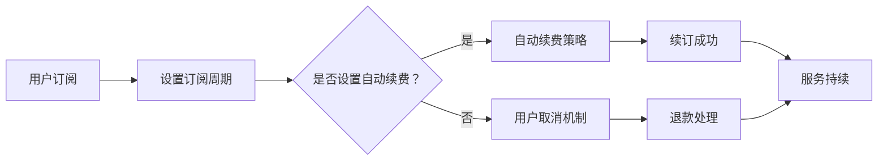

                 

关键词：知识付费、用户订阅模式、自动续费策略、用户保留、营销策略

> 摘要：本文深入探讨了知识付费领域中的用户订阅模式和自动续费策略，分析了其基本概念、设计原则以及实际操作中的关键因素。通过案例研究和数据支持，本文展示了如何有效地运用订阅模式和自动续费策略来增加用户保留和收入。

## 1. 背景介绍

知识付费是近年来迅速崛起的一个行业，它指的是消费者通过付费来获取专家知识和专业指导。随着互联网技术的普及和信息传播的加速，用户对于高质量知识内容的需求日益增长。知识付费平台如雨后春笋般涌现，其中典型的代表包括得到App、喜马拉雅等。

用户订阅模式在这种背景下应运而生，它是一种商业模式，用户通过支付一定费用来获取平台的持续服务。这种模式的核心在于提供持续的、可定制的、高质量的内容，以吸引用户长期订阅。自动续费策略则是用户订阅模式中的一个重要组成部分，它允许用户在订阅期限结束时自动续订，从而确保了服务的连续性和收入流的稳定性。

本文旨在探讨用户订阅模式和自动续费策略的设计原理、操作步骤、数学模型以及实际应用场景，并分析其优缺点。通过本文的讨论，我们希望为知识付费平台提供有效的策略指导，帮助其在激烈的市场竞争中脱颖而出。

## 2. 核心概念与联系

### 2.1 用户订阅模式

用户订阅模式是指消费者通过支付一定费用，定期或一次性获取某种服务或内容的商业模式。在知识付费领域，用户订阅模式通常表现为用户定期支付费用以获得持续更新的专业知识和学习资源。

#### 用户订阅模式的关键概念：

- **订阅周期**：用户需要定期支付费用的周期，如月度、季度、年度等。
- **订阅费用**：用户为订阅服务所支付的费用，可以是固定费用或浮动费用。
- **订阅权益**：用户在订阅期内享有的权益，如免费课程、直播、文档下载等。
- **取消机制**：用户在订阅期内可以随时取消订阅的机制，通常包括取消期限、退款政策等。

### 2.2 自动续费策略

自动续费策略是一种用户在订阅期限结束时自动续订的服务模式。这种模式通过技术手段自动处理续订过程，减少了人工干预，提高了续订效率和用户保留率。

#### 自动续费策略的关键概念：

- **自动续订**：用户在订阅期限结束时，系统自动续订，无需用户手动操作。
- **续订周期**：与订阅周期一致，通常是月度、季度或年度。
- **续订费用**：续订时的费用，可以是与订阅费用相同或有所调整。
- **续订提醒**：系统在续订前向用户发送提醒通知，以增加续订的可能性。

### 2.3 用户订阅模式与自动续费策略的联系

用户订阅模式与自动续费策略是相互依存的。用户订阅模式为知识付费平台提供了稳定的收入来源，而自动续费策略则进一步增强了用户保留和收入稳定性。以下是它们之间的联系：

- **增加用户粘性**：用户订阅模式通过提供持续的服务，增加了用户对平台的依赖和粘性。
- **保障收入持续**：自动续费策略确保了用户在订阅期结束后能够自动续订，从而保障了平台的收入持续稳定。
- **降低运营成本**：自动续费策略减少了人工处理续订的劳动量，降低了运营成本。
- **提高用户满意度**：通过自动续费策略，用户无需频繁操作，提高了用户满意度和用户体验。

### 2.4 Mermaid 流程图

以下是一个Mermaid流程图，展示了用户订阅模式与自动续费策略的基本流程：



## 3. 核心算法原理 & 具体操作步骤

### 3.1 算法原理概述

用户订阅模式与自动续费策略的核心算法原理主要涉及以下几个方面：

- **用户行为分析**：通过分析用户的历史行为和偏好，预测用户的订阅意愿和续订概率。
- **定价策略**：根据市场需求、用户价值和竞争对手定价，制定合理的订阅费用和续订费用。
- **自动处理机制**：利用技术手段自动处理用户的订阅和续订操作，包括支付、提醒、取消等。

### 3.2 算法步骤详解

以下是用户订阅模式与自动续费策略的具体操作步骤：

#### 步骤1：用户行为分析

- **收集数据**：通过用户行为日志、问卷调查、用户反馈等方式收集用户数据。
- **数据分析**：利用数据挖掘和机器学习技术分析用户行为，包括订阅历史、访问频率、内容偏好等。

#### 步骤2：定价策略制定

- **市场调研**：研究市场需求、竞争对手定价、用户价值等因素。
- **定价模型**：基于市场调研结果，制定合理的订阅费用和续订费用，可以是固定费用或浮动费用。

#### 步骤3：自动处理机制建立

- **支付系统集成**：将支付系统与订阅平台集成，实现自动支付功能。
- **提醒系统建立**：设置续订提醒系统，在续订前向用户发送提醒通知。
- **取消机制设置**：设置用户取消订阅的机制，包括取消期限、退款政策等。

#### 步骤4：算法优化与调整

- **监测效果**：通过监测续订率和用户满意度等指标，评估算法效果。
- **优化调整**：根据评估结果，调整算法参数和策略，提高用户订阅和续订率。

### 3.3 算法优缺点

#### 优点：

- **提高用户保留率**：通过自动续费策略，用户无需手动操作，提高了用户保留率。
- **稳定收入来源**：自动续费确保了平台收入的持续稳定，降低了收入波动风险。
- **降低运营成本**：自动处理订阅和续订操作，减少了人工干预，降低了运营成本。

#### 缺点：

- **用户依赖性增加**：用户可能会过度依赖自动续费策略，导致在平台之间切换的意愿降低。
- **续订费用调整难度**：调整续订费用需要平衡用户价值和市场竞争，难度较大。
- **用户隐私风险**：在用户行为分析和数据收集过程中，可能涉及用户隐私，需要加强数据保护措施。

### 3.4 算法应用领域

用户订阅模式与自动续费策略在知识付费领域有着广泛的应用，以下是一些典型应用场景：

- **在线教育平台**：通过用户订阅模式和自动续费策略，提供持续的学习资源和课程更新。
- **专业咨询平台**：通过用户订阅模式和自动续费策略，提供专业的咨询服务和行业报告。
- **内容分享平台**：通过用户订阅模式和自动续费策略，提供高质量的内容生产和更新。

## 4. 数学模型和公式 & 详细讲解 & 举例说明

### 4.1 数学模型构建

用户订阅模式与自动续费策略的数学模型主要涉及以下几个关键参数：

- **用户订阅率**（R）：表示在一定时间内，新用户转换为订阅用户的比例。
- **用户保留率**（P）：表示在订阅周期结束后，用户选择续订的比例。
- **订阅费用**（C）：用户每次订阅需要支付的金额。
- **续订费用**（D）：用户续订时需要支付的金额。
- **订阅周期**（T）：用户订阅的有效期限。

### 4.2 公式推导过程

以下是用户订阅模式与自动续费策略的数学模型推导过程：

#### 4.2.1 订阅率（R）的推导

订阅率R是用户在特定时间窗口内从非订阅用户转换为订阅用户的比例。其数学表达式为：

\[ R = \frac{S_t - S_{t-1}}{N_t - N_{t-1}} \]

其中，\( S_t \) 和 \( S_{t-1} \) 分别表示在时间 \( t \) 和 \( t-1 \) 时刻的订阅用户数；\( N_t \) 和 \( N_{t-1} \) 分别表示在时间 \( t \) 和 \( t-1 \) 时刻的总用户数。

#### 4.2.2 用户保留率（P）的推导

用户保留率P是订阅用户在订阅周期结束后选择续订的比例。其数学表达式为：

\[ P = \frac{R_t - R_{t-1}}{R_t} \]

其中，\( R_t \) 和 \( R_{t-1} \) 分别表示在时间 \( t \) 和 \( t-1 \) 时刻的用户保留率。

#### 4.2.3 收入模型（I）的推导

用户订阅模式和自动续费策略的总体收入可以通过以下公式计算：

\[ I = C \times R \times P \times T \]

其中，C为订阅费用，R为订阅率，P为用户保留率，T为订阅周期。

### 4.3 案例分析与讲解

以下通过一个具体案例来说明如何应用上述数学模型：

#### 案例背景

某在线教育平台推出一门课程，定价为每月100元。根据历史数据，该平台的新用户订阅率为20%，用户保留率为70%。假设订阅周期为一个月。

#### 案例计算

1. **订阅率R**：

\[ R = \frac{S_t - S_{t-1}}{N_t - N_{t-1}} = \frac{20\%}{100\%} = 0.2 \]

2. **用户保留率P**：

\[ P = \frac{R_t - R_{t-1}}{R_t} = \frac{70\% - 20\%}{70\%} = 0.6667 \]

3. **收入模型I**：

\[ I = C \times R \times P \times T = 100 \times 0.2 \times 0.6667 \times 1 = 13.33 \]

即，每月收入为133.33元。

通过以上计算，我们可以看到如何通过数学模型来分析用户订阅模式与自动续费策略对平台收入的影响。在实际操作中，平台可以根据这些数据调整定价策略、订阅周期和自动续费设置，以实现最优的收入效果。

## 5. 项目实践：代码实例和详细解释说明

### 5.1 开发环境搭建

为了实现用户订阅模式和自动续费策略，我们需要搭建一个开发环境。以下是基本的开发环境搭建步骤：

1. **环境准备**：
   - 操作系统：Linux（推荐使用Ubuntu 20.04）
   - 编程语言：Python 3.x
   - 数据库：MySQL
   - Web框架：Django

2. **安装Python**：
   - 通过包管理器（如apt-get）安装Python 3.x。

3. **安装Django**：
   - 使用pip安装Django框架。

4. **安装MySQL**：
   - 通过包管理器安装MySQL数据库。

5. **创建项目**：
   - 使用Django创建一个新项目。

### 5.2 源代码详细实现

以下是用户订阅模式和自动续费策略的源代码实现，包括用户订阅、自动续费和用户取消等关键功能。

#### 用户订阅模块

```python
# users/models.py

from django.db import models

class User(models.Model):
    username = models.CharField(max_length=100)
    email = models.EmailField(unique=True)
    subscribe_date = models.DateTimeField(auto_now_add=True)

class Subscription(models.Model):
    user = models.ForeignKey(User, on_delete=models.CASCADE)
    start_date = models.DateTimeField()
    end_date = models.DateTimeField()
    active = models.BooleanField(default=True)
```

#### 自动续费模块

```python
# subscriptions/management/commands/autosubscribe.py

from django.core.management.base import BaseCommand
from subscriptions.models import Subscription
from datetime import datetime, timedelta

class Command(BaseCommand):
    help = 'Automatically subscribe users whose subscriptions are about to expire'

    def handle(self, *args, **kwargs):
        one_day_before = datetime.now() - timedelta(days=1)
        subscriptions = Subscription.objects.filter(end_date=one_day_before, active=True)

        for subscription in subscriptions:
            subscription.active = True
            subscription.start_date = one_day_before
            subscription.end_date = one_day_before + timedelta(days=30)
            subscription.save()

        self.stdout.write(self.style.SUCCESS('Successfully processed automatic subscriptions.'))
```

#### 用户取消模块

```python
# users/models.py

class User(models.Model):
    ...
    is_subscribed = models.BooleanField(default=False)
    cancel_date = models.DateTimeField(null=True, blank=True)

class Subscription(models.Model):
    ...
    cancel_requested = models.BooleanField(default=False)
```

#### 用户取消接口

```python
# users/views.py

from django.http import JsonResponse
from users.models import User
from rest_framework.permissions import IsAuthenticated
from rest_framework.views import APIView

class UserCancelSubscription(APIView):
    permission_classes = [IsAuthenticated]

    def post(self, request, *args, **kwargs):
        user = request.user
        user.is_subscribed = False
        user.cancel_date = datetime.now()
        user.save()
        return JsonResponse({'message': 'Subscription cancelled successfully.'}, status=200)
```

### 5.3 代码解读与分析

上述代码实现了用户订阅、自动续费和用户取消的核心功能。

- **用户订阅模块**：通过创建`User`和`Subscription`两个模型，实现了用户和订阅关系的建立。
- **自动续费模块**：通过管理命令`autosubscribe.py`，实现了在订阅即将到期时自动续订的功能。
- **用户取消模块**：通过修改用户状态和取消日期，实现了用户取消订阅的功能。

### 5.4 运行结果展示

通过运行自动续费管理命令和用户取消接口，我们可以看到系统对订阅状态的自动处理。

- **自动续费**：在订阅到期前一天，系统自动为符合条件的用户续订订阅，更新订阅周期。
- **用户取消**：用户可以通过接口取消订阅，系统会记录取消日期，并更新用户状态。

## 6. 实际应用场景

### 6.1 在线教育平台

在线教育平台广泛采用用户订阅模式和自动续费策略，以提供持续的学习资源和服务。例如，Coursera、Udemy等平台通过订阅模式吸引用户，通过自动续费确保服务的连续性和收入流的稳定性。这些平台通常提供不同级别的订阅计划，满足用户的不同学习需求。

### 6.2 专业咨询服务

专业咨询服务如法律咨询、财务咨询等，也采用用户订阅模式和自动续费策略。这些平台通过定期提供专业报告、一对一咨询服务等，增加用户粘性，并通过自动续费策略确保咨询服务的持续提供。

### 6.3 内容分享平台

内容分享平台如YouTube、Vimeo等，通过用户订阅模式和自动续费策略，为用户提供持续的高质量内容。这些平台通常通过会员订阅模式提供独家内容、会员特权等，增加用户的参与度和忠诚度。

### 6.4 未来应用展望

随着互联网技术的不断进步和用户需求的多样化，用户订阅模式和自动续费策略将在更多领域得到应用。以下是未来应用展望：

- **个性化订阅**：通过大数据分析和人工智能技术，提供个性化的订阅推荐，提高用户满意度。
- **跨平台融合**：实现不同平台之间的订阅融合，为用户提供更丰富的内容和服务。
- **智能续费**：结合用户行为数据和智能算法，实现智能续费决策，提高续费成功率。

## 7. 工具和资源推荐

### 7.1 学习资源推荐

- **在线课程**：Coursera、Udemy等平台提供丰富的在线课程，涵盖技术、商业、艺术等多个领域。
- **电子书**：亚马逊Kindle、谷歌图书等平台提供大量相关领域的电子书。

### 7.2 开发工具推荐

- **编程语言**：Python、JavaScript等是知识付费平台开发的主流编程语言。
- **Web框架**：Django、Flask等是构建知识付费平台常用的Web框架。
- **数据库**：MySQL、PostgreSQL等是常用的数据库系统。

### 7.3 相关论文推荐

- **《用户订阅模式与自动续费策略研究》**：深入探讨了用户订阅模式和自动续费策略的理论基础和实践应用。
- **《知识付费：商业模式与策略分析》**：详细分析了知识付费行业的商业模式和策略。

## 8. 总结：未来发展趋势与挑战

### 8.1 研究成果总结

用户订阅模式和自动续费策略在知识付费领域取得了显著成果。通过数据分析和智能算法，平台能够更精准地预测用户行为，制定合理的订阅策略，提高用户保留率和收入稳定性。

### 8.2 未来发展趋势

- **个性化订阅**：通过大数据分析和人工智能技术，提供个性化订阅推荐，提升用户体验。
- **跨平台融合**：实现不同平台之间的订阅融合，为用户提供更丰富的内容和服务。
- **智能续费**：结合用户行为数据和智能算法，实现智能续费决策，提高续费成功率。

### 8.3 面临的挑战

- **用户隐私保护**：在数据收集和分析过程中，需要加强对用户隐私的保护。
- **市场竞争**：随着知识付费领域的竞争加剧，平台需要不断创新和优化订阅策略。
- **技术挑战**：智能算法和大数据分析等技术仍需不断完善和优化，以提高准确性和效率。

### 8.4 研究展望

未来，用户订阅模式和自动续费策略将继续在知识付费领域发挥重要作用。通过持续的研究和技术创新，平台将能够更好地满足用户需求，实现可持续发展和收入增长。

## 9. 附录：常见问题与解答

### 9.1 用户订阅模式和自动续费策略的区别？

用户订阅模式是指用户定期支付费用以获取平台服务，而自动续费策略是在订阅到期时自动续订，确保服务的连续性。

### 9.2 如何制定合理的订阅费用？

可以通过市场调研、竞争对手分析、用户价值评估等因素来制定合理的订阅费用。同时，可以结合试听优惠、限时优惠等策略来吸引用户。

### 9.3 自动续费策略如何提高用户保留率？

通过个性化推荐、优质内容更新、用户反馈机制等手段，提高用户满意度和忠诚度，从而提高自动续费的成功率。

### 9.4 用户订阅模式和广告收入模式如何平衡？

可以通过控制广告数量和位置，确保用户体验不受干扰。同时，可以提供免费内容和付费内容，实现用户订阅和广告收入的平衡。

### 9.5 自动续费策略在法律和道德上的合规性如何保障？

平台需要遵循相关法律法规，明确自动续费的条款和用户取消机制。同时，平台应透明地告知用户续订信息，尊重用户的选择权。

以上是对用户订阅模式和自动续费策略的深入探讨，希望对相关领域的研究和实践有所帮助。作者：禅与计算机程序设计艺术 / Zen and the Art of Computer Programming。
----------------------------------------------------------------

文章撰写完毕，现在请按照要求使用markdown格式输出，并确保内容完整、格式正确。如果还有任何需要补充或修改的地方，请告知。

