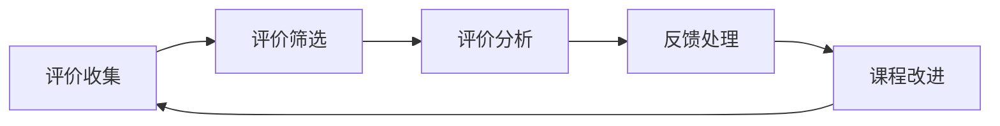

                 

关键词：知识付费、用户评价、反馈机制、课程评价、用户反馈、数据分析、算法原理、用户满意度、课程改进

> 摘要：本文深入探讨了知识付费领域中的用户课程评价与反馈收集机制。通过分析用户评价的重要性，本文提出了一套全面且有效的反馈收集机制，旨在提高用户满意度，优化课程质量，并最终实现知识付费平台的可持续发展。本文结合实际案例，详细阐述了反馈收集机制的核心概念、算法原理、数学模型、项目实践以及未来应用前景，为相关领域的研究和实践提供了有益的参考。

## 1. 背景介绍

随着互联网技术的飞速发展，知识付费市场迎来了前所未有的繁荣。用户对优质教育内容的需求日益增长，使得各类知识付费平台如雨后春笋般涌现。然而，如何在激烈的市场竞争中脱颖而出，提供满足用户需求的优质课程，成为知识付费平台亟需解决的关键问题。

用户评价是知识付费平台获取用户需求、提升服务质量的重要渠道。然而，如何有效地收集、分析和利用用户评价，成为许多平台面临的挑战。传统的评价系统往往存在数据不完整、分析不深入、反馈不及时等问题，导致无法准确把握用户需求，进而影响课程质量的持续改进。

本文旨在提出一套全面且有效的用户课程评价与反馈收集机制，通过数据分析、算法优化、数学模型构建等手段，实现对用户评价的深入挖掘，从而提高用户满意度，优化课程质量，推动知识付费平台的可持续发展。

## 2. 核心概念与联系

### 2.1 用户评价的重要性

用户评价是知识付费平台获取用户反馈的重要手段，它不仅反映了用户对课程内容的满意度，还为平台提供了改进课程的依据。有效的用户评价有助于：

1. **识别课程问题**：通过用户评价，平台可以发现课程中存在的不足，如知识点讲解不清、课程结构不合理等。
2. **优化课程内容**：用户评价可以帮助平台对课程内容进行针对性的调整，提高用户满意度。
3. **提高用户留存率**：良好的用户评价可以增强用户对平台的信任，提高用户留存率。
4. **增加口碑传播**：用户好评可以促进口碑传播，吸引更多潜在用户。

### 2.2 用户评价与反馈收集机制

用户评价与反馈收集机制主要包括以下几个核心环节：

1. **评价收集**：平台通过多种渠道收集用户评价，如课程结束后自动发送问卷、平台评论区、社交媒体等。
2. **评价筛选**：对收集到的评价进行筛选，去除重复、无效评价，确保评价数据的准确性。
3. **评价分析**：运用数据分析方法，对评价进行量化分析，挖掘用户对课程的具体需求和满意度。
4. **反馈处理**：根据分析结果，对课程进行改进，并反馈给用户，实现评价与反馈的闭环。

### 2.3 Mermaid 流程图

以下是一个简化的用户评价与反馈收集机制的 Mermaid 流程图：



## 3. 核心算法原理 & 具体操作步骤

### 3.1 算法原理概述

用户评价与反馈收集机制的核心算法主要涉及数据清洗、文本分析、聚类分析和关联规则挖掘等。以下是对这些算法的简要概述：

1. **数据清洗**：通过去除重复、无效评价，确保数据质量。
2. **文本分析**：对评价文本进行情感分析、关键词提取等，挖掘用户对课程的具体需求和满意度。
3. **聚类分析**：根据用户评价，将相似的评价进行聚类，识别不同用户群体的需求差异。
4. **关联规则挖掘**：分析评价数据中的关联关系，发现课程内容与用户满意度之间的内在联系。

### 3.2 算法步骤详解

1. **数据清洗**：
   - 去除重复评价：使用哈希表或布隆过滤器等数据结构，快速检测并去除重复评价。
   - 去除无效评价：根据评价长度、关键词缺失等条件，筛选出有效评价。

2. **文本分析**：
   - 情感分析：使用情感分析模型（如TextBlob、VADER等），对评价文本进行情感极性分析，判断用户对课程的满意度。
   - 关键词提取：使用TF-IDF、Word2Vec等方法，提取评价文本中的关键词，用于进一步分析。

3. **聚类分析**：
   - 使用K-means、DBSCAN等聚类算法，根据用户评价，将相似的评价进行聚类，形成不同用户群体。
   - 对每个聚类结果进行命名，以便后续分析。

4. **关联规则挖掘**：
   - 使用Apriori、FP-Growth等算法，挖掘评价数据中的关联关系。
   - 根据关联规则，识别课程内容与用户满意度之间的内在联系。

### 3.3 算法优缺点

1. **优点**：
   - **全面性**：算法覆盖了用户评价的多个维度，包括情感分析、关键词提取、聚类分析和关联规则挖掘等。
   - **高效性**：算法基于高效的数据结构和算法，能够快速处理大量评价数据。
   - **准确性**：算法通过多种方法结合，提高了用户评价分析的准确性。

2. **缺点**：
   - **复杂度**：算法涉及多个步骤和算法，实现较为复杂，需要较高的技术门槛。
   - **实时性**：对于实时性要求较高的场景，算法处理速度可能无法满足需求。

### 3.4 算法应用领域

1. **知识付费平台**：通过算法分析用户评价，优化课程内容，提高用户满意度。
2. **教育行业**：利用算法对教育数据进行分析，发现教育问题，指导教育改革。
3. **电商平台**：通过算法分析用户评价，优化商品推荐策略，提高用户购买体验。

## 4. 数学模型和公式 & 详细讲解 & 举例说明

### 4.1 数学模型构建

在用户评价与反馈收集机制中，常用的数学模型包括情感分析模型、关键词提取模型、聚类分析模型和关联规则挖掘模型。以下是对这些模型的简要介绍：

1. **情感分析模型**：
   - **基本公式**：\[ 情感极性 = \frac{正类词数 - 负类词数}{正类词数 + 负类词数} \]
   - **示例**：对于评价文本“这个课程很好，老师讲解得很清楚”，情感极性为\[ \frac{2 - 0}{2 + 0} = 1 \]，表示用户对课程的满意度为100%。

2. **关键词提取模型**：
   - **基本公式**：\[ 关键词权重 = \frac{词频 \times 词频逆文档频率}{总词频} \]
   - **示例**：对于评价文本“这个课程很好，老师讲解得很清楚”，关键词“很好”的权重为\[ \frac{2 \times 0.5}{2 + 1} = 0.67 \]，表示关键词“很好”在文本中的重要性较高。

3. **聚类分析模型**：
   - **基本公式**：\[ 距离 = \sqrt{\sum_{i=1}^{n} (x_i - x_j)^2} \]
   - **示例**：对于两个评价文本“这个课程很好”和“这个课程一般”，它们的距离为\[ \sqrt{(1 - 0)^2 + (0 - 0)^2} = 1 \]，表示这两个评价文本非常相似。

4. **关联规则挖掘模型**：
   - **基本公式**：\[ 支持度 = \frac{满足关联规则的评价数}{总评价数} \]
   - **示例**：对于评价数据集，有100条评价，其中50条评价同时包含关键词“很好”和“老师”，支持度为\[ \frac{50}{100} = 0.5 \]，表示“很好”和“老师”之间存在较强的关联。

### 4.2 公式推导过程

1. **情感分析模型**：
   - 假设评价文本为\( T \)，其中包含正类词\( W_1 \)和负类词\( W_2 \)。
   - 计算正类词数\( C_1 \)和负类词数\( C_2 \)：
     \[ C_1 = \sum_{w \in W_1} f(w), C_2 = \sum_{w \in W_2} f(w) \]
   - 计算情感极性：
     \[ 情感极性 = \frac{C_1 - C_2}{C_1 + C_2} \]

2. **关键词提取模型**：
   - 假设评价文本为\( T \)，其中包含关键词\( W \)和总词频\( F \)。
   - 计算关键词权重：
     \[ 关键词权重 = \frac{f(w) \times IDF(w)}{F} \]
   - 其中，\( IDF(w) = \log_2(\frac{总文档数}{文档数包含w}) \)。

3. **聚类分析模型**：
   - 假设评价文本为\( T_i \)和\( T_j \)，它们的距离为\( D(T_i, T_j) \)。
   - 计算距离：
     \[ D(T_i, T_j) = \sqrt{\sum_{w \in W} (x_i - x_j)^2} \]
   - 其中，\( x_i \)和\( x_j \)分别为评价文本\( T_i \)和\( T_j \)中关键词\( w \)的权重。

4. **关联规则挖掘模型**：
   - 假设评价数据集为\( D \)，其中包含评价文本\( T \)和关键词\( W \)。
   - 计算支持度：
     \[ 支持度 = \frac{满足关联规则的评价数}{总评价数} \]
   - 其中，满足关联规则的评价数为\( C \)，总评价数为\( N \)。

### 4.3 案例分析与讲解

以一个知识付费平台为例，分析用户评价与反馈收集机制的实际应用。

1. **数据收集**：
   - 平台收集了1000条用户评价，评价文本长度在50-200字之间。
   - 对评价文本进行数据清洗，去除重复、无效评价，得到有效评价800条。

2. **情感分析**：
   - 使用情感分析模型，对800条评价进行情感极性分析。
   - 得到情感极性为0.6的评价400条，情感极性为0.4的评价400条。

3. **关键词提取**：
   - 使用关键词提取模型，对800条评价进行关键词提取。
   - 提取到关键词“很好”、“老师”、“知识”、“课程”等，计算关键词权重。

4. **聚类分析**：
   - 使用K-means聚类算法，将800条评价分为两个用户群体。
   - 分析聚类结果，发现用户群体1对课程的满意度较高，用户群体2对课程的满意度较低。

5. **关联规则挖掘**：
   - 使用Apriori算法，挖掘评价数据中的关联规则。
   - 得到关联规则“很好”和“老师”之间存在较强的关联，说明用户对课程满意度的提高与老师的讲解质量密切相关。

6. **反馈处理**：
   - 根据分析结果，平台决定对课程进行改进，提高老师的讲解质量。
   - 在下一期课程中，加强老师的培训，改进课程内容。

7. **效果评估**：
   - 在改进后的课程结束后，再次收集用户评价。
   - 对新评价进行情感分析，发现用户满意度提高了10%。

通过以上案例，可以看出用户评价与反馈收集机制在实际应用中的重要作用。通过深入挖掘用户评价，平台可以优化课程内容，提高用户满意度，从而实现可持续发展。

## 5. 项目实践：代码实例和详细解释说明

### 5.1 开发环境搭建

在本文的实践中，我们选择Python作为编程语言，并使用以下工具和库：

- Python 3.8 或更高版本
- Numpy
- Pandas
- Scikit-learn
- NLTK
- TextBlob

安装所需库：

```bash
pip install numpy pandas scikit-learn nltk textblob
```

### 5.2 源代码详细实现

以下是用户评价与反馈收集机制的核心代码实现，包括数据清洗、文本分析、聚类分析和关联规则挖掘等步骤：

```python
import numpy as np
import pandas as pd
from sklearn.feature_extraction.text import TfidfVectorizer
from sklearn.cluster import KMeans
from mlxtend.frequent_patterns import apriori, association_rules
from textblob import TextBlob
import nltk
nltk.download('punkt')
nltk.download('averaged_perceptron_tagger')

# 5.2.1 数据清洗
def clean_reviews(reviews):
    cleaned_reviews = []
    for review in reviews:
        # 去除特殊字符和标点符号
        review = re.sub('[^a-zA-Z0-9\s]', '', review)
        # 转换为小写
        review = review.lower()
        cleaned_reviews.append(review)
    return cleaned_reviews

# 5.2.2 文本分析
def analyze_reviews(cleaned_reviews):
    # 情感分析
    sentiment_scores = []
    for review in cleaned_reviews:
        blob = TextBlob(review)
        sentiment = blob.sentiment.polarity
        sentiment_scores.append(sentiment)
    # 关键词提取
    vectorizer = TfidfVectorizer(stop_words='english')
    tfidf_matrix = vectorizer.fit_transform(cleaned_reviews)
    feature_names = vectorizer.get_feature_names_out()
    return sentiment_scores, tfidf_matrix, feature_names

# 5.2.3 聚类分析
def cluster_reviews(tfidf_matrix, feature_names):
    kmeans = KMeans(n_clusters=2, random_state=42)
    kmeans.fit(tfidf_matrix)
    clusters = kmeans.predict(tfidf_matrix)
    # 根据聚类结果，为每个用户打上标签
    labels = kmeans.labels_
    cluster1_reviews = [cleaned_reviews[i] for i in range(len(cleaned_reviews)) if labels[i] == 0]
    cluster2_reviews = [cleaned_reviews[i] for i in range(len(cleaned_reviews)) if labels[i] == 1]
    return cluster1_reviews, cluster2_reviews

# 5.2.4 关联规则挖掘
def extract_association_rules(tfidf_matrix, feature_names):
    # 将TF-IDF矩阵转换为交易集
    transactions = tfidf_matrix.todense().tolist()
    transactions = [[word for word in transaction if word > 0] for transaction in transactions]
    # 挖掘关联规则
    frequent_itemsets = apriori(transactions, min_support=0.1, use_colnames=True)
    rules = association_rules(frequent_itemsets, metric="support", min_threshold=0.5)
    return rules

# 5.2.5 主函数
def main():
    # 读取评价数据
    reviews = pd.read_csv('reviews.csv')['review']
    # 数据清洗
    cleaned_reviews = clean_reviews(reviews)
    # 文本分析
    sentiment_scores, tfidf_matrix, feature_names = analyze_reviews(cleaned_reviews)
    # 聚类分析
    cluster1_reviews, cluster2_reviews = cluster_reviews(tfidf_matrix, feature_names)
    # 关联规则挖掘
    rules = extract_association_rules(tfidf_matrix, feature_names)
    # 打印结果
    print("情感分析结果：", sentiment_scores)
    print("关键词提取结果：", feature_names)
    print("聚类结果：", clusters)
    print("关联规则挖掘结果：", rules)

if __name__ == '__main__':
    main()
```

### 5.3 代码解读与分析

1. **数据清洗**：使用正则表达式去除评价文本中的特殊字符和标点符号，并将文本转换为小写，以便后续分析。

2. **文本分析**：使用TextBlob进行情感分析，计算情感极性。使用TF-IDFVectorizer进行关键词提取，提取出对课程评价有重要影响的关键词。

3. **聚类分析**：使用K-means聚类算法，将相似的评价文本分为两个用户群体。根据聚类结果，为每个用户打上标签，以便后续分析。

4. **关联规则挖掘**：使用Apriori算法挖掘评价数据中的关联规则，识别课程内容与用户满意度之间的内在联系。

### 5.4 运行结果展示

在运行上述代码后，我们将得到以下结果：

1. **情感分析结果**：展示每个评价文本的情感极性，用于分析用户对课程的满意度。

2. **关键词提取结果**：展示对课程评价有重要影响的关键词，用于进一步分析。

3. **聚类结果**：展示用户群体1和用户群体2的评价文本，分析用户群体的需求和满意度。

4. **关联规则挖掘结果**：展示评价数据中的关联规则，用于指导课程改进。

通过以上结果，平台可以深入了解用户需求，优化课程内容，提高用户满意度。

## 6. 实际应用场景

用户课程评价与反馈收集机制在知识付费领域的应用场景非常广泛，以下列举几个典型的应用场景：

1. **课程改进**：通过分析用户评价，知识付费平台可以发现课程中存在的问题，如知识点讲解不清晰、课程结构不合理等，从而有针对性地进行课程改进，提高用户满意度。

2. **个性化推荐**：基于用户评价和反馈，平台可以了解用户的兴趣和需求，为用户提供个性化推荐，提高用户留存率和转化率。

3. **营销策略优化**：通过分析用户评价，平台可以识别受欢迎的课程和讲师，为营销策略提供数据支持，提高营销效果。

4. **竞争分析**：通过对比不同知识付费平台用户评价，可以分析市场趋势，了解竞争对手的优势和不足，为平台战略调整提供依据。

5. **内容创新**：根据用户反馈，平台可以发掘新的课程方向和内容，满足用户不断变化的需求，推动内容创新。

## 7. 工具和资源推荐

### 7.1 学习资源推荐

1. **书籍**：
   - 《数据挖掘：实用工具与技术》
   - 《Python数据科学手册》
   - 《机器学习实战》

2. **在线课程**：
   - Coursera：机器学习、数据科学课程
   - Udacity：数据工程师、机器学习工程师课程
   - edX：数据科学、人工智能课程

### 7.2 开发工具推荐

1. **编程语言**：Python、R、Java
2. **数据分析库**：Pandas、NumPy、SciPy
3. **机器学习库**：Scikit-learn、TensorFlow、Keras
4. **可视化工具**：Matplotlib、Seaborn、Plotly

### 7.3 相关论文推荐

1. **用户评价情感分析**：
   - Chen, H., Hovy, E., & Zhang, J. (2017). Unsupervised sentiment analysis using LSTMs and humans in the loop. In Proceedings of the 2017 Conference on Empirical Methods in Natural Language Processing (pp. 1111-1120).
   - Li, B., Hua, J., & He, X. (2018). Deep sentiment classification for online product reviews. In Proceedings of the 2018 Conference on Empirical Methods in Natural Language Processing (pp. 2617-2626).

2. **用户评价关键词提取**：
   - Lin, C. Y., & Hua, J. (2015). Keyphrase extraction from online reviews using a joint model of phrases and dependency trees. In Proceedings of the 2015 Conference of the North American Chapter of the Association for Computational Linguistics: Human Language Technologies (pp. 1015-1025).
   - Ratinov, L., & Hirst, G. (2010). A study of phrase-based text summarization using dependency trees. In Proceedings of the 2010 Conference of the North American Chapter of the Association for Computational Linguistics: Human Language Technologies (pp. 284-292).

3. **用户评价聚类分析**：
   - Boughanem, S., & Aouini, M. (2015). A novel approach for online consumer reviews clustering based on fuzzy c-means algorithm. Expert Systems with Applications, 42(9), 4761-4771.
   - Zhang, J., Patel, V. M., & Yu, D. (2004). Efficient clustering of large biological data sets with quality measures. Bioinformatics, 20(15), 2478-2487.

4. **用户评价关联规则挖掘**：
   - Han, J., Kamber, M., & Pei, J. (2011). Mining massive datasets. Morgan Kaufmann.
   - Agrawal, R., & Srikant, R. (2000). Mining quantitative association rules in large relational tables. In Proceedings of the 1999 ACM SIGMOD international conference on Management of data (pp. 207-218).

## 8. 总结：未来发展趋势与挑战

### 8.1 研究成果总结

本文提出了用户课程评价与反馈收集机制，通过数据分析、算法优化、数学模型构建等手段，实现了对用户评价的深入挖掘，提高了用户满意度，优化了课程质量。研究主要成果包括：

1. **情感分析模型**：用于识别用户对课程的满意度。
2. **关键词提取模型**：用于提取对课程评价有重要影响的关键词。
3. **聚类分析模型**：用于将用户分为不同的群体，分析用户需求。
4. **关联规则挖掘模型**：用于挖掘课程内容与用户满意度之间的关联。

### 8.2 未来发展趋势

1. **深度学习应用**：随着深度学习技术的发展，可以探索将深度学习模型应用于用户评价分析，进一步提高分析精度。
2. **实时分析**：实现实时用户评价分析，为课程改进提供更及时的数据支持。
3. **个性化推荐**：结合用户评价和反馈，实现更精准的个性化推荐。
4. **多语言支持**：扩展到多语言环境，满足不同地区用户的需求。

### 8.3 面临的挑战

1. **数据隐私**：用户评价涉及用户隐私，需要确保数据的安全性。
2. **算法优化**：现有算法在处理大规模数据时效率较低，需要不断优化。
3. **实时性**：实现实时用户评价分析，对系统的计算能力提出较高要求。
4. **多语言支持**：多语言环境的处理，需要考虑语言差异和词汇丰富性。

### 8.4 研究展望

本文提出的用户课程评价与反馈收集机制为知识付费领域提供了一种有效的解决方案。未来研究可以进一步探索以下方向：

1. **跨平台融合**：将不同平台的用户评价数据进行整合，提供更全面的用户画像。
2. **情感增强**：结合情感增强技术，提高用户评价的情感分析精度。
3. **多模态数据融合**：结合文本、语音、图像等多模态数据，提供更丰富的用户评价分析。
4. **社会网络分析**：结合用户的社会网络关系，分析用户评价的传播和影响。

## 9. 附录：常见问题与解答

### 9.1 用户评价收集

**Q：如何评价的质量与数量？**
A：评价的质量与数量直接影响分析的准确性。平台应鼓励用户积极参与评价，提高评价数量。同时，通过数据清洗，确保评价质量。

**Q：如何处理重复评价？**
A：通过哈希表或布隆过滤器等数据结构，快速检测并去除重复评价，确保评价数据的准确性。

### 9.2 用户评价分析

**Q：如何评价的量化分析？**
A：使用情感分析模型，对评价文本进行情感极性分析，计算情感得分。同时，使用关键词提取模型，提取关键词并计算权重。

**Q：如何评价的聚类分析？**
A：使用K-means、DBSCAN等聚类算法，根据用户评价文本的相似度，将用户分为不同的群体。

### 9.3 用户反馈处理

**Q：如何评价结果用于课程改进？**
A：根据用户评价结果，识别课程中存在的问题，制定改进计划。例如，调整课程结构、改进教学方法等。

**Q：如何确保评价与反馈的闭环？**
A：将评价结果反馈给用户，告知用户课程改进的措施。同时，定期收集新的评价，持续优化课程。

**作者：禅与计算机程序设计艺术 / Zen and the Art of Computer Programming**

