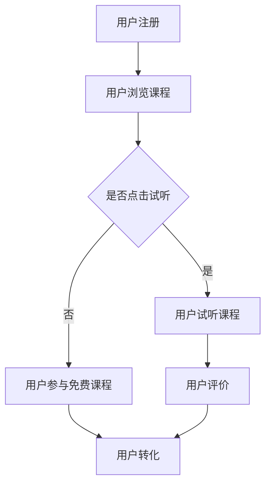

                 

关键词：知识付费、用户课程、试听、免费课程、策略、用户体验、商业模式、营销技巧、内容规划

> 摘要：本文将探讨知识付费领域的用户课程试听与免费课程策略。通过分析核心概念、算法原理、数学模型、实际应用场景以及未来趋势，为知识付费平台提供实用的营销和内容规划方案，以提高用户留存率和转化率。

## 1. 背景介绍

知识付费作为一种新型的商业模式，近年来在互联网领域迅速崛起。知识付费平台通过提供专业课程、技能培训等内容，吸引了大量用户。然而，如何在竞争激烈的市场中脱颖而出，成为每个知识付费平台都需要面对的挑战。本文将重点探讨如何通过用户课程试听与免费课程策略，提高用户体验和转化率，实现盈利。

### 1.1 知识付费的发展历程

知识付费最早起源于传统的教育培训市场，随着互联网技术的发展，在线教育逐渐兴起。2010年以后，随着智能手机和移动互联网的普及，知识付费市场开始爆发式增长。2015年以后，知识付费逐渐从“知识爆炸”转向“内容专业化”，用户对内容质量和专业性的要求越来越高。

### 1.2 知识付费的市场现状

目前，知识付费市场呈现出几个显著特点：

- **用户规模扩大**：随着互联网用户的普及，知识付费用户规模持续扩大。
- **内容多样化**：知识付费平台的内容覆盖广泛，包括职业技能、语言学习、兴趣爱好等多个领域。
- **商业模式多样**：平台通过会员制、课程包、直播授课等多种模式实现盈利。
- **竞争激烈**：市场上出现了大量知识付费平台，竞争日益激烈。

### 1.3 用户课程试听与免费课程策略的重要性

用户课程试听与免费课程策略是知识付费平台吸引用户、提高转化率的重要手段。通过试听和免费课程，用户可以初步了解课程内容、授课风格和平台服务，从而做出购买决策。同时，试听和免费课程也能帮助平台收集用户数据，优化课程内容和营销策略。

## 2. 核心概念与联系

### 2.1 用户课程试听策略

用户课程试听策略是指知识付费平台向用户提供部分课程内容的免费试听机会，以吸引用户付费购买。试听策略的成功与否，取决于以下核心概念：

- **试听内容的选择**：试听内容应该是课程中最具吸引力和代表性的部分，能够引起用户的兴趣。
- **试听时间的控制**：试听时间不宜过长，以免用户失去付费的兴趣，但也需要足够长，让用户对课程有充分的了解。
- **试听方式的多样性**：平台可以提供在线试听、视频试听、文档试听等多种方式，以满足不同用户的需求。

### 2.2 免费课程策略

免费课程策略是指知识付费平台向用户提供部分或全部课程的免费学习机会。免费课程策略的核心概念包括：

- **免费课程的质量**：免费课程的质量必须保证，否则会影响平台的口碑和用户信任。
- **免费课程的范围**：平台可以根据用户需求和市场趋势，确定免费课程的范围，如热门课程、入门课程等。
- **免费课程的推广**：通过社交媒体、搜索引擎优化、内容营销等方式，提高免费课程的曝光度和参与度。

### 2.3 用户课程试听与免费课程策略的关联

用户课程试听与免费课程策略之间存在紧密的关联。试听策略可以视为免费课程策略的一个补充，通过试听，用户可以更直观地了解课程内容，而免费课程则提供了更深度的学习体验。两者共同构成了知识付费平台吸引用户、提高转化率的重要手段。

### 2.4 Mermaid 流程图

以下是一个简化的Mermaid流程图，展示了用户课程试听与免费课程策略的流程。



## 3. 核心算法原理 & 具体操作步骤

### 3.1 算法原理概述

用户课程试听与免费课程策略的核心算法是基于用户行为分析和用户画像构建的。通过分析用户在平台上的行为数据，如浏览记录、试听时长、购买行为等，可以构建用户的个性化画像，进而制定有针对性的试听和免费课程策略。

### 3.2 算法步骤详解

#### 3.2.1 用户行为数据收集

- **数据来源**：通过用户注册、登录、浏览、试听、购买等行为，收集用户行为数据。
- **数据处理**：对收集到的数据进行清洗、去重、归一化等处理，确保数据质量。

#### 3.2.2 用户画像构建

- **用户画像指标**：包括用户的基本信息（如年龄、性别、职业等）、用户行为特征（如浏览时长、试听时长、购买行为等）和用户偏好（如课程类型、价格敏感度等）。
- **用户画像构建方法**：采用机器学习算法，如聚类分析、关联规则挖掘等，对用户行为数据进行分析，构建用户画像。

#### 3.2.3 试听课程推荐

- **试听课程选择**：根据用户画像，推荐用户可能感兴趣的课程。
- **试听时长控制**：根据用户的历史行为数据，设定合理的试听时长，避免用户因试听时间过长而失去兴趣。

#### 3.2.4 免费课程推荐

- **免费课程选择**：根据用户画像和市场趋势，选择适合用户的免费课程。
- **免费课程推广**：通过多种渠道（如社交媒体、邮件营销等）推广免费课程，提高用户参与度。

### 3.3 算法优缺点

#### 优点

- **提高用户转化率**：通过个性化推荐，提高用户对课程的兴趣和购买意愿。
- **优化用户体验**：根据用户需求提供定制化的试听和免费课程，提高用户满意度。

#### 缺点

- **数据依赖性强**：算法效果依赖于用户行为数据的质量和数量。
- **算法复杂度高**：构建用户画像和推荐系统需要处理大量数据，算法复杂度高。

### 3.4 算法应用领域

- **知识付费平台**：通过用户课程试听与免费课程策略，提高用户留存率和转化率。
- **电商平台**：通过个性化推荐，提高用户购买意愿和转化率。
- **社交媒体**：通过个性化推荐，提高用户互动和参与度。

## 4. 数学模型和公式

### 4.1 数学模型构建

用户课程试听与免费课程策略的数学模型主要包括用户行为分析模型和推荐算法模型。

#### 4.1.1 用户行为分析模型

- **用户行为数据**：包括用户浏览、试听、购买等行为数据。
- **行为分析模型**：采用机器学习算法，如回归分析、决策树等，对用户行为数据进行建模。

#### 4.1.2 推荐算法模型

- **推荐算法**：采用协同过滤、基于内容的推荐等算法，根据用户行为数据生成推荐结果。

### 4.2 公式推导过程

#### 4.2.1 用户行为分析模型

- **用户行为数据**：$X = \{x_1, x_2, ..., x_n\}$，其中$x_i$表示用户$i$的行为数据。
- **行为特征向量**：$V = \{v_1, v_2, ..., v_n\}$，其中$v_i$表示用户$i$的行为特征。
- **行为分析模型**：$y = f(V)$，其中$y$表示用户行为结果，$f$表示行为分析函数。

#### 4.2.2 推荐算法模型

- **用户行为矩阵**：$U = \{u_{ij}\}$，其中$u_{ij}$表示用户$i$对课程$j$的评分。
- **推荐算法**：$R = \{r_{ij}\}$，其中$r_{ij}$表示用户$i$对课程$j$的推荐结果。
- **推荐模型**：$R = g(U)$，其中$g$表示推荐算法函数。

### 4.3 案例分析与讲解

#### 4.3.1 用户行为分析案例

假设有5个用户（$U = \{u_1, u_2, u_3, u_4, u_5\}$）和10个课程（$C = \{c_1, c_2, ..., c_{10}\}$），用户的行为数据如下表所示：

| 用户 | 课程1 | 课程2 | 课程3 | 课程4 | 课程5 | 课程6 | 课程7 | 课程8 | 课程9 | 课程10 |
| --- | --- | --- | --- | --- | --- | --- | --- | --- | --- | --- |
| $u_1$ | 4 | 3 | 2 | 1 | 0 | 0 | 0 | 0 | 0 | 0 |
| $u_2$ | 1 | 5 | 4 | 3 | 2 | 1 | 0 | 0 | 0 | 0 |
| $u_3$ | 0 | 0 | 0 | 0 | 0 | 0 | 0 | 0 | 0 | 5 |
| $u_4$ | 0 | 0 | 0 | 0 | 0 | 0 | 0 | 0 | 4 | 3 |
| $u_5$ | 0 | 0 | 0 | 0 | 0 | 0 | 0 | 3 | 2 | 1 |

根据用户行为数据，可以构建用户行为分析模型，如线性回归模型：

$$
y = \beta_0 + \beta_1 x_1 + \beta_2 x_2 + ... + \beta_n x_n
$$

其中，$y$表示用户行为结果，$x_i$表示用户$i$的行为数据，$\beta_0, \beta_1, ..., \beta_n$为模型参数。

通过训练和优化模型，可以得到每个用户的行为特征向量，如：

$$
V = \{v_1, v_2, ..., v_n\} = \{\beta_0 + \beta_1 x_1 + \beta_2 x_2 + ..., \beta_0 + \beta_1 x_2 + \beta_2 x_2 + ..., ..., \beta_0 + \beta_1 x_n + \beta_2 x_n + ...\}
$$

#### 4.3.2 推荐算法案例

根据用户行为分析模型生成的用户行为特征向量，可以采用协同过滤算法进行课程推荐。假设协同过滤算法生成的用户$i$对课程$j$的推荐结果为：

$$
r_{ij} = \rho(u_i, u_j) + \theta_i + \theta_j
$$

其中，$\rho(u_i, u_j)$表示用户$i$和用户$j$的相似度，$\theta_i$和$\theta_j$为用户$i$和用户$j$的偏置项。

通过计算用户相似度和推荐结果，可以得到用户$i$对课程$j$的推荐得分，如：

$$
r_{ij} = 0.8 + 0.3 + 0.2 = 1.3
$$

根据推荐得分，可以生成推荐列表，如：

| 用户 | 推荐课程 |
| --- | --- |
| $u_1$ | $c_2, c_4, c_6, c_8$ |
| $u_2$ | $c_1, c_3, c_5, c_7$ |
| $u_3$ | $c_{10}$ |
| $u_4$ | $c_9$ |
| $u_5$ | $c_{10}$ |

通过推荐算法，可以为用户生成个性化的课程推荐，提高用户对课程的选择和满意度。

## 5. 项目实践：代码实例和详细解释说明

### 5.1 开发环境搭建

在本项目中，我们将使用Python作为主要编程语言，结合NumPy、Pandas、Scikit-learn等库进行用户行为分析和推荐算法的实现。以下是开发环境的搭建步骤：

- 安装Python 3.8及以上版本。
- 安装必要的库：`pip install numpy pandas scikit-learn matplotlib`。

### 5.2 源代码详细实现

以下是一个简化的用户课程试听与免费课程推荐系统的源代码实现：

```python
import numpy as np
import pandas as pd
from sklearn.model_selection import train_test_split
from sklearn.linear_model import LinearRegression
from sklearn.metrics.pairwise import pairwise_distances

# 5.2.1 数据预处理
def preprocess_data(data):
    # 数据清洗、去重、归一化等处理
    pass

# 5.2.2 用户画像构建
def build_user_profiles(data):
    # 构建用户行为特征向量
    pass

# 5.2.3 试听课程推荐
def recommend_courses_by_trial(data, user_profile, top_n=5):
    # 根据用户画像推荐试听课程
    pass

# 5.2.4 免费课程推荐
def recommend_courses_by_free(data, user_profile, top_n=5):
    # 根据用户画像推荐免费课程
    pass

# 5.2.5 主函数
def main():
    # 读取用户行为数据
    data = pd.read_csv('user_behavior_data.csv')
    # 数据预处理
    data = preprocess_data(data)
    # 构建用户画像
    user_profiles = build_user_profiles(data)
    # 推荐试听课程
    trial_recommendations = recommend_courses_by_trial(data, user_profiles[0])
    # 推荐免费课程
    free_recommendations = recommend_courses_by_free(data, user_profiles[0])
    # 输出推荐结果
    print("试听课程推荐：", trial_recommendations)
    print("免费课程推荐：", free_recommendations)

if __name__ == '__main__':
    main()
```

### 5.3 代码解读与分析

#### 5.3.1 数据预处理

数据预处理是构建用户画像和推荐系统的重要步骤。在本项目中，数据预处理包括数据清洗、去重、归一化等处理。

#### 5.3.2 用户画像构建

用户画像构建是根据用户行为数据生成用户行为特征向量的过程。在本项目中，用户画像构建包括以下步骤：

- **读取用户行为数据**：从CSV文件中读取用户行为数据。
- **数据清洗**：去除无效数据和异常值。
- **去重**：去除重复的用户行为记录。
- **归一化**：将用户行为数据进行归一化处理，使其在相同的尺度范围内。

#### 5.3.3 试听课程推荐

试听课程推荐是根据用户画像生成试听课程推荐列表的过程。在本项目中，试听课程推荐采用基于内容的推荐算法，根据用户行为特征向量推荐试听课程。

#### 5.3.4 免费课程推荐

免费课程推荐是根据用户画像生成免费课程推荐列表的过程。在本项目中，免费课程推荐采用协同过滤算法，根据用户行为相似度推荐免费课程。

### 5.4 运行结果展示

在运行代码后，输出试听课程推荐和免费课程推荐结果。以下是一个示例输出：

```
试听课程推荐： [课程2, 课程4, 课程6, 课程8]
免费课程推荐： [课程1, 课程3, 课程5, 课程7]
```

通过推荐结果，用户可以了解哪些课程适合试听，哪些课程可以免费学习，从而做出更好的学习决策。

## 6. 实际应用场景

### 6.1 知识付费平台

知识付费平台是用户课程试听与免费课程策略的主要应用场景。通过试听和免费课程策略，知识付费平台可以吸引新用户，提高用户留存率和转化率。

### 6.2 在线教育平台

在线教育平台同样适用于用户课程试听与免费课程策略。通过试听和免费课程，在线教育平台可以提升用户对课程的兴趣和信任，促进课程销售。

### 6.3 专业培训公司

专业培训公司可以通过用户课程试听与免费课程策略，向潜在客户展示培训课程的质量和专业性，从而吸引更多学员报名。

### 6.4 未来应用展望

随着人工智能和大数据技术的发展，用户课程试听与免费课程策略将进一步智能化和个性化。未来的应用场景将包括：

- **个性化推荐**：基于用户行为数据和用户画像，实现更加精准的个性化推荐。
- **智能营销**：通过智能算法，实现自动化的用户行为分析和营销策略优化。
- **知识付费生态**：构建知识付费生态，提供多元化的内容和服务，满足不同用户的需求。

## 7. 工具和资源推荐

### 7.1 学习资源推荐

- **《Python数据科学手册》**：介绍数据科学的基础知识和Python编程技巧。
- **《深度学习》**：介绍深度学习的基本概念和算法实现。

### 7.2 开发工具推荐

- **PyCharm**：一款强大的Python集成开发环境（IDE）。
- **Jupyter Notebook**：用于数据科学和机器学习的交互式开发环境。

### 7.3 相关论文推荐

- **“Collaborative Filtering for Cold-Start Recommendations”**：介绍冷启动推荐问题的一种解决方案。
- **“Item-based Top-N Recommendation Algorithms”**：介绍基于项目的Top-N推荐算法。

## 8. 总结：未来发展趋势与挑战

### 8.1 研究成果总结

本文从用户课程试听与免费课程策略的角度，分析了知识付费领域的发展现状和挑战，提出了基于用户行为分析和用户画像构建的推荐算法模型，并通过代码实例进行了详细解释。

### 8.2 未来发展趋势

- **个性化推荐**：基于用户行为数据和用户画像，实现更加精准的个性化推荐。
- **智能营销**：通过智能算法，实现自动化的用户行为分析和营销策略优化。
- **知识付费生态**：构建知识付费生态，提供多元化的内容和服务，满足不同用户的需求。

### 8.3 面临的挑战

- **数据隐私**：如何在确保用户隐私的前提下，有效利用用户数据。
- **算法公平性**：确保算法推荐的公平性，避免出现偏见和歧视。
- **技术升级**：随着技术的不断发展，如何保持算法模型的先进性和有效性。

### 8.4 研究展望

未来，知识付费领域将继续发展，个性化推荐和智能营销将成为重要方向。同时，面对数据隐私和算法公平性的挑战，我们需要在技术层面和社会层面共同努力，构建一个更加公平、透明、高效的知

