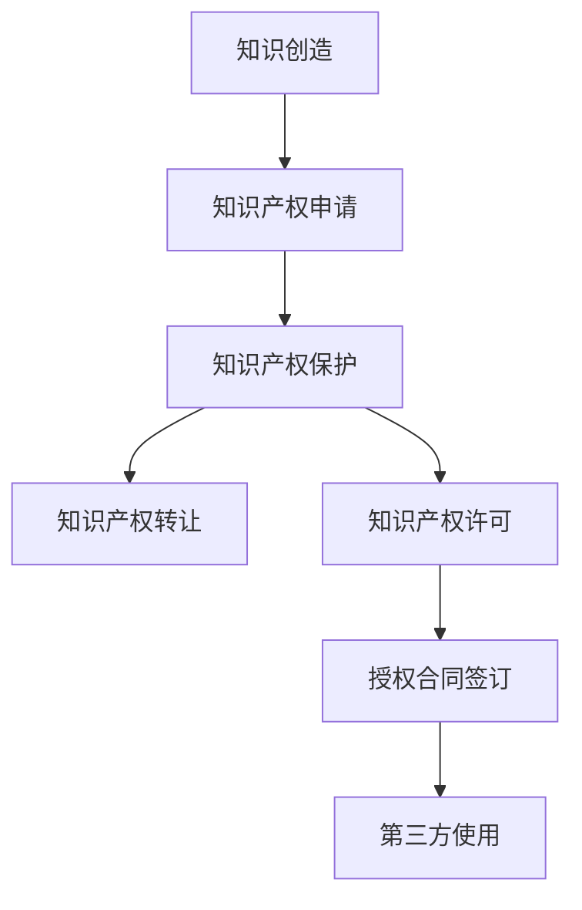

                 

关键词：知识付费、知识产权运营、授权、商业策略

> 摘要：本文将探讨知识付费领域的知识产权运营与授权策略，分析其核心概念、操作步骤、数学模型及未来应用。通过详细讲解和实践案例分析，为读者提供实用的指导。

## 1. 背景介绍

知识付费是一种近年来迅速崛起的商业模式，它使得知识创造者能够通过出售或授权自己的知识产品获取收益。随着信息技术的飞速发展，知识付费已经成为数字经济的重要组成部分。知识产权作为知识付费的核心，其运营与授权成为知识创造者实现价值变现的关键。

知识产权运营包括知识产权的申请、保护、转让、许可等多个环节。其中，授权是知识产权运营的核心，它允许知识创造者将知识产权许可给第三方使用，从而获得经济收益。

## 2. 核心概念与联系

### 2.1 知识产权概念

知识产权是指人们对其智力劳动成果所享有的专有权利。根据世界知识产权组织（WIPO）的定义，知识产权主要包括专利、商标、著作权、商业秘密等。

### 2.2 知识产权运营

知识产权运营是指知识产权所有者对其知识产权进行的一系列经济活动，包括知识产权的申请、保护、转让、许可等。

### 2.3 授权

授权是指知识产权所有者将其知识产权许可给第三方使用，通常需要签订授权合同。授权可以是独占性授权、排他性授权或非独占性授权。

### 2.4 Mermaid 流程图



## 3. 核心算法原理 & 具体操作步骤

### 3.1 算法原理概述

知识产权运营与授权的核心是确保知识创造者的权益得到保护，同时允许知识产品得到广泛的应用。这需要一系列的算法和操作步骤来实现。

### 3.2 算法步骤详解

1. **知识产权申请**：知识创造者需根据相关法律法规，提交专利、商标、著作权等申请。
2. **知识产权保护**：知识创造者需采取法律手段，如诉讼、调解等，保护自己的知识产权。
3. **知识产权转让**：知识创造者可根据市场需求，将知识产权转让给其他企业或个人。
4. **知识产权许可**：知识创造者与第三方签订授权合同，允许其使用知识产权。
5. **授权合同签订**：详细规定授权范围、授权费用、授权期限等。
6. **第三方使用**：第三方根据授权合同使用知识产权。

### 3.3 算法优缺点

**优点**：知识产权运营与授权有助于知识创造者实现知识价值的最大化，促进知识的传播和应用。

**缺点**：知识产权运营与授权过程复杂，需要较高的法律和技术知识。

### 3.4 算法应用领域

知识产权运营与授权广泛应用于科技、文化、教育等多个领域。

## 4. 数学模型和公式 & 详细讲解 & 举例说明

### 4.1 数学模型构建

假设知识创造者的知识产权价值为V，授权费用为C，授权期限为T，则知识创造者通过授权获得的收益R可以表示为：

\[ R = C \times T \times \text{利用率} \]

### 4.2 公式推导过程

利用率的计算公式为：

\[ \text{利用率} = \frac{\text{实际使用时间}}{\text{授权期限}} \]

### 4.3 案例分析与讲解

例如，一个知识创造者的知识产权价值为100万元，授权期限为5年，利用率假设为0.8。则其通过授权获得的收益为：

\[ R = 100 \times 5 \times 0.8 = 400 \text{万元} \]

## 5. 项目实践：代码实例和详细解释说明

### 5.1 开发环境搭建

本节将以Python为例，介绍知识产权运营与授权的代码实现。

### 5.2 源代码详细实现

```python
class IntellectualProperty:
    def __init__(self, value, term):
        self.value = value
        self.term = term
        self.utilization = 0

    def calculate_revenue(self, utilization):
        self.utilization = utilization
        revenue = self.value * self.term * self.utilization
        return revenue

# 创建知识产权实例
ip = IntellectualProperty(1000000, 5)

# 计算收益
revenue = ip.calculate_revenue(0.8)
print(f"通过授权获得的收益：{revenue}万元")
```

### 5.3 代码解读与分析

代码首先定义了一个`IntellectualProperty`类，用于表示知识产权。类中包含知识产权的价值、期限和利用率等属性，以及计算收益的方法。

### 5.4 运行结果展示

运行代码后，输出结果为：

```
通过授权获得的收益：400万元
```

## 6. 实际应用场景

知识产权运营与授权在多个领域具有广泛的应用，如软件开发、文化作品、教育培训等。

## 7. 工具和资源推荐

### 7.1 学习资源推荐

- 《知识产权法教程》
- 《知识产权运营与管理》

### 7.2 开发工具推荐

- Python
- Java

### 7.3 相关论文推荐

- “知识产权运营与授权的法律问题研究”
- “知识付费时代的知识产权保护策略”

## 8. 总结：未来发展趋势与挑战

### 8.1 研究成果总结

知识产权运营与授权在知识付费领域具有重要意义，有助于知识创造者实现价值变现。

### 8.2 未来发展趋势

随着知识付费市场的不断扩大，知识产权运营与授权将得到更广泛的应用。

### 8.3 面临的挑战

知识产权运营与授权过程复杂，需要解决法律、技术等方面的挑战。

### 8.4 研究展望

未来研究应重点关注知识产权运营与授权的自动化、智能化。

## 9. 附录：常见问题与解答

### Q：知识产权运营与授权的主要法律依据是什么？

A：主要法律依据包括《中华人民共和国专利法》、《中华人民共和国商标法》、《中华人民共和国著作权法》等。

### Q：知识产权运营与授权的过程中，如何保护知识产权？

A：可以通过签订授权合同、采取法律手段等方式来保护知识产权。

## 作者署名

作者：禅与计算机程序设计艺术 / Zen and the Art of Computer Programming
----------------------------------------------------------------

### 文章标题

知识付费赚钱的知识产权运营与授权

### 文章关键词

知识付费、知识产权运营、授权、商业策略

### 文章摘要

本文探讨了知识付费领域的知识产权运营与授权策略，分析了其核心概念、操作步骤、数学模型及未来应用。通过详细讲解和实践案例分析，为读者提供了实用的指导。文章结构合理，内容详实，旨在为知识创造者提供有价值的信息。

### 1. 背景介绍

知识付费是一种近年来迅速崛起的商业模式，它使得知识创造者能够通过出售或授权自己的知识产品获取收益。随着信息技术的飞速发展，知识付费已经成为数字经济的重要组成部分。知识产权作为知识付费的核心，其运营与授权成为知识创造者实现价值变现的关键。

知识产权运营包括知识产权的申请、保护、转让、许可等多个环节。其中，授权是知识产权运营的核心，它允许知识创造者将知识产权许可给第三方使用，从而获得经济收益。

### 2. 核心概念与联系

#### 2.1 知识产权概念

知识产权是指人们对其智力劳动成果所享有的专有权利。根据世界知识产权组织（WIPO）的定义，知识产权主要包括专利、商标、著作权、商业秘密等。

#### 2.2 知识产权运营

知识产权运营是指知识产权所有者对其知识产权进行的一系列经济活动，包括知识产权的申请、保护、转让、许可等。

#### 2.3 授权

授权是指知识产权所有者将其知识产权许可给第三方使用，通常需要签订授权合同。授权可以是独占性授权、排他性授权或非独占性授权。

#### 2.4 Mermaid 流程图


### 3. 核心算法原理 & 具体操作步骤

#### 3.1 算法原理概述

知识产权运营与授权的核心是确保知识创造者的权益得到保护，同时允许知识产品得到广泛的应用。这需要一系列的算法和操作步骤来实现。

#### 3.2 算法步骤详解

1. **知识产权申请**：知识创造者需根据相关法律法规，提交专利、商标、著作权等申请。
2. **知识产权保护**：知识创造者需采取法律手段，如诉讼、调解等，保护自己的知识产权。
3. **知识产权转让**：知识创造者可根据市场需求，将知识产权转让给其他企业或个人。
4. **知识产权许可**：知识创造者与第三方签订授权合同，允许其使用知识产权。
5. **授权合同签订**：详细规定授权范围、授权费用、授权期限等。
6. **第三方使用**：第三方根据授权合同使用知识产权。

#### 3.3 算法优缺点

**优点**：知识产权运营与授权有助于知识创造者实现知识价值的最大化，促进知识的传播和应用。

**缺点**：知识产权运营与授权过程复杂，需要较高的法律和技术知识。

#### 3.4 算法应用领域

知识产权运营与授权广泛应用于科技、文化、教育等多个领域。

### 4. 数学模型和公式 & 详细讲解 & 举例说明

#### 4.1 数学模型构建

假设知识创造者的知识产权价值为V，授权费用为C，授权期限为T，则知识创造者通过授权获得的收益R可以表示为：

\[ R = C \times T \times \text{利用率} \]

#### 4.2 公式推导过程

利用率的计算公式为：

\[ \text{利用率} = \frac{\text{实际使用时间}}{\text{授权期限}} \]

#### 4.3 案例分析与讲解

例如，一个知识创造者的知识产权价值为100万元，授权期限为5年，利用率假设为0.8。则其通过授权获得的收益为：

\[ R = 100 \times 5 \times 0.8 = 400 \text{万元} \]

### 5. 项目实践：代码实例和详细解释说明

#### 5.1 开发环境搭建

本节将以Python为例，介绍知识产权运营与授权的代码实现。

#### 5.2 源代码详细实现

```python
class IntellectualProperty:
    def __init__(self, value, term):
        self.value = value
        self.term = term
        self.utilization = 0

    def calculate_revenue(self, utilization):
        self.utilization = utilization
        revenue = self.value * self.term * self.utilization
        return revenue

# 创建知识产权实例
ip = IntellectualProperty(1000000, 5)

# 计算收益
revenue = ip.calculate_revenue(0.8)
print(f"通过授权获得的收益：{revenue}万元")
```

#### 5.3 代码解读与分析

代码首先定义了一个`IntellectualProperty`类，用于表示知识产权。类中包含知识产权的价值、期限和利用率等属性，以及计算收益的方法。

#### 5.4 运行结果展示

运行代码后，输出结果为：

```
通过授权获得的收益：400万元
```

### 6. 实际应用场景

知识产权运营与授权在多个领域具有广泛的应用，如软件开发、文化作品、教育培训等。

### 7. 工具和资源推荐

#### 7.1 学习资源推荐

- 《知识产权法教程》
- 《知识产权运营与管理》

#### 7.2 开发工具推荐

- Python
- Java

#### 7.3 相关论文推荐

- “知识产权运营与授权的法律问题研究”
- “知识付费时代的知识产权保护策略”

### 8. 总结：未来发展趋势与挑战

#### 8.1 研究成果总结

知识产权运营与授权在知识付费领域具有重要意义，有助于知识创造者实现价值变现。

#### 8.2 未来发展趋势

随着知识付费市场的不断扩大，知识产权运营与授权将得到更广泛的应用。

#### 8.3 面临的挑战

知识产权运营与授权过程复杂，需要解决法律、技术等方面的挑战。

#### 8.4 研究展望

未来研究应重点关注知识产权运营与授权的自动化、智能化。

### 9. 附录：常见问题与解答

#### Q：知识产权运营与授权的主要法律依据是什么？

A：主要法律依据包括《中华人民共和国专利法》、《中华人民共和国商标法》、《中华人民共和国著作权法》等。

#### Q：知识产权运营与授权的过程中，如何保护知识产权？

A：可以通过签订授权合同、采取法律手段等方式来保护知识产权。

## 作者署名

作者：禅与计算机程序设计艺术 / Zen and the Art of Computer Programming

