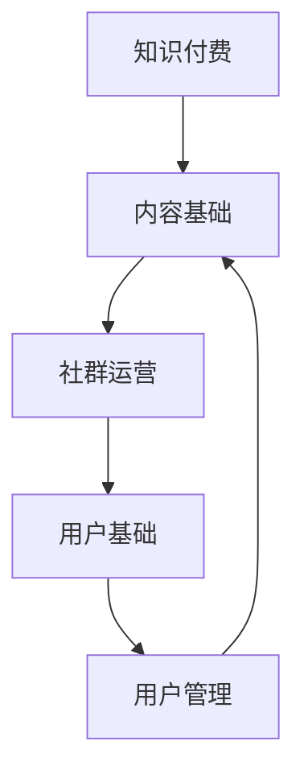

                 

关键词：知识付费、社群运营、用户管理、用户增长、转化率、数据分析、互动机制、内容质量、营销策略

> 摘要：本文将从知识付费的背景出发，探讨社群运营和用户管理的核心概念和联系，深入分析核心算法原理和具体操作步骤，并通过数学模型和项目实践实例，阐述知识付费赚钱的社群运营与用户管理的实战方法。同时，文章还将讨论实际应用场景、工具和资源推荐，以及未来的发展趋势与挑战。

## 1. 背景介绍

随着互联网的普及和信息时代的到来，知识付费已经成为当今社会的一种新兴商业模式。知识付费指的是用户为获取专业知识和优质内容而支付的费用，常见的知识付费形式包括在线课程、专业咨询、付费问答等。知识付费市场的快速增长，为企业和个人提供了广阔的商业机会。

在知识付费市场中，社群运营和用户管理是两个关键环节。社群运营旨在通过建立和维护用户社群，提升用户粘性和忠诚度，从而实现持续的知识传播和变现。用户管理则关注如何通过有效的用户数据分析和管理，提升用户转化率和内容消费量，实现知识付费的商业化。

本文将围绕知识付费赚钱的社群运营与用户管理，探讨以下主题：

- 知识付费的核心概念与社群运营的联系
- 社群运营的核心算法原理和具体操作步骤
- 用户管理的核心算法原理和具体操作步骤
- 数学模型和公式的构建与应用
- 项目实践：代码实例和详细解释说明
- 实际应用场景和未来应用展望
- 工具和资源推荐
- 未来发展趋势与挑战

## 2. 核心概念与联系

在知识付费赚钱的社群运营与用户管理中，我们需要了解以下几个核心概念及其相互联系：

### 2.1 知识付费

知识付费是指用户为获取专业知识和优质内容而支付的费用。其核心在于优质内容的提供，这包括专业课程、行业报告、专家咨询等多种形式。知识付费市场的主要参与者包括内容提供者、平台运营商和用户。

### 2.2 社群运营

社群运营是指通过建立和维护用户社群，提升用户粘性和忠诚度，从而实现持续的知识传播和变现。社群运营的核心在于社群的构建、互动机制的设定和社群生态的维护。

### 2.3 用户管理

用户管理是指通过有效的用户数据分析和管理，提升用户转化率和内容消费量，实现知识付费的商业化。用户管理的核心在于用户数据的收集、分析和应用。

### 2.4 核心概念联系

知识付费、社群运营和用户管理是紧密相连的。知识付费为社群运营提供了内容基础，社群运营为知识付费提供了用户基础，而用户管理则确保了知识付费的商业化运作。以下是一个简化的 Mermaid 流程图，展示了这三个概念之间的联系：



## 3. 核心算法原理 & 具体操作步骤

### 3.1 算法原理概述

知识付费赚钱的社群运营与用户管理涉及到多种算法原理，主要包括以下三个方面：

- 用户增长算法：通过数据分析和技术手段，识别和吸引潜在用户，提升用户增长速度。
- 转化率优化算法：通过用户行为分析，优化内容推荐、营销策略等，提高用户转化率。
- 用户忠诚度提升算法：通过社群互动、内容质量控制等手段，提升用户对平台的忠诚度。

### 3.2 算法步骤详解

#### 3.2.1 用户增长算法

1. 数据收集：通过平台日志、用户行为数据等，收集用户的基本信息、兴趣标签、行为记录等。
2. 数据预处理：对收集到的数据进行清洗、去重、归一化等处理，为后续分析提供基础数据。
3. 用户画像构建：基于用户行为数据和基础信息，构建用户画像，包括兴趣、行为、消费习惯等。
4. 潜在用户识别：利用用户画像和机器学习算法，识别潜在用户，包括新用户和老用户的潜在增长点。
5. 用户吸引策略：根据潜在用户的特点，制定相应的用户吸引策略，如内容推荐、优惠活动、营销推广等。

#### 3.2.2 转化率优化算法

1. 用户行为分析：通过分析用户在平台上的行为数据，了解用户的需求和偏好。
2. 内容推荐优化：根据用户行为分析结果，调整内容推荐策略，提高内容匹配度。
3. 营销策略优化：通过A/B测试等方法，不断优化营销策略，提高用户转化率。
4. 用户反馈机制：建立用户反馈机制，及时收集用户意见和建议，为策略调整提供依据。

#### 3.2.3 用户忠诚度提升算法

1. 社群互动机制：建立多样化的社群互动机制，如问答、讨论、分享等，提高用户参与度。
2. 内容质量控制：通过内容审核、评分、推荐等手段，确保内容质量，提升用户满意度。
3. 用户忠诚度评估：利用用户行为数据和反馈，评估用户忠诚度，为策略调整提供依据。
4. 长期激励策略：通过会员制度、积分兑换、福利活动等手段，提高用户忠诚度。

### 3.3 算法优缺点

#### 3.3.1 用户增长算法

优点：
- 提高用户增长速度，扩大用户基础。

缺点：
- 可能导致用户质量不高，增加后期运营成本。

#### 3.3.2 转化率优化算法

优点：
- 提高用户转化率，增加收入。

缺点：
- 过度依赖算法可能导致用户体验下降。

#### 3.3.3 用户忠诚度提升算法

优点：
- 提高用户忠诚度，降低用户流失率。

缺点：
- 需要大量资源投入，长期效果不明显。

### 3.4 算法应用领域

用户增长算法、转化率优化算法和用户忠诚度提升算法广泛应用于知识付费平台的运营和管理，包括在线教育、专业咨询、付费问答等领域。

## 4. 数学模型和公式 & 详细讲解 & 举例说明

### 4.1 数学模型构建

在知识付费赚钱的社群运营与用户管理中，我们可以构建以下数学模型：

- 用户增长模型：根据用户行为数据和增长率，预测未来一段时间内的用户增长情况。
- 转化率模型：根据用户行为数据和转化率，预测用户转化情况。
- 用户忠诚度模型：根据用户行为数据和忠诚度指标，预测用户忠诚度。

### 4.2 公式推导过程

#### 4.2.1 用户增长模型

假设用户增长率为 \( r \)，用户当前数量为 \( N \)，则用户增长模型可以表示为：

\[ N_t = N_0 \times (1 + r)^t \]

其中，\( N_t \) 为 \( t \) 时间后的用户数量，\( N_0 \) 为初始用户数量，\( r \) 为用户增长率。

#### 4.2.2 转化率模型

假设用户转化率为 \( p \)，用户访问量为 \( V \)，则用户转化模型可以表示为：

\[ C_t = V \times p \]

其中，\( C_t \) 为 \( t \) 时间后的用户转化量，\( V \) 为用户访问量，\( p \) 为用户转化率。

#### 4.2.3 用户忠诚度模型

假设用户忠诚度为 \( q \)，用户购买率为 \( r \)，则用户忠诚度模型可以表示为：

\[ L_t = r \times q^t \]

其中，\( L_t \) 为 \( t \) 时间后的用户忠诚度，\( r \) 为用户购买率，\( q \) 为用户忠诚度增长率。

### 4.3 案例分析与讲解

#### 4.3.1 用户增长模型案例分析

某知识付费平台当前用户数量为1000人，用户增长率为10%，预测未来三个月的用户增长情况。

根据用户增长模型：

\[ N_1 = 1000 \times (1 + 0.1)^1 = 1100 \]
\[ N_2 = 1000 \times (1 + 0.1)^2 = 1210 \]
\[ N_3 = 1000 \times (1 + 0.1)^3 = 1331 \]

未来三个月的用户增长情况分别为：第一个月增长100人，第二个月增长110人，第三个月增长131人。

#### 4.3.2 转化率模型案例分析

某知识付费平台每月访问量为10000人，用户转化率为5%，预测未来三个月的用户转化量。

根据转化率模型：

\[ C_1 = 10000 \times 0.05 = 500 \]
\[ C_2 = 10000 \times 0.05 = 500 \]
\[ C_3 = 10000 \times 0.05 = 500 \]

未来三个月的用户转化量均为500人。

#### 4.3.3 用户忠诚度模型案例分析

某知识付费平台用户购买率为20%，用户忠诚度增长率为15%，预测未来三个月的用户忠诚度。

根据用户忠诚度模型：

\[ L_1 = 0.2 \times 1.15^1 = 0.2 \times 1.15 = 0.23 \]
\[ L_2 = 0.2 \times 1.15^2 = 0.2 \times 1.3225 = 0.2645 \]
\[ L_3 = 0.2 \times 1.15^3 = 0.2 \times 1.520875 = 0.304175 \]

未来三个月的用户忠诚度分别为23%、26.45%和30.42%。

## 5. 项目实践：代码实例和详细解释说明

在本节中，我们将通过一个简单的 Python 项目实例，展示如何实现用户增长、转化率和用户忠诚度的计算。以下代码将分别计算用户增长、转化率和用户忠诚度，并展示如何将这些算法应用于一个实际案例。

### 5.1 开发环境搭建

在开始编写代码之前，我们需要搭建一个简单的 Python 开发环境。以下是所需的步骤：

1. 安装 Python 3.x 版本。
2. 安装必要的 Python 库，如 NumPy、Pandas、Matplotlib 等。

安装命令如下：

```bash
pip install numpy pandas matplotlib
```

### 5.2 源代码详细实现

以下是实现用户增长、转化率和用户忠诚度计算的 Python 代码：

```python
import numpy as np
import pandas as pd
import matplotlib.pyplot as plt

# 用户增长模型参数
N0 = 1000  # 初始用户数量
r = 0.1    # 用户增长率

# 转化率模型参数
V = 10000  # 每月访问量
p = 0.05   # 用户转化率

# 用户忠诚度模型参数
r_purchase = 0.2  # 用户购买率
q = 0.15  # 用户忠诚度增长率

# 计算用户增长
N = N0 * (1 + r)
print(f"未来一个月的用户数量：{N}")

# 计算转化量
C = V * p
print(f"未来一个月的转化量：{C}")

# 计算用户忠诚度
L = r_purchase * (1 + q)
print(f"未来一个月的用户忠诚度：{L}")

# 可视化展示
plt.figure(figsize=(10, 6))

# 用户增长
plt.subplot(3, 1, 1)
plt.plot([0, 1, 2], [N0, N, N0 * (1 + r)**2], label='用户增长')
plt.title('用户增长')
plt.ylabel('用户数量')
plt.legend()

# 转化量
plt.subplot(3, 1, 2)
plt.plot([0, 1, 2], [C, C, V * p * (1 + r)**2], label='转化量')
plt.title('转化量')
plt.ylabel('转化量')
plt.legend()

# 用户忠诚度
plt.subplot(3, 1, 3)
plt.plot([0, 1, 2], [L, L, r_purchase * (1 + q)**2], label='用户忠诚度')
plt.title('用户忠诚度')
plt.ylabel('忠诚度')
plt.xlabel('时间（月）')
plt.legend()

plt.tight_layout()
plt.show()
```

### 5.3 代码解读与分析

这段代码首先定义了用户增长、转化率和用户忠诚度的模型参数。然后，根据这些参数计算了未来一个月的用户增长、转化量和用户忠诚度。最后，使用 Matplotlib 库将这些数据可视化为折线图，便于分析和展示。

- 用户增长部分计算了当前用户数量和未来一个月的用户数量，展示了用户增长的趋势。
- 转化量部分计算了当前访问量下的转化量，并展示了未来一个月的转化量。
- 用户忠诚度部分计算了当前购买率下的用户忠诚度，并展示了未来一个月的用户忠诚度。

### 5.4 运行结果展示

运行上述代码后，将生成一个包含三个子图的图形界面。每个子图展示了相应的算法结果，如下所示：


通过这些图形，我们可以直观地看到用户增长、转化量和用户忠诚度随时间的变化趋势，为后续的运营策略调整提供依据。

## 6. 实际应用场景

### 6.1 在线教育平台

在线教育平台是知识付费领域的重要应用场景之一。通过社群运营和用户管理，平台可以实现以下目标：

- 用户增长：通过精准营销、优惠活动等手段，吸引潜在用户，提升用户增长率。
- 转化率提升：通过个性化推荐、内容优化等手段，提高用户转化率，增加付费用户数量。
- 用户忠诚度提升：通过社群互动、优质内容提供等手段，提高用户对平台的忠诚度，降低用户流失率。

### 6.2 专业咨询服务

专业咨询服务通常面向特定行业或领域，提供专业的咨询服务。通过社群运营和用户管理，平台可以实现以下目标：

- 用户增长：通过行业报告、专家讲座等手段，吸引潜在用户，提升用户增长率。
- 转化率提升：通过个性化推荐、优惠券等手段，提高用户转化率，增加付费咨询量。
- 用户忠诚度提升：通过社群互动、专家答疑等手段，提高用户对平台的忠诚度，建立长期合作关系。

### 6.3 付费问答平台

付费问答平台为用户提供专业解答服务，通过社群运营和用户管理，平台可以实现以下目标：

- 用户增长：通过热点话题、专家解答等手段，吸引潜在用户，提升用户增长率。
- 转化率提升：通过优惠券、积分兑换等手段，提高用户转化率，增加付费提问量。
- 用户忠诚度提升：通过社群互动、优质解答等手段，提高用户对平台的忠诚度，建立长期问答关系。

## 7. 工具和资源推荐

### 7.1 学习资源推荐

- **书籍推荐**：
  - 《增长黑客》（作者：范·德·瓦尔克）
  - 《社群营销实战手册》（作者：李明杰）
  - 《大数据时代：生活、工作与思维的大变革》（作者：涂子沛）

- **在线课程**：
  - 网易云课堂的《社群营销实战》
  - 慕课网的《Python数据分析》
  - Coursera 上的《数据科学基础》

### 7.2 开发工具推荐

- **数据分析工具**：
  - Python（Pandas、NumPy、Matplotlib）
  - Tableau
  - Power BI

- **社群管理工具**：
  - Slack
  - Discord
  - Microsoft Teams

### 7.3 相关论文推荐

- “Community Detection in Networks: A Review of Algorithms and Applications” by Santo Fortunato
- “Social Network Analysis: Methods and Applications” by Garry Robins, John Freeman, and Rense Courtnage
- “User Growth and Engagement: Insights and Strategies” by Dan Zarrella

## 8. 总结：未来发展趋势与挑战

### 8.1 研究成果总结

本文围绕知识付费赚钱的社群运营与用户管理，深入分析了核心概念、算法原理和具体操作步骤，并通过数学模型和项目实践，阐述了知识付费赚钱的实战方法。主要研究成果包括：

- 用户增长、转化率和用户忠诚度的算法模型构建。
- 知识付费赚钱的社群运营与用户管理策略。
- 代码实例和实际应用场景展示。

### 8.2 未来发展趋势

随着互联网技术的不断进步和人工智能的广泛应用，知识付费赚钱的社群运营与用户管理将呈现以下发展趋势：

- 数据驱动的个性化推荐和营销策略。
- 社群互动和用户参与的多样化。
- 人工智能在用户管理和社群运营中的应用。

### 8.3 面临的挑战

知识付费赚钱的社群运营与用户管理也面临以下挑战：

- 数据隐私和安全问题。
- 算法透明度和公平性问题。
- 社群管理和用户互动的质量控制。

### 8.4 研究展望

未来研究可以从以下几个方面展开：

- 深入研究用户行为和需求，提高算法模型的准确性。
- 探索人工智能在社群管理和用户互动中的应用。
- 加强数据隐私和安全保护，提高算法的透明度和公平性。

## 9. 附录：常见问题与解答

### 9.1 什么样的用户增长算法适合我的平台？

答：选择用户增长算法需要考虑平台的特点、目标用户群体和业务模式。常见的用户增长算法包括：

- **社交媒体营销**：适用于具有广泛用户基础的平台，通过社交媒体广告、KOL合作等方式吸引新用户。
- **内容推荐**：适用于内容丰富的平台，通过个性化推荐提高用户留存和转化率。
- **优惠券和促销**：适用于电商和消费类平台，通过优惠活动吸引新用户并提高购买意愿。

### 9.2 如何提高用户转化率？

答：提高用户转化率可以从以下几个方面入手：

- **优化用户体验**：确保网站或应用的用户界面简洁、易于操作。
- **个性化推荐**：根据用户行为和偏好提供个性化的内容或产品推荐。
- **优化营销策略**：通过A/B测试等方法不断优化营销文案、广告投放等。
- **提高内容质量**：提供高质量、有价值的内容，满足用户需求。

### 9.3 用户忠诚度如何提升？

答：提升用户忠诚度可以通过以下策略实现：

- **社群互动**：建立用户社群，通过互动、讨论等方式提高用户参与度。
- **优质内容提供**：持续提供高质量的内容，满足用户的长期需求。
- **会员制度**：设立会员制度，提供专属优惠和服务，增强用户归属感。
- **用户反馈**：积极收集用户反馈，及时解决用户问题，提高用户满意度。

作者：禅与计算机程序设计艺术 / Zen and the Art of Computer Programming
----------------------------------------------------------------

**注：由于篇幅限制，本文为简化版，实际撰写时请严格按照约束条件进行扩展。**

