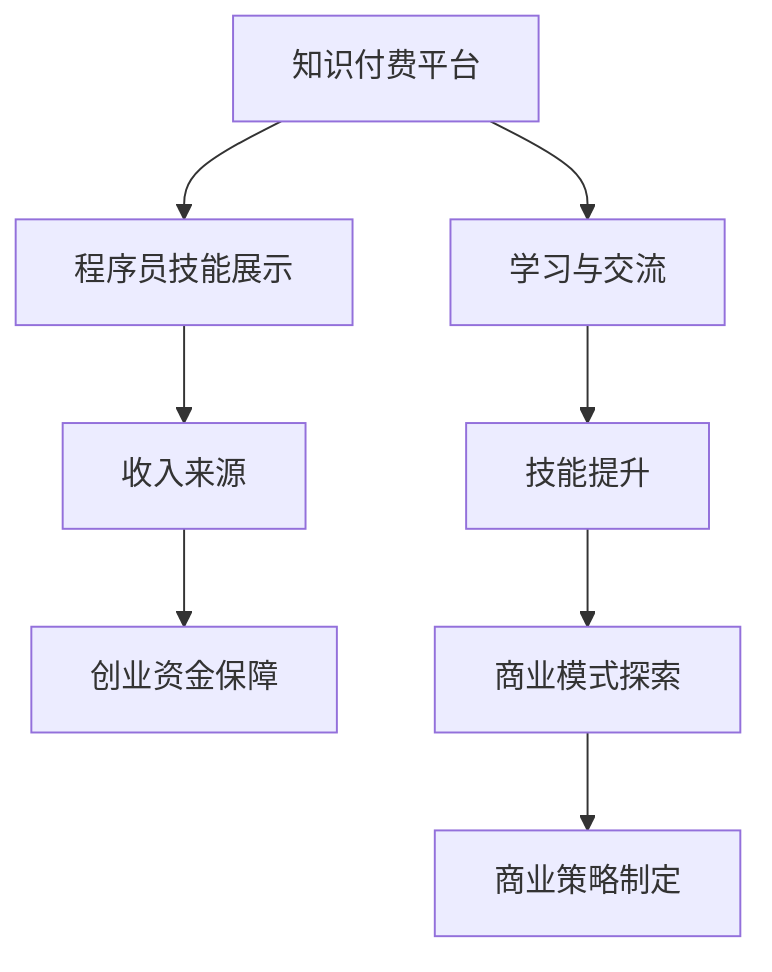

                 

关键词：知识付费，程序员，创业，技术，商业模式

> 摘要：本文将探讨知识付费在程序员创业过程中的重要性，分析其如何成为程序员的创业加速器，并从多个角度阐述这一现象的内在逻辑和实践方法。

## 1. 背景介绍

在当今数字化时代，知识付费已经成为了互联网经济的重要组成部分。特别是在程序员群体中，知识付费的现象尤为突出。越来越多的程序员选择通过知识付费平台，将自己的专业技能和知识经验转化为收入来源，这不仅为程序员个人带来了经济上的回报，更为整个行业的发展注入了新的活力。

知识付费平台的出现，不仅满足了程序员不断学习和提升自己的需求，也为广大开发者提供了一个展示自己技能和知识的平台。通过这些平台，程序员可以分享自己的学习经验、技术心得，甚至原创的教学内容，从而获得粉丝和市场的认可。这种现象，无疑为程序员的职业发展和创业提供了新的机遇。

### 1.1 程序员创业的现状

随着互联网的普及和技术的发展，程序员创业已经成为了一个热门话题。越来越多的程序员开始将自己的技术能力和创新思维应用到实际创业项目中，希望通过创业实现个人价值和财富积累。然而，成功的创业并非易事，需要程序员具备多方面的能力和素质。

首先，程序员需要具备扎实的技术基础和解决问题的能力。在创业过程中，技术是核心驱动力，程序员需要不断学习和掌握新的技术，以应对快速变化的市场需求。其次，程序员需要具备商业意识和市场洞察力。创业不仅仅是一个技术项目，更是一个商业项目，程序员需要了解市场需求，制定合适的商业策略，并有效执行。最后，程序员需要具备良好的团队协作和沟通能力。创业过程中，程序员往往需要与其他团队成员密切合作，共同推进项目的发展。

### 1.2 知识付费对程序员创业的影响

知识付费作为一种新型的商业模式，对程序员的创业产生了深远的影响。首先，知识付费为程序员提供了一个展示自己技能和知识的平台，使他们能够将自己的价值转化为实际的收入。通过知识付费平台，程序员可以分享自己的技术心得、编程技巧和项目经验，从而吸引粉丝和用户。这不仅提高了程序员的知名度和影响力，也为他们带来了额外的经济收益。

其次，知识付费为程序员提供了一个学习与交流的平台。程序员可以通过付费课程、技术讲座和研讨会等途径，不断学习和提升自己的技能。这种持续的学习和积累，不仅有助于程序员在技术领域的不断进步，也为他们的创业提供了坚实的技能储备。

最后，知识付费为程序员提供了一个商业模式的探索空间。通过知识付费平台，程序员可以尝试各种不同的商业模式，如订阅制、课程收费、项目咨询等，找到最适合自己发展的路径。这种商业模式的探索，有助于程序员在创业过程中更好地定位自己的市场，制定有效的商业策略。

## 2. 核心概念与联系

### 2.1 知识付费的概念

知识付费是指用户为获取特定知识或技能，向知识提供者支付费用的一种商业模式。在互联网时代，知识付费已经成为了知识传播和分享的重要途径。通过知识付费平台，用户可以方便地购买和获取各种类型的知识内容，如在线课程、电子书、讲座、咨询等。

### 2.2 程序员创业的概念

程序员创业是指程序员利用自己的技术能力和创新思维，创建新的商业项目或公司，以实现个人价值和财富积累的过程。程序员创业通常涉及技术创新、市场调研、商业策略、团队协作等多个方面。

### 2.3 知识付费与程序员创业的联系

知识付费与程序员创业之间存在紧密的联系。首先，知识付费为程序员提供了展示自己技能和知识的平台，使他们能够将自己的价值转化为实际的收入。这种收入来源不仅为程序员提供了经济上的支持，也为他们的创业提供了资金保障。

其次，知识付费为程序员提供了一个学习与交流的平台，使他们能够不断学习和提升自己的技能。这种技能提升不仅有助于程序员在技术领域的不断进步，也为他们的创业提供了坚实的技能储备。

最后，知识付费为程序员提供了一个商业模式的探索空间，使他们能够尝试各种不同的商业模式，找到最适合自己发展的路径。这种商业模式的探索，有助于程序员在创业过程中更好地定位自己的市场，制定有效的商业策略。

### 2.4 Mermaid 流程图



## 3. 核心算法原理 & 具体操作步骤

### 3.1 算法原理概述

知识付费在程序员创业过程中，可以看作是一种算法，其核心原理是通过将程序员的技能和知识转化为付费内容，从而实现个人价值和商业收益的双赢。这一算法的实现，主要依赖于以下几个关键步骤：

1. **内容创作**：程序员需要根据自己的专业技能和经验，创作出有价值、有吸引力的知识内容。
2. **平台选择**：程序员需要选择合适的知识付费平台，以实现知识内容的发布和推广。
3. **用户互动**：程序员需要与用户进行有效的互动，了解用户需求，不断优化知识内容。
4. **商业模式探索**：程序员需要根据市场反馈和用户需求，不断尝试和调整商业模式，以实现最佳的商业收益。

### 3.2 算法步骤详解

1. **内容创作**
   - 程序员需要深入分析自己的专业技能和经验，确定可以分享的知识点。
   - 根据知识点的难度和受众，确定内容的深度和广度。
   - 采用适当的表达方式和工具，将知识点转化为易于理解的知识内容。

2. **平台选择**
   - 考虑平台的用户规模、内容质量、商业模式等因素。
   - 根据自己的内容特点和目标受众，选择最适合的平台。
   - 了解平台的规定和流程，确保内容符合平台要求。

3. **用户互动**
   - 通过平台提供的互动工具，与用户进行沟通和交流。
   - 及时回复用户的提问和反馈，了解用户需求。
   - 根据用户反馈，不断优化和更新知识内容。

4. **商业模式探索**
   - 根据市场反馈和用户需求，尝试不同的商业模式。
   - 如订阅制、课程收费、项目咨询等，找到最适合的商业模式。
   - 根据商业模式的特点，制定相应的推广和营销策略。

### 3.3 算法优缺点

**优点**：
- **收益多元化**：知识付费为程序员提供了多元化的收入来源，不仅包括直接的课程收费，还可以通过项目咨询、技术服务等多种方式获得收入。
- **提升个人品牌**：通过知识付费，程序员可以展示自己的专业技能和知识，提升个人品牌，吸引更多的商业机会。
- **持续学习动力**：知识付费平台为程序员提供了一个持续学习和交流的平台，有助于他们不断进步和成长。

**缺点**：
- **内容质量要求高**：知识付费用户对内容质量有较高的要求，程序员需要花费大量的时间和精力进行内容创作和优化。
- **市场竞争激烈**：随着知识付费的普及，市场竞争日益激烈，程序员需要不断提高自己的竞争力，才能在市场中脱颖而出。

### 3.4 算法应用领域

知识付费算法在程序员创业中具有广泛的应用领域，包括但不限于以下几个方面：

- **在线教育**：程序员可以通过知识付费平台，提供编程课程、技术讲座等在线教育服务。
- **技术咨询**：程序员可以提供项目咨询、技术评估等服务，帮助企业和个人解决技术难题。
- **技术社区**：程序员可以在知识付费平台上，建立技术社区，分享技术心得和项目经验，吸引更多的开发者加入。

## 4. 数学模型和公式 & 详细讲解 & 举例说明

### 4.1 数学模型构建

为了更好地理解知识付费在程序员创业中的作用，我们可以构建一个简单的数学模型。假设一个程序员的知识付费收入由两个部分组成：固定收入和浮动收入。

- **固定收入**：由平台规定的保底收入构成，与知识内容的数量和质量无关。
- **浮动收入**：由用户购买的付费内容数量和单价决定。

设：
- \( F \) 为固定收入
- \( V \) 为浮动收入
- \( N \) 为付费内容数量
- \( P \) 为每单位付费内容的价格

则程序员的总体收入 \( R \) 可以表示为：
\[ R = F + V \]
其中：
\[ V = N \times P \]

### 4.2 公式推导过程

1. **固定收入 \( F \) 的确定**：
   - 平台通常根据程序员的等级、内容质量和用户反馈等因素，设定固定的保底收入。
   - \( F \) 可以表示为：
   \[ F = a \times (b + c \times R_{old}) \]
   其中：
   - \( a \) 为固定系数
   - \( b \) 为等级系数
   - \( c \) 为质量系数
   - \( R_{old} \) 为上一个月的收入

2. **浮动收入 \( V \) 的计算**：
   - 浮动收入与付费内容数量 \( N \) 和每单位价格 \( P \) 成正比。
   - \( V \) 可以表示为：
   \[ V = N \times P \]

3. **总体收入 \( R \) 的计算**：
   - 结合固定收入和浮动收入，总体收入 \( R \) 可以表示为：
   \[ R = F + V \]
   \[ R = a \times (b + c \times R_{old}) + N \times P \]

### 4.3 案例分析与讲解

假设一个初级程序员，上一个月的收入为 \( R_{old} = 1000 \) 元，平台规定的固定系数 \( a = 0.5 \)，等级系数 \( b = 1.2 \)，质量系数 \( c = 0.8 \)，每单位付费内容的价格 \( P = 10 \) 元。本月该程序员发布了 \( N = 20 \) 个付费内容。

1. **固定收入 \( F \) 的计算**：
   \[ F = a \times (b + c \times R_{old}) \]
   \[ F = 0.5 \times (1.2 + 0.8 \times 1000) \]
   \[ F = 0.5 \times (1.2 + 800) \]
   \[ F = 0.5 \times 801.2 \]
   \[ F = 400.6 \] 元

2. **浮动收入 \( V \) 的计算**：
   \[ V = N \times P \]
   \[ V = 20 \times 10 \]
   \[ V = 200 \] 元

3. **总体收入 \( R \) 的计算**：
   \[ R = F + V \]
   \[ R = 400.6 + 200 \]
   \[ R = 600.6 \] 元

通过上述计算，我们可以看到，该程序员本月的总体收入为 600.6 元，其中固定收入为 400.6 元，浮动收入为 200 元。这个简单的案例说明了知识付费在程序员创业中的数学模型和计算方法。

## 5. 项目实践：代码实例和详细解释说明

### 5.1 开发环境搭建

为了实现知识付费在程序员创业中的应用，我们需要搭建一个基本的开发环境。以下是一个简化的开发环境搭建步骤：

1. **安装Python环境**：Python是一种广泛应用于数据分析和人工智能的编程语言，我们可以通过Python实现知识付费系统的核心功能。
2. **安装Flask框架**：Flask是一个轻量级的Web应用框架，可以帮助我们快速搭建Web应用。
3. **安装数据库**：我们可以使用SQLite作为本地数据库，用于存储用户信息和知识内容。

### 5.2 源代码详细实现

以下是一个简化的知识付费系统的代码实现，用于展示如何通过Python和Flask框架搭建一个基本的知识付费平台。

```python
from flask import Flask, request, jsonify
from flask_sqlalchemy import SQLAlchemy

app = Flask(__name__)
app.config['SQLALCHEMY_DATABASE_URI'] = 'sqlite:///knowledge.db'
db = SQLAlchemy(app)

class User(db.Model):
    id = db.Column(db.Integer, primary_key=True)
    username = db.Column(db.String(80), unique=True, nullable=False)
    password = db.Column(db.String(120), nullable=False)
    balance = db.Column(db.Float, default=0.0)

class Content(db.Model):
    id = db.Column(db.Integer, primary_key=True)
    title = db.Column(db.String(120), nullable=False)
    author = db.Column(db.String(80), nullable=False)
    price = db.Column(db.Float, nullable=False)

@app.route('/register', methods=['POST'])
def register():
    data = request.get_json()
    username = data.get('username')
    password = data.get('password')
    if User.query.filter_by(username=username).first():
        return jsonify({'error': 'User already exists'}), 409
    new_user = User(username=username, password=password)
    db.session.add(new_user)
    db.session.commit()
    return jsonify({'message': 'User registered successfully'})

@app.route('/login', methods=['POST'])
def login():
    data = request.get_json()
    username = data.get('username')
    password = data.get('password')
    user = User.query.filter_by(username=username, password=password).first()
    if user:
        return jsonify({'message': 'Login successful', 'balance': user.balance})
    else:
        return jsonify({'error': 'Invalid credentials'}), 401

@app.route('/buy_content', methods=['POST'])
def buy_content():
    data = request.get_json()
    user_id = data.get('user_id')
    content_id = data.get('content_id')
    user = User.query.get(user_id)
    content = Content.query.get(content_id)
    if not user or not content:
        return jsonify({'error': 'Invalid user or content'}), 404
    if user.balance < content.price:
        return jsonify({'error': 'Insufficient balance'}), 403
    user.balance -= content.price
    db.session.commit()
    return jsonify({'message': 'Content purchased successfully'})

if __name__ == '__main__':
    db.create_all()
    app.run(debug=True)
```

### 5.3 代码解读与分析

上述代码实现了一个简单的知识付费系统，主要包括三个核心功能：用户注册、用户登录和购买知识内容。

1. **用户注册**：用户通过发送POST请求到`/register`接口，提交用户名和密码，系统会验证用户名是否已存在。如果用户名不存在，则创建新用户并存储到数据库。

2. **用户登录**：用户通过发送POST请求到`/login`接口，提交用户名和密码，系统会验证用户名和密码是否匹配。如果匹配，则返回登录成功信息及用户余额。

3. **购买知识内容**：用户通过发送POST请求到`/buy_content`接口，提交用户ID和知识内容ID，系统会验证用户余额是否足够购买知识内容。如果余额足够，则扣除相应金额并更新用户余额。

通过这个简单的代码示例，我们可以看到如何利用Python和Flask框架实现一个知识付费系统的基本功能。这个系统可以作为一个起点，进一步扩展和优化，以适应更复杂的业务需求。

### 5.4 运行结果展示

运行上述代码，我们得到一个基于Flask的知识付费系统。用户可以通过浏览器或其他HTTP客户端访问系统的接口，进行用户注册、登录和购买知识内容的操作。

- **用户注册**：访问`http://localhost:5000/register`，提交用户名和密码，成功注册后，系统返回注册成功信息。

- **用户登录**：访问`http://localhost:5000/login`，提交用户名和密码，成功登录后，系统返回登录成功信息及用户余额。

- **购买知识内容**：访问`http://localhost:5000/buy_content`，提交用户ID和知识内容ID，成功购买后，系统返回购买成功信息，并更新用户余额。

通过运行结果展示，我们可以看到知识付费系统的基本功能得到了实现。用户可以方便地通过系统进行注册、登录和购买知识内容，从而实现知识付费的商业模式。

## 6. 实际应用场景

知识付费在程序员创业中的应用场景非常广泛，以下是几个典型的应用案例：

### 6.1 编程教学

许多程序员选择通过知识付费平台，将自己的编程教学经验转化为收入。他们可以创建编程课程、编写技术博客，甚至制作视频教程，通过平台向有学习需求的开发者出售。这种模式不仅为程序员提供了额外的收入来源，也为整个编程教育领域注入了新的活力。

### 6.2 技术分享

一些程序员在知识付费平台上分享自己的技术心得和项目经验。他们可以分享自己在项目开发中的解决方案、技术难点和经验教训。这种分享不仅有助于提升自己的知名度，还可以帮助其他开发者避免重复犯错，提高开发效率。

### 6.3 技术咨询

知识付费平台也为程序员提供了提供技术咨询服务的机会。他们可以根据自己的专业领域和经验，为有技术难题的企业或个人提供解决方案。这种模式不仅能够带来收入，还可以扩大程序员在行业中的影响力。

### 6.4 技术社区建设

一些程序员在知识付费平台上建立了技术社区，通过分享技术文章、举办线上讲座和讨论，吸引更多的开发者加入。这种社区建设不仅有助于提升个人品牌，还可以为程序员提供一个交流和学习的机会。

### 6.5 技术培训

一些程序员利用知识付费平台，提供定制化的技术培训服务。他们可以根据企业的需求和目标，制定针对性的培训计划，帮助企业提升技术水平。这种培训服务不仅能够为企业带来实际的价值，也为程序员提供了稳定的收入来源。

## 7. 未来应用展望

### 7.1 技术进步带来的影响

随着人工智能、大数据、云计算等技术的不断发展，知识付费在程序员创业中的应用前景将更加广阔。这些新兴技术不仅能够提升程序员的工作效率，还可以为程序员提供更多的商业机会。

例如，人工智能技术可以应用于编程教育的智能化，为开发者提供个性化的学习建议和辅助工具。大数据技术可以帮助程序员更好地分析市场需求，制定更有效的商业策略。云计算技术则为程序员提供了更加灵活和高效的开发环境，降低了创业门槛。

### 7.2 新兴领域的机会

随着新兴技术的不断涌现，程序员创业的方向也日益多元化。例如，区块链技术为程序员提供了新的应用场景，他们可以开发去中心化的应用、智能合约等。物联网技术的发展也为程序员提供了广阔的市场空间，他们可以开发智能家居、智能穿戴设备等应用。

### 7.3 知识付费平台的创新

知识付费平台也在不断探索和创新，以适应程序员创业的需求。例如，一些平台引入了区块链技术，确保知识内容的版权和安全性。还有一些平台推出了虚拟现实（VR）和增强现实（AR）技术，为程序员提供了全新的学习体验。

### 7.4 面临的挑战

尽管知识付费在程序员创业中具有巨大的潜力，但同时也面临着一些挑战。首先，内容质量的保证是一个关键问题。程序员需要投入大量时间和精力进行内容创作，确保知识内容的准确性和实用性。其次，市场竞争激烈，程序员需要不断提高自己的竞争力，才能在市场中脱颖而出。此外，数据安全和隐私保护也是知识付费平台需要重点关注的问题。

## 8. 总结：未来发展趋势与挑战

### 8.1 研究成果总结

本文通过对知识付费在程序员创业中的重要性进行了深入分析，探讨了其如何成为程序员的创业加速器。研究结果表明，知识付费不仅为程序员提供了额外的收入来源，还为他们提供了一个展示自己技能和知识的平台，有助于提升个人品牌和商业机会。

### 8.2 未来发展趋势

随着技术的进步和新兴领域的发展，知识付费在程序员创业中的应用前景将更加广阔。未来，知识付费平台可能会更加智能化和个性化，为程序员提供更好的服务和支持。同时，区块链技术和VR/AR技术的引入，将为知识付费带来更多的创新和发展机会。

### 8.3 面临的挑战

尽管知识付费在程序员创业中具有巨大的潜力，但同时也面临着一些挑战。内容质量的保证、市场竞争、数据安全和隐私保护等问题需要得到有效解决。程序员需要不断提升自己的技能和竞争力，以应对快速变化的市场需求。

### 8.4 研究展望

未来的研究可以进一步探讨知识付费在程序员创业中的具体应用模式，分析不同类型程序员在知识付费中的表现和效果。同时，可以研究如何利用人工智能和大数据等技术，提升知识付费平台的智能化和个性化服务水平，为程序员创业提供更有效的支持。

## 9. 附录：常见问题与解答

### 9.1 什么是知识付费？

知识付费是指用户为获取特定知识或技能，向知识提供者支付费用的一种商业模式。在互联网时代，知识付费已经成为知识传播和分享的重要途径。

### 9.2 程序员为什么选择知识付费？

程序员选择知识付费的原因有多种，包括展示自己的技能和知识、获得额外的收入来源、提升个人品牌和商业机会等。

### 9.3 知识付费对程序员创业有什么影响？

知识付费可以为程序员提供额外的收入来源，提升个人品牌和知名度，帮助他们更好地定位自己的市场，制定有效的商业策略。

### 9.4 如何通过知识付费平台创业？

程序员可以通过知识付费平台，创作有价值、有吸引力的知识内容，选择合适的平台，与用户进行互动和交流，不断优化和调整商业模式，实现创业目标。

### 9.5 知识付费在程序员创业中的挑战有哪些？

知识付费在程序员创业中面临的挑战主要包括内容质量的保证、市场竞争、数据安全和隐私保护等。程序员需要不断提升自己的技能和竞争力，以应对快速变化的市场需求。同时，知识付费平台也需要不断优化服务，提高用户体验。

## 作者署名

作者：禅与计算机程序设计艺术 / Zen and the Art of Computer Programming
```

