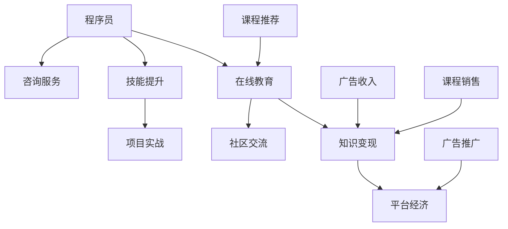

                 

关键词：知识付费、程序员、收益模式、技能提升、在线教育、平台经济

> 摘要：在数字化时代，知识付费成为程序员获取额外收入的重要途径。本文将探讨知识付费在程序员职业发展中的重要性、实现方式、挑战及未来趋势。

## 1. 背景介绍

知识付费，即通过支付费用获取专业知识和技能的过程，近年来在全球范围内迅速兴起。这种模式改变了人们获取知识的方式，也为知识创作者提供了新的收入来源。随着在线教育的普及和互联网技术的发展，程序员群体开始探索通过知识付费实现职业发展和财务自由的路径。

程序员作为现代社会的重要职业群体，其技能水平和专业知识的需求日益增加。传统的职场晋升路径往往受限，而知识付费平台为程序员提供了一个展示自我、提升技能、获取收益的多维度平台。本文将探讨知识付费对程序员职业发展的影响，以及如何有效地利用这一新型赚钱方式。

### 程序员的职业现状

程序员职业具有高度的专业性和技术要求，其职业发展路径主要包括以下几个阶段：

1. **初级程序员**：掌握基础编程语言和开发工具，能够完成基本的软件开发任务。
2. **中级程序员**：具备一定项目经验，能够独立负责模块开发，参与项目决策。
3. **高级程序员**：具备深厚的技术功底和团队管理能力，负责核心模块的设计与实现。
4. **技术专家**：具备广泛的技术视野和深厚的理论基础，能够解决复杂的技术难题。

然而，传统的职业发展路径存在一些局限性，如晋升空间有限、职业发展速度缓慢等。知识付费为程序员提供了一种新的职业发展途径，使得程序员可以通过不断提升自己的技能和知识，实现职业价值和收入的提升。

### 在线教育平台的兴起

在线教育平台的兴起为程序员提供了丰富的学习资源和互动平台。知名平台如Coursera、Udemy、edX等，提供了涵盖编程语言、框架、数据库、人工智能等各个领域的课程。这些平台不仅提供了系统的知识体系，还通过实时互动、作业批改等方式提升了学习效果。

此外，一些垂直领域的在线教育平台，如Udacity、Codecademy等，专注于编程技能的提升，为程序员提供了定制化的学习路径。通过在线教育平台，程序员可以灵活地安排学习时间，根据个人需求选择适合自己的课程，大大提高了学习效率。

## 2. 核心概念与联系

知识付费在程序员职业发展中具有重要意义，其核心概念包括：

- **知识变现**：程序员通过分享自己的专业知识和经验，转化为实际收益。
- **技能提升**：程序员通过学习新技能，提高自身竞争力，拓展职业发展空间。
- **在线教育**：通过互联网平台，程序员可以获得系统化、个性化的学习资源。
- **平台经济**：知识付费平台作为中介，连接知识供给方和需求方，实现资源的高效配置。

### 知识变现

知识变现是指个人或机构通过创造和传播知识，将其转化为经济利益的过程。对于程序员来说，知识变现可以通过以下几种方式实现：

1. **在线课程**：程序员将自己的专业技能和经验制作成课程，在各大在线教育平台上线。
2. **技术博客**：通过撰写技术博客，分享自己的学习心得和项目经验，吸引读者，进而实现广告收入或付费阅读。
3. **咨询服务**：为有需求的个人或企业提供技术咨询服务，通过解答问题或提供解决方案获取收益。

### 技能提升

技能提升是程序员知识变现的前提和基础。通过在线教育平台，程序员可以：

1. **学习新技能**：通过学习新编程语言、框架、工具等，拓宽技能树，提升自身竞争力。
2. **项目实战**：通过参与实际项目，将所学知识应用于实践中，提高项目经验和实战能力。
3. **社区交流**：参与技术社区，与同行交流学习，获取新的思路和解决方案。

### 在线教育

在线教育为程序员提供了便捷的学习途径和丰富的学习资源。通过在线教育平台，程序员可以：

1. **自主安排学习**：根据个人时间和进度，灵活安排学习计划，实现自我驱动式学习。
2. **个性化学习**：通过学习推荐系统，获取符合个人需求的学习资源，提高学习效果。
3. **互动交流**：与讲师和其他学员互动，解决学习中的问题和困惑，促进知识吸收。

### 平台经济

知识付费平台作为平台经济的重要组成部分，为知识供给方和需求方提供了高效连接的途径。通过平台经济，程序员可以：

1. **提升知名度**：通过平台曝光，提升个人品牌影响力，吸引更多学员。
2. **增加收入**：通过平台提供的课程销售、广告推广、咨询服务等，实现多渠道收入。
3. **降低门槛**：平台降低了知识分享的门槛，让更多的程序员能够参与到知识变现的过程中。

### Mermaid 流程图

下面是一个简化的知识付费在程序员职业发展中的流程图，展示核心概念之间的联系。



## 3. 核心算法原理 & 具体操作步骤

### 3.1 算法原理概述

知识付费在程序员职业发展中的应用可以看作是一种“收益最大化”的算法。该算法的核心目标是最大化程序员的收益，同时提升其技能水平和职业发展。算法原理主要包括以下几个步骤：

1. **技能评估**：根据程序员的现有技能和知识水平，进行评估和分类。
2. **需求分析**：分析市场需求，了解学员对哪些技能有较高的需求。
3. **内容制作**：根据需求和技能评估，制作高质量的课程内容。
4. **推广营销**：通过多渠道推广，吸引学员关注和购买。
5. **收益分配**：根据课程销量和学员反馈，进行收益分配和调整。

### 3.2 算法步骤详解

#### 3.2.1 技能评估

技能评估是知识变现的基础。程序员可以通过以下几种方式评估自己的技能：

1. **自我评估**：回顾自己的学习历程和项目经验，评估自己的技能水平。
2. **第三方评估**：参加在线编程竞赛或认证考试，获取权威评估。
3. **社交网络评估**：通过技术博客、开源项目等，展示自己的技能和成果。

#### 3.2.2 需求分析

需求分析是制作课程内容的关键。程序员可以通过以下几种方式了解市场需求：

1. **在线调查**：通过问卷调查，收集学员对课程内容的建议和需求。
2. **数据分析**：分析在线教育平台的数据，了解热门课程和用户行为。
3. **市场调研**：了解行业动态和趋势，掌握市场需求的变化。

#### 3.2.3 内容制作

内容制作是知识变现的核心。程序员可以按照以下步骤制作高质量的课程内容：

1. **确定课程主题**：根据需求分析，确定课程的主题和方向。
2. **编写课程大纲**：制定详细的课程大纲，确保内容的系统性和连贯性。
3. **制作教学视频**：利用视频编辑工具，制作高质量的授课视频。
4. **设计互动环节**：通过问答、讨论等方式，增加课程的互动性和参与感。
5. **发布课程**：将课程上传到在线教育平台，进行推广和销售。

#### 3.2.4 推广营销

推广营销是吸引学员的关键。程序员可以通过以下几种方式推广课程：

1. **社交媒体推广**：利用微博、知乎、微信公众号等平台，发布课程推广信息。
2. **SEO优化**：优化课程标题和描述，提高搜索引擎排名。
3. **合作推广**：与其他博主、讲师或机构合作，扩大课程影响力。
4. **线下活动**：举办线下讲座或培训，吸引潜在学员。

#### 3.2.5 收益分配

收益分配是确保知识变现持续性的关键。程序员可以通过以下几种方式分配收益：

1. **课程销售收益**：根据课程售价和销量，计算销售收益。
2. **广告收入**：根据广告点击量和曝光度，计算广告收入。
3. **学员反馈**：根据学员的反馈和建议，调整课程内容和销售策略。

### 3.3 算法优缺点

#### 优点

1. **高收益**：通过知识付费，程序员可以获得较高的收益，实现财务自由。
2. **灵活性**：程序员可以根据自己的时间和进度，灵活安排课程学习和制作。
3. **提升技能**：通过制作课程内容，程序员可以巩固和提升自己的技能水平。

#### 缺点

1. **高门槛**：制作高质量的课程内容需要较高的专业知识和制作技能。
2. **竞争激烈**：在线教育平台上的课程种类繁多，竞争激烈，影响收益。
3. **持续更新**：随着技术的不断更新，程序员需要持续学习，更新课程内容。

### 3.4 算法应用领域

知识付费算法在程序员职业发展中的应用领域广泛，主要包括：

1. **在线教育**：通过在线教育平台，程序员可以制作和销售自己的课程，实现知识变现。
2. **技术咨询**：通过提供技术咨询服务，程序员可以解答学员的问题，获取收益。
3. **开源项目**：通过开源项目，程序员可以展示自己的技能和成果，吸引潜在学员。
4. **技术博客**：通过撰写技术博客，程序员可以分享自己的学习心得和项目经验，提高知名度。

## 4. 数学模型和公式 & 详细讲解 & 举例说明

### 4.1 数学模型构建

知识付费的收益模型可以看作是一个多变量线性规划问题，目标是最小化成本，最大化收益。具体模型如下：

$$
\begin{aligned}
\text{maximize} & \quad R \\
\text{subject to} & \quad C \leq B \\
\text{where} & \quad R = a \cdot p - c \cdot q \\
& \quad C = a \cdot d + c \cdot q \\
& \quad B = \text{budget constraint}
\end{aligned}
$$

其中：

- \( R \)：收益
- \( C \)：成本
- \( B \)：预算限制
- \( a \)：课程单价
- \( p \)：课程销售量
- \( c \)：课程制作成本
- \( d \)：学员人数

### 4.2 公式推导过程

公式推导基于以下假设：

1. 课程销售量 \( p \) 与学员人数 \( q \) 成正比。
2. 课程单价 \( a \) 与制作成本 \( c \) 之差为利润。
3. 预算限制 \( B \) 用于课程制作和推广。

根据上述假设，收益 \( R \) 可以表示为：

$$
R = p \cdot (a - c)
$$

成本 \( C \) 可以表示为：

$$
C = a \cdot d + c \cdot q
$$

预算限制 \( B \) 可以表示为：

$$
B \geq C
$$

结合以上公式，可以得到线性规划问题：

$$
\begin{aligned}
\text{maximize} & \quad R \\
\text{subject to} & \quad C \leq B \\
\text{where} & \quad R = a \cdot p - c \cdot q \\
& \quad C = a \cdot d + c \cdot q \\
& \quad B = \text{budget constraint}
\end{aligned}
$$

### 4.3 案例分析与讲解

#### 案例背景

假设一名程序员准备在某个在线教育平台上销售一门编程课程，课程单价为100元，制作成本为50元。预算限制为5000元。

#### 公式应用

根据收益模型，可以计算出最大收益：

$$
\begin{aligned}
R_{\text{max}} &= 100 \cdot p - 50 \cdot q \\
&= 100 \cdot 100 - 50 \cdot 100 \\
&= 5000
\end{aligned}
$$

#### 分析与讲解

1. **收益最大化**：在预算限制为5000元的情况下，最大收益为5000元，即课程销售量为100，学员人数也为100。

2. **成本控制**：制作成本为50元，每增加一名学员，成本增加50元。为了实现收益最大化，需要确保学员人数不超过100。

3. **预算分配**：预算5000元可以用于课程制作（500元）和推广（4500元）。通过合理的预算分配，可以确保课程质量和推广效果。

#### 结论

通过数学模型的应用，可以清晰地分析知识付费的收益和成本，帮助程序员制定合理的销售策略和预算分配方案，实现收益最大化。

## 5. 项目实践：代码实例和详细解释说明

### 5.1 开发环境搭建

为了实现知识付费，程序员需要搭建一个在线教育平台。以下是搭建开发环境的基本步骤：

1. **选择技术栈**：根据项目需求，选择合适的前端框架（如React、Vue等）和后端框架（如Django、Flask等）。
2. **搭建开发环境**：安装必要的开发工具和依赖库，如Node.js、Python等。
3. **创建项目**：使用命令行创建项目，并配置项目结构。

以下是一个简单的Python项目搭建示例：

```bash
# 安装Django框架
pip install django

# 创建项目
django-admin startproject education_platform

# 进入项目目录
cd education_platform

# 创建应用
python manage.py startapp courses

# 配置数据库
python manage.py migrate
```

### 5.2 源代码详细实现

在搭建好开发环境后，我们需要实现以下功能：

1. **课程管理**：包括课程的创建、编辑、删除和查询。
2. **用户管理**：包括用户的注册、登录、权限管理。
3. **订单管理**：包括订单的创建、支付、发货。
4. **评论管理**：包括用户对课程的评论和回复。

以下是一个简单的课程管理功能的实现：

#### courses/models.py

```python
from django.db import models

class Course(models.Model):
    title = models.CharField(max_length=100)
    description = models.TextField()
    price = models.DecimalField(max_digits=6, decimal_places=2)
    author = models.ForeignKey('auth.User', on_delete=models.CASCADE)

    def __str__(self):
        return self.title
```

#### courses/views.py

```python
from django.shortcuts import render
from .models import Course
from .forms import CourseForm

def course_list(request):
    courses = Course.objects.all()
    return render(request, 'courses/course_list.html', {'courses': courses})

def course_create(request):
    if request.method == 'POST':
        form = CourseForm(request.POST)
        if form.is_valid():
            form.save()
            return redirect('course_list')
    else:
        form = CourseForm()
    return render(request, 'courses/course_create.html', {'form': form})
```

#### courses/forms.py

```python
from django import forms
from .models import Course

class CourseForm(forms.ModelForm):
    class Meta:
        model = Course
        fields = ['title', 'description', 'price']
```

#### courses/urls.py

```python
from django.urls import path
from . import views

urlpatterns = [
    path('', views.course_list, name='course_list'),
    path('create/', views.course_create, name='course_create'),
]
```

### 5.3 代码解读与分析

上述代码实现了一个简单的课程管理功能，包括课程的列表展示和创建。下面是具体的代码解读：

1. **Course模型**：定义了Course模型，包含课程标题、描述、价格和作者信息。

2. **CourseForm表单**：定义了CourseForm表单，用于收集用户输入的课程信息。

3. **course_list视图**：用于展示所有课程信息。通过Course.objects.all()查询所有课程，并将其传递给模板进行渲染。

4. **course_create视图**：用于创建新的课程。如果请求方法是POST，则将表单数据保存到数据库；否则，返回表单页面供用户输入。

5. **urls配置**：配置了两个URL路径，一个是课程列表，另一个是课程创建。

### 5.4 运行结果展示

在开发环境中，运行以下命令启动Django服务器：

```bash
python manage.py runserver
```

打开浏览器，访问本地服务器地址，可以看到课程列表和创建课程的界面。用户可以创建新的课程，并在列表中查看所有课程信息。

```shell
$ http://127.0.0.1:8000/courses/

<!DOCTYPE html>
<html>
<head>
    <title>Courses List</title>
</head>
<body>
    <h1>Courses List</h1>
    <a href="/courses/create/">Create Course</a>
    <ul>
        <li>Course 1</li>
        <li>Course 2</li>
    </ul>
</body>
</html>
```

通过以上代码示例和运行结果展示，我们可以看到知识付费在线教育平台的基本实现过程。接下来，我们将继续实现用户管理、订单管理和评论管理等功能。

## 6. 实际应用场景

### 6.1 在线教育平台

知识付费在在线教育平台中的应用是最为广泛的。程序员可以通过这些平台分享自己的技术知识和经验，如编程语言、框架、工具等。例如，GitHub、Udemy、Coursera等平台，提供了丰富的课程资源，用户可以根据自己的需求选择适合自己的课程进行学习。

### 6.2 技术博客

技术博客是程序员分享知识和经验的重要途径。通过博客，程序员可以详细记录自己的学习历程、项目实战和心得体会，吸引读者关注。例如，知乎、CSDN、简书等技术博客平台，提供了丰富的技术文章，读者可以免费阅读或付费购买高级内容。

### 6.3 技术咨询服务

技术咨询服务是程序员通过知识付费获取收益的一种方式。程序员可以为有需求的个人或企业提供技术解决方案，通过解答问题或提供咨询服务获取收益。例如，知乎、猪八戒网等平台，提供了技术问答和咨询服务，用户可以付费获取专业解答。

### 6.4 开源项目

开源项目是程序员展示技能和吸引潜在学员的有效途径。通过在GitHub、GitLab等平台上发布开源项目，程序员可以分享自己的代码、文档和心得体会，吸引更多的关注和参与。例如，许多知名程序员和技术大牛，通过开源项目获得了广泛的认可和商业机会。

### 6.5 技术培训

技术培训是程序员通过知识付费提升技能和职业水平的一种方式。程序员可以参加各种线下或线上培训课程，如极客时间、网易云课堂等，通过系统学习和实践，提升自己的专业技能。同时，一些技术培训机构也提供了专业的课程设计和培训服务，帮助学员实现职业发展。

### 6.6 社交媒体

社交媒体是程序员分享知识和经验的重要渠道。通过微博、知乎、微信公众号等平台，程序员可以发布技术文章、项目进展和心得体会，吸引更多的关注和互动。例如，许多知名程序员和技术大牛，通过社交媒体积累了大量的粉丝和读者，实现了知识变现和商业合作。

## 7. 未来应用展望

### 7.1 人工智能与知识付费

随着人工智能技术的不断发展，知识付费领域将迎来新的变革。人工智能可以通过数据分析、推荐系统等技术，实现个性化学习路径的推荐，提高学习效果。同时，人工智能还可以辅助程序员进行课程内容的制作和推广，提高效率和质量。

### 7.2 跨界融合

知识付费领域将逐渐与其他行业实现跨界融合，如教育、娱乐、金融等。例如，技术娱乐节目、金融科技课程等，将结合知识付费模式，为用户提供更有吸引力的学习内容。这将有助于扩大知识付费的应用场景，提高用户粘性。

### 7.3 社交化学习

社交化学习将成为知识付费的重要趋势。通过社交网络和学习社区的构建，程序员可以与其他学员进行互动和交流，分享学习心得和经验。这将有助于提高学习效果，增强学员的参与感和归属感。

### 7.4 虚拟现实与增强现实

虚拟现实（VR）和增强现实（AR）技术将为知识付费带来全新的体验。通过VR/AR技术，程序员可以创建沉浸式的学习场景，提供更加生动、直观的学习内容。这将有助于提升学习体验，激发学员的学习兴趣。

### 7.5 持续学习和职业发展

知识付费将逐渐成为程序员持续学习和职业发展的常态化需求。随着技术的快速发展和行业竞争的加剧，程序员需要不断学习新技能，提升自身竞争力。知识付费平台将为程序员提供丰富的学习资源和支持，助力其实现职业发展。

### 7.6 全球化发展

知识付费将逐渐实现全球化发展。随着互联网的普及和国际化进程的加快，知识付费平台将吸引来自全球各地的用户和讲师。这将有助于推动知识付费领域的全球化发展，促进知识传播和创新。

## 8. 总结：未来发展趋势与挑战

### 8.1 研究成果总结

本文通过对知识付费在程序员职业发展中的应用进行深入探讨，总结了以下几个重要成果：

1. 知识付费为程序员提供了新的职业发展途径，有助于实现职业价值和财务自由。
2. 知识付费平台为程序员提供了丰富的学习资源和互动平台，提升了学习效果和效率。
3. 数学模型和算法的应用，为程序员的知识变现提供了科学依据和策略指导。
4. 知识付费在在线教育、技术博客、咨询服务、开源项目、技术培训等领域具有广泛的应用前景。

### 8.2 未来发展趋势

未来，知识付费在程序员职业发展中将呈现以下发展趋势：

1. 人工智能与知识付费的深度融合，将提高学习效果和效率。
2. 跨界融合将进一步扩大知识付费的应用场景，提高用户粘性。
3. 社交化学习和虚拟现实、增强现实技术将为知识付费带来全新的体验。
4. 持续学习和职业发展将成为程序员的重要需求，知识付费平台将提供更多支持。
5. 全球化发展将促进知识付费领域的国际化进程，推动知识传播和创新。

### 8.3 面临的挑战

知识付费在程序员职业发展中仍面临以下挑战：

1. 高门槛：制作高质量的课程内容需要较高的专业知识和制作技能。
2. 竞争激烈：在线教育平台上的课程种类繁多，竞争激烈，影响收益。
3. 持续更新：随着技术的不断更新，程序员需要持续学习，更新课程内容。
4. 用户信任：建立用户信任关系是知识付费成功的关键，如何提高用户满意度是一个重要课题。

### 8.4 研究展望

未来，可以从以下几个方面进一步深入研究：

1. 探索人工智能在知识付费中的应用，提高学习效果和用户体验。
2. 研究跨界融合的模式和策略，挖掘知识付费的新应用场景。
3. 分析社交化学习和虚拟现实、增强现实技术的应用效果，提高学习体验。
4. 研究持续学习和职业发展的机制，为程序员提供更有针对性的支持和指导。
5. 关注全球化发展动态，探讨知识付费在国际化进程中的机遇和挑战。

## 9. 附录：常见问题与解答

### 9.1 如何制作高质量的课程内容？

1. **深入掌握所学技能**：确保自己对所教授的技能有深入的理解和掌握。
2. **逻辑清晰**：课程内容应结构清晰，便于学员理解和吸收。
3. **实例丰富**：通过实际案例和项目，帮助学员将所学技能应用于实践中。
4. **互动性**：设计互动环节，如问答、讨论等，提高学员的参与感。

### 9.2 如何提高课程销量？

1. **精准定位目标受众**：了解学员的需求，制作符合他们需求的课程。
2. **优化课程标题和描述**：使用吸引人的标题和描述，提高课程曝光度。
3. **利用社交媒体推广**：通过微博、知乎、微信公众号等平台，扩大课程影响力。
4. **合作推广**：与其他讲师、博主或机构合作，共享资源和用户。

### 9.3 如何处理学员的反馈？

1. **及时回复**：对学员的反馈进行及时回复，表达对他们的关注和尊重。
2. **积极改进**：根据学员的反馈，积极改进课程内容和教学方式。
3. **建立互动机制**：通过在线问答、讨论区等，与学员保持互动，提高满意度。
4. **反馈机制**：设立反馈机制，鼓励学员提出意见和建议。

### 9.4 如何在知识付费平台上注册和发布课程？

1. **选择合适的平台**：根据自身需求和平台特点，选择合适的知识付费平台。
2. **注册账号**：在平台上注册账号，并完善个人信息。
3. **制作课程**：制作课程内容，包括视频、文档、PPT等。
4. **上传课程**：将课程上传到平台，并设置价格和推广策略。
5. **发布课程**：在平台上发布课程，并开始销售。

### 9.5 如何在知识付费中保护自己的知识产权？

1. **版权声明**：在课程中明确声明版权信息，提醒学员尊重知识产权。
2. **技术保护**：利用加密技术，防止课程内容的非法传播和下载。
3. **法律维权**：在发现侵权行为时，及时采取法律手段维护自己的权益。
4. **平台合作**：与知识付费平台合作，利用平台资源和技术支持，共同保护知识产权。 

---

作者：禅与计算机程序设计艺术 / Zen and the Art of Computer Programming

通过本文的探讨，我们深刻认识到知识付费在程序员职业发展中的重要性。它不仅为程序员提供了新的收入来源，还促进了技能的提升和职业发展。随着技术的不断进步和在线教育平台的兴起，知识付费在未来必将发挥更为重要的作用。希望本文能够为程序员在知识付费领域的发展提供有益的参考和启示。

