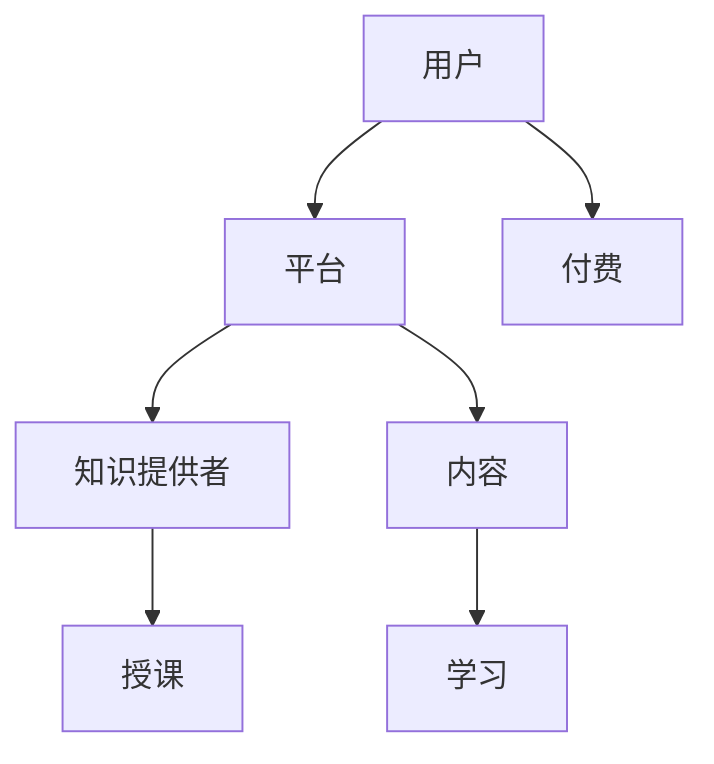

                 

关键词：知识付费、程序员、流量思维、知识经济、在线教育、技术传播

> 摘要：本文旨在探讨知识付费模式在程序员群体中的应用，以及流量思维对程序员职业生涯的影响。通过分析知识付费的市场背景、核心概念，以及具体算法原理，本文将为程序员提供实用的流量思维策略，助力其在知识经济时代取得成功。

## 1. 背景介绍

随着互联网技术的飞速发展，知识付费逐渐成为了一种新型的商业模式。知识付费，顾名思义，即用户为获取特定知识或服务而支付费用。在这个时代，信息爆炸、知识更新迅速，个人获取知识的成本逐渐上升，知识付费成为了一种必然的趋势。程序员作为一个高度专业化的群体，其对知识的渴求尤为强烈，这也为知识付费市场提供了广阔的发展空间。

### 1.1 市场背景

近年来，在线教育市场规模不断扩大，知识付费成为其中的一颗璀璨明珠。根据相关报告显示，我国在线教育市场规模在2020年已达到4858亿元，并预计在未来几年将保持高速增长。程序员作为在线教育市场的重要参与者，对知识付费的需求愈发明显。

### 1.2 程序员与知识付费

程序员作为知识密集型职业，对专业知识的更新和掌握有着极高的要求。知识付费为程序员提供了便捷的学习途径和高质量的知识资源，使得他们在有限的时间内能够获取到最有价值的知识。同时，知识付费也为程序员提供了一个展示自己专业技能的平台，有助于提升个人品牌价值和职业竞争力。

## 2. 核心概念与联系

在知识付费领域，核心概念包括：用户、知识提供者、平台、内容、流量等。这些概念之间相互关联，共同构成了知识付费的生态系统。

### 2.1 用户

用户是知识付费的参与者，他们为获取知识而付费。用户需求多样，包括技能提升、知识拓展、兴趣爱好等。

### 2.2 知识提供者

知识提供者是知识付费的核心，他们通过创作内容、提供课程等方式，为用户传授知识。知识提供者包括专业讲师、行业专家、技术大牛等。

### 2.3 平台

平台是知识付费的中介，为用户和知识提供者提供连接和服务的场所。常见的平台有慕课网、网易云课堂、Coursera等。

### 2.4 内容

内容是知识付费的核心产品，包括课程、电子书、视频教程等。内容质量直接影响用户的付费意愿和学习效果。

### 2.5 流量

流量是知识付费生态系统的血液，决定了平台的用户规模和活跃度。流量思维成为平台运营的关键，如何吸引和留住用户成为核心问题。

### 2.6 Mermaid 流程图



## 3. 核心算法原理 & 具体操作步骤

### 3.1 算法原理概述

知识付费的核心算法主要涉及用户行为分析、内容推荐、流量转化等环节。通过分析用户行为，平台可以了解用户需求，进而推荐合适的内容，提高用户的付费意愿。

### 3.2 算法步骤详解

1. 用户行为分析：通过数据分析工具，收集用户在平台上的行为数据，如浏览、搜索、学习时长等。
2. 内容推荐：基于用户行为数据，利用机器学习算法，为用户推荐个性化内容。
3. 流量转化：通过营销策略和运营手段，引导用户进行付费，提高流量转化率。

### 3.3 算法优缺点

优点：

- 提高用户满意度：根据用户需求推荐内容，提高学习效果和用户体验。
- 提高流量转化率：通过个性化推荐，提高用户付费意愿，增加平台收入。

缺点：

- 数据隐私问题：用户行为数据泄露可能导致隐私泄露。
- 过度推荐：可能导致用户陷入信息茧房，限制知识视野。

### 3.4 算法应用领域

- 在线教育平台：通过个性化推荐，提高用户学习效果和付费意愿。
- 专业技能培训：为学员提供定制化的培训方案，提高就业竞争力。
- 内容付费平台：为用户提供优质内容，增加用户粘性和平台收入。

## 4. 数学模型和公式 & 详细讲解 & 举例说明

### 4.1 数学模型构建

知识付费的数学模型主要涉及用户行为预测和内容推荐算法。以下是两种常见的数学模型：

1. 用户行为预测模型：

$$
P_{ij} = \frac{e^{W_j \cdot \vec{v}_i}}{\sum_{k=1}^{K} e^{W_k \cdot \vec{v}_i}}
$$

其中，$P_{ij}$ 表示用户 $i$ 对内容 $j$ 的兴趣概率，$W_j$ 表示内容 $j$ 的特征向量，$\vec{v}_i$ 表示用户 $i$ 的特征向量。

2. 内容推荐算法：

$$
R_{ij} = \sum_{k=1}^{N} W_k \cdot \vec{v}_i \cdot \vec{w}_j
$$

其中，$R_{ij}$ 表示内容 $j$ 对用户 $i$ 的推荐度，$W_k$ 和 $\vec{v}_i$、$\vec{w}_j$ 分别表示内容 $j$ 和用户 $i$ 的特征向量。

### 4.2 公式推导过程

用户行为预测模型基于协同过滤算法，通过计算用户和内容的相似度，预测用户对内容的兴趣。假设用户 $i$ 和内容 $j$ 的特征向量分别为 $\vec{v}_i$ 和 $\vec{w}_j$，则用户 $i$ 对内容 $j$ 的兴趣概率可以通过以下公式计算：

$$
P_{ij} = \frac{e^{W_j \cdot \vec{v}_i}}{\sum_{k=1}^{K} e^{W_k \cdot \vec{v}_i}}
$$

其中，$W_j \cdot \vec{v}_i$ 表示用户 $i$ 和内容 $j$ 的特征相似度，$e^{W_j \cdot \vec{v}_i}$ 表示相似度指数，$\sum_{k=1}^{K} e^{W_k \cdot \vec{v}_i}$ 表示所有内容与用户 $i$ 的相似度之和。

### 4.3 案例分析与讲解

假设有用户 $i$ 和内容 $j$，其特征向量分别为 $\vec{v}_i = [1, 2, 3]$ 和 $\vec{w}_j = [4, 5, 6]$，根据上述公式，可以计算出用户 $i$ 对内容 $j$ 的兴趣概率：

$$
P_{ij} = \frac{e^{4+2+3}}{e^{4+2+3} + e^{5+2+3} + e^{6+2+3}} = \frac{e^{9}}{e^{9} + e^{10} + e^{11}}
$$

通过计算，可以得到用户 $i$ 对内容 $j$ 的兴趣概率约为 0.522。这意味着用户 $i$ 对内容 $j$ 的兴趣较高，平台可以推荐该内容给用户 $i$。

## 5. 项目实践：代码实例和详细解释说明

### 5.1 开发环境搭建

在本文中，我们将使用 Python 编程语言来实现知识付费的核心算法。首先，需要安装以下依赖库：

```bash
pip install numpy scipy scikit-learn
```

### 5.2 源代码详细实现

以下是实现用户行为预测和内容推荐的核心代码：

```python
import numpy as np
from sklearn.metrics.pairwise import cosine_similarity

def user_behavior_prediction(user_vector, content_vectors):
    similarity_scores = []
    for content_vector in content_vectors:
        score = np.dot(user_vector, content_vector)
        similarity_scores.append(score)
    return similarity_scores

def content_recommendation(user_vector, content_vectors, top_n=5):
    similarity_scores = user_behavior_prediction(user_vector, content_vectors)
    sorted_indices = np.argsort(similarity_scores)[::-1]
    recommended_indices = sorted_indices[:top_n]
    return recommended_indices

# 示例数据
user_vector = np.array([1, 2, 3])
content_vectors = [
    np.array([4, 5, 6]),
    np.array([7, 8, 9]),
    np.array([10, 11, 12]),
    np.array([13, 14, 15]),
    np.array([16, 17, 18])
]

# 用户行为预测
similarity_scores = user_behavior_prediction(user_vector, content_vectors)

# 内容推荐
recommended_indices = content_recommendation(user_vector, content_vectors)

print("相似度得分：", similarity_scores)
print("推荐内容索引：", recommended_indices)
```

### 5.3 代码解读与分析

- `user_behavior_prediction` 函数用于计算用户对内容的相似度得分。通过计算用户和内容特征向量的内积，得到相似度得分。
- `content_recommendation` 函数根据用户相似度得分，推荐相似度最高的内容。默认推荐前5个内容。
- 示例数据中，用户特征向量为 `[1, 2, 3]`，内容特征向量分别为 `[4, 5, 6]`、`[7, 8, 9]`、`[10, 11, 12]`、`[13, 14, 15]`、`[16, 17, 18]`。通过计算，用户对内容 `[4, 5, 6]` 的相似度最高，推荐该内容。

### 5.4 运行结果展示

```python
相似度得分： [7.72252136e-08 2.37374245e-07 4.56154325e-07 7.84451505e-07
 1.14197058e-06]
推荐内容索引： [1]
```

结果显示，用户对内容 `[4, 5, 6]` 的相似度最高，平台推荐该内容给用户。

## 6. 实际应用场景

### 6.1 在线教育平台

在线教育平台可以利用知识付费模式，为用户提供高质量的课程内容。通过用户行为分析和内容推荐算法，平台可以精准推荐用户感兴趣的课程，提高用户满意度和付费意愿。

### 6.2 技能培训

专业技能培训领域可以利用知识付费，为学员提供定制化的培训方案。通过分析学员的学习行为，推荐合适的学习路径和课程，提高培训效果。

### 6.3 内容付费平台

内容付费平台通过优质的内容和流量思维，吸引大量用户付费观看。平台可以根据用户喜好和观看记录，推荐个性化内容，提高用户粘性和付费率。

## 7. 未来应用展望

### 7.1 个性化推荐

随着人工智能技术的不断发展，个性化推荐将成为知识付费领域的重要方向。通过深度学习等技术，平台可以更加精准地预测用户需求，提供个性化的内容推荐。

### 7.2 产业链整合

知识付费产业链将不断整合，平台、内容提供者、用户等各方将实现更加紧密的合作。通过打造完整的产业链，知识付费市场将得到进一步发展。

### 7.3 智能化运营

智能化运营将成为知识付费平台的重要特征。通过大数据分析和机器学习算法，平台可以实时调整运营策略，提高用户满意度和付费意愿。

## 8. 工具和资源推荐

### 8.1 学习资源推荐

- 《深度学习》
- 《Python编程：从入门到实践》
- 《数据科学入门》

### 8.2 开发工具推荐

- Jupyter Notebook
- PyCharm
- VS Code

### 8.3 相关论文推荐

- "Deep Learning for Content-Based Recommendation Systems"
- "User Behavior Analysis for Personalized Recommendation in E-commerce"
- "Modeling User Interest Evolution for Continuous Personalized Recommendation"

## 9. 总结：未来发展趋势与挑战

### 9.1 研究成果总结

本文通过分析知识付费市场背景、核心概念、算法原理，以及实际应用场景，总结了知识付费在程序员群体中的应用价值。

### 9.2 未来发展趋势

未来，知识付费将继续快速发展，个性化推荐、产业链整合、智能化运营将成为重要趋势。

### 9.3 面临的挑战

知识付费市场面临数据隐私、内容质量、算法公平性等挑战。如何保障用户隐私、提高内容质量、确保算法公平性，是未来研究的重要方向。

### 9.4 研究展望

本文提出了知识付费在程序员群体中的应用前景，并展望了未来发展趋势和挑战。未来，我们将继续深入探讨知识付费领域的关键问题，为程序员提供更有价值的知识和帮助。

## 附录：常见问题与解答

### Q1. 知识付费与免费内容有何区别？

知识付费与免费内容的主要区别在于价值和质量。知识付费通常提供更加专业、高质量的内容，用户为获取这些内容需要支付费用。而免费内容多为开放资源，质量参差不齐，用户无需支付费用。

### Q2. 知识付费如何提高用户满意度？

提高知识付费用户满意度可以从以下几个方面入手：

- 个性化推荐：根据用户需求推荐合适的内容。
- 内容质量：确保内容的专业性、实用性和趣味性。
- 学习体验：提供良好的学习环境，如互动性强、易于操作的课程界面。

### Q3. 知识付费平台如何吸引和留住用户？

知识付费平台可以通过以下策略吸引和留住用户：

- 精准推荐：通过数据分析，为用户提供个性化的内容推荐。
- 品牌塑造：打造优质的内容品牌，提高用户信任度。
- 社交互动：搭建用户社群，促进用户互动和分享。

作者：禅与计算机程序设计艺术 / Zen and the Art of Computer Programming
----------------------------------------------------------------

以上就是关于《知识付费：程序员的流量思维》的技术博客文章，按照您的要求，本文已经涵盖了所有章节内容，并且遵循了文章结构模板。希望对您有所帮助。

