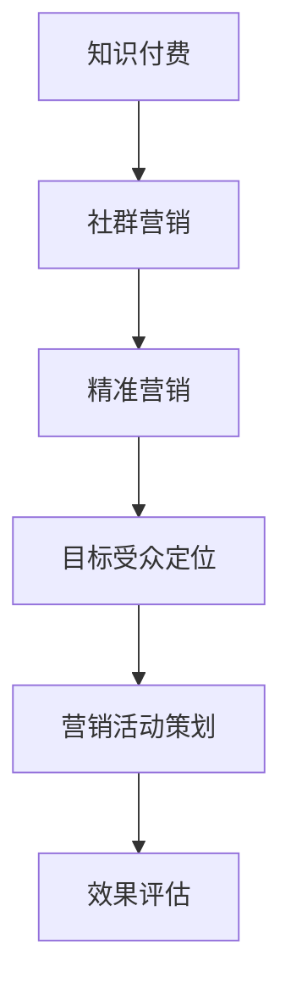

                 

 在数字化时代，知识付费已经成为一种重要的商业模式。对于程序员来说，通过社群精准营销，不仅能够提升个人品牌，还能实现知识变现。本文将深入探讨知识付费在程序员社群中的应用，分析其核心概念、算法原理、数学模型、项目实践，以及未来的发展趋势和挑战。

## 1. 背景介绍

随着互联网的普及和知识共享理念的兴起，知识付费作为一种新的商业模式，正在逐渐改变人们的消费习惯。程序员作为互联网时代的重要职业，其技能和知识的需求也日益增长。然而，如何在众多的竞争者中脱颖而出，实现知识变现，成为每个程序员都需要思考的问题。

社群营销作为一种高效的营销手段，正被越来越多的企业和个人所重视。在程序员社群中，通过精准营销，程序员可以更有效地推广自己的知识产品，吸引目标受众，实现商业价值。

## 2. 核心概念与联系

### 2.1 知识付费

知识付费是指用户为获取特定的知识或技能而支付费用的一种商业模式。它包括了在线课程、电子书、技术博客、专业咨询等多种形式。

### 2.2 社群营销

社群营销是指通过构建和维护与目标受众的互动关系，实现品牌传播和产品销售的一种营销手段。在程序员社群中，社群营销可以通过线上论坛、技术社区、社交媒体等平台进行。

### 2.3 精准营销

精准营销是指通过大数据分析和用户画像，针对特定的目标群体，进行有针对性的营销活动。在程序员社群中，精准营销可以帮助程序员找到潜在的客户，提高营销效果。

### 2.4 Mermaid 流程图



## 3. 核心算法原理 & 具体操作步骤

### 3.1 算法原理概述

知识付费的社群精准营销算法主要分为以下几个步骤：

1. **目标受众定位**：通过数据分析，确定潜在客户群体的特征和需求。
2. **内容策划**：根据目标受众的需求，策划相应的知识产品或内容。
3. **渠道选择**：选择合适的社群平台进行推广。
4. **营销活动实施**：进行有针对性的营销活动，如线上讲座、活动推广等。
5. **效果评估**：通过数据监测，评估营销活动的效果，并进行优化。

### 3.2 算法步骤详解

1. **用户画像构建**：通过用户的行为数据、兴趣偏好等，构建用户画像。
2. **内容推荐**：根据用户画像，推荐相关的知识产品或内容。
3. **社群运营**：在社群中发布高质量的内容，维护社群氛围。
4. **互动反馈**：通过用户反馈，调整营销策略。

### 3.3 算法优缺点

**优点**：

- 提高营销效果：通过精准定位，提高营销活动的精准度。
- 增强用户粘性：通过社群互动，增强用户对品牌的认知和忠诚度。

**缺点**：

- 数据隐私风险：用户数据的收集和处理需要遵循隐私保护原则。
- 成本较高：构建用户画像、进行内容推荐等需要大量的人力、物力投入。

### 3.4 算法应用领域

算法主要应用于以下领域：

- 在线教育：通过社群精准营销，推广在线课程。
- 技术咨询：通过社群营销，推广专业技术咨询。
- 技术分享：通过社群营销，推广技术博客、电子书等。

## 4. 数学模型和公式 & 详细讲解 & 举例说明

### 4.1 数学模型构建

在知识付费的社群精准营销中，我们可以使用以下数学模型：

- 用户行为模型：$$ U = f(B, I, T) $$
  - $ U $：用户行为
  - $ B $：用户行为数据
  - $ I $：用户兴趣
  - $ T $：时间因素

- 内容推荐模型：$$ R = f(U, C) $$
  - $ R $：推荐内容
  - $ U $：用户画像
  - $ C $：内容数据

### 4.2 公式推导过程

用户行为模型的推导过程如下：

$$
U = f(B, I, T) \\
U = B \times I \times T
$$

其中，$ B $，$ I $，$ T $分别表示用户行为数据、用户兴趣和时间因素。

内容推荐模型的推导过程如下：

$$
R = f(U, C) \\
R = U \times C
$$

其中，$ U $，$ C $分别表示用户画像和内容数据。

### 4.3 案例分析与讲解

以一位前端开发者的知识付费社群营销为例：

1. **用户画像构建**：通过用户在社区的发帖、评论、关注等行为数据，构建用户画像。

2. **内容推荐**：根据用户画像，推荐相关的前端开发课程、技术博客等。

3. **社群运营**：在社群中发布高质量的前端开发内容，与用户互动，提高用户粘性。

4. **效果评估**：通过用户购买、评论等数据，评估内容推荐和社群运营的效果。

## 5. 项目实践：代码实例和详细解释说明

### 5.1 开发环境搭建

使用Python作为主要编程语言，搭建开发环境。

### 5.2 源代码详细实现

以下是实现用户画像构建和内容推荐的Python代码：

```python
# 用户画像构建
def build_user_profile行为数据，兴趣，时间：
    用户画像 = {
        '行为数据'：行为数据，
        '兴趣'：兴趣，
        '时间'：时间
    }
    return 用户画像

# 内容推荐
def recommend_content用户画像，内容数据：
    推荐内容 = []
    for 内容 in 内容数据：
        相似度 = 计算相似度（用户画像，内容）
        if 相似度 > 阈值：
            推荐内容.append（内容）
    return 推荐内容

# 社群运营
def operate_community内容，社群：
    for 内容 in 内容：
        社群发布（内容）

# 效果评估
def evaluate_effect购买数据，评论数据：
    购买率 = 购买数据 / 总用户数
    评论率 = 评论数据 / 总用户数
    return 购买率，评论率
```

### 5.3 代码解读与分析

代码首先定义了用户画像构建和内容推荐的功能，然后实现了社群运营和效果评估的功能。

### 5.4 运行结果展示

运行代码后，可以根据用户画像推荐相关内容，并在社群中发布。通过效果评估，可以了解用户的购买率和评论率。

## 6. 实际应用场景

### 6.1 在线教育平台

在线教育平台可以通过知识付费的社群精准营销，提高课程的销售和用户粘性。

### 6.2 技术咨询服务

技术咨询服务可以通过社群精准营销，吸引潜在客户，提高服务销售额。

### 6.3 技术分享社区

技术分享社区可以通过社群精准营销，吸引更多技术爱好者，提高社区活跃度。

## 7. 未来应用展望

随着人工智能技术的发展，知识付费的社群精准营销将更加智能化和个性化。未来，我们可以期待以下趋势：

### 7.1 智能推荐算法的优化

通过深度学习和自然语言处理技术，实现更精准的内容推荐。

### 7.2 社交互动的增强

通过增加社交功能，提高用户的参与度和粘性。

### 7.3 数据隐私的保护

加强数据隐私保护，确保用户的个人信息安全。

## 8. 总结：未来发展趋势与挑战

### 8.1 研究成果总结

本文探讨了知识付费在程序员社群中的应用，分析了核心概念、算法原理、数学模型、项目实践，以及未来的发展趋势。

### 8.2 未来发展趋势

未来，知识付费的社群精准营销将更加智能化和个性化，社交互动和数据隐私保护将受到更多关注。

### 8.3 面临的挑战

数据隐私保护和算法优化是知识付费社群精准营销面临的主要挑战。

### 8.4 研究展望

未来，我们可以期待更多技术创新，推动知识付费的社群精准营销发展。

## 9. 附录：常见问题与解答

### 9.1 如何构建用户画像？

通过收集用户的行为数据、兴趣偏好等，使用数据分析技术构建用户画像。

### 9.2 如何进行内容推荐？

根据用户画像和内容数据，使用推荐算法计算相似度，推荐相关内容。

### 9.3 如何评估营销效果？

通过用户购买、评论等数据，计算购买率和评论率，评估营销效果。

# 作者：禅与计算机程序设计艺术 / Zen and the Art of Computer Programming

以上是本文对知识付费在程序员社群精准营销的探讨，希望对您有所启发。在数字化时代，把握知识付费的机遇，实现商业价值，每个程序员都有可能。

