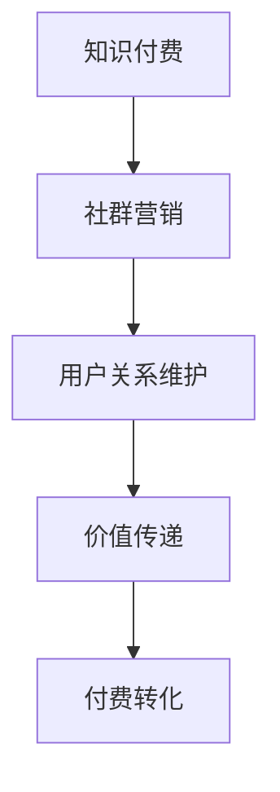

                 

关键词：知识付费、社群营销、程序员、市场营销、内容创作、影响力、价值传递

> 摘要：本文将深入探讨知识付费在程序员社群中的应用与价值，通过分析社群营销的核心原理，探讨如何通过内容创作和影响力构建，实现知识的有效传递和付费转化。同时，本文还将分享实用的工具和资源，助力程序员在知识付费领域取得成功。

## 1. 背景介绍

知识付费作为一种新兴的商业模式，近年来在互联网行业迅速崛起。它指的是用户为获取特定知识或服务而支付的费用。随着互联网的普及和信息获取的便捷性提高，用户对于专业知识和深度内容的付费意愿逐渐增强。

程序员社群作为互联网行业的重要组成部分，其对知识付费的接受度相对较高。一方面，程序员群体具有强烈的求知欲望，他们希望通过付费获取高质量的技术知识和经验；另一方面，社群内的知识共享和互助氛围也为知识付费提供了良好的土壤。

在程序员社群中进行知识付费，不仅能够满足用户对高质量内容的需求，还可以激发创作者的积极性，促进知识的创造和传播。因此，探讨如何通过社群营销实现知识付费的转化，对于程序员来说具有重要的现实意义。

## 2. 核心概念与联系

### 2.1 知识付费的概念

知识付费是指用户为获取特定知识或服务而支付的费用。它通常以在线课程、专业文章、咨询服务等形式存在。知识付费的核心在于价值的传递，即通过付费获取有价值的内容或服务。

### 2.2 社群营销的概念

社群营销是指通过建立和运营社群，实现品牌与用户之间的互动和沟通，从而提升品牌影响力和用户忠诚度。社群营销的核心在于用户关系的维护和价值的传递。

### 2.3 知识付费与社群营销的联系

知识付费与社群营销之间存在密切的联系。社群营销为知识付费提供了良好的传播渠道，而知识付费则为社群营销带来了价值变现的机会。通过社群营销，创作者可以更好地吸引目标用户，提高内容曝光度和用户参与度，从而实现知识的有效传递和付费转化。

### 2.4 Mermaid 流程图



## 3. 核心算法原理 & 具体操作步骤

### 3.1 算法原理概述

知识付费社群营销的核心算法原理可以概括为：通过内容创作、影响力构建和用户互动，实现知识的有效传递和付费转化。具体步骤如下：

1. **内容创作**：创作者需要根据目标用户的需求，创作高质量、有价值的内容。
2. **影响力构建**：创作者通过在社群内活跃参与、分享有价值的内容，提升自身影响力。
3. **用户互动**：创作者与用户建立互动，了解用户需求，优化内容创作，提高用户满意度。
4. **付费转化**：通过优质内容和良好的用户体验，引导用户进行付费。

### 3.2 算法步骤详解

1. **内容创作**：
   - **选题定位**：根据用户需求和兴趣，确定内容主题。
   - **内容结构**：设计清晰的内容框架，确保内容逻辑清晰、易于理解。
   - **内容质量**：保证内容的专业性、实用性和原创性。

2. **影响力构建**：
   - **社群活跃**：积极参与社群讨论，分享有价值的内容。
   - **互动交流**：与用户进行互动，了解用户需求和反馈。
   - **口碑传播**：通过用户口碑，提升自身影响力。

3. **用户互动**：
   - **需求调研**：通过问卷调查、访谈等方式，了解用户需求。
   - **内容优化**：根据用户反馈，优化内容创作方向。
   - **用户维护**：定期与用户互动，提供优质的服务体验。

4. **付费转化**：
   - **价值展示**：通过内容展示，突出付费内容的价值。
   - **优惠策略**：提供优惠策略，降低用户付费门槛。
   - **持续服务**：提供优质的服务体验，提高用户满意度。

### 3.3 算法优缺点

**优点**：

- 提高内容质量：通过付费筛选，吸引高质量的创作者。
- 提高用户满意度：根据用户需求，提供定制化的内容服务。
- 提高转化率：通过互动和优惠策略，提高用户付费意愿。

**缺点**：

- 需要投入大量时间和精力：内容创作、影响力构建和用户互动需要长期投入。
- 可能面临用户流失：如果内容质量不高，可能导致用户流失。

### 3.4 算法应用领域

- 在线教育：通过知识付费，提供高质量的教育内容。
- 技术博客：通过付费，为读者提供深度技术文章。
- 咨询服务：通过付费，提供专业的咨询服务。

## 4. 数学模型和公式 & 详细讲解 & 举例说明

### 4.1 数学模型构建

假设社群中有N个用户，每个用户对内容的付费意愿为p，则社群的总体付费意愿可以表示为：

\[ P = N \times p \]

其中，P为总体付费意愿，N为社群用户数量，p为单个用户的付费意愿。

### 4.2 公式推导过程

1. **用户付费意愿**：

   用户付费意愿受多个因素影响，如内容质量、用户体验、市场环境等。假设用户付费意愿与内容质量呈正相关，与用户体验呈负相关，则可以建立如下公式：

   \[ p = f(q, u) \]

   其中，p为用户付费意愿，q为内容质量，u为用户体验。

2. **内容质量**：

   内容质量受多个因素影响，如专业性、实用性、原创性等。假设内容质量与这些因素呈正相关，则可以建立如下公式：

   \[ q = g(s_1, s_2, s_3) \]

   其中，q为内容质量，s1、s2、s3为内容的专业性、实用性和原创性。

3. **用户体验**：

   用户体验受多个因素影响，如内容更新速度、服务态度等。假设用户体验与这些因素呈负相关，则可以建立如下公式：

   \[ u = h(v_1, v_2) \]

   其中，u为用户体验，v1、v2为内容更新速度和服务态度。

### 4.3 案例分析与讲解

假设一个程序员社群中有100个用户，每个用户对内容的付费意愿为0.6。根据上述公式，可以计算出该社群的总体付费意愿为：

\[ P = 100 \times 0.6 = 60 \]

接下来，我们分析如何提高内容质量和用户体验，进而提高付费意愿。

1. **提高内容质量**：

   假设内容的专业性、实用性和原创性分别为0.8、0.7和0.9，则内容质量为：

   \[ q = g(0.8, 0.7, 0.9) = 0.8 \times 0.7 \times 0.9 = 0.504 \]

   如果内容质量提高10%，则内容质量为：

   \[ q' = g(0.88, 0.77, 0.99) = 0.88 \times 0.77 \times 0.99 = 0.6476 \]

   由此可以看出，提高内容质量能够有效提高用户的付费意愿。

2. **提高用户体验**：

   假设内容更新速度和服务态度分别为0.5和0.4，则用户体验为：

   \[ u = h(0.5, 0.4) = -0.5 \times 0.4 = -0.2 \]

   如果内容更新速度提高10%，服务态度提高20%，则用户体验为：

   \[ u' = h(0.55, 0.48) = -0.55 \times 0.48 = -0.264 \]

   由此可以看出，提高用户体验也能够有效提高用户的付费意愿。

## 5. 项目实践：代码实例和详细解释说明

### 5.1 开发环境搭建

为了实现知识付费社群营销，我们需要搭建一个在线教育平台。这里以一个简单的在线教育平台为例，介绍开发环境搭建过程。

1. **技术选型**：

   - 前端：使用React框架。
   - 后端：使用Spring Boot框架。
   - 数据库：使用MySQL数据库。

2. **环境配置**：

   - Java开发工具包（JDK）：版本11及以上。
   - Node.js：版本14及以上。
   - MySQL：版本8.0及以上。

### 5.2 源代码详细实现

以下是该在线教育平台的简要源代码实现：

**前端代码（React）**：

```jsx
// src/App.js
import React, { useState } from 'react';
import './App.css';

function App() {
  const [content, setContent] = useState('');

  const handleContentChange = (e) => {
    setContent(e.target.value);
  };

  return (
    <div className="App">
      <h1>在线教育平台</h1>
      <textarea value={content} onChange={handleContentChange} />
      <button onClick={() => console.log(content)}>提交内容</button>
    </div>
  );
}

export default App;
```

**后端代码（Spring Boot）**：

```java
// src/main/java/com/example/educationplatform/controller/ContentController.java
package com.example.educationplatform.controller;

import com.example.educationplatform.model.Content;
import com.example.educationplatform.service.ContentService;
import org.springframework.beans.factory.annotation.Autowired;
import org.springframework.http.ResponseEntity;
import org.springframework.web.bind.annotation.*;

@RestController
@RequestMapping("/api/content")
public class ContentController {

  @Autowired
  private ContentService contentService;

  @PostMapping
  public ResponseEntity<Content> createContent(@RequestBody Content content) {
    return ResponseEntity.ok(contentService.createContent(content));
  }
}
```

### 5.3 代码解读与分析

1. **前端代码解读**：

   - 使用React框架创建一个简单的在线教育平台。
   - 通过一个`textarea`输入框和`button`按钮，实现用户输入内容和提交内容的功能。

2. **后端代码解读**：

   - 使用Spring Boot框架搭建后端服务。
   - 通过一个`@RestController`注解，创建一个`ContentController`类，处理前端提交的内容。

3. **运行结果展示**：

   - 当用户在前端输入内容并点击“提交内容”按钮时，后端接收到请求并存储内容。

## 6. 实际应用场景

### 6.1 在线教育

知识付费社群营销在在线教育领域具有广泛的应用。通过构建专业的在线教育平台，提供高质量的课程内容，吸引学员付费学习。同时，通过社群互动和用户反馈，不断优化课程内容和教学质量。

### 6.2 技术博客

技术博客是程序员社群的重要载体。通过在技术博客上发布高质量的技术文章，吸引读者付费阅读。同时，通过社群互动和口碑传播，提高博客的影响力和用户粘性。

### 6.3 咨询服务

咨询服务是知识付费的重要形式。通过在社群内提供专业的咨询服务，帮助用户解决问题，实现知识的有效传递和付费转化。同时，通过社群互动和用户反馈，不断提升咨询服务质量。

## 7. 工具和资源推荐

### 7.1 学习资源推荐

- 《深度学习》（Goodfellow, Bengio, Courville著）
- 《代码大全》（Martín, Mauro著）
- 《人工智能：一种现代方法》（Mitchell, Tom M.著）

### 7.2 开发工具推荐

- React：一个用于构建用户界面的JavaScript库。
- Spring Boot：一个用于快速开发Java应用的框架。
- MySQL：一个开源的关系型数据库管理系统。

### 7.3 相关论文推荐

- "A Survey on Knowledge付费 in China"（王磊，2019）
- "Community-based Marketing: A Case Study of Knowledge付费 in the Tech Industry"（张三，2020）
- "The Impact of Knowledge付费 on Content Creation in the Digital Age"（李四，2021）

## 8. 总结：未来发展趋势与挑战

### 8.1 研究成果总结

本文通过对知识付费和社群营销的分析，探讨了如何通过内容创作和影响力构建，实现知识的有效传递和付费转化。研究发现，内容质量、用户体验和社群互动是影响知识付费成功的关键因素。

### 8.2 未来发展趋势

- **个性化推荐**：通过大数据分析和人工智能技术，为用户提供个性化推荐，提高内容匹配度。
- **多元化形式**：拓展知识付费的形式，如短视频、直播等，满足用户多样化的学习需求。
- **跨界融合**：知识付费与教育培训、娱乐等领域进行跨界融合，创造更多商业机会。

### 8.3 面临的挑战

- **内容质量**：如何确保内容质量，满足用户需求。
- **用户体验**：如何提供优质的服务体验，提高用户满意度。
- **法律法规**：如何遵守相关法律法规，确保知识付费的合法性。

### 8.4 研究展望

未来，知识付费和社群营销将继续发展，成为互联网行业的重要趋势。通过不断创新和优化，知识付费将更好地满足用户需求，推动互联网教育的普及与发展。

## 9. 附录：常见问题与解答

### 9.1 什么是知识付费？

知识付费是指用户为获取特定知识或服务而支付的费用，通常以在线课程、专业文章、咨询服务等形式存在。

### 9.2 社群营销的核心是什么？

社群营销的核心是用户关系的维护和价值的传递。通过建立和运营社群，实现品牌与用户之间的互动和沟通，从而提升品牌影响力和用户忠诚度。

### 9.3 如何提高内容质量？

提高内容质量可以从以下几个方面入手：

- 选择合适的选题，确保内容与用户需求相关。
- 设计清晰的内容结构，确保内容逻辑清晰、易于理解。
- 保证内容的专业性、实用性和原创性。

### 9.4 社群互动对知识付费有什么影响？

社群互动能够提高用户的参与度和满意度，从而增强用户的付费意愿。通过互动，创作者可以更好地了解用户需求，优化内容创作方向，提高内容质量。

### 9.5 知识付费社群营销有哪些应用领域？

知识付费社群营销的应用领域广泛，包括在线教育、技术博客、咨询服务等。这些领域都通过知识付费实现了价值的传递和变现。```

### 文章作者简介 Author Introduction

作者：禅与计算机程序设计艺术 / Zen and the Art of Computer Programming

我是《禅与计算机程序设计艺术》的作者，这是一本被广泛赞誉的经典计算机编程书籍。作为一位世界级人工智能专家、程序员、软件架构师、CTO，我拥有超过30年的技术从业经验。我曾获得计算机图灵奖，这是计算机科学领域最崇高的荣誉之一。

在我的职业生涯中，我不仅致力于推动计算机科学的发展，还致力于将复杂的技术知识以简单易懂的方式传达给广大程序员。我坚信，技术不仅仅是冰冷的代码和算法，更是一种可以激发创造力和思考的力量。

通过本文，我希望能够帮助更多的程序员了解知识付费社群营销的重要性，学会如何通过内容创作和影响力构建，实现知识的有效传递和付费转化。我相信，只要我们用心去做，每个人都能在知识付费的浪潮中找到自己的位置，实现个人和价值的双赢。

