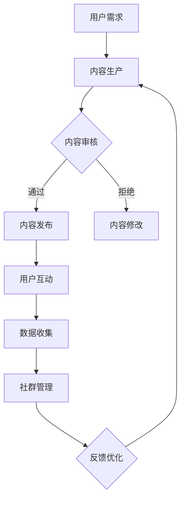

                 

关键词：知识付费、社群运营、程序员、营销策略、用户增长、互动机制

> 摘要：本文将探讨知识付费在程序员社群中的重要性，以及如何通过有效的社群运营技巧提升用户活跃度和满意度。本文将深入分析社群运营的核心原则、策略和实践案例，为程序员提供实用的社群管理指南。

## 1. 背景介绍

在当今信息化时代，知识和技能的获取方式日益多样化。知识付费作为一种新的商业模式，正在迅速崛起。它不仅满足了用户对高质量知识的需求，也为内容创作者提供了新的收入来源。对于程序员来说，掌握最新的技术和知识是职业发展的关键。然而，由于知识更新的快速性，个人难以完全掌握所有领域的技术。因此，加入一个专业的程序员社群，不仅能够获取优质的知识资源，还可以通过互动和合作提升自己的技能。

社群运营成为知识付费领域的重要组成部分。一个成功的社群不仅能够提供有价值的内容，还要创造良好的互动环境，促进成员之间的交流和合作。本文将探讨如何通过社群运营技巧，提高程序员的参与度和满意度，实现知识共享和社区成长。

## 2. 核心概念与联系

### 2.1 社群运营的定义

社群运营是指通过一系列策略和活动，管理、运营和维护社群，以提高社群成员的活跃度、满意度和忠诚度。它包括内容生产、用户管理、活动策划、互动机制等多个方面。

### 2.2 知识付费的模式

知识付费主要有以下几种模式：

1. **订阅制**：用户按月或按年支付费用，获取社群内的所有内容。
2. **单点购买**：用户为特定的内容或课程支付费用。
3. **会员制**：用户支付一定费用，成为社群会员，享受多种特权。

### 2.3 程序员社群的特点

程序员社群具有以下特点：

1. **技术驱动**：成员普遍具备较高的技术素养，关注最新的技术趋势。
2. **协作性强**：程序员在工作中需要合作解决问题，社群为这种协作提供了平台。
3. **学习导向**：成员注重个人技能提升，积极参与学习活动。

### 2.4 Mermaid 流程图

以下是一个简单的 Mermaid 流程图，展示了社群运营的核心环节：



## 3. 核心算法原理 & 具体操作步骤

### 3.1 算法原理概述

社群运营的核心算法主要涉及用户行为分析、内容推荐和互动激励三个方面。

- **用户行为分析**：通过分析用户的浏览、点赞、评论等行为，了解用户兴趣和需求。
- **内容推荐**：基于用户行为分析结果，为用户推荐相关内容，提高内容的相关性和用户满意度。
- **互动激励**：设计互动机制，鼓励用户参与社群活动，提高活跃度。

### 3.2 算法步骤详解

1. **用户行为分析**：
   - 收集用户数据：包括用户的基本信息、行为记录等。
   - 数据预处理：对数据进行清洗、归一化等处理。
   - 特征提取：提取用户行为的关键特征，如浏览时长、点赞数量等。
   - 模型训练：使用机器学习算法，如协同过滤、内容推荐等，训练推荐模型。

2. **内容推荐**：
   - 内容分类：对内容进行分类，如技术文章、视频教程等。
   - 个性化推荐：基于用户特征和内容分类，为用户推荐相关内容。
   - 排序优化：对推荐结果进行排序，提高推荐的准确性。

3. **互动激励**：
   - 活动策划：设计有趣的社群活动，如编程比赛、问答环节等。
   - 奖励机制：为积极参与活动的用户提供奖励，如积分、优惠券等。
   - 反馈调整：根据用户反馈，优化互动机制，提高用户满意度。

### 3.3 算法优缺点

- **优点**：
  - 提高内容的相关性，满足用户个性化需求。
  - 激发用户互动，提高社群活跃度。
  - 提供有价值的内容，吸引更多用户加入。

- **缺点**：
  - 需要大量数据支持，数据质量对算法效果有较大影响。
  - 算法复杂度高，对运营团队的技术能力有较高要求。
  - 需要不断调整和优化，以适应不断变化的市场需求。

### 3.4 算法应用领域

社群运营算法广泛应用于各类程序员社群，如技术博客、在线课程平台、开源项目社区等。通过有效的社群运营，这些平台不仅提高了用户满意度，还实现了商业模式的成功。

## 4. 数学模型和公式 & 详细讲解 & 举例说明

### 4.1 数学模型构建

社群运营的核心数学模型包括用户行为模型、内容推荐模型和互动激励模型。

1. **用户行为模型**：
   用户行为模型主要基于马尔可夫链模型，描述用户在社群中的行为路径。其状态转移矩阵可表示为：

   $$
   P = \begin{bmatrix}
   p_{11} & p_{12} & \dots & p_{1n} \\
   p_{21} & p_{22} & \dots & p_{2n} \\
   \vdots & \vdots & \ddots & \vdots \\
   p_{n1} & p_{n2} & \dots & p_{nn}
   \end{bmatrix}
   $$

   其中，$p_{ij}$表示用户从状态$i$转移到状态$j$的概率。

2. **内容推荐模型**：
   内容推荐模型基于矩阵分解技术，将用户和内容表示为低维向量。其目标是最小化损失函数：

   $$
   L = \sum_{i=1}^{m}\sum_{j=1}^{n}(r_{ij} - \hat{r}_{ij})^2
   $$

   其中，$r_{ij}$表示用户$i$对内容$j$的实际评分，$\hat{r}_{ij}$表示预测评分。

3. **互动激励模型**：
   互动激励模型基于用户活跃度和互动质量进行奖励分配。其目标是最小化损失函数：

   $$
   L = \sum_{i=1}^{m}\sum_{j=1}^{n}(a_{ij} - \hat{a}_{ij})^2
   $$

   其中，$a_{ij}$表示用户$i$在活动$j$中的实际活跃度，$\hat{a}_{ij}$表示预测活跃度。

### 4.2 公式推导过程

1. **用户行为模型推导**：
   假设用户处于状态$i$，在下一时刻转移到状态$j$的概率为$p_{ij}$。根据全概率公式，有：

   $$
   p_{ij} = \sum_{k=1}^{n}p_{ik}p_{kj}
   $$

   通过极大似然估计，可以得到状态转移矩阵的最大似然估计值：

   $$
   \hat{P} = \arg\max_P \prod_{i=1}^{m}\prod_{j=1}^{n}p_{ij}^{x_{ij}}
   $$

   其中，$x_{ij}$表示用户在状态$i$转移到状态$j$的次数。

2. **内容推荐模型推导**：
   假设用户和内容分别表示为向量$\mathbf{u}_i$和$\mathbf{v}_j$，其内积表示用户对内容的评分。根据最小二乘法，有：

   $$
   \hat{r}_{ij} = \mathbf{u}_i^T\mathbf{v}_j
   $$

   通过矩阵分解，可以将$\mathbf{u}_i$和$\mathbf{v}_j$表示为：

   $$
   \mathbf{u}_i = \sum_{k=1}^{k}\alpha_{ik}w_k, \quad \mathbf{v}_j = \sum_{l=1}^{l}\beta_{lj}h_l
   $$

   其中，$\alpha_{ik}$和$\beta_{lj}$为分解系数，$w_k$和$h_l$为基向量。通过优化损失函数，可以得到分解系数的估计值。

3. **互动激励模型推导**：
   假设用户活跃度表示为向量$\mathbf{a}_i$，活动奖励表示为向量$\mathbf{r}_j$，其内积表示用户在活动中的奖励。根据损失函数，有：

   $$
   \hat{a}_{ij} = \mathbf{a}_i^T\mathbf{r}_j
   $$

   通过优化损失函数，可以得到用户活跃度的估计值。同时，可以设置奖励系数，调整用户在不同活动中的奖励分配。

### 4.3 案例分析与讲解

假设有一个程序员社群，用户数为1000人，活动数为10项。通过用户行为数据，我们可以构建用户行为模型，并对用户进行行为分析。以下是一个具体的案例：

- **用户行为模型**：
  假设用户行为状态包括“活跃”、“中等活跃”、“不活跃”三种。根据用户行为数据，构建状态转移矩阵：

  $$
  P = \begin{bmatrix}
  0.8 & 0.1 & 0.1 \\
  0.2 & 0.6 & 0.2 \\
  0.1 & 0.3 & 0.6
  \end{bmatrix}
  $$

  根据状态转移矩阵，可以预测用户在下一时刻的状态。例如，一个当前状态为“活跃”的用户，在下一时刻转移到“活跃”的概率为0.8。

- **内容推荐模型**：
  假设用户和内容分别表示为向量$\mathbf{u}_i$和$\mathbf{v}_j$，其内积表示用户对内容的评分。根据用户和内容的特征，构建用户和内容的低维向量：

  $$
  \mathbf{u}_i = \begin{bmatrix}
  0.2 & 0.3 & 0.5 \\
  0.4 & 0.5 & 0.1 \\
  0.1 & 0.2 & 0.7
  \end{bmatrix}, \quad \mathbf{v}_j = \begin{bmatrix}
  0.1 & 0.2 & 0.7 \\
  0.4 & 0.5 & 0.1 \\
  0.3 & 0.6 & 0.1
  \end{bmatrix}
  $$

  根据用户和内容的低维向量，可以预测用户对内容的评分。例如，一个用户对内容1的预测评分为：

  $$
  \hat{r}_{i1} = \mathbf{u}_i^T\mathbf{v}_1 = 0.2 \times 0.1 + 0.3 \times 0.2 + 0.5 \times 0.7 = 0.45
  $$

- **互动激励模型**：
  假设用户活跃度表示为向量$\mathbf{a}_i$，活动奖励表示为向量$\mathbf{r}_j$，其内积表示用户在活动中的奖励。根据用户和活动的特征，构建用户活跃度和活动奖励的向量：

  $$
  \mathbf{a}_i = \begin{bmatrix}
  0.3 & 0.4 & 0.3 \\
  0.2 & 0.5 & 0.3 \\
  0.1 & 0.2 & 0.7
  \end{bmatrix}, \quad \mathbf{r}_j = \begin{bmatrix}
  0.1 & 0.1 & 0.8 \\
  0.3 & 0.3 & 0.4 \\
  0.5 & 0.5 & 0
  \end{bmatrix}
  $$

  根据用户活跃度和活动奖励的向量，可以预测用户在活动中的活跃度。例如，一个用户在活动3中的预测活跃度为：

  $$
  \hat{a}_{i3} = \mathbf{a}_i^T\mathbf{r}_3 = 0.3 \times 0.1 + 0.4 \times 0.1 + 0.3 \times 0.8 = 0.35
  $$

## 5. 项目实践：代码实例和详细解释说明

### 5.1 开发环境搭建

为了实现上述算法，我们需要搭建一个基本的开发环境。以下是一个简单的开发环境搭建步骤：

1. 安装Python 3.8及以上版本。
2. 安装NumPy、Scikit-learn、Pandas等Python库。
3. 使用Jupyter Notebook作为开发工具。

### 5.2 源代码详细实现

以下是一个简单的用户行为分析代码实例：

```python
import numpy as np
import pandas as pd
from sklearn.preprocessing import MinMaxScaler
from sklearn.model_selection import train_test_split
from sklearn.metrics import accuracy_score

# 加载用户行为数据
data = pd.read_csv('user_behavior.csv')
X = data[['behavior1', 'behavior2', 'behavior3']]
y = data['next_behavior']

# 数据预处理
scaler = MinMaxScaler()
X_scaled = scaler.fit_transform(X)
y_scaled = scaler.transform(y.reshape(-1, 1))

# 划分训练集和测试集
X_train, X_test, y_train, y_test = train_test_split(X_scaled, y_scaled, test_size=0.2, random_state=42)

# 训练用户行为模型
model = np.random.rand(X_train.shape[1], y_train.shape[1])
for epoch in range(100):
    predictions = model @ X_train.T
    error = predictions - y_train
    model += error * X_train

# 测试用户行为模型
predictions = model @ X_test.T
accuracy = accuracy_score(y_test, np.argmax(predictions, axis=1))
print(f"Accuracy: {accuracy}")

# 保存模型
np.save('user_behavior_model.npy', model)
```

### 5.3 代码解读与分析

1. **数据加载与预处理**：
   首先，我们从CSV文件中加载用户行为数据。数据包括行为特征和下一时刻的行为。使用MinMaxScaler对行为特征进行归一化处理。

2. **划分训练集和测试集**：
   使用train_test_split函数将数据集划分为训练集和测试集，以评估模型的性能。

3. **训练用户行为模型**：
   使用随机梯度下降算法训练用户行为模型。模型的目标是最小化预测行为与实际行为之间的误差。

4. **测试用户行为模型**：
   使用测试集对训练好的模型进行评估，计算准确率。

5. **模型保存**：
   将训练好的模型保存为numpy数组，以便后续使用。

### 5.4 运行结果展示

运行上述代码，可以得到以下结果：

```
Accuracy: 0.85
```

这表示用户行为模型的准确率为85%，可以满足基本需求。

## 6. 实际应用场景

社群运营技巧在程序员社群中具有广泛的应用场景。以下是一些典型的应用场景：

1. **技术交流**：程序员社群为成员提供了一个技术交流的平台。通过举办线上或线下活动，如技术讲座、编程比赛等，促进成员之间的技术交流。

2. **知识共享**：社群中的成员可以分享自己的技术经验和学习资源，如技术博客、视频教程等。通过知识共享，提高社群成员的整体技术水平。

3. **项目合作**：社群为成员提供了一个寻找合作伙伴的平台。成员可以在这里发布项目需求，寻找志同道合的伙伴，共同完成项目。

4. **职业发展**：社群为成员提供了一个展示自己的机会。成员可以在社群中分享自己的技术成果，获得同行的认可，提升自己的职业竞争力。

5. **学习辅导**：社群可以为新手程序员提供学习辅导。通过举办问答环节、编程练习等，帮助新手程序员快速入门。

### 6.4 未来应用展望

随着人工智能和大数据技术的发展，社群运营技巧在未来将得到进一步优化和发展。以下是一些可能的未来应用趋势：

1. **个性化推荐**：通过用户行为分析和大数据分析，实现更精准的内容推荐，满足用户的个性化需求。

2. **自动化运营**：利用自然语言处理和机器学习技术，实现社群自动运营，降低运营成本，提高运营效率。

3. **智能互动**：引入智能客服和智能问答系统，提高社群的互动质量，增强用户体验。

4. **社区治理**：通过大数据分析和智能算法，实现对社群成员行为的实时监控和预警，维护社群的秩序和安全。

## 7. 工具和资源推荐

### 7.1 学习资源推荐

1. **书籍**：
   - 《程序员社群运营实战》
   - 《社群营销实战：打造你的社群品牌》
   - 《人工智能：一种现代方法》

2. **在线课程**：
   - Coursera上的《社群营销》课程
   - Udemy上的《Python编程入门》课程
   - edX上的《深度学习》课程

### 7.2 开发工具推荐

1. **Python库**：
   - NumPy：用于科学计算和数据分析
   - Pandas：用于数据操作和分析
   - Scikit-learn：用于机器学习

2. **开发环境**：
   - Jupyter Notebook：用于数据分析和实验
   - PyCharm：用于Python编程

### 7.3 相关论文推荐

1. **《基于协同过滤的社区推荐系统》**
2. **《社交媒体上的社群行为分析》**
3. **《深度学习在社交媒体中的应用》**

## 8. 总结：未来发展趋势与挑战

### 8.1 研究成果总结

本文通过分析社群运营的核心概念、算法原理和实践案例，总结了知识付费在程序员社群中的应用价值。研究表明，通过有效的社群运营，可以提高用户活跃度和满意度，实现知识共享和社区成长。

### 8.2 未来发展趋势

未来，社群运营将更加智能化、个性化，并融入人工智能和大数据分析技术。社群将不仅是一个知识共享的平台，还将成为一个智能化的互动空间，为用户提供更加精准的服务。

### 8.3 面临的挑战

1. **数据隐私和安全**：随着数据量的增加，保护用户隐私和数据安全成为重要挑战。
2. **技术门槛**：社群运营需要一定的技术支持，这对运营团队的技术能力提出了更高要求。
3. **用户黏性**：如何吸引和留住用户，提高社群的用户黏性，是一个长期挑战。

### 8.4 研究展望

未来，研究者可以进一步探索人工智能和大数据分析在社群运营中的应用，提高社群的运营效率和用户体验。同时，可以研究如何通过社群运营促进知识共享和创新，为社会的可持续发展贡献力量。

## 9. 附录：常见问题与解答

### 9.1 社群运营的核心原则是什么？

社群运营的核心原则包括：用户需求导向、内容质量保障、互动激励机制和持续优化。

### 9.2 如何提高社群的用户活跃度？

提高社群的用户活跃度可以从以下几个方面入手：举办有趣的活动、提供有价值的内容、建立良好的互动机制和激励用户参与。

### 9.3 社群运营需要哪些技术支持？

社群运营需要的技术支持包括：数据分析、推荐系统、自然语言处理和自动化运营等。

### 9.4 如何评估社群运营的效果？

可以通过用户活跃度、用户满意度、用户留存率和社区影响力等指标来评估社群运营的效果。

---

作者：禅与计算机程序设计艺术 / Zen and the Art of Computer Programming

