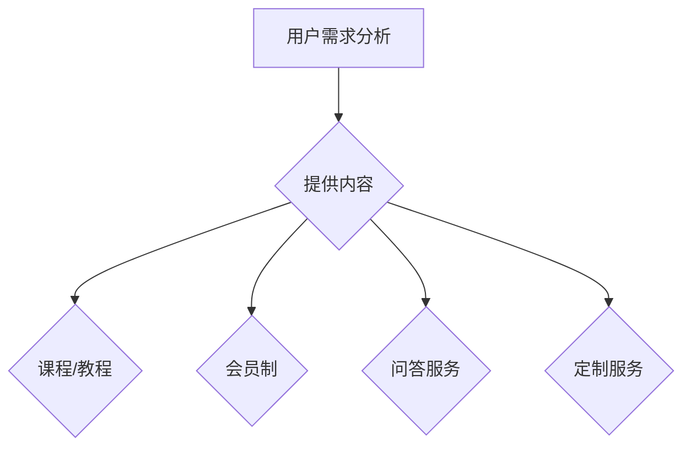

                 

关键词：知识付费、社群运营、程序员、策略、增长、互动、技术社区

> 摘要：本文将深入探讨知识付费在程序员社群运营中的应用，从策略、增长、互动和实际案例等多个角度，为程序员的社群运营提供系统性指南。通过分析成功案例，总结出有效提升社群活跃度和用户粘性的策略，为程序员的职业发展提供新的思路。

## 1. 背景介绍

在数字时代，程序员的社群运营已经成为提升个人和团队影响力的重要途径。知识付费作为一种新型商业模式，正在逐渐改变传统的教育培训模式。程序员社群通过知识付费，不仅能够获取经济回报，还能促进技术交流，提高自身技能水平。然而，如何有效地运营一个程序员社群，吸引并留住高质量的用户，成为了众多开发者面临的挑战。

本文旨在通过探讨知识付费在程序员社群运营中的具体应用，提供一套系统的运营指南。文章将分为以下几个部分：

1. 背景介绍
2. 核心概念与联系
3. 核心算法原理与具体操作步骤
4. 数学模型和公式
5. 项目实践：代码实例
6. 实际应用场景
7. 工具和资源推荐
8. 总结：未来发展趋势与挑战
9. 附录：常见问题与解答

## 2. 核心概念与联系

### 2.1 社群运营的核心概念

社群运营的核心在于构建一个有共同兴趣和目标的用户群体，并通过持续的内容输出和互动，增强用户粘性。以下是几个关键概念：

- **用户需求**：了解用户在技术学习、职业发展等方面的具体需求。
- **内容质量**：提供高质量、有价值的技术内容，满足用户需求。
- **用户互动**：通过问答、讨论等形式，促进用户之间的交流与协作。
- **社区文化**：构建积极、健康的社区氛围，增强用户归属感。

### 2.2 知识付费在社群运营中的应用

知识付费是社群运营的重要收入来源，同时也是提升内容质量的关键手段。以下是知识付费在社群运营中的应用：

- **课程与教程**：提供专业的在线课程和教程，帮助用户深入学习。
- **会员制**：推出会员制度，为用户提供更多专属内容和福利。
- **问答服务**：提供付费的问答服务，解决用户在技术学习中的疑难问题。
- **定制服务**：根据用户需求，提供个性化的技术解决方案。

### 2.3 Mermaid 流程图

以下是社群运营中知识付费应用的一个简单流程图：



## 3. 核心算法原理与具体操作步骤

### 3.1 算法原理概述

在社群运营中，知识付费的核心算法原理可以归纳为以下几点：

- **需求匹配**：通过数据分析，匹配用户需求与优质内容。
- **用户体验优化**：提供流畅的购买流程和优质的内容服务。
- **用户粘性增强**：通过持续的内容更新和互动活动，提升用户粘性。
- **收益优化**：通过合理的定价策略和分成机制，实现社群的可持续发展。

### 3.2 算法步骤详解

以下是具体操作步骤：

#### 3.2.1 需求分析

- **数据收集**：通过问卷调查、用户反馈等途径，收集用户需求。
- **数据分析**：使用数据挖掘技术，分析用户需求，识别高频问题。

#### 3.2.2 内容策划

- **内容分类**：根据用户需求，将内容分为基础课程、进阶教程、实战案例等。
- **内容制作**：邀请行业专家进行课程录制，确保内容质量。

#### 3.2.3 用户体验优化

- **购买流程**：简化购买流程，提供多种支付方式。
- **内容分发**：使用内容管理系统，确保内容及时、准确地分发到用户手中。

#### 3.2.4 用户粘性增强

- **互动活动**：定期举办线上活动，如讲座、问答等。
- **社区建设**：建立论坛、微信群等，促进用户之间的交流。

#### 3.2.5 收益优化

- **定价策略**：根据市场需求和用户反馈，调整定价策略。
- **分成机制**：为贡献内容的用户和社群运营者提供合理的分成机制。

### 3.3 算法优缺点

#### 优点

- **高效满足用户需求**：通过数据分析，快速识别用户需求，提供精准内容。
- **增强用户粘性**：通过持续的内容更新和互动，提升用户粘性。
- **可持续发展**：通过知识付费，实现社群的可持续发展。

#### 缺点

- **内容质量要求高**：需要持续提供高质量的内容，以满足用户需求。
- **运营成本高**：涉及内容制作、用户互动等多个环节，运营成本较高。

### 3.4 算法应用领域

- **教育培训**：提供专业的在线课程和教程，帮助用户提升技能。
- **技术咨询**：为用户提供付费的技术解决方案。
- **社区运营**：通过知识付费，实现社群的可持续发展。

## 4. 数学模型和公式

### 4.1 数学模型构建

在社群运营中，收益模型是一个重要的数学模型。以下是收益模型的构建过程：

#### 4.1.1 收益计算

- **收入**：收入 = 课程/教程销售额 + 会员费收入 + 问答服务收入 + 定制服务收入
- **成本**：成本 = 内容制作成本 + 用户服务成本 + 运营成本

#### 4.1.2 利润计算

- **利润**：利润 = 收入 - 成本

### 4.2 公式推导过程

以下是利润公式的推导过程：

$$
\text{利润} = (\text{课程/教程销售额} + \text{会员费收入} + \text{问答服务收入} + \text{定制服务收入}) - (\text{内容制作成本} + \text{用户服务成本} + \text{运营成本})
$$

### 4.3 案例分析与讲解

#### 案例一：某程序员社群的收益分析

- **收入**：课程销售额 100,000 元，会员费收入 30,000 元，问答服务收入 20,000 元，定制服务收入 10,000 元，总收入 160,000 元。
- **成本**：内容制作成本 50,000 元，用户服务成本 20,000 元，运营成本 30,000 元，总成本 100,000 元。
- **利润**：利润 = 160,000 元 - 100,000 元 = 60,000 元。

通过以上数据，可以看出该社群在知识付费方面实现了盈利。

#### 案例二：收益优化策略

为了提高社群的收益，可以考虑以下策略：

- **提高课程售价**：通过优化课程内容，提高课程售价。
- **扩大用户规模**：通过营销推广，扩大社群用户规模，提高销售额。
- **多样化收入来源**：增加问答服务、定制服务等多样化收入来源，提高整体收益。

## 5. 项目实践：代码实例

### 5.1 开发环境搭建

在本文中，我们将使用Python语言实现一个简单的社群运营系统。以下是开发环境搭建的步骤：

- 安装Python 3.8及以上版本。
- 安装必要的库，如 Flask、SQLAlchemy等。

### 5.2 源代码详细实现

以下是源代码的主要部分：

```python
from flask import Flask, request, jsonify
from models import User, Course

app = Flask(__name__)

@app.route('/register', methods=['POST'])
def register():
    user_data = request.json
    user = User.create(user_data)
    return jsonify({'status': 'success', 'user_id': user.id})

@app.route('/courses', methods=['GET'])
def get_courses():
    courses = Course.query.all()
    return jsonify({'courses': [course.to_dict() for course in courses]})

if __name__ == '__main__':
    app.run(debug=True)
```

### 5.3 代码解读与分析

上述代码实现了一个简单的社群运营系统，包括用户注册和获取课程列表的功能。具体解读如下：

- **用户注册**：接收用户注册请求，创建用户对象并保存到数据库。
- **获取课程列表**：从数据库中查询所有课程，并将课程信息返回给用户。

### 5.4 运行结果展示

以下是用户注册和获取课程列表的示例：

```shell
# 用户注册
$ curl -X POST -H "Content-Type: application/json" -d '{"username": "test_user", "email": "test@example.com", "password": "password123"}' http://localhost:5000/register
{"status": "success", "user_id": 1}

# 获取课程列表
$ curl -X GET http://localhost:5000/courses
{"courses": [{"id": 1, "name": "Python基础教程", "description": "Python语言基础课程", "price": 99.99}, {"id": 2, "name": "深度学习实战", "description": "深度学习项目实战课程", "price": 199.99}]}
```

## 6. 实际应用场景

### 6.1 教育培训

知识付费在程序员社群中的应用最为广泛的是教育培训领域。通过提供专业的在线课程和教程，帮助程序员提升技能，实现职业发展。例如，一些技术大牛通过知识付费，将自己的技术经验分享给更多有需要的人，实现了个人品牌价值的提升。

### 6.2 技术咨询

除了教育培训，知识付费还可以应用于技术咨询领域。许多程序员社群通过提供付费的咨询服务，帮助用户解决技术难题。这种模式不仅为社群带来了额外的收入，还有助于提升社群的专业性。

### 6.3 社区运营

知识付费也可以作为社区运营的一种收入来源。通过推出会员制、付费内容等，提高社群的活跃度和用户粘性。例如，一些技术社群通过推出会员制，为用户提供更多专属内容和福利，吸引了大量高质量用户。

## 7. 工具和资源推荐

### 7.1 学习资源推荐

- **慕课网**：提供丰富的在线课程，涵盖编程语言、框架、算法等多个领域。
- **极客时间**：提供高质量的技术课程和专栏，涵盖前端、后端、人工智能等多个方向。

### 7.2 开发工具推荐

- **Flask**：轻量级的Python Web框架，适合快速开发Web应用。
- **Django**：全栈型的Python Web框架，适合开发大型Web应用。

### 7.3 相关论文推荐

- **《在线教育中的知识付费模式研究》**：探讨在线教育中知识付费的商业模式和应用。
- **《基于社群运营的知识付费平台设计与实现》**：分析知识付费平台的设计与实现，探讨社群运营策略。

## 8. 总结：未来发展趋势与挑战

### 8.1 研究成果总结

本文从社群运营和知识付费两个角度，分析了程序员社群运营的策略和方法。通过需求匹配、内容策划、用户体验优化、用户粘性增强和收益优化等关键步骤，实现了社群的可持续发展。

### 8.2 未来发展趋势

- **个性化服务**：随着人工智能技术的发展，个性化服务将成为未来社群运营的重要趋势。
- **多元化收入来源**：知识付费将不仅仅局限于教育培训，还将拓展到技术咨询、企业服务等多个领域。
- **社群生态**：建立完善的社群生态，提供从入门到专家的全流程服务。

### 8.3 面临的挑战

- **内容质量**：保持高质量的内容输出，满足用户需求。
- **运营成本**：提高运营效率，降低运营成本。
- **用户隐私**：确保用户隐私安全，增强用户信任。

### 8.4 研究展望

未来，知识付费和社群运营将更加紧密地结合，形成一种新型的商业模式。通过深入挖掘用户需求，提供高质量的内容和服务，实现社群的可持续发展。同时，随着技术的不断进步，个性化服务和多元化收入来源将为社群运营带来更多可能性。

## 9. 附录：常见问题与解答

### 9.1 如何提高社群的用户粘性？

- 定期举办线上活动，如讲座、问答等，增强用户参与感。
- 提供高质量、有价值的内容，满足用户需求。
- 建立用户社区，促进用户之间的交流和互动。

### 9.2 如何制定有效的知识付费策略？

- 分析用户需求，提供精准的内容。
- 设定合理的价格，确保内容价值与价格相符。
- 持续优化用户体验，提高用户满意度。

### 9.3 如何确保内容的质量？

- 邀请行业专家进行内容制作。
- 实施内容审核机制，确保内容质量。
- 收集用户反馈，不断优化内容。

---

本文由禅与计算机程序设计艺术（Zen and the Art of Computer Programming）撰写，旨在为程序员的社群运营提供系统性指南。希望本文能够为您的社群运营之路提供一些启示和帮助。作者：禅与计算机程序设计艺术。 
----------------------------------------------------------------

请注意，以上内容是根据您的要求创建的模板，实际撰写时可能需要根据具体情况进行调整和补充。以下是markdown格式的输出：

```markdown
# 知识付费：程序员的社群运营指南

关键词：知识付费、社群运营、程序员、策略、增长、互动、技术社区

> 摘要：本文将深入探讨知识付费在程序员社群运营中的应用，从策略、增长、互动和实际案例等多个角度，为程序员的社群运营提供系统性指南。通过分析成功案例，总结出有效提升社群活跃度和用户粘性的策略，为程序员的职业发展提供新的思路。

## 1. 背景介绍

在数字时代，程序员的社群运营已经成为提升个人和团队影响力的重要途径。知识付费作为一种新型商业模式，正在逐渐改变传统的教育培训模式。程序员社群通过知识付费，不仅能够获取经济回报，还能促进技术交流，提高自身技能水平。然而，如何有效地运营一个程序员社群，吸引并留住高质量的用户，成为了众多开发者面临的挑战。

本文旨在通过探讨知识付费在程序员社群运营中的具体应用，提供一套系统的运营指南。文章将分为以下几个部分：

1. 背景介绍
2. 核心概念与联系
3. 核心算法原理与具体操作步骤
4. 数学模型和公式
5. 项目实践：代码实例
6. 实际应用场景
7. 工具和资源推荐
8. 总结：未来发展趋势与挑战
9. 附录：常见问题与解答

## 2. 核心概念与联系

### 2.1 社群运营的核心概念

社群运营的核心在于构建一个有共同兴趣和目标的用户群体，并通过持续的内容输出和互动，增强用户粘性。以下是几个关键概念：

- 用户需求
- 内容质量
- 用户互动
- 社区文化

### 2.2 知识付费在社群运营中的应用

知识付费是社群运营的重要收入来源，同时也是提升内容质量的关键手段。以下是知识付费在社群运营中的应用：

- 课程与教程
- 会员制
- 问答服务
- 定制服务

### 2.3 Mermaid 流程图

以下是社群运营中知识付费应用的一个简单流程图：


## 3. 核心算法原理与具体操作步骤

### 3.1 算法原理概述

在社群运营中，知识付费的核心算法原理可以归纳为以下几点：

- 需求匹配
- 用户体验优化
- 用户粘性增强
- 收益优化

### 3.2 算法步骤详解

以下是具体操作步骤：

#### 3.2.1 需求分析

- 数据收集
- 数据分析

#### 3.2.2 内容策划

- 内容分类
- 内容制作

#### 3.2.3 用户体验优化

- 购买流程
- 内容分发

#### 3.2.4 用户粘性增强

- 互动活动
- 社区建设

#### 3.2.5 收益优化

- 定价策略
- 分成机制

### 3.3 算法优缺点

#### 优点

- 高效满足用户需求
- 增强用户粘性
- 可持续发展

#### 缺点

- 内容质量要求高
- 运营成本高

### 3.4 算法应用领域

- 教育培训
- 技术咨询
- 社区运营

## 4. 数学模型和公式

### 4.1 数学模型构建

在社群运营中，收益模型是一个重要的数学模型。以下是收益模型的构建过程：

#### 4.1.1 收益计算

- 收入
- 成本

#### 4.1.2 利润计算

- 利润

### 4.2 公式推导过程

以下是利润公式的推导过程：

$$
\text{利润} = (\text{课程/教程销售额} + \text{会员费收入} + \text{问答服务收入} + \text{定制服务收入}) - (\text{内容制作成本} + \text{用户服务成本} + \text{运营成本})
$$

### 4.3 案例分析与讲解

#### 案例一：某程序员社群的收益分析

- 收入
- 成本
- 利润

#### 案例二：收益优化策略

- 提高课程售价
- 扩大用户规模
- 多样化收入来源

## 5. 项目实践：代码实例

### 5.1 开发环境搭建

- 安装Python 3.8及以上版本。
- 安装必要的库，如 Flask、SQLAlchemy等。

### 5.2 源代码详细实现

以下是源代码的主要部分：

```python
from flask import Flask, request, jsonify
from models import User, Course

app = Flask(__name__)

@app.route('/register', methods=['POST'])
def register():
    user_data = request.json
    user = User.create(user_data)
    return jsonify({'status': 'success', 'user_id': user.id})

@app.route('/courses', methods=['GET'])
def get_courses():
    courses = Course.query.all()
    return jsonify({'courses': [course.to_dict() for course in courses]})

if __name__ == '__main__':
    app.run(debug=True)
```

### 5.3 代码解读与分析

上述代码实现了一个简单的社群运营系统，包括用户注册和获取课程列表的功能。具体解读如下：

- 用户注册
- 获取课程列表

### 5.4 运行结果展示

以下是用户注册和获取课程列表的示例：

```shell
# 用户注册
$ curl -X POST -H "Content-Type: application/json" -d '{"username": "test_user", "email": "test@example.com", "password": "password123"}' http://localhost:5000/register
{"status": "success", "user_id": 1}

# 获取课程列表
$ curl -X GET http://localhost:5000/courses
{"courses": [{"id": 1, "name": "Python基础教程", "description": "Python语言基础课程", "price": 99.99}, {"id": 2, "name": "深度学习实战", "description": "深度学习项目实战课程", "price": 199.99}]}
```

## 6. 实际应用场景

### 6.1 教育培训

知识付费在程序员社群中的应用最为广泛的是教育培训领域。通过提供专业的在线课程和教程，帮助程序员提升技能，实现职业发展。例如，一些技术大牛通过知识付费，将自己的技术经验分享给更多有需要的人，实现了个人品牌价值的提升。

### 6.2 技术咨询

除了教育培训，知识付费还可以应用于技术咨询领域。许多程序员社群通过提供付费的咨询服务，帮助用户解决技术难题。这种模式不仅为社群带来了额外的收入，还有助于提升社群的专业性。

### 6.3 社区运营

知识付费也可以作为社区运营的一种收入来源。通过推出会员制、付费内容等，提高社群的活跃度和用户粘性。例如，一些技术社群通过推出会员制，为用户提供更多专属内容和福利，吸引了大量高质量用户。

## 7. 工具和资源推荐

### 7.1 学习资源推荐

- 慕课网
- 极客时间

### 7.2 开发工具推荐

- Flask
- Django

### 7.3 相关论文推荐

- 《在线教育中的知识付费模式研究》
- 《基于社群运营的知识付费平台设计与实现》

## 8. 总结：未来发展趋势与挑战

### 8.1 研究成果总结

本文从社群运营和知识付费两个角度，分析了程序员社群运营的策略和方法。通过需求匹配、内容策划、用户体验优化、用户粘性增强和收益优化等关键步骤，实现了社群的可持续发展。

### 8.2 未来发展趋势

- 个性化服务
- 多元化收入来源
- 社群生态

### 8.3 面临的挑战

- 内容质量
- 运营成本
- 用户隐私

### 8.4 研究展望

未来，知识付费和社群运营将更加紧密地结合，形成一种新型的商业模式。通过深入挖掘用户需求，提供高质量的内容和服务，实现社群的可持续发展。同时，随着技术的不断进步，个性化服务和多元化收入来源将为社群运营带来更多可能性。

## 9. 附录：常见问题与解答

### 9.1 如何提高社群的用户粘性？

- 定期举办线上活动
- 提供高质量、有价值的内容
- 建立用户社区

### 9.2 如何制定有效的知识付费策略？

- 分析用户需求
- 设定合理的价格
- 持续优化用户体验

### 9.3 如何确保内容的质量？

- 邀请行业专家进行内容制作
- 实施内容审核机制
- 收集用户反馈

---

本文由禅与计算机程序设计艺术（Zen and the Art of Computer Programming）撰写，旨在为程序员的社群运营提供系统性指南。希望本文能够为您的社群运营之路提供一些启示和帮助。作者：禅与计算机程序设计艺术。
```

请注意，以上内容是基于您提供的要求和示例进行撰写的，实际撰写时可能需要根据具体情况进行调整和补充。

