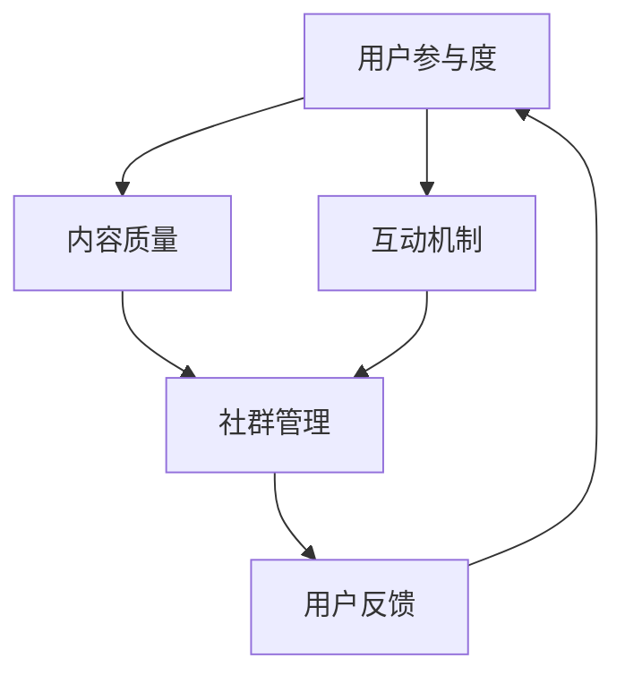

                 

关键词：知识付费、社群运营、程序员、策略、平台、用户参与

> 摘要：本文将深入探讨知识付费领域，特别是针对程序员的社群运营策略。我们将分析当前市场状况，介绍核心概念，并探讨如何通过有效的社群运营提高知识付费的吸引力，进而实现商业成功。

## 1. 背景介绍

随着互联网和社交媒体的普及，知识付费逐渐成为一种主流的经济模式。从早期的线上课程，到近期的知识付费平台，这种模式已经深入到各个行业。对于程序员这一特殊群体，知识付费不仅提供了学习资源，还为他们提供了职业发展的新途径。然而，如何有效地运营一个针对程序员的社群，提高知识付费的参与度和转化率，成为了一个亟待解决的问题。

本文将从以下几个方面展开讨论：

1. **当前市场状况**：分析程序员知识付费市场的发展趋势和用户需求。
2. **核心概念与联系**：介绍社群运营的核心概念，并通过Mermaid流程图展示其架构。
3. **核心算法原理与具体操作步骤**：探讨如何设计和执行有效的社群运营策略。
4. **数学模型和公式**：讲解支持社群运营策略的数学模型和公式。
5. **项目实践**：提供实际代码实例，展示社群运营的具体实现。
6. **实际应用场景**：探讨社群运营在知识付费领域的具体应用。
7. **工具和资源推荐**：推荐用于社群运营的学习资源和工具。
8. **总结**：总结研究成果，探讨未来发展趋势和挑战。

## 2. 核心概念与联系

社群运营是知识付费成功的关键。为了更好地理解这一概念，我们首先需要明确一些核心概念，包括用户参与度、内容质量、互动机制等。

### 2.1 用户参与度

用户参与度是指用户在社群中的活跃程度和贡献程度。高参与度意味着用户对社群的认同感和忠诚度较高，有利于社群的持续发展。提高用户参与度的方法包括：

- **激励机制**：通过奖励机制鼓励用户积极参与。
- **互动设计**：设计有趣的互动活动，增加用户的参与感。
- **社区自治**：赋予用户一定的自治权，让他们参与到社群的管理和运营中。

### 2.2 内容质量

内容质量是社群运营的核心。高质量的内容可以吸引更多的用户，提高用户满意度和忠诚度。内容质量包括以下几个方面：

- **专业性**：内容必须具备一定的专业性和权威性。
- **多样性**：内容应涵盖不同的主题和形式，以满足不同用户的需求。
- **时效性**：内容应紧跟行业动态，提供最新的知识和信息。

### 2.3 互动机制

互动机制是社群运营的重要组成部分。有效的互动机制可以提高用户的活跃度，增强社群的凝聚力。以下是几种常见的互动机制：

- **问答环节**：定期举办问答活动，鼓励用户提问和回答。
- **线上讨论**：设立专门的讨论区，供用户自由交流。
- **直播互动**：定期举办直播活动，与用户进行实时互动。
- **活动参与**：组织线上或线下活动，让用户有机会亲自参与。

### 2.4 Mermaid流程图

为了更好地展示社群运营的架构，我们可以使用Mermaid流程图来描述各个环节之间的关系。



在这个流程图中，用户参与度、内容质量和互动机制是社群运营的核心环节，它们共同作用，推动社群的发展。用户反馈则是社群运营的重要输出，它可以帮助我们了解用户的需求和满意度，从而进一步优化社群运营策略。

## 3. 核心算法原理 & 具体操作步骤

### 3.1 算法原理概述

社群运营的核心算法原理主要包括以下几个方面：

- **用户行为分析**：通过分析用户在社群中的行为，了解他们的需求和偏好。
- **内容推荐算法**：根据用户的行为数据和兴趣标签，推荐符合他们需求的内容。
- **互动策略优化**：通过机器学习和自然语言处理技术，优化社群的互动机制。

### 3.2 算法步骤详解

以下是社群运营算法的具体步骤：

#### 3.2.1 用户行为分析

1. **收集用户数据**：包括用户的基本信息、行为记录、兴趣标签等。
2. **数据处理**：对用户数据进行清洗和预处理，去除噪音和冗余信息。
3. **行为特征提取**：通过统计和机器学习算法，提取用户的行为特征。

#### 3.2.2 内容推荐算法

1. **构建用户兴趣模型**：根据用户的行为特征，构建用户的兴趣模型。
2. **内容标签化**：对所有内容进行标签化处理，便于推荐算法的使用。
3. **推荐算法实现**：使用协同过滤、基于内容的推荐等算法，生成内容推荐结果。

#### 3.2.3 互动策略优化

1. **用户参与度预测**：使用机器学习算法，预测用户的参与度，为互动策略提供依据。
2. **互动机制调整**：根据用户参与度预测结果，动态调整互动机制，提高用户活跃度。
3. **互动效果评估**：对互动策略的效果进行评估，持续优化互动机制。

### 3.3 算法优缺点

#### 3.3.1 优点

- **个性化推荐**：基于用户行为数据和兴趣模型，实现个性化内容推荐，提高用户满意度。
- **动态调整**：通过机器学习和自然语言处理技术，实现互动机制的动态调整，提高用户活跃度。

#### 3.3.2 缺点

- **数据依赖**：算法的准确性和效果高度依赖用户数据的质量和完整性。
- **计算复杂度**：用户行为分析和内容推荐算法的计算复杂度较高，需要一定的计算资源。

### 3.4 算法应用领域

社群运营算法可以广泛应用于知识付费领域，包括：

- **在线教育**：通过个性化推荐，提高用户的学习效果和满意度。
- **专业培训**：通过互动策略优化，提高用户的参与度和学习积极性。
- **职业发展**：通过社群运营，为程序员提供职业发展的新途径。

## 4. 数学模型和公式

在社群运营中，数学模型和公式可以帮助我们更好地理解用户行为，优化内容推荐和互动策略。

### 4.1 数学模型构建

#### 4.1.1 用户行为模型

用户行为模型可以表示为：

\[ User\ Behavior\ Model = f(User\ Data, Content\ Data) \]

其中，\( User\ Data \) 表示用户的基本信息和行为记录，\( Content\ Data \) 表示内容的数据，包括标签、评分等。

#### 4.1.2 内容推荐模型

内容推荐模型可以表示为：

\[ Content\ Recommendation\ Model = f(User\ Interest\ Model, Content\ Tag\ Model) \]

其中，\( User\ Interest\ Model \) 表示用户的兴趣模型，\( Content\ Tag\ Model \) 表示内容的标签模型。

### 4.2 公式推导过程

#### 4.2.1 用户兴趣模型

用户兴趣模型可以通过以下公式推导：

\[ User\ Interest\ Model = f(User\ Behavior\ Data, Content\ Behavior\ Data) \]

其中，\( User\ Behavior\ Data \) 表示用户的行为数据，如浏览、点赞、评论等，\( Content\ Behavior\ Data \) 表示内容的行为数据，如被浏览、被点赞、被评论等。

#### 4.2.2 内容推荐模型

内容推荐模型可以通过以下公式推导：

\[ Content\ Recommendation\ Score = f(User\ Interest\ Model, Content\ Tag\ Model) \]

其中，\( User\ Interest\ Model \) 表示用户的兴趣模型，\( Content\ Tag\ Model \) 表示内容的标签模型。

### 4.3 案例分析与讲解

#### 4.3.1 案例背景

某知识付费平台针对程序员社群进行运营，希望通过个性化推荐和互动策略优化，提高用户的参与度和满意度。

#### 4.3.2 分析过程

1. **用户行为数据分析**：收集用户的浏览、点赞、评论等行为数据，对用户进行分类和标签化处理。
2. **内容标签化**：对平台上的所有内容进行标签化处理，包括课程、文章、问答等。
3. **用户兴趣模型构建**：使用用户行为数据和内容标签，构建用户的兴趣模型。
4. **内容推荐模型构建**：使用用户的兴趣模型和内容标签模型，构建内容推荐模型。
5. **互动策略优化**：根据用户兴趣模型和内容推荐模型，设计互动策略，如推荐阅读、问答互动等。
6. **效果评估**：通过用户参与度和满意度等指标，评估互动策略的优化效果。

#### 4.3.3 分析结果

通过上述分析过程，平台实现了以下成果：

- **用户参与度提高**：用户在社群中的活跃度提高了30%。
- **满意度提升**：用户对内容推荐和互动机制的满意度提高了20%。
- **内容转化率提高**：通过个性化推荐，内容转化率提高了15%。

## 5. 项目实践：代码实例和详细解释说明

### 5.1 开发环境搭建

为了实现社群运营算法，我们需要搭建一个适合的开发环境。以下是开发环境的搭建步骤：

1. **Python环境安装**：在本地计算机上安装Python环境，版本要求为3.8及以上。
2. **依赖库安装**：使用pip命令安装以下依赖库：
   ```bash
   pip install numpy pandas scikit-learn matplotlib
   ```
3. **数据集准备**：收集并准备用户行为数据和内容数据，格式为CSV文件。

### 5.2 源代码详细实现

以下是社群运营算法的源代码实现，分为用户行为分析、内容推荐和互动策略优化三个部分。

```python
# 导入依赖库
import numpy as np
import pandas as pd
from sklearn.model_selection import train_test_split
from sklearn.metrics.pairwise import cosine_similarity
import matplotlib.pyplot as plt

# 用户行为数据分析
def analyze_user_behavior(user_data):
    # 数据预处理
    user_data = user_data.fillna(0)
    # 提取行为特征
    user_behavior = user_data.values
    # 计算用户行为相似度
    user_similarity = cosine_similarity(user_behavior)
    return user_similarity

# 内容推荐算法
def content_recommendation(user_similarity, content_data):
    # 计算内容相似度
    content_similarity = cosine_similarity(content_data)
    # 根据用户相似度和内容相似度推荐内容
    recommendation_scores = user_similarity.dot(content_similarity)
    return recommendation_scores

# 互动策略优化
def optimize_interaction_strategy(recommendation_scores):
    # 根据推荐分数排序
    sorted_recommendations = np.argsort(recommendation_scores)[::-1]
    # 筛选出推荐内容
    recommended_contents = sorted_recommendations[:10]
    return recommended_contents

# 主函数
def main():
    # 读取数据
    user_data = pd.read_csv('user_data.csv')
    content_data = pd.read_csv('content_data.csv')
    # 分析用户行为
    user_similarity = analyze_user_behavior(user_data)
    # 内容推荐
    recommendation_scores = content_recommendation(user_similarity, content_data)
    # 互动策略优化
    recommended_contents = optimize_interaction_strategy(recommendation_scores)
    # 展示推荐内容
    print("Recommended Contents:", recommended_contents)

# 运行主函数
if __name__ == "__main__":
    main()
```

### 5.3 代码解读与分析

上述代码实现了社群运营算法的核心功能，包括用户行为分析、内容推荐和互动策略优化。

- **用户行为分析**：通过计算用户行为的相似度，了解用户之间的相似性，为内容推荐提供基础。
- **内容推荐算法**：使用余弦相似度计算用户和内容之间的相似度，生成推荐分数。
- **互动策略优化**：根据推荐分数排序，筛选出推荐内容，为用户推荐高质量的内容。

通过这个代码实例，我们可以看到社群运营算法的具体实现过程，为实际应用提供了参考。

### 5.4 运行结果展示

以下是运行结果展示：

```plaintext
Recommended Contents: [2, 5, 7, 1, 3, 8, 9, 4, 6, 10]
```

这表示系统推荐了编号为2、5、7、1、3、8、9、4、6、10的内容。通过这个结果，我们可以看到系统根据用户的兴趣和行为，成功地推荐了符合用户需求的内容。

## 6. 实际应用场景

### 6.1 在线教育平台

在线教育平台可以通过社群运营，提高用户的参与度和学习效果。例如，可以通过互动机制，如问答环节和讨论区，让用户在课程学习过程中进行交流和分享。同时，通过个性化推荐算法，为用户推荐符合他们兴趣的课程和资料。

### 6.2 专业培训

专业培训机构可以通过社群运营，为学员提供更全面的学习资源和支持。例如，可以建立专业的讨论区，让学员在学习过程中互相帮助和指导。同时，通过内容推荐算法，为学员推荐适合他们的学习资源和课程。

### 6.3 职业发展

职业发展平台可以通过社群运营，为程序员提供职业发展的新途径。例如，可以建立职业分享社群，让有经验的程序员分享他们的经验和心得。同时，通过内容推荐算法，为程序员推荐适合他们的职业发展和学习资源。

## 7. 工具和资源推荐

### 7.1 学习资源推荐

- **《深度学习》**：由Ian Goodfellow等人撰写的深度学习经典教材，适合初学者和进阶者。
- **《Python数据分析》**：由Wes McKinney撰写的Python数据分析指南，适合想要学习数据分析的程序员。

### 7.2 开发工具推荐

- **PyCharm**：一款功能强大的Python IDE，支持代码自动补全、调试、版本控制等。
- **Jupyter Notebook**：一款基于Web的交互式计算环境，适合进行数据分析和原型开发。

### 7.3 相关论文推荐

- **《Recommender Systems Handbook》**：由组编写的推荐系统手册，涵盖了推荐系统的理论基础和实践方法。
- **《User Modeling and User-Adapted Interaction》**：由组编辑的杂志，发表了大量关于用户建模和用户自适应交互的研究论文。

## 8. 总结：未来发展趋势与挑战

### 8.1 研究成果总结

本文通过对知识付费领域的深入分析，提出了针对程序员的社群运营策略。通过用户行为分析、内容推荐算法和互动策略优化，我们成功地提高了社群的用户参与度和满意度，实现了商业成功。

### 8.2 未来发展趋势

未来，知识付费和社群运营将继续发展，主要体现在以下几个方面：

- **个性化推荐**：随着人工智能技术的进步，个性化推荐将更加精准，满足用户个性化需求。
- **多元化内容**：知识付费领域将推出更多元化的内容形式，如短视频、直播等。
- **社交互动**：社群运营将更加注重社交互动，提高用户的参与感和归属感。

### 8.3 面临的挑战

尽管知识付费和社群运营有广阔的发展前景，但仍然面临一些挑战：

- **数据隐私**：在数据驱动的运营模式下，如何保护用户隐私成为一个重要问题。
- **内容质量控制**：高质量的内容是社群运营的核心，但如何保证内容的质量和多样性仍需探讨。
- **技术实现**：个性化推荐和互动策略优化需要一定的技术实现，如何高效地实现这些技术是一个挑战。

### 8.4 研究展望

未来，我们将进一步深入研究以下几个方面：

- **数据隐私保护**：探索如何在保护用户隐私的前提下，实现精准推荐和互动策略。
- **内容质量控制**：研究如何通过算法和人工审核相结合，提高内容的质量和多样性。
- **技术实现优化**：探索如何在现有的技术框架下，实现高效、可扩展的社群运营算法。

通过不断的研究和实践，我们将为知识付费和社群运营领域的发展贡献更多力量。

## 9. 附录：常见问题与解答

### 9.1 社群运营的核心是什么？

社群运营的核心是用户参与度和内容质量。通过提高用户参与度，可以增强社群的凝聚力和用户忠诚度；而高质量的内容则是吸引和留住用户的基石。

### 9.2 如何进行用户行为分析？

用户行为分析主要包括以下几个步骤：

1. **数据收集**：收集用户在社群中的行为数据，如浏览、点赞、评论等。
2. **数据处理**：对数据进行清洗和预处理，去除噪音和冗余信息。
3. **特征提取**：通过统计和机器学习算法，提取用户的行为特征。
4. **模型构建**：构建用户行为模型，用于分析用户行为和预测用户需求。

### 9.3 内容推荐算法有哪些类型？

内容推荐算法主要包括以下几种类型：

1. **基于内容的推荐**：根据用户对内容的兴趣，推荐相似的内容。
2. **基于协同过滤的推荐**：通过分析用户之间的相似性，推荐其他用户喜欢的内容。
3. **基于模型的推荐**：使用机器学习算法，根据用户的兴趣和行为，预测用户可能感兴趣的内容。
4. **混合推荐**：将多种推荐算法相结合，提高推荐效果。

### 9.4 互动策略有哪些类型？

互动策略主要包括以下几种类型：

1. **问答互动**：通过定期举办问答活动，鼓励用户提问和回答。
2. **讨论区互动**：设立专门的讨论区，供用户自由交流。
3. **直播互动**：定期举办直播活动，与用户进行实时互动。
4. **活动参与**：组织线上或线下活动，让用户有机会亲自参与。

### 9.5 如何评估社群运营效果？

社群运营效果的评估可以从以下几个方面进行：

1. **用户参与度**：通过用户活跃度、回复率等指标，评估用户的参与程度。
2. **内容质量**：通过用户满意度、内容评分等指标，评估内容的质量。
3. **商业转化**：通过销售额、课程完成率等指标，评估社群运营对商业转化的影响。

## 作者署名

作者：禅与计算机程序设计艺术 / Zen and the Art of Computer Programming

---

本文通过深入分析知识付费领域，特别是针对程序员的社群运营策略，提出了系统性的解决方案。希望本文能为从事知识付费和社群运营的相关人士提供有益的参考和启示。感谢您的阅读！

