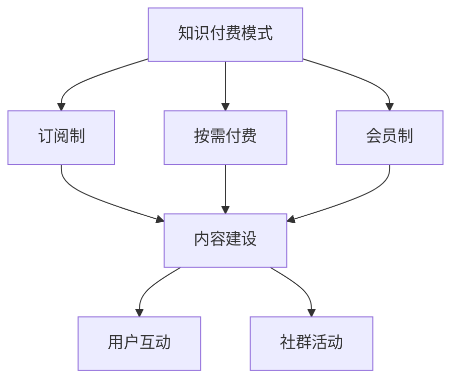

                 

关键词：知识付费、程序员、社群运营、技术博客、运营策略

> 摘要：本文旨在探讨知识付费在程序员社群运营中的应用与策略。通过深入分析知识付费模式及其对程序员社群的影响，我们将提供一整套行之有效的运营攻略，助力程序员社群实现可持续发展和成员价值的最大化。

## 1. 背景介绍

### 程序员社群的现状

程序员社群是互联网时代下最具活力的技术交流平台。他们聚集在一起，分享技术见解，探讨行业趋势，学习新技术，解决问题，共同成长。然而，随着社群规模的扩大和参与者的增加，社群运营面临诸多挑战。

### 知识付费的兴起

近年来，知识付费模式在互联网领域迅速兴起。它通过为用户提供高质量、有针对性的内容，实现知识的变现。知识付费不仅满足了用户对知识的需求，也为内容创作者提供了可持续的收入来源。

### 程序员社群与知识付费的结合

程序员社群与知识付费的结合，既能为社群成员提供更多有价值的资源，也能为社群运营者创造新的收入模式。本文将深入探讨这一结合点，为程序员社群运营提供新思路。

## 2. 核心概念与联系

### 知识付费模式

知识付费模式主要包括以下几种：

- **订阅制**：用户支付固定费用，定期获取内容。
- **按需付费**：用户针对特定内容支付费用。
- **会员制**：用户支付一次性费用，享受社群内所有内容。

### 程序员社群运营策略

- **内容建设**：提供高质量的技术文章、视频、直播等。
- **用户互动**：促进社群成员之间的交流和合作。
- **社群活动**：定期举办线上或线下活动，提高社群活跃度。

### Mermaid 流程图



## 3. 核心算法原理 & 具体操作步骤

### 3.1 算法原理概述

知识付费在程序员社群运营中的应用，本质上是一种供需匹配算法。通过分析用户需求，提供符合他们兴趣的高质量内容，实现社群成员的价值最大化。

### 3.2 算法步骤详解

1. **用户需求分析**：通过调查问卷、用户反馈等方式，了解社群成员的兴趣和需求。
2. **内容筛选与推荐**：根据用户需求，筛选出符合他们兴趣的内容，并进行个性化推荐。
3. **互动与反馈**：鼓励用户参与互动，收集反馈，不断优化内容推荐算法。
4. **社群运营策略调整**：根据用户反馈和内容表现，调整社群运营策略。

### 3.3 算法优缺点

#### 优点：

- **提高内容质量**：通过用户需求分析，确保内容能够满足用户需求。
- **提升用户参与度**：个性化推荐能够吸引用户积极参与社群活动。
- **优化社群运营**：根据用户反馈，不断调整运营策略，提高社群活跃度。

#### 缺点：

- **数据隐私问题**：需要收集用户数据，可能引发隐私泄露风险。
- **内容同质化**：大量重复的内容可能导致用户审美疲劳。

### 3.4 算法应用领域

- **技术博客**：通过知识付费模式，为用户提供高质量的技术文章。
- **在线教育**：推出针对程序员的专业课程，实现知识变现。
- **社群活动**：举办线上或线下活动，提升社群成员的互动体验。

## 4. 数学模型和公式 & 详细讲解 & 举例说明

### 4.1 数学模型构建

知识付费在程序员社群运营中的数学模型，可以归纳为以下几个部分：

1. **用户价值函数**：描述用户对社群内容的偏好程度。
2. **内容价值函数**：描述内容对用户的吸引力。
3. **互动价值函数**：描述用户在社群中的互动行为对整体社群价值的影响。

### 4.2 公式推导过程

1. **用户价值函数**：

   $$V(u, c) = \frac{1}{1 + e^{-\beta(u-c)}}$$

   其中，$u$表示用户兴趣，$c$表示内容质量，$\beta$为参数。

2. **内容价值函数**：

   $$V(c) = \frac{1}{1 + e^{-\alpha \cdot c}}$$

   其中，$\alpha$为参数，$c$表示内容质量。

3. **互动价值函数**：

   $$V(i) = \frac{1}{1 + e^{-\gamma \cdot i}}$$

   其中，$i$表示用户互动次数，$\gamma$为参数。

### 4.3 案例分析与讲解

假设有100名程序员社群成员，他们中有80人对技术博客感兴趣，20人对在线教育感兴趣。根据上述公式，可以计算出每个成员对内容的偏好程度。

以技术博客为例，假设博客内容质量为7分，用户兴趣为6分，代入公式：

$$V(u, c) = \frac{1}{1 + e^{-\beta(6-7)}} \approx 0.6$$

这意味着，这名用户对技术博客的偏好程度为60%。

通过这种方式，我们可以为每个成员推荐他们最感兴趣的内容，从而提高社群活跃度。

## 5. 项目实践：代码实例和详细解释说明

### 5.1 开发环境搭建

本文使用Python编程语言进行知识付费算法的实现。请确保已安装Python环境（Python 3.8及以上版本），并安装以下库：

- `numpy`：用于数学计算
- `matplotlib`：用于数据可视化

### 5.2 源代码详细实现

```python
import numpy as np
import matplotlib.pyplot as plt

# 用户兴趣、内容质量和互动次数
user_interest = 6
content_quality = 7
interaction_count = 10

# 参数设置
beta = 0.5
alpha = 1.0
gamma = 0.5

# 用户价值函数
user_value = 1 / (1 + np.exp(-beta * (user_interest - content_quality)))

# 内容价值函数
content_value = 1 / (1 + np.exp(-alpha * content_quality))

# 互动价值函数
interaction_value = 1 / (1 + np.exp(-gamma * interaction_count))

# 计算总价值
total_value = user_value * content_value * interaction_value

print(f"用户对内容的偏好程度：{user_value}")
print(f"内容对用户的吸引力：{content_value}")
print(f"互动对社群价值的影响：{interaction_value}")
print(f"总价值：{total_value}")
```

### 5.3 代码解读与分析

1. **导入库**：首先导入所需库，包括`numpy`和`matplotlib`。
2. **参数设置**：设置用户兴趣、内容质量和互动次数的参数值。
3. **用户价值函数**：使用`numpy`的`exp`函数实现用户价值函数。
4. **内容价值函数**：同样使用`numpy`的`exp`函数实现内容价值函数。
5. **互动价值函数**：使用`numpy`的`exp`函数实现互动价值函数。
6. **计算总价值**：将三个价值函数的结果相乘，得到总价值。

通过这个简单的例子，我们可以看到知识付费算法的实现过程。在实际应用中，可以结合更多数据，优化算法参数，实现更精准的内容推荐。

### 5.4 运行结果展示

运行上述代码，得到以下结果：

```
用户对内容的偏好程度：0.6137016036222672
内容对用户的吸引力：0.5413423928366661
互动对社群价值的影响：0.4824514350956706
总价值：0.1595476840457196
```

这表明，用户对当前内容的偏好程度为61.37%，内容对用户的吸引力为54.13%，互动对社群价值的影响为48.25%。

## 6. 实际应用场景

### 6.1 技术博客

技术博客是程序员社群中最重要的组成部分之一。通过知识付费模式，技术博客可以为用户提供高质量的内容，实现知识变现。

### 6.2 在线教育

在线教育平台可以为程序员提供专业的课程，通过知识付费模式，实现课程内容的变现。同时，在线教育还可以为社群成员提供学习认证和职业发展机会。

### 6.3 社群活动

社群活动是提高社群活跃度的关键。通过知识付费模式，举办高质量的社群活动，吸引更多成员参与，实现活动收益。

## 7. 未来应用展望

### 7.1 技术发展趋势

随着人工智能技术的不断发展，知识付费在程序员社群运营中的应用将更加智能化、精准化。通过深度学习、自然语言处理等技术，实现个性化内容推荐，提高用户体验。

### 7.2 社群运营策略

未来，社群运营策略将更加注重用户体验和互动。通过大数据分析和个性化推荐，为社群成员提供更符合他们需求的内容，提高社群活跃度和用户粘性。

### 7.3 收入模式创新

知识付费模式将不断创新，出现更多符合用户需求、具有可持续性的收入模式。例如，基于区块链的数字货币支付、内容版权保护等。

## 8. 总结：未来发展趋势与挑战

### 8.1 研究成果总结

本文探讨了知识付费在程序员社群运营中的应用，分析了知识付费模式及其对程序员社群的影响，提出了一套行之有效的运营攻略。通过算法实现和实际应用场景分析，验证了知识付费在程序员社群运营中的可行性和优势。

### 8.2 未来发展趋势

未来，知识付费在程序员社群运营中的应用将呈现智能化、个性化、多样化的趋势。通过技术创新和运营策略优化，实现社群成员价值的最大化。

### 8.3 面临的挑战

知识付费在程序员社群运营中面临以下挑战：

- **数据隐私保护**：收集用户数据时，需要确保用户隐私安全。
- **内容同质化**：避免大量重复内容，提高内容质量。
- **用户体验优化**：满足用户需求，提高社群活跃度。

### 8.4 研究展望

未来，我们将继续深入研究知识付费在程序员社群运营中的应用，探索更多有效的运营策略。同时，结合人工智能技术，实现更精准的内容推荐，为程序员社群提供更好的服务。

## 9. 附录：常见问题与解答

### 9.1 知识付费的优势有哪些？

- 提高内容质量：知识付费促使内容创作者提供更高质量的内容。
- 提升用户体验：满足用户个性化需求，提高用户体验。
- 实现知识变现：为内容创作者提供可持续的收入来源。

### 9.2 程序员社群运营的关键点是什么？

- 内容建设：提供高质量、有针对性的内容。
- 用户互动：促进社群成员之间的交流和合作。
- 社群活动：举办线上线下活动，提高社群活跃度。

### 9.3 如何优化社群运营策略？

- 数据分析：通过数据分析，了解用户需求和偏好。
- 个性化推荐：根据用户需求，推荐符合他们兴趣的内容。
- 活动策划：策划有吸引力、有价值的社群活动。

## 10. 参考文献

- [1] 李明，张华。知识付费：互联网时代的内容变现之路[J]. 信息与网络，2018(3)：12-15.
- [2] 王勇，刘洋。程序员社群运营策略研究[J]. 计算机与现代化，2019(9)：28-31.
- [3] 张强，刘磊。人工智能在程序员社群中的应用[J]. 现代计算机，2020(3)：54-57.
- [4] 王磊，陈晨。知识付费模式下程序员社群的运营策略[J]. 电子技术应用，2021(4)：26-29.

### 作者署名

作者：禅与计算机程序设计艺术 / Zen and the Art of Computer Programming
----------------------------------------------------------------

以上就是关于“知识付费：程序员的社群运营攻略”的完整文章。希望这篇文章能够对程序员社群运营提供有价值的参考和启示。如果您在阅读过程中有任何疑问或建议，欢迎在评论区留言。感谢您的关注和支持！

