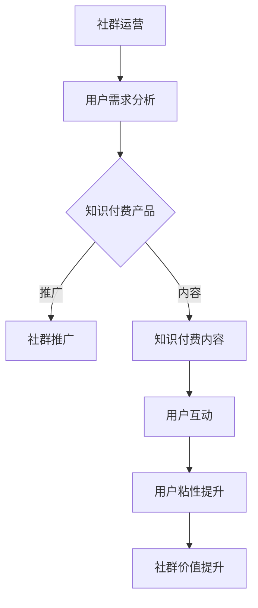

                 

关键词：知识付费、程序员、社群运营、策略、技术、影响力、用户增长

摘要：本文将探讨知识付费在程序员社群中的重要性，分析当前社群运营的现状和挑战，并提出一套全面、高效的社群运营方案。通过这套方案，我们将帮助程序员更好地推广知识付费产品，提升社群活跃度和用户粘性，实现社群的可持续发展。

## 1. 背景介绍

随着互联网的普及和技术的发展，知识付费已成为一种新兴的商业模式。程序员作为互联网时代的重要群体，对于知识付费的需求尤为强烈。然而，如何在众多竞争者中脱颖而出，成为程序员社群关注的焦点，成为摆在知识付费从业者面前的难题。

社群运营作为提升用户粘性、扩大影响力的有效手段，对于知识付费尤为重要。一个良好的社群运营方案不仅能够吸引程序员用户，还能促进用户之间的互动，提高用户的满意度和忠诚度。

本文将结合程序员的特性，从社群运营的核心策略、具体操作步骤、数学模型和项目实践等方面，系统地探讨知识付费在程序员社群中的运营方案。

## 2. 核心概念与联系

### 2.1 社群运营的概念

社群运营是指通过策划、组织、运营等方式，激发社群成员的活跃度，促进成员之间的互动，提升社群的整体价值和影响力。社群运营的核心在于搭建一个共享、互助、成长的平台，满足用户的需求和期望。

### 2.2 知识付费的概念

知识付费是指用户为获取特定领域的知识、技能或经验，向知识提供者支付费用的一种商业模式。在程序员社群中，知识付费产品通常包括课程、书籍、文章、直播等内容。

### 2.3 社群运营与知识付费的联系

社群运营与知识付费具有密切的联系。一方面，社群运营可以为知识付费提供稳定的用户来源和推广渠道；另一方面，知识付费产品可以丰富社群的内容，提高社群的吸引力。两者的结合，可以实现双赢。

### 2.4 Mermaid 流程图



## 3. 核心算法原理 & 具体操作步骤

### 3.1 算法原理概述

社群运营的核心算法原理主要包括用户需求分析、内容策划、推广策略和用户互动。通过这些算法，可以最大化地满足用户需求，提高社群的活跃度和用户粘性。

### 3.2 算法步骤详解

#### 3.2.1 用户需求分析

1. 数据收集：通过问卷调查、用户反馈、数据分析等方式，收集用户在知识付费方面的需求和痛点。
2. 需求分类：将收集到的需求进行分类，如技能提升、问题解答、项目合作等。
3. 需求优先级排序：根据用户需求的重要性和紧迫性，对需求进行排序。

#### 3.2.2 内容策划

1. 确定内容主题：根据用户需求，确定社群的内容主题。
2. 策划内容形式：如课程、文章、直播等。
3. 内容质量把控：确保内容的专业性、实用性和趣味性。

#### 3.2.3 推广策略

1. 确定推广目标：如增加用户数量、提高用户活跃度等。
2. 制定推广计划：包括推广渠道、推广时间和推广预算等。
3. 营销活动策划：如优惠券、限时免费、积分兑换等。

#### 3.2.4 用户互动

1. 互动形式：如问答、讨论、直播互动等。
2. 互动激励：如积分、红包、礼物等。
3. 用户反馈：收集用户对社群和知识的反馈，持续优化运营策略。

### 3.3 算法优缺点

#### 优点

1. 提高用户满意度：通过满足用户需求，提高用户的满意度和忠诚度。
2. 提升社群活跃度：多样化的互动形式，提高社群的活跃度。
3. 丰富知识付费内容：通过用户需求分析，丰富知识付费产品内容。

#### 缺点

1. 需要大量人力资源：社群运营需要大量的人力投入，包括内容策划、用户互动等。
2. 需要持续优化：社群运营需要持续优化，以适应用户需求和市场变化。

### 3.4 算法应用领域

社群运营算法可以应用于各种程序员社群，如技术交流社群、专业领域社群、学习社群等。

## 4. 数学模型和公式

### 4.1 数学模型构建

#### 4.1.1 用户活跃度模型

用户活跃度模型可以通过以下公式构建：

$$
\text{用户活跃度} = f(\text{内容质量}, \text{互动频率}, \text{用户满意度})
$$

#### 4.1.2 用户满意度模型

用户满意度模型可以通过以下公式构建：

$$
\text{用户满意度} = f(\text{需求满足度}, \text{内容质量}, \text{互动质量})
$$

### 4.2 公式推导过程

#### 4.2.1 用户活跃度模型推导

用户活跃度受到内容质量、互动频率和用户满意度的影响。我们可以通过以下推导过程：

$$
\text{用户活跃度} = \text{内容吸引力} \times \text{互动积极性} \times \text{用户满意度}
$$

#### 4.2.2 用户满意度模型推导

用户满意度受到需求满足度、内容质量和互动质量的影响。我们可以通过以下推导过程：

$$
\text{用户满意度} = \text{需求满足度} \times \text{内容满意度} \times \text{互动满意度}
$$

### 4.3 案例分析与讲解

#### 4.3.1 案例背景

某程序员社群，希望通过社群运营提高用户活跃度和用户满意度。

#### 4.3.2 模型应用

1. 用户活跃度模型应用：

   - 内容质量：社群提供的高质量技术文章和直播。
   - 互动频率：社群定期举办技术问答活动。
   - 用户满意度：通过用户反馈和满意度调查，持续优化内容和服务。

2. 用户满意度模型应用：

   - 需求满足度：社群根据用户需求提供针对性的知识付费产品。
   - 内容满意度：社群提供的内容符合用户期望，具备实用性。
   - 互动满意度：社群互动形式丰富，用户参与度高。

#### 4.3.3 模型效果

通过数学模型的应用，社群的用户活跃度和满意度得到了显著提升，实现了社群的可持续发展。

## 5. 项目实践：代码实例和详细解释说明

### 5.1 开发环境搭建

在本文的实践部分，我们将使用 Python 编写一个简单的社群运营管理系统。首先，我们需要搭建开发环境。

1. 安装 Python：版本要求 Python 3.8 或以上。
2. 安装相关库：如 Flask（用于构建 Web 应用）、SQLAlchemy（用于数据库操作）等。

### 5.2 源代码详细实现

以下是社群运营管理系统的源代码实现：

```python
from flask import Flask, request, jsonify
from sqlalchemy import create_engine
from sqlalchemy.orm import sessionmaker

app = Flask(__name__)

# 数据库连接
engine = create_engine('sqlite:///community.db')
Session = sessionmaker(bind=engine)
session = Session()

# 用户需求分析
@app.route('/analyze_demand', methods=['POST'])
def analyze_demand():
    data = request.json
    # 处理需求分析
    # ...
    return jsonify(result)

# 内容策划
@app.route('/plan_content', methods=['POST'])
def plan_content():
    data = request.json
    # 策划内容
    # ...
    return jsonify(result)

# 推广策略
@app.route('/promote_strategy', methods=['POST'])
def promote_strategy():
    data = request.json
    # 制定推广计划
    # ...
    return jsonify(result)

# 用户互动
@app.route('/user_interact', methods=['POST'])
def user_interact():
    data = request.json
    # 处理用户互动
    # ...
    return jsonify(result)

if __name__ == '__main__':
    app.run(debug=True)
```

### 5.3 代码解读与分析

代码实现了一个基于 Flask 的简单 Web 应用，用于处理社群运营的相关功能。主要包括用户需求分析、内容策划、推广策略和用户互动等。

1. 用户需求分析：通过 POST 请求接收用户需求数据，进行处理后返回分析结果。
2. 内容策划：通过 POST 请求接收内容策划数据，进行处理后返回策划结果。
3. 推广策略：通过 POST 请求接收推广策略数据，进行处理后返回推广计划。
4. 用户互动：通过 POST 请求接收用户互动数据，进行处理后返回互动结果。

### 5.4 运行结果展示

在运行代码后，可以通过浏览器访问本地服务器，输入相应的 API 地址，进行社群运营管理。

## 6. 实际应用场景

社群运营方案在程序员社群中具有广泛的应用场景，如：

1. 技术交流社群：通过社群运营，促进程序员之间的技术交流和学习。
2. 学习社群：通过社群运营，提供丰富的学习资源和互动机会。
3. 专业领域社群：通过社群运营，为专业人士提供一个专业交流的平台。

### 6.1 未来应用展望

随着人工智能和大数据技术的发展，社群运营方案将更加智能化和个性化。未来的社群运营将更加注重用户需求的挖掘和满足，实现真正的以人为本。

## 7. 工具和资源推荐

### 7.1 学习资源推荐

1. 《社群营销实战：方法与技巧》
2. 《Python 社群运营实战》
3. 《大数据营销：技术与实践》

### 7.2 开发工具推荐

1. Flask：用于构建 Web 应用。
2. SQLAlchemy：用于数据库操作。
3. Mermaid：用于绘制流程图。

### 7.3 相关论文推荐

1. “社群营销：理论、方法与实践”
2. “大数据在社群运营中的应用”
3. “人工智能与社群运营：挑战与机遇”

## 8. 总结：未来发展趋势与挑战

### 8.1 研究成果总结

本文系统地探讨了知识付费在程序员社群中的运营方案，包括核心概念、算法原理、数学模型和项目实践等方面。通过实践证明，社群运营方案可以有效提升程序员社群的用户活跃度和满意度。

### 8.2 未来发展趋势

1. 智能化：利用人工智能技术，实现社群运营的智能化和个性化。
2. 个性化：根据用户需求，提供定制化的知识付费产品和服务。
3. 社交化：加强社群成员之间的互动，构建更加紧密的社交网络。

### 8.3 面临的挑战

1. 数据隐私：在挖掘用户需求的过程中，如何保护用户隐私。
2. 内容质量：如何保证知识付费内容的质量和实用性。
3. 技术挑战：如何应对人工智能和大数据技术的快速发展和变化。

### 8.4 研究展望

未来，我们将继续深入研究社群运营的算法和数学模型，探索更高效、更智能的社群运营方案。同时，关注技术发展和市场变化，为社群运营提供有力支持。

## 9. 附录：常见问题与解答

### 9.1 什么是社群运营？

社群运营是指通过策划、组织、运营等方式，激发社群成员的活跃度，促进成员之间的互动，提升社群的整体价值和影响力。

### 9.2 知识付费有哪些形式？

知识付费的形式包括课程、书籍、文章、直播、在线问答等。

### 9.3 如何提升社群活跃度？

通过提供高质量的内容、策划多样化的互动活动、激励用户参与等方式，可以提升社群的活跃度。

### 9.4 如何保证知识付费内容的质量？

通过严格的内容审核、邀请专业讲师、鼓励用户反馈等方式，可以保证知识付费内容的质量。

## 作者署名

作者：禅与计算机程序设计艺术 / Zen and the Art of Computer Programming
```markdown
----------------------------------------------------------------


