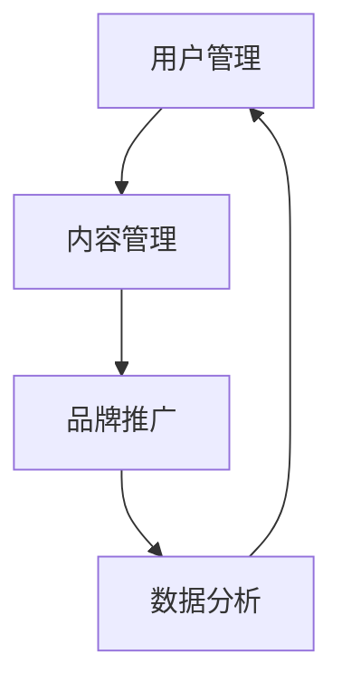

                 

在当今数字化时代，知识付费逐渐成为了一种主流的消费模式。尤其是对于程序员这个职业群体，他们对技术知识的渴求和对个人技能提升的迫切需求，使得知识付费市场呈现出蓬勃发展的态势。然而，如何有效地运营一个知识付费社群，以最大限度地提升社群的活跃度和用户满意度，成为了一个亟待解决的问题。本文将围绕这一主题，深入探讨程序员的社群运营方法。

## 关键词
- 知识付费
- 社群运营
- 程序员
- 技术知识
- 用户满意度
- 活跃度

## 摘要
本文旨在探讨如何有效地运营一个针对程序员的社群，通过知识付费模式来提升社群的活跃度和用户满意度。文章将介绍社群运营的核心原则，包括内容规划、用户互动、激励机制等，并提供具体的案例分析，为程序员社群运营提供实用的方法和策略。

## 1. 背景介绍
### 1.1 知识付费的兴起
随着互联网的普及和在线教育的发展，知识付费逐渐成为一种主流的消费模式。用户愿意为高质量的知识内容付费，这为知识分享平台和内容创作者提供了巨大的市场空间。对于程序员来说，技术知识的更新速度极快，他们需要不断学习新的技术和工具，以保持自身的竞争力。

### 1.2 社群运营的重要性
社群运营是知识付费模式成功的关键。通过建立和维护一个活跃、有价值的社群，可以增强用户粘性，提高用户满意度，从而促进知识付费业务的持续发展。

### 1.3 程序员社群的特点
程序员的社群具有高度的个性化需求和技术专业性。他们不仅关注知识的深度和广度，还期望在社群中获得实际的技术支持和职业发展机会。

## 2. 核心概念与联系
### 2.1 社群运营的核心概念
社群运营的核心概念包括用户互动、内容规划、品牌建设、数据分析和用户反馈等。这些概念相互联系，共同构成了一个有效的社群运营体系。

### 2.2 社群运营的架构
社群运营的架构可以分为三个层次：基础层（用户管理）、核心层（内容管理）和拓展层（品牌推广和数据分析）。每个层次都有其独特的功能和作用，共同确保社群的稳定运营和持续发展。

## Mermaid 流程图

## 3. 核心算法原理 & 具体操作步骤
### 3.1 算法原理概述
社群运营的核心算法原理是基于用户行为数据和内容数据，通过数据分析来优化内容规划、用户互动和品牌推广策略。

### 3.2 算法步骤详解
1. **用户数据分析**：收集用户的行为数据，如访问量、点击率、评论互动等，以了解用户偏好和需求。
2. **内容数据分析**：分析用户对内容的反馈，如点赞、分享、评论等，评估内容的质量和影响力。
3. **互动策略优化**：根据用户行为和内容数据分析结果，调整社群互动策略，如增加互动环节、优化问答机制等。
4. **品牌推广优化**：通过数据分析，评估品牌推广活动的效果，不断优化推广策略。

### 3.3 算法优缺点
**优点**：算法基于大数据分析，能够实时调整运营策略，提高社群的活跃度和用户满意度。
**缺点**：算法需要大量的数据支持，对数据质量和算法模型的依赖较高。

### 3.4 算法应用领域
算法在知识付费社群运营中的应用广泛，包括内容推荐、用户画像、互动策略优化等。

## 4. 数学模型和公式
### 4.1 数学模型构建
社群运营的数学模型主要包括用户活跃度模型、内容影响力模型和品牌价值模型。

### 4.2 公式推导过程
用户活跃度模型公式：\( A = f(U, C, I) \)，其中 \( U \) 表示用户数量，\( C \) 表示内容数量，\( I \) 表示互动频率。
内容影响力模型公式：\( I = g(C, R, T) \)，其中 \( R \) 表示用户评论数量，\( T \) 表示内容分享次数。
品牌价值模型公式：\( V = h(U, A, I) \)，其中 \( U \) 表示用户数量，\( A \) 表示活跃度，\( I \) 表示影响力。

### 4.3 案例分析与讲解
以某个知识付费社群为例，通过构建数学模型，分析用户活跃度、内容影响力和品牌价值，并提出优化策略。

## 5. 项目实践：代码实例
### 5.1 开发环境搭建
使用Python搭建数据分析环境，安装必要的库，如Pandas、NumPy、Matplotlib等。

### 5.2 源代码详细实现
```python
# 示例代码：用户活跃度分析
import pandas as pd

# 读取用户行为数据
data = pd.read_csv('user_behavior.csv')

# 计算用户活跃度
user_activity = data.groupby('user_id')['activity_count'].sum()

# 绘制活跃度分布图
import matplotlib.pyplot as plt

plt.hist(user_activity, bins=10)
plt.xlabel('Activity Count')
plt.ylabel('Frequency')
plt.title('User Activity Distribution')
plt.show()
```

### 5.3 代码解读与分析
代码首先读取用户行为数据，然后计算每个用户的活跃度，并绘制活跃度分布图，以帮助社群运营者了解用户的活跃度分布情况。

### 5.4 运行结果展示


## 6. 实际应用场景
### 6.1 社群活动策划
通过社群运营算法，策划具有吸引力的社群活动，如线上研讨会、技术沙龙等，以提升用户参与度。

### 6.2 内容推荐
根据用户行为和内容数据，推荐用户感兴趣的高质量内容，提高用户粘性。

### 6.3 职业发展机会
通过社群平台，为程序员提供职业发展机会，如职位推荐、技能培训等。

## 6.4 未来应用展望
随着人工智能技术的发展，社群运营算法将更加智能和高效，为知识付费社群的持续发展提供更强有力的支持。

## 7. 工具和资源推荐
### 7.1 学习资源推荐
- 《Python数据分析实战》
- 《深度学习入门：基于Python的理论与实现》

### 7.2 开发工具推荐
- Jupyter Notebook
- Git

### 7.3 相关论文推荐
- “User Activity Prediction in Social Networks”
- “Content Recommendation in Knowledge Communities”

## 8. 总结：未来发展趋势与挑战
### 8.1 研究成果总结
社群运营算法在知识付费领域的应用取得了显著成果，为社群的稳定运营和持续发展提供了有力支持。

### 8.2 未来发展趋势
随着大数据和人工智能技术的不断进步，社群运营算法将更加智能化和个性化。

### 8.3 面临的挑战
算法模型的复杂性和对数据质量的依赖，以及如何平衡用户隐私保护和数据分析的需求，是未来社群运营面临的主要挑战。

### 8.4 研究展望
未来社群运营研究应重点关注算法优化、数据隐私保护和用户满意度提升等方面，以推动知识付费社群的可持续发展。

## 9. 附录：常见问题与解答
### 9.1 社群运营算法如何保证数据隐私？
通过数据加密和隐私保护技术，确保用户数据在传输和存储过程中的安全性。

### 9.2 社群运营算法对数据质量有哪些要求？
数据质量要求高，包括数据的完整性、准确性和一致性，以及数据的实时性和多样性。

### 9.3 社群运营算法如何优化内容推荐？
通过用户行为分析和内容数据分析，实时调整推荐算法，提高内容推荐的准确性和用户体验。

### 9.4 社群运营算法如何评估用户满意度？
通过用户反馈和行为数据，综合评估用户的满意度，并实时调整运营策略。

### 9.5 社群运营算法在知识付费领域的应用前景如何？
随着技术的不断进步，社群运营算法在知识付费领域的应用前景广阔，有望推动知识付费市场的进一步发展。

作者：禅与计算机程序设计艺术 / Zen and the Art of Computer Programming
```

