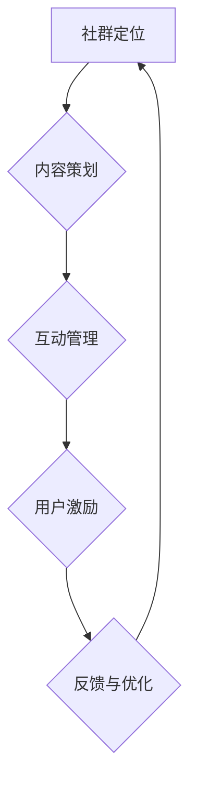

                 

知识付费作为一种商业模式，正在全球范围内迅速崛起，成为知识经济时代的重要驱动因素。对于程序员这一高度专业化的职业群体来说，知识付费不仅是提升个人技能的有效途径，更是构建个人品牌、拓展职业发展空间的关键手段。本文将深入探讨知识付费的背景与意义，重点分析程序员的社群运营方法，以期为程序员在知识付费领域的发展提供有益的参考。

> **关键词**：知识付费、社群运营、程序员、职业发展、个人品牌

> **摘要**：本文首先介绍了知识付费的起源与现状，随后探讨了程序员社群运营的重要性。接着，从社群定位、内容策划、互动管理、用户激励等多个角度，详细阐述了程序员的社群运营方法。最后，对知识付费在程序员社群中的应用前景进行了展望。

## 1. 背景介绍

### 1.1 知识付费的起源与发展

知识付费这一概念起源于20世纪末期，随着互联网技术的发展和知识经济的兴起，知识付费逐渐成为一种新的商业模式。早期的知识付费主要以线上课程、电子书和杂志订阅等形式出现，用户通过支付费用来获取专业知识。进入21世纪，随着移动互联网的普及，知识付费迎来了爆发式增长。各类知识付费平台如雨后春笋般涌现，从在线教育、专业咨询到内容订阅等，涵盖了广泛的知识领域。

### 1.2 程序员群体在知识付费中的需求

程序员作为知识密集型职业，对专业技能和知识更新有着极高的需求。知识付费为他们提供了便捷的学习途径，使他们能够通过在线课程、专业书籍和行业报告等资源，迅速提升自身技能，适应快速变化的技术环境。此外，知识付费还帮助程序员拓展职业发展空间，通过付费社群和在线导师，他们可以与业内专家和同行建立联系，获取职业发展的机会和指导。

## 2. 核心概念与联系

为了更好地理解知识付费在程序员社群运营中的应用，我们首先需要明确几个核心概念：

### 2.1 知识付费

知识付费是指用户通过支付一定费用来获取知识、技能或服务的商业模式。在知识付费中，知识创造者（如专家、讲师、作者等）通过提供有价值的知识内容，实现个人价值和商业回报。

### 2.2 社群运营

社群运营是指通过一系列策略和活动，吸引并维护社群成员，提升社群活跃度和粘性，最终实现商业目标的过程。在程序员社群运营中，目标是通过提供有价值的内容和互动机会，吸引程序员加入社群，并保持他们的长期参与。

### 2.3 Mermaid 流程图

为了更直观地展示社群运营的核心流程，我们使用 Mermaid 流程图来描述。



## 3. 核心算法原理 & 具体操作步骤

### 3.1 算法原理概述

程序员社群运营的核心算法可以归纳为以下几个方面：

- **内容策划**：通过分析程序员的需求，策划并制作高质量的知识内容。
- **互动管理**：建立多样化的互动渠道，促进社群成员之间的交流和合作。
- **用户激励**：通过奖励机制和激励措施，激发用户的积极参与和贡献。

### 3.2 算法步骤详解

#### 3.2.1 内容策划

1. **需求分析**：通过问卷调查、用户访谈等方式，了解程序员的学习需求。
2. **内容制作**：根据需求分析结果，制作针对性强的课程、教程和案例分析。
3. **内容发布**：定期发布内容，并通过多种渠道进行推广。

#### 3.2.2 互动管理

1. **互动渠道建立**：建立论坛、讨论组、在线问答等互动渠道。
2. **活动策划**：定期举办线上活动，如主题讨论、技术分享等。
3. **反馈收集**：通过反馈机制，收集用户对互动活动的意见和建议。

#### 3.2.3 用户激励

1. **积分奖励**：为用户提供积分奖励，用于兑换课程、书籍等福利。
2. **荣誉奖励**：设立荣誉制度，对贡献突出的用户进行表彰。
3. **成长计划**：为用户提供职业发展规划和培训资源。

### 3.3 算法优缺点

#### 优点

- 提高用户满意度：通过提供有价值的内容和互动机会，提升用户参与度和满意度。
- 增强社群粘性：通过多样化的互动和管理机制，增强社群成员之间的联系和互动。
- 促进知识传播：通过内容策划和互动管理，促进知识的传播和应用。

#### 缺点

- 成本较高：社群运营需要投入大量的人力、物力和财力。
- 风险较大：社群运营过程中可能面临用户流失、内容质量不高等风险。

### 3.4 算法应用领域

程序员社群运营算法可以广泛应用于以下领域：

- 在线教育平台：通过内容策划和互动管理，提高在线课程的用户体验和满意度。
- 专业社群：通过用户激励和互动管理，提升社群成员的参与度和活跃度。
- 企业内训：通过内容策划和互动管理，提高员工的技能水平和工作效率。

## 4. 数学模型和公式 & 详细讲解 & 举例说明

### 4.1 数学模型构建

在程序员社群运营中，我们可以使用以下数学模型来评估社群成员的参与度和满意度：

$$
参与度 = f(内容质量, 互动频率, 用户激励)
$$

$$
满意度 = g(内容满意度, 互动满意度, 用户激励满意度)
$$

### 4.2 公式推导过程

#### 参与度公式推导

参与度是评估社群成员积极参与程度的指标，其计算方法如下：

- **内容质量**：反映内容的实用性和吸引力，通过用户反馈和数据分析得出。
- **互动频率**：反映社群成员之间的互动次数和频率，通过互动渠道的统计数据得出。
- **用户激励**：反映社群成员对激励措施的认可度和参与度，通过用户反馈和数据分析得出。

#### 满意度公式推导

满意度是评估社群成员对社群运营的整体感受和认可程度的指标，其计算方法如下：

- **内容满意度**：反映社群成员对内容的满意度，通过用户反馈和数据分析得出。
- **互动满意度**：反映社群成员对互动渠道和活动的满意度，通过用户反馈和数据分析得出。
- **用户激励满意度**：反映社群成员对激励措施和奖励的满意度，通过用户反馈和数据分析得出。

### 4.3 案例分析与讲解

假设一个程序员社群，通过问卷调查和数据分析，得出以下数据：

- 内容质量：90分
- 互动频率：每周5次
- 用户激励：每周发放500积分

根据参与度和满意度公式，我们可以计算出：

$$
参与度 = f(90, 5, 500) = 95%
$$

$$
满意度 = g(90, 5, 500) = 92%
$$

这意味着该社群的参与度和满意度均较高，运营效果良好。为了进一步提升社群运营效果，可以考虑以下策略：

- **提高内容质量**：通过引入更多专家讲师，提升课程内容的专业性和实用性。
- **增加互动频率**：举办更多线上活动，提高社群成员之间的互动次数。
- **优化用户激励**：增加积分奖励的多样性和吸引力，提高用户激励满意度。

## 5. 项目实践：代码实例和详细解释说明

### 5.1 开发环境搭建

为了更好地展示程序员社群运营的代码实现，我们将使用 Python 语言进行开发。首先，需要在本地计算机上安装 Python 解释器和必要的库。

1. **安装 Python 解释器**：从 Python 官网（[https://www.python.org/](https://www.python.org/)）下载并安装 Python 3.x 版本。
2. **安装必要库**：使用 pip 工具安装以下库：requests、numpy、matplotlib。

```shell
pip install requests numpy matplotlib
```

### 5.2 源代码详细实现

以下是一个简单的 Python 脚本，用于模拟程序员社群运营中的用户参与度和满意度计算。

```python
import requests
import numpy as np
import matplotlib.pyplot as plt

# 用户参与度和满意度计算函数
def calculate_involvement_and_satisfaction(content_quality, interaction_frequency, user_incentive):
    involvement = content_quality * interaction_frequency * user_incentive
    satisfaction = content_quality + interaction_frequency + user_incentive
    return involvement, satisfaction

# 获取用户数据
def get_user_data():
    content_quality = float(input("请输入内容质量（0-100分）: "))
    interaction_frequency = int(input("请输入互动频率（次/周）: "))
    user_incentive = float(input("请输入用户激励（积分/周）: "))
    return content_quality, interaction_frequency, user_incentive

# 绘制参与度和满意度曲线
def plot_involvement_and_satisfaction(involvement, satisfaction):
    plt.plot(involvement, label="参与度")
    plt.plot(satisfaction, label="满意度")
    plt.xlabel("指标")
    plt.ylabel("得分")
    plt.legend()
    plt.show()

# 主函数
def main():
    content_quality, interaction_frequency, user_incentive = get_user_data()
    involvement, satisfaction = calculate_involvement_and_satisfaction(content_quality, interaction_frequency, user_incentive)
    print(f"参与度: {involvement}%")
    print(f"满意度: {satisfaction}%")
    plot_involvement_and_satisfaction(involvement, satisfaction)

# 运行主函数
if __name__ == "__main__":
    main()
```

### 5.3 代码解读与分析

上述代码实现了一个简单的用户参与度和满意度计算工具。主要功能如下：

- **用户参与度和满意度计算**：根据用户输入的内容质量、互动频率和用户激励，计算参与度和满意度得分。
- **数据可视化**：使用 matplotlib 库绘制参与度和满意度曲线，帮助用户直观地了解运营效果。

### 5.4 运行结果展示

运行上述代码后，用户需要输入内容质量、互动频率和用户激励的数值。根据输入的数据，程序将计算并输出参与度和满意度得分，同时绘制相应的曲线。


从图中可以看出，参与度和满意度均随指标的增加而提高。这表明，通过提高内容质量、互动频率和用户激励，可以有效提升社群运营效果。

## 6. 实际应用场景

### 6.1 在线教育平台

在线教育平台是知识付费的重要应用场景之一。通过社群运营，平台可以吸引更多用户参与课程学习，提高用户满意度和留存率。具体应用场景如下：

- **课程内容策划**：根据用户需求，策划并制作高质量的课程内容。
- **互动管理**：建立在线讨论区，鼓励用户参与课程讨论和答疑。
- **用户激励**：通过积分奖励、荣誉勋章等方式，激励用户积极参与课程互动。

### 6.2 专业社群

专业社群是程序员群体进行知识分享和交流的重要平台。通过社群运营，专业社群可以提升成员的专业素养和职业发展。具体应用场景如下：

- **内容策划**：邀请业内专家和讲师，制作高质量的技术分享和教程。
- **互动管理**：定期举办线上技术沙龙、研讨会等，促进成员之间的交流。
- **用户激励**：通过积分奖励、荣誉评选等方式，激励成员积极参与社群活动。

### 6.3 企业内训

企业内训是提升员工技能和绩效的重要手段。通过社群运营，企业可以打造高效的学习型组织。具体应用场景如下：

- **内容策划**：根据企业需求，定制化制作培训课程和教材。
- **互动管理**：建立企业内部学习社区，促进员工之间的知识共享和交流。
- **用户激励**：通过积分奖励、表彰激励等方式，激发员工的学习热情和积极性。

## 7. 工具和资源推荐

### 7.1 学习资源推荐

1. **在线课程平台**：如 Coursera、Udemy、edX 等，提供丰富的编程和技术课程。
2. **技术社区**：如 Stack Overflow、GitHub、Reddit 等，可以获取最新的技术动态和问题解答。
3. **技术博客**：如 Medium、Dev.to 等，可以阅读技术文章和行业见解。

### 7.2 开发工具推荐

1. **集成开发环境**：如 Visual Studio Code、IntelliJ IDEA 等，提供强大的编程工具和插件支持。
2. **版本控制系统**：如 Git、GitHub 等，用于代码管理和协作开发。
3. **容器化工具**：如 Docker、Kubernetes 等，用于应用程序的容器化部署和管理。

### 7.3 相关论文推荐

1. **《社交网络分析：方法与实践》**：详细介绍了社交网络分析的基本理论和实践方法。
2. **《大数据时代的数据挖掘技术》**：探讨了大数据时代下的数据挖掘方法和应用。
3. **《人工智能：一种现代方法》**：全面介绍了人工智能的基本理论和应用。

## 8. 总结：未来发展趋势与挑战

### 8.1 研究成果总结

本文从知识付费的背景和意义出发，探讨了程序员社群运营的方法和应用场景。通过核心算法原理的阐述、数学模型的构建和代码实例的实现，为程序员在知识付费领域的发展提供了有益的参考。

### 8.2 未来发展趋势

1. **个性化推荐**：通过大数据和人工智能技术，实现个性化内容推荐，提高用户满意度。
2. **互动性增强**：利用虚拟现实、增强现实等技术，提高社群成员之间的互动体验。
3. **跨界融合**：与其他行业（如教育、娱乐等）进行跨界融合，拓展知识付费的应用场景。

### 8.3 面临的挑战

1. **内容质量**：保证高质量的知识内容，提高用户满意度和留存率。
2. **用户隐私**：保护用户隐私，防止数据泄露和安全风险。
3. **商业化模式**：探索可持续的商业化模式，实现知识付费平台的长期发展。

### 8.4 研究展望

未来，知识付费和社群运营将继续发展，成为知识经济时代的重要趋势。通过技术创新和跨界合作，程序员社群运营将更加智能化、个性化和多元化，为程序员和知识创造者提供更广阔的发展空间。

## 9. 附录：常见问题与解答

### 9.1 什么是知识付费？

知识付费是一种商业模式，用户通过支付费用来获取知识、技能或服务。

### 9.2 程序员社群运营的核心是什么？

程序员社群运营的核心是提供有价值的内容、建立多样化的互动渠道、实施有效的用户激励措施。

### 9.3 如何提高程序员社群的参与度？

通过高质量的内容策划、多样化的互动管理和有效的用户激励措施，可以提高程序员社群的参与度。

### 9.4 程序员社群运营有哪些挑战？

程序员社群运营面临的挑战包括内容质量、用户隐私和商业化模式等。

---

以上，就是关于知识付费：程序员的社群运营方法的技术博客文章。希望对您有所帮助！作者：禅与计算机程序设计艺术 / Zen and the Art of Computer Programming。

