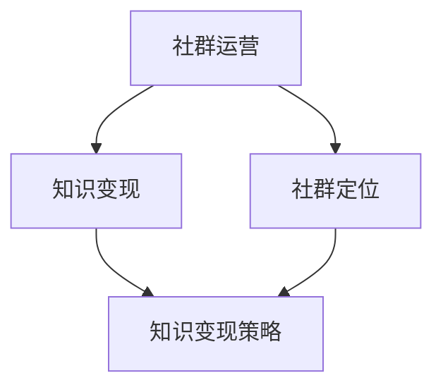

                 

关键词：知识付费、程序员、社群运营、模板、策略、实践

摘要：随着互联网的发展，知识付费成为了越来越多人获取知识的主要途径。本文将探讨知识付费在程序员社群中的重要性，并介绍一套完整的社群运营模板，旨在帮助程序员提升个人技能，实现知识变现。

## 1. 背景介绍

知识付费是指用户为了获取特定的知识或技能，向知识提供者支付一定的费用。在程序员社群中，知识付费已经成为一种趋势。程序员通过付费课程、付费问答、付费文章等形式，获取专业知识，提升自身技能。

然而，如何运营一个成功的程序员社群，实现知识付费，仍然是一个挑战。本文将介绍一套完整的社群运营模板，帮助程序员解决这一问题。

### 1.1 知识付费的发展趋势

- **在线教育**：随着在线教育的兴起，越来越多的人选择通过互联网学习新知识。知识付费成为在线教育的重要组成部分。
- **个性化学习**：知识付费让用户可以根据自己的需求和兴趣，选择适合自己的学习内容。
- **专家效应**：知识付费使专业人士能够通过分享自己的知识和经验，实现个人品牌的增值。

### 1.2 程序员社群的现状

- **专业性强**：程序员社群成员通常具有相同的职业背景和兴趣，交流更加专业和深入。
- **知识共享**：程序员社群鼓励成员分享知识和经验，促进共同成长。
- **商业潜力**：程序员社群具有较大的商业潜力，通过知识付费可以实现知识的变现。

## 2. 核心概念与联系

为了更好地理解社群运营模板，我们需要了解以下核心概念：

- **社群运营**：是指通过一系列策略和活动，维护和提升社群成员的活跃度和忠诚度。
- **知识变现**：是指将个人的知识、技能或经验转化为经济利益的过程。
- **社群定位**：明确社群的目标和定位，是社群运营的基础。

下面是一个简单的Mermaid流程图，展示了这些核心概念之间的联系：



## 3. 核心算法原理 & 具体操作步骤

### 3.1 算法原理概述

社群运营模板的核心是基于用户行为分析和数据驱动的决策。具体包括以下几个步骤：

1. **社群定位**：根据社群成员的需求和兴趣，确定社群的目标和定位。
2. **内容策划**：根据社群定位，策划有针对性的内容和活动，满足成员的需求。
3. **用户互动**：通过线上活动、互动交流等方式，提升社群成员的活跃度和参与度。
4. **数据分析**：收集和分析用户行为数据，优化社群运营策略。
5. **知识变现**：根据社群成员的兴趣和需求，提供有价值的知识服务，实现知识变现。

### 3.2 算法步骤详解

1. **社群定位**：首先，需要对社群成员进行调研，了解他们的背景、兴趣和需求。根据调研结果，确定社群的目标和定位。例如，可以定位为一个专注于前端开发的社群，提供前端技术分享、项目实战和就业指导等。

2. **内容策划**：根据社群定位，策划有针对性的内容和活动。内容可以包括技术文章、视频教程、直播课程、项目实战等。活动可以包括线上研讨会、技术沙龙、编程竞赛等。

3. **用户互动**：通过线上活动、互动交流等方式，提升社群成员的活跃度和参与度。例如，可以设立问答环节，鼓励成员提出问题和回答问题，促进成员之间的交流。

4. **数据分析**：收集和分析用户行为数据，了解成员的参与度和满意度。根据数据分析结果，优化社群运营策略。例如，可以根据成员的参与度，调整活动的时间和频率，或者根据成员的兴趣，增加新的内容类型。

5. **知识变现**：根据社群成员的兴趣和需求，提供有价值的知识服务，实现知识变现。例如，可以推出付费课程、付费问答、付费文章等形式，让成员通过付费获取更多专业知识。

### 3.3 算法优缺点

**优点**：

- **针对性强**：根据社群成员的需求和兴趣，提供有针对性的内容和服务，提高用户满意度。
- **参与度高**：通过线上活动和互动交流，提升社群成员的活跃度和参与度。
- **数据驱动**：基于用户行为数据，优化社群运营策略，提高运营效果。

**缺点**：

- **运营成本高**：需要投入大量时间和精力进行社群运营，运营成本较高。
- **用户黏性低**：如果内容和服务不能满足用户需求，可能导致用户流失。

### 3.4 算法应用领域

- **在线教育**：通过社群运营模板，可以有效地提升在线教育的用户体验，实现知识变现。
- **职业培训**：企业可以通过社群运营模板，为员工提供专业培训，提升员工技能。
- **行业交流**：行业专家可以通过社群运营模板，分享专业知识和经验，促进行业交流。

## 4. 数学模型和公式 & 详细讲解 & 举例说明

在社群运营中，我们可以使用一些数学模型和公式来评估社群的运营效果。以下是一个简单的数学模型，用于评估社群成员的活跃度。

### 4.1 数学模型构建

设 $A$ 为社群成员的总数，$B$ 为活跃成员数，$C$ 为贡献内容数，$D$ 为互动次数，$E$ 为社群成员的满意度。

### 4.2 公式推导过程

活跃度 $R$ 可以用以下公式表示：

$$
R = \frac{B + C + D}{A \times E}
$$

### 4.3 案例分析与讲解

假设一个社群有100名成员，其中有20名活跃成员，贡献了30个内容，互动了50次，成员的满意度为80%。我们可以使用上述公式计算该社群的活跃度：

$$
R = \frac{20 + 30 + 50}{100 \times 80\%} = \frac{100}{80} = 1.25
$$

这意味着该社群的活跃度为1.25，相对较高。

## 5. 项目实践：代码实例和详细解释说明

### 5.1 开发环境搭建

为了实现社群运营模板，我们需要搭建一个支持内容发布、用户互动和数据分析的在线平台。这里我们选择使用Python和Django框架来搭建平台。

首先，安装Python和Django：

```bash
pip install django
```

然后，创建一个新的Django项目：

```bash
django-admin startproject community_project
```

接着，创建一个新的应用：

```bash
cd community_project
django-admin startapp community_app
```

### 5.2 源代码详细实现

在`community_app`应用中，我们需要实现以下功能：

1. 用户注册和登录
2. 内容发布和阅读
3. 用户互动
4. 数据分析

下面是一个简单的代码示例，用于实现用户注册和登录功能：

```python
# community_app/views.py

from django.shortcuts import render, redirect
from .models import User
from .forms import UserRegistrationForm, UserLoginForm

def register(request):
    if request.method == 'POST':
        form = UserRegistrationForm(request.POST)
        if form.is_valid():
            form.save()
            return redirect('login')
    else:
        form = UserRegistrationForm()
    return render(request, 'register.html', {'form': form})

def login(request):
    if request.method == 'POST':
        form = UserLoginForm(request.POST)
        if form.is_valid():
            return redirect('home')
    else:
        form = UserLoginForm()
    return render(request, 'login.html', {'form': form})
```

### 5.3 代码解读与分析

上述代码实现了用户注册和登录功能。在`register`函数中，我们接收用户提交的注册信息，并使用`UserRegistrationForm`进行验证。如果验证通过，我们将用户信息保存到数据库，并重定向到登录页面。在`login`函数中，我们接收用户提交的登录信息，并使用`UserLoginForm`进行验证。如果验证通过，我们将用户重定向到主页。

### 5.4 运行结果展示

运行上述代码后，我们可以在浏览器中访问注册和登录页面，完成用户注册和登录。

```bash
python manage.py runserver
```

## 6. 实际应用场景

### 6.1 在线教育平台

在线教育平台可以通过社群运营模板，提供个性化的学习体验。例如，网易云课堂、Coursera等平台，通过社群运营，实现了用户之间的互动和知识共享。

### 6.2 专业论坛

专业论坛可以通过社群运营模板，提升论坛的活跃度。例如，CSDN、Stack Overflow等论坛，通过社群运营，实现了用户之间的交流和知识分享。

### 6.3 企业内部培训

企业可以通过社群运营模板，为员工提供专业培训。例如，某互联网公司，通过社群运营，实现了员工技能提升和知识共享。

## 7. 未来应用展望

### 7.1 技术发展趋势

- **人工智能**：人工智能将在社群运营中发挥重要作用，通过用户行为分析，实现更精准的内容推荐和运营策略。
- **区块链**：区块链技术可以用于确保知识付费的透明性和安全性，提高用户信任度。

### 7.2 应用领域扩展

- **医疗健康**：知识付费在医疗健康领域具有巨大潜力，可以通过社群运营，提供专业的健康咨询和服务。
- **法律咨询**：法律咨询领域的知识付费，可以通过社群运营，实现专业人士与用户的互动和知识共享。

## 8. 总结：未来发展趋势与挑战

### 8.1 研究成果总结

本文介绍了知识付费在程序员社群中的重要性，并提出了一套社群运营模板。通过用户行为分析和数据驱动，实现了知识变现和社群活跃度的提升。

### 8.2 未来发展趋势

- **个性化服务**：随着人工智能技术的发展，社群运营将更加个性化，满足用户多样化的需求。
- **知识共享**：知识付费将促进更多的知识共享，推动行业进步。

### 8.3 面临的挑战

- **用户隐私**：在社群运营中，保护用户隐私是一个重要挑战。
- **运营成本**：社群运营需要大量的人力、物力和财力投入，对企业来说是一个挑战。

### 8.4 研究展望

未来，我们将继续探索如何通过技术手段，提升社群运营的效果，实现知识付费的可持续发展。

## 9. 附录：常见问题与解答

### 9.1 什么是知识付费？

知识付费是指用户为了获取特定的知识或技能，向知识提供者支付一定的费用。

### 9.2 社群运营模板有哪些步骤？

社群运营模板包括社群定位、内容策划、用户互动、数据分析和知识变现等步骤。

### 9.3 如何评估社群的运营效果？

可以通过计算社群活跃度（如上文所述的公式），来评估社群的运营效果。

### 9.4 知识付费在哪些领域有应用前景？

知识付费在在线教育、专业论坛、企业内部培训等领域有广泛的应用前景。

作者：禅与计算机程序设计艺术 / Zen and the Art of Computer Programming
```

